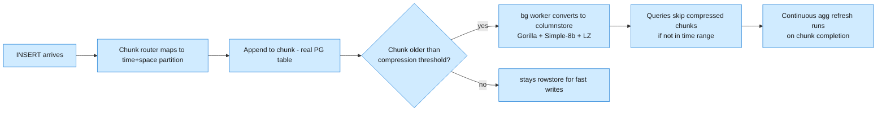

TimescaleDB turns PostgreSQL into a time-series database - not by forking it, but by extending it. You install it as a PG extension, get a hypertable you INSERT time-series data into, and every PG tool you already know (pg_dump, logical replication, PostGIS, pg_stat_statements) keeps working.

<!--more-->

## What It Is

TimescaleDB turns PostgreSQL into a time-series database - not by forking it, but by extending it. You install it as a PG extension, get a hypertable you INSERT time-series data into, and every PG tool you already know (pg_dump, logical replication, PostGIS, pg_stat_statements) keeps working. The company behind it rebranded to Tiger Data in 2025, but the database engine is still TimescaleDB.

> [!TIP]
> **The big idea: ordinary SQL on time-series data.** Most time-series databases (InfluxDB, Prometheus) force you into a custom query language. TimescaleDB says: your time-series data lives in a PostgreSQL table that you query with standard SQL. JOIN sensor readings to device metadata, run window functions across chunks, slap a continuous aggregate on a weekly rollup - all in the same engine, no ETL bridge needed.

## Core Concepts

| Concept | What it is | What you reach for it |
|---|---|---|
| **Hypertable** | A partitioned table split into chunks by time | The single table you write all your time-series data to |
| **Chunk** | A real PostgreSQL table holding a time slice | Enforces the partition boundary - constraint exclusion skips chunks outside the query range |
| **Continuous aggregate (CAGG)** | A materialized view that auto-refreshes on a schedule | Precomputed hourly/daily/weekly rollups so your dashboard doesn't scan raw data |
| **Hypercore / Columnstore** | Columnar compression engine (renamed in 2.18) | Converts older chunks from rowstore to columnar format - ~6-10x compression, faster single-column scans |
| **Chunk policy** | A rule that controls chunk interval + retention | `add_retention_policy('sensors', INTERVAL '30 days')` drops old chunks as full PG DROP TABLE |
| **Space partition** | A single HASH dimension across chunks | Distributes data from different device/sensor groups across chunks for parallel write (max 1 dimension, ≤16 partitions recommended) |
| **Hyperfunctions** | A collection of time-series-specific SQL functions | `time_bucket()`, `first()`, `last()`, `approx_percentile()`, `lttb()` for downsampling - these are what make the "PG for time-series" claim hold water |

For most projects you create exactly one hypertable per metric family, pick a chunk interval that lands 5M-50M rows per chunk, and add a continuous aggregate for each dashboard query you run more than once a day.

## How It Works (and Why It's Fast)

The performance story is a chain of four mechanical decisions.



**Step 1 - chunk partitioning.** When you INSERT a row, TimescaleDB routes it to the chunk whose time window covers the row's timestamp. Each chunk is a real PostgreSQL table - you can query it directly, vacuum it, or drop it with `DROP TABLE`. The chunk catalog tracks each chunk's `min_time` and `max_time`, so the planner knows which chunks to skip before the query even reads from disk.

**Step 2 - constraint exclusion.** If your query says `WHERE time > '2026-07-01' AND time < '2026-07-02'`, the planner looks up which chunks overlap that window and excludes everything else. With 200 chunks and a narrow window, you touch one chunk - roughly 99.5% less data scanned vs a full scan.

**Step 3 - columnar compression (Hypercore).** Once a chunk is old enough (default: 7 days), a background worker converts it from rowstore to columnar format. Floats get Gorilla compression (xor-of-floats, ~40 bytes per sample compressed to ~1 bit if values are stable). Integers and timestamps get Simple-8b with delta-of-delta encoding. Strings get LZ-based compression. Most workloads see 6-10x compression; IoT with repetitive sensor readings can hit 15x; UUID-heavy financial tick data lands closer to 2x.

**Step 4 - continuous aggregates.** A CAGG is a materialized view that auto-refreshes on a schedule. Instead of scanning billions of raw rows for every dashboard query, you query the precomputed hourly/daily/weekly rollup. Real-time aggregation merges the materialized data with still-raw data at query time, so you don't have to wait for the refresh to finish.

> [!TIP]
> **The key insight: compression is for old data, rowstore is for new data.** Most queries hit fresh data (the last 24 hours), which stays rowstore and stays fast. Old data is compressed columnar, which is slower for full-row scans but faster for the aggregate queries most dashboards actually run.

## What You Build With It

### IoT sensor ingest

You have 100,000 sensors reporting temperature, humidity, and pressure every 10 seconds. Each sensor writes a row. TimescaleDB eats this - ~1M rows/s on a single tuned node, assuming batched INSERTs. The gotcha is chunk interval: at 100K sensors x 6/min = 600K rows/min, an hourly chunk fills with ~36M rows (within the 5M-50M target), but setting it to 5 minutes would create 288 chunks a day, and after a week you'd be in planning-time hell.

```sql
SELECT create_hypertable('sensor_readings', 'time',
  chunk_time_interval => INTERVAL '1 hour');
```

> [!TIP]
> **Gotcha: chunk interval math.** Use `set_chunk_time_interval()` to target 5M-50M rows per chunk, compute it from your peak ingest rate. Too fine-grained and planning times explode from thousands of chunks. Too coarse and you cannot drop old data granularly.

### Financial tick data

Stock ticks, crypto trades, FX rates - the volume is insane (millions per second on major exchanges), but the data is append-only and queried mostly by symbol + time range. The pattern: hypertable partitioned by time with a space partition on symbol.

```sql
SELECT create_hypertable('trades', 'time',
  chunk_time_interval => INTERVAL '1 day',
  partitioning_column => 'symbol',
  number_partitions => 16);
```

Compression on financial ticks is the worst case - UUID trade IDs and float prices compress at ~3-6x, not the 10x+ you see in IoT. The query patterns (last price, OHLCV candles) benefit from continuous aggregates.

> [!TIP]
> **Gotcha: space partition penalty on ORDER BY time DESC LIMIT.** Without a filter on the space key, TimescaleDB must scatter-gather across all partitions. A "last 10 trades" query with 16 space partitions becomes 16 sub-queries. Always include a `WHERE symbol = 'BTCUSD'` clause.

### DevOps metrics dashboards

CPU utilization, memory, disk I/O, request latency from every host in your fleet. The pattern is Prometheus-like but with full SQL: you can compute p99 latency with `approx_percentile()` in a continuous aggregate, then JOIN that to host metadata (region, instance type) for a cost-per-request metric.

```sql
CREATE MATERIALIZED VIEW cpu_p99_hourly
WITH (timescaledb.continuous) AS
SELECT time_bucket('1 hour', time) AS bucket,
  approx_percentile(0.99, avg_cpu) AS p99_cpu
FROM cpu_metrics
GROUP BY bucket;
```

> [!TIP]
> **Gotcha: CAGG refresh lag.** Under heavy ingest, the refresh job can fall behind its schedule. Monitor `timescaledb_invalidation_log` for backpressure. Stagger your granularity: refresh hourly aggregates every 5 minutes, daily aggregates every hour.

### Real-time analytics on app events

Page views, clicks, purchases, errors - event-stream data that also needs relational JOINs. This is where TimescaleDB uniquely beats both InfluxDB (no JOINs) and ClickHouse (schema is less flexible). You model the events as a hypertable, run continuous aggregates for funnel metrics, and JOIN the event stream against a regular PG table holding user profiles or product catalog.

```sql
SELECT time_bucket('1 hour', e.time) AS hour,
  p.category,
  count(*) AS events
FROM events e
JOIN products p ON e.product_id = p.id
WHERE e.time > now() - INTERVAL '7 days'
GROUP BY hour, p.category;
```

> [!TIP]
> **Gotcha: autovacuum pressure on append-heavy hypertables.** Append-only tables have few dead tuples, but autovacuum still scans every chunk periodically. With hundreds of chunks, this wastes serious I/O. Set `autovacuum_vacuum_scale_factor = 0` and `autovacuum_vacuum_threshold = 10000000` on hypertables.

### Hybrid time-series + relational (JOIN sensor_data WITH devices)

The biggest differentiator. A smart building has 10,000 sensors, but each sensor belongs to a device model and a floor in a building. You store sensor reads in the hypertable, device metadata in a regular PG table, and JOIN them.

```sql
SELECT d.floor, avg(s.temperature)
FROM sensors s
JOIN devices d ON s.device_id = d.id
WHERE s.time > now() - INTERVAL '1 hour'
GROUP BY d.floor;
```

> [!TIP]
> **Gotcha: decompression overhead.** Even if a compressed chunk has 100M rows and your filter matches 1% of them, the entire compressed segment gets decompressed first. Use `segmentby` on the most-filtered column to limit decompression scope.

## Scaling and Availability

**Single-node** is where TimescaleDB lives. A well-tuned single node handles ~1M rows/s ingest and stores 5-20 TB compressed. With 50-200 concurrent queries, it runs as a heavy PG instance. The practical ceiling is your PG know-how - all the standard tuning (shared_buffers, work_mem, effective_cache_size) applies.

**Multi-node was removed in TimescaleDB 2.14 (Feb 2024).** It was an access-node + data-node topology that distributed chunks across servers. It had write-latency overhead (2-10ms per single-row insert), complexity in node management, and an eventual-consistency gap. Tiger Data decided to kill it rather than try to make it production-worthy. The replacement is **Tiger Cloud** managed: single-node on bigger hardware, with read replicas and tiered hot/warm/cold storage.

> ⚠️ **The failure that surprises people: chunk bloat.** If you set your chunk interval too aggressively (say, 60 seconds at 1M rows/s), you create 86,400 chunks a day. After a week, the planner spends seconds - not milliseconds - scanning chunk metadata for every query. Fix: `set_chunk_time_interval()` to target 5M-50M rows per chunk. Check `timescaledb_information.chunks` to see current chunk sizes.

**Read replicas** are available on Tiger Cloud (standard PG streaming replication). They work for time-series because most traffic is reads. **Enterprise** (announced April 2026) adds HA clustering, auto-failover, and incremental PITR for self-hosted deployments.

**Availability model:** single-node fails when PG fails. The standard PG resilience toolkit (pgBackRest, repmgr, Patroni) works because it's just PG. Just ensure your monitoring covers chunk counts - a hidden chunk balloon is the most common cause of mid-life performance degradation.

## Durability and Consistency

TimescaleDB inherits PostgreSQL's full ACID guarantees. This is the quiet killer advantage: you can write a batch of sensor data and a metadata update in the same transaction, and if it fails, neither lands. Most time-series databases (InfluxDB, Prometheus) compromise here - eventually consistent at best.

What this means in practice:

- **Transactions span chunks.** You can update device metadata in one chunk and insert sensor readings into another, wrapped in BEGIN/COMMIT.
- **Logical replication works.** You can stream a hypertable to a replica or a different PG database using standard publication/subscription.
- **What you cannot get:** read-after-write consistency across the entire dataset is not the optimization most time-series workloads need. The append-mostly pattern means WAL pressure is predictable.

## When to Use It / When Not To

**Great fit:**

- You need time-series storage AND relational JOINs in the same system
- Your team already knows PostgreSQL - the learning curve is an afternoon
- Your dataset fits on a single node (5-20 TB compressed) or fits on one with read replicas
- You need continuous aggregates for dashboard queries on large time series
- You value ACID compliance in your time-series path

**Wrong fit:**

- You need to store 100+ TB of time-series data and cannot vertically scale - without multi-node, the data must fit on single-node hardware
- You need sub-millisecond last-point lookups on trillions of events - TimescaleDB decompresses columnstore for full-row scans, and point lookups on compressed data are 5-10x slower than uncompressed
- You need zero-overhead massive-scale ingest across many shards - ClickHouse or your own Kafka-to-S3 pipeline is the better fit
- You want a zero-ops serverless time-series database - that is InfluxDB Cloud or a purpose-built TSDB service; TimescaleDB still expects you to manage PG

**Compared to alternatives:**

- **InfluxDB:** easier ingest, no JOINs, its own query language (Flux then SQL, still settling). Better at massive scale (if you trust the cluster). Worse at anything that needs a relation.
- **ClickHouse:** 2x-10x faster on columnar aggregate queries, handles petabyte-scale on cheap hardware. But no row-level transactions, no pg_dump, no declarative partitions that auto-drop cleanly. You manage it differently.
- **Vanilla PG + partitioning:** You can partition a PG table by time, but you must manage partitions by hand, get none of the chunk optimization (parallel chunk insert, hypercore compression, space partitioning across chunks), and lose continuous aggregates. The performance ceiling is much lower.

**Hard limits:**

- Max space partition keys per hypertable: 1 (HASH, recommended ≤16 partitions)
- Recommended chunk size: 5M-50M rows
- Practical max chunks per hypertable: ~100,000 (planning time degrades beyond this)
- Practical single-node ceiling: 5-20 TB compressed, 1-5 TB uncompressed

## Landscape and Editions

TimescaleDB has four editions plus a lightweight managed tier:

| Edition | License | What you get |
|---|---|---|
| **Apache 2** | Apache 2.0 (free) | Hypertables, basic chunk management, hyperfunctions. No compression, no CAGGs. Good for personal projects. |
| **Community (TSL)** | Timescale License v2 (free) | All Apache features + Hypercore/compression, CAGGs, tiered storage, retention policies. The real starting point for production. Cannot compete with Tiger Cloud as a managed DB service. |
| **Enterprise** | Commercial | All TSL + HA clustering, auto-failover, incremental PITR, admin console. Announced April 2026, GA later in 2026. For on-prem/edge deployments. |
| **Tiger Cloud** | Managed SaaS | All TSL + read replicas, zero-copy forks, MCP server, managed upgrades. Performance: $30/mo compute + $0.177/GB-mo storage (effective $0.035/GB-mo at 5x compression). Scale: $36/mo + $0.212/GB-mo. |
| **Ghost** | Managed (free tier) | Free: 100 compute-hr/mo + 1 TB storage. Ephemeral, MCP-native. $10/mo dedicated. Not for production workloads. |

The company (Timescale, now Tiger Data) has raised $180M+. The Tiger Cloud pricing model is hourly, pay-as-you-go, scale up/down freely. Third-party managed options exist (Aiven explicitly supports it; most others do not).

## Where It's Heading

A few bets visible from the 2026 roadmap:

**Enterprise self-hosted is a new push.** For years the only production self-hosted option was the TSL Community edition with no HA. Enterprise (April 2026) is Tiger Data's play for the on-prem/edge market, likely their biggest growth vector.

**Hypercore (columnstore) is still young.** Secondary indexes on compressed chunks arrived in 2.18 (Jan 2025). Expect more query-engine integration - partial decompression, index-only scans on columnstore, better last-point optimization.

**The MCP/agent angle via Ghost.** Ghost (GA June 2026) is an ephemeral, agent-targeted database - free tier, MCP-native, fast forking. This is a hedge: if AI agents generate lots of short-lived time-series workloads, TimescaleDB wants to be their backend of choice.

**PG 15 is going away.** Deprecated in 2.28.0 (June 2026), removed in 2.29. All users on PG 15 must schedule an upgrade. The upgrade path (`pg_upgrade` + `timescaledb_pre_upgrade()` / `timescaledb_post_upgrade()`) works but requires a downtime window proportional to data size.

**CAGG improvements keep coming.** 2.28.0 (June 2026) added incremental batches, lighter locks, and new tunables (`buckets_per_batch`, `max_batches_per_execution`, `refresh_newest_first`). The continuous aggregate story is getting more robust for real-time workloads.

## References

1. [TimescaleDB Official Documentation](https://docs.timescale.com/latest/introduction/)
1. [TimescaleDB GitHub Repository](https://github.com/timescale/timescaledb)
1. [TimescaleDB 2.14.0 Release Notes (multi-node removal)](https://api.github.com/repos/timescale/timescaledb/releases/tags/2.14.0)
1. [TimescaleDB 2.28.0 Release Notes (PG 15 deprecation, CAGG improvements)](https://api.github.com/repos/timescale/timescaledb/releases/tags/2.28.0)
1. [Tiger Cloud Pricing](https://tigerdata.com/pricing)
1. [Tiger Data Rebrand Announcement (2025-06-17)](https://tigerdata.com/blog/becoming-tiger-data)
1. [TimescaleDB Enterprise Announcement (2026-04-20)](https://tigerdata.com/blog/timescaledb-enterprise)
1. [Ghost GA Announcement (2026-06-09)](https://tigerdata.com/blog/ghost-ga)
1. [Timescale Compression Docs (compression ratios)](https://docs.timescale.com/latest/compression/)
1. [TimescaleDB TSL License](https://github.com/timescale/timescaledb/blob/main/tsl/LICENSE-TIMESCALE)
