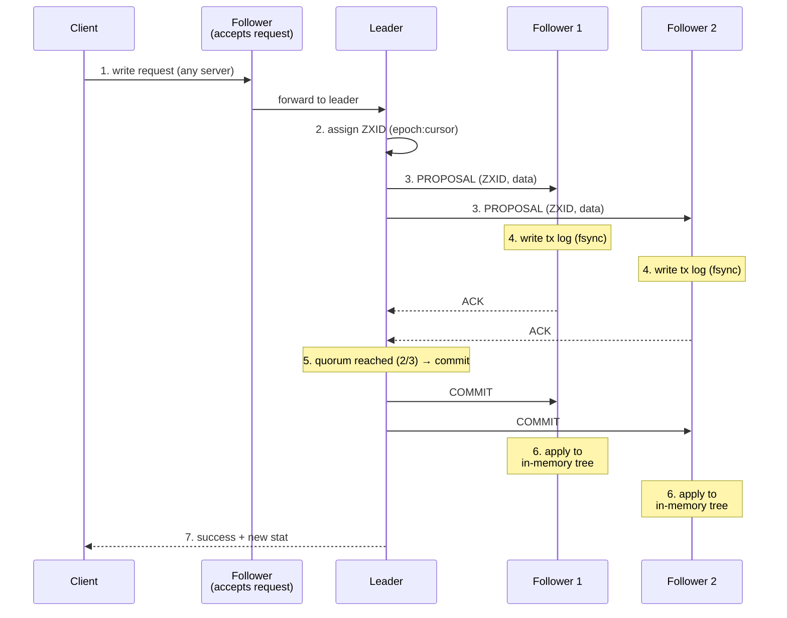
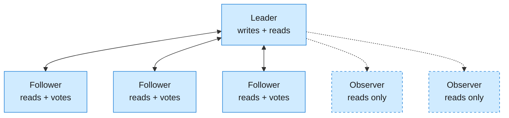

ZooKeeper is a reliable coordination service for distributed systems - the infrastructure that keeps configuration, service discovery, leader election, and distributed locks working across a cluster of machines.

<!--more-->

## What it is

ZooKeeper is a reliable coordination service for distributed systems - the infrastructure that keeps configuration, service discovery, leader election, and distributed locks working across a cluster of machines. Its mental model is a filesystem-like tree of ZNodes, where each node stores small coordination data (config values, service addresses, rendezvous points), backed by Zab (ZooKeeper Atomic Broadcast) consensus to ensure every server agrees on state. ZooKeeper solved a real problem: before it existed, distributed coordination meant ad-hoc Paxos implementations, manual DNS SRV records, or fragile heartbeating - every team reinvented the same buggy wheel. Today, ZooKeeper is the layer underneath Kafka (broker metadata), HBase (region assignment), and many other distributed systems, though the KRaft migration is rapidly removing the Kafka dependency.

> [!TIP]
> **ZooKeeper's one big design choice:** a single leader processes all writes (linearizable via Zab quorum), while every follower serves reads from its in-memory replica (sequentially consistent, low latency, zero consensus overhead). This gives strong consistency for writes without bottlenecking reads. Reads are NOT linearizable - you get a consistent snapshot that may be slightly stale.

## Core concepts

**ZNodes - the coordination data model.** The namespace is a hierarchical tree, like a filesystem. Each ZNode stores small data (1 MB hard limit, practical max ~10 KB) plus metadata (ACLs, version counters, creation/ modification timestamps). Five types: **persistent** (survive forever), **ephemeral** (auto-deleted when the creating client's session expires - the heart of health tracking), **sequential** (monotonically increasing 10-digit suffix appended to name), **container** (auto-deleted when last child is removed, 3.5.3+), and **TTL** (deleted if unmodified past TTL, 3.5.3+, disabled by default). Sequential ZNodes are the primitive for leader election and distributed locks: the numeric suffix creates an ordered queue in the tree. Every ZNode has a version counter; updates with the wrong version are rejected - ZooKeeper's optimistic concurrency model.

**Ensemble - the cluster.** ZooKeeper runs on an odd-numbered set of servers called an ensemble (3, 5, or 7). **Leader** - one elected server that handles ALL writes, guaranteeing strict ordering. **Followers** - voting members that replicate the leader's state, serve reads, and participate in Zab quorum. **Observers** (3.3.0+) - non-voting read replicas that scale read capacity with zero write-path overhead. Quorum = `floor(N/2) + 1`. A 5-node ensemble tolerates 2 simultaneous failures - the standard production configuration. A 3-node ensemble tolerates 1. A 4-node ensemble tolerates the same 1 failure as 3 but costs more: always use odd counts.

**Watches - no-polling notifications.** Clients set watches on ZNodes and receive a notification when the data changes, the ZNode is deleted, or children change - no polling needed. This enables the **local-cache pattern**: cache ZK state locally, update only on watch notification. Critical detail: standard watches are **one-shot** - after delivering the notification, the watch is removed and must be re-registered. The gap between notification and re-registration can miss intermediate changes. Persistent watches (`addWatch()`, 3.6.0+) and recursive watches eliminate this race. Watch delivery is ordered: the client sees the watch event before it can read the new data.

## How it works

### Write Path - Zab Consensus

**The ZXID is 64 bits: high 32 = epoch (leadership term), low 32 = counter.** On leader change, the new leader increments the epoch and resets the counter. This is how Zab identifies the most up-to-date server during elections - the candidate with the highest ZXID has the most recent committed state.

### Ensemble Topology

**The read path is the simplest part of ZooKeeper.** Clients send a read request to any server (leader, follower, or observer). The server looks up the data in its local in-memory tree and returns the value plus stat metadata - no consensus, no fsync, no round-trips. A follower can serve tens of thousands of reads per second from RAM. The trade-off is sequential consistency: the data is from a recent committed snapshot, not guaranteed to be the absolute latest. For stronger guarantees, call `sync()` before reading (which flushes the leader's pipeline) or perform a write to get a linearizable read.

**Session lifecycle and ephemerals.** When a client connects, it gets a session ID + password and a negotiated timeout (clamped to 4-40 s by the server). The client sends heartbeats (PING) when idle. If the server misses heartbeats for the full session timeout, it expires the session: all ephemeral ZNodes created by that client are deleted, and watchers are notified. This gap is the **3-heartbeat window** - a crashed process appears alive until its session timeout expires (up to 40 s by default). On reconnection within the timeout, the client resumes its session. After timeout, the session is expired and all ephemerals are gone.

## What you build with it

**Configuration management.** Store config values in persistent ZNodes. Services call `getData(watch=true)` on startup and re-register watches in callbacks. Config changes propagate live - no restart required.

> [!TIP]
> **Gotcha:** standard watches are one-shot; the gap between notification and re-registration can miss an update. Use persistent watches (`addWatch()`, ZK 3.6+) to eliminate the race, or re-read the path on every reconnect.

**Service discovery.** Services create ephemeral ZNodes under `/services/<name>/` on startup, containing their connection address. Clients list the children and set child watches. When a service crashes, its session expires, the ephemeral node is auto-deleted, and all watchers are notified - zero polling.

> [!TIP]
> **Gotcha:** there is a detection window: after a crash, the ephemeral node survives until the session timeout elapses (up to 40 s). During this window, the dead instance appears alive. Use short session timeouts (4-6 s) for failure-sensitive services.

**Leader election.** The canonical recipe: each candidate creates an ephemeral sequential ZNode under `/election/`. The candidate with the **smallest** sequence number is the leader. Each candidate watches only its immediate predecessor - NOT the leader itself. When the leader fails, its ephemeral node disappears, which fires the watch on the next candidate, which then checks if it's now the smallest. The herd effect is avoided because each deletion wakes exactly one client. If all candidates watched the leader, a leader failure would trigger N simultaneous `getChildren()` calls - a burst that can overwhelm the ensemble.

**Distributed locks.** Same sequential ephemeral pattern as leader election, scoped to a resource path (`/locks/<resource>/`). Lowest sequence = lock holder; others watch the predecessor. For shared (read/write) locks: read-lock contenders wait only for preceding write-locks, so multiple readers can hold the lock concurrently.

> [!TIP]
> **Gotcha:** a lock in ZooKeeper is a lease, not a mutex: if the lock holder dies, its ephemeral node persists until session timeout. During this window, the lock is unavailable. Short session timeouts and application-level heartbeats mitigate this.

## Scaling and availability

**Writes bottleneck at the leader.** Every write must go through the leader and be committed by Zab quorum - ~10-15K writes/s on a 3-node ensemble with SSDs and dedicated tx log devices. Larger ensembles slow writes further: a 5-node ensemble does ~6-10K writes/s (every follower must ack). Observers do NOT help write throughput (they don't vote). The write throughput ceiling is a function of the leader's CPU and the network round-trip to the slowest follower.

**Reads scale linearly.** Each follower or observer serves reads from RAM without consensus overhead - ~20-30K reads/s per node. A 5-node ensemble with 3 followers can sustain ~60-90K reads/s. Adding Observers scales reads further with zero impact on write throughput. This asymmetry (writes hard-bottlenecked, reads linear) is the defining performance characteristic of ZooKeeper.

**Failure detection window.** The server detects a failed client after `sessionTimeout` (4-40 s). During this window, the client's ephemeral nodes persist. For server-to-server failure detection, the default tickTime is 2000 ms and syncLimit is 5 ticks (10 s). This window is intentional - it prevents spurious leader elections from transient network blips - but it means that failure detection is never immediate.

**Zombie leader gotcha.** If the leader process is paused (SIGSTOP, long GC pause) longer than the session timeout, the ensemble detects the silence and elects a new leader. When the paused process resumes, it still believes it is the leader and may serve stale data or attempt writes with an obsolete epoch. ZooKeeper's Zab protocol rejects such writes at the consensus layer (the stale leader's epoch is too low), but a zombie leader serving stale reads is a client-side problem. Mitigation: handle `SessionExpiredException` by immediately stepping down, and configure JVM with `-XX:OnOutOfMemoryError='kill -9 %p'`.

**Ensemble sizing.** 3 nodes = minimal production (tolerates 1 failure). 5 nodes = sweet spot (tolerates 2, provides enough throughput for most workloads). 7 nodes = maximum practical (tolerates 3, but write throughput degrades noticeably). Never use even numbers: 4 tolerates the same 1 failure as 3 but costs 33% more. Cross-AZ configuration is strongly discouraged - ZooKeeper is sensitive to inter-DC latency; RTT over 5 ms causes spurious leader elections.

## When to use and when NOT to use

**Great for:** infrastructure coordination that fits in RAM - Kafka broker state (though KRaft is taking over), HBase region assignment, SolrCloud cluster state, Hadoop YARN ResourceManager HA, configuration distribution across a fleet, service discovery with health tracking, and durable distributed locks at the infrastructure scale.

**NOT for:** per-request coordination (the leader bottleneck kills throughput at high concurrency), high-write-throughput workloads (10K writes/s ceiling is low by modern standards), anything that doesn't fit in RAM (the entire dataset is in memory on every server - 1-10 GB practical max), or cross-region / high-latency networks (ZooKeeper is intolerant of >5 ms RTT between ensemble members).

**Hard limits:** 1 MB ZNode data size (hard-enforced by the server; practical max ~10 KB). Entire dataset must fit in RAM on every server (1-10 GB practical, ~1-5 M ZNodes). Session timeout clamped to 4-40 s. 32-bit signed sequential counter overflows at 2.14 billion. Server ID range 1-255. Reads are NOT linearizable (stale reads possible without `sync()` or a quorum read). Dedicated SSD for transaction log is REQUIRED in production.

## Landscape

**Apache ZooKeeper OSS (Apache 2.0)** is the reference implementation, currently at 3.9.5 (Feb 2026) with 3.8.6 as the stable line. ~12,800 GitHub stars, ~7,300 forks. ~75 commits/year. In mature maintenance mode - security patches, JDK modernization (minimum JDK 17), Prometheus observability, no new APIs or consensus changes on the roadmap. GitHub activity is steady but not growing.

**etcd (CNCF Graduated, Apache 2.0)** is the Kubernetes-native alternative - gRPC API, Raft consensus, watch-based notifications, ~52K GitHub stars. Best default for any new system that runs on (or alongside) Kubernetes. Less mature service-discovery tooling than ZK or Consul, but the ecosystem (etcdctl, embedded etcd, Kine for K8s API storage) is comprehensive.

**Consul (HashiCorp, BSL)** adds service discovery and health checking on top of a Raft-backed KV store - HTTP/DNS API, multi-DC out of the box, built-in service mesh (Consul Connect). The health-check system is more mature than ZooKeeper's ephemeral-node pattern. BSL license change (2023) caused community forks but HashiCorp remains the dominant vendor.

**Apache Curator (Apache 2.0)** is the essential Java library for ZooKeeper - it implements all the standard recipes (leader election, locks, barriers, caches) as tested, production-grade abstractions. ~3,200 GitHub stars. Curator 2.0 (June 2026) is the latest. Using ZooKeeper without Curator means reimplementing every recipe from scratch - including the subtle edge cases around connection loss, session expiry, and watch re-registration. Curator solves all of these.

**ClickHouse Keeper (Apache 2.0)** is a C++ drop-in replacement for ZooKeeper - wire-protocol compatible, 5x lower memory usage, 2-3x faster per ClickHouse benchmarks. ClickHouse replaced its internal ZK dependency with Keeper, proving that a purpose-built ZK implementation can outperform the original without protocol changes.

**The KRaft migration.** Kafka was by far the largest ZooKeeper deployment - estimated 60-80% of all production ZK ensembles by count, >90% by QPS. KIP-500 (2019)  to  production-ready in Kafka 3.3 (Oct 2022)  to  KRaft-only in Kafka 4.0+ (2025). Confluent Cloud has run KRaft since 2024; AWS MSK defaults to KRaft since Feb 2025. Every `zookeeper.connect` property in the Kafka config is gone. This single migration has removed ZK from the largest category of its usage and is the dominant reason ZooKeeper has shifted to maintenance-mode perception.

## Where it is heading

**ZooKeeper is in mature maintenance mode** and will remain there for the foreseeable future. 75 commits/year, no new protocol-level features, no performance breakthroughs. The active work is CVE fixes, JDK 17 to 21 to 25 compatibility, Prometheus metrics, and supply-chain hardening. The maintainer pool is slowly shrinking but the project is not abandoned - Apache still ships point releases.

**KRaft adoption continues to accelerate**, removing ZooKeeper from Kafka deployments. Most new Kafka installations since 2025 are KRaft-based. The remaining ZooKeeper-dependent projects (SolrCloud, HBase, YARN, NiFi, Druid) are themselves in maintenance mode - none are growing or attracting new users. The installed base of ZK-powered data infrastructure is large and will need patching for years, but new infrastructure uses etcd.

**The bottom line for 2026:** if you already run ZooKeeper, keep it (it's stable, well-understood, and supported). For new coordination needs, etcd is the default. For new Kafka deployments, KRaft (no ZK). For new ClickHouse deployments, Keeper (wire-compatible with ZK). ZooKeeper's legacy is the set of ideas it pioneered - ephemeral health tracking, sequential ordering for leader election, watch-based notifications - which every modern coordination system has adopted.

## References

1. [Apache ZooKeeper 3.9 Documentation](https://zookeeper.apache.org/doc/current/)
1. [ZooKeeper Programmer's Guide - ZNodes, Watches, Sessions](https://zookeeper.apache.org/doc/current/zookeeperProgrammers.html)
1. [ZooKeeper Internals - Zab, ZXID, Consistency Guarantees](https://zookeeper.apache.org/doc/current/zookeeperInternals.html)
1. [ZooKeeper Admin Guide - Configuration, Ensemble Setup](https://zookeeper.apache.org/doc/current/zookeeperAdmin.html)
1. [ZooKeeper Recipes (Leader Election, Locks, Barriers)](https://zookeeper.apache.org/doc/current/recipes.html)
1. [Apache ZooKeeper Releases - 3.9.5 / 3.8.6](https://zookeeper.apache.org/releases/)
1. [Apache ZooKeeper GitHub](https://github.com/apache/zookeeper)
1. [Apache Curator - ZooKeeper Recipe Library](https://curator.apache.org/)
1. [etcd - CNCF Graduated, K8s-native](https://etcd.io/)
1. [HashiCorp Consul Documentation](https://www.consul.io/docs)
1. [ClickHouse Keeper - C++ ZK Replacement](https://clickhouse.com/docs/en/operations/clickhouse-keeper)
1. [KIP-500: Replace ZooKeeper with KRaft](https://cwiki.apache.org/confluence/display/KAFKA/KIP-500+%3A+Replace+ZooKeeper+with+a+Self-Managed+Metadata+Quorum)
1. [Zab: High-performance Broadcast for Primary-backup Systems (USENIX ATC 2010)](https://www.usenix.org/legacy/event/atc10/tech/full_papers/Medeiros.pdf)
