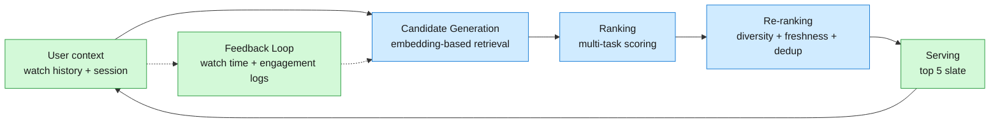

A billion people watch videos every day across a corpus of a billion uploads. After each video finishes, the system serves 5 recommendations — the "Up Next" slate.

<!--more-->

## 1. Problem & ML framing

A billion people watch videos every day across a corpus of a billion uploads. After each video finishes, the system serves 5 recommendations — the "Up Next" slate. The business objective is to maximize total watch time: longer sessions mean more ads served, more creator content consumed, and stronger platform retention. Purely optimizing for clicks produces clickbait that users abandon after 10 seconds; optimizing for watch time aligns the system with what keeps people on the platform.

The ML task is **multi-objective candidate retrieval and ranking**: given a user's watch history, search history, demographic signals, and the current context (time of day, device, session state), score every video in the corpus for expected watch time and engagement probability, then serve the top 5. A single model scoring a billion videos per request is infeasible, so the system runs as a three-stage funnel: **candidate generation** narrows the corpus from billions to thousands, **ranking** scores those thousands to hundreds with a deep multi-task model, and **re-ranking** applies policy constraints — diversity, creator deduplication, freshness — to produce the final slate of 5.

The retrieval stage maps users and videos to a shared embedding space where proximity predicts watch time. The user encoder transforms watch history and demographic features into a dense vector; the item encoder transforms video metadata and content signals into the same space, and a dot product scores every pair. At serving time, the user embedding queries an approximate nearest neighbor index over precomputed item embeddings, returning the top ~1000 candidates in under 10ms.

The ranking stage scores these candidates with a deep multi-task model. A cross network learns explicit bounded-degree feature interactions; a parallel deep network learns implicit representations. Multiple expert towers share lower layers, and learned gates route each task's gradient through the most relevant experts. The primary task predicts expected watch time via weighted logistic regression; auxiliary tasks predict click, like, share, and subscribe. The combined score determines rank order.

Re-ranking applies a policy layer: a diversity mechanism trades off score against similarity to already-selected items, a creator dedup rule caps any single creator at 2 of 5 slots, and a freshness boost gives recently uploaded videos a small additive score bump.

## 2. Requirements

**Functional**

- FR1: Receive 5 personalized video recommendations after completing a watch
- FR2: Discover newly uploaded videos within hours of publication
- FR3: See diverse recommendations across creators and topics
- FR4: Get recommendations that reflect recent watch history shifts
- FR5: Signal satisfaction through watch time, likes, shares, and subscribes
- FR6: See fewer repeated recommendations from the same creator

**Non-functional**

- NFR1: p99 serving latency under 200ms end-to-end
- NFR2: 99.9% availability; degraded mode serves global-popular fallback
- NFR3: New video embeddings available within 1 hour of upload
- NFR4: Model retrained daily on fresh engagement data
- NFR5: 1B DAU, 1B video corpus at sustained peak load

*Out of scope: ad placement and sponsored content ranking, search ranking, live stream recommendations, notifications and email digests, creator-side analytics, content moderation and policy enforcement.*

## 3. Metrics

**Offline**

- **Recall@K (K=100, 500, 1000):** Fraction of held-out watched videos that appear in the top-K candidates from retrieval. Primary retrieval metric — a recall gap here cannot be recovered downstream.
- **nDCG@K per video age bucket:** Normalized discounted cumulative gain computed separately for videos uploaded in the last hour, last day, last week, and older. A single aggregate nDCG hides that the model ignores fresh content; per-bucket breakdowns expose cold-start regressions.
- **HitRate@K per user activity decile:** Fraction of users who watch at least one recommended video from the top-K slate, stratified by how many videos the user watched in the prior week. Heavy users dominate aggregate metrics; this breakdown surfaces whether the model serves light users well.
- **Expected watch time calibration:** Compare predicted watch time against actual watch time in quantile buckets. A model that systematically overpredicts for certain video durations or categories drives bad ranking decisions even if ranking metrics look fine.

**Online**

- **Total watch time per session** (north star): Aggregate minutes watched across all recommendations in a session. A 3% lift here means users stay 3% longer.
- **Positive engagement rate:** Fraction of recommended impressions that result in a like, share, or subscribe. A pure watch-time optimizer can drift toward passive-consumption content; this guardrail catches that.
- **Session completion rate:** Fraction of sessions that end with a user-initiated action (search, browse) rather than a passive exit. A declining rate signals the feed went stale.
- **Creator diversity (guardrail):** Fraction of sessions where >80% of recommendations come from a single creator. Above a threshold — typically 15% of sessions — the system is over-concentrating.

## 4. Data

**Sources**

- **Watch logs (billions/day, implicit):** Every video impression records user_id, video_id, watch time (seconds watched / video duration), and context (timestamp, device, previous video in session). This is the primary training signal — no explicit rating needed.
- **Engagement logs (hundreds of millions/day):** Likes, shares, subscribes, comments — weaker signal than watch time (sparse, subject to presentation bias) but essential for multi-task training and diversity guardrails.
- **Video metadata (per upload):** Title, description, tags, language, duration, upload timestamp, creator_id, thumbnail features. Static after upload; re-indexed when the creator edits metadata.
- **Content embeddings (per video, batch):** Visual and audio features extracted via pretrained models — scene embeddings from a ViT variant, audio fingerprint embeddings, text embeddings from the title/description. Computed once at upload, stored alongside metadata.

**Label construction**

Watch time is continuous but the model consumes it as a binary classification target through weighted logistic regression: a "positive" is a click (any watch > 0 seconds), and each positive example is weighted by observed watch time. The cross-entropy loss on weighted positives produces a calibrated odds ratio that approximates expected watch time — the model learns P(watch) and the weight pulls the decision boundary to favor longer watches.

Engagement labels are binary: clicked (watch > 0s), liked, shared, subscribed. These are noisy — a user may like a video without watching it through, or watch a full video without liking it — but at scale the noise washes out and the joint signal across tasks is stronger than any single task alone.

**Class balance and negative sampling**

The ratio of positive to negative impressions is about 1:100 — the user scrolls past 100 thumbnails for every one they click. Training on the raw stream produces a model biased toward predicting "no click" everywhere. The retrieval stage uses sampled softmax with ~1000 in-batch negatives plus ~100 random negatives per positive; the ranking stage downsamples negatives to a 1:10 ratio during training and corrects the predicted probability with a calibration layer at serving time.

**Time-based splits**

Train on the oldest 28 days of data, validate on the next 3 days, test on the most recent 3 days. Random splitting across time leaks future information — a model that sees a video's eventual popularity in its training set will appear to predict it well but fail in production. Time-stratified evaluation catches temporal drift: the test set videos and user behaviors differ from the training distribution in ways that matter.

**Scale**

At steady state: ~1B impressions/day × 50 features × 4 bytes ≈ 200 GB/day of raw feature logs. After aggregation and feature engineering, the training dataset for the ranking model is ~500 GB per day. The two-tower retrieval model trains on the full impression stream but only requires user_id, video_id, and watch time — ~50 GB/day compressed.

## 5. Features

**User features**

- **Watch history sequence:** Last 50 watched video IDs with watch time ratios, encoded through an embedding layer then aggregated via average pooling (retrieval) or a Transformer encoder (ranking). This is the single most predictive feature group.
- **Search history:** Last 20 search queries, embedded via a pretrained query encoder. Captures explicit intent — a user searching "rust tutorial" should see Rust content even if their watch history is Python.
- **Demographic:** Language preference, registered country, account age bucket. Weak signals individually; useful for cold-start users and geographic content relevance.
- **Explicit topic affinities:** Aggregated across watch history using a hierarchical topic taxonomy. Updated daily in batch, served from the feature store alongside real-time features.

**Item features**

- **Video embedding (content tower output):** A 256-dimensional vector produced by the item tower of the retrieval model. Encodes visual, audio, and textual signals into a compact representation used for both ANN retrieval and as a ranking feature.
- **Metadata:** Duration bucket, upload age (hours since publication), language, creator_id, content category from the topic taxonomy.
- **Historical aggregates:** 7-day and 30-day watch time, CTR, engagement rate, and subscriber conversion rate. These are popularity signals — useful but dangerous if over-weighted (they amplify the rich-get-richer dynamic).

**Context features**

- **Time of day and day of week:** Embedded as cyclic features (sin/cos of hour and weekday). A user watches news in the morning and gaming at night — the model needs to know when the request arrives.
- **Device type and network:** Mobile vs. desktop, WiFi vs. cellular. Short-form content performs better on mobile/cellular; long-form on desktop/WiFi.
- **Session position:** How many videos the user has watched in the current session. Late-session recommendations drift toward familiar content; early-session recommendations include more exploration.

**Feature store**

Online features are served from a dual-layer store: a hot Redis cluster holds real-time features (current session state, last 50 watched videos) with sub-millisecond reads, and a periodically refreshed embedding cache holds user and item embeddings computed by the latest model checkpoint. Offline features for training are logged at serving time — every request writes the exact feature vector used, plus the model version, to a feature log — ensuring training-serving parity: the training pipeline reads the same features the model saw, not a separately recomputed version with different timing or transformation.

## 6. Model

Before building a multi-stage deep learning system, consider a simple baseline to establish the minimum viable performance bar. For retrieval, serve globally popular videos — the 1000 most-watched videos in the last 24 hours — with no personalization. For ranking, train a logistic regression on user and item features (watch history aggregates, video metadata, context features) to predict click probability, then rank by predicted score. This baseline is cheap to build and easy to debug, but it fails in ways that motivate each stage of the full system: global popularity ignores user preferences entirely (a Python programmer and a makeup enthusiast see the same recommendations), and logistic regression cannot capture feature interactions (the combination "user watches creator X + video is in category Y + it is nighttime" carries signal that a linear model discards). The three-stage funnel below addresses these gaps: retrieval personalizes via learned embeddings, ranking captures non-linear feature interactions via a deep cross network, and re-ranking enforces diversity and freshness constraints that a pure scoring model ignores.

#### Candidate generation: two-tower retrieval

The retrieval model learns a shared embedding space where dot product predicts watch probability. The user tower consumes watch history (50 IDs → embedding lookup → average pool), search history, and demographic features through a series of fully connected ReLU layers, outputting a 256-dimensional user embedding *u*. The item tower consumes video metadata and content embeddings through a similar architecture, outputting a 256-dimensional item embedding *v*. The score is *u·v*.

Training uses **sampled softmax**: for each positive (user, video) pair from watch logs, sample ~1000 negatives — a mix of in-batch negatives (other videos in the same mini-batch, efficient but biased toward popular items) and random negatives (uniform sample from the corpus, unbiased but noisy). The loss is standard softmax cross-entropy over the positive item and all negatives, with logits *u·v_i* for each candidate *i*. In-batch negatives share the same user embedding computation, making training efficient: one forward pass produces scores for all (user, video) pairs in the batch.

A critical detail is **L2 normalization** of both embeddings before the dot product. Without normalization, popular videos develop larger embedding norms over time — their dot products dominate the softmax and the model learns to recommend popular items regardless of user relevance. Normalization turns the dot product into cosine similarity, which removes the norm bias. At serving time, normalized embeddings also enable efficient ANN search: ScaNN builds an index over the L2-normalized item embeddings, and a query with the L2-normalized user embedding retrieves the top-K by cosine similarity in under 10ms at 1B scale.

The user embedding is computed online per request; item embeddings are recomputed daily in batch and pushed to the ANN index.

#### Ranking: DCN-V2 with MMoE

The ranking model scores the ~1000 candidates from retrieval with a richer feature set and a more expressive architecture. DCN-V2 combines two parallel networks:

- **Cross network:** Learns explicit feature interactions as *x_{l+1} = x_0 ⊙ (W_l x_l + b_l) + x_l*, where *x_0* is the input feature vector and *⊙* is element-wise multiplication. Each layer adds a bounded-degree polynomial interaction term. Two to three cross layers capture feature crosses like "user watched creator X in category Y on mobile at night" — combinations a pure MLP would need many more parameters to approximate.
- **Deep network:** A standard stack of fully connected ReLU layers learning implicit representations that the cross network's polynomial form cannot capture.

The outputs of both networks are concatenated and passed to a **Multi-gate Mixture-of-Experts (MMoE)** layer. Instead of a single shared bottom, MMoE maintains *E* expert networks (each a small MLP) and *T* task-specific gating networks. Each gate produces a softmax over experts: *g^t(x) = softmax(W_{gate}^t x)*. The task tower receives *Σ_e g_e^t(x) · expert_e(x)* — a weighted combination of expert outputs. Experts that learn overlapping patterns (e.g., the correlation between long watch time and subscribe) share gradients; experts that learn conflicting patterns (e.g., clickbait produces short watches but high CTR) are gated differently per task, avoiding the negative transfer that plagues a shared-bottom architecture.

**Tasks and loss:**

| Task | Head | Loss |
|---|---|---|
| Watch time | Logistic regression, weighted by seconds watched | Weighted cross-entropy |
| Click | Logistic regression | Binary cross-entropy |
| Like | Logistic regression | Binary cross-entropy |
| Share | Logistic regression | Binary cross-entropy |
| Subscribe | Logistic regression | Binary cross-entropy |

The combined loss is a weighted sum: *L_total = w_watch · L_watch + w_click · L_click + w_like · L_like + w_share · L_share + w_sub · L_sub*, with *w_watch = 1.0* (primary) and auxiliary weights tuned so each task contributes roughly equally to the total gradient norm. The final ranking score is a linear combination of predicted watch time and engagement probabilities, with combination weights set via online Bayesian optimization against the north-star metric.

Training uses AdaGrad with a batch size of 512-1024 per GPU, data-parallel distributed training across 8-16 GPUs, and a daily retraining cadence. The previous day's checkpoint warm-starts training, so the model adapts incrementally rather than training from scratch.

#### Re-ranking: policy layer

The re-ranker takes the top ~100 scored candidates and selects the final 5. It applies three operations in sequence:

1. **MMR (Maximal Marginal Relevance):** Greedy selection where each next pick maximizes *score(v) − λ · max similarity(v, already_selected)*. Similarity is computed as cosine similarity between the ranking model's final hidden representations. λ controls the diversity-vs-relevance trade-off; tuned to λ = 0.3 based on online experiments.
1. **Creator dedup:** After MMR selection, if any creator occupies 3+ slots, replace the lowest-scoring duplicate with the highest-scoring candidate from a different creator. Hard cap at 2 per creator.
1. **Freshness boost:** Videos uploaded in the last 24 hours receive *score ← score × (1 + α · max(0, 1 − age_hours/24))* with α = 0.05. A 1-hour-old video gets a 4.8% boost; a 23-hour-old video gets a 0.2% boost. This is small enough that it only breaks ties among similarly scored candidates — a deeply irrelevant fresh video still won't beat a highly relevant older one.

## 7. Architecture

#### Offline training pipeline

```mermaid
graph LR
    Logs["Feature Logs<br/>impressions + engagements"]
    Validation["Data Validation<br/>schema + distribution checks"]
    Featurize["Feature Engineering<br/>join + aggregate + embed"]
    Train["Distributed Training<br/>GPU cluster, AdaGrad"]
    Eval["Model Evaluation<br/>offline metrics + calibration"]
    Registry["Model Registry<br/>versioned checkpoints"]

    Logs --> Validation
    Validation --> Featurize
    Featurize --> Train
    Train --> Eval
    Eval --> Registry

    classDef log fill:#fff3bf,stroke:#f08c00,color:#1a1a1a;
    classDef compute fill:#d0ebff,stroke:#1c7ed6,color:#1a1a1a;
    classDef store fill:#d3f9d8,stroke:#2f9e44,color:#1a1a1a;
    class Logs log;
    class Validation,Featurize,Train,Eval compute;
    class Registry store;
```

The pipeline runs daily, triggered after the previous day's engagement logs finalize (typically 2am UTC). Steps execute in order:

1. **Data validation:** Schema checks (missing columns, type mismatches) and distribution checks (feature mean/variance drift vs. last week). A distribution check failure pages the on-call but does not block training — stale features are better than no model update.
1. **Feature engineering:** Joins impression logs with video metadata and user profile snapshots. Applies the same transformation code that runs in the online feature store — a shared library imported by both the training pipeline and the serving infrastructure. Every transformation is deterministic given the input features and timestamp; every transformation runs through the same shared library, ensuring online and offline paths stay identical.
1. **Distributed training:** The ranking model trains on 8-16 GPUs with data parallelism. Each GPU processes a shard of the daily data, computes gradients, and synchronizes via all-reduce. The retrieval model trains separately — it only needs (user_id, video_id, watch_time) triples, and its 256-dimensional embeddings fit comfortably on a single GPU for a day's data.
1. **Evaluation:** Compute offline metrics (Recall@K, nDCG@K per age bucket) against the held-out test set. Run calibration checks on predicted vs. actual watch time quantiles. If Recall@100 drops >2% from the previous model, block the push and alert.
1. **Model registry:** The validated checkpoint is versioned and pushed to the model registry. Item embeddings are precomputed in batch, L2-normalized, and pushed to the ScaNN index. User tower weights are pushed to the online serving infrastructure where they are loaded into memory for real-time user embedding computation.

#### Online serving pipeline

```mermaid
graph LR
    Request["Client Request<br/>user_id + context"]
    UserFeatures["Feature Store<br/>user history + embeddings"]
    Retrieval["Candidate Generation<br/>ANN via ScaNN<br/>~1K candidates"]
    ItemFeatures["Feature Hydration<br/>item metadata + embeddings"]
    Rank["Ranking Model<br/>DCN-V2 MMoE<br/>score ~1K candidates"]
    ReRank["Re-ranking<br/>MMR + dedup + freshness<br/>select top 5"]
    Response["Response<br/>5 video IDs + scores"]

    Request --> UserFeatures
    UserFeatures --> Retrieval
    Retrieval --> ItemFeatures
    ItemFeatures --> Rank
    Rank --> ReRank
    ReRank --> Response

    classDef compute fill:#d0ebff,stroke:#1c7ed6,color:#1a1a1a;
    classDef store fill:#d3f9d8,stroke:#2f9e44,color:#1a1a1a;
    class Retrieval,Rank,ReRank compute;
    class UserFeatures,ItemFeatures store;
    class Request,Response store;
```

Serving is synchronous within the 200ms budget. Each stage consumes a latency allocation:

1. **Feature fetch (5-10ms):** Read user features from Redis — watch history, search history, session state. Read precomputed user embedding from the embedding cache if the user's watch history hasn't changed since the last request.
1. **Candidate generation (10-15ms):** Compute the user embedding via the user tower (a small forward pass on CPU), then query the ScaNN index for the top ~1000 item IDs by cosine similarity. ScaNN with 4-bit quantization achieves >99% recall@1000 on a 1B-item corpus at this latency.
1. **Feature hydration (5-10ms):** Batch-read item features for the 1000 candidates from the item feature store — metadata, content embeddings, historical aggregates.
1. **Ranking (50-80ms):** The DCN-V2 model runs on GPU. The 1000 candidates are scored in a single forward pass (batched inference). The multi-task heads output predicted watch time and engagement probabilities; the scoring function combines them into a final rank score.
1. **Re-ranking (1-5ms):** CPU-bound MMR greedy selection over the top ~100 scored candidates, plus dedup and freshness adjustments.
1. **Response assembly (1ms):** Package the 5 selected video IDs with scores and serve.

**Degraded mode:** If the ranking model exceeds its latency budget, the system falls back to serving retrieval scores directly — the dot-product scores from the two-tower model, which are already computed during ANN search. This produces lower-quality recommendations but keeps the system online. If retrieval also fails, serve globally popular videos from a precomputed cache refreshed hourly.

## 8. Deep dives

### DD1: Cold start — new users and new videos

**Problem.** A new user arrives with no watch history; the user tower produces a near-zero embedding. A new video has no engagement data; its item embedding is untrained and its historical aggregates are zero. Both cases produce degenerate recommendations — the user gets global popular content regardless of their actual interests, and the new video never surfaces.

**Approach 1: Content-only head for new items**

The item tower of the retrieval model has a content-only path that bypasses engagement features entirely. During training, a shared content encoder processes video metadata, visual embeddings, and audio embeddings. The output feeds into the main item tower alongside engagement features. At serving time for new videos, the engagement features are zero-filled and the content-only signal carries the embedding. A video about Rust programming with a clear title and code-heavy visuals embeds near other Rust programming videos even before a single user watches it — the content similarity does the initial placement, and engagement data refines it over the first few hundred impressions.

**Normal path:** Engagement features dominate once a video accumulates thousands of watches. The content path contributes a stable baseline that prevents cold-start items from embedding in random locations.

**Edge case:** A content embedding that maps a new creator's first video near a completely unrelated established creator because of coincidental visual similarity (similar background, same stock music). Mitigated by lowering the retrieval score weight of content-only matches by 20% for the first 100 impressions — conservative placement until engagement data provides a corrective signal.

**Approach 2: Progressive user profiling**

A new user's first request initializes their profile from demographic and context features only — language, country, device, time of day. The first 10-20 recommendations are a mix: 80% from a lightweight demographic-based model (lookalike audience: users with similar demographics who watched these videos), 20% exploration (random sample from popular videos across diverse categories). As the user watches, their embedding updates in real time — each new watch triggers a lightweight embedding update via an online learning path that adjusts the user embedding toward the watched video's item embedding with a decaying learning rate.

**Decision:** Progressive profiling for users, content-only head for items. Together they cover both sides of the cold-start problem. The alternative — training a separate cold-start model or using hand-crafted rules — adds operational complexity without beating the joint approach.

**Rationale:** The two-tower architecture naturally separates user and item representations. A new user just needs a better user embedding, which can be bootstrapped from demographics and refined online without retraining the whole model. A new item just needs a better item embedding, and content features provide a strong prior that transfers from existing items with similar content. Splitting the solution along the architecture's natural boundary keeps it simple.

> [!TIP]
> Key insight: the two-tower architecture's separation of user and item towers is precisely what makes cold start solvable without a separate system. The user side bootstraps from demographics; the item side bootstraps from content. Each side improves independently as signal accumulates.

**Edge cases:**

- **A user who watches one video and never returns:** Their embedding updates once, then stagnates. The system treats them as a light user with high uncertainty, mixing more exploration into their slate.
- **A creator who uploads in a completely new category:** The content encoder may not have seen enough examples to place the video well. The system falls back to creator-level priors — if the creator's existing audience watches the new video, it inherits that audience's embedding neighborhood.
- **Rapidly trending topics (breaking news):** Content embeddings trained on stale data lag behind. The system detects velocity spikes (impressions/hour accelerating) and temporarily boosts the freshness factor in re-ranking until the content embedding catches up on the next daily retrain.

### DD2: Training-serving skew

**Problem.** Features computed in the training pipeline differ from features computed at serving time because input data arrives at different times, with different freshness, and sometimes through different code paths. A model trained on stale watch histories and static item aggregates will perform worse in production where those features are real-time — and the gap compounds because production feedback loops feed the biased data back into the next day's training.

**Approach 1: Feature logging at serving time**

Every serving request writes the exact feature vector used — every feature value, every embedding, every aggregate — to a feature log alongside the model version and timestamp. The daily training pipeline reads this log directly instead of recomputing features from raw event streams. This guarantees that the model trains on the same feature distribution it sees at serving time. The cost is storage: ~200 GB/day of feature logs. The benefit is that any discrepancy — a stale cache, a code change in the feature transformation, a clock skew — is captured in the log and the model learns the distribution it actually operates on, not an idealized one.

**Approach 2: Example Age as an explicit feature**

A video's upload age at training time is different from its upload age at serving time. A model trained on data where the newest video is 24 hours old will not know what to do with a 1-hour-old video at serving time. The **Example Age** feature encodes the hours between video upload and training example timestamp. During training, this is a positive number (0 to hours since the oldest video in the training window). During serving, this is set to 0 or a small negative number — telling the model "this video is newer than anything you trained on, adjust your prediction accordingly." The model learns a monotonic relationship: older videos have more stable engagement patterns, newer videos have higher variance. At serving time, setting Example Age to 0 makes the model treat every video as if it just appeared, preventing stale-trained age effects from leaking into predictions.

**Decision:** Both approaches together. Feature logging prevents the silent skew that accumulates over weeks; Example Age handles the temporal skew that is inherent even with perfect logging.

**Rationale:** Feature logging is the gold standard for training-serving parity — it's what large-scale recommender systems converge on after discovering that "just use the same code" inevitably drifts. Example Age specifically addresses the temporal dimension of skew that feature logging alone cannot fix, because even perfectly logged features change meaning over time.

> [!WARNING]
> Cost: Feature logging at 200 GB/day adds ~6 TB/month to the data warehouse. But the alternative — silently degrading recommendation quality as skew accumulates — costs more in lost watch time. A 0.5% watch-time regression from skew at 1B DAU dwarfs the storage cost.

**Edge cases:**

- **Feature store cache invalidation lag:** If the user's watch history updates between the time the feature vector is fetched and the time the model scores it (rare, but possible under high concurrency), the logged features don't match what the model actually used. Mitigated by logging the feature version watermark alongside the values and discarding training examples where the watermark changed mid-request.
- **Code change in feature transformation:** When a feature transformation changes (e.g., a new embedding model for text), the feature log contains old-format features. The training pipeline detects the schema version and falls back to recomputing features from raw events for the transition period until the new-format logs accumulate a full training window.

### DD3: Position bias and feedback loops

**Problem.** Users click the first recommended video more often than the fifth, regardless of relevance — position bias. The model observes this correlation, learns that position 1 items are "better," and reinforces the bias in training data. The next model amplifies it further. Simultaneously, popular videos get more impressions because the model recommends them, generating more engagement data that makes them appear even more popular — a popularity feedback loop. Both effects compound and degrade recommendation diversity and long-term user satisfaction.

**Approach 1: Position as a feature, dropped at serving**

Add position as an input feature during training. The model learns how position influences engagement probability. At serving time, set position to a constant value (e.g., position 1 or a uniform average) for all candidates — the model's prediction is now "how would this video perform if shown in position 1," putting all candidates on equal footing. This is simple and effective: it requires no architectural change, just one additional feature and a serving-time override.

**Approach 2: Inverse Propensity Scoring (IPS)**

Weight each training example by 1/P(click \| position) — the inverse of the empirical click rate at that position. Items in position 5, which get fewer clicks regardless of quality, receive higher weight when they ARE clicked. This corrects the position bias in the loss function rather than in the feature space. The downside: propensity estimates need regular recalculation as user behavior and UI change, and high-weight outliers (a rare click in position 5 on a deeply unpopular item) can destabilize training.

**Decision:** Approach 1 (position-as-feature) for its simplicity and stability, with Approach 2 (IPS) as a complementary loss correction for the ranking model's primary watch-time task only. Applying IPS to all five tasks would require maintaining five separate propensity models — the complexity isn't worth it.

**Rationale:** Position-as-feature is the industry standard for a reason: it works across architectures, requires no hyperparameter tuning beyond choosing the serving-time constant, and the model learns the position effect from data without manual propensity estimation. IPS adds a modest improvement for the high-stakes watch-time prediction (where position bias is strongest) without burdening every auxiliary task.

**Approach 3: Exploration via epsilon-greedy in re-ranking**

Reserve one of the five recommendation slots for exploration: with probability ε, select a random candidate from the top 200 (rather than top 100) scored by the ranking model, bypassing MMR and freshness adjustments. This injects unbiased feedback into the training data — the model occasionally sees how a lower-scored item performs, and that data prevents the popularity feedback loop from fully closing. ε starts at 0.05 and decays to 0.01 over a user's first 100 sessions; new users get more exploration, established users get less.

**Edge cases:**

- **Position override in non-standard UIs:** If the UI changes (e.g., a horizontal scroll instead of a vertical list), the position effect changes. The feature store must log the UI layout version alongside position so the training pipeline can segment by layout.
- **Exploration slot cannibalization:** If the exploration slot consistently underperforms, users may learn to ignore it — the slot becomes a dead zone where even good exploratory picks get no engagement. Mitigated by rotating which slot is the exploration slot (positions 1-5, uniformly distributed) so users can't pattern-match against it.

### DD4: Monitoring, drift, and continual learning

**Problem.** User behavior shifts — a new content category emerges, a seasonal pattern changes what people watch in the evening, a competitor launches and pulls away a demographic. The model's training data is always a snapshot of the past, and the gap between that snapshot and current reality — **data drift** — degrades recommendations silently. Unlike a latency regression or a crash, drift has no sharp alert: watch time declines 0.1% per day for two weeks and suddenly engagement is down 3% with no obvious cause.

**Approach 1: Multi-level metric monitoring**

Online metrics are tracked in real time, sliced across dimensions that isolate drift sources:

- **Overall watch time per session:** The north star. A 1% daily drop triggers a warning; a 2% drop pages on-call.
- **Watch time per content category:** A drop in one category with stable others suggests a category-specific model blind spot, not a system-wide problem.
- **Watch time per country and device:** Localizes the issue to a specific user segment or infrastructure region.
- **Feature distribution drift (KL divergence):** For the top 20 features by importance (from the model's feature attribution), compute KL divergence between the current day's serving distribution and the training distribution. A feature with >0.1 divergence triggers investigation — the model is scoring inputs it wasn't trained on.
- **Prediction calibration drift:** Compare predicted watch time quantiles against observed watch time in hourly windows. A divergence means the model's confidence is decoupled from reality, even if ranking order hasn't degraded yet.

**Approach 2: Daily retraining with a rolling window**

The core defense against drift is retraining frequency. A 28-day rolling training window means the model always trains on the most recent month of data. Daily retraining keeps the model within 24 hours of current behavior. A sharp shift (e.g., a major news event changes viewing patterns overnight) is partially captured the next day and fully captured within a week as the rolling window rotates.

**Approach 3: Continual learning with a replay buffer**

For faster adaptation — within hours, not days — maintain a small replay buffer of the most recent 2 hours of engagement data, prioritized by surprise: examples where the model's predicted watch time was far from the observed watch time. Every hour, run a lightweight fine-tuning step on the replay buffer with a low learning rate. This nudges the model toward current behavior without catastrophic forgetting (the buffer is too small to override the full training signal). The fine-tuned weights are deployed as a shadow model; if online metrics improve, the shadow becomes the primary serving model.

**Decision:** All three layers: real-time monitoring detects drift, daily retraining corrects it within 24 hours, and continual learning handles acute distribution shifts that can't wait for the daily pipeline.

**Rationale:** Monitoring without retraining is just watching the system degrade. Retraining without monitoring means you don't know when to retrain faster. The continual learning layer is the most operationally expensive — it requires a separate training loop, a shadow deployment pipeline, and careful validation to prevent a bad fine-tuning step from degrading production — so it's reserved for the cases where daily retraining is too slow.

> [!TIP]
> Why not online learning for every request? Individual examples are noisy — one user's watch doesn't meaningfully update a 100M-parameter model. Batching over an hour of replay data provides enough signal for a stable gradient step while still being fast enough for acute drift. Full online learning (SGD per example) would require a fundamentally different serving architecture and introduces instability from outlier examples.

**Edge cases:**

- **Holiday/weekend patterns:** Watch time spikes on weekends and holidays, then drops on Monday. A monitoring alert that fires every Monday is a false positive. The monitoring system compares against the same day-of-week and hour-of-day from the prior week, not a raw rolling average.
- **Model rollback:** If the daily retrained model performs worse than the previous day's model (detected during evaluation), the pipeline automatically rolls back to the last known-good checkpoint and pages on-call. The system serves yesterday's model for another 24 hours — a stale model is better than a broken one.

## 9. References

1. Covington, P., Adams, J., & Sargin, E. (2016). [Deep Neural Networks for YouTube Recommendations.](https://static.googleusercontent.com/media/research.google.com/en//pubs/archive/45530.pdf) RecSys 2016.
1. Wang, R., Shivanna, R., Cheng, D., Jain, S., Lin, D., Hong, L., & Chi, E. (2021). [DCN V2: Improved Deep & Cross Network and Practical Lessons for Web-scale Learning to Rank Systems.](https://arxiv.org/abs/2008.13535) WWW 2021.
1. Ma, J., Zhao, Z., Yi, X., Chen, J., Hong, L., & Chi, E. (2018). [Modeling Task Relationships in Multi-task Learning with Multi-gate Mixture-of-Experts.](https://dl.acm.org/doi/10.1145/3219819.3220007) KDD 2018.
1. Yi, X., Yang, J., Hong, L., Cheng, D., Heldt, L., Kumthekar, A., ... & Chi, E. (2019). [Sampling-Bias-Corrected Neural Modeling for Large Corpus Item Recommendations.](https://dl.acm.org/doi/10.1145/3298689.3346996) RecSys 2019.
1. Liu, Z., Zou, L., Zou, X., Wang, C., Zhang, B., Tang, D., ... & Zhang, Y. (2022). [Monolith: Real Time Recommendation System With Collisionless Embedding Table.](https://arxiv.org/abs/2209.07663) arXiv:2209.07663.
1. Guo, R., Sun, P., Lindgren, E., Geng, Q., Simcha, D., Chern, F., & Kumar, S. (2020). [Accelerating Large-Scale Inference with Anisotropic Vector Quantization.](https://arxiv.org/abs/1908.10396) ICML 2020.
1. Naumov, M., Mudigere, D., Shi, H., Huang, J., Sundaraman, N., Park, J., ... & Smelyanskiy, M. (2019). [Deep Learning Recommendation Model for Personalization and Recommendation Systems.](https://arxiv.org/abs/1906.00091) arXiv:1906.00091.
