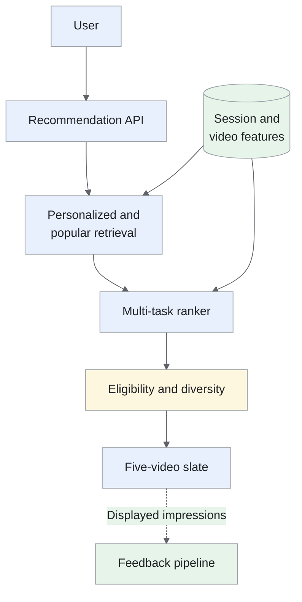
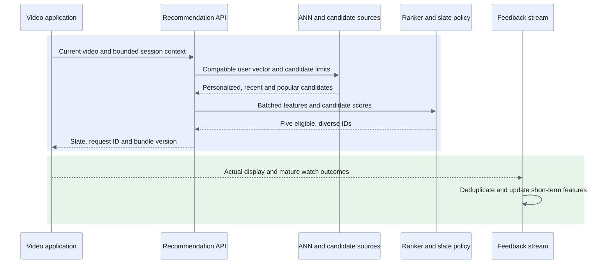
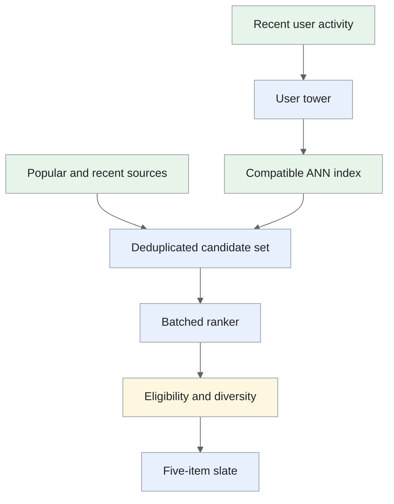

Design of a personalized “Up Next” service that recommends five videos after a user finishes watching.

<!--more-->

## Problem

A user finishes a video and wants something worthwhile to watch next. The recommendation service selects a small slate from a large catalog using the current video, recent viewing history and language preferences.
The service needs to balance immediate relevance with discovery and user satisfaction. Optimizing clicks alone can favor appealing thumbnails with disappointing content; optimizing total watch time alone can overvalue long videos. Retrieval, ranking and slate selection address these concerns at different stages.

## Requirements

### Functional requirements

- **Recommend videos:** return five eligible recommendations for the current session.

- **Adapt to recent activity:** incorporate newly watched videos and explicit feedback.

- **Support discovery:** recommend newly uploaded videos and unfamiliar creators.

- **Keep the slate varied:** limit repeated videos and excessive concentration on one creator.

- **Collect feedback:** record impressions, watches, likes, shares and subscriptions.

Advertising, search ranking and live-stream recommendations are separate systems. Recommendation serving consumes moderation decisions from the policy service.

### Non-functional requirements

- **Scale:** assume 1B daily users and a 1B-video catalog.

- **Latency:** target p99 below 200ms for the recommendation response.

- **Availability:** target 99.9%, with a filtered popular-video fallback.

- **Freshness:** make eligible new-video embeddings available within one hour; update session features within seconds.

- **Quality:** evaluate useful watch time, satisfaction and creator diversity by user activity and video age.

- **Privacy:** retain only approved viewing/context features, with bounded history and log retention.

## Back-of-the-envelope calculations

- At ten requests/user/day, 1B daily users generate 10B requests/day: about 116K/s on average. A fivefold peak is approximately 580K/s.

- Five displayed videos per response produce up to 50B impressions/day; actual display events are logged by the client.

- A 256-dimensional float32 embedding requires 1KB. The 1B-video embedding set is about 1TB before ANN overhead and replication.

- At an assumed 200 bytes per impression, logs reach 10TB/day before compression. Log bounded feature references and sampled full feature snapshots rather than repeating large vectors for every candidate.

## Core entities

- **Video:** catalog metadata, content-derived representation and current eligibility.

- **Session context:** bounded recent watches and permitted preferences.

- **Recommendation impression:** the displayed slate and serving versions.

- **Watch outcome:** observed watch duration and explicit feedback associated with an impression.

```protobuf
message Video {
  string video_id;
  string creator_id;
  string language;
  int32 duration_seconds;
  Timestamp published_at;
  string content_version;
  string eligibility_version;
}

message RecommendationImpression {
  string request_id;
  string session_id;
  repeated string video_ids; // Display order
  string bundle_version;
  Timestamp displayed_at;
}

message WatchOutcome {
  string event_id; // Stable across retries
  string request_id;
  string video_id;
  float watched_seconds;
  string action; // Watch, like, share, subscribe or hide
  Timestamp occurred_at;
}

```

The bundle identifies the user/item encoders, ANN index, ranking model and feature schema together.

## API

```yaml
POST /v1/recommendations:
  body:
    current_video_id: video-7
    session_id: session-123
    limit: 5
  response:
    request_id: rec-123
    videos: [{video_id: video-9, creator_id: creator-2}]
    bundle_version: bundle-42
    degraded: false

POST /v1/watch-events:
  body:
    event_id: watch-123
    request_id: rec-123
    video_id: video-9
    watched_seconds: 72
    action: watch

```

The authenticated session supplies user identity. Ingestion deduplicates by `event_id`; untrusted client durations are checked against playback and video-duration bounds.

## High-level design

A two-tower model retrieves candidates using precomputed video embeddings. A richer model ranks the shortlist, and a policy step builds the final slate. Training and index publication run separately from requests.


```mermaid
%%{init: {'theme':'base','themeVariables':{'primaryColor':'#e8f0fe','primaryTextColor':'#202124','primaryBorderColor':'#9aa0a6','lineColor':'#5f6368','secondaryColor':'#e6f4ea','tertiaryColor':'#fef7e0','actorBkg':'#e8f0fe','actorBorder':'#9aa0a6','actorTextColor':'#202124','noteBkgColor':'#fef7e0','noteTextColor':'#202124','noteBorderColor':'#9aa0a6','signalColor':'#5f6368','signalTextColor':'#202124','labelBoxBkgColor':'#fef7e0','labelBoxBorderColor':'#9aa0a6'}}}%%
flowchart TB
    U["User"] --> API["Recommendation API"]
    API --> RET["Personalized and<br/>popular retrieval"]
    RET --> RANK["Multi-task ranker"]
    RANK --> SLATE["Eligibility and diversity"]
    SLATE --> OUT["Five-video slate"]
    F[("Session and<br/>video features")] --> RET
    F --> RANK
    OUT -.->|"Displayed impressions"| EVENTS["Feedback pipeline"]
classDef request fill:#e8f0fe,stroke:#9aa0a6,color:#202124;
classDef data fill:#e6f4ea,stroke:#9aa0a6,color:#202124;
classDef control fill:#fef7e0,stroke:#9aa0a6,color:#202124;
class U,API,RET,RANK,OUT request;
class F,EVENTS data;
class SLATE control;

```

The retrieval/ranking separation follows the architecture described in [YouTube's recommendation paper](https://research.google/pubs/deep-neural-networks-for-youtube-recommendations/). Candidate counts and latency budgets here are proposed operating parameters.

## Storage

- **Partitioned catalog store:** use Bigtable for video-ID lookups and content/eligibility versions. Store media and immutable training data separately in object storage.

- **[Redis](/designs/tech-redis/):** keep bounded session history and recent aggregate features. Feature values carry timestamps; a cache miss uses documented defaults or catalog values.

- **ScaNN:** shard the ANN index over video embeddings. Publish a base snapshot with an incremental overlay for new videos; remove ineligible IDs before final selection.

- **[Kafka](/designs/tech-kafka/) and Parquet:** preserve impression/outcome events and point-in-time training examples. Retain deduplication state through the replay window.

- **[PostgreSQL](/designs/tech-postgresql/) registry:** record compatible bundles, evaluation results and rollout state. Model weights, embeddings and checkpoints remain immutable objects.

Video edits invalidate derived representations. A deletion updates eligibility immediately and remains a tombstone through index compaction and replay.

## From request to response

### Next-slate flow


```mermaid
%%{init: {'theme':'base','themeVariables':{'primaryColor':'#e8f0fe','primaryTextColor':'#202124','primaryBorderColor':'#9aa0a6','lineColor':'#5f6368','secondaryColor':'#e6f4ea','tertiaryColor':'#fef7e0','actorBkg':'#e8f0fe','actorBorder':'#9aa0a6','actorTextColor':'#202124','noteBkgColor':'#fef7e0','noteTextColor':'#202124','noteBorderColor':'#9aa0a6','signalColor':'#5f6368','signalTextColor':'#202124','labelBoxBkgColor':'#fef7e0','labelBoxBorderColor':'#9aa0a6'}}}%%
sequenceDiagram
  participant U as Video application
  participant A as Recommendation API
  participant R as ANN and candidate sources
  participant M as Ranker and slate policy
  participant E as Feedback stream
  rect rgb(232, 240, 254)
    U->>A: Current video and bounded session context
    A->>R: Compatible user vector and candidate limits
    R-->>A: Personalized, recent and popular candidates
    A->>M: Batched features and candidate scores
    M-->>A: Five eligible, diverse IDs
    A-->>U: Slate, request ID and bundle version
  end
  rect rgb(230, 244, 234)
    U-->>E: Actual display and mature watch outcomes
    E->>E: Deduplicate and update short-term features
  end

```

The request uses one compatible retrieval/ranking bundle and the current session features. Only actual display creates exposure evidence; watch outcomes join later, while deduplicated recent actions can already influence the next request.

### Selecting the next slate

1. Validate the current video and request limits. Pin a serving bundle and read bounded session history, language and consent-approved context.

2. Compute the user embedding using the current session. Query the ANN index and merge candidates from related-video, fresh-video and popular-video sources.

3. Deduplicate IDs and filter unavailable, hidden and already-watched videos. Batch-load item features such as duration, upload age, creator and historical aggregates.

4. Score the candidates with the multi-task ranker, retaining a bounded shortlist. Large batches improve accelerator use but add queueing delay, so each request has an inference deadline.

5. Select five items while enforcing creator limits and topic diversity. Apply current eligibility again before responding.

6. Log the request snapshot. Client display/watch events update session features and later join the training record.
Candidate retrieval is cheap because item vectors are precomputed. Ranking incurs per-request feature and inference work; the cascade deep dive controls that cost.

### Applying feedback

A watch event updates recent session history after deduplication. Longer-term item aggregates are computed from the event stream with event-time windows. Training waits for outcomes to mature, while the next request can already use the updated session.

### Serving during a failure

If the ranker misses its deadline, order candidates using retrieval scores and lightweight policy rules. If personalized retrieval fails, use a language-appropriate popular slate. Both paths apply current eligibility; incomplete feedback collection is measured separately from response availability.

## Deep dives

### How do we narrow a billion videos to five?

Scoring every video per request requires too much feature retrieval and model computation.

- **Popular-video lists:** Precompute a language-appropriate list. Serving is inexpensive and reliable, but current-session interests receive little personalization.

- **Two-tower retrieval only:** Search precomputed item vectors with the current user representation. Personalized coverage is efficient, but independently encoded vectors cannot capture every detailed user–video interaction.

- **Retrieval with bounded richer ranking — recommended:** Merge ANN and fresh/popular candidates, then score a shortlist with cross-features and select five. Detailed inference is limited; relevant videos lost during retrieval or pruning remain unavailable to the ranker.

The billion-video catalog needs cheap retrieval before per-request inference. We accept measured stage recall loss and compatible index/model artifacts, tuning budgets using relevance and p99 rather than assuming a larger candidate set is free.
The user tower encodes recent watches and permitted context; the item tower encodes metadata and content. Train with sampled softmax and correct for the negative-sampling distribution. In-batch negatives are efficient, but frequent items appear more often and some sampled items may also be relevant.
[ScaNN](https://arxiv.org/abs/1908.10396) supplies approximate vector search. Choose normalization, quantization and shard count using measured recall/latency on this catalog; normalization changes the scoring objective and is evaluated with the model.
The ranker combines explicit feature interactions from [DCN V2](https://arxiv.org/abs/2008.13535) with task-specific heads. [MMoE](https://research.google/pubs/modeling-task-relationships-in-multi-task-learning-with-multi-gate-mixture-of-experts/) is an option when task sharing causes negative transfer. Start with a simpler shared-bottom model and add expert routing only when controlled comparisons justify its serving cost.
**Prepare item work once, spend user work per request**
Encode video content/metadata offline with the active item tower and publish its vector to the base/overlay index. A request encodes recent user watches and context, retrieves a bounded candidate set, merges it with eligible popular/followed/recent sources, then applies the richer ranker.


```mermaid
%%{init: {'theme':'base','themeVariables':{'primaryColor':'#e8f0fe','primaryTextColor':'#202124','primaryBorderColor':'#9aa0a6','lineColor':'#5f6368','secondaryColor':'#e6f4ea','tertiaryColor':'#fef7e0','actorBkg':'#e8f0fe','actorBorder':'#9aa0a6','actorTextColor':'#202124','noteBkgColor':'#fef7e0','noteTextColor':'#202124','noteBorderColor':'#9aa0a6','signalColor':'#5f6368','signalTextColor':'#202124','labelBoxBkgColor':'#fef7e0','labelBoxBorderColor':'#9aa0a6'}}}%%
flowchart TB
    H["Recent user activity"] --> U["User tower"]
    U --> A["Compatible ANN index"]
    P["Popular and recent sources"] --> M["Deduplicated candidate set"]
    A --> M
    M --> R["Batched ranker"]
    R --> D["Eligibility and diversity"]
    D --> S["Five-item slate"]
classDef request fill:#e8f0fe,stroke:#9aa0a6,color:#202124;
classDef data fill:#e6f4ea,stroke:#9aa0a6,color:#202124;
classDef control fill:#fef7e0,stroke:#9aa0a6,color:#202124;
class U,M,R,S request;
class H,A,P data;
class D control;

```

Evaluate candidate recall before adding ranker capacity. Approximate-search probes and quantization trade CPU/memory for recall; choose them against the catalog's relevant-video set rather than a synthetic benchmark alone.
The final ranker needs batch hydration for video age, content and session features. Set a deadline for each source and keep a fallback order when richer scoring is unavailable. New item content is encoded with the serving bundle; a vector from another encoder version is rejected rather than silently inserted into the active index.

### What should the ranker optimize?

Clicks, watch duration and satisfaction capture different behavior. Long videos also provide more possible watch time, making unbounded duration a biased objective.

- **Click probability:** Train on fast click labels. Feedback is abundant, but enticing thumbnails can win even when the ensuing viewing experience is poor.

- **Expected watch time:** Optimize deeper engagement. Labels better reflect consumption, but long videos offer more possible minutes and passive viewing can dominate satisfaction.

- **Versioned multi-objective ranking — recommended:** Estimate bounded useful watch duration, engagement and negative outcomes, then apply explicit product weights. Several goals are visible; shared-task gradients can interfere and sparse negative labels require per-head calibration and quality checks.

A useful session requires more than a click or raw duration. We accept loss-weight and product-policy tuning, checking satisfaction and negative outcomes separately so one headline engagement gain does not hide task interference.
Clip extreme watch durations and evaluate by video length. A direct bounded-duration head is easier to interpret than treating a weighted logistic score as a calibrated number of seconds.

```python
score = (
    watch_weight * expected_useful_watch_seconds
    + like_weight * p_like
    + subscribe_weight * p_subscribe
    - hide_weight * p_hide
)

```

Tune weights through controlled experiments with explicit satisfaction and diversity guardrails. Offline recall/NDCG measures candidate ordering; online session outcomes establish whether a change helps users.
**Define the useful-watch label**
A watch event needs playback start/stop, duration, foreground/interaction context where permitted, and a stable impression identity. Deduplicate client retries and cap impossible durations. A bounded useful-watch target avoids treating a looping or idle playback as unlimited satisfaction.
A long and short video differ in possible watch duration. Evaluate absolute useful seconds and completion-related features by length cohort; do not claim that one raw duration objective treats them equally.
The scoring policy combines calibrated probabilities and the bounded duration estimate with recorded units/weights. Train heads only when their label windows are mature. Hides and explicit dissatisfaction remain guardrails even when watch time grows.

```text
Impression → playback evidence → matured watch/engagement labels
                                  ↓
                       shared representation and heads
                                  ↓
                     versioned slate-scoring policy

```

Validate whole-session outcomes and return rate through a controlled experiment. Offline teacher agreement or an increase in average seconds alone cannot establish that recommendations improved for users.

### How do new users and videos receive useful recommendations?

New users have little history, and new videos have no interaction aggregates.

- **Wait for engagement:** Rank only after reliable interaction aggregates arrive. Popularity evidence is mature, but new videos receive little exposure and new users have a generic experience.

- **Separate cold-start models:** Train distinct paths for low-history users and items. Specialization is possible, but routing boundaries, model count and release work increase.

- **Content representations with bounded exploration — recommended:** Encode approved content and current context, then allocate a limited eligible-item exposure budget. New items can compete; weaker behavioral evidence and exploratory slots can reduce immediate relevance.

The feed needs fresh content before its interaction history exists. We accept a measured exploration cost and evaluate cold-start cohorts, keeping eligibility and creator-exposure controls active.
Mix a small, configurable share of eligible exploration candidates into the slate and log their selection probabilities. Update the session representation as watches arrive. Creator-level priors help when content is sparse, but exploration quotas prevent established creators from occupying all discovery opportunities.
A greedy diversity rule can use `score - similarity_penalty` against selected items, with a proposed cap of two videos per creator in a five-item slate. Evaluate the cap against user intent: a playlist continuation may need a distinct policy.
**A cold-start path with bounded exposure**
For a new user, use explicit language/interests and early session actions to build context. For a new video, content and creator features generate an indexable representation before watch aggregates exist. Their missingness is passed to the ranker.
Allocate exploration after eligibility checks and log item/slot assignment probabilities. A small cap limits the immediate relevance cost while collecting evidence. Combine exploration with creator-diversity constraints so the same new creator cannot take every exploratory slot.
A skip updates recent session features for the next request; it is interpreted with dwell, playback availability and exposure. A video that failed to load should not receive the same negative label as one deliberately rejected after viewing.
Track quality and exposure by true item age and new-user cohort. Mature outcomes—not just initial clicks—determine whether to increase the exploration share or promote a content-based feature.

### How do we prevent biased or mismatched training data?

Only displayed videos can receive watch feedback. Position, UI layout and the previous model influence exposure, so passive logs reflect those choices.

- **Raw-log training:** Treat observed watch outcomes as relevance. Collection is simple, but the previous policy and display position determine exposure and missing outcomes.

- **Recompute all historical features:** Save fewer snapshots and reconstruct from current stores. Logging is smaller, but late data and changed definitions can introduce information unavailable to the original request.

- **Versioned serving snapshots with controlled exposure — recommended:** Log request-time evidence or reconstruct it with availability-aware histories and known exploration probabilities. Comparisons are better supported; storage, feature provenance and supported weighting add complexity.

Ranking and exposure change which labels exist. We accept snapshot/history retention and a bounded randomized sample so training reproduces the served context rather than learning from future features or unobserved impressions.
Inverse-propensity weighting uses exposure/examination estimates, with bounded weights. `P(click | position)` also includes relevance and is unsuitable as an exposure estimate by itself. Position-as-feature is a useful model input, but equalizing it at serving time still requires bias evaluation.
Use chronological splits and mature labels. Video age is computed relative to the request timestamp in both training and serving; setting every video's age to zero would change the feature's meaning. Monitor feature missingness and skew by schema version and session activity.
**Reproduce what the serving model knew**
Store the request's bundle, user-history cutoff, feature timestamps and displayed video versions. Historical training joins only features available at that cutoff. Later popularity and the user's subsequent watches belong to labels or later examples.
If only the final slate is logged, the training pipeline cannot distinguish retrieval omissions from ranker exclusions. Log bounded candidate/source evidence where needed for funnel analysis, separately from actual exposure labels.
Sampling metadata records negative selection and randomized slot assignment. Weighting based on those probabilities needs adequate support and a cap; it cannot remove bias for videos the policy never considered.
Run fixture tests that send the same historical request through offline feature extraction and serving encoding. Compare masks, age calculations and categorical mappings, then inspect drift by schema version. A user vector built with one tokenizer/encoder must query item vectors from its compatible bundle.

### How do releases and adaptation remain stable?

Daily retraining captures gradual changes; breaking-news or seasonal shifts can move faster.

- **Daily batch updates:** Train reproducible weights on mature evidence. Recovery is clear, but a new session action or sudden event is absent from the previous snapshot.

- **Per-event online weight changes:** Update parameters continuously. Response can be fast, but outliers, incompatible vectors and distributed optimizer state complicate diagnosis and rollback.

- **Batch bundles with live session features — recommended:** Keep weights and index space stable while recent interactions update bounded features. Same-session adaptation is prompt; event lag remains visible and bundle releases need coordinated rebuilds and warm capacity.

Immediate user context changes faster than stable model quality can be established. We accept separate feature and bundle clocks, including the storage and rebuild cost of compatible user/item encoders, index and ranker rollback artifacts.
Block malformed-data and incompatible-index releases. Evaluate by video age, language, creator cohort and user activity; shadow checks validate operational behavior, while a controlled traffic experiment measures user impact. Roll back the whole compatible bundle and retain ingestion watermarks so new-video indexing can continue.
**Adapt quickly through features, release weights deliberately**
A session feature update reflects the latest watched/skipped videos without changing global weights. Stream consumers apply events idempotently and retain an event-time horizon; late actions update only the windows they still belong to.
For a new weight candidate, publish the matched item embeddings/index as well as its user tower and heads. Run offline cohort gates, warm the bundle, then compare through shadow and controlled traffic.
Existing feed sessions retain a cursor/snapshot contract where possible. Every continuation rechecks current removal state so a pinned older ranking cannot expose deleted content. Rollback restores the complete old bundle and reconciles its recent-item overlay watermark. Monitor feature lag, candidate-source failures and deep-ranker fallback rate independently so operational degradation is visible even if the API still returns five items.
