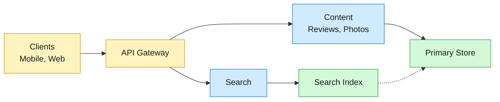
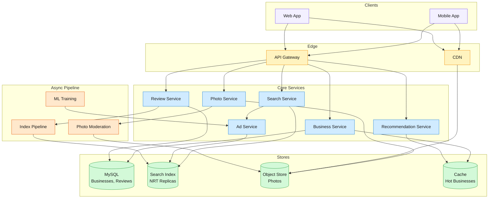

Yelp is a local business discovery platform connecting ~74M monthly visitors with ~8.4M businesses across categories like restaurants, home services, and retail. Users search by location and keyword, browse ~330M reviews and ~500M photos, and contribute their own ratings and content.

<!--more-->

## 1. Problem

Yelp is a local business discovery platform connecting ~74M monthly visitors with ~8.4M businesses across categories like restaurants, home services, and retail. Users search by location and keyword, browse ~330M reviews and ~500M photos, and contribute their own ratings and content. The core challenge: maintain review integrity and search freshness at scale while keeping geo-filtered search latency low.



## 2. Requirements

**Functional**

- FR1: Search businesses by keyword, category, and location
- FR2: Browse business detail pages with reviews, photos, and hours
- FR3: Submit star ratings and written reviews for a business
- FR4: Upload photos to business listings
- FR5: Discover businesses via personalized home feed
- FR6: View sponsored results alongside organic search results

**Non-functional**

- NFR1: Search latency under 200ms p95 for geo-filtered queries
- NFR2: New content searchable within seconds
- NFR3: Spam and solicited reviews filtered automatically
- NFR4: Ad CTR predictions served in under 50ms p50

*Out of scope: Reservation booking, business claim verification, and advertiser campaign management.*

## 3. Back of the envelope

- **Search peak:** ~74M visitors x 5 searches/mo = 370M searches/mo / 2.6M s x 3 (weekday peak) = ~430 searches/s -> geo-filtered ranking is the latency bottleneck, not raw throughput
- **Content ingestion:** ~60K reviews + 200K photos per day = ~3 writes/s -> write volume is negligible; the system is read-dominated by roughly 100:1
- **Index freshness:** ~60K items/day arriving continuously -> a periodic full-scan refresh runs on a fixed interval; the staleness window equals that interval

## 4. Entities

```
Business {
  business_id:  uuid         PK
  name:         string
  categories:   string[]                    ← e.g. ["restaurants", "italian"]
  location:     geo_point
  rating_avg:   decimal(2,1)               ← denormalized from reviews
  review_count: integer                     ← denormalized counter
  photo_count:  integer                     ← denormalized counter
  hours:        jsonb
}

Review {
  review_id:    uuid         PK
  business_id:  uuid         FK
  user_id:      uuid         FK
  rating:       smallint                    ← 1-5
  text:         text
  status:       enum                        ← recommended, not_recommended, removed
  created_at:   timestamp
}

Photo {
  photo_id:     uuid         PK
  business_id:  uuid         FK
  user_id:      uuid         FK
  s3_key:       string
  status:       enum                        ← pending, approved, rejected
  created_at:   timestamp
}

User {
  user_id:      uuid         PK
  display_name: string
  review_count: integer
  photo_count:  integer
  created_at:   timestamp
}
```

### API

- `GET /search?q={text}&lat={lat}&lon={lon}&categories={cats}` -- search businesses by location and query, returns paginated results with ratings and distance
- `GET /businesses/{id}` -- detail page with reviews, photos, hours, and map
- `POST /reviews` -- submit a star rating and review text for a business
- `POST /photos` -- upload a photo for a business, returns photo_id
- `GET /feed` -- personalized home feed of recommended businesses
- `GET /ads` -- fetch sponsored results for a given search context

## 5. High-Level Design



#### FR1: Search businesses by keyword, category, and location

**Components:** Client -> API Gateway -> Search Service -> Search Index (NRT replicas) + Ad Service.

**Flow:**

1. User enters a query (text + optional location) in the search bar.
1. Client sends `GET /search?q={text}&lat={lat}&lon={lon}` to the API Gateway.
1. Search Service runs query understanding: tokenizes the input, resolves synonyms and category intent, annotates the query with location context.
1. Query is routed to the Search Index, which executes a geo-filtered full-text query: businesses within a radius around the user's location, ranked by relevance.
1. In parallel, the Ad Service scores sponsored candidates for the same query context.
1. Organic and sponsored results are merged and returned as a paginated list with business name, rating, review count, categories, and distance.

**Design consideration:** geo-filtering constrains the result set before full-text ranking runs — filtering to a ~5 mi radius typically reduces the candidate set from millions to hundreds. This lets the search index apply expensive ranking signals (text relevance, rating, photo count, recency) on a small working set rather than the full corpus.

#### FR2: Browse business detail pages with reviews, photos, and hours

**Components:** Client -> API Gateway -> Business Service -> Primary Store (businesses, reviews) + CDN (photos).

**Flow:**

1. User taps a search result or a saved business. Client sends `GET /businesses/{id}`.
1. Business Service fetches the business record (name, categories, location, hours, aggregate rating) from the Primary Store.
1. Reviews for the business are fetched — filtered to recommended reviews only, paginated, sorted by recency or helpfulness.
1. Photo metadata (keys, captions, upload dates) is fetched; actual photo files are served from the CDN backed by Object Store.
1. The response assembles these into a detail page: business info, review list, photo gallery, map marker.

**Design consideration:** the aggregate rating and counts on the business record are denormalized — recomputed asynchronously when a new review is published, rather than computed on every page load. This avoids a `COUNT` + `AVG` across millions of reviews on every detail-page request. A background job listens for review-status changes and updates the denormalized fields.

#### FR3: Submit star ratings and written reviews for a business

**Components:** Client -> API Gateway -> Review Service -> Primary Store (reviews) + Index Pipeline.

**Flow:**

1. User writes a review (1-5 star rating + text) and submits via `POST /reviews` with `business_id`.
1. Review Service validates the content: checks for minimum text length, rejects empty or whitespace-only reviews.
1. Review is written to the Primary Store with `status=not_recommended` initially.
1. The automated recommendation software evaluates the reviewer's account (age, history, geographic consistency, activity patterns) and assigns a final status — recommended or stays not-recommended.
1. The Index Pipeline picks up the new review via change-data capture and indexes it into the Search Index so the business's review count and text content are searchable within seconds.
1. A background job recomputes the business's `rating_avg` and `review_count` from the set of recommended reviews.

**Design consideration:** every review requires accompanying text — ratings without text are rejected. This raises the bar for spam (a textless 5-star rating is trivial to automate; a plausible 400-character review is not). The review recommendation software is reviewer-centric: it evaluates the account's history and behavior patterns, not the review's text content. This avoids the perception that the platform's own automated system is judging the *opinion* expressed in the review.

#### FR4: Upload photos to business listings

**Components:** Client -> API Gateway -> Photo Service -> Object Store + Photo Moderation Pipeline.

**Flow:**

1. User selects a photo and uploads via `POST /photos` with `business_id`.
1. Photo Service validates format (JPEG, PNG), recompresses with optimized settings to reduce file size, and stores the result in Object Store.
1. A `photo` record is written to the Primary Store with `status=pending`; the photo is hidden from the business page until moderation completes.
1. The Photo Moderation Pipeline processes the photo asynchronously through a two-stage ML pipeline: stage 1 screens for suspicious content, stage 2 classifies with high precision.
1. Once approved, the photo's status flips to `approved` and it becomes visible on the business page, served via CDN.

**Design consideration:** the async moderation pipeline introduces a delay between upload and visibility, but this gap has a side benefit: attackers attempting to upload spam get no immediate feedback on whether their content passed. Real-time moderation would let them probe the system iteratively. The two-stage design also saves cost — stage 1 uses lightweight heuristics to filter ~90% of photos as clearly safe, leaving only the suspicious subset for the expensive deep-learning stage.

#### FR5: Discover businesses via personalized home feed

**Components:** Client -> API Gateway -> Recommendation Service -> Cache (hot businesses) + Collaborative Filtering model.

**Flow:**

1. User opens the app and the client requests `GET /feed`.
1. Recommendation Service retrieves the user's recent activity: searches, viewed businesses, review history, location.
1. A collaborative filtering model (trained offline on user-business interaction patterns) generates a candidate set of businesses this user is likely to engage with.
1. Candidates are scored and ranked, filtered to the user's current area, and blended with trending/popular businesses nearby.
1. Results are returned as a personalized feed of business cards (photo, rating, category, distance).

**Design consideration:** the collaborative filtering model is trained offline via matrix factorization on the user-business interaction matrix — it runs as a batch job, not on every feed request. At serving time, the precomputed user-to-business affinity scores are looked up from a key-value cache. This decouples the heavy training cost from the sub-100ms feed-serving latency budget.

#### FR6: View sponsored results alongside organic search results

**Components:** Search Service -> Ad Service -> CTR Prediction Model (served via ML inference) + Search Index.

**Flow:**

1. During a search, the Search Service forwards the query context (text, location, user segment) to the Ad Service.
1. Ad Service retrieves eligible sponsored listings matching the query and location from the ad inventory in the Primary Store.
1. Each candidate is scored by the CTR prediction model, which estimates the probability the user will click this ad given the query context and user profile.
1. An ad auction ranks candidates by expected value: predicted CTR x advertiser bid.
1. Top-ranked sponsored results are merged into the organic search results, marked as sponsored.
1. Impressions and clicks are logged to the async pipeline for offline model retraining and advertiser billing.

**Design consideration:** the CTR model must serve predictions for thousands of candidates per query within a tight latency budget (~50ms p50). The model is pre-loaded into the Ad Service's memory at deployment time, avoiding a network call to an external inference server. Feature vectors (query embeddings, user segment features, ad metadata) are assembled from in-memory caches.

## 6. Deep dives

### DD1: Near-Real-Time Search Indexing

**Problem.** Users expect a review they just submitted to appear in search results within seconds. A periodic full-index rebuild creates a staleness window — during that window, new content is invisible, and the rebuild itself consumes compute that competes with search queries. But continuous incremental indexing on the same nodes serving reads creates write-read contention, and writing to every replica independently wastes CPU.

**Approach 1: Periodic batch rebuild**

A background job scans the Primary Store for new and updated records, builds a fresh index, and atomically swaps it in. The rebuild runs on a fixed interval (e.g. every 5 minutes).

```javascript
while true:
    snapshot = read_all_businesses_and_reviews()
    new_index = build_index(snapshot)
    swap_index(new_index)
    sleep(300)
```

**Challenges:** the staleness window is the sleep interval itself — 5 minutes means a review submitted at t=0 is invisible until t=300. Shortening the interval helps but increases rebuild frequency: at 60K reviews/day, even a 1-minute rebuild means 60 seconds of staleness and 1,440 rebuilds per day. Each rebuild scans every business and review, so the cost grows with the corpus, not with the delta.

**Approach 2: Primary-replica with document replication**

One primary node handles all writes (index new documents, update existing ones). Replicas independently re-index the same documents, so every replica does the same indexing work the primary already did.

```javascript
# Primary
index(document) -> write to local Lucene index

# Replica (each replica repeats the work)
for each document:
    index(document) -> write to local Lucene index
```

**Challenges:** indexing CPU is duplicated across every replica — with 3 replicas, the system does 4x the indexing work for the same write throughput. As the replica count scales with read volume, the indexing tax scales linearly. Shard distribution can also be uneven: some shards hold more documents than others, creating hot nodes that slow down both writes and reads.

**Approach 3: NRT segment replication**

Only the primary indexes documents. It writes the result into immutable Lucene segment files and publishes segment metadata to replicas. Replicas pull the completed segment files (not the raw documents) over gRPC and open them locally for search — no re-indexing.

```javascript
# Primary
on_index(document):
    lucene_writer.addDocument(document)
    lucene_writer.flush()              # writes immutable segment to disk
    segment_id = publish_segment_metadata()
    backup_segment_to_object_store(segment_id)

# Replica
on_segment_published(segment_id):
    segment_file = pull_segment_from_primary(segment_id)
    local_index_manager.open(segment_file)
    # segment is now searchable — no re-indexing needed
```

```protobuf
service Nrtsearch {
  rpc Search(SearchRequest) returns (SearchResponse);
  rpc Index(stream IndexRequest) returns (IndexResponse);
  rpc Commit(CommitRequest) returns (CommitResponse);
  rpc PublishNrtUpdate(PublishNrtUpdateRequest) returns (PublishNrtUpdateResponse);
}
```

**Normal path:** the primary holds a stream of index operations. On commit, it flushes Lucene segments to local storage, publishes metadata, and backs up the new segment files to object storage. Replicas pull new segments via gRPC, open them, and immediately serve queries from them.

**Stale-replica path:** a replica that falls behind (crashed, network partition) downloads the latest backup from object storage and catches up on incremental segments from the primary. Backups run on every commit, so recovery is from the last committed state.

**Decision.** NRT segment replication. Replicas pull immutable Lucene segments rather than re-indexing documents. This eliminates duplicated indexing work and lets read capacity scale independently of write throughput.

**Rationale.** Duplicating indexing CPU across replicas is wasteful — at 3+ replicas, more compute goes to re-doing the primary's indexing than to serving search queries. Immutable segment replication moves the indexing cost to the primary alone, where it happens once. Since our write volume is low (~3 items/s), a single primary has plenty of headroom. Backups to object storage on every commit decouple segment durability from the primary's local disk, so a primary crash doesn't lose committed data.

**Edge cases:**

- **Primary crashes** — the cluster operator restores the index from the latest object-storage backup and replays any uncommitted writes from the change-data-capture log.
- **Replica falls far behind** — downloads the full latest backup from object storage, then syncs incremental segments forward.
- **State inconsistency** — index state objects are immutable: changes merge into a new representation that replaces the old one atomically after commit, so a half-written state is never visible.

> [!TIP]
> **Key insight:** immutable segment replication decouples indexing cost from read scale. The primary indexes once; replicas copy finished segments. At our write rate (~3 items/s), a single primary handles indexing comfortably, and we can add replicas for read capacity without paying an indexing tax on each one.

### DD2: Review Recommendation Integrity

**Problem.** The platform receives ~22M reviews per year. Without automated filtering, solicited reviews (businesses asking customers for 5-star ratings), incentivized reviews, and spam would flood the corpus and erode trust. But the filtering must not favor advertisers — the same system that sells ads to businesses is the one that filters their reviews, creating a structural conflict of interest. The filtering must be automated at scale and provably neutral across all businesses.

**Approach 1: Content-based text classification**

Train a language model to classify review text as genuine or fake based on linguistic features: sentiment patterns, vocabulary richness, unnatural phrasing, similarity to known spam templates.

```python
def classify_review(text):
    embedding = language_model.encode(text)
    score = classifier.predict(embedding)
    return "recommended" if score > threshold else "not_recommended"
```

**Challenges:** sophisticated spam evolves to mimic genuine reviews. An LLM-generated 400-character review with varied vocabulary can pass content-based filters easily. Content classification also creates a perception problem: when the platform's own AI judges the *opinion* in a review, a business whose negative reviews are filtered can claim bias. Content filters work best as a second layer, not the primary defense.

**Approach 2: Reviewer-centric signal evaluation**

Evaluate the reviewer's account, not the review text. Hundreds of signals are grouped into three categories: quality (review length, detail level), reliability (account age, review count, geographic consistency, IP patterns), and user activity (profile completeness, social connections, voting on others' reviews, photo uploads).

```javascript
def evaluate_reviewer(user_id, review):
    signals = [
        account_age_days(user_id),
        total_review_count(user_id),
        geographic_consistency(user_id, review.business_location),
        ip_pattern_score(user_id),
        profile_completeness(user_id),
        social_graph_connectedness(user_id),
        review_text_length(review.text),
        review_detail_score(review.text),
    ]
    score = weighted_model(signals)
    return "recommended" if score > threshold else "not_recommended"
```

A reviewer with a 2-day-old account, zero prior reviews, posting a 50-character 5-star review for a business 2,000 miles from their stated location scores very differently from a 3-year-old account with 30 prior reviews posting a 400-character review for a business near their home.

**Challenges:** a legitimate new user writing their first genuine review may score below the threshold and be incorrectly filtered. The system trades some false negatives (filtering a real review) for the integrity of the corpus — a small fraction of real first reviews are collateral damage. Reviewer-centric evaluation also means the same review from an established user passes while from a new account it doesn't, which can feel arbitrary.

**Approach 3: Layered defense — automated software + ML content detection + human review**

Three layers, each catching what the layer before it missed:

- **Layer 1 — Automated recommendation software:** evaluates every review globally using reviewer-centric signals. Recommends ~70% of reviews (the clearly legitimate ones), flags ~17% as not-recommended (clearly suspicious), and leaves a middle band uncertain.
- **Layer 2 — ML content detection:** a fine-tuned language model classifies review text for policy violations (hate speech, threats, harassment). This catches content that reviewer-centric signals miss — a 5-year-old account with 50 reviews can still post an abusive review.
- **Layer 3 — Human moderation team:** reviews flagged by either automated layer that fall into a gray area are escalated to human reviewers. This handles edge cases the models can't resolve: nuanced policy violations, coordinated review rings, political targeting.

```javascript
def review_pipeline(review, user):
    status = recommendation_software(user, review)       # Layer 1: reviewer signals
    if status == "not_recommended":
        return                                  # filtered by primary defense

    violation_score = content_classifier(review.text)     # Layer 2: text analysis
    if violation_score > escalation_threshold:
        escalate_to_human_review(review)                  # Layer 3: manual review
    else:
        mark_as_recommended()
```

**Decision.** The layered defense (Approach 3). Reviewer-centric signals form the primary filter at scale; ML content detection catches abuse that bypasses account signals; human review resolves the gray area.

**Rationale.** A single-layer defense has a single failure mode. Reviewer-centric signals alone miss abusive reviews from established accounts. Content classification alone misses well-written spam and incentivized reviews where the text is genuine but the motive is commercial. The three layers cover different threat types at different cost points: layer 1 is cheap and runs on every review; layer 2 runs on reviews that pass layer 1 and flags only the problematic subset; layer 3 is expensive (human time) but only touches the small fraction escalated by layers 1 and 2.

**Edge cases:**

- **New reviewer with a legitimate first review** — may be incorrectly filtered as not-recommended; the platform accepts this as a trade-off for corpus integrity.
- **Coordinated review rings** — detected by pattern analysis (multiple accounts created within a short window, all reviewing the same business, from nearby IPs); escalated to layer 3 for investigation.
- **Business targeted by politically-motivated negative reviews** — spike in review volume for a single business triggers an alert; reviews during the spike are held for layer 2 and 3 review before publishing.
- **Reviewer's status improves over time** — a review initially classified as not-recommended can be re-evaluated as the reviewer establishes more history; the software runs periodically, not once.

> [!TIP]
> **Key insight:** reviewer-centric filtering sidesteps the conflict-of-interest problem. The software evaluates *who* wrote the review, not *what* it says. A 5-star review from a credible, established user passes regardless of which business it praises. A 1-star review from a fresh account with no history is filtered regardless of which business it criticizes. The system is indifferent to the business being reviewed — it only cares about the reviewer's track record.

### DD3: Photo Moderation at Scale

**Problem.** The platform receives hundreds of thousands of photo uploads per day. Spam and inappropriate content — promotional flyers disguised as menu photos, explicit imagery, off-topic advertising — must be caught before publication. Running a deep-learning classifier on every uploaded photo in real time is expensive (GPU inference per photo) and gives attackers immediate pass/fail feedback they can use to reverse-engineer the model's decision boundary. But delayed moderation can't let spam through for hours.

**Approach 1: Real-time classification on upload**

Every photo upload runs through a CNN classifier synchronously before the upload API returns. The model outputs a pass/fail decision within the request-response cycle.

```python
def upload_photo(image_bytes, business_id):
    score = classifier.predict(image_bytes)
    if score > threshold:
        store_and_publish(image_bytes, business_id)
    else:
        reject(image_bytes)
```

**Challenges:** GPU inference on every photo adds cost proportional to upload volume. More critically, synchronous rejection gives attackers a tight feedback loop — they can tweak pixels and re-upload, probing the classifier's boundary until they find an adversarial perturbation that passes. Real-time classification also adds latency to the upload flow.

**Approach 2: Two-stage async pipeline**

Photos are accepted immediately and queued for offline processing. Stage 1 runs a high-recall, lightweight filter that screens out ~90% of photos as clearly safe. The remaining suspicious subset passes to Stage 2, which runs a heavier, high-precision deep-learning classifier.

```javascript
# Stage 1: High-recall filter (cheap, runs on all uploads)
def stage1(photo):
    signals = [heuristic_checks(photo), lightweight_ml_model(photo)]
    if all_clear(signals):
        approve(photo)                      # ~90% of photos — done
    else:
        queue_for_stage2(photo)             # ~10% — needs deeper check

# Stage 2: High-precision classifier (GPU, runs only on flagged subset)
def stage2(photo):
    score = deep_cnn_classifier.predict(photo)
    if score > spam_threshold:
        reject(photo)
    else:
        approve(photo)
```

**Normal path:** a typical food photo upload passes Stage 1 heuristics (file type valid, dimensions reasonable, no known-spam metadata patterns, lightweight model gives low-risk score) and is approved within seconds.

**Suspicious path:** a photo flagged by Stage 1 enters the Stage 2 queue, where a CNN trained on the platform's dataset classifies it. High-confidence spam is rejected; borderline cases go to a manual review queue.

**Heuristic fast-path:** alongside the ML models, a set of hand-tuned heuristics runs on every upload. These can be updated within hours to block new spam patterns while ML models retrain over days. A new spam wave (e.g. promotional flyers using a specific color palette or aspect ratio) can be blocked by heuristic rules on day one while the CNN training pipeline incorporates the new examples.

**Decision.** Two-stage async pipeline with heuristic fast-path. Photos are accepted and stored immediately but hidden from public view until moderation completes. Stage 1 filters ~90% cheaply; Stage 2 runs heavy inference only on the suspicious subset.

**Rationale.** Accepting photos and moderating asynchronously breaks the attacker feedback loop — an upload always succeeds from the client's perspective, so there is no signal to probe. The two-stage design makes GPU inference cost proportional to the suspicious-photo rate (~10% of uploads), not total upload volume. Heuristics as a parallel fast-path let the system respond to new spam patterns in hours (tune a rule) rather than weeks (collect examples, label, retrain, deploy a model).

**Edge cases:**

- **Spam wave with a new visual pattern** — heuristics are tuned within hours to block it; the pattern is fed into the next CNN training cycle for long-term coverage.
- **Adversarial images with pixel-level perturbations** — Stage 2 models are trained with adversarial examples to be resilient to common evasion techniques.
- **False positives (legitimate photo flagged)** — the photo remains in the review queue, not deleted; a human reviewer can restore it with one click.
- **Sudden upload spike** — Stage 2 queue depth grows, but Stage 1 still clears ~90% immediately; only the suspicious subset experiences delay.

> [!WARNING]
> **Cost trade-off:** async moderation accepts a moderation delay — a legitimate photo may be hidden for minutes while the pipeline runs. In exchange, we cut GPU inference cost by ~90% (only the suspicious 10% of photos hit the expensive model) and eliminate the attacker feedback channel. For a platform where most photos are genuine food and interior shots, the delay is invisible to most users and the cost savings are substantial.

### DD4: Ad CTR Prediction at Scale

**Problem.** The ad system must predict click-through rates for thousands of candidate ads per search, within a 50ms p50 serving budget. The training data is large — billions of tabular samples with hundreds of sparse categorical features (business category, user location, device type, time of day). Training a model on this dataset initially took 75 hours per epoch on a single GPU, making rapid experimentation and model iteration impossible. The data I/O from object storage was the primary bottleneck — reading Parquet files over the network saturated before the GPU did.

**Approach 1: Gradient Boosted Trees (GBT)**

Train a GBT model on tabular features. GBTs handle sparse categorical features well through tree splits, train faster than deep neural networks on modest datasets, and serve predictions with simple tree traversal.

```python
import xgboost as xgb
model = xgb.XGBClassifier(
    n_estimators=500,
    max_depth=6,
    learning_rate=0.1,
)
model.fit(train_features, train_labels)
```

**Challenges:** GBT training time grows with data volume and tree depth. At billions of samples with hundreds of features, a single training run can take many hours. GBTs also struggle with feature interactions that span many dimensions — they capture interactions through tree depth, but deep trees overfit on sparse data. For a model that must generalize to user-ad pairs never seen in training, memorization of seen interactions (what GBTs do well) is insufficient.

**Approach 2: WideAndDeep neural network**

A dual-architecture model: the "wide" component is a linear model with cross-product feature transformations that memorizes sparse feature interactions (e.g. "users in Chicago who searched 'pizza' at 7pm tend to click Italian restaurants"). The "deep" component is a multi-layer perceptron with dense embeddings for categorical features that generalizes to unseen feature combinations (e.g. a new restaurant in Chicago getting relevant impressions because the embedding of "Chicago + Italian + dinner" is nearby).

```python
import tensorflow as tf

# Wide component: memorization of sparse feature crosses
wide_columns = [
    tf.feature_column.crossed_column(
        ["user_city", "search_category", "hour_of_day"],
        hash_bucket_size=100000
    ),
]

# Deep component: generalization via embeddings + MLP
deep_columns = [
    tf.feature_column.embedding_column(
        tf.feature_column.categorical_column_with_hash_bucket("business_id", 50000),
        dimension=32
    ),
    tf.feature_column.embedding_column(
        tf.feature_column.categorical_column_with_hash_bucket("user_city", 1000),
        dimension=16
    ),
    # ... more embedding columns for each categorical feature
]

model = tf.keras.experimental.WideDeepModel(
    linear_model=tf.keras.Sequential([
        tf.keras.layers.DenseFeatures(wide_columns),
    ]),
    dnn_model=tf.keras.Sequential([
        tf.keras.layers.DenseFeatures(deep_columns),
        tf.keras.layers.Dense(1024, activation='relu'),
        tf.keras.layers.Dense(1024, activation='relu'),
        tf.keras.layers.Dense(1024, activation='relu'),
        tf.keras.layers.Dense(1, activation='sigmoid'),
    ])
)
```

**Challenges:** training this model on billions of samples is slow. On a single GPU, one epoch took 75 hours — too long to iterate on feature engineering, architecture changes, or hyperparameter tuning. The bottleneck was data loading: training data sat in Parquet files on object storage, and the existing data loader (Petastorm) streamed them through a Python generator, creating a CPU-bound I/O bottleneck.

**Approach 3: Distributed training with streaming data loading**

Replace the Python-generator data path with a C++ streaming server that reads pre-materialized feature vectors in columnar format and serves them over local sockets. Combine with Horovod for distributed training across multiple GPUs.

```python
import horovod.tensorflow.keras as hvd

hvd.init()

# ArrowStreamServer: C++ process per Spark executor
# Pre-materializes features to Arrow/Feather format on local SSD
# Serves RecordBatches over gRPC — bypasses Python generator bottleneck
# Result: 9M samples loaded in 19 seconds (vs 13+ minutes with Petastorm)

# Horovod distributed training
opt = tf.keras.optimizers.Adagrad(learning_rate * hvd.size())
opt = hvd.DistributedOptimizer(opt)

# Data loading speedup: 85.8x over Petastorm
# Distributed training speedup: 16.9x over single GPU (near-linear to 8 GPUs)
# Combined: 75 hours/epoch -> ~3 minutes/epoch
```

**Normal path:** at serving time, the trained model is loaded into the Ad Service's process memory. A search request triggers feature assembly — the query context (text, location, user segment) and candidate ad metadata are assembled into a feature vector. The model runs inference in-process and returns a CTR prediction within the latency budget.

**Retraining path:** new impression and click data is logged to the async pipeline. Periodically, the training pipeline materializes updated feature vectors to object storage, launches a distributed training job across 8 GPUs, evaluates the new model against a holdout set, and if it improves, deploys it to the Ad Service via a rolling update.

**Decision.** WideAndDeep neural network with distributed training (Horovod) and streaming data loading (Arrow-based columnar server). Training time dropped from 75 hours to ~3 minutes per epoch, making daily retraining practical.

**Rationale.** The wide component handles sparse categorical features with cross-product transformations — exactly the shape of our ad data where features like "user city x business category x time of day" carry strong signal. The deep component learns dense embeddings that generalize to unseen user-ad pairs. The data-loading optimization (switching from Python-generator Parquet reads to a C++ columnar streaming server) delivered an 85.8x speedup because it removed the CPU bottleneck — the GPU was starved waiting for data. Horovod distributed training scaled near-linearly to 8 GPUs because the WideAndDeep architecture's gradient computation parallelizes well across data shards.

**Edge cases:**

- **Imbalanced classes (clicks << non-clicks)** — class weighting in the loss function up-weights click examples so the model doesn't degenerate to always predicting "no click."
- **Model staleness during retraining** — the previous model version keeps serving while the new one trains; an atomic model swap at deployment avoids a gap.
- **Cold-start ads with no impression history** — the deep component's embeddings generalize from similar ads (same category, same location), so a new ad gets reasonable initial predictions.

> [!TIP]
> **Why not keep the GBT model?** GBTs train fast on moderate data, but our training set reached billions of samples with hundreds of sparse features. At that scale, GBT training time grew with tree depth and data volume, and the model struggled with generalization — it memorized seen feature combinations well but predicted poorly for new user-ad pairs. The WideAndDeep architecture explicitly separates memorization (wide linear crosses) from generalization (deep embeddings), giving better performance on both seen and unseen interactions.

## 7. References

1. [Nrtsearch: Yelp's Fast, Scalable and Cost Effective Search Engine](https://engineeringblog.yelp.com/2021/09/nrtsearch-yelps-fast-scalable-and-cost-effective-search-engine.html)
1. [Nrtsearch Coordinator — The Gateway](https://engineeringblog.yelp.com/2023/10/coordinator-the-gateway-for-nrtsearch.html)
1. [Nrtsearch v1.0.0: Incremental Backups and Lucene 10](https://engineeringblog.yelp.com/2025/05/nrtsearch-v1-release.html)
1. [CHAOS: Yelp's Unified Framework for Server-Driven UI](https://engineeringblog.yelp.com/2024/03/chaos-yelps-unified-framework-for-server-driven-ui.html)
1. [Enhancing Neural Network Training: 1400x Speedup with WideAndDeep](https://engineeringblog.yelp.com/2025/01/enhancing-neural-network-training-at-yelp.html)
1. [Yelp Trust & Safety Report 2025](https://trust.yelp.com/trust-and-safety-report/2025-report/)
1. [AI Pipeline for Inappropriate Language Detection](https://engineeringblog.yelp.com/2024/03/ai-pipeline-inappropriate-language-detection.html)
1. [Moderating Promotional Spam and Inappropriate Content in Photos at Scale](https://engineeringblog.yelp.com/2021/05/moderating-promotional-spam-and-inappropriate-content-in-photos-at-scale-at-yelp.html)
1. [How Yelp Modernized Its Data Infrastructure with a Streaming Lakehouse on AWS](https://aws.amazon.com/blogs/big-data/how-yelp-modernized-its-data-infrastructure-with-a-streaming-lakehouse-on-aws/)
1. [Search Query Understanding with LLMs](https://engineeringblog.yelp.com/2025/02/search-query-understanding-with-LLMs.html)
1. [Yelp's ML Platform Overview](https://engineeringblog.yelp.com/2020/07/ML-platform-overview.html)
1. [Scaling Collaborative Filtering with PySpark](https://engineeringblog.yelp.com/2018/05/scaling-collaborative-filtering-with-pyspark.html)
1. [Zero Downtime Upgrade: Yelp's Cassandra Upgrade Story](https://engineeringblog.yelp.com/2026/04/zero-downtime-upgrade-yelp-cassandra-upgrade-story.html)
1. [Gondola: An Internal PaaS Architecture for Frontend App Deployment](https://engineeringblog.yelp.com/2023/03/gondola-an-internal-paas-architecture-for-frontend-app-deployment.html)
