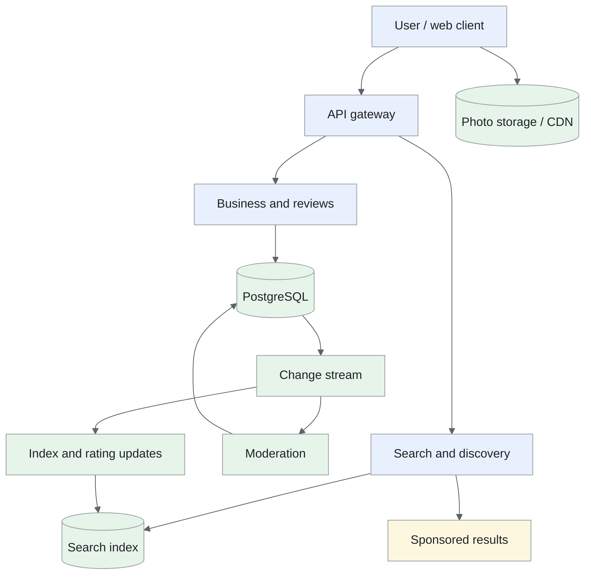
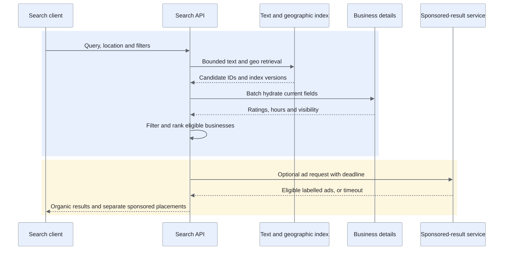
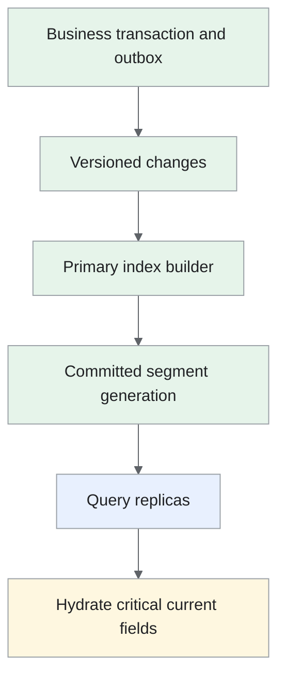
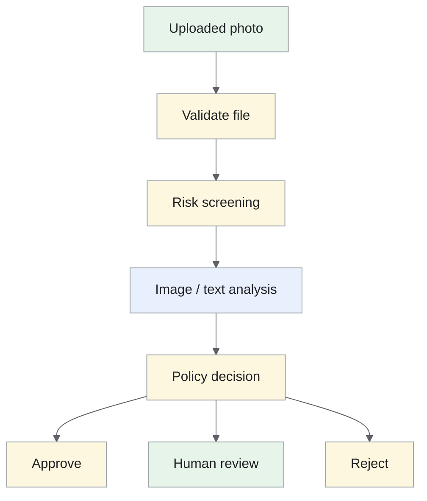

Design of a local-business discovery service for searching nearby businesses, reading reviews and sharing experiences.

<!--more-->

## Problem

A user looking for a restaurant needs useful results near their location, with accurate opening hours, ratings and photos. The service brings that information together and lets users contribute reviews after a visit.
Search results depend on both relevance and trust: a nearby business is useful only if its information is current and its reviews are reliable. Business updates, review processing and photo moderation therefore feed the search index continuously.

## Requirements

### Functional requirements

- **Find businesses:** search by keyword, category and location, with filters such as distance, price and opening hours.

- **Read business details:** show contact information, hours, ratings, reviews and approved photos.

- **Contribute content:** submit a rating and review, or upload photos; show the submission's processing status.

- **Discover nearby places:** recommend relevant businesses using location, interests and previous interactions.

- **Show sponsored results:** display eligible advertisements separately from organic results.

### Non-functional requirements

Design targets:

- **Search latency:** p95 below 200 ms for supported locations and query limits.

- **Freshness:** approved business and review changes appear in search within 10 seconds at p95.

- **Availability:** 99.9% for search and business-detail reads.

- **Integrity:** durable submissions, retry-safe processing and audited moderation decisions.

- **Quality:** evaluate relevance, review authenticity and moderation errors by category and user cohort before model releases.

- **Privacy:** limit location and raw interaction retention; separate advertising data from review-trust decisions.

## Back-of-the-envelope calculations

Assume 74M monthly users making five searches each, 8.4M businesses, 330M reviews and 500M photos.

- **Search:** 370M searches/month ÷ 2.6M seconds ≈ 142 queries/s average; a 3× peak is about 430 queries/s.

- **Contributions:** 60K reviews and 200K photos/day ≈ 3 submissions/s average. Moderation capacity also covers bursts and reprocessing.

- **Storage:** 330M reviews × 2 KB ≈ 660 GB; 500M photos × 2 MB ≈ 1 PB before replicas and image variants.

- **Search index:** 8.4M documents × 5 KB ≈ 42 GB before index structures and replicas.

These assumptions size this design, rather than describe Yelp's current production workload.

## Core entities

```protobuf
message Business {
  string business_id;
  string name;
  repeated string categories;
  double latitude;
  double longitude;
  string timezone; // Interprets regular and holiday opening hours.
  repeated OpeningHours hours;
  int64 rating_sum;
  int64 rating_count; // Published, eligible reviews only.
  int64 version;
}

message Review {
  string review_id;
  string business_id;
  string user_id;
  int32 stars;
  string text;
  string publication_status; // Pending, published or removed.
  string recommendation_status; // Separate authenticity decision.
  int64 version;
  Timestamp created_at;
}

message Photo {
  string photo_id;
  string business_id;
  string user_id;
  string object_key;
  string moderation_status; // Pending, approved or rejected.
}

message ModerationDecision {
  string content_id;
  int64 content_version;
  string policy_version;
  string outcome;
  string reason;
  Timestamp decided_at;
}

```

A review's publication decision and its eligibility for the recommended rating are separate. Rating updates apply the contribution of each review version once.

## API

```yaml
search:
  method: GET
  path: /businesses/search
  query: {q: string, location: coordinates, radius_m: integer, category: string, cursor: string}
  response: {businesses: array, next_cursor: string}

business:
  method: GET
  path: /businesses/{business_id}
  response: {business: object, rating: object, reviews: array, photos: array}

submit_review:
  method: POST
  path: /businesses/{business_id}/reviews
  headers: {Idempotency-Key: string}
  body: {stars: integer, text: string}
  response: {review_id: string, publication_status: pending}

photo_upload:
  method: POST
  path: /businesses/{business_id}/photos/uploads
  response: {photo_id: string, upload_url: string}

```

Contribution requests require an authenticated user. Search cursors bind the query and location so subsequent pages use the same ordering.

## High-level design

The search service combines text and geographic filters, then ranks eligible businesses. [PostgreSQL](/designs/tech-postgresql/) owns business and contribution records; an asynchronous pipeline updates the search index and derived ratings. Photo moderation and advertising operate through separate workers and services.


```mermaid
%%{init: {'theme':'base','themeVariables':{'primaryColor':'#e8f0fe','primaryTextColor':'#202124','primaryBorderColor':'#9aa0a6','lineColor':'#5f6368','secondaryColor':'#e6f4ea','tertiaryColor':'#fef7e0','actorBkg':'#e8f0fe','actorBorder':'#9aa0a6','actorTextColor':'#202124','noteBkgColor':'#fef7e0','noteTextColor':'#202124','noteBorderColor':'#9aa0a6','signalColor':'#5f6368','signalTextColor':'#202124','labelBoxBkgColor':'#fef7e0','labelBoxBorderColor':'#9aa0a6'}}}%%
flowchart TB
  U["User / web client"] --> API["API gateway"]
  API --> S["Search and discovery"]
  API --> B["Business and reviews"]
  S --> IDX[("Search index")]
  S --> ADS["Sponsored results"]
  B --> PG[("PostgreSQL")]
  U --> OBJ[("Photo storage / CDN")]
  PG --> CDC["Change stream"]
  CDC --> MOD["Moderation"]
  CDC --> IX["Index and rating updates"]
  MOD --> PG
  IX --> IDX
classDef request fill:#e8f0fe,stroke:#9aa0a6,color:#202124;
classDef data fill:#e6f4ea,stroke:#9aa0a6,color:#202124;
classDef control fill:#fef7e0,stroke:#9aa0a6,color:#202124;
class U,API,S,B request;
class IDX,PG,OBJ,CDC,MOD,IX data;
class ADS control;

```
## Storage

- **PostgreSQL:** canonical Business, Review and moderation records, keyed by ID; indexes on `(business_id, created_at, review_id)` support review pages. A transaction persists a submission and its outbox event together.

- **Nrtsearch / Lucene:** text, category, geographic and ranking fields. A primary builds index segments and replicas serve queries, following [Nrtsearch's segment-replication model](https://github.com/Yelp/nrtsearch). Durable source records and replayable changes support rebuilding the index.

- **[Redis](/designs/tech-redis/):** short-lived business-detail and popular-query caches, with versioned keys and bounded lifetimes. Opening-hours filters use the business timezone and holiday overrides.

- **Object storage:** original photos in a restricted upload area; approved, resized variants are served through the CDN.

- **Event log and analytical storage:** versioned contribution changes, moderation outcomes and interaction events, partitioned by time with explicit replay and retention limits.

PostgreSQL with PostGIS and full-text search is a reasonable smaller deployment. Nrtsearch provides dedicated indexing and query roles; OpenSearch is an alternative when its operational tooling is preferred.

## From request to response

### Nearby-search flow


```mermaid
%%{init: {'theme':'base','themeVariables':{'primaryColor':'#e8f0fe','primaryTextColor':'#202124','primaryBorderColor':'#9aa0a6','lineColor':'#5f6368','secondaryColor':'#e6f4ea','tertiaryColor':'#fef7e0','actorBkg':'#e8f0fe','actorBorder':'#9aa0a6','actorTextColor':'#202124','noteBkgColor':'#fef7e0','noteTextColor':'#202124','noteBorderColor':'#9aa0a6','signalColor':'#5f6368','signalTextColor':'#202124','labelBoxBkgColor':'#fef7e0','labelBoxBorderColor':'#9aa0a6'}}}%%
sequenceDiagram
  participant U as Search client
  participant A as Search API
  participant I as Text and geographic index
  participant D as Business details
  participant S as Sponsored-result service
  rect rgb(232, 240, 254)
    U->>A: Query, location and filters
    A->>I: Bounded text and geo retrieval
    I-->>A: Candidate IDs and index versions
    A->>D: Batch hydrate current fields
    D-->>A: Ratings, hours and visibility
    A->>A: Filter and rank eligible businesses
  end
  rect rgb(254, 247, 224)
    A->>S: Optional ad request with deadline
    S-->>A: Eligible labelled ads, or timeout
    A-->>U: Organic results and separate sponsored placements
  end

```

The index narrows search, while detail hydration supplies current business fields and critical eligibility. Sponsored results have a separate deadline and label, so an unavailable ad service does not block organic search.

### Searching nearby businesses

The service validates the query and search area, retrieves text-and-geo candidates, applies category and opening-hours filters, and ranks the remaining businesses. Detail hydration supplies current ratings and display fields. Sponsored results are labelled and inserted only when the ad service responds within its deadline.
A search over every business would spend most of its time examining irrelevant rows. Geographic and text indexes reduce the candidate set before ranking.

### Reading and contributing reviews

A detail request loads the business and a paginated review list. For a submission, the API validates the rating and text, inserts a pending review and outbox event in one transaction, and returns its ID. A retried request with the same user-scoped key returns the same submission.
Moderation records its decision against the review version. Publication and rating workers update the eligible contribution and emit an index change. An edit or removal reverses the previous rating contribution before applying the new one.

### Uploading photos

The user uploads to a signed object-storage URL. A completion request verifies the object, dimensions and content type, then queues moderation. Approved variants become visible after processing; rejected objects remain restricted under the retention policy.

## Deep dives

### Keeping search results current

**Problem.** Business hours and review decisions change while search replicas are serving requests.

- **Periodic full rebuild:** Publish a complete business index on a schedule. Snapshots are easy to reproduce, but recent hours or moderation changes wait for the next build.

- **Independent replica mutations:** Send changes directly to every query replica. Updates can appear quickly, but partial application and replay divergence make versions difficult to reconcile.

- **Ordered primary builds with committed segment replication — recommended:** Apply versioned changes to the index builder and serve complete replicated generations. Query replicas share a recoverable state; indexing lag and segment-publication work remain explicit freshness costs.
**Options.** Query PostgreSQL directly, refresh a search index periodically, or consume changes continuously. Direct queries simplify consistency; periodic refreshes provide a predictable but larger delay.
**Recommendation.** Consume an ordered, replayable change stream and update Nrtsearch documents by business version. Publish completed segment generations to replicas; only advance the durable replay checkpoint after the corresponding index state is committed. A replica uses a complete generation while receiving the next one. Business metadata and reviewed contributions change continuously, while queries need consistent index generations. We accept near-real-time lag and current-field hydration rather than letting each replica independently interpret replayed changes.
If a writer crashes, restore its durable index checkpoint and replay later changes. Track source-to-query visibility lag, replica generations and replay backlog. Critical detail fields can be rechecked in PostgreSQL while an index is catching up.
**Index generation walkthrough.** A business update commits source version 42 and its outbox entry. The indexer builds document 42, rejecting a delayed version 41. It commits the corresponding Lucene segment state and replay checkpoint, then publishes the completed segment generation to query replicas.
A query replica continues serving its current complete generation while downloading the next one. It switches only after required files and checksums are available. A crashed indexer restores the committed generation/checkpoint and replays the remaining events.


```mermaid
%%{init: {'theme':'base','themeVariables':{'primaryColor':'#e8f0fe','primaryTextColor':'#202124','primaryBorderColor':'#9aa0a6','lineColor':'#5f6368','secondaryColor':'#e6f4ea','tertiaryColor':'#fef7e0','actorBkg':'#e8f0fe','actorBorder':'#9aa0a6','actorTextColor':'#202124','noteBkgColor':'#fef7e0','noteTextColor':'#202124','noteBorderColor':'#9aa0a6','signalColor':'#5f6368','signalTextColor':'#202124','labelBoxBkgColor':'#fef7e0','labelBoxBorderColor':'#9aa0a6'}}}%%
flowchart TB
  D["Business transaction and outbox"] --> E["Versioned changes"]
  E --> I["Primary index builder"]
  I --> G["Committed segment generation"]
  G --> R["Query replicas"]
  R --> H["Hydrate critical current fields"]
classDef request fill:#e8f0fe,stroke:#9aa0a6,color:#202124;
classDef data fill:#e6f4ea,stroke:#9aa0a6,color:#202124;
classDef control fill:#fef7e0,stroke:#9aa0a6,color:#202124;
class R request;
class D,E,I,G data;
class H control;

```

Search retrieves candidates from the index, but time-sensitive fields such as today's holiday hours can be hydrated from PostgreSQL. Record index generation and business version in diagnostics so an incorrect result can be traced to source data, index lag or replica publication.

### Separating review authenticity from policy moderation

**Problem.** Coordinated reviews can distort ratings, while genuine users can also submit content that violates policy.

- **One combined review score:** Mix authenticity and content-policy signals into one decision. Serving is simple, but a genuine off-policy review and a fabricated polite review need different actions and evidence.

- **Rules-only screening:** Apply explicit text and account checks. Explanations are straightforward, but evolving coordination and nuanced policy violations can bypass fixed conditions.

- **Separate authenticity and policy decisions — recommended:** Use evaluated signals for each question with human review for ambiguous or high-impact cases. Actions and labels remain interpretable; more decision state, reviewer criteria and operational queues are required.
**Options.** Handwritten rules, supervised classifiers or a combined automated and human-review workflow. Rules are explainable but brittle; a model can use more signals but needs labelled data and error monitoring.
**Recommendation.** Use separate authenticity and content-policy decisions, with human review for ambiguous or high-impact cases. This distinction matches [Yelp's documented moderation process](https://www.yelp-support.com/article/How-we-moderate-content-at-Yelp?l=enUS). A rating contribution and visible text have different legitimacy requirements. We accept separately versioned judgments so later review can correct the affected contribution or policy action without conflating the two.
Use versioned interaction and behavioural features, exclude advertising purchases from trust decisions, and record the reason and policy version. New-user status is a signal to evaluate, rather than an automatic rejection. Measure false positives, appeals and detection rates across cohorts; rate limits and coordinated-activity checks complement the models.
**Two independent decisions.** A review's authenticity result estimates whether it reflects a genuine customer experience; its policy result checks whether its content is permitted. A genuine review containing prohibited personal information can fail policy. A politely written coordinated review can fail authenticity. Store both decisions and their evidence versions independently.
The publication policy combines those results into approved, limited, pending review or rejected states. Human reviewers see the relevant evidence and reason codes rather than a single unexplained score. Rating contribution changes use the review ID and decision version, so replay cannot add the same review twice.
If a published five-star review becomes ineligible, remove its previous contribution and apply the new state in one versioned update. Appeals can restore eligibility through another version without editing the original evidence. Evaluate authenticity models on representative reviewed samples; labels taken only from highly suspicious queues would exaggerate performance on ordinary submissions.

### Moderating photos efficiently

**Problem.** A large image model on every upload increases processing cost and delays publication.

- **Heavy model for every upload:** Run full image/OCR analysis consistently. Coverage is uniform, but cost and publication delay grow with all uploads.

- **File and hash checks only:** Validate formats and match known content. Work is cheap, but unfamiliar policy violations require semantic evidence.

- **Bounded screening cascade — recommended:** Validate files, check duplicates and run a cheap screen before heavier image/text analysis or review. Expensive work is focused; early-exit mistakes cap recall and review capacity needs monitoring.
**Options.** Manual inspection, one full classifier per image, or staged checks. A staged system can reserve expensive processing for cases requiring it, but an overly permissive first stage can miss harmful content.
**Recommendation.** Run file validation and duplicate checks, followed by a lightweight risk model. Use image classification, OCR and text analysis where the initial signals require them, and route uncertain decisions to review. Photo publication is asynchronous and volume makes uniform heavy inference costly. We accept a tested cascade and pending-review states, measuring complete-pipeline quality rather than only the heavy model.


```mermaid
%%{init: {'theme':'base','themeVariables':{'primaryColor':'#e8f0fe','primaryTextColor':'#202124','primaryBorderColor':'#9aa0a6','lineColor':'#5f6368','secondaryColor':'#e6f4ea','tertiaryColor':'#fef7e0','actorBkg':'#e8f0fe','actorBorder':'#9aa0a6','actorTextColor':'#202124','noteBkgColor':'#fef7e0','noteTextColor':'#202124','noteBorderColor':'#9aa0a6','signalColor':'#5f6368','signalTextColor':'#202124','labelBoxBkgColor':'#fef7e0','labelBoxBorderColor':'#9aa0a6'}}}%%
flowchart TB
  P["Uploaded photo"] --> V["Validate file"]
  V --> R["Risk screening"]
  R --> C["Image / text analysis"]
  C --> D["Policy decision"]
  D --> A["Approve"]
  D --> H["Human review"]
  D --> X["Reject"]
classDef request fill:#e8f0fe,stroke:#9aa0a6,color:#202124;
classDef data fill:#e6f4ea,stroke:#9aa0a6,color:#202124;
classDef control fill:#fef7e0,stroke:#9aa0a6,color:#202124;
class C request;
class P,H data;
class V,R,D,A,X control;

```

Choose stage thresholds using labelled evaluation data, including high-severity recall. Audit model versions and reprocess affected images after a policy change; queue age and review capacity bound publication delay.
**Staging expensive image analysis.** Start by checking file type, dimensions, decoder safety and supported limits. Decode once into a bounded normalized representation, then reuse it across image classification and OCR. Duplicate detection may reuse an earlier decision only when content, policy/model versions and evaluation requirements are compatible.
A lightweight stage forwards uncertain or high-risk cases to more expensive analysis; it is itself evaluated for missed high-severity content. Text found by OCR is analyzed with the image context, since an ordinary-looking photo may contain a prohibited address or message.
Persist the decision against the photo content version before publication. A reviewer changing that decision updates the visibility version and invalidates prepared variants/caches. Track latency by stage, escalation rate and review backlog; tune thresholds against both safety recall and actual processing capacity rather than assuming the cheapest stage is adequate.

### Ranking relevant and sponsored results

**Problem.** Keyword matches alone miss user intent, while ranking latency and biased interaction data limit more complex models.

- **Keyword/geo score only:** Order indexed matches with simple distance and rating features. Serving is fast, but synonyms and detailed intent are weakly represented.

- **Neural scoring of every business:** Evaluate rich query/business interactions across a broad set. Expressiveness increases, but feature and inference work can consume the search deadline.

- **Indexed candidates with bounded learned ranking — recommended:** Retrieve text-and-geo candidates, batch features and score a measured shortlist, keeping ads separate. Relevance can improve within a budget; candidate omissions and biased impression labels still need evaluation.
**Options.** Text-and-distance rules, gradient-boosted ranking, or a neural ranker using query, user and business features.
**Recommendation.** Start with indexed retrieval and a measured ranker; batch feature reads for a bounded candidate set. Train on time-correct impression and interaction data, separating organic and sponsored examples. Profile data loading and feature computation before increasing model-training hardware. Nearby search needs a prompt organic result before optional ad work completes. We accept bounded candidate coverage and exposure-aware training, separating sponsored objectives and labels from organic relevance.
An independent ad service evaluates eligible sponsored candidates and returns labelled results. Its timeout leaves organic search available. Assign stable impression and click IDs for deduplicated reporting and billing; monitor relevance, ad latency and offline-to-online feature consistency.
**Retrieval, scoring and sponsored placement.** Retrieve a bounded set using text, geographic distance, category and open-now filters. Batch-load the ranker's features for that set, using the business timezone and holiday data for availability. The ranker selects organic results under an explicit relevance objective; deterministic tie-breaking keeps pagination stable.
In parallel, the ad service checks sponsored candidates against targeting, budget and disclosure policy. The response assembler labels sponsored placements and preserves organic results if the ad deadline is missed. Advertising payments do not alter review trust decisions.
Log the served candidate list, model generation and impression identity before training from clicks. A higher-positioned result naturally gets more exposure, so evaluation needs randomized exploration or another supported correction for position bias. Billing consumes accepted click identities through a durable deduplicated path; refreshing the same results page does not fabricate a new billable click.
