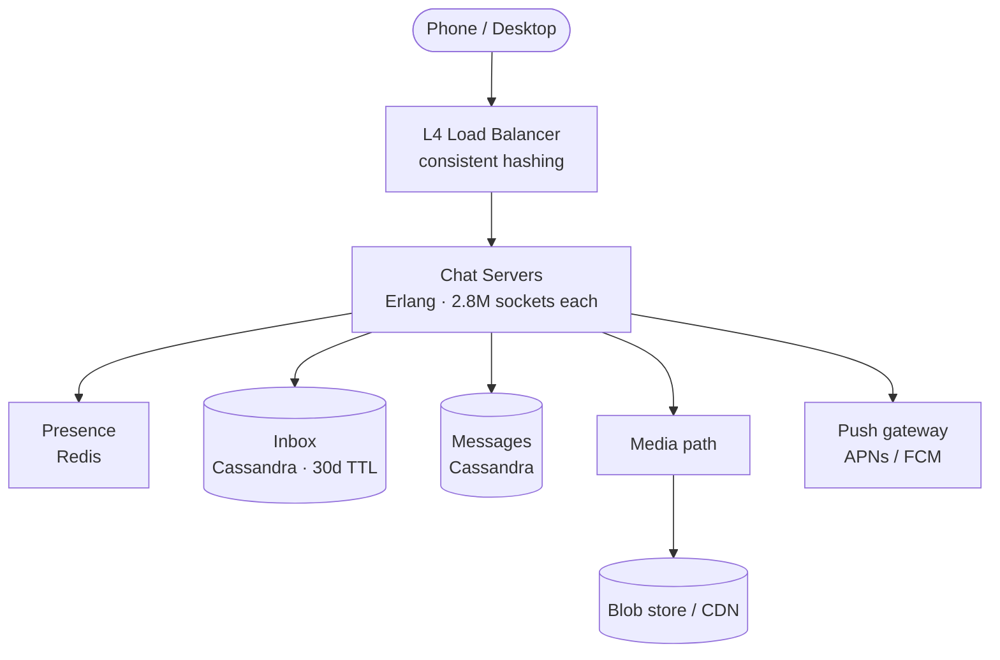

WhatsApp once served 2.5 billion people on roughly 550 servers, with a team of
about 50 engineers. Plenty of companies that size have more people than that in a
single standup. This post is about how that's even possible — and the handful of
stubborn design choices that made the math work.

<!--more-->

## First, what is it actually optimising for?

Not speed. A message that lands in half a second is fine. A message that quietly
goes missing is not. WhatsApp picks **reliability over latency** every time, and
once you accept that, a lot of the design falls out on its own.

Three numbers set the rules:

- **100 billion messages a day**, peaking around **1.2 million a second**.
- **~200 million phones connected at once**, each holding a live socket open.
- **End-to-end encryption**, so the server only ever sees scrambled bytes.

Hold those three in your head. Every choice below is just a sensible answer to one
of them.

## The architecture in one picture



Notice what the chat server *doesn't* do: it doesn't carry your photos, and it
doesn't decrypt anything. It moves small encrypted messages and gets out of the
way. That discipline is the reason the box count stays low.

## Density is the whole trick

The headline number is **2.8 million connections on a single server**. That's not
a typo. WhatsApp runs on **Erlang**, a language built for telephone switches, where
"millions of things happening at once" is the normal Tuesday.

Erlang gives you tiny, cheap processes — not operating-system threads, the
heavyweight kind, but featherweight ones that cost a few hundred bytes each. Each
phone gets its own little process. Each one cleans up its own memory without
freezing its neighbours. So about **150 chat servers** can hold 200 million live
connections, and the team stays small because the platform isn't fighting itself.

> [!NOTE]
> This is the part people skip. Most "how would you build WhatsApp" answers jump
> straight to databases. But the choice of *runtime* is what turns a thousand-server
> problem into a few-hundred-server one. The language is an architecture decision.

## The inbox pattern: a self-cleaning mailbox

Here's the clever bit for delivery. When you send a message to a group, the server
doesn't try to push it to everyone live. It writes the message once, then drops a
small pointer into each recipient's **inbox** — a per-user queue in Cassandra.

When your phone is online, it drains its inbox and sends back an **ACK** for each
message. That ACK deletes the entry. No ACK? The message just waits. So:

- If you're **online**, you get it in milliseconds.
- If you're **offline**, it sits in your inbox until you reconnect — for up to 30
  days, after which Cassandra's TTL sweeps it away on its own.

The inbox is a queue that empties itself when things go right and remembers when
they go wrong. No nightly cleanup job, no message lost.

> [!TIP]
> Cassandra is the database here for one reason: it's built for writes. At 1.2
> million messages a second you are writing constantly and reading in bursts. Pick
> the store that matches the *shape* of your traffic, not the one you know best.

## Encrypt once, send to a hundred people

End-to-end encryption sounds expensive for groups. If you encrypted a message
separately for each of 100 members, that's 100 crypto operations per message —
ugly at scale.

WhatsApp uses **Sender Keys** instead. You encrypt the message **once** with a
shared group key, and fan out the *same* ciphertext to everyone. One operation,
not a hundred.

```text
1:1 chat   → Double Ratchet   (a fresh key per message)
group chat → Sender Keys      (encrypt once, fan out the same bytes)
```

The server, the whole time, is just shuffling sealed envelopes it can't open. When
someone leaves the group, the key rotates so they can't read what comes next. Clean.

## Keep the big files off the hot path

People send about **10 petabytes** of photos and video a day. If that went through
the chat servers, they'd drown — and they have real work to do.

So media never touches them. The chat server hands your phone a **short-lived,
signed upload link**, and your phone uploads the (already-encrypted) file straight
to blob storage. Downloads come from a CDN the same way. The chat server only ever
sees a tiny bit of metadata: "there's a file, here's its id."

## The night everyone reconnected at once

Now the scar. In February 2014, a small router glitch knocked clients off — and
then **all of them tried to reconnect at the same instant**. The rush to rebuild
everyone's session state at once spiralled into work that grew far faster than the
number of users, and the system buckled under its own recovery.

> [!WARNING]
> A thundering herd of reconnects can hurt you more than the original outage. The
> fix is boring and non-negotiable: **exponential backoff with jitter** on the
> client. Don't let a million phones agree to retry on the same second.

That one outage is why every serious real-time system staggers its reconnects. It's
the kind of lesson you only really learn the hard way, so it's worth borrowing
WhatsApp's.

## The takeaway

None of these choices are flashy. An old language for concurrency. A boring queue
that cleans itself. Encrypt once. Keep big files off the critical path. Assume the
herd will stampede.

Put together, they let **50 people run a service for a third of the planet**. The
lesson isn't "use Erlang". It's that picking the few constraints that actually
matter — and refusing to budge on them — beats a hundred clever features. Small
team, small server count, no lost messages. That's the brilliant part.
