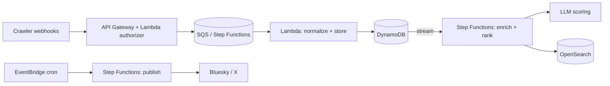

Discovering interesting events shouldn't require ten open tabs. This post walks
through the architecture of a fully serverless pipeline that ingests events from
web crawlers, enriches and ranks them with an LLM, indexes them for hybrid
search, and auto-publishes the best ones — all without a single long-running
server.

<!--more-->

## The shape of the problem

Three independent workloads, each with different scaling and failure
characteristics:

1. **Ingest** — bursty webhook traffic from crawlers.
2. **Enrich & rank** — LLM calls that are slow and occasionally fail.
3. **Publish** — scheduled, idempotent posting to social platforms.

Coupling these into one service would mean the slowest stage (LLM enrichment)
back-pressures the fastest (ingest). The design instead isolates each stage
behind its own queue and state machine.

## Architecture



Each arrow is an asynchronous boundary. A failure in enrichment never blocks
ingest; a rate limit on publishing never touches search.

> [!NOTE]
> DynamoDB Streams is doing real architectural work here — it turns "a row was
> written" into an event without the ingest path knowing anything about
> enrichment. New consumers can be added later with zero changes upstream.

## Ranking

Ranking blends a lexical score (recency, location, source quality) with an
LLM-derived relevance score, normalized into a single sort key written back to
the search index.

```python
def rank(event, query_ctx):
    lexical = recency(event) * 0.4 + source_quality(event) * 0.2
    semantic = llm_relevance(event, query_ctx)  # 0..1, cached per event
    return 0.5 * lexical + 0.5 * semantic
```

> [!TIP]
> Cache the LLM relevance score on the event record. Re-ranking on every query
> is where serverless bills quietly balloon — pay once at enrichment time.

> [!IMPORTANT]
> Make the publish stage **idempotent**. A dedup table keyed on a content hash
> means an EventBridge retry (or a duplicated crawl) can never double-post.

> [!WARNING]
> LLM calls fail more than you expect at volume. Wrap them in Step Functions
> retry/catch with jittered backoff, and route exhausted retries to a DLQ you
> actually monitor — not `/dev/null`.

> [!CAUTION]
> Don't bake long-lived cloud credentials into client bundles or Lambda env
> vars. Use scoped IAM roles and short-lived credentials; a leaked key in a
> public artifact is a very bad day.

## Why serverless was the right call

The workload is spiky and mostly idle. Paying per-invocation instead of for
always-on capacity matched the traffic shape, and the managed primitives (Step
Functions, DynamoDB Streams, EventBridge) removed most of the orchestration code
I'd otherwise own.

The full implementation — SST infrastructure-as-code, Lambdas, and the ranking
chain — is on [GitHub](https://github.com/iliazlobin/events-planner-sst).
