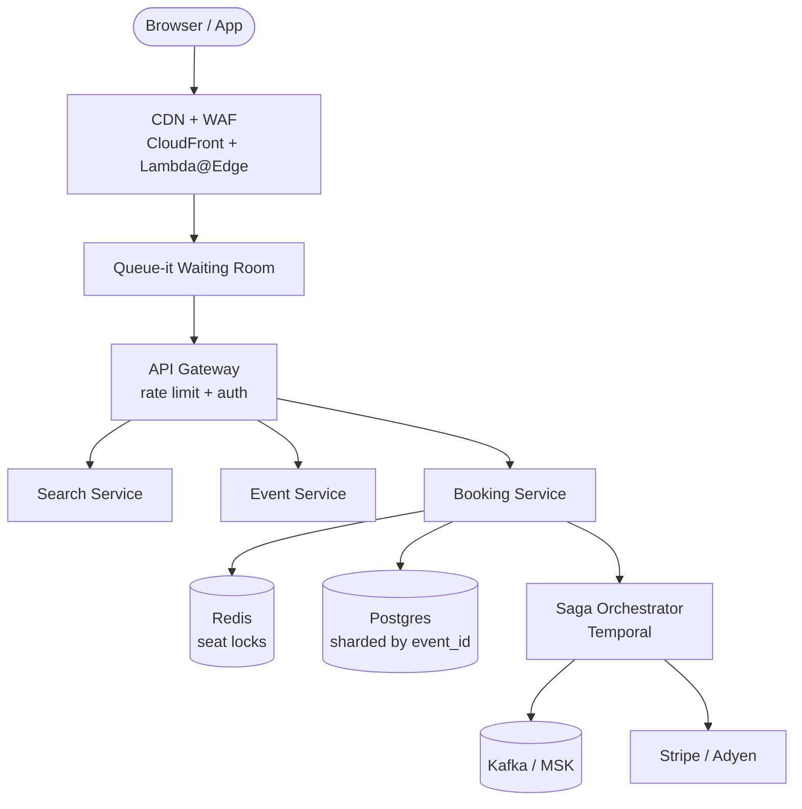

Ticketmaster sells roughly **500 million tickets a year**. On a bad day — or a very good one — it fields **3.5 billion requests**. It serves **14 million people** trying to buy seats at the same time, and fends off **566 million bot attacks** before lunch. The interesting part isn't the scale. It's that selling a seat twice is worse than a search result loading slowly. A page that lags annoys someone. A double booking ruins two someones, starts a refund chain, and ends up in the news.

<!--more-->

> "A seat sold twice is worse than a page that loads late."

That tension drives everything: browse can be fuzzy, but booking must be exact. Here's how they thread the needle.

## Architecture Overview

The path from "I want a ticket" to "It's mine" looks simple on the surface. It isn't.



**The rule:** search and browse ride the fast path. Once you click "buy," you enter a gated, transactional corridor where every step is reversible and every seat is guarded by three separate locks.

## The Three-Layer Seat Lock

Overselling a concert is the original sin of ticketing. Ticketmaster prevents it with a belt-and-suspenders chain:

1. **Redis SETNX EX** — grab a temporary hold in milliseconds. This absorbs the burst.
2. **Postgres CAS** — compare-and-swap on a version column. This catches races Redis misses.
3. **UNIQUE INDEX** — the database itself refuses to commit a duplicate seat. This is the guarantee.

> [!IMPORTANT]
> Redis handles the burst, but the UNIQUE INDEX is the "can't oversell" guarantee. If every other layer fails, the database still says no.

Why three layers? At 100,000 seat-lock requests per second, a single database row becomes a traffic light in a motorway. Redis shaves off 99% of the load. Postgres CAS mops up the collisions. The UNIQUE INDEX is the fire door.

The shard key is `event_id`. Every seat for one show lives on one Postgres shard. That isolates hot events — Taylor Swift doesn't slow down your local comedy club — and lets them pin a dedicated Redis node to the biggest onsales.

## The Onsale Queue: Letting Traffic In Slowly

When demand outstrips supply by a hundred to one, fairness matters more than speed. Ticketmaster uses Queue-it, an edge waiting room that admits buyers at a rate the backend can actually handle.

The flow is deliberate:

- **Pre-queue opens** 15 minutes before the onsale. People join in random order. Showing up early helps, but it doesn't guarantee front-of-line.
- **Verified Fan** runs a priority lottery 1–2 weeks ahead. Fans register, Ticketmaster scores them, and the luckiest get earlier queue slots.
- **HMAC-SHA256 tokens** prove you came through the queue. No token, no ticket.
- **Bounded admission** — the backend tells Queue-it how fast it can drain. If seat locks hit 80% of capacity, the gate narrows.

> [!TIP]
> Shard by `event_id`, not by user. A hot show gets its own Redis node and its own Postgres shard. Local shows barely notice.

## The Payment Saga: Pay Twice or Not at All

Booking a seat is a two-phase problem. First you hold it. Then you pay. If payment fails, you must release the seat. If payment succeeds but the booking service crashes, you must not charge again.

Ticketmaster runs this through **Temporal**, a workflow engine that orchestrates the saga:

```text
reserve seat  →  charge card (idempotency key)  →  confirm booking
       ↓                  ↓
  timeout           compensation: refund + release seat
```

The idempotency key is server-generated: `hash(user_id, seat_ids, nonce)`. Stripe sees the same key on retry and returns the same result. The booking service writes every event to a **transactional outbox** first, then publishes to Kafka. That gives exactly-once delivery even if the producer restarts.

> [!NOTE]
> Two-phase commit doesn't work here. If the payment gateway is down, 2PC blocks forever. A saga with compensation steps keeps moving and cleans up afterwards.

## Search and Seat Maps: Speed Without Promises

Search is the opposite of booking. It can be stale, cached, and guessed. Elasticsearch holds a denormalised index of performers, venues, and geo. Hot queries are cached in Redis and warmed before a big onsale.

The seat map is trickier. A venue might have 80,000 seats, and 80,000 people want to know which ones are left *now*. Ticketmaster renders the map as **SVG vector tiles**, one per section, cached at the CDN. Real-time availability streams over **SSE** (server-sent events), pushed from a Kafka consumer every 1–2 seconds. The browser overlays red dots on top of static tiles.

The "best available" algorithm scores contiguous blocks. Two seats together beat two seats apart. Aisle seats score higher. It's a travelling-salesman-esque knapsack problem, but for 80,000 items you just brute-force greedily and call it a day.

## The Scar: Eras Tour and the Code-Validation Collapse

The 2023 Eras Tour onsale was a stress test nobody asked for. Traffic hit **4× the prior peak**. The queue worked. The seat locks held. The database didn't flinch.

What broke was the **code-validation service** — the microservice that checks promo codes and presale passwords. It wasn't on the critical path for inventory, but it sat upstream of the booking flow. When bot traffic swamped it, requests backed up, threads starved, and the failure propagated downstream. People who made it through the queue couldn't buy tickets because an unrelated service was drowning.

> [!WARNING]
> The lesson isn't "add more capacity." It's "isolate your queue from your inventory." If a non-critical service degrades, return a 429 and let the booking path breathe. Don't let a promo-code check take down seat reservations.

The fix: circuit breakers around the validation service, stricter rate limits, and exponential backoff with jitter on the client. Standard stuff, but standard stuff only works if you wire it in before the load arrives.

## The Payoff

Ticketmaster's design is a study in choosing the right constraint for each path. Search is fast and loose. Booking is slow and exact. The queue throttles demand so the backend doesn't drown. The saga handles payment failure without human intervention. And three separate seat locks mean that even if Redis evaporates and Postgres hiccups, the database index still says: that seat is taken.

> "The fanciest system design in the world still breaks if you don't isolate your queue from your inventory."
