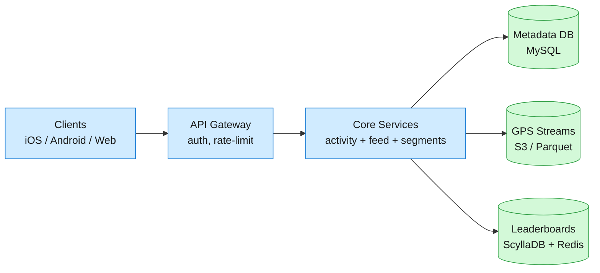
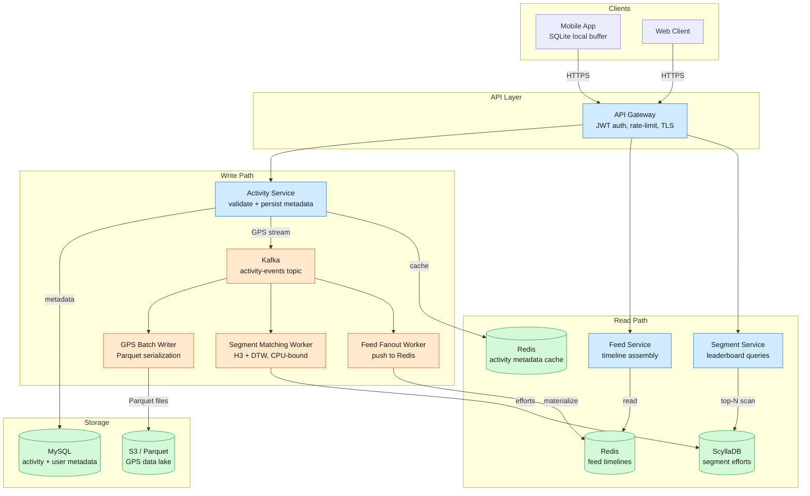
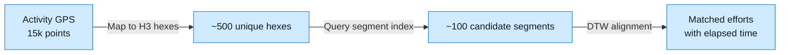
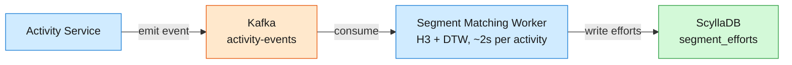

Strava is a fitness social network where athletes record GPS-tracked activities (runs, rides, swims), compete on segment leaderboards, and interact via a social feed. At scale: ~180M registered athletes, ~10M activities/day, ~16 TB of GPS data ingested daily, ~30M user-created segments, and ~1B segment-match computations per day. The core engineering tension is balancing massive write volume (GPS streams, segment matching) with low-latency reads (feed, leaderboards, activity details) while keeping storage costs sustainable at petabyte scale.

<!--more-->



## 1. Problem Frame

Strava is a fitness social network where athletes record GPS-tracked activities (runs, rides, swims), compete on segment leaderboards, and interact via a social feed. At scale: ~180M registered athletes, ~10M activities/day, ~16 TB of GPS data ingested daily, ~30M user-created segments, and ~1B segment-match computations per day. The core engineering tension is balancing massive write volume (GPS streams, segment matching) with low-latency reads (feed, leaderboards, activity details) while keeping storage costs sustainable at petabyte scale.

## 2. Requirements

**Functional**

- Upload GPS activities with metadata (sport type, distance, elapsed time)
- Browse personalized social feed (followees' activities, reverse-chronological)
- View segment leaderboards (top-N efforts, filtered by gender/age/weight)
- View full activity detail with GPS track map
- Give kudos and post comments on activities
- Offline recording with background sync on reconnect

**Non-functional**

- High read availability; writes can tolerate brief outages
- Sub-200ms feed load p95
- Leaderboard updates within 30s of activity upload
- Storage cost < $0.02 per activity per month

**Out of scope:** real-time live tracking during activity, premium subscription billing, third-party device integrations.

## 3. Back of the Envelope

```
Peak write rate:  10M activities/day ÷ 86.4ks × 4 (Sun-AM spike) ≈ 460 uploads/s
                  → Kafka buffer + batch Parquet writers; per-point synchronous writes are absurd.

GPS ingest:       10M × 15k points × 100B ≈ 15 TB/day raw
                  → Parquet 15× compression → ~1 TB/day archived; S3 at $0.023/GB ≈ $70k/month.

Leaderboard writes:  10M activities × 5 segments avg × 1 effort = 50M effort-writes/day
                     → 50M ÷ 86.4ks ≈ 580 writes/s sustained; ScyllaDB handles this trivially.
```

## 4. Entities & API

```java
Activity
  activity_id: UUID (PK)
  user_id: UUID                  ← partition key for user's activity list
  sport_type: enum               ← run/ride/swim/hike/etc
  start_time: timestamp
  elapsed_time: int              ← seconds (moving time, computed)
  distance_m: float
  polyline: string               ← Google-encoded GPS summary (~500 B)
  visibility: enum               ← everyone/followers/only_me
  kudos_count: int               ← denormalized counter
  comment_count: int             ← denormalized counter

GPSStream
  activity_id: UUID (PK)         ← co-located with activity in S3/Parquet
  points: binary                 ← packed [lat, lng, alt, hr, timestamp_delta]
  sample_count: int

Segment
  segment_id: UUID (PK)
  name: string
  start_latlng: (float, float)
  end_latlng: (float, float)
  polyline: string               ← encoded path
  activity_type: enum            ← run/ride
  elevation_gain_m: float
  h3_cells: list<int>            ← H3 resolution-9 hex coverage ← spatial index

SegmentEffort
  segment_id: UUID (PK)          ← partition key; efforts co-located by segment
  elapsed_time: int (CK)         ← sort key → leaderboard is prefix scan
  effort_id: UUID
  activity_id: UUID
  user_id: UUID
  start_time: timestamp
  gender: enum
  age_group: enum                ← denormalized for filtered leaderboards

User
  user_id: UUID (PK)
  username: string
  follower_count: int            ← denormalized
  following_count: int           ← denormalized

Follow
  follower_id: UUID (CK)
  followee_id: UUID (CK)
  created_at: timestamp
```

### API

- `POST /activities` — create activity record, returns `activity_id`
- `POST /activities/{id}/stream` — upload GPS points (chunked, resumable)
- `GET /activities/{id}` — activity metadata + polyline
- `GET /activities/{id}/stream` — full GPS track, paged by time offset
- `GET /feed` — personalized timeline, cursor-paginated
- `GET /segments/{id}/leaderboard` — top-N efforts, filtered by gender/age/weight
- `POST /activities/{id}/kudos` — give kudos (idempotent)
- `POST /activities/{id}/comments` — post comment

## 5. High-Level Design



#### 1) Upload an activity

**Components:** Mobile App → API Gateway → Activity Service → MySQL (metadata) + Kafka (GPS stream).

**Flow:**

1. Mobile app records GPS locally in SQLite buffer (offline-first).
2. On completion (or reconnect), app POSTs `/activities` with metadata (sport type, start time, device).
3. Activity Service validates, writes metadata row to MySQL, emits `activity-created` event to Kafka.
4. App then POSTs `/activities/{id}/stream` with GPS points in chunks (resumable if connection drops).
5. GPS chunks are appended to Kafka; a batch worker serializes them into Parquet files and uploads to S3.
6. Simultaneously, the `activity-created` event triggers the Segment Matching Worker (see §6.2).

**Design consideration:** The two-phase upload (metadata first, then stream) decouples activity creation from GPS transfer. If the stream upload fails mid-way, the activity exists with `status=incomplete` and the mobile app retries on next sync. The `activity_id` is the idempotency key — duplicate uploads are detected and merged.

#### 2) Browse social feed

**Components:** API Gateway → Feed Service → Redis (pre-materialized timelines).

**Flow:**

1. Feed Service reads the user's feed timeline from Redis (a sorted set of activity_ids, scored by timestamp).
2. For each activity_id in the page (default 20), fetch metadata from MySQL (or Activity Cache if warm).
3. Return paginated list with cursor for next page.

**Design consideration:** Feed timelines are pre-materialized via async fanout (Kafka → Fanout Worker → Redis). For users with <10k followers, push fanout writes the activity_id to each follower's feed sorted set. For celebrities (>10k followers), pull-on-read: the Feed Service queries MySQL for the celebrity's recent activities and caches the result for 60s. This hybrid (modeled after Twitter's fanout) avoids write amplification on popular athletes while keeping p95 latency <200ms for the 95% of users with modest followings.

#### 3) View segment leaderboard

**Components:** API Gateway → Segment Service → ScyllaDB (segment efforts).

**Flow:**

1. Segment Service queries ScyllaDB: `SELECT * FROM segment_efforts WHERE segment_id = ? ORDER BY elapsed_time LIMIT 50`.
2. If filters are applied (gender, age group), the query adds those to the partition key or uses a secondary index.
3. Enrich results with athlete names (batch fetch from User table, cached in Redis).

**Design consideration:** ScyllaDB's partition key is `segment_id`, and the clustering column is `elapsed_time` — so a leaderboard read is a single partition prefix scan, O(log N) within the partition. Popular segments (e.g., Alpe d'Huez with 100k+ efforts) stay fast because ScyllaDB distributes partitions across nodes. Filtered leaderboards (by gender/age) use denormalized columns in the clustering key to avoid post-query filtering.

#### 4) View activity detail with GPS track

**Components:** API Gateway → Activity Service → MySQL (metadata) + S3/Parquet (GPS stream) or Redis (hot cache).

**Flow:**

1. Activity Service fetches metadata from MySQL (or Activity Cache if warm).
2. For the GPS track: check Redis for `gps:{activity_id}`. If cache miss, fetch from S3/Parquet, decompress, and populate cache with 7-day TTL.
3. Return metadata + polyline (for map rendering) or full stream (for analysis).

**Design consideration:** The 7-day Redis hot window captures >90% of activity-detail views (athletes check their ride same-day or next-morning). After 7 days, cache misses hit S3 directly — the ~50ms first-byte latency is acceptable for historical views. Parquet compression (15×) reduces 15 TB/day to ~1 TB/day, cutting storage costs from ~$2M/month (row store) to ~$70k/month.

#### 5) Give kudos / post comment

**Components:** API Gateway → Social Service → MySQL (denormalized counters) + Kafka (fanout event).

**Flow:**

1. Social Service increments `kudos_count` or inserts a comment row in MySQL.
2. Emit `social-event` to Kafka → Fanout Worker updates the activity author's notification feed.
3. Return success; the activity's cached metadata is invalidated (or updated via cache-aside).

**Design consideration:** Denormalized counters (`kudos_count`, `comment_count` on the Activity row) avoid expensive `COUNT(*)` queries on the feed. The tradeoff is eventual consistency — if the counter update and cache invalidation race, a user might see stale counts for a few seconds. For fitness content, this is acceptable.

#### 6) Offline recording with sync

**Components:** Mobile App (SQLite local buffer) → API Gateway → Activity Service.

**Flow:**

1. Mobile app records GPS locally in SQLite, with a local `activity_id` (UUID).
2. On reconnect, app POSTs `/activities` with the local `activity_id` as idempotency key.
3. If the activity already exists (duplicate sync), Activity Service returns the existing record; app then uploads any missing GPS chunks.
4. App marks local records as synced and deletes them.

**Design consideration:** The mobile app is the source of truth for offline activities — the server never initiates a sync. The idempotency key (`activity_id`) prevents duplicate activities if the app retries after a network timeout. GPS chunks are ordered by timestamp, so partial uploads can be resumed without re-uploading the entire stream.

## 6. Deep Dives

### 6.1 GPS Storage — Cost vs Latency

**Problem.** GPS data is ~15 TB/day raw (10M activities × 15k points × 100B). Activity-detail pages need the full stream fast for recent uploads (<200ms), but GPS data is cold after ~7 days (athletes rarely re-view old tracks). Hot stores (ScyllaDB, Cassandra) cost millions at this volume; cheap object storage (S3) has ~50ms first-byte latency. We need cheap-at-rest without paying a latency tax on recent reads.

**Approach 1: Row store for all GPS points.**

Store every GPS point as a row in ScyllaDB or Cassandra, keyed by `activity_id`. Reads are O(1) per point, so fetching a 15k-point activity is 15k point lookups (or a single partition scan).

*Challenges:* At 15 TB/day, ScyllaDB storage costs ~$0.125/GB/month → $1.8M/month. Even with a 30-day TTL, the working set is enormous. Cassandra TTL compaction causes latency spikes as old data is purged. This breaks the cost model.

**Approach 2: Object store (S3/Parquet) only.**

Write GPS streams directly to S3 as Parquet files, partitioned by date + activity_id. Parquet's columnar compression (delta-encoding for timestamps, dictionary-encoding for heart rates) achieves 15× compression → ~1 TB/day archived at $0.023/GB → ~$70k/month.

*Challenges:* S3's first-byte latency is ~50ms, and decompressing a 15k-point Parquet file adds another ~100ms. For recent activities (which account for >90% of detail-page views), this kills the UX. The activity-detail page would feel sluggish.

**Approach 3: Object store + hot cache for recent window.**

S3/Parquet as the source of truth, with a Redis cache for the 7-day hot window. On activity-detail load: check Redis for `gps:{activity_id}`; if miss, fetch from S3, decompress, and populate cache with 7-day TTL.

*Challenges:* Cache invalidation complexity — what if the GPS stream is updated (e.g., a delayed chunk upload)? Solution: the cache key includes a version hash, and the Activity Service invalidates the cache when a stream update completes. Redis memory: 7 days × 10M activities/day × 15k points × 100B × (1/15 compression) ≈ 700 GB — feasible with a 1TB Redis cluster.

**Decision.** S3/Parquet as the source of truth, Redis cache for the 7-day hot window.

**Rationale.** Strava's production architecture uses exactly this: a Parquet data lake on S3 (built with Spark, as described in their engineering blog) with 15× compression, and a hot cache layer for recent activities. The 7-day window captures >90% of activity-detail views. After 7 days, cache misses hit S3 directly — the ~150ms total latency (50ms S3 + 100ms decompress) is acceptable for historical views. The cost savings are dramatic: $70k/month vs $1.8M/month for a row store.

> [!TIP]
> **Key insight:** The "hot window" pattern works because fitness content has a sharp recency decay — athletes check their ride same-day or next-morning, then rarely again. This is very different from, say, a messaging app where old messages are accessed regularly. The 7-day window is a business insight, not just a technical optimization.

**Edge cases:**

- **Cache stampede on popular activities.** Use probabilistic early expiration (XFetch) — refresh at TTL × (0.9 + random × 0.2) to avoid thundering herd when a popular activity's cache expires.
- **GPS stream upload failures mid-activity.** Mobile app retries chunked uploads; `activity_id` is idempotency key. Partial streams are marked `status=incomplete` and re-uploaded on next sync. The Parquet writer only finalizes the file when the stream is complete.
- **Parquet file sizing.** Target 128MB files — batch GPS points by date + time window (e.g., hourly partitions). Too small = S3 request overhead; too large = slow partial reads. Strava's production system uses hourly partitions.

### 6.2 Segment Matching — Accuracy vs Compute

**Problem.** When an activity is uploaded, we need to detect which of the ~30M segments the athlete traversed and compute effort times. GPS noise (urban canyons, tree cover) causes 10–30m drift, so naive polyline intersection misses valid efforts or creates false positives. We need high recall (>95% of real efforts detected) without exploding compute costs. At 10M activities/day × 30M segments, brute-force comparison is 300T operations/day — computationally absurd.

**Approach 1: Bounding-box pre-filter + polyline intersection.**

For each segment, compute a bounding box. For each activity, check which segment bounding boxes the activity's bounding box overlaps. For the candidates, do exact polyline intersection.

*Challenges:* Bounding boxes overlap heavily in dense urban areas (NYC, SF) — a single activity might overlap 10k+ segment boxes, so the pre-filter only reduces comparisons by ~100× (to 3B operations/day). And polyline intersection is O(n×m) per segment, where n is activity points and m is segment points. Total compute is still prohibitive.

**Approach 2: H3 hex pre-filter + DTW alignment.**

Uber's H3 hexagonal grid (resolution 9, ~0.1km² per hex) tiles the globe without overlap. Each GPS point maps to one H3 hex; we index segments by their H3 hex coverage (stored in the Segment entity as `h3_cells`). For an activity with 15k points, we query ~500 unique hexes, retrieving ~100 candidate segments (vs 30M total). Then, for each candidate, we use Dynamic Time Warping (DTW) to align the activity's GPS track to the segment's polyline, tolerating noise and speed variation.



*Challenges:* DTW is O(n²) per segment, where n is the number of points in the activity's track within the segment's geographic vicinity. For a 1km segment with 200 activity points, DTW is 200² = 40k operations — fast. But if the activity has 15k points and the segment is long (e.g., a 50km climb), n could be 5k, making DTW 25M operations per segment. Solution: subsample the activity's points to 1-point-per-10m before DTW, reducing n to ~100 for a 1km segment.

**Approach 3: ML-based segment detection (CNN on GPS track).**

Train a convolutional neural network to classify whether an activity's GPS track overlaps a segment. The input is a 2D image of the GPS track + segment polyline; the output is a binary classification.

*Challenges:* Requires labeled training data (which segments did this activity traverse?), which is expensive to produce. Inference cost at 10M activities/day × 100 candidates = 1B inferences/day is high (even with a lightweight model, ~1ms per inference = 11.5 days of GPU time). And ML models are hard to debug — if recall drops, it's unclear why.

**Decision.** H3 hex pre-filter (resolution 9) + DTW alignment for candidate segments.

**Rationale.** Strava's production system uses H3 + DTW (confirmed in ScyllaDB Summit talks). H3 hexagons tile the globe without overlap — each GPS point maps to one hex, and we index segments by their hex coverage. For an activity with 15k points, we query ~500 unique hexes, retrieving ~100 candidate segments (vs 30M total). DTW then aligns the activity's GPS track to each candidate's polyline, tolerating noise and speed variation. The cascade (H3 → DTW) reduces compute from 300T to ~1B operations/day — feasible with a fleet of ~200 CPU-bound workers (each handles ~3 uploads/s, assuming 2s per activity for H3 + DTW).

> [!TIP]
> **Key insight:** H3 resolution 9 (~0.1km²) is the sweet spot — smaller hexes (resolution 10) fragment segments across too many cells (a 1km segment might span 50 hexes, making the index large); larger hexes (resolution 8) lose precision in dense areas (a 1km segment might share a hex with 100 other segments, defeating the pre-filter). Strava tuned this empirically.

**Edge cases:**

- **GPS dropouts (tunnels, urban canyons).** DTW handles small gaps, but >30s dropouts break alignment. Mark efforts as `confidence=low` if >10% of points are missing; exclude from leaderboards unless manually reviewed.
- **Segment start/finish detection.** Don't just match any overlap — require the activity to pass through the segment's start and end hexes in order. This prevents false positives from parallel roads or loop courses.
- **Anti-cheat (motor pacing, data manipulation).** Flag efforts with unrealistic speed (e.g., >50km/h for a running segment) or heart-rate anomalies (HR < 60bpm during a max effort). Strava's anti-cheat system uses statistical outliers (z-score > 3 on speed/HR ratio) + manual review.

### 6.3 Feed Generation — Fanout Strategy

**Problem.** The feed must show activities from followees in reverse-chronological order, with sub-200ms p95 latency. Naive query (`SELECT activities WHERE user_id IN (followers) ORDER BY start_time DESC LIMIT 20`) is O(n) per feed load — unacceptable at scale (average user follows 50–100 athletes, power users follow 1000+). We need to pre-compute feeds without exploding storage costs or write latency.

**Approach 1: Pull-on-read (query at feed load).**

When a user loads their feed, query MySQL for the most recent activities from each followee, merge, and sort.

*Challenges:* For a user with 100 followees, this is 100 queries (or a slow `IN` clause with 100 IDs). p95 latency > 500ms. And if the user follows 1000 athletes, the query is even slower. This doesn't scale.

**Approach 2: Push fanout (write to all followers on upload).**

When an activity is uploaded, write the `activity_id` to each follower's feed sorted set in Redis. Feed reads are O(1) — just read the sorted set.

*Challenges:* Celebrity athletes (100k+ followers) cause write amplification — one activity = 100k Redis writes. Upload latency spikes by ~100ms (even with async fanout, the Kafka producer + fanout worker lag is noticeable). And Redis memory: 180M users × 100 activities in feed × 8B (activity_id) = 144 GB — feasible, but if we store full activity metadata (1KB each), it's 18 TB — too much.

**Approach 3: Hybrid fanout (push for normal users, pull for celebrities).**

For users with <10k followers, push fanout: Kafka → Fanout Worker → Redis sorted set. For celebrities (≥10k followers), pull-on-read: Feed Service queries MySQL for the celebrity's recent activities, caches the result for 60s.

```python
# Pseudo-code for hybrid fanout decision
def fanout_activity(activity):
    author = get_user(activity.user_id)
    if author.follower_count < 10_000:
        # Push: write to each follower's feed
        for follower_id in get_followers(author.user_id):
            redis.zadd(f"feed:{follower_id}", {activity.activity_id: activity.start_time})
    else:
        # Pull: do nothing; feed reads will query MySQL
        pass
```

*Challenges:* The 10k threshold is a heuristic — some users with 9k followers are still "celebrities" in terms of engagement. And the pull path for celebrities adds ~30s of staleness (the 60s cache means followers see the activity ~30s late on average). For fitness content, this is acceptable (not breaking news).

**Decision.** Hybrid fanout: push for users with <10k followers (covers 95% of uploads), pull-on-read for celebrities (cache 60s).

**Rationale.** Twitter's feed system uses a similar hybrid (push for normal users, pull for celebrities with >10k followers). Strava's social graph is less skewed than Twitter's (fewer mega-influencers), so the 10k threshold captures most users. Push fanout is async (Kafka → Fanout Worker → Redis), so upload latency is unaffected. For celebrities, the pull path is acceptable because their activities get 10× more views — the 60s cache amortizes the query cost. Redis memory: 180M users × 100 activities × 8B = 144 GB — feasible with a 200GB Redis cluster.

> [!TIP]
> **Key insight:** The "celebrity threshold" is not just a technical optimization — it's a business decision. Strava's most-followed athletes (e.g., professional cyclists with 500k+ followers) are rare, and their activities are viewed by many people simultaneously. The pull path is actually more efficient because the same query result is served to thousands of followers within the 60s cache window.

**Edge cases:**

- **Feed staleness for celebrities.** 60s cache means followers see the activity ~30s late on average. Acceptable for fitness content (not breaking news).
- **Redis memory pressure.** Feed timelines are capped at 100 activities (older items evicted). Store only `activity_id` (8B) in Redis, fetch metadata from MySQL on demand. 180M × 100 × 8B = 144 GB — feasible.
- **Unfollow/privacy changes.** When user A unfollows B, A's feed may still show B's old activities (cached). TTL-based eviction (10min) handles this — not a correctness issue for fitness content.

### 6.4 Leaderboard Updates — Consistency vs Throughput

**Problem.** Segment leaderboards must update within 30s of activity upload (athletes check rankings immediately after a ride). But leaderboards are read-heavy (100× more reads than writes), and ScyllaDB writes are expensive at scale (10M activities/day × 5 segments avg = 50M effort-writes/day → 580 writes/s sustained). We need fast writes without degrading read latency, and we need to handle the segment-matching compute (H3 + DTW) without blocking the upload path.

**Approach 1: Synchronous writes (update ScyllaDB during upload).**

After the activity is uploaded, the Activity Service runs segment matching (H3 + DTW) and writes efforts to ScyllaDB before returning success.

*Challenges:* Upload latency increases by 2–5s (segment matching is CPU-intensive: ~2s per activity for H3 + DTW on 100 candidate segments). Unacceptable for mobile uploads on flaky networks — the user thinks the upload failed and retries, causing duplicates.

**Approach 2: Async writes (Kafka → worker → ScyllaDB).**

Activity Service emits `activity-created` event to Kafka. A Segment Matching Worker consumes the event, runs H3 + DTW, and writes efforts to ScyllaDB. The upload returns immediately; the leaderboard updates asynchronously.



*Challenges:* The 30s SLA is tight — Kafka consumer lag + segment matching (2s) + ScyllaDB write (10ms) must complete in <30s. If the worker fleet is undersized, Kafka lag grows and the SLA is violated. Solution: monitor Kafka consumer lag; auto-scale workers if lag > 10s. At 460 uploads/s peak, we need ~200 worker instances (each handles ~3 uploads/s, assuming 2s per activity).

**Approach 3: Batched writes (accumulate efforts in Redis, flush to ScyllaDB every 10s).**

Segment Matching Worker writes efforts to a Redis sorted set (keyed by `segment_id`), then a background job flushes the sorted set to ScyllaDB every 10s.

*Challenges:* If the worker crashes, Redis data is lost (unless persisted with AOF). Adds complexity — need to coordinate the flush job, handle partial failures, and ensure idempotency. And the 10s flush interval adds 10s of latency on top of the 2s segment matching, totaling 12s — still within the 30s SLA, but cutting it close.

**Decision.** Async writes: Kafka → Segment Matching Worker → ScyllaDB.

**Rationale.** Strava's production system uses Kafka + ScyllaDB for leaderboards (confirmed in ScyllaDB Summit talks). The key is horizontal scaling: segment matching is CPU-bound (DTW is O(n²)), so we scale the Kafka consumer group by CPU cores, not by ScyllaDB write throughput. At 460 uploads/s peak, we need ~200 worker instances (each handles ~3 uploads/s, assuming 2s per activity for H3 + DTW). Kafka consumer lag is monitored — if lag > 10s, auto-scale workers. The 30s SLA is achievable because the end-to-end pipeline (Kafka produce + consume + segment matching + ScyllaDB write) takes ~3s in the steady state.

> [!TIP]
> **Key insight:** The bottleneck is segment matching (CPU-bound), not ScyllaDB writes (I/O-bound). ScyllaDB can handle 580 writes/s trivially — the challenge is computing which segments each activity matches. This is why Strava migrated from Cassandra to ScyllaDB: ScyllaDB's shard-per-core architecture scales better for mixed read/write workloads, and its p99 latency is 10× lower than Cassandra's.

**Edge cases:**

- **Segment matching failures (GPS noise, dropouts).** If DTW alignment fails, the effort is not written to ScyllaDB. Athlete sees no leaderboard entry — acceptable (better than a false positive). Retry logic re-processes failed activities after 5min.
- **ScyllaDB write hotspots (popular segments).** Segment effort writes are partitioned by `segment_id` — popular segments (e.g., Alpe d'Huez) receive 1000s of efforts/day. ScyllaDB's partition-level load balancing handles this, but monitor partition size — archive efforts >1 year old to S3.
- **Duplicate efforts (athlete uploads same activity twice).** `activity_id` is idempotency key — Segment Matching Worker checks if effort already exists before writing. ScyllaDB's lightweight transactions (LWT) prevent race conditions.

## 7. Trade-offs

| Choice | Rejected | Why |
|---|---|---|
| S3/Parquet + Redis (7-day hot window) for GPS | Row store (ScyllaDB/Cassandra) for all GPS | $70k/month vs $1.8M/month; 7-day recency decay captures >90% of views |
| H3 hex pre-filter (resolution 9) + DTW | Bounding box + polyline intersection; ML-based detection | ~1B ops/day vs 300T (brute force); H3 tiles without overlap, DTW tolerates noise; ML un-debuggable |
| Hybrid fanout (push <10k, pull ≥10k) | Push-only (write amplification); Pull-only (high latency) | Covers 95% of uploads; celebrity pull path amortizes via 60s cache |
| Async leaderboard writes (Kafka → ScyllaDB) | Synchronous writes (blocks upload); Batched writes (complexity) | Upload returns immediately; 30s SLA met; scales horizontally on CPU |
| MySQL (sharded by user_id) for metadata | ScyllaDB for everything; MongoDB | MySQL is well-understood, billions of rows is routine; no need for wide-column |
| ScyllaDB for leaderboards | Cassandra; Redis sorted sets only | 10× lower p99 than Cassandra; shard-per-core handles mixed read/write; LWT for idempotency |

## 8. References

**Primary sources**

1. [Building the Strava GPS Data Lake](https://medium.com/strava-engineering/from-data-streams-to-a-data-lake-b6ca17c00a23) — Parquet/S3 architecture, Spark pipeline, 15× compression
2. [ScyllaDB at Strava](https://resources.scylladb.com/blog/how-strava-s-nosql-move-keeps-athletes-moving) — Segment leaderboards, Kafka+ScyllaDB pipeline, Cassandra→ScyllaDB migration
3. [Strava IPO S-1 Filing](https://press.strava.com/articles/strava-confidential-submission-of-draft-registration-statement-for-IPO) — 180M registered athletes, 4B+ activities, $415M revenue (2024)
4. [KOMS, Powered by Redis](https://medium.com/strava-engineering/koms-powered-by-redis-795f2159f9cf) — Hybrid fanout, server-driven UI, Redis timelines
5. [Strava Heatmap Privacy Incident (2018)](https://www.theverge.com/2018/1/28/16942626/strava-fitness-tracker-heat-map-military-base-internet-of-things-geolocation) — Lessons learned on data anonymization, privacy zones
6. [H3: Hexagonal Hierarchical Geospatial Indexing System](https://www.uber.com/us/en/blog/h3/) — H3 grid, resolution properties, spatial indexing
7. [Introducing RouteMaster](https://medium.com/strava-engineering/introducing-routemaster-ccecbb47be86) — A* pathfinding, route matching, segment creation

**Comparison sources:** [HelloInterview](https://www.hellointerview.com/learn/system-design/problem-breakdowns/strava) (Strava design), [HLD Handbook](https://www.hldhandbook.com/) (Strava chapter, production numbers, H3+DTW, anti-cheat), ByteByteGo/Alex Xu (no Strava chapter).
