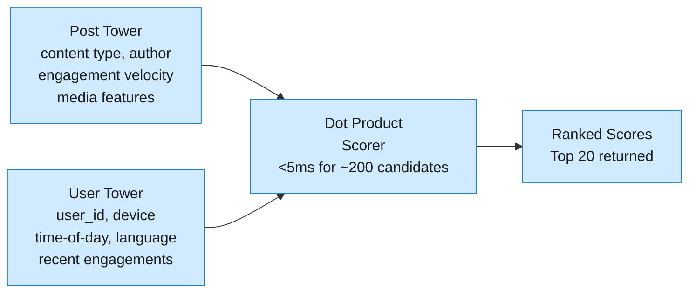
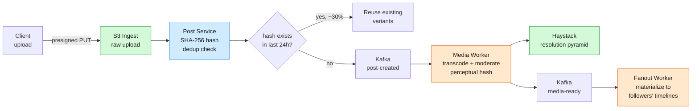
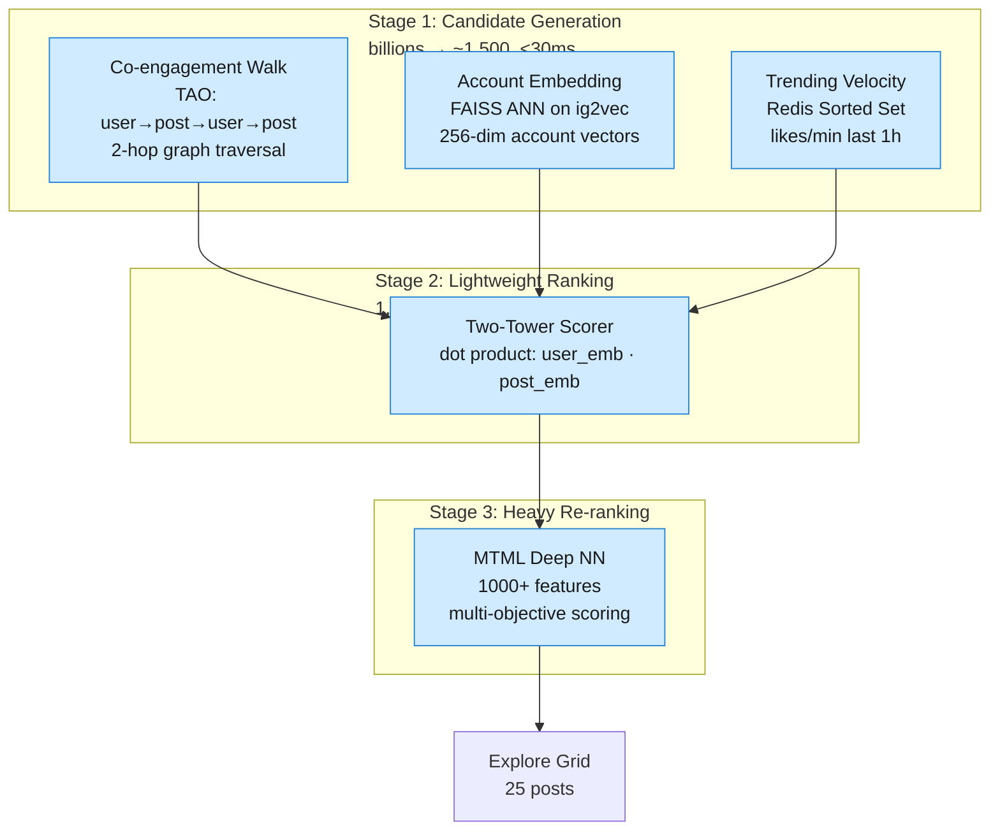

A comprehensive system design for Instagram: 2B DAU, 100M daily posts, ML-ranked feeds, and 7M privacy checks per second against a 600B-edge social graph.

## 1. Problem Frame

Instagram is a photo and video sharing platform where ~2B daily active users upload ~100M posts and ~500M stories per day, browse an ML-ranked feed, and discover new content through Explore. The social graph is power-law: median users have ~150 followers while celebrities have 50M+. Three engineering tensions define the architecture: (1) assembling a personalized, ML-ranked feed for 350K read QPS under 500ms while celebrity write amplification explodes to 50M+ writes per post, (2) ingesting and transcoding 200+ TB of new media daily without making uploads feel slow or serving broken thumbnails, and (3) running 7M+ privacy checks per second against a 600B-edge social graph with sub-millisecond latency.

## 2. Requirements

**Functional**

- FR1: Upload photos and short videos with captions, filters, and location tags

- FR2: Browse a personalized ML-ranked feed from followed accounts

- FR3: Follow and unfollow other users; view follower/following lists

- FR4: Post and view 24-hour ephemeral stories with viewership tracking

- FR5: Like, comment, and save posts; see like/comment counts

- FR6: Discover new content through Explore — accounts the user does not follow

**Non-functional**

- NFR1: Feed load p95 < 500ms; upload acknowledgement < 2s; story post visible < 200ms

- NFR2: 2B DAU with 99.9% availability; 350K feed reads/s, 3,500 uploads/s peak

- NFR3: New post visible in followers' feeds within 1s of media-ready event

- NFR4: Content safety: perceptual hash moderation blocks known CSAM before CDN addressability

**Out of scope:** Direct messaging (MQTT gateways, E2EE, inbox sync), Reels short-form video (dedicated ranking surface, music licensing), advertising and shopping, live streaming, notifications infrastructure.

## 3. Back of the Envelope

**Feed read throughput.** 2B DAU × 5 feed loads/day ÷ 86,400 s ≈ 115K avg QPS; peak (US evening) ≈ 3× avg → **~350K feed reads/s**. Each read must merge up to 150 followees' posts and return 20 ML-ranked results in <500ms. Pure pull-on-read at 350K QPS × 150 partitions = 52.5M scatter-gathers/s — untenable. **Decision: pre-materialize timelines (push fan-out) for 99% of users; pull-on-read only for celebrities.**

**Celebrity write amplification.** A single post from an account with 50M followers fans out to 50M timeline writes. At 3,500 uploads/s peak, if even 1% are celebrity posts: 35 × 50M = **1.75B writes/s** — saturates any push pipeline. **Decision: push for <10K followers (covers 99% of accounts), pull-on-read with 60s cache for celebrities.**

**Media ingest volume.** 100M posts/day × 2 MB avg photo = **~200 TB/day** of new raw media. Each photo generates 3 resolution variants (150px, 640px, 1080px); each video generates 4 HLS renditions. Synchronous transcoding at 3,500 concurrent uploads would require thousands of GPU workers. **Decision: presigned S3 upload (API tier never touches media bytes), async transcode pipeline, media-ready gate before fan-out.**

## 4. Entities & API

```sql
Post
  post_id: bigint (PK)           ← 64-bit Snowflake: 41b timestamp + 13b shard + 10b seq
  user_id: bigint (CK)           ← partition key for author's post grid
  media_keys: list<text>         ← CDN variant keys (thumb 150px, feed 640px, detail 1080px)
  caption: text
  created_at: timestamp
  like_count: int                ← denormalized; eventual consistency via Redis INCR
  comment_count: int             ← denormalized; async Kafka consumer flush

User
  user_id: bigint (PK)           ← 64-bit Snowflake
  username: text (unique)        ← NFKC-normalized for Unicode-aware prefix search
  bio: text
  follower_count: int            ← gates celebrity threshold (>=10K for pull path)
  following_count: int           ← updated asynchronously; cached in TAO

Follow
  follower_id: bigint (CK)       ← shard key: all follows by one user co-located
  followee_id: bigint (CK)       ← reverse index via mirror table for fan-out queries
  created_at: timestamp

Story
  story_id: timeuuid (CK)        ← time-sortable; Cassandra TTL = 86400 (24h expiry)
  author_id: bigint (PK)
  media_url: text
  created_at: timestamp
  expires_at: timestamp          ← 24h after created_at; enforced by dual Redis + Cassandra TTL

Like
  post_id: bigint (CK)
  user_id: bigint (CK)           ← UNIQUE(post_id, user_id) for idempotency
  created_at: timestamp

FeedEntry
  user_id: bigint (PK)           ← feed owner; a single sorted-set scan returns the feed
  post_id: bigint (CK)           ← scored by ML rank at fan-out time
  score: float                   ← MTML engagement prediction weighted combo
  ttl: timestamp                 ← auto-evict entries >30 days old

AccountEmbedding
  account_id: bigint (PK)
  vector: float[256]             ← ig2vec: Word2Vec on co-engagement graph; FAISS-indexed
 
... (truncated)
```

**API**

- `POST /posts/presigned-url` — returns time-limited S3 presigned PUT URL (15-min TTL) for direct media upload

- `POST /posts` — create post with media keys + caption + filter; returns `post_id`

- `GET /feed` — personalized ML-ranked feed, cursor-paginated (`?cursor=<base64>`)

- `GET /posts/{id}` — full post detail with comments

- `POST /posts/{id}/likes` — like a post (idempotent); returns updated like count

- `POST /posts/{id}/comments` — add a comment; returns `comment_id`

- `POST /story` — create a story (media key + optional caption); expires in 24h

- `GET /stories/feed` — story ring for followed accounts (active stories only)

- `POST /users/{id}/follow` — follow a user (idempotent); triggers async backfill of recent posts

- `GET /explore` — personalized Explore grid; returns ranked posts from unfollowed accounts

## 5. High-Level Design

```mermaid
flowchart TB
    subgraph Clients
        Mobile["Mobile App<br/>presigned upload<br/>feed + explore"]
    end

    subgraph Edge
        CDN["CDN<br/>media edge cache<br/>global POPs"]
        GW["API Gateway<br/>auth, rate-limit<br/>TLS termination"]
    end

    subgraph "Core Services"
        PostSvc["Post Service<br/>metadata + presigned<br/>URLs + dedup"]
        FeedSvc["Feed Service<br/>hybrid fan-out<br/>ML ranking"]
        StorySvc["Story Service<br/>TTL-aware CRUD<br/>viewership tracking"]
        ExploreSvc["Explore Service<br/>three-stage cascade<br/>candidate generation"]
        GraphSvc["Graph Service<br/>social graph edges<br/>fan-out orchestration"]
        SocialSvc["Social Service<br/>likes + comments<br/>counter updates"]
    end

    subgraph "Async Processing"
        Kafka["Kafka<br/>post-events<br/>social-events"]
        MediaWkr["Media Worker<br/>transcode + thumbnails<br/>moderation + dedup"]
        FanoutWkr["Fanout Worker<br/>hybrid push/pull<br/>timeline materialization"]
        SweepWkr["Story Sweep Worker<br/>expiry processing<br/>time-bucketed queue"]
    end

    subgraph "Storage"
        TAO[("TAO Graph DB<br/>social graph edges<br/>feed timelines")]
        Haystack[("Haystack / f4<br/>hot + warm BLOB<br/>photo + video")]
        PG[("PostgreSQL<br/>post/user/comment<br/>metadata")]
        Cassandra[("Cassandra<br/>story metadata<br/>append-heavy writes")]
        FAISS[("FAISS<br/>account embedding<br/>vector index")]
    end

    Mobile -->|"presigned PUT"| CDN
    Mobile -->|"HTTPS"| GW

    GW --> PostSvc
    GW --> FeedSvc
    GW --> StorySvc
    GW --> ExploreSvc
    GW --> GraphSvc
    GW --> SocialSvc

    PostSvc -->|"metadata"| PG
    PostSvc -->|"post-created"| Kafka
    Kafka --> MediaWkr
    MediaWkr -->|"transcode
... (truncated)
```

### FR1: Upload a post

**Components:** Mobile App → API Gateway → Post Service → PostgreSQL + CDN (presigned upload) + Kafka (event).

**Flow:**

1. Mobile app requests a presigned S3 URL from `POST /posts/presigned-url` — Post Service generates a time-limited (15-min TTL) PUT URL scoped to a single object key.

1. Mobile app uploads the raw photo/video directly to S3 via the presigned URL — the API tier never touches media bytes (only a few KB of metadata).

1. On upload complete, app calls `POST /posts` with S3 object keys, caption, filter choice, and location.

1. Post Service computes a SHA-256 content hash and checks Redis (24h TTL set) — if the hash exists, return the existing `photo_id`, saving ~30% of transcode work.

1. Post Service writes metadata to PostgreSQL, emits `post-created` to Kafka.

1. Media Worker picks up the event, runs perceptual hash moderation (PDQ for images), generates a resolution pyramid, and stores assets in Haystack.

1. On completion, Media Worker emits `media-ready` to Kafka — the Fanout Worker gates on this event before materializing the post into followers' timelines.

> [!TIP]
> **Key insight — media-ready gating:** The fan-out is triggered only after transcoding completes and moderation passes. Until then, the post is visible on the author's profile but not in followers' feeds — the feed never shows a broken thumbnail or "processing..." placeholder. The content hash dedup set in Redis (24h TTL) catches re-uploaded viral content before any processing begins. For photos (~50ms transcode), the gate is imperceptible. For videos (~5–10s transcode), the post briefly exists only on the author's profile.

### FR2: Browse personalized feed

**Components:** API Gateway → Feed Service → TAO (pre-materialized timeline) + PostgreSQL (post metadata).

**Flow:**

1. Feed Service reads the user's pre-materialized timeline from TAO — a sorted set of `post_id`s keyed by `feed:{user_id}`, scored by ML rank.

1. For authors with <10K followers, the timeline was pre-built at post time by the Fanout Worker (push fan-out).

1. For celebrity authors (>=10K followers), Feed Service queries the celebrity's recent posts from a 60s cache and merges them on read (pull).

1. The top 20 posts by score are returned; post metadata is batch-fetched from PostgreSQL via Redis cache-aside.

1. Cursor-based pagination: the client passes `cursor=<base64(score,timestamp,post_id)>` for the next page.

> [!NOTE]
> **ML-ranked, not chronological:** Instagram's feed has been ML-ranked since 2016. The MTML model predicts engagement probabilities (like, comment, save, share, dwell) simultaneously. The aggregate score is computed at fan-out time and stored in the timeline, so feed reads are a simple sorted-set scan — no expensive merge-sort at read time. The Fanout Worker refreshes scores every 5 minutes for posts <1h old as fresh engagement signals arrive.

### FR3: Follow / unfollow a user

**Components:** API Gateway → Graph Service → TAO (follow edges) + Fanout Worker (async backfill).

**Flow:**

1. Graph Service writes a bidirectional `Follow` edge in TAO: `(follower_id, followee_id)` for "who I follow" and a mirror edge for "who follows me."

1. Follower/following counts on the User entity are incremented asynchronously via a Kafka consumer.

1. On follow, the Fanout Worker fetches the followee's last 10 posts and inserts them into the new follower's timeline — preventing an empty feed on new follow.

1. On unfollow, the followee's posts are lazily removed from the follower's timeline (TTL handles the rest within 30 days).

> [!IMPORTANT]
> **Celebrity threshold as a dynamic gate:** The fan-out decision is `author.follower_count < 10000` at post time. A user with 9.8K followers posting daily generates ~30K timeline writes/day — acceptable individually. But the threshold should ideally be dynamic based on the write-to-read ratio: `push if follower_count × posts_per_day < read_qps_per_follower × factor`. Production systems tune this per cluster.

### FR4: Post and view stories

**Components:** API Gateway → Story Service → Cassandra (metadata with TTL) + TAO (story ring) + Sweep Worker (expiry).

**Flow:**

1. User creates a story — media uploaded to CDN via presigned URL (same upload path as posts).

1. Story Service writes metadata to Cassandra with `default_time_to_live = 86400` and inserts the story ID into the TAO sorted set `user_stories:{author_id}` (scored by expiry timestamp).

1. Followers' feed services check the story ring via TAO — only active (non-expired) story authors surface.

1. Sweep Worker consumes a time-bucketed queue (one pigeonhole per minute). When a minute bucket matures, workers mark those stories as expired in Cassandra.

1. **Expiry safety net:** Redis `EXPIREAT` provides instant TTL for the hot read path; Cassandra's 24-hour column TTL is the safety net — compaction GCs expired rows without application-level cleanup.

> [!TIP]
> **Key insight — dual TTL pattern:** The two-tier TTL prevents "zombie stories" from a single sweep failure. If the Sweep Worker falls behind (Kafka consumer lag), Cassandra TTL ensures eventual cleanup. Redis handles the sub-millisecond read path (story ring display), while Cassandra provides durable, self-cleaning persistence. This dual-TTL pattern is critical because the story system processes 500M expiry operations per day — one of the highest-throughput write workloads on the platform.

### FR5: Like, comment, and save posts

**Components:** API Gateway → Social Service → PostgreSQL (like/comment rows) + Redis counters.

**Flow:**

1. Social Service checks idempotency via `UNIQUE(post_id, user_id)` on the Like table — duplicate likes are silently ignored.

1. Writes the Like row to PostgreSQL; increments `like_count` on the Post row asynchronously via a Kafka consumer.

1. Comments are written to a table partitioned by `post_id` for fast retrieval on post detail pages.

1. Comment count is similarly denormalized and eventually consistent.

> [!NOTE]
> **Denormalized counters:** `like_count` and `comment_count` are denormalized on the Post entity because a feed page showing 20 posts would otherwise require 20 `COUNT(*)` queries. Counters use Redis `INCR`/`DECR` and periodically flush to PostgreSQL. The tradeoff is eventual consistency — a user might see stale counts for a few seconds after liking. For social media, this staleness (<5s) is acceptable.

### FR6: Discover content through Explore

**Components:** API Gateway → Explore Service → TAO (co-engagement walk) + FAISS (account embeddings) + ML rankers.

**Flow:**

1. Candidate generation draws from three sources: TAO 2-hop co-engagement walk (user → liked posts → co-likers → their posts), FAISS ANN search on account embeddings (ig2vec), and trending velocity (Redis sorted set of likes/min in the last hour).

1. Stage 1 merges candidates (~1,500) and filters for quality (spam, NSFW removed).

1. Stage 2: lightweight two-tower scorer narrows to ~150 candidates via dot product.

1. Stage 3: heavy MTML re-ranker produces final 25 posts with diversity constraints.

> [!NOTE]
> **Graph walk for collaborative filtering:** The user → post → user → post 2-hop walk on TAO exploits the same graph infrastructure built for feed privacy checks. This is collaborative filtering without matrix factorization — the walk discovers "posts liked by users who liked posts you liked." TAO's in-memory graph makes a 2-hop walk sub-millisecond, enabling candidate generation at Explore scale.

## 6. Deep Dives

### DD1: Feed Ranking and Hybrid Fan-Out

**Problem.** Assemble a personalized, ML-ranked list of 20 posts in under 500ms p95 at 925K read QPS. Pre-computing feeds solves read latency but creates a write-amplification crisis: a single celebrity post to 50M followers generates 50M timeline writes. Reading at query time avoids amplification but requires scanning every followee's partition — 150 partition scans per feed load, 800ms+ p95 latency. And the feed must be ML-ranked — engagement signals arrive continuously, so post scores evolve over their feed lifetime.

**Approach 1: Pure fan-out-on-write (push).**

When a post is created, the Fanout Worker writes the post ID and ML score to every follower's feed timeline. Feed reads become O(1) — scan the pre-built sorted set for the requesting user.

*Pro:* Sub-millisecond reads. Feed is always ready.

*Con:* A celebrity post to 50M followers generates 50M TAO writes — saturates the fan-out pipeline for seconds, delaying all feeds. ~60% of followers are inactive (no login in 7+ days) — wasted writes.

**Approach 2: Pure pull-on-read.**

At feed load time, query every followed user's recent posts, merge-sort by ML score in the application layer.

```sql
SELECT p.* FROM posts p
JOIN follows f ON p.user_id = f.followee_id
WHERE f.follower_id = ?
ORDER BY p.score DESC LIMIT 20;
```

*Pro:* Zero write amplification. Always fresh scores.

*Con:* 150-followee scatter-gather: 150 partitions × query + application-layer merge-sort = 800ms+ p95. Power users following 1,000+ accounts see >2s latency. At 925K QPS, 138M partition scans/second — untenable.

**Approach 3: Hybrid fan-out with inactive skip and ML re-rank.**

The fan-out decision is per-post, based on the author's follower count at post time:

Active = logged in within 7 days. The atomic push-and-trim uses a Lua script:

```lua
-- Called by Fanout Worker for each active follower
redis.call('ZADD', KEYS[1], ARGV[2], ARGV[1])
redis.call('ZREMRANGEBYRANK', KEYS[1], 0, -(ARGV[3] + 1))
```

At feed read time, the Feed Service assembles candidates from three sources:

1. **Pre-built timeline** (normal users, active followers) — `ZREVRANGE feed:{user} 0 199`

1. **Celebrity posts** (pull on read, 60s cache) — `SELECT * FROM posts WHERE user_id=? ORDER BY created_at DESC LIMIT 20` for each celebrity the user follows, served from a Redis cache

1. **Suggested posts** — from accounts the user doesn't follow, sourced from the Explore pipeline

The three candidate sets are merged and sent through the ML re-ranker. The re-ranker is a two-tower network: the post tower encodes content features (type, author affinity, engagement velocity, media features) at upload time; the user tower encodes personalization features (user_id embedding, device, time-of-day, language, recent engagements) updated hourly. The dot product between user and post embeddings runs in <5ms for ~200 candidates.

The two-tower architecture decouples content understanding (post embedding computed once at upload) from personalization (user embedding updated hourly). This mirrors Instagram's production ranking system, which runs a multi-task neural network predicting P(like), P(comment), P(save), P(share), and P(dwell) simultaneously, with diversity constraints applied in a final contextual pass.



**Decision.** Hybrid fan-out: push for <10K followers (to active followers only, skip 7-day inactive), pull-on-read for celebrities (60s cache), two-tower ML re-ranker at read time.

**Rationale.** This is Instagram's production architecture (described in Instagram Engineering talks and Meta's "Journey to 1000 Models" blog). The 10K threshold covers 99% of users by count while bounding write amplification. The inactive-follower filter reduces fan-out volume by 40–60%. TAO's sorted-set primitives (`ZADD`, `ZREVRANGE`, `ZREMRANGEBYRANK`) make the push path trivially efficient. Twitter uses an equivalent hybrid model — the pattern is universal for social media at billion-scale.

**Edge cases:**

- **New follow backfill.** Fanout Worker fans out the followee's last 10 posts into the new follower's timeline — no empty feed.

- **Unfollow cleanup.** Followee's posts lazily removed; TTL eviction (30 days) handles stragglers.

- **Score staleness.** Fanout Worker re-scores posts in timelines every 5 min for posts <1h old. Posts older than 24h retain their original score — engagement on old content is negligible.

- **Inactive re-activation.** After 30+ days without login, feed is rebuilt from scratch (pull all followees' recent posts, ~500ms rebuild, shown as a loading state).

- **Cold start.** Users with zero follows see trending/popular content until they follow enough accounts.

### DD2: Media Upload and Processing Pipeline

**Problem.** 100M new posts arrive daily (3,500 uploads/s peak), each carrying 2–8 MB photos or 10–100 MB videos — 200+ TB of new media per day. Uploads must feel instant (acknowledged within 2s), yet every post needs multiple resolution variants, content moderation, and deduplication before appearing in followers' feeds. Transcoding video at scale is compute-expensive. Storing a resolution pyramid for every post multiplies storage costs. The tension: uploads must be fast and asynchronous, but followers must never see broken thumbnails.

**Approach 1: Synchronous processing at upload time.**

The API server accepts raw media, transcodes inline, returns only after all variants are ready.

*Pro:* Simple to implement. No async infrastructure needed.

*Con:* Transcoding a 30-second 1080p video takes 5–10 seconds even on GPU — forcing users to wait is unacceptable. Processing 3,500 concurrent uploads requires thousands of GPU workers, cost-prohibitive and idle most of the day.

**Approach 2: Async queue with raw origin serving.**

Client uploads to object store, API returns immediately, a worker processes asynchronously. Feed serves the raw original or a "processing" placeholder until transcoding completes.

*Pro:* Fast upload acknowledgment.

*Con:* Feed shows broken thumbnails or low-quality placeholders for seconds. If the Fanout Worker picks up the event before transcoding, followers see a 4MB original in a feed thumbnail slot. Queue depth spikes during events (New Year's Eve, World Cup) create minutes of backpressure.

**Approach 3: Async pipeline with presigned upload, content hash dedup, and media-ready gating.**

The pipeline uses four stages separated by events:

**Ingest:** Client uploads directly to S3 via presigned URL. The Post Service hashes the raw S3 bytes (SHA-256) and checks a Redis set with 24h TTL. If the hash exists, the upload is a duplicate — reuse the existing `photo_id` and skip all processing. This eliminates ~30% of transcoding work.

**Transcode and moderate:** The Media Worker generates a resolution pyramid. For photos: thumbnail (150×150), feed (640×640), detail (1080×1080), encoded as progressive JPEG (first scan renders at ~15KB — under 1% of full file size). For video: four HLS renditions (360p, 480p, 720p, 1080p) with adaptive bitrate. The worker runs perceptual hash moderation: PDQ (256-bit hash) for images, matching against known CSAM and terror content hash banks.

**Media-ready gate:** The Media Worker emits `media-ready` only after all variants are stored and moderation passes. The Fanout Worker waits for this event before materializing the post into followers' timelines. The feed never shows a broken thumbnail.

**Storage tiering — three access patterns, three cost profiles:**

- Hot · Haystack · 7 days · 1 disk I/O per photo · Highest (3× replication)

- Warm · f4 · 30 days · Higher I/O · ~30% less (RS erasure coding)

- Cold · Glacier · Indefinite · Slow retrieval · Lowest

Haystack stores photos as append-only volumes with an in-memory needle index: `Map<(key, alt_key) → (volume, offset, size)>`. At ~10 bytes per photo, 200B photos require only ~2 TB of RAM across the fleet for the index. A single `pread()` reads one photo — no directory traversal, no inode overhead. f4 uses Reed-Solomon RS(10,4): 10 data shards + 4 parity shards, effective replication factor = 1.4 — ~30% storage savings versus triple replication. Cross-DC XOR coding protects against one full region failure.



**Decision.** Async pipeline with presigned S3 upload, SHA-256 content hash dedup (24h Redis set), progressive JPEG encoding, HLS adaptive bitrate, perceptual hash moderation, media-ready gating event, and three-tier storage (Haystack → f4 → Glacier).

**Rationale.** Instagram's production media pipeline uses this exact architecture. Haystack (OSDI 2010) achieves 1 I/O per photo from spinning disks — the append-only volume design with in-memory needle index eliminated the 3-disk-I/O overhead of NFS-based photo storage. f4 (OSDI 2014) reduced warm storage costs by 30% with erasure coding. Progressive JPEG is critical UX: the first 15KB scan renders instantly, then refines progressively, so the feed appears instant even on slow connections. The media-ready gate is a quality guarantee — followers never see broken thumbnails.

**Edge cases:**

- **Transcode failure.** Kafka event not acknowledged; redelivered to another worker. Worker checks Haystack for existing variants before re-processing (idempotent).

- **Upload rate limiting.** During major events, video upload queue depth spikes. Rate-limit to 1 video per 30s per user. Non-celebrity video transcoding defers to off-peak hours.

- **Moderation false positive.** Flagged posts hidden from followers but visible to author. Successful human review appeal re-queues the `media-ready` event.

- **CDN stampede.** When a celebrity posts, millions of followers load simultaneously. The CDN origin shield coalesces cache fills — only one request per region reaches Haystack. The XFetch probabilistic early-expiration algorithm prevents thundering herds on cache expiry.

- **Duplicate detection boundary.** A 1-pixel crop produces a different SHA-256 hash — correct behavior, since the transcoded output differs too. Perceptual hashing (PDQ) catches near-duplicates at the moderation layer.

### DD3: Explore — Candidate Generation and Multi-Stage Ranking

**Problem.** The Explore page must surface ~25 personalized posts from accounts the user does NOT follow — across billions of posts — and rank them in under 200ms. Unlike the feed, Explore cannot rely on the follow graph for candidate generation; it must discover content solely from engagement signals. The candidate space is the entire post corpus (~3B posts in a 30-day window). The tension: recall from billions must be both broad (discovering novel content) and precise (predicting engagement), while latency is bounded by a mobile app's page transition.

**Approach 1: Elasticsearch with BM25 text relevance.**

Index all posts in Elasticsearch and rank by caption/hashtag match against user interests using BM25.

*Pro:* Off-the-shelf infrastructure. Simple to implement.

*Con:* Text relevance ≠ engagement probability. A post with the word "food" matching a user's interest doesn't predict they'll like it — visual quality, author affinity, social proof, and dozens of other signals are invisible to BM25. Hashtag-based discovery is trivially gameable.

**Approach 2: Single-stage deep neural ranker on a random sample.**

Sample 500 random posts from the corpus and run a deep neural network to score and rank them.

*Pro:* ML-driven personalization.

*Con:* A random 500-out-of-3B sample has near-zero recall — the user's most engaging post will almost certainly not be in the sample. The model is expensive (50ms per candidate × 500 = 25 seconds). Training on random negatives biases the model toward popular content, suppressing discovery.

**Approach 3: Three-stage cascade with graph-based candidate generation.**

The pipeline narrows the candidate space in stages, each using progressively more expensive models on fewer candidates:

**Stage 1 — Candidate Generation (billions → ~1,500):**

- **Co-engagement walk on TAO:** Walk 2 hops through the engagement graph: user → liked posts → other users who liked those posts → those users' liked posts. Discovers content from unfollowed accounts using collaborative signals. TAO's in-memory graph makes a 2-hop walk sub-millisecond.

- **Account embedding similarity (ig2vec):** Each account has a 256-dimension embedding computed via Word2Vec on the co-engagement graph. FAISS indexes all 500M account vectors (~512 GB). Query: find top-K accounts closest to accounts the user engages with → retrieve their recent posts.

- **Trending velocity:** A Redis sorted set tracking likes/minute in the last hour. Top-V posts by velocity added as candidates — provides freshness and serendipity.

**Stage 2 — Lightweight Ranking (1,500 → 150):**

A two-tower model (same architecture as the feed ranker but trained on Explore engagement data). User tower encodes user features; post tower encodes post features. Dot product runs in <5ms for 1,500 candidates.

**Stage 3 — Heavy Re-ranking (150 → 25):**

A multi-task deep neural network with 1000+ features predicts engagement probabilities simultaneously:

Weights are tuned via Bayesian optimization from A/B test results. Diversity constraints applied: max 3 posts per author, penalty for consecutive same-category posts — the Explore grid must show variety.



**Decision.** Three-stage cascade: co-engagement TAO walks + FAISS account embeddings + trending velocity for candidate generation, two-tower lightweight scorer, MTML deep re-ranker with diversity constraints.

**Rationale.** Instagram's production Explore pipeline (described in Meta's 2023 engineering blog) uses this exact three-stage cascade, generating 90M model predictions per second with 65B features extracted. The pattern mirrors YouTube's recommendation system (Covington et al., RecSys 2016): cheap recall → lightweight scoring → expensive re-ranking. The co-engagement walk exploits existing TAO infrastructure — the same graph that powers feed privacy checks — making candidate generation a property of the shared architecture rather than a separate indexing system.

**Edge cases:**

- **New user cold start.** Users with no engagement history see trending content from Stage 1 source 3 until they've liked at least 10 posts to seed the co-engagement walk.

- **Language and region filtering.** Candidates filtered by user language and region (device locale + IP geolocation) before ranking. A user in Japan should not see Hindi-language posts.

- **Sensitive content.** Posts flagged by the moderation pipeline are excluded from all Explore stages. Moderation flag is re-checked at each stage boundary.

- **Diversity constraint.** The re-ranker applies multiplicative demotion factors for consecutive same-author and same-category posts.

- **Pre-computation.** Heavy MTML inference for some users is shifted to off-peak hours to distribute GPU predictor load across the day.

### DD4: Stories — Ephemeral Content at Write-Heavy Scale

**Problem.** 500M stories are posted daily, each with a 24-hour lifetime. The system must make stories appear in followers' story rings instantly (<200ms), correctly expire them after exactly 24 hours, track viewership for each story, and clean up storage — all at a write rate of ~5,800 stories/s peak. Unlike posts (persistent, read-heavy), stories are ephemeral and write-heavy: every create, every view, and every expiry is a write operation. The tension: consistency (no zombie stories) vs. write throughput (500M create + 500M expire + 10B view events per day).

**Approach 1: Same infrastructure as posts (PostgreSQL).**

Store stories in PostgreSQL alongside posts, with a cron job to delete expired stories.

*Pro:* Reuses existing infrastructure. Simple data model.

*Con:* PostgreSQL is not optimized for TTL-based data. A cron job sweeping 500M rows daily generates massive tombstone overhead and VACUUM pressure. Viewership tracking (billions of events/day) overwhelms PostgreSQL's write capacity. Row-level TTL doesn't exist in vanilla PostgreSQL.

**Approach 2: Redis-only with explicit TTL.**

Store story metadata entirely in Redis with `EXPIREAT` keys. No durable persistence.

*Pro:* Fastest possible read/write path. Native TTL support. Ideal for ephemeral data.

*Con:* Redis is memory-expensive for 500M active stories (at ~1KB/story = 500 GB RAM). If Redis restarts before an AOF flush, story state is lost. Viewership tracking as Redis Sorted Sets per story grows unbounded — a celebrity story with 10M views occupies a large key.

**Approach 3: Cassandra with dual TTL + Redis hot path.**

Cassandra provides durable, TTL-aware persistence. Redis provides the sub-millisecond hot path for story rings. A Sweep Worker handles orderly expiry. Two redundant TTL mechanisms prevent zombie stories:

- Redis (hot) · EXPIREAT on story ring keys · Instant, sub-ms read-path expiry

- Cassandra (durable) · Column-level TTL = 86400 · Compaction GC; safety net if sweep fails

- Sweep Worker · Time-bucketed Kafka queue · Orderly archival, analytics finalization

**Cassandra schema (append-heavy, TTL-native):**

```sql
CREATE TABLE stories (
    author_id    BIGINT,
    story_id     TIMEUUID,
    media_url    TEXT,
    caption      TEXT,
    created_at   TIMESTAMP,
    expires_at   TIMESTAMP,
    PRIMARY KEY (author_id, story_id)
) WITH CLUSTERING ORDER BY (story_id DESC)
  AND default_time_to_live = 86400;
```

**Story ring (Redis):** `user_stories:{author_id}` — a sorted set of `story_id`s scored by expiry timestamp. Story Service inserts on create, and Feed Service checks for active stories on feed load. Redis `EXPIREAT` aligns the key's lifetime with the story TTL.

**Viewership tracking:** Append-only logs in Cassandra — each view writes a `(story_id, viewer_id, timestamp)` row. Partitioned by `story_id` for efficient retrieval. Compacted aggressively (TTL on individual view rows: 24h + 1h grace). For celebrity stories with millions of views, only the most recent view batch is stored in full; older views are aggregated into count summaries.

**Sweep Worker — time-bucketed expiry queue:** The Sweep Worker consumes a Kafka topic partitioned by the minute of expiry. When a minute matures (e.g., all stories expiring at 14:32:00 become processable at 14:33:00), the worker marks them as expired in Cassandra, finalizes viewership analytics, and queues archival of story media from hot storage to cold.

**Decision.** Cassandra for durable, TTL-native story persistence; Redis for the sub-millisecond story ring hot path; dual TTL (Redis EXPIREAT + Cassandra column TTL) for zombie-proof expiry; time-bucketed Sweep Worker for orderly archival.

**Rationale.** Cassandra is purpose-built for write-heavy, TTL-native workloads — its LSM-tree storage engine handles append-heavy patterns efficiently, and compaction automatically garbage-collects expired rows. Instagram's production deployment of Cassandra (later Rocksandra) for feed and story storage scaled to 1,000+ nodes. The dual TTL pattern is a production-proven defense against sweep failures: if the Sweep Worker lags 2 hours behind, Cassandra's column TTL has already cleaned up the data, and the worker catches up without incident. Redis for the hot story ring path is justified because the ring must render in <200ms for feed page loads — a Cassandra disk seek would exceed that budget.

**Edge cases:**

- **Sweep Worker lag.** If the Kafka consumer lags behind by hours, Cassandra TTL has already GC'd expired rows. The Sweep Worker re-derives expiry state from Cassandra's tombstone log.

- **Celebrity story viewership.** 50M views in 24 hours overwhelms per-story view partitions. Views are sampled at 1% for celebrity stories (accuracy >99% for count estimation). Full viewership available on request with pagination.

- **Cross-region story visibility.** A story posted in one region should appear in followers' story rings globally within 1 second. Achieved via Cassandra multi-DC replication (LOCAL_QUORUM writes, LOCAL_ONE reads with cross-DC async propagation).

- **Story highlight.** Users can pin expired stories to their profile as "highlights." The expiry pipeline checks a highlight flag before archival — if set, the story is preserved in a separate table with TTL=infinity.

- **Abuse.** Rate-limit story creation to 100 stories per user per 24 hours. Perceptual hash moderation runs on story uploads just as on posts — blocked content never reaches the story ring.

## 7. Trade-offs

- Feed generation · Hybrid fan-out (push <10K, pull >=10K) · Pure push or pure pull · Pure push: 50M writes per celebrity post. Pure pull: 150 partition scans per feed, 800ms+ p95.

- Feed ordering · ML-ranked (MTML multi-objective) · Chronological · Production Instagram has been ML-ranked since 2016; chronological can't prioritize content users care about.

- Upload flow · Presigned S3 URL (client → object store) · App server proxies upload · Saves API bandwidth; app servers handle metadata only. Industry standard for media-heavy apps.

- Media storage · Haystack (hot, 7d) + f4 (warm, RS coding) + Glacier (cold) · Single-tier S3 or pure CDN · Haystack: 1 IO/photo. f4: ~30% storage savings vs 3× replication. Tiered cost matches access pattern.

- Photo encoding · Progressive JPEG with 150/640/1080 resolution pyramid · Single-resolution JPEG · First 15KB renders instantly; full quality refines progressively.

- Video delivery · HLS adaptive bitrate (360p–1080p) · Single-resolution progressive download · Adaptive streaming matches user bandwidth; HLS segments enable seeking.

- Story storage · Cassandra with dual TTL + Redis hot path · PostgreSQL (no native TTL) or Redis-only (no durability) · Cassandra: append-heavy writes, native TTL, compaction GC. Redis: sub-ms story ring reads. Dual TTL prevents zombie stories.

- Social graph · TAO in-memory graph cache + async MySQL · Sharded PostgreSQL adjacency lists or Cassandra · TAO: 1 hash lookup per privacy check at 18.5M QPS. In-memory graph enables co-engagement walks for Explore.

- Explore candidate gen · Three-stage cascade (graph walk → FAISS → MTML) · Elasticsearch BM25 or single-stage ML · Graph walk discovers unfollowed content; three stages keep cost manageable. Same TAO infrastructure as feed.

- Username search · Elasticsearch edge-ngram prefix index · Full-text search or database LIKE · Ngram handles Unicode/emoji usernames; follower-count ranking surfaces popular accounts first.

- Like/comment counts · Denormalized counters (Redis INCR), eventual consistency · Real-time COUNT(*) queries · Feed shows 20 posts × 2 counters = 40 reads; denormalized is O(1). Staleness <5s acceptable.

- Inactive followers · Skip fan-out for users inactive 7+ days · Fan-out to all followers · Saves 40–60% of fan-out writes. Re-activation rebuilds feed on next login.

- Celebrity post cache · 60s TTL on celebrity recent-post list · Read-through on every feed load · Amortizes celebrity pull query across thousands of simultaneous readers.

- Content moderation · Perceptual hash at upload time (before CDN URL) · Post-hoc moderation queue · Catches re-uploaded CSAM even when resized or filtered; blocks content before it's addressable.

- Cross-DC consistency · Eventual (TAO followers + MySQL replication) · Strong consistency (Paxos/Raft) · 200–500ms replication lag acceptable for social graph; strong consistency would add cross-ocean latency to every follow.

- Story viewership at scale · 1% sampling for celebrity stories · Full per-view storage for all stories · 50M views × 24h overwhelms per-partition write budget. Sampling accuracy >99% for count estimation.

## 8. References

**Primary sources — Meta production papers and engineering blogs**

1. [TAO: Facebook's Distributed Data Store for the Social Graph (USENIX ATC 2013)](https://www.usenix.org/conference/atc13/technical-sessions/presentation/bronson) — Two-tier cache topology, per-shard leaders, async MySQL persistence, 1B+ reads/sec

1. [Finding a Needle in Haystack: Facebook's Photo Storage (OSDI 2010)](https://www.usenix.org/legacy/events/osdi10/tech/full_papers/Beaver.pdf) — Append-only volumes, in-memory needle index, 1 disk I/O per photo read

1. [f4: Facebook's Warm BLOB Storage System (OSDI 2014)](https://www.usenix.org/conference/osdi14/technical-sessions/presentation/muralidhar) — Reed-Solomon erasure coding, warm tier, 2.1× effective replication

1. [Scaling Memcache at Facebook (NSDI 2013)](https://www.usenix.org/conference/nsdi13/technical-sessions/presentation/nishtala) — Memcache lease, thundering herd prevention, cache invalidation at scale

1. [Journey to 1000 Models (Meta Engineering, May 2025)](https://engineering.fb.com/2025/05/21/production-engineering/journey-to-1000-models-scaling-instagrams-recommendation-system/) — Model Registry, automated launch tooling, 1000+ production ML models

1. [Scaling Instagram Explore Recommendations (Meta Engineering, Aug 2023)](https://engineering.fb.com/2023/08/09/ml-applications/scaling-instagram-explore-recommendations-system/) — Three-stage cascade, IGQL, ig2vec, 90M predictions/sec

1. [SilverTorch: Index as Model (Meta Engineering, May 2026)](https://engineering.fb.com/2026/05/26/ml-applications/silvertorch-index-as-model-new-retrieval-paradigm-recommendation-systems/) — Unified PyTorch retrieval, fused Int8 ANN, Bloom index filters, 23.7× throughput

1. [Client-side Feed Ranking (Meta Engineering, Oct 2016)](https://engineering.fb.com/2016/10/20/networking-traffic/client-side-ranking-to-more-efficiently-show-people-stories-in-feed/) — Network-aware re-ranking, loaded-media prioritization

1. [Sharding & IDs at Instagram (Instagram Engineering, 2012)](https://instagram-engineering.com/sharding-ids-at-instagram-1cf5a71e5a5c) — 64-bit Snowflake IDs, PL/pgSQL implementation, 41+13+10 bit layout

1. [Open-sourcing Rocksandra (Instagram Engineering, 2018)](https://web.archive.org/web/20210112113844/https:/instagram-engineering.com/open-sourcing-a-10x-reduction-in-apache-cassandra-tail-latency-d64f86b43589) — Cassandra pluggable storage engine, RocksDB, P99 read latency 60ms → 20ms

1. [Instagram DM Mutation Manager (Meta Engineering, 2023)](https://mobile-vitals.com/article/1402-instagram-making-direct-messages-reliable-and-fast) — Optimistic UI, crash-safe message replay

1. [Notification Quality Ranking Framework (Meta Engineering, Sep 2025)](https://engineering.fb.com/2025/09/02/ml-applications/a-new-ranking-framework-for-better-notification-quality-on-instagram/) — Diversity-aware notification ranking

1. [Deep Neural Networks for YouTube Recommendations (RecSys 2016)](https://static.googleusercontent.com/media/research.google.com/en//pubs/archive/45530.pdf) — Two-stage cascade, candidate generation + ranking paradigm
