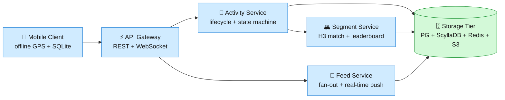
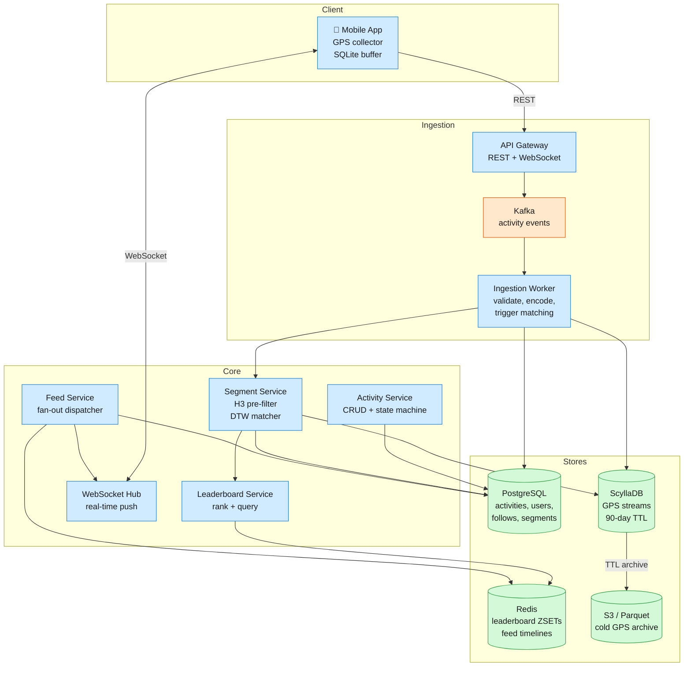
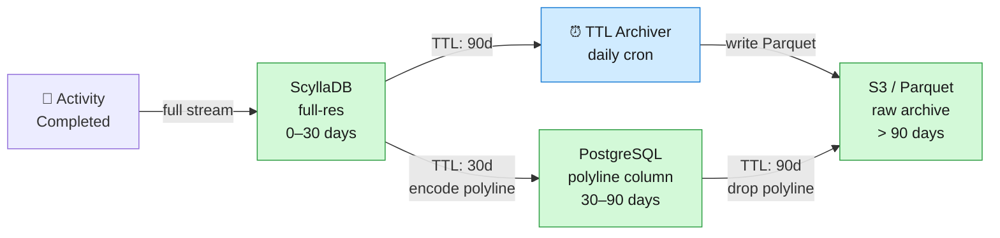
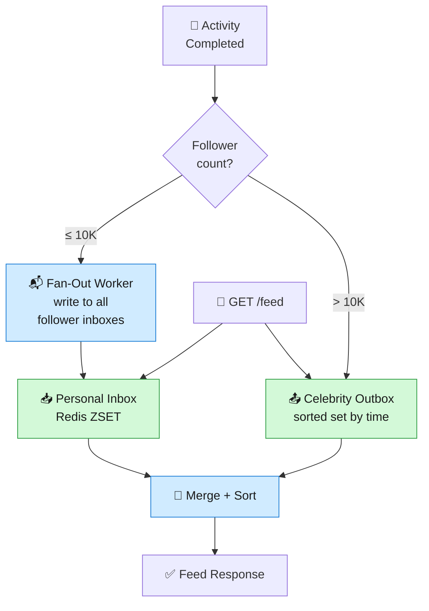

## 1. Problem Frame

Strava ingests 10M activities daily from 180M+ athletes — each with up to 100K GPS points — and matches them against 35M+ user-generated segments to power real-time leaderboards and social feeds, all while recording reliably in remote areas with zero connectivity.



## 2. Requirements

### Functional

- Record an activity with start, pause, resume, stop, and save.
- View live distance, pace, and route during recording.
- Browse a feed of friends' recent completed activities.
- View full activity detail with GPS route and segment efforts.
- Match activities against segments and view leaderboards.
### Non-Functional

- High write availability; reads tolerate brief staleness.
- Offline recording with zero connectivity; sync on reconnect.
- Real-time feed delivery within 5s of activity completion.
- Scale to 10M daily activities and 1B segment matches.

Out of scope: friend management, authentication, comments/likes, route planning, live tracking beacons.

## 3. Back of the Envelope

```javascript

Write peak:   10M/day ÷ 86.4k s × 5 (Sunday AM spike) ≈ 600 uploads/s
              → Kafka buffer absorbs burst; per-point writes are absurd.

GPS volume:   10M × 15K pts × 100 B ≈ 15 TB/day
              → 90-day hot window = ~1.4 PB; polyline encoding drops warm tier to ~50 GB.

Segment QPS:  10M × ~100 candidates ≈ 1B match attempts/day ≈ 12K/s
              → H3 pre-filter (res 11) reduces actual DTW ops to ~100 per activity.

```

## 4. Entities & API

### Data Model

```javascript

Activity
  activity_id: UUID (PK)
  user_id: UUID (CK)           ← partitions activity list by user
  sport_type: enum             ← run, ride, swim, hike, …
  status: enum                 ← in_progress, paused, completed
  start_time: timestamp
  elapsed_time: int            ← computed from status-log spans (not wall clock)
  polyline: string             ← Google encoded polyline (~500 B)
  visibility: enum             ← everyone, followers, only_me

GPSPoint
  activity_id: UUID (CK)       ← co-located with activity for range scans
  seq: int (CK)
  lat: float
  lng: float
  timestamp: timestamp
  hr: int?                     ← heart rate, nullable
  altitude_m: float?

Segment
  segment_id: UUID (PK)
  name: string
  polyline: string             ← reference path
  h3_cells: string[]           ← H3 resolution-11 cells covering the segment

SegmentEffort
  effort_id: UUID (PK)
  segment_id: UUID (CK)        ← partitions leaderboard queries
  user_id: UUID
  elapsed_time: int            ← match-window time
  rank: int?                   ← denormalized; recomputed on leaderboard refresh

User
  user_id: UUID (PK)
  display_name: string

Follow
  follower_id: UUID (CK)       ← partitions "who I follow"
  followee_id: UUID

```

### API

- POST /activities — start a recording, returns activity_id
- PATCH /activities/{id} — pause, resume, or stop (body: {"status": "paused"})
- GET /activities/{id} — full activity detail with polyline and segment efforts
- GET /feed?cursor=<ts>&limit=20 — paginated feed of friends' activities, newest first
- GET /segments/{id}/leaderboard?top=10 — top-N efforts for a segment
- GET /activities/{id}/stream?from=<ts>&to=<ts> — full GPS point stream, paged by time
- GET /segments/nearby?lat=…&lng=…&radius=… — discover segments near a location
## 5. High-Level Design



### 1) Record an activity (start, pause, resume, stop, save)

Components: Mobile Client, API Gateway, Activity Service, PostgreSQL.

Flow. The athlete taps "Start." The client generates a deterministic activity UUID (UUIDv5(user_id, start_time + device_id)), sets status: in_progress, and POSTs to /activities. The Activity Service inserts the row and returns the activity_id. GPS samples are collected locally at 1–3 Hz into a buffer — the server is not contacted per-point. Pause, resume, and stop are PATCH /activities/{id} calls carrying the new status. On "stop," the client batch-uploads the GPS buffer alongside the final PATCH; the server writes the stream to ScyllaDB and transitions the activity to completed.

Design consideration — elapsed time across pauses. A naive stop_time - start_time inflates elapsed time with pauses. The client appends a status-log on save:

```json

[
  {"status": "STARTED",  "t": "2026-06-25T07:00:00Z"},
  {"status": "PAUSED",   "t": "2026-06-25T07:15:30Z"},
  {"status": "RESUMED",  "t": "2026-06-25T07:18:00Z"},
  {"status": "STOPPED",  "t": "2026-06-25T07:45:00Z"}
]

```

The server sums active spans (STARTED→PAUSED = 15m 30s + RESUMED→STOPPED = 27m = 42m 30s) to compute elapsed_time. This unlocks "moving time vs. elapsed time" without schema changes.

### 2) View live stats during recording

Components: Mobile Client (on-device computation only).

Flow. Distance, pace, and route are computed locally from the GPS buffer. Distance uses Haversine between consecutive points; pace is a rolling 30-second average. The route renders on-device. No server round-trips happen during recording except on explicit status transitions — critical for battery life and remote-area reliability.

Design consideration — client vs. server stats. Client computation is fast and offline-capable, but device differences (GPS chip, sensor fusion) yield slightly different distances. The server recomputes distance on upload using a consistent Kalman-filter pass; the server's value is authoritative for leaderboards. The client's is real-time guidance only.

### 3) Browse a feed of friends' completed activities

Components: Feed Service, PostgreSQL, Redis feed cache, WebSocket Hub.

Flow. On activity completion, the Activity Service publishes an event to Kafka. The Feed Service consumer queries PostgreSQL for the follower list and writes a reference (activity_id, ts) into each follower's Redis timeline (a sorted set scored by timestamp). On read, GET /feed?cursor=<ts>&limit=20 fetches the next page from the user's Redis inbox. Entries are lightweight activity cards — full GPS and segment efforts load only on detail view. New activities surface in near-real-time via WebSocket push so the app can show an "N new activities" banner without polling.

Design consideration — fan-out threshold. Fan-out on write (push to every follower at upload time) is fast for reads but expensive for athletes with millions of followers. The Feed Service uses a hybrid threshold: ≤ 10K followers → fan-out on write; > 10K followers → pull from a shared outbox at read time. This bounds both write amplification and read latency. Fewer than 0.1% of users exceed the threshold, following the pattern Twitter documented in "Timelines at Scale" (2013).

### 4) View full activity detail with GPS route and segment efforts

Components: Activity Service, PostgreSQL, ScyllaDB, Segment Service.

Flow. GET /activities/{id} returns metadata (sport, distance, elapsed time, polyline summary) from PostgreSQL plus matched segment efforts with ranks. The GPS stream is lazy-loaded via GET /activities/{id}/stream?from=…&to=… which range-scans ScyllaDB by (activity_id, seq). A 4-hour ride at 1 Hz produces 14,400 points — too large for a single response. The default view renders from the 500-byte polyline; the raw stream is fetched only when the user zooms into a section.

### 5) Segment matching and leaderboards

Components: Segment Service, ScyllaDB, PostgreSQL, Redis.

Flow. On activity completion, the Ingestion Worker triggers matching. The Segment Service loads the GPS stream from ScyllaDB and performs a two-stage match: (1) H3 spatial pre-filter — map the activity's GPS trace to H3 resolution-11 cells (~29m edge), keep only segments sharing at least one cell (~100 candidates from 35M); (2) DTW refinement — align the candidate sub-sequence against the segment's reference path. If the match passes distance and time tolerances, a SegmentEffort is recorded. Each new effort triggers ZADD leaderboard:<segment_id> <elapsed_time> <effort_id>. Leaderboard reads are ZREVRANGE … WITHSCORES. See Deep Dive 2 for the full evolution.

## 6. Deep Dives

### Deep Dive 1: GPS Ingestion at Scale

Problem. Raw GPS arrives at 15 TB/day. Most rides are viewed heavily in the first week then go cold, but athletes occasionally revisit years-old activities to compare performance. Storing everything in a hot database costs millions; cold object storage (~$0.023/GB/month S3) is cheap but introduces ~50 ms first-byte latency — unacceptable for detail-page renders that need sub-200 ms response.

Option A — single hot store (ScyllaDB). Every GPS point lands in a wide-column table keyed by (activity_id, seq). Reads are fast: a single-partition range scan returns the full stream in milliseconds.

Challenges. At 15 TB/day with 90-day retention, the hot store holds ~1.4 PB. With replication factor 3, the cluster runs ~$200K–$300K/month on cloud. Worse, 90% of reads target activities < 30 days old; the remaining 10% of queries drive 70% of storage cost for rarely-accessed data.

Option B — three-tier storage with polyline encoding. Split GPS data by age:

- Hot (0–30 days, ScyllaDB): Full-resolution points, < 10 ms reads. TTL deletes old partitions automatically.
- Warm (30–90 days, PostgreSQL column): Downsampled to ~1 point per 100m and encoded with Google Encoded Polyline. A single 500-byte string replaces ~1.5 MB of raw points — a ~3,000:1 compression ratio. Sufficient for route rendering; insufficient for segment re-matching.
- Cold (> 90 days, S3 + Parquet): Raw points archived with snappy compression (~10:1). Queried via Athena/Spark for analytics, or fetched in full on rare old-activity detail views.


The polyline encoding uses Google's Encoded Polyline Algorithm: delta-encode consecutive lat/lng as base64 signed integers. A 15K-point stream becomes ~500 bytes — small enough to store directly in the Activity.polyline PostgreSQL column, always hot.

Decision. Three-tier storage with polyline encoding.

Rationale. The 30-day hot window covers > 90% of stream reads. The polyline column serves route rendering for all activities forever at negligible storage cost. The cost differential is dramatic: a 1.4 PB all-hot cluster becomes a ~50 TB hot tier (~$5K/month) plus ~$3K/month for S3 — roughly a 40× cost reduction. ScyllaDB's per-partition TTL eliminates manual cleanup jobs. This pattern mirrors Netflix's video encoding tiering (hot cache → S3 cold archive) applied to geospatial data.


> [!TIP]
> **Key insight:** Polyline encoding is the secret weapon — it compresses 15K lat/lng pairs from ~1.5 MB to ~500 bytes while preserving enough fidelity for route rendering. The encoding is lossy at ~1m precision, but that's within consumer GPS noise anyway. It serializes trivially into a single DB column.

Edge cases:

- Activity re-analysis: Segment redefinition requires raw GPS — fetch from S3 cold tier; accept the latency hit.
- Ultra-endurance events: 24-hour ride at 1 Hz = 86,400 points. Cap at 100K; downsample in-stream for extreme durations.
- Multi-sport activities: Store sport-type per point in ScyllaDB; polyline encodes the full path regardless.
- Sensor-rich uploads: Power, cadence fields stay only in hot ScyllaDB; dropped on archive unless Parquet schema preserves them.
### Deep Dive 2: Segment Leaderboard Architecture

Problem. Every completed activity must be matched against segments, and each match updates a leaderboard queried in real time. With 10M daily activities, ~100 candidates per activity, and 35M+ segments, the write path generates ~1B match attempts/day (~12K/s). The read path serves leaderboard queries at 6,000 peak QPS. Naive SQL ORDER BY elapsed_time LIMIT 10 on a billion-row table with concurrent writes collapses under this load.

Option A — SQL with indexes. A SegmentEffort table with a composite index on (segment_id, elapsed_time).

```sql

SELECT user_id, elapsed_time, effort_id
FROM segment_efforts
WHERE segment_id = $1
ORDER BY elapsed_time ASC LIMIT 10;

```

Challenges. With 1B new rows/day, the B-tree index grows enormous and write throughput degrades as the tree rebalances. For popular segments with millions of efforts, LIMIT 10 still scans an index range proportional to total efforts — the planner can't know how deep to scan. At 6,000 peak QPS, a single PostgreSQL instance cannot keep up.

Option B — Redis sorted sets as primary store. Each segment gets a Redis sorted set keyed by leaderboard:<segment_id>, scored by elapsed_time. Writes are ZADD, reads are ZREVRANGE … LIMIT 10 — both O(log N) with extremely low constant factors.

Challenges. Memory is the core issue. With 35M segments, total footprint exceeds 2 TB — ~$50K+/month in Redis cloud costs. Consistency between Redis and source-of-truth PostgreSQL is gnarly: if a node crashes or ZADD fails after a DB write, the leaderboard drifts. Restoring from an RDB snapshot takes hours during which rankings are stale.

Option C — Kafka event stream + ScyllaDB with Redis as read cache. The 2019 redesign:

1. Every SegmentEffort write goes to PostgreSQL (source of truth) and publishes to Kafka partitioned by segment_id.
1. A stream consumer writes efforts to ScyllaDB keyed by (segment_id, elapsed_time) — the clustering key handles ordering naturally.
1. Redis caches leaderboard top-N. On query: hit Redis → return. On miss/staleness → query ScyllaDB, recompute top-N, backfill Redis.
```javascript

-- ScyllaDB schema (wide-column, ordered by elapsed_time)
CREATE TABLE segment_efforts (
    segment_id UUID,
    elapsed_time DOUBLE,
    effort_id UUID,
    user_id UUID,
    PRIMARY KEY (segment_id, elapsed_time, effort_id)
) WITH CLUSTERING ORDER BY (elapsed_time ASC);

```

Challenges. The Kafka→ScyllaDB→Redis pipeline introduces eventual consistency (1–3s lag). For a fitness app, this is acceptable — athletes understand rankings take a moment to update. Popular segments (e.g., Alpe d'Huez with 500K+ efforts) create hot partitions; ScyllaDB's shard-per-core architecture handles these better than Cassandra's GC-pause-prone design.

Decision. Kafka event stream → ScyllaDB (durable) → Redis (read cache). PostgreSQL is source of truth for metadata; leaderboard queries bypass it entirely.

Rationale. Partitioning writes by segment_id serializes only writes for the same segment — everything else is fully parallel. The pipeline handles 2,500 leaderboard writes/sec and 6,000 reads/sec at peak. Redis-as-cache reduced memory from 2 TB to ~200 GB (only popular segments stay cached; long-tail serves from ScyllaDB). Recovery improved dramatically: Redis repopulates from ScyllaDB in minutes, not hours. This architecture echoes LinkedIn's feed pipeline (Kafka → Samza → cache) applied to sorted rankings instead of timelines.


> [!TIP]
> **Key insight:** Redis is a cache, not a primary store. The recovery story alone justifies the pipeline: when Redis loses data (crash, failover, maintenance), it repopulates from the durable ScyllaDB layer in minutes rather than requiring an hour-long RDB restore. The eventual consistency window (1–3s) is invisible to users refreshing a leaderboard.

Edge cases:

- Tied times: Break ties by effort_id as deterministic secondary sort. In the composite score, use elapsed_time + (1.0 / start_timestamp_ns) for Redis sorted sets.
- Effort deletion: An athlete flags an effort (cheating). The deletion event flows through Kafka; the stream processor removes from ScyllaDB and invalidates the Redis cache key.
- Segment redefinition: Truncate + rebuild the ScyllaDB partition; re-match historical efforts via batch job fetching raw GPS from S3.
- Hot partitions: For segments with > 1M efforts, split by time window: PRIMARY KEY ((segment_id, year_month), elapsed_time, effort_id).
### Deep Dive 3: Offline Recording & Sync

Problem. Athletes run and ride in remote areas — mountain trails, rural roads, tunnels — where cellular connectivity is unreliable or absent for hours. The recording must not lose a single GPS point, the eventual upload must not create duplicates, and the app must survive being killed mid-activity (low battery, OS memory pressure) and resume seamlessly.

Option A — online-only with RAM buffer. Stream every GPS point to the server in real-time; buffer in memory when offline. If the app is killed, the buffer is lost.

Challenges. Loses entire activities on crash or extended offline periods. Not viable for a fitness app where athletes invest hours of effort into a single recording. RAM is volatile; a phone call can trigger an OS kill.

Option B — local SQLite buffer with batch upload. All GPS points and status transitions are written to a local SQLite database. A background sync worker checks connectivity and uploads un-synced rows in batches.

```javascript

-- Client-side SQLite schema
CREATE TABLE gps_buffer (
    activity_id TEXT NOT NULL,
    seq INTEGER NOT NULL,
    lat REAL, lng REAL,
    timestamp INTEGER NOT NULL,
    hr INTEGER, altitude REAL,
    uploaded INTEGER DEFAULT 0,
    PRIMARY KEY (activity_id, seq)
);

```

Challenges. If the upload is interrupted mid-transfer, the server may have partially ingested the activity. Re-uploading creates duplicates. Network interruptions during a large GPS buffer (14,400 points, ~1.5 MB for a 4-hour ride) are common on spotty cellular.

Option C — deterministic UUID + idempotent chunked upload. Generate activity_id on the client at start: UUIDv5(namespace=user_id, name=start_time + device_id). The server treats POST /activities as an upsert — same ID on retry, merge new points, return success. For large uploads, chunk the GPS buffer into 500-point segments (~50 KB each):

```javascript

Client upload loop (pseudo):
  chunks = partition(gps_buffer, 500)
  for i, chunk in enumerate(chunks):
      checksum = sha256(chunk)
      resp = PUT /activities/{id}/stream?chunk={i}&checksum={checksum}
      if resp.status == 200:
          mark_uploaded(chunk)
      else:
          break  # retry on next sync cycle

```

Challenges. If the same activity is recorded on two devices (phone and watch), both generate the same UUID but with different GPS streams. The merge strategy: union points by seq, deduplicate by (activity_id, seq). If seq conflicts with different coordinates, prefer the device with higher reported GPS accuracy.

Decision. Deterministic client-side UUID + chunked idempotent upload + crash-safe SQLite. No CRDT — Last-Write-Wins for status transitions; GPS points are append-only by sequence number.

Rationale. This pattern is production-validated across fitness and mapping apps. LWW is sufficient because an activity's status transitions form a linear sequence — there are no concurrent edits from different devices. The UUIDv5 approach eliminates server-side deduplication logic entirely: the database primary key is also the idempotency token. Chunked upload is critical for ultra-endurance athletes: rides exceeding 12 hours with intermittent connectivity — chunks with per-checksum verification ensure 11 hours of data aren't lost because the 12th hour's upload timed out. Google Maps timeline and Uber's driver app use equivalent local-store-first patterns with deterministic IDs.


> [!TIP]
> **Key insight:** The client is source of truth during recording; the server is source of truth after upload. The boundary is the upload acknowledgment. Before that boundary, the server knows nothing; after it, the client can discard local data.

Edge cases:

- App killed mid-ride: On restart, query SQLite for the most recent IN_PROGRESS activity, resume appending GPS from the last persisted seq. WAL-mode SQLite with synchronous=NORMAL minimizes the loss window to ~1 second of GPS samples.
- Device dies completely: Activity lost from last checkpoint (every 30 seconds). Accept this tradeoff — fsync-per-write kills battery.
- GPS drift in tunnels: Mark points with accuracy=null when signal is lost; server interpolates between last known good points.
- Duplicate chunk retry: Server receives chunk N again. Idempotent: INSERT … ON CONFLICT (activity_id, seq) DO NOTHING.
- Watch + phone simultaneous: Both generate same UUIDv5. Union GPS points by seq; prefer higher-accuracy device on conflicts.
### Deep Dive 4: Real-Time Feed Fan-Out

Problem. When an athlete completes a ride, their followers should see it within seconds. The feed must handle an asymmetric follower graph: most users have dozens of followers, but professional athletes have millions. A pure push model writes to millions of inboxes per celebrity upload; a pure pull model forces every feed read to scan thousands of followees.

Option A — pull model (read-time merge). On GET /feed, query activities of every followee, merge by timestamp, return top-N.

```sql

SELECT a.* FROM activities a
JOIN follows f ON a.user_id = f.followee_id
WHERE f.follower_id = $1
ORDER BY a.start_time DESC LIMIT 20;

```

Challenges. For a user following 2,000 athletes, this scans 2,000 partitions and merges potentially millions of rows. Latency grows linearly with followee count. At Strava's scale, this runs millions of times per minute.

Option B — push model (fan-out on write). On activity completion, write a reference to every follower's timeline. The read is a simple range scan of one inbox: ZREVRANGE feed:<user_id> 0 19 WITHSCORES.

Challenges. Fan-out amplifies celebrity uploads. An athlete with 5M followers generates 5M Redis writes per activity. At 5 activities/week, that's 25M writes/week for one user — and professional athletes number in the hundreds. The fan-out also includes followers who haven't opened the app in months.

Option C — hybrid push/pull with follower threshold. The production model:

- ≤ 10K followers: Fan-out on write. Activities pushed to all follower inboxes.
- > 10K followers (celebrity tier): Activities stored in a shared outbox (Redis sorted set). At feed read time, merge: (1) personal inbox (push path), (2) pull from each celebrity outbox (up to 5 recent activities each).


Real-time delivery uses WebSocket: the Feed Service pushes a lightweight notification (activity ID + summary) to online followers. The client fetches the full card lazily when the user opens the feed. WebSocket (bidirectional) rather than SSE (server→client only) because the same connection is reused for live segment tracking — the server pushes "3 seconds behind KOM" alerts while the athlete rides.

Decision. Hybrid fan-out with 10K follower threshold. Redis sorted sets for inboxes and outboxes. WebSocket for real-time delivery.

Rationale. Twitter pioneered this hybrid pattern in "Timelines at Scale" (2013) — fan-out for normal users, pull for celebrities, with a tunable threshold. The 10K cutoff means < 0.1% of users exceed it, so the push path covers 99.9% of uploads with simple, fast reads. The pull path for celebrities is cold — celebrities post infrequently, so merge cost at read time is bounded by celebrities_followed × 5, typically < 50 rows. Redis sorted sets keep feed generation fast: ZREVRANGE returns top 20 in microseconds. Old entries trimmed to 500 per inbox with ZREMRANGEBYRANK.

Edge cases:

- Privacy changes: Athlete changes activity from "followers" to "only me." A cleanup worker lazily scans follower inboxes (push path) or invalidates the outbox entry (pull path). Brief staleness is acceptable under the availability-over-consistency NFR.
- New follower backfill: When Alice follows Bob, a backfill worker fetches Bob's last 20 activities and inserts them into Alice's inbox. Runs asynchronously — Alice may not see Bob's rides for a few seconds.
- WebSocket reconnect: If the connection drops, the client fetches missed notifications via GET /feed/updates?since=<last_event_id> and reconnects with exponential backoff (1s → 60s cap).
- Inbox memory: Per-user Redis sorted sets capped at 500 entries. For active users following thousands, the inbox is a sliding window.
## 7. Trade-offs

| Decision | Chosen | Rejected | Why |
| --- | --- | --- | --- |
| GPS hot store | ScyllaDB (wide-column, TTL) | Cassandra, PostgreSQL | ScyllaDB's shard-per-core architecture eliminates GC pauses that plagued Cassandra deployments. Per-partition TTL simplifies archival. |
| GPS warm tier | PostgreSQL w/ polyline encoding | Keep full-res in ScyllaDB | 3,000:1 compression; a 500-byte column serves 90% of route renders. Cost differential: ~$5K/month vs ~$200K/month. |
| Leaderboard store | ScyllaDB (durable) + Redis (cache) | Redis as primary store | Redis-as-primary means 2 TB memory, hour-long RDB recovery. Cache model: 200 GB, recovery in minutes. |
| Segment matching | H3 pre-filter (res 11) → DTW | PostGIS ST_DWithin, S2 cells | H3 at resolution 11 (~29m edge) matches GPS noise floor. DTW handles variable pace; geometric distance alone fails on switchbacks. |
| Offline sync | UUIDv5 + chunked idempotent upload | CRDT, plain LWW | Status transitions are linear — no concurrent edits. CRDT is overkill. Chunking prevents 12-hour ride uploads from failing on the last MB. |
| Feed fan-out | Hybrid (10K follower threshold) | Pure push, pure pull | Pure push: 5M writes per celebrity upload. Pure pull: linear scan of thousands of followees per read. Hybrid bounds both. |
| Real-time delivery | WebSocket (bidirectional) | SSE, polling | SSE is server→client only; live segment tracking needs client→server (GPS in, alerts out). Polling at 10M concurrent users is wasteful. |
| Polyline encoding | Google Encoded Polyline Algorithm | GeoJSON, WKB | ~30:1 compression over raw lat/lng. Renders directly in client map SDKs. Lossy at ~1m precision — within GPS noise. |

## 8. References

### Primary Sources

1. Tessa: 1,000,000,000 Strava Activities — Strava Engineering (2024)
1. From Data Streams to a Data Lake — archival pipeline, Parquet compression
1. Rebuilding the Segment Leaderboards Infrastructure — Parts 1–4 (2019 Redis→Kafka→Cassandra redesign)
1. KOMs Powered by Redis — original Redis-as-primary architecture (2011–2019)
1. The Boring Option — segment effort matching pipeline, peak 6K QPS
1. The Global Heatmap, Now 6× Hotter — 7.7T points, 30M+ tiles, privacy design
1. A Richer Activity — Parts 1–2, GPS pipeline, Kalman filter, sensor fusion
1. Keeping Strava's Segment Leaderboards Fair — ML anti-cheat, 14.85M anomalies removed
1. How Strava's NoSQL Move Keeps Athletes Moving — Cassandra→ScyllaDB migration
1. H3: A Hexagonal Hierarchical Geospatial Indexing System — Uber Engineering, resolution 11 ≈ 29m edge
1. Encoded Polyline Algorithm Format — Google Maps, delta-encoded base64 compression
1. Timelines at Scale — Twitter Engineering, hybrid fan-out design (2013)
### Comparison Line

Twitter's timeline fan-out (hybrid push/pull with celebrity threshold), Uber's H3 geospatial indexing (hexagonal tiling at configurable resolution), Google Maps' polyline encoding (delta-compressed route serialization), LinkedIn's feed pipeline (Kafka→Samza event sourcing), Netflix's content tiering (hot cache→S3 cold archive). Each of these systems contributed a pattern adapted and combined in Strava's architecture.

