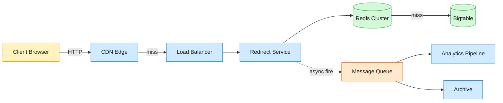
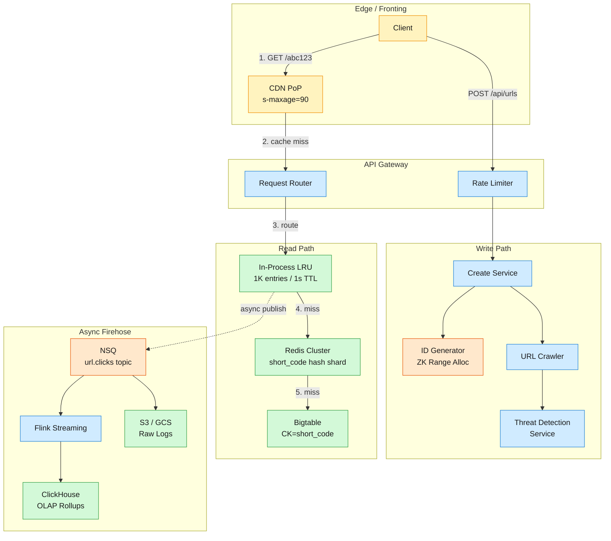

How Bitly serves 360 million clicks per day at 200K redirects/second with a 4-layer cache pyramid, ZooKeeper range allocation for 7-character codes, and a fire-and-forget analytics pipeline — a deep dive into the system design of the internet's URL shortener.

<!--more-->

## 1. Problem frame

Bitly turns long URLs into short ones and tracks every click. At first glance this looks like a hash table with a web frontend — take a URL, generate a 7-character code, store the mapping, redirect on lookup. The hidden weight is analytics: every redirect fires an event into a pipeline that powers the business. 40 billion active links, 360 million clicks a day, peak throughput north of 200K redirects per second. The write path is light (~80 creates/sec); the read path is a firehose. The whole thing runs on ~270 backend services, and the architecture is shaped by one fact: you never block a redirect on analytics.




## 2. Requirements

### Functional

- FR1: User submits a long URL, receives a shortened version
- FR2: User clicks a short URL, gets redirected to the original destination
- FR3: User views click counts and referrer breakdowns per short link
- FR4: User creates a custom vanity short URL via an alias field
- FR5: User sets an optional expiration time on a short link
- FR6: User receives an interstitial safety warning before visiting risky destinations
### Non-functional

- NFR1: Redirect completes in under 10ms p50 measured at the server
- NFR2: System available 99.99% of the time across all regions
- NFR3: Peak throughput of 200K redirects/sec without degradation
- NFR4: Click analytics queryable within 90 seconds of the event
Out of scope: user accounts, billing, team management, QR code generation.

## 3. Back of the envelope

- 360M clicks/day ÷ 86,400s → ~4,200 req/s average, peak 200K req/s → cache hit rate must exceed 95% or the primary store melts
- 6M writes/day ÷ 86,400s → ~70 creates/s → write path is low-pressure; the ID generator is the only coordination point worth optimizing
- 40B links × ~650 bytes/link → ~26TB of row data → any single-node DB is out; distributed store with partition-per-short-code is the only path
## 4. Entities & API


```javascript
URL
  short_code: string (PK)        ← base62-encoded ID, 7 characters
  long_url: string               ← canonicalized, max 2048 chars
  created_at: timestamp
  expires_at: timestamp          ← null = never; TTL column in Bigtable
  user_id: string (CK)           ← partition-scoped analytics grouping
  safety_status: enum            ← clean | warn | blocked

ClickEvent
  short_code: string (PK)        ← partition key for event stream
  timestamp: timestamp (CK)      ← ordering key within partition
  referrer: string | null
  user_agent: string
  geo_country: string            ← enriched by stream processor

CounterRange
  service_id: string (PK)        ← which create-service instance owns this
  range_start: int64
  range_end: int64
  current: int64                 ← monotonically increasing, in-memory

```

### API

- POST /api/urls — create a short URL; body {long_url, custom_alias?, expires_at?}
- GET /{short_code} — resolve short code to a 301 redirect to the long URL
- GET /api/urls/{short_code}/stats — click count, referrers, geo breakdown
- POST /api/urls/{short_code}/report — flag a link as potentially unsafe
- GET /api/safety/{short_code} — check safety status (clean/warn/blocked)
## 5. High-Level Design




#### FR1: Create Short URL

Components: API Gateway, Create Service, ID Generator (ZooKeeper-backed range allocator), Threat Detection Service, Bigtable, Redis.

Flow:

1. Client POST /api/urls with {long_url, custom_alias?, expires_at?}
1. Gateway rate-limits by API key; rejects if over quota (429)
1. Create Service canonicalizes the long URL (lowercase scheme+host, strip default ports, remove fragment)
1. On custom_alias: check collision via INSERT IF NOT EXISTS on Bigtable; on conflict return 409
1. On auto-generation: call ID Generator → base62-encode the 64-bit counter value → 7-char short_code
1. Write (short_code, long_url, expires_at, user_id, safety=pending) to Bigtable
1. Warm Redis: SET url:{short_code} {long_url} EX 86400
1. Publish scan request to Crawler (async, non-blocking): Crawler fetches destination → TDS + Google Web Risk assess → Abuse API writes safety_status
1. Return 200 {short_url: "https://bit.ly/aBcDeFg", safety_status: "pending"}
Design consideration: The ID Generator claims ranges of 1,000 IDs from ZooKeeper via atomic compareAndSet on a persistent counter node. Each Create Service instance burns through its range in-process with zero network calls on the hot path. At ~70 creates/sec, a single range lasts ~14 seconds. When 20% remains, the instance asynchronously fetches the next block. This collapses coordination traffic by 1,000× versus per-request counter increments. ZooKeeper itself handles ~10K ops/sec easily — well above what even a fleet of 100 create instances needs.

#### FR2: Redirect Short URL

Components: CDN Edge (Cloudflare/CloudFront), Load Balancer, Redirect Service, in-process LRU, Redis Cluster, Bigtable.

Flow:

1. User clicks bit.ly/aBcDeFg → browser resolves DNS to nearest CDN PoP
1. CDN checks edge cache for aBcDeFg; on hit → returns cached 301 + Location directly (zero origin cost)
1. On CDN miss → request hits origin Load Balancer → forwarded to any Redirect Service instance
1. Redirect Service checks in-process LRU (map[short_code]url_cache); on hit → 301
1. On LRU miss → query Redis: GET url:aBcDeFg; on hit → populate LRU + 301
1. On Redis miss → query Bigtable by partition key short_code; check expires_at; return 301 or 410 Gone
1. Populate Redis (SET url:aBcDeFg {long_url} EX 86400) and LRU
1. Respond HTTP 301 Moved Permanently + Location: {long_url} + Cache-Control: private, max-age=90
1. Async fire: publish {short_code, timestamp, referrer, user_agent} to NSQ topic url.clicks
Design consideration: 301 + max-age=90 is Bitly's production choice over the more commonly cited 302. A bare 302 gives perfect analytics fidelity — every click hits origin — but at 200K req/s peak, that's 200K origin hits per second that could have been absorbed by the browser or CDN. 301 tells the browser "this redirect is stable, cache it for 90 seconds." The first click in a 90s window hits origin; subsequent clicks from the same client are served from browser cache. The tradeoff: analytics for a link that's clicked 10 times in 90 seconds might show 1 click instead of 10. For a system where the core metric is unique reach rather than per-click billing, 90 seconds of lag is acceptable. The private directive stops intermediate proxies from caching the redirect, so different users still hit origin at least once.

#### FR3: Click Analytics

Components: NSQ, Flink streaming, ClickHouse, Analytics API.

Flow:

1. Redirect Service publishes click event to NSQ topic url.clicks — fire-and-forget, zero blocking
1. Flink consumer enriches events (geo-IP lookup, device parser, bot detection filter)
1. Flink aggregates into 5-second microbatches: COUNT(*) GROUP BY short_code, hour_bucket, country, referrer_domain
1. Upsert rollups into ClickHouse click_rollups table (MergeTree, partitioned by toYYYYMM(date))
1. Analytics API (GET /api/urls/{short_code}/stats) queries pre-aggregated rollups — SELECT sum(clicks) WHERE short_code = ? AND hour BETWEEN ? AND ? — O(log n) on sorted index, no full scan
1. Raw events also archived to S3/GCS via separate NSQ channel for long-term cold storage
Design consideration: The split between real-time rollups and raw archive is load-bearing. ClickHouse runs on a small number of nodes because it only stores aggregated data — ~10MB/day at current scale — while the raw event firehose (360M events/day × ~200 bytes = ~72GB/day uncompressed) goes straight to cheap object storage. The Flink job is tuned to drop bot traffic (HEAD requests, known crawler UAs, empty referrers from direct URL entry) before aggregation, cutting volume by ~30-40% before hitting ClickHouse. Old data ages out of ClickHouse after 90 days; queries beyond that window fall back to a slower Athena/Presto scan over the raw archives.

#### FR4: Custom Aliases

Components: Create Service, Bigtable conditional write, Bloom filter.

Flow:

1. Client includes custom_alias: "my-brand" in POST /api/urls
1. Create Service normalizes alias (lowercase, strip non-base62 chars)
1. Check Bloom filter for likely absence — negative guarantees no collision, positive requires DB check
1. INSERT INTO urls (short_code, ...) IF NOT EXISTS — Bigtable conditional mutation; appends #collision atomically
1. On collision → 409 Conflict {existing: {short_url, created_at}}
1. On success → same write+cache flow as FR1
Design consideration: Custom aliases share the same short_code namespace as auto-generated codes. Sub-4-character aliases are reserved for paid tiers — enforced at the API Gateway by checking alias length against the authenticated account's tier. The Bloom filter sits in each Create Service's memory (~10MB for 10M custom aliases at 1% false-positive rate) and absorbs ~99% of collision checks without a DB round-trip. When the Bloom filter returns positive, the conditional write is the source of truth.

#### FR5: URL Expiration

Components: Bigtable TTL, Redirect Service expiration check, background sweeper.

Flow:

1. On create: expires_at stored in the URL row
1. On redirect: Redirect Service checks expires_at against now() at every cache-miss DB read; returns 410 Gone if expired, and publishes a tombstone to Redis (DEL url:{short_code})
1. Bigtable column-family TTL configured to auto-GC rows whose expires_at is in the past — no sweeper needed
1. CDN max-age=90 ensures stale 301s expire from edge caches within 90 seconds of a link expiring
Design consideration: The only sharp edge is race between max-age=90 and expires_at. If a link expires at T+0 and the CDN cached the 301 at T-89, the CDN continues serving the redirect until T+1. At 90s CDN TTL this window is small enough that no explicit CDN purge on expiration is needed. For systems without Bigtable's native TTL, a background sweeper queries WHERE expires_at < now() LIMIT 1000 every 60 seconds — the same pattern Bitly ran on MySQL before the Bigtable migration.

#### FR6: Safety Warnings

Components: Crawler, Threat Detection Service (TDS), Google Web Risk, Abuse API.

Flow:

1. On URL creation: Crawler is awakened async (see FR1 step 8) → fetches destination page, extracts title/headers/scripts
1. TDS runs internal ML classifier + heuristic rules (domain age, redirect chains, known phishing patterns)
1. Google Web Risk is queried in parallel — checks against 1M+ known unsafe URLs
1. Abuse API aggregates scores from TDS, Google Web Risk, and trusted partner feeds into a single safety_status: clean | warn | blocked
1. On redirect: Abuse API check at the Redirect Service level — GET abuse:{short_code} from a dedicated Redis cache (5-min TTL)
1. clean → normal 301 redirect
1. warn → interstitial page: "This link may be unsafe. [Proceed anyway] [Go back]"
1. blocked → interstitial page with no destination revealed (destination itself is dangerous, e.g. auto-downloading malware)
Design consideration: The Abuse API is consulted on every redirect but served from a small Redis instance — the key space is only the subset of URLs flagged as non-clean, and the TDS Google Web Risk pipeline processes URLs asynchronously within ~500ms of creation. The abuse check adds <1ms (local Redis read) to the redirect hot path. False positives are calibrated aggressively toward warn rather than blocked because an interstitial with a "proceed anyway" escape hatch is annoying but survivable; a false blocked kills a legitimate link entirely.

## 6. Deep dives

### DD1: ID Generation Strategy

Problem. Every short URL needs a globally unique 7-character code. You can't coordinate — 200 create-service instances across 3 regions can't all ask a central counter for the next ID on every request, or you bottleneck the write path at ~10K IDs/sec (the ceiling of a single Redis/ZK node on increment operations). But you can't go fully decentralized either, because base62-encoding a random 41-bit number still gives non-trivial collision probability at 40B records.

Approach 1: Central Counter + Range Batching

A single Redis instance holds INCR url_id_counter. Each create-service instance calls INCRBY 1000 once, claims that range, and burns through it locally. On exhaustion, fetch another.


```javascript
# Redis: single key
INCRBY url_counter 1000   → returns 5001
# Instance owns 4001..5000; base62-encode each one

```

Challenges: Redis is still a single point of failure. If it crashes, every create-service instance stops within seconds — even with Sentinel failover, there's a 5-10s gap. Multi-region creates need disjoint ranges (US owns 0..1T, EU owns 1T..2T), which means the range partition is a static config change, not self-healing.

Edge case: A create-service instance crashes mid-range. IDs 4001-4500 were claimed but never written to the database. Those codes are permanently orphaned. At 1,000 orphans per crash, you'd need 40,000 crashes to lose 1% of the code space — acceptable.

Approach 2: Snowflake-style 64-bit IDs

No central coordinator. Every instance generates IDs locally: 41 bits of millisecond timestamp + 10 bits of machine ID + 12 bits of sequence number. Guaranteed unique within the same millisecond on the same machine. This is what Twitter [t.co](https://t.co) uses.


```javascript
Snowflake ID (64 bits):
| 41 bits: ms since epoch | 10 bits: worker ID | 12 bits: seq |
= base62 → 11 characters (64 ÷ log₂(62) ≈ 10.7)

```

Challenges: Base62-encoding a 64-bit integer produces 11 characters, not 7. For Twitter t.co, this doesn't matter — every tweet link is auto-wrapped and the user never sees the short code. For Bitly, 7-character codes are the product. You could truncate, but then you're back to collision territory: a 42-bit truncated snowflake at 40B records has a birthday-paradox collision probability of ~90%.

Edge case: Clock skew. If an instance's clock jumps backward (NTP step), it can produce duplicate IDs. Snowflake handles this by blocking until the clock catches up (spinwait), which kills throughput temporarily on that instance.

Approach 3: ZooKeeper Range Allocation

Each create-service instance registers with ZooKeeper and claims a range via atomic compareAndSet on a persistent sequential znode.


```javascript
# ZK path: /shortener/ranges/next
compareAndSet(current=4001, next=5001)  → success
# Instance owns 4001..5000 exclusively
# In-memory: atomic.AddInt64(&localCounter, 1)
# When localCounter > rangeEnd * 0.8: async refill

```

ZooKeeper holds the canonical next_range value. The compareAndSet ensures exactly one instance claims each range. There's no clock dependency, no truncation — every code is exactly 7 characters. ZK handles ~10K ops/sec on a 3-node ensemble, which supports ~10M range claims per second (each range is 1,000 IDs), so the coordination layer saturates only if you're running tens of thousands of create-service instances.

Challenges: ZooKeeper is another distributed system to operate. At Bitly's scale (~270 services, already running ZK for service discovery) this is marginal overhead. For a greenfield system, the operational cost of a 3-node ZK ensemble has to be weighed against the relative simplicity of a Redis counter.

Edge case: Network partition. If a create-service instance loses connectivity to ZK mid-range, it can keep generating IDs from its local buffer until the range is exhausted — buys 14 seconds at 70 creates/sec to reconnect. If reconnection fails, the instance stops accepting create requests (fails open on reads, closed on writes).

Decision: Range allocation from ZooKeeper (or etcd in a Kubernetes-native deployment). It gives exactly-once range semantics, produces consistent 7-character codes with zero truncation, and the coordination overhead is 1 ZK call per 1,000 creates.

Rationale: Bitly ran this exact approach in production at 6M+ creates/day. Instagram used the same pattern (Postgres-backed range allocation) for their photo ID system. The key number: at 1,000 IDs per range claim, a 3-node ZK ensemble can support 10 billion creates/day before the coordination layer becomes the bottleneck — 140,000× Bitly's current write volume. The headroom is enormous.

> [!TIP]
> **Key insight:** Range batching is the universal answer to "I need globally unique IDs but I can't afford per-request coordination." Whether the backing store is ZooKeeper, etcd, Postgres (SELECT nextval), or Redis (INCRBY), the pattern is identical: claim a block, burn locally, refill async. The only decision is which store you already operate.

### DD2: Redirect Flow & Latency

Problem. At 200K redirects/sec peak, a cache miss that hits the primary database costs 5-15ms. If even 5% of traffic misses every cache layer, that's 10,000 DB reads/sec — survivable, but it adds p99 latency and burns DB capacity you'd rather reserve for writes. The goal is to drive the primary-store hit rate below 2% while keeping redirect latency under 10ms p50.

Approach 1: Single Redis Cache Layer

One Redis cluster, sharded by short_code. All redirect traffic queries Redis before falling through to the DB. Simple, battle-tested, easy to operate.


```javascript
GET url:{short_code} → Redis (1-2ms) → hit: return 301
                                      → miss: query DB (5-15ms)

```

Challenges: At 200K req/s, Redis handles the load easily (a single Redis node does ~100K ops/sec, a 6-node cluster handles 600K). But every request still traverses the network stack, and popular links — a viral tweet, a front-page story — generate hot keys that concentrate load on one shard. A single short code getting 50K req/s saturates its Redis shard even though the cluster overall is at 25% capacity.

Edge case: Cache stampede. A cold link goes viral, 1,000 concurrent requests all miss Redis simultaneously, 1,000 concurrent DB queries for the same key. The DB gets hammered, Redis gets populated 1,000 times with the same value, and the stampede cascades across shards as different viral links hit different partitions.

Approach 2: Multi-Layer Cache Pyramid

Layer the caches by speed and capacity. Each layer absorbs a fraction of misses from the layer above.


```javascript
Layer 1: CDN Edge (PoP cache)
  TTL: 30-90s, hit rate: 15-30% for viral links
  Latency: 5-20ms (but it's the user's round-trip, not origin cost)

Layer 2: In-Process LRU (per app server)
  Size: ~1,000 entries, TTL: 1s
  Hit rate: 50-65% cumulative
  Latency: ~0.1ms (no network, no syscall beyond map lookup)

Layer 3: Redis Cluster (sharded by short_code hash)
  Size: ~60GB working set, TTL: 24h
  Hit rate: 92-97% cumulative
  Latency: 1-2ms

Layer 4: Primary Store (Bigtable/ScyllaDB)
  Hit rate: 100% (the rest)
  Latency: 5-15ms

```

The in-process LRU is the sleeper layer. It costs nothing to check (a hash map lookup in Go is ~50ns) and catches the common pattern of one link being clicked multiple times in rapid succession — a retweet storm, a Slack unfurl, a group chat where 20 people click the same link within 2 seconds. At 1,000 entries with 1s TTL, it uses ~200KB of memory per server.

Challenges: CDN cache invalidation is coarse — you can't purge a specific short code from 200+ edge PoPs in real time. If a link's destination changes (a feature Bitly doesn't support), the CDN serves the stale redirect for up to 90 seconds. For link expiration, the 90s CDN TTL means a link appears valid for up to 90 seconds after its expires_at — acceptable. L1 LRU is per-instance memory, so it only helps for repeated clicks hitting the same server; a load balancer distributing requests round-robin across 50 instances means the L1 hit rate is effectively divided by 50 for each unique short code.

Edge case: Hot key hot potato. A link getting 50K req/s will saturate whichever Redis shard owns it. The answer is hot-key replication: detect the hot key (via Count-Min Sketch or Redis HOTKEYS command), replicate it across multiple shards (url:{short_code}:replica1, url:{short_code}:replica2), and have the redirect service pick a replica at random. This trades storage for even load distribution.

Approach 3: CDN-First with Stale-While-Revalidate

Push the CDN from "nice-to-have third option" to the primary defense. Configure edge cache TTL aggressively (e.g., s-maxage=3600 for CDNs) and use stale-while-revalidate to let the CDN serve a possibly-stale copy while asynchronously checking the origin.


```javascript
Cache-Control: public, max-age=90, s-maxage=3600, stale-while-revalidate=86400

```

The CDN serves cached 301s for up to an hour. If the link expires or the destination changes, stale-while-revalidate triggers an async origin check; the CDN serves the stale copy during the check, then updates. This means the origin sees almost no traffic for popular links.

Challenges: This is safe for a URL shortener where links almost never change destination. If Bitly ever adds link editing, this strategy breaks — users would see stale redirects for hours. The s-maxage=3600 effectively kills per-click analytics because the CDN absorbs nearly all clicks. For Bitly's business model (analytics is the product), this is the wrong tradeoff.

Decision: Multi-layer cache pyramid (Approach 2) with 301 + Cache-Control: private, max-age=90. The CDN gets a 90s TTL (not 3600) to keep analytics lag bounded. The in-process LRU is cheap insurance. Redis is the workhorse. The primary store sees <2% of traffic.

Rationale: Bitly's production architecture has run a layered cache since at least 2014. The private, max-age=90 directive is what a direct HTTP probe of bit.ly returns. The key insight: private prevents shared caches (corporate proxies, ISP caches) from absorbing redirects, so every distinct user still hits the origin infrastructure at least once per 90s — enough for accurate analytics. The 90s number isn't magic; it's the smallest value that still meaningfully reduces origin traffic (repeat clicks within 90s are common).

### DD3: Analytics Pipeline

Problem. Every redirect must produce an analytics event without adding latency to the redirect. The event volume is enormous — 360M events/day, each ~200 bytes raw. The pipeline must ingest, enrich, aggregate, and make queryable within 90 seconds. The read path for analytics (dashboard queries) must be fast: a user pulling up the stats for one link should get results in <200ms, not wait for a scan over 360M rows.

Approach 1: Synchronous DB Writes

On every redirect, update a clicks counter in the primary database: UPDATE urls SET total_clicks = total_clicks + 1 WHERE short_code = ?.


```sql
UPDATE urls SET total_clicks = total_clicks + 1 WHERE short_code = 'aBcDeFg';

```

Challenges: This adds a write to every redirect, doubling the DB load. At 200K peak redirects/sec, you'd need 200K DB writes/sec for analytics alone — completely unworkable on the same cluster serving redirect reads. Worse, the UPDATE creates write contention on hot rows (viral links), causing lock contention and cascading latency on the read path that should be sub-1ms.

Edge case: The read path (FR2) and analytics write path contend for the same database rows. A viral link's row gets locked for each click update, blocking redirects that need to read the long_url field. This is why fire-and-forget messaging exists.

Approach 2: Fire-and-Forget Message Queue

The redirect service publishes an event to NSQ/Kafka and immediately returns the 301. Zero blocking. Downstream consumers handle enrichment, aggregation, and storage. The redirect service doesn't know about analytics infrastructure.


```javascript
Redirect Service:
  resp := build301Response(url)
  go nsq.Publish("url.clicks", ClickEvent{Code: code, TS: now, UA: ua, Ref: ref})
  return resp  // doesn't wait for publish ack in the hot path

```

Challenges: At-least-once delivery (NSQ's default) means some events are processed twice. The aggregation layer must handle deduplication (unique short_code + timestamp_ms + client_ip triplet, or just accept ~0.1% overcount as noise). The queue itself becomes a critical piece of infrastructure — if NSQ goes down, you lose analytics data for the duration of the outage, though redirects continue unaffected (which is the right priority).

Edge case: Backpressure. If the Flink consumer falls behind — say, a bad deployment introduces a 10x slowdown — the NSQ topic backs up. NSQ's RDY flow control prevents the consumer from being overwhelmed, but events age in the queue. At 360M events/day, a 1-hour backlog is 15M events. NSQ's disk queue transparently spills to disk when memory is exhausted, so messages aren't lost, but analytics lag grows linearly with the backlog.

Approach 3: Streaming with Pre-Aggregation

Instead of storing raw events in the analytics store, aggregate at ingest time using a streaming processor (Flink/Spark Streaming). The aggregation window is small — 5 seconds — and the output is pre-computed rollups.


```javascript
Flink job:
  source: NSQ topic "url.clicks"
  filter: drop bot traffic (HEAD requests, known crawler UAs, empty referrers from direct entry)
  enrich: geo-IP → country, WURFL/user-agent-parser → device/browser
  keyBy: short_code
  window: TumblingEventTimeWindows.of(Time.seconds(5))
  aggregate: COUNT, COUNT_DISTINCT(ip), TOP_K(referrer, 10)
  sink: ClickHouse INSERT INTO click_rollups

```

The ClickHouse table stores one row per (short_code, hour_bucket, country, referrer_domain):


```sql
CREATE TABLE click_rollups (
    short_code String,
    hour DateTime,
    country LowCardinality(String),
    referrer_domain LowCardinality(String),
    clicks UInt64,
    unique_ips UInt64
) ENGINE = MergeTree()
PARTITION BY toYYYYMM(hour)
ORDER BY (short_code, hour, country);

```

A dashboard query for "clicks on aBcDeFg in the last 7 days" reads at most 168 rows (24 hours × 7 days, assuming one country and no referrer breakdown) instead of scanning 360M raw events.

Challenges: Pre-aggregation means you lose the ability to drill into individual click events — you can't query "show me the exact timestamp of every click from Germany on Tuesday." This is usually acceptable for a link analytics product (Bitly's dashboard shows hourly charts, not raw event tables). If raw event access is needed, the archive channel (Approach 2's S3/GCS path) provides it via Athena/Presto, but at slower query times.

Edge case: Late-arriving data. An event generated at T+0 doesn't reach Flink until T+45 due to a network hiccup. If the 5-second window has already closed and been flushed to ClickHouse, the late event either gets dropped or goes into a separate "late data" correction stream. For click analytics with 90-second freshness SLA, allowing a 60-second watermark delay (events up to 60s late are admitted to the current window) covers nearly all real-world cases.

Decision: Fire-and-forget NSQ → Flink with 5s microbatches → ClickHouse rollups (Approach 3), with raw events archived to object storage via a separate NSQ channel (Approach 2 fallback).

Rationale: Bitly's own Clickatron system (2012) did exactly this — real-time ring buffer for recent data, nightly rebuild that merged into compact archives. The key scaling number: ClickHouse stores ~10MB/day of rollup data versus ~72GB/day of raw events. At 90 days retention, that's 900MB vs 6.5TB. The query performance difference is even starker: a SELECT sum(clicks) WHERE short_code = ? AND hour BETWEEN ? AND ? against pre-aggregated data runs in <5ms; the same query against raw events requires a full scan.

> [!TIP]
> **Key insight:** The cardinal rule of analytics at scale: never store raw events in the query path. Aggregate at ingest, keep the raw data in cold storage for backfill, and query pre-computed rollups. Every analytics system that ignores this rule — whether it's metrics, logs, or click tracking — eventually hits a wall where queries time out because the scan space grows faster than the hardware.

### DD4: Rate Limiting & Abuse Prevention

Problem. A URL shortener is a threat vector. Attackers can generate short links to phishing pages, malware downloads, or spam. Legitimate users can trigger rate limits accidentally (a script that creates 1,000 links in a loop). The system needs to block bad actors fast without adding latency to the create path, and the abuse detection must keep false positives low — blocking a legitimate marketing campaign that generated 500 short URLs in a minute is a customer-visible outage.

Approach 1: Token Bucket per API Key

Each authenticated user gets a token bucket: max_tokens = 100, refill_rate = 10/sec. On each create request, a token is consumed. If the bucket is empty, return 429 Too Many Requests. The bucket is stored in Redis:


```javascript
-- Lua script (atomic):
local key = "rate:" .. api_key
local tokens = redis.call("GET", key)
if tokens == false then tokens = max_tokens end
if tonumber(tokens) > 0 then
    redis.call("DECR", key)
    redis.call("EXPIRE", key, 60)
    return {1, tokens - 1}  -- allowed
else
    return {0, 0}  -- rate limited
end

```

Challenges: What about unauthenticated users? Without an API key, you fall back to IP-based rate limiting, which breaks for users behind Carrier-Grade NAT (thousands of users sharing one IP). CGNAT IPs routinely hit rate limits that were set for individual users. Worse, an attacker can rotate IPs via a botnet and bypass rate limiting entirely.

Edge case: Burst allowances. A user running a scheduled campaign creates 500 links at exactly 12:00:00. A strict 10/sec rate limit rejects 490 of them. The answer is burst capacity: allow the bucket to accumulate tokens up to a higher ceiling (e.g., 1,000) during idle periods, so occasional bursts pass through while sustained abuse is still blocked.

Approach 2: Progressive Challenges

When rate limits trigger, don't immediately reject. Instead, escalate through progressive challenges: first 429 with Retry-After: 5, then a CAPTCHA, then a temporary block.


```javascript
if bucket.tokens <= 0:
    if violation_count < 3:  return 429 + Retry-After
    elif violation_count < 10: return CAPTCHA challenge
    else: return 403 (blocked for 1 hour)

```

Challenges: CAPTCHAs are user-hostile and break API clients entirely. A CAPTCHA on an API endpoint means the integrating developer's script is dead until a human solves the puzzle. For a developer-product like Bitly, this is a last resort. CAPTCHAs also add 2-5 seconds of latency to the create flow.

Edge case: A legitimate user's API script retries aggressively on 429, racking up violation_count quickly and hitting the CAPTCHA tier within seconds. The system needs to distinguish between "scripted retries from a real user" and "attack traffic." Adding a Retry-After header and only incrementing violation_count when the client retries before that window helps — a well-behaved client sees Retry-After: 5, waits 5 seconds, and never accumulates violations.

Approach 3: Content-Based Abuse Detection (Offline)

Rate limiting catches volume attacks but misses targeted phishing — one carefully crafted short link to a fake login page. For this, add an async content-scanning pipeline that runs on every created URL:


```javascript
On create:
  1. Crawler fetches destination page (async, non-blocking)
  2. TDS classifies: ML model + heuristic rules (domain age, redirect chains, form detection)
  3. Google Web Risk API: real-time lookup against known phishing/malware URLs
  4. Abuse API aggregates scores → safety_status (clean/warn/blocked)
  5. On redirect: check Abuse API cache → show interstitial if warranted

```

Challenges: The crawler costs real money — fetching millions of destination pages per day. At 6M creates/day, even a lightweight HEAD request per URL adds 6M outbound HTTP calls. The crawler pool needs to be large enough to keep up (Bitly's crawler processes ~200 URLs/sec across a pool of workers). Google Web Risk API calls are also rate-limited and cost money per lookup.

Edge case: Time-of-check vs time-of-use. A URL is clean when created, but the destination page is replaced with malware 3 hours later. The initial scan showed clean, and the Abuse API cached that verdict. The answer is periodic re-scanning of popular links: the top 1% of links by click volume get re-scanned every 24 hours. Less popular links accept the residual risk.

Decision: Token bucket per API key (Approach 1) for volume abuse, combined with async content scanning (Approach 3) for targeted threats. Progressive challenges (Approach 2) are reserved for the web UI create flow only; API clients get 429 + Retry-After exclusively. IP-based rate limiting is a secondary fallback with a higher ceiling (5× the per-user limit) to accommodate CGNAT.

Rationale: Bitly's Trust & Safety team runs Google Web Risk + internal TDS at "remarkably low" false positive rates on millions of URLs per day. The key design choice: the Abuse API result is checked on redirect (hot path) from a dedicated Redis cache with 5-min TTL, so the check adds <1ms. The expensive work — crawling, ML classification, Web Risk API — happens async and never blocks a redirect or a create response.

## 7. Trade-offs

| Decision | What we chose | What we rejected | Why |
|---|---|---|---|
| Redirect HTTP status | 301 + Cache-Control: private, max-age=90 | 302 (no caching, perfect analytics) | 90s browser cache cuts origin traffic ~50% at acceptable analytics lag; private prevents proxy caching so analytics remain user-scoped |
| ID generation | ZooKeeper range allocation | Snowflake (11-char codes), pure Redis counter (SPOF) | Produces 7-char codes; 1 ZK call per 1,000 IDs; ZK already operated for service discovery |
| Cache architecture | 4-layer pyramid: CDN → LRU → Redis → Bigtable | Single Redis layer (hot key saturation) | Each layer absorbs a fraction of misses; L1 LRU costs ~200KB per server and catches repeat-click bursts |
| Analytics | Flink microbatch → ClickHouse rollups | Synchronous DB counter updates (write contention), raw event query scans (too slow at 360M/day) | Pre-aggregation shrinks 72GB/day raw to 10MB/day rollups; dashboard queries hit <10 rows |
| Message queue | NSQ (no centralized broker) | Kafka (heavier ops, ZK dependency at the time) | NSQ is what Bitly built and runs; single binary, no runtime deps, Go-native; at-least-once is fine for analytics |
| Primary store | Bigtable (wide-column, partition-per-code) | MySQL (manual sharding burnout at 80B rows) | Sub-10ms reads, native TTL, 99.999% SLA; MySQL sharding and backup took nearly a full day at 80B rows |
| Abuse detection | Async TDS + Google Web Risk → Redis cache on redirect path | Synchronous scan on create (adds latency), CAPTCHA on API (user-hostile) | Async crawl costs nothing on the hot path; cached abuse verdict adds <1ms per redirect |

## 8. References

### Primary sources

1. [Bitly Migrates Link Data from MySQL to Bigtable](https://cloud.google.com/blog/products/databases/bitly-migrates-link-data-from-mysql-to-bigtable-for-scalability) (Google Cloud Blog, 2023)
1. [Why We Write Everything in Go](https://bitly.com/blog/why-we-write-everything-in-go/) (Bitly Engineering Blog, 2023)
1. [Bitly Lessons Learned: Building a Distributed System](https://highscalability.com/bitly-lessons-learned-building-a-distributed-system-that-han/) (High Scalability, 2014)
1. [Clickatron: Bitly's Real-Time Metrics System](https://word.bitly.com/post/21721687297/clickatron) (Bitly Engineering, 2012)
1. [Spray Some NSQ On It](https://word.bitly.com/post/38385370762/spray-some-nsq-on-it) (Bitly Engineering, 2013)
1. [NSQ Official Documentation](https://nsq.io/)
1. [Bitly Trust & Safety: Abuse System Deep Dive](https://bitly.com/blog/trust-safety-abuse-system/)
1. [Bitly + Google Web Risk: Real-Time Link Safety](https://cloud.google.com/blog/topics/partners/bitly-ensuring-real-time-link-safety-with-web-risk-to-protect-people) (Google Cloud Case Study)
1. [Announcing Snowflake](https://blog.twitter.com/engineering/en_us/a/2010/announcing-snowflake) (Twitter Engineering, 2010)
1. [URL Shortener System Design](https://crackingwalnuts.com/post/url-shortener-system-design) (CrackingWalnuts, 2026)