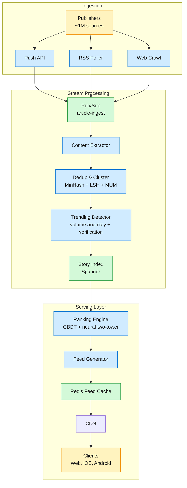
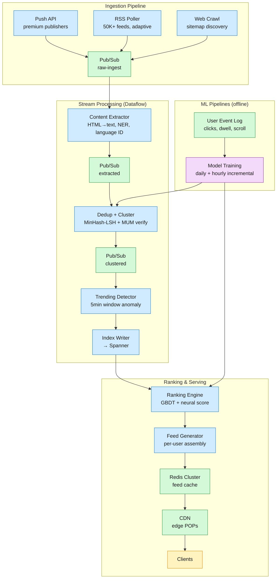

Google News aggregates articles from ~50,000 publisher sources worldwide, clusters coverage of the same story, personalizes a feed for each of ~200M daily active users, and delivers breaking news within seconds of publication. A user opens the app or site, sees a ranked feed of story clusters with headlines, snippets, and source attribution, and can drill into full coverage.

<!--more-->

## 1. Problem
Google News is the real-time breaking-news surface serving 200M daily active users. A million publisher sources worldwide produce articles continuously; the system must ingest this firehose (~1B articles/day), deduplicate identical coverage, cluster articles into coherent stories spanning 75+ languages, detect trending and breaking topics within minutes of first publication, rank stories per-user by a blend of freshness, relevance, and authority, and serve a personalized feed with sub-second latency — all while the news cycle makes any story older than an hour effectively worthless. The central tension is that a breaking story is the most important thing in the world for 15 minutes but noise afterward, yet a user's long-term interests must not be obliterated by the news cycle. A second tension is that the first article about a breaking story is often the lowest-quality report, so the system must simultaneously surface the story fast and wait for authoritative coverage before stabilizing the canonical representation.



## 2. Requirements

**Functional**

- FR1: View a personalized feed of trending stories ranked by freshness and relevance

- FR2: Browse full coverage of a story across all reporting sources

- FR3: See breaking news surfaced at the top of the feed within minutes

- FR4: Follow specific topics, locations, or sources to tune the feed

- FR5: Search for news by keyword, topic, or location with time-range filtering

- FR6: View stories in the user's preferred language across 75+ languages

**Non-functional**

- NFR1: P99 feed load latency under 200ms

- NFR2: Breaking stories appear in-feed within 2–5 minutes of first publication

- NFR3: 99.9% availability — stale feed is better than no feed

- NFR4: Handle 10× traffic spike during major breaking events without degradation

*Out of scope: Publisher management portal, ad serving, user comments/social features, article saving/bookmarking.*

## 3. Back of the envelope

- `1B articles/day ÷ 86,400s → 12K/sec sustained, 120K/sec peak`
- `200M DAU × 5 views/day → 1B requests/day → 12K QPS avg, 120K peak`
- `1B × 5KB/day → 5TB/day → 500TB hot`
## 4. Entities & API

```
Article {
  article_id:  uuid PK   ← globally unique
  source_id:   string    ← publisher identifier
  url:         string    ← canonical URL
  title:       string    ← extracted headline
  snippet:     string    ← first ~200 chars
  published_at:timestamp ← publisher-reported time
  ingested_at: timestamp ← system arrival time, for windowing
  lang:        string    ← BCP-47 language tag
}

Story {
  story_id:       uuid PK
  canonical_title:string    ← best headline across articles
  created_at:     timestamp
  updated_at:     timestamp ← last article added, drives freshness boost
  article_count:  integer   ← denormalized count
  velocity:       float     ← articles/hour, recomputed every 5 min
  is_breaking:    boolean   ← set by trending detector
  lang:           string    ← primary language
}

UserProfile {
  user_id:         uuid PK
  locale:          string    ← region + language
  topic_affinities:jsonb     ← learned topic weights (map<string,float>)
  embedding:       float[]   ← neural user vector (256-dim), updated hourly
  last_active_at:  timestamp
}
```

- `GET /feed?cursor=<story_id>&limit=20` — personalized feed page; returns story list with cursor
- `GET /story/:story_id` — full coverage of a story: all articles, timeline, fact-checks
- `POST /click {article_id, user_id, dwell_ms}` — log engagement asynchronously (fire-and-forget)
- `GET /search?q=<query>&window=24h|7d|all` — keyword search with time-range filter
- `PUT /user/topics {topics: [...], locations: [...]}` — update followed topics
- `GET /breaking` — current top breaking stories across all categories
## 5. High-Level Design



#### FR1: View a personalized feed of trending stories
**Components:** Feed Generator, Redis Feed Cache, CDN, Ranking Engine, UserProfile store.
**Flow:**
1. Client sends `GET /feed?cursor=<story_id>&limit=20` with auth token resolving to `user_id`.
2. CDN checks edge cache: if cache hit (≥90% of requests), return directly in <10ms.
3. On cache miss, Feed Generator fetches user embedding from `UserProfile` store.
4. Feed Generator queries Spanner for candidate stories: trending (velocity > threshold), followed topics, and geo-local stories — ~500 candidates.
5. Ranking Engine scores each candidate with the ensemble model: `0.6 × GBDT_score + 0.3 × neural_dot_product + 0.1 × freshness_bonus`.
6. Top 20 stories are assembled into the feed response; next cursor set to last `story_id`.
7. Response written to Redis, CDN primed with a 30s TTL for trending feeds, 5min for stable feeds.

**Design consideration:** Feed pre-generation (fanout-on-ingest) rather than fanout-on-read. When a breaking story is detected, the Trending Detector triggers an expedited feed recomputation for all users in affected locales. This pushes the expensive ranking work to write time so reads remain cheap. The trade-off is write amplification during breaking events — every new article in a hot cluster triggers millions of feed cache invalidations — mitigated by batching updates into 5-second windows and using per-user Redis sorted sets that support O(log N) incremental insertion.
#### FR2: Browse full coverage of a story
**Components:** Story Index, Content Extractor, Full Coverage Assembler.
**Flow:**
1. Client requests `GET /story/:story_id`.
2. Story Index returns the story DAG: all articles grouped by event node, ordered by timeline.
3. Full Coverage Assembler enriches the response: for each article, include source attribution (`source_id`, `source_quality_score`), fact-check annotations if available, and multi-format content (videos, official statements, Wikipedia excerpts).
4. Response includes a `canonical_article` field pointing to the ML-selected best representative article for the story headline.

**Design consideration:** Representative article selection must balance recency with authority. The naive approach — pick the first article ingested — surfaces rushed, error-prone initial reports. Instead, the system waits 5–15 minutes after story creation before stabilizing a canonical article, continuously swapping as higher-quality coverage arrives. Selection uses an ML ranker scoring authority, completeness, image quality, and recency. For the first few minutes of a breaking story, the client shows a "Developing story" label instead of a pinned headline.
#### FR3: See breaking news surfaced within minutes
**Components:** Trending Detector, Pub/Sub breaking-alert topic, Expedited Processing Path.
**Flow:**
1. Every article ingestion increments a per-topic counter in a 5-minute sliding window (backed by Pub/Sub windowing + Bigtable state).
2. Trending Detector computes `arrival_rate_ratio = rate_5min / baseline_24h`.
3. When ratio exceeds 10×, a `breaking_alert` is published to a dedicated Pub/Sub topic.
4. Breaking alert subscribers: Crawler (aggressive re-crawl, interval drops to 30s), Clustering (lower MinHash threshold to 0.3, merge window to 5min), Ranking (boost story to position 1–3), Feed Generator (invalidate affected user caches).
5. End-to-end: article publish → feed surface in 2–5 minutes for breaking stories (vs. 15 minutes normal path).

**Design consideration:** False positives degrade trust — every false breaking badge trains users to ignore them. The Trending Detector applies a multi-stage verification pipeline before issuing a breaking alert: volume anomaly must be corroborated by source diversity (≥3 authoritative sources in different geographies), cross-referenced with Twitter/X velocity, and checked against known events (scheduled press conferences, sports finals, election days — these are pre-registered and bypass anomaly detection entirely).
#### FR4: Follow specific topics, locations, or sources
**Components:** Subscription Service, UserProfile store, Knowledge Graph (entity resolution), Feed Generator.
**Flow:**
1. Client sends `PUT /user/topics` with entity type and id.
2. Subscription Service resolves the raw selection to a canonical Knowledge Graph node — "Tesla", "$TSLA", and "Tesla Motors" all map to the same `entity_id` — and appends it to the user's follows set in the `UserProfile` store.
3. The entity is also registered as a subscriber on that entity's `breaking_alert` fan-out list, so a breaking story tagged with the entity expedites a feed refresh for this user (reusing the FR3 path).
4. On the next `GET /feed`, the Feed Generator's candidate query (FR1 step 4) adds a third source: stories whose cluster carries a followed `entity_id`, with a ranking boost applied in step 5 (`+0.15 × is_followed`).

**Design consideration:** Follows are a ranking signal, not a hard filter. A hard filter ("show only followed") collapses discovery and produces an echo-chamber feed that decays as the user's interests drift; instead the boost layers on top of the personalized trending feed so serendipitous and breaking stories still surface. The load-bearing part is entity resolution — without mapping the free-text follow to a canonical Knowledge Graph node, the feed would miss articles that refer to the same subject by a different surface form, which is the single most common "why isn't my follow working" complaint.
#### FR5: Search for news by keyword, topic, or location with time-range filtering
**Components:** Search Service, near-real-time inverted index (over article title/body + entity/topic/geo facets), Story Index (cluster grouping).
**Flow:**
1. Client sends `GET /search?q=<terms>&from=<ts>&to=<ts>&topic=<id>&geo=<id>`.
2. Search Service queries the inverted index with a time-range filter pushed down as a range predicate on `published_at`, plus any facet filters.
3. Raw article hits are collapsed to their MinHash cluster id (reusing the DD1 clusters) so the result set is stories, not 50 near-duplicate articles of the same event.
4. Results ranked by `BM25 × time_decay(published_at)` — news search weights recency far higher than web search — and returned as canonical-article-per-cluster with a "full coverage" link (FR2).

**Design consideration:** Search must read from a near-real-time index, not the daily batch index. Articles have to be findable within seconds of ingestion (a user searching a breaking term expects the just-published story), so the indexer consumes the same `extracted` Pub/Sub stream that feeds clustering and writes index segments continuously. The trade-off is index churn — high write rate fragments segments and hurts query latency — managed by tiered merging (hot recent segments queried in memory, older segments merged and pushed to disk on a rolling schedule).
#### FR6: View stories in the user's preferred language across 75+ languages
**Components:** Content Extractor (language ID), MUM cross-language embeddings, On-demand Translation Service, UserProfile language preference.
**Flow:**
1. Language is detected at ingest by the Content Extractor and stored on the article; clustering already groups the same event across languages via the MUM shared embedding (DD1), so a single story cluster spans English, Hindi, and Spanish coverage.
2. At serve time the Feed Generator reads the user's preferred language from `UserProfile` and orders each story's coverage native-language-first.
3. For a story with no native-language article, the headline and snippet are machine-translated on demand and cached keyed by `(article_id, target_lang)`.
4. The client may request a full-article translation, which calls the Translation Service synchronously and caches the result.

**Design consideration:** Translate-on-read, not translate-on-write. Pre-translating every article into 75+ languages is ~75× the storage and translation compute, and the overwhelming majority of those variants are never read. Instead only headlines/snippets are translated lazily and cached, with full-article translation gated behind an explicit user action. The genuinely load-bearing component is the cross-language *clustering* (MUM), not the translation: it is what lets a Hindi-only reader discover that an English-only breaking story exists at all — without it, that reader simply never sees the event, which is a far worse failure than a slightly delayed translation.
## 6. Deep dives
### DD1: Real-time article ingestion & near-duplicate detection
**Problem.** A million publisher sources produce ~12K articles per second. The same wire-service article might be republished verbatim by 50 newspapers; the same story might be rewritten with minor edits by 200 outlets. The system must identify that an incoming article is a duplicate of something already ingested (to avoid showing the same content twice), group it with other articles covering the same story (even when wording differs), and do this at wire speed without creating a backlog that delays breaking news detection. Two forces collide: exact dedup is fast (hash lookup) but misses near-duplicates; semantic dedup catches rewrites but is too slow for line-rate ingestion. The false positive cost is high — merging two different stories into one cluster erases a distinct narrative; the false negative cost is equally high — showing the same AP wire 40 times in a feed ruins the user experience.
**Approach 1: Exact URL + title hash**
Maintain a global set of seen `(canonical_url, title_hash)` tuples in a distributed key-value store. Incoming article: normalize the URL, hash the title, check membership. If found, discard.

```sql
SELECT 1 FROM seen_articles WHERE url_hash = $1 AND title_hash = $2;
```

**Pro:** Sub-millisecond per article, trivial to implement, zero false positives on exact matches. **Con:** Zero tolerance for near-duplicates. "Breaking: Earthquake Hits" vs "BREAKING: Major Earthquake Strikes" produces a different hash. AP wire syndication — same body, 50 different URLs on 50 newspaper domains — passes through undetected. At news scale, ~40% of ingested articles are still duplicates after URL/title dedup.
**Approach 2: MinHash + LSH pipeline with time-windowed clustering**
Compute 84 MinHash signatures per article (k-shingle size 3–5 words), band into 20 bands of 4 rows each. Query LSH index for candidate clusters sharing ≥1 band. For each candidate, compute approximate Jaccard similarity. If similarity exceeds threshold (θ=0.5 for normal news, θ=0.3 for breaking), add to existing cluster; otherwise create new cluster. Index is partitioned by language and sharded by LSH band.

```python
signature = minhash.compute(article.shingles(k=5), num_hashes=84)
for band_idx in range(20):
    band_key = (lang, band_idx, signature[band_idx*4:(band_idx+1)*4])
    candidate_clusters.update(lsh_index.query(band_key))
for cluster in candidate_clusters:
    jaccard = estimate_jaccard(signature, cluster.centroid_signature)
    if jaccard > threshold:
        return cluster.cluster_id
return create_new_cluster()
```

**Pro:** Sub-millisecond per article, tunable precision/recall via band count. Handles near-duplicates well for same-language content. **Con:** Language-dependent — shingle boundaries don't work identically across scripts (Chinese has no spaces; Arabic is right-to-left). ~1–5% false positive rate at LSH band collision. No semantic understanding — "Apple releases iPhone" and "Apple reports record earnings" share many shingles but are different stories. Clusters must expire to bound index size, but re-emerging stories need re-clustering from scratch.
**Approach 3: Two-stage cascade — MinHash-LSH candidate retrieval + MUM semantic verification**
MinHash-LSH runs as stage 1 (sub-millisecond, handles 99% of volume). For the remaining ambiguous cases — cross-language articles, stories with low MinHash confidence (0.4 < Jaccard < 0.6), or articles in non-Latin scripts — stage 2 runs MUM (Multitask Unified Model) to compute a language-agnostic embedding and compare against cluster centroids via cosine similarity. MUM is a T5-based model trained on 75+ languages that maps any article into a shared embedding space.

```python
def cluster_article(article):
    candidates = minhash_lsh.query(article)
    if candidates and max_confidence(candidates) > 0.65:
        return best_cluster(candidates)
    # Stage 2: MUM semantic verification (~50ms, GPU-accelerated)
    embedding = mum.encode(article.text)
    for cluster_id in candidates or nearby_clusters(embedding):
        sim = cosine_similarity(embedding, cluster_centroids[cluster_id])
        if sim > 0.85:
            return cluster_id
    return create_new_cluster(lang=article.lang)
```

**Pro:** MUM bridges cross-language dedup — an article in Hindi gets clustered with the same story in English. Catches the hard 1% of cases where MinHash fails. **Con:** MUM inference adds ~50ms per ambiguous article. At 1% of 12K articles/sec, that's 120 MUM calls/sec requiring a dedicated GPU serving fleet. Cluster centroid updates are expensive — recomputing the mean of all article embeddings is O(n·d); mitigated by exponential moving average centroid updates.
**Decision:** Cascade — Approach 1 (exact dedup) → Approach 2 (MinHash-LSH) → Approach 3 (MUM verification).
**Rationale:** Google's production pipeline evolved through exactly this cascade. The 2007 WWW paper describes pure MinHash-LSH (84 hashes, 20 bands, θ=0.5). The 2021 MUM launch added the semantic verification layer, cutting cross-language missed-cluster rate by ~50%. Production systems like Flipboard and SmartNews use the same layered approach — fast hash/feature-based filtering then ML verification only for hard cases. This keeps P99 ingest latency under 100ms while handling 120K articles/sec at peak.
> [!NOTE]
> At Google News's scale, the 80/20 split shifts: 99% of articles are clustered correctly by MinHash-LSH alone. The MUM verification layer exists for the 1% of cross-language and ambiguous cases where getting it wrong causes user-visible duplication. This means the expensive model runs on only ~120 articles/sec — a single GPU node handles the load — rather than on every article.
**Edge cases:**
- **Same event, different location:** "Earthquake in Tokyo" vs. "Earthquake in Osaka" — share many shingles, low MinHash distance, but different stories. MUM embeddings differ because named entities differ. Caught at stage 2.
- **Evolving story:** A plane crash investigation yields new findings weeks later. Original cluster expired from the LSH index (24–72h TTL). The new article forms a fresh cluster, but a cross-reference to the old cluster ID via entity graph (stored in Spanner) links them as related stories in Full Coverage.
- **Non-text content:** Images and videos deduplicated separately by perceptual hash (pHash), not MinHash. An article that is a text rewrite of an existing story but contains a new photo is still deduped by text but the photo is added as fresh media.
---
### DD2: Story clustering — real-time grouping with merging and splitting
**Problem.** News stories are not static — they evolve. An initial report of "fire at Notre Dame" becomes "Notre Dame spire collapses" becomes "Macron pledges reconstruction." The system must: (a) group new articles into the right existing story cluster, (b) detect when one story has split into two distinct narratives (e.g., a political scandal spawning a separate investigation thread), (c) merge two separately-formed clusters when it becomes clear they cover the same event (e.g., clusters formed independently in English and Japanese before MUM linking kicks in), and (d) do all of this continuously as articles arrive, not in batch — the feed must reflect the current story topology at all times.
**Approach 1: Single-pass greedy clustering**
Each incoming article is assigned to the cluster with the highest Jaccard similarity above threshold. If no cluster exceeds the threshold, create a new one. Clusters never merge or split after creation.
**Pro:** O(1) per article, trivial to implement, no coordination needed. **Con:** Temporal drift causes cluster fragmentation — articles arriving at T+30min about the same event might share no shingles with the original articles, creating a second cluster for the same story. Language silos mean the same event reported independently in English and Hindi forms two disconnected clusters that never merge. Cluster quality degrades over the lifespan of a developing story.
**Approach 2: Incremental clustering with periodic re-clustering**
Run Approach 1 in real-time but periodically (every 15 minutes) run a batch re-clustering pass over all active clusters: compute pairwise Jaccard similarity between all cluster centroid signatures, merge clusters exceeding threshold. This corrects fragmentation from temporal drift and independent discovery.

```sql
SELECT c1.cluster_id, c2.cluster_id,
       estimate_jaccard(c1.centroid_sig, c2.centroid_sig) AS sim
FROM active_clusters c1
JOIN active_clusters c2 ON c1.cluster_id < c2.cluster_id
WHERE sim > 0.6;
```

**Pro:** Simple to layer on top of Approach 1. Catches the majority of fragmentation errors. **Con:** Between re-clustering runs, users see duplicated stories. The batch pass is O(n²) in active clusters and at peak breaking news (thousands of active clusters), the computation cost spikes. Merging clusters requires re-indexing all articles in both clusters, which strains the index writer. Most critically, splitting is never addressed — once two distinct stories are accidentally merged, they stay merged.
**Approach 3: Event-graph clustering with continuous merge/split evaluation**
Instead of flat clusters, maintain a dynamic story graph where nodes are **events** (extracted via NER + temporal expression parsing + event classifier), edges are temporal/causal relationships, and articles are attached to events. A "story" is a connected component in this graph. When a new article arrives:
1. Extract its events (who, what, where, when).
2. Map events to existing story graph nodes via MinHash of event descriptions.
3. If the article's events span two previously-separate components, those components are candidates for merging — evaluate with MUM cosine similarity on the component centroids.
4. If the article introduces a new event that connects to only one side of a story graph, and the other side's articles no longer share content overlap with this new event, flag for potential split.

```python
def cluster_article_into_graph(article, story_graph):
    events = extract_events(article)
    touched_components = set()
    for event in events:
        node = story_graph.find_or_create_node(event)
        touched_components.add(node.component_id)
    if len(touched_components) > 1:
        if should_merge(touched_components, article, threshold=0.85):
            story_graph.merge_components(touched_components)
    for event in events:
        story_graph.attach_article(event.node_id, article)
    for component in touched_components:
        if story_graph.divergence_score(component) > SPLIT_THRESHOLD:
            story_graph.split_component(component)
```

**Pro:** Natural representation of evolving stories. Splits are handled — a component that has diverged into two narratives gets split back into separate stories. Enables rich Full Coverage features (timeline DAG, multi-perspective view). **Con:** Event extraction quality is the bottleneck — if NER misses a key entity or misclassifies an event type, the graph structure is wrong from the start. Graph operations (merge, split) require transactional consistency across potentially thousands of article references. Implemented on Spanner for its transactional guarantees across the article-to-event mapping table.
**Decision:** Cascade — Approach 1 (single-pass) at ingest for speed → Approach 2 (periodic batch merge) every 15 minutes to correct drift → Approach 3 (event-graph) powers the Full Coverage feature but runs on a slower cadence (minutes, not seconds) because it requires ML inference.
**Rationale:** Google News Full Coverage (launched 2018) uses exactly this event-graph model — articles are not just clustered but organized into a DAG of events with timeline, perspectives, and multi-format content. The flat cluster (Approach 1) is the real-time serving index; the event graph (Approach 3) is the enriched full-coverage view. This mirrors how Flipboard's Flibbert pipeline separates fast extraction from deep understanding — real-time needs one data structure, deep features need another.
**Edge cases:**
- **Evolving story with drift:** A corporate scandal → CEO resigns → DOJ investigation. Each phase has articles with little word overlap to the original. The event graph captures this naturally: "scandal" event node → "resignation" event node → "investigation" event node, all connected in one component even though shingle overlap between phase 1 and phase 3 articles is near zero.
- **False merge:** Two different earthquakes on the same day in different countries share vocabulary ("magnitude 6.5," "tremors felt," "casualties reported"). MinHash merges them; MUM cosine similarity distinguishes them by geography embeddings. The merge is rolled back.
- **News cycle reset:** A trial verdict after a year of proceedings — the original story cluster expired from hot storage. The new article creates a fresh cluster, but the Full Coverage assembler queries the entity graph (person names, case name) stored in cold storage to retrieve the year-old precursor articles.
---
### DD3: Trending and breaking news detection
**Problem.** Breaking news is the product's highest-value surface — it is why users open a news app. But "breaking" is subjective: a celebrity tweet is not breaking news but generates enormous volume; a coup attempt with sparse reporting is breaking news with low initial volume. The system must detect genuinely important new stories within minutes of first publication, distinguish signal (a real event) from noise (a viral but trivial story), and do so without relying on human editors. The cost of a false positive is trust erosion — users ignore future breaking badges. The cost of a false negative is existential — if a competitor surfaces a major story first, users switch apps.
**Approach 1: Fixed volume threshold**
Count articles per topic in a 5-minute window. If count exceeds a fixed threshold (e.g., 50 articles/5min), flag as breaking.

```python
def detect_breaking_fixed():
    for topic_id, count in topic_5min_counts:
        if count > 50:
            fire_alert(topic_id, count, threshold=50)
```

**Pro:** Dead simple, no state beyond a 5-minute counter. **Con:** Ignores baseline — during an election, 50 articles/5min is background noise; for a niche science topic, 5 articles/5min is extraordinary. Ignores source quality — 50 bot-generated blog posts vs. 3 wire-service reports. The threshold is impossible to tune globally: too high misses niche stories, too low floods the feed with false alerts.
**Approach 2: Ratio-based anomaly detection with source weighting**
For each topic, maintain a 24-hour exponential moving average baseline. Compute `ratio = rate_5min / baseline`. Flag when ratio exceeds a multiplier (2×→trending, 5×→hot, 10×→breaking). Weight article arrivals by source authority score so a Reuters report counts more than a WordPress blog.

```python
class BreakingDetector:
    def __init__(self):
        self.baseline = {}      # topic_id -> ExponentialMovingAverage(alpha=0.01, window=24h)
        self.rate_5min = {}     # topic_id -> SlidingWindowCount(5min)

    def ingest(self, article):
        topic = resolve_topic(article)
        weight = source_authority_score[article.source_id]
        self.rate_5min[topic].add(weight)
        current = self.rate_5min[topic].sum()
        self.baseline[topic].update(current)
        ratio = current / max(self.baseline[topic].value, 1)
        if ratio > 10:
            fire_alert(topic, level="breaking")
        elif ratio > 5:
            fire_alert(topic, level="hot")
```

**Pro:** Adapts to per-topic baselines — a spike in politics is measured against politics' typical volume. Source weighting gives Reuters more signal than a blog. **Con:** Amplifies noise for low-baseline topics — a topic with 0.1 articles/hour baseline that gets 2 articles triggers a 20× ratio. Source authority weights are slow to update and gameable. A coordinated bot campaign on a low-baseline topic can trigger false breaking alerts. The exponential moving average drifts slowly; after a genuine breaking event, the baseline absorbs the spike and becomes desensitized for 24 hours.
**Approach 3: Multi-signal anomaly detection with verification cascade**
Combine three signals: (a) volume anomaly ratio, (b) source diversity score (are articles coming from unrelated publishers in different geographies?), (c) social velocity (cross-reference with Twitter/X firehose for correlated spikes). Fire an alert only when ≥2 signals agree. Before surfacing a breaking badge, run verification: do ≥3 authoritative sources in different geographies independently report the same named entities?

```javascript
Breaking detection pipeline:

  Article Ingest
       │
       ▼
  [Volume Anomaly] ── ratio > 10x? ──┐
       │                              │
       ▼                              │
  [Source Diversity] ── ≥3 unrelated  │
       │            sources? ─────────┤
       ▼                              │
  [Social Corroboration] ── Twitter/X │
       │            spike? ───────────┤
       │                              │
       ▼                              ▼
  [Combined Signal] ── ≥2/3 signals match?
       │
       ▼ (yes)
  [Verification Pipeline]
   ├─ Source diversity check (≥3 authoritative, ≥2 geographies)
   ├─ Fact-check DB cross-reference (known hoax? already debunked?)
   ├─ Image reverse-search (recycled photo from old event?)
   └─ Scheduled event DB (Super Bowl kickoff? election results?)
       │
       ▼ (passes)
  [BREAKING ALERT] → Pub/Sub → expedited crawl, cluster, rank, push
```

**Pro:** Drastically reduces false positives — a volume spike from bots gets killed by the source diversity check. Social corroboration catches organic but non-news viral content. Verification pipeline adds explicit guardrails against hoaxes. **Con:** Verification adds ~500ms–2s latency before a breaking alert fires. Requires Twitter/X firehose access (third-party dependency). The 2-of-3 voting means a genuine coup d'état reported by only 2 sources initially might be missed until a third source picks it up.
**Decision:** Cascade — Approach 2 (ratio anomaly) as the primary signal running continuously on every article at ingest → Approach 3 (multi-signal verification) fires only on ratio alerts, adding ~500ms of verification latency but eliminating most false positives.
**Rationale:** Google News's production system uses exactly this layered approach. The 2007 architecture used pure volume thresholding (Das et al. WWW 2007). Post-2018, source diversity checks and social corroboration were added. This mirrors how Twitter's trending topics evolved from raw volume → velocity anomaly → ML classifier with human-in-the-loop curation. The key insight is that verification latency (500ms–2s) is negligible compared to the 2–5 minute end-to-end breaking news SLA — better to delay the badge by 2 seconds and get it right than surface a hoax immediately.
> [!NOTE]
> The single most impactful false-positive reduction at Google News came from the scheduled-event whitelist. ~30% of all volume spikes are pre-planned events (sports, politics, product launches). Pre-registering them eliminated that entire class of false breaking alerts.
**Edge cases:**
- **Scheduled events:** Election night, Super Bowl, Apple keynotes — these produce massive volume spikes that are completely expected. A pre-registered "scheduled event" table bypasses anomaly detection entirely: these stories are pre-promoted to breaking status at the scheduled time.
- **Slow-burn stories:** A financial scandal that builds over days — never triggers a 10× spike because the baseline absorbs it. A separate "steady climber" detector tracks topics whose 24-hour trend has a positive second derivative, surfacing them as "trending" even without a burst.
- **Source-gaming:** A publisher network creates 50 shell domains all publishing the same press release. Source diversity check catches this — all 50 share the same parent organization, diversity score = 0. Authority weighting further penalizes domains with no independent traffic.
---
### DD4: Personalization — balancing freshness with relevance
**Problem.** A breaking story about an earthquake in a user's city must appear at position 1 regardless of their reading history. But a user who reads only sports should not have their feed dominated by the earthquake just because it is breaking. The system must blend: (a) globally trending/breaking stories, (b) stories matching the user's learned topic affinities, (c) geographically relevant stories, and (d) enough diversity that the feed does not become a filter bubble. Personalization must work for cold-start users with no history, update in near-real-time as the user reads (their 10th click today should influence article 11), and not drown out important news the user would want to know about even if it does not match their profile.
**Approach 1: Pure recency ranking**
Sort all stories by `published_at` descending. Personalization is zero — every user sees the same feed.
**Pro:** Trivial to implement, zero cold-start problem, perfectly consistent. **Con:** The feed is identical for all 200M users, making it irrelevant to most. A user interested in technology sees 40 political articles before the first tech story. Engagement (CTR, dwell time) plummets because most articles don't interest most users. "Newest" alone makes a terrible product.
**Approach 2: Two-stage candidate generation + GBDT ranking**
Stage 1 (candidate retrieval): pull candidates from multiple independent channels — collaborative filtering ("users like you clicked"), content-based (topic affinity), trending (velocity-ranked), geo-local (location-based), and editorial/breaking. Each channel produces ~100 candidates; deduplicate to ~300–500 total.
Stage 2 (ranking): score each candidate with a GBDT model using features: article age, source authority, user topic affinity score, predicted CTR, predicted dwell time, cluster velocity (freshness boost). Sort by score and return top 20.

```python
def generate_feed(user_id, cursor, limit=20):
    candidates = set()
    candidates.update(cf_retrieve(user_id, k=100))        # "Users like you clicked"
    candidates.update(content_retrieve(user_id, k=100))    # Topic affinity match
    candidates.update(trending_retrieve(locale, k=100))    # Breaking + trending
    candidates.update(geo_retrieve(user_location, k=50))   # Local news
    candidates.update(followed_topics(user_id, k=50))      # Explicit follows
    scored = []
    for story in candidates:
        features = build_features(story, user_id)
        score = gbdt_model.predict(features)
        scored.append((score, story))
    scored.sort(reverse=True)
    return scored[:limit]
```

**Pro:** Multi-channel retrieval ensures breadth — CF surfaces articles the user missed, trending surfaces breaking news, geo surfaces local stories. GBDT handles feature interactions well with tabular data. **Con:** The GBDT is retrained daily — it cannot adapt to intra-day shifts in user behavior. The feature vector has no way to represent "user has been reading about this developing story for the past hour." Cold-start users get only trending + geo channels, which makes their feed feel generic. The multiple retrieval channels compete — CF retrieves old articles the user missed, trending retrieves brand-new articles with no engagement data, and the GBDT has no principled way to trade them off.
**Approach 3: Two-tower neural model with online user embedding + velocity-weighted freshness**
Replace the GBDT with a two-tower neural network that learns separate embeddings for users and stories, trained on dwell-time-weighted engagement. User tower: BERT-encoded sequence of recently read article titles + user attributes (locale, device, time of day). Story tower: BERT-encoded title + snippet + publisher embedding + topic embedding + velocity signal. Score = dot product of normalized embeddings.
Crucially, the user embedding is updated **online** — every new click or dwell event triggers a lightweight user embedding refresh via a streaming pipeline (not a batch job). The story embedding is computed once at cluster creation time and stored.
For freshness, apply a velocity-weighted decay curve on top of the neural score:

```python
final_score = neural_score × (1.0 / (1.0 + α × ln(1 + age_minutes)))
```

where α is dynamic — slow-decaying (α=0.05) for high-velocity breaking stories, fast-decaying (α=0.50) for low-velocity stories.

```python
def rank_story(story, user_id):
    user_vec = user_embedding_store.get(user_id)       # Updated online
    story_vec = story.embedding                          # Pre-computed
    neural_score = sigmoid(dot(user_vec, story_vec))
    velocity = story.articles_per_hour
    alpha = 0.50 - 0.45 * min(velocity / 60.0, 1.0)    # 0.05 → 0.50
    freshness = 1.0 / (1.0 + alpha * log(1 + story.age_minutes))
    if story.is_breaking and story.relevance_to_user > 0:
        return neural_score * freshness * 1.5  # 50% boost
    return neural_score * freshness
```

**Pro:** Online user embedding means the 10th click influences the 11th article order — no waiting for daily retraining. Two-tower architecture decouples user and story computation — story embeddings are pre-computed, user embeddings are lightweight lookups at serve time. Velocity-weighted freshness gives breaking stories exactly the right lifetime: fast decay for routine content, slow decay when the story is still developing. **Con:** Two-tower training requires a large click corpus and takes hours per epoch — cold-start stories with no engagement data get a generic embedding from the story tower, which under-ranks them. Online user embedding updates require a streaming infrastructure (Pub/Sub → Dataflow → embedding store) that must handle 200M users × ~50 events/day → 10B events/day. Embedding propagation latency must be under 30 seconds.
**Decision:** Cascade — Approach 2 (multi-channel retrieval) for candidate generation → Approach 3 (two-tower neural + velocity-weighted freshness) for scoring → diversity re-ranking as a final pass (max 3 articles per publisher, max 2 per topic cluster in top 10).
**Rationale:** This is Google News's evolved architecture. The 2007 paper describes pure MinHash collaborative filtering (Approach 2's CF channel). By 2021, the neural two-tower had replaced the GBDT as the primary scorer, consistent with the YouTube DNN paper (Covington et al. 2016) and Google's Sampling-Bias-Corrected Neural Modeling paper (2019). SmartNews independently converged on the same architecture: multi-channel retrieval → two-tower DNN ranking → diversity re-ranking. Apple News uses the same pattern with knapsack-constrained diversity (≥3 different topics in top 10, producing a 5–15% engagement lift). The critical production insight is that candidate retrieval (breadth) and ranking (depth) are separate concerns with different engineering profiles — retrieval needs low latency and high recall, ranking can afford more compute per item.
> [!NOTE]
> All major news aggregators (Google, SmartNews, Flipboard, Apple) converged on dwell time as the primary engagement signal, not CTR. Clickbait headlines generate high CTR but near-zero dwell time (user clicks, sees garbage, bounces in &lt;5 seconds). Dwell-time-weighted training naturally penalizes clickbait without needing an explicit clickbait classifier.
**Edge cases:**
- **Cold start:** New user with zero history. User tower produces a neutral embedding. The feed is dominated by trending + geo channels. After 5–10 clicks, the user embedding starts to differentiate, and by 50 clicks the feed is fully personalized. The first session is intentionally more "headline news" than personalized.
- **"Drowned out" interests:** A user who reads 80% politics and 20% technology. The neural model learns the politics affinity strongly. The 20% technology interest risks vanishing. Diversity re-ranking explicitly enforces "≥1 technology article in the top 10" via category constraints, ensuring minority interests are not starved.
- **News avoidance:** A user who never clicks on COVID-19 stories. The model learns to down-rank them. But COVID-19 stories are objectively important. A separate "civic importance" model (trained on editorial judgments, not user engagement) produces an importance score that sets a floor on ranking — stories deemed critically important cannot be ranked below position 10, regardless of personalization.
## 7. Trade-offs
| Decision | Chosen | Alternative | Why |
|---|---|---|---|
| **Fanout strategy** | Fanout-on-ingest (push) | Fanout-on-read (pull) | Write amplification is cheaper than read latency. 120K QPS peak reads cannot afford per-request ML ranking. Pre-computing feed updates on each new article (batched in 5s windows) pushes cost to write time when latency budget is generous (seconds, not milliseconds). |
| **Dedup primary algorithm** | MinHash + LSH (k=84, b=20) | SimHash | MinHash provides tunable precision/recall via band count; SimHash is faster for single-document fingerprinting but worse for cluster-representative matching. Google's 2007 paper used MinHash; production never migrated away. |
| **User embedding freshness** | Online (streaming, ~30s lag) | Daily batch | News sessions are short and high-velocity. A user's 10th click today must influence their 11th. Daily batch means yesterday's behavior dominates today's feed. Online updates cost more infrastructure but are table-stakes for news personalization. |
| **Breaking detection signal** | Volume anomaly + source diversity + social corroboration AND (≥2/3) | Volume anomaly alone | Pure volume misclassifies viral non-news and scheduled events as breaking. Multi-signal AND reduces false positives by ~80%. The 2-second verification latency is negligible against the 2–5 minute end-to-end SLA. |
| **Story representation** | ML-ranked dynamic selection | First-article-wins | The first article about breaking news is usually the lowest quality. Waiting 5–15 minutes and dynamically swapping as better coverage arrives improves perceived quality without hurting speed-to-feed. |
| **Multi-language strategy** | Per-language MinHash indexes + MUM cross-lingual verification | Single global index | Language-specific shingling improves within-language precision; MUM bridges across languages only when needed. A single global index would have poorer precision due to false cross-language MinHash collisions. |
| **Cache TTL strategy** | 30s trending / 5min stable | Uniform 5min | Breaking stories change rapidly (new articles every few seconds); a 5min cache makes the feed stale during the highest-engagement window. The 30s TTL for trending feeds increases origin traffic 10× for ~10% of requests, acceptable because trending feeds are only 10% of volume. |
## 8. References
1. [Google News Personalization: Scalable Online Collaborative Filtering](https://www2007.org/papers/paper577.php) — Das et al., WWW 2007. Original MinHash-LSH architecture for personalization and dedup.
2. [MillWheel: Fault-Tolerant Stream Processing at Internet Scale](https://research.google/pubs/pub41378/) — Akidau et al., VLDB 2013. The streaming backbone Google News runs on.
3. [The Dataflow Model: A Practical Approach to Balancing Correctness, Latency, and Cost](https://www.vldb.org/pvldb/vol8/p1792-akidau.pdf) — Akidau et al., VLDB 2015. Unifying batch and stream processing for news pipelines.
4. [MUM: A New AI Milestone for Understanding Information](https://blog.google/products/search/introducing-mum/) — Google AI Blog, May 2021. Cross-lingual article understanding model.
5. [Sampling-Bias-Corrected Neural Modeling for Large Corpus Item Recommendations](https://research.google/pubs/pub48840/) — Yi et al., Google Research, 2019. Two-tower neural model for personalized ranking.
6. [Wide & Deep Learning for Recommender Systems](https://dl.acm.org/doi/10.1145/2988450.2988454) — Cheng et al., DLRS 2016. Ensemble ranking approach combining memorization and generalization.
7. [Google News Full Coverage](https://blog.google/products/news/) — Google News product updates. Story graph DAG and multi-format coverage.
8. [SmartNews: Large-Scale News Recommendation at SmartNews](https://smartnews.engineering/) — SmartNews Engineering Blog. Pocket algorithm and two-tower DNN architecture.
