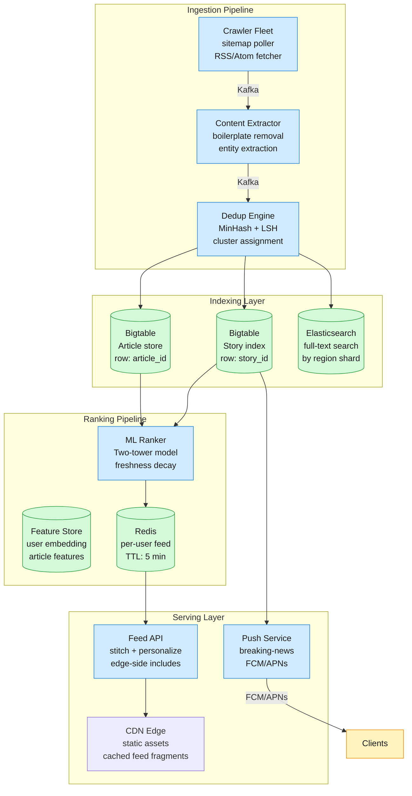
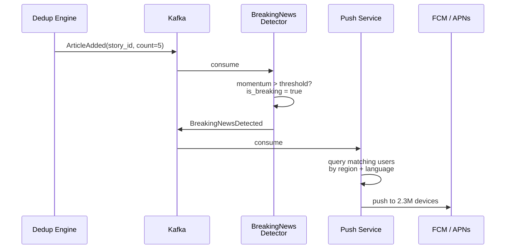
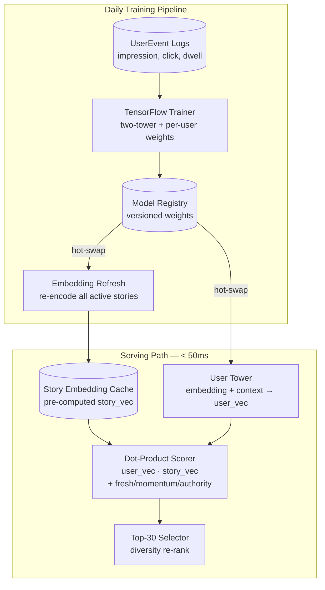
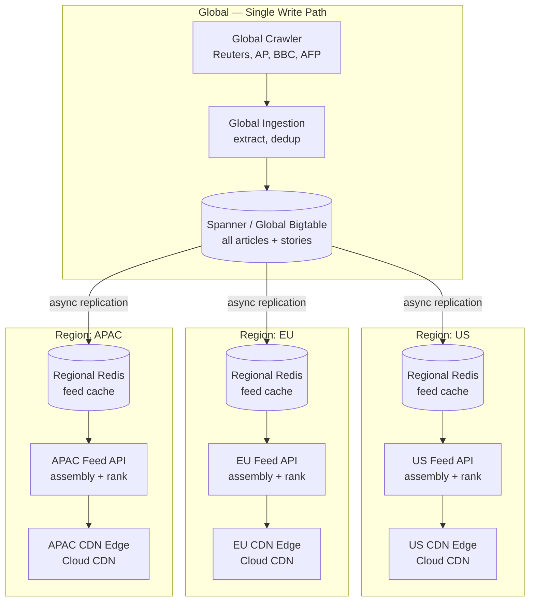

## 1. Problem frame

Google News aggregates articles from ~50,000 publisher sources worldwide, clusters coverage of the same story, personalizes a feed for each of ~200M daily active users, and delivers breaking news within seconds of publication. A user opens the app or site, sees a ranked feed of story clusters with headlines, snippets, and source attribution, and can drill into full coverage — every source reporting on that story. The system must ingest a firehose of newly published articles (~1B/day), deduplicate and cluster them in real time, rank clusters per-user by a blend of freshness, relevance, and authority, and serve localized editions across 60+ regions — all with sub-second feed latency. The core tension is recency vs relevance: a breaking story is the most important thing in the world for 15 minutes but worthless afterward, yet a user's long-term interests must not be drowned out by the news cycle.

```mermaid
graph LR
    A["Publishers<br/>50K sources"] --> B["Crawler Fleet<br/>sitemap polling"]
    B --> C["Ingestion Pipeline<br/>extract, normalize, enrich"]
    C --> D["Dedup & Clustering<br/>MinHash + LSH"]
    D --> E["Story Index<br/>clustered articles"]
    E --> F["Ranking Engine<br/>ML freshness + relevance"]
    F --> G["Serving Layer<br/>feed assembly, CDN"]
    G --> H["Clients<br/>Web, iOS, Android"]

    classDef edge fill:#fff3bf,stroke:#f08c00,color:#1a1a1a;
    classDef svc fill:#d0ebff,stroke:#1c7ed6,color:#1a1a1a;
    classDef store fill:#d3f9d8,stroke:#2f9e44,color:#1a1a1a;
    class B,C,D,F,G svc;
    class E store;
    class A,H edge;

```



## 2. Requirements

Functional

- FR1: View a personalized news feed ranked by freshness, relevance, and source authority
- FR2: Browse full coverage of a story across all reporting sources with source attribution
- FR3: Search for news by keyword, topic, or location with time-range filtering
- FR4: Follow specific topics, locations, or sources to tune the feed
- FR5: Receive breaking-news push notifications within 60 seconds of publication
- FR6: Access localized news editions for 60+ regions in their native language
Non-functional

- NFR1: Feed page load p95 under 200ms from CDN edge
- NFR2: New articles appear in story clusters within 30 seconds of crawl
- NFR3: 99.99% serving availability during major breaking-news spikes (10x normal traffic)
- NFR4: Feed personalization degrades gracefully — never returns empty for a logged-in user
Out of scope: publisher payment and revenue share, full-text article hosting (only snippets), user-generated content moderation, video/news broadcast integration, advertising and ad targeting infrastructure.

## 3. Back of the envelope

50K sources × 20 articles/day avg → 1M articles/day base; but 50K sources × 200 articles/day peak (breaking news triples output) → 10M articles during spike day. With 100+ words/article and extracted metadata, ~5 KB per article → 50 GB raw ingest/day. Implication: ingestion is write-heavy but moderate volume (~115 articles/s peak); the bottleneck is crawl scheduling, not storage bandwidth.

200M DAU × 1 feed refresh/session × 5 sessions/day → ~1B feed requests/day ≈ 12K QPS average, 50K QPS peak (morning commute). Each feed request assembles ~30 story clusters per user with headlines, snippets, and thumbnail URLs — ~10 KB per response → 500 MB/s egress at peak. Implication: feed assembly must be fast (p95 < 50ms server-side) and cacheable; serve from CDN edge with personalization stitched at the edge or via ESI (Edge-Side Includes).

1B articles/day ingested → ~50K new articles/min peak. Dedup must compare each incoming article against a rolling window of recent articles. Brute-force pairwise comparison is O(n²) at 50K/min — a non-starter. Implication: MinHash + LSH reduces comparison to O(n) by bucketing similar articles; the LSH index must support ~50K insertions/min and ~50K queries/min (each new article queries against the index to find its cluster).

## 4. Entities & API

```javascript
Article
  article_id: string (PK)          ← publisher domain + path hash, globally unique
  url: string (UNIQUE)             ← canonical URL after normalization
  publisher_domain: string (INDEX) ← e.g. "reuters.com"
  headline: string (TEXT INDEX)
  snippet: string                  ← first 200 chars of body, extracted
  published_at: timestamp (INDEX)
  language: string (INDEX)         ← ISO 639-1; drives region routing
  region: string (INDEX)           ← geo-tag from content + publisher locale
  source_authority: float          ← static score from publisher reputation graph

Story
  story_id: string (PK)            ← generated by LSH cluster assignment
  canonical_headline: string       ← highest-authority source's headline
  article_count: integer           ← number of articles in this cluster
  top_sources: string[]            ← top 5 publisher domains by authority
  category: string (INDEX)         ← top-1 topic label: world | business | tech | sports | ...
  first_published_at: timestamp    ← earliest article in cluster
  last_updated_at: timestamp       ← most recent article added
  is_breaking: boolean             ← true if cluster grew 5+ articles in 5 min
  cluster_momentum: float          ← article arrival rate; decays exponentially

UserProfile
  user_id: string (PK)
  language_prefs: string[]         ← e.g. ["en", "es"]
  region: string                   ← home region for local news
  followed_topics: string[]        ← explicit topic interests
  followed_sources: string[]       ← explicit publisher preferences
  interest_embedding: float32[]    ← 128-dim embedding from reading history; updated nightly

UserEvent
  user_id: string (PK)             ← partition key
  event_id: string (PK)            ← sort key
  article_id: string               ← article viewed
  story_id: string                 ← story cluster the article belongs to
  event_type: enum                 ← impression | click | long_dwell (>30s) | share | dismiss
  timestamp: timestamp
  session_duration_ms: integer

```

API

- GET /v1/feed?region=us&page_token=<token> — personalized news feed; returns ranked story clusters with headline, snippet, source count, thumbnail; 30 clusters per page
- GET /v1/stories/{story_id}?include=articles — full coverage of a story; returns canonical headline + all source articles sorted by authority and recency
- GET /v1/search?q=<query>&region=us&from=<ts>&to=<ts>&page_token=<token> — search across article index with optional time and region filters
- POST /v1/user/preferences — update followed topics, sources, and region; body: {followed_topics, followed_sources, region}
- POST /v1/events — log user interaction (impression, click, dwell, dismiss); body: {events: [{article_id, story_id, event_type, timestamp}]}; fire-and-forget, 202 Accepted
- GET /v1/breaking?region=us — current breaking-news stories for a region; returns clusters with is_breaking=true and their momentum scores

## 5. High-Level Design



#### FR1: View a personalized news feed ranked by freshness, relevance, and source authority

**Components:** Client → CDN Edge → Feed API → Redis (FeedCache) → ML Ranker → StoryDB + ArticleDB

**Flow:**

1. Client opens the app and requests GET /v1/feed?region=us. The request hits the nearest CDN edge node. The CDN serves a cached feed skeleton (HTML/CSS/JS) and defers the personalized story list to an edge-side include (ESI) tag that calls the Feed API.
1. Feed API receives the request with user identity (from auth cookie) and region. It checks Redis for a cached feed keyed on feed:{user_id}:{region}. If cache hit and younger than 5 minutes, return it directly.
1. On cache miss, Feed API calls the ML Ranker: POST /v1/rank/feed with {user_id, region, limit: 30}. The Ranker loads the user's interest_embedding (128-dim, pre-computed nightly) from the Feature Store alongside their followed topics and sources.
1. The Ranker queries the Story Index for candidate stories from the last 48 hours, scoped to the user's region and language preferences. It scores each story with a two-tower model:

```javascript
score(story, user) = α · relevance(story_embedding, user_embedding)
                   + β · freshness_decay(story.first_published_at)
                   + γ · source_authority(story.top_sources)
                   + δ · cluster_momentum(story)

```

where freshness_decay(t) = e^(-λ · hours_since_publish) with λ tuned so a story loses 50% of its freshness weight after 6 hours. α, β, γ, δ are per-user coefficients learned from their engagement history (click rate, dwell time, dismiss rate).

1. The top 30 stories are returned. For each story, Feed API augments with: canonical headline (from the highest-authority article in the cluster), snippet (from a diverse second source), source count ("Reuters + 247 other sources"), and thumbnail URL. The assembled feed is written to Redis with a 5-minute TTL and returned.

**Design consideration:** The two-tower model separates story encoding (computed once on article ingest and cached) from user encoding (computed nightly). This means ranking is a dot-product at serving time — sub-millisecond per candidate. With ~500 candidate stories to score per feed request, the Ranker completes in < 10ms. The ranking model is retrained daily using the previous day's engagement data (impression → click → dwell → share as a cascading label) via a TensorFlow training pipeline. Model weights are pushed to the Ranker's in-memory serving graph with no downtime via hot-swap.

#### FR2: Browse full coverage of a story across all reporting sources with source attribution

**Components:** Client → Feed API → StoryDB (Bigtable) → ArticleDB (Bigtable) → response

**Flow:**

1. Client taps a story cluster from the feed. The client issues GET /v1/stories/{story_id}?include=articles. Feed API reads the Story row from Bigtable by story_id.
1. The Story row contains top_sources (the 5 highest-authority publishers) and article_count. Feed API returns the canonical headline and the top 5 source articles (headline + publisher + snippet) in the initial response. This is the "above the fold" payload — renders in one round trip.
1. For the full article list, the client issues GET /v1/stories/{story_id}/articles?page_token=<token>. Feed API scans the Article table using a secondary index on story_id + source_authority DESC + published_at DESC, paginated at 20 articles per page. Each article entry includes: headline, publisher domain, published_at, snippet, and source_authority. The ordering ensures the most authoritative and freshest coverage surfaces first.
1. If a publisher has paywalled content, the article entry carries access: "subscription" — the client can show a lock icon without fetching the paywall.

**Design consideration:** The Story row is denormalized with top_sources and canonical_headline to avoid a join at read time. When a new article is added to a cluster, the Dedup Engine asynchronously updates the Story row: recomputes top_sources if the new article's source authority displaces any of the top 5, and updates canonical_headline if the new article's source has strictly higher authority. This is a write-time computation amortized over the cluster's lifetime — a story cluster receives ~10 article additions in its first hour, tapering to zero after 24 hours.

#### FR3: Search for news by keyword, topic, or location with time-range filtering

**Components:** Client → Feed API → Elasticsearch (by region shard) → ArticleDB → response

**Flow:**

1. Client sends GET /v1/search?q=earthquake+turkey&region=us&from=2026-06-28&to=2026-06-29. Feed API routes the query to the Elasticsearch shard for region=us.
1. Elasticsearch executes a bool query combining full-text match on headline and snippet, filtered by published_at range and region:

```json
{
  "query": {
    "bool": {
      "must": [
        { "multi_match": { "query": "earthquake turkey", "fields": ["headline^3", "snippet"] } }
      ],
      "filter": [
        { "range": { "published_at": { "gte": "2026-06-28", "lte": "2026-06-29" } } },
        { "term": { "region": "us" } }
      ]
    }
  },
  "sort": [{ "published_at": "desc" }, { "_score": "desc" }],
  "size": 20
}

```

1. Elasticsearch returns article IDs + relevance scores. Feed API pipeline-fetches full article metadata from Bigtable (headline, snippet, publisher, source_authority) for the 20 results. Articles are grouped by story_id so search results show story clusters, not individual articles — a user searching "earthquake turkey" sees one story cluster per distinct earthquake event, not 500 articles about the same event.
1. If the query includes a location name (e.g., "istanbul"), Feed API enriches the query with a geo-entity resolution step: calls the Entity Service to map "istanbul" → {lat: 41.0, lon: 28.9, radius_km: 50}, then adds a geo-distance filter to the Elasticsearch query against articles tagged with location entities at ingest time.

**Design consideration:** Elasticsearch is partitioned by region (one shard per region) rather than by time. Partitioning by region keeps index size bounded (~50 GB per region for a 30-day rolling window) and ensures search latency is consistent regardless of which region is queried. A time-based partition would create hot shards for recent data and cold shards for historical data — query performance would be unpredictable. The 30-day rolling window is enforced by an ILM (Index Lifecycle Management) policy: indices older than 30 days are force-merged and moved to warm storage (lower-cost) before deletion at 90 days. Articles older than 30 days are still available via Bigtable point reads but not via full-text search.

#### FR4: Follow specific topics, locations, or sources to tune the feed

**Components:** Client → Feed API → UserProfile store → nightly retraining pipeline

**Flow:**

1. Client sends POST /v1/user/preferences with {followed_topics: ["artificial-intelligence", "climate"], followed_sources: ["reuters.com", "nature.com"], region: "us"}. Feed API validates that topics are from a known taxonomy (~5,000 topics maintained by the editorial team) and that sources are recognized publisher domains.
1. Preferences are written to the UserProfile row. The change takes effect on the next feed request — the Ranker applies a strong boost (10x weight multiplier) to stories matching followed topics or sources, and a moderate demotion to stories from topics the user has explicitly dismissed (if the feature supports negative signals).
1. Nightly, the user's reading history is aggregated into the interest_embedding. The embedding model uses a collaborative-filtering approach: users with similar reading patterns get similar embeddings. The training pipeline runs on BigQuery using the previous 90 days of UserEvent data. The nightly job also computes a "topic affinity" score per user-topic pair, which influences the Ranker's topic weight in the scoring function (FR1, step 4).

```python
# Nightly batch: compute user embeddings from reading history
# Input: UserEvent table (90-day window)
# Output: UserProfile.interest_embedding (128-dim float32)
def compute_user_embeddings():
    user_article_matrix = bigquery.query("""
        SELECT user_id, story_id, COUNT(*) AS weight
        FROM UserEvent
        WHERE event_type IN ('click', 'long_dwell')
        AND timestamp > TIMESTAMP_SUB(CURRENT_TIMESTAMP(), INTERVAL 90 DAY)
        GROUP BY user_id, story_id
    """)
    # SVD / ALS on user-article matrix → 128-dim embeddings
    embeddings = als_factorization(user_article_matrix, dims=128)
    upsert_to_feature_store(embeddings)

```

**Design consideration:** Explicit preferences (follows) are a strong signal but only act as a boost — they never exclude. If a user follows "AI" but the top story of the day is a global event outside that topic, the global event still ranks above a low-momentum AI story. This prevents the filter-bubble problem where a user's explicit interests blind them to major news. The Ranker's freshness term (β) naturally creates this behavior: a breaking story with high momentum outranks a slow-moving topic match.

#### FR5: Receive breaking-news push notifications within 60 seconds of publication

**Components:** Dedup Engine → StoryDB (is_breaking flag) → Push Service → FCM/APNs → Client

**Flow:**

1. When the Dedup Engine assigns an article to a story cluster, it increments cluster_momentum (an exponentially-weighted moving average of article arrivals per minute). If the cluster accumulates 5+ articles within a 5-minute window, the Story row's is_breaking is set to true.
1. A BreakingNews Detector (a Kafka Streams topology) consumes the stream of cluster updates. When a cluster's is_breaking transitions from false to true, the detector publishes a BreakingNewsDetected event to a dedicated Kafka topic.
1. Push Service consumes BreakingNewsDetected events. For each event, it queries the UserProfile store for users whose region and language_prefs match the story's region and language. It then fans out push notifications via Firebase Cloud Messaging (FCM) for Android and Apple Push Notification service (APNs) for iOS.
1. The push payload is compact: {story_id, headline, source_count, category} — enough for the device to render a notification. Tapping the notification deep-links to GET /v1/stories/{story_id}.



**Design consideration:** The push fan-out is the hardest scaling challenge — a global breaking story (e.g., a major election result) can trigger pushes to 50–100M devices within seconds. FCM and APNs handle per-device delivery; the Push Service's job is to submit the messages to FCM/APNs as fast as possible. The service uses a fan-out worker pool: the BreakingNewsDetected event is sharded by user region, and each shard's worker submits messages to FCM in batches of 500 device tokens. At 5M pushes/s (FCM's documented throughput), a 100M-device push completes in ~20 seconds. The Push Service does NOT wait for delivery confirmation — it fire-and-forgets to FCM and reports {story_id, submitted_count} for observability.

#### FR6: Access localized news editions for 60+ regions in their native language

**Components:** Client → CDN Edge (region routing) → Feed API (region-scoped) → region-specific StoryDB + Elasticsearch

**Flow:**

1. Client sends GET /v1/feed?region=jp. The CDN edge routes the request to the nearest Feed API pod in the Asia-Pacific region. The region code (determined from the user's profile or IP geo-location) drives all downstream queries: the Ranker queries only the region=jp partition of the Story Index, and the canonical headline is selected from the Japanese-language article with highest authority.
1. Language-aware ranking: the Ranker prefers articles whose language matches the user's language_prefs. For region jp, stories with Japanese-language articles receive a +20% relevance boost. If a story has no coverage in the user's language, the Ranker falls back to English coverage with a translated headline (machine-translated at ingest time by the Content Extractor).
1. If the user explicitly changes their region (e.g., a traveler setting region=fr while in Japan), the Feed API honors the explicit preference over geo-IP. The session's region is stored in a cookie and all subsequent feeds, searches, and breaking-news pushes are scoped to the new region.

**Design consideration:** The multi-region architecture is achieved through logical partitioning, not separate deployments. The Story Index and Elasticsearch are sharded by region — queries never cross region boundaries. This means a story about a US election is indexed in region=us and a story about a Japanese election is indexed in region=jp, even if both are covered by international sources. Stories with global relevance (e.g., a World Cup final) are duplicated across all region shards by the Dedup Engine: when a cluster's article count crosses a global-threshold (50+ articles from 10+ countries), it is promoted to a "global story" and replicated to every region index. This avoids cross-region queries for the common case while surfacing globally significant stories everywhere.

## 6. Deep dives

### DD1: News clustering and deduplication — MinHash + LSH at scale

**Problem.** A single news event — an earthquake in Turkey — generates 5,000+ articles from publishers worldwide within the first hour. Some are near-duplicates (syndicated AP/Reuters wire copy with different publisher bylines), some are rewrites (same facts, different phrasing), and some are distinct articles about different aspects (casualty counts vs. rescue efforts vs. geological analysis). The system must group all coverage of the same event into one story cluster, deduplicate exact copies, and separate distinct angles — all within 30 seconds of crawl. At 50K articles/min peak, pairwise comparison is O(n²) ≈ 1.25B comparisons/min — impossible. A MinHash + LSH pipeline reduces this to O(n) while achieving ~95% recall on near-duplicate detection.

**Approach 1: SimHash with Hamming distance**

SimHash maps each article to a 64-bit fingerprint where similar documents produce fingerprints with small Hamming distance. Articles whose fingerprints differ by ≤3 bits are considered near-duplicates. SimHash fingerprints can be compared in O(1) per pair, but finding all pairs within distance 3 still requires checking all O(n) candidates per article — O(n²) because each article must be compared against every other article's fingerprint. Blocked SimHash (splitting the 64-bit hash into blocks and only comparing articles that match on at least one block) reduces the search space but still degrades when the fingerprint space is dense.

**Challenges:** SimHash works well for exact near-duplicate detection (syndicated wire copy) but poorly for semantic similarity — two articles about the same earthquake with different wording may have SimHash distance 8+ and fail to cluster. The Hamming distance threshold is a hard cutoff; there's no notion of "70% similar."

**Approach 2: MinHash + LSH with Jaccard similarity**

MinHash estimates the Jaccard similarity between two documents' shingle sets. An article is tokenized into word n-grams (shingles of length 3–5 words). A set of 128 hash functions is applied to the shingle set; the minimum hash value for each function forms the MinHash signature. Two documents with Jaccard similarity J will share approximately J × 128 MinHash values. Locality-Sensitive Hashing (LSH) then bands the 128 signatures into 16 bands of 8 rows each. Two documents that match on all 8 rows in any band are considered candidate pairs and promoted to full Jaccard comparison.

```python
# At ingest time: compute MinHash signature for an article
def compute_minhash(article_text: str, num_hashes: int = 128) -> list[int]:
    shingles = set()
    words = tokenize(article_text)
    for i in range(len(words) - 4):          # 5-word shingles
        shingle = hash(" ".join(words[i:i+5]))
        shingles.add(shingle)

    signatures = []
    for seed in range(num_hashes):
        min_hash = min(h(seed, s) for s in shingles)
        signatures.append(min_hash)
    return signatures

# LSH banding: 16 bands × 8 rows each
def find_candidate_clusters(signatures, story_index):
    candidates = set()
    for band in range(16):
        band_key = tuple(signatures[band*8 : (band+1)*8])
        cluster_id = story_index.lookup(band_key)  # Bigtable row key
        if cluster_id:
            candidates.add(cluster_id)
    return candidates

```

**Challenges:** MinHash + LSH requires tuning the band/row trade-off. With 16 bands of 8 rows, the probability that two documents with Jaccard similarity s become a candidate pair is 1 - (1 - s^8)^16. At s = 0.3 (moderately similar), probability ≈ 0.15 — most similar articles are caught but some are missed. At s = 0.8 (near-duplicate), probability ≈ 0.999 — virtually all duplicates are caught. The LSH index must be queryable in real time: each incoming article queries 16 band buckets and retrieves candidate cluster IDs. At 50K articles/min, that's 800K Bigtable point reads/min — well within Bigtable's capability (~10K reads/s per node, scaled to 10+ nodes).

**Approach 3: Dense embeddings + approximate nearest neighbor (ANN)**

Encode each article into a 768-dim embedding using a sentence-transformer model (e.g., multilingual BERT fine-tuned on news similarity). Use an ANN index (ScaNN or FAISS) to find the top-10 nearest neighbors for each incoming article. If cosine similarity > 0.85, cluster together.

**Challenges:** Running a BERT forward pass on every incoming article (1B/day) requires ~10K GPU-seconds/day — feasible but expensive. Embedding models also have language bias; a Turkish earthquake article and its English translation may have cosine similarity 0.7 instead of 0.9 because the model's multilingual alignment is imperfect. ANN indices need periodic rebuilds as the embedding space shifts with the news cycle.

**Decision:** MinHash + LSH (Approach 2) as the primary clustering pipeline, with dense embeddings as a secondary re-ranking step for edge cases.

**Rationale:** Google News originally used MinHash + LSH for its story clustering — the approach is well-understood, computationally cheap (no GPU needed), and language-agnostic (shingles work on any text). The 5% recall gap (articles that are similar but fall through LSH banding) is covered by a secondary check: if a new article doesn't match any existing cluster, the Dedup Engine enqueues it for a dense-embedding comparison against recent unmatched articles in a batch job (every 60 seconds). This hybrid approach catches the semantic-similarity cases that MinHash misses (e.g., "Earthquake hits Turkey" vs. "7.8 magnitude tremor devastates southern Turkey" — different wording, same story) without the cost of running BERT on every article.

**Edge cases:**

- Multi-event stories: A story cluster about "Turkey earthquake" may inadvertently group a magnitude-7.8 mainshock article with a magnitude-5.1 aftershock article published 3 hours later. The Dedup Engine uses temporal proximity filtering: articles added to a cluster outside a 2-hour window of the cluster's first_published_at require a higher Jaccard threshold (0.5 instead of 0.3) to be admitted. Aftershock articles naturally form their own cluster.
- Slow-burn stories: An ongoing event like "US presidential campaign" generates articles for 18 months. The 2-hour admission window would fragment this into thousands of micro-clusters. The Dedup Engine detects long-running stories by cluster lifespan: if a cluster's article count grows steadily for > 7 days, it is promoted to a "topic" (a higher-level grouping that encompasses multiple story clusters). Topics are managed by a separate batch pipeline that uses dense embeddings, not real-time LSH.
- Language-bridging: A story first reported in Turkish may not match any English-language cluster because shingles don't cross languages. The Content Extractor machine-translates headlines into English at ingest time, and the MinHash signature is computed on both the original-language and English-translated text. This doubles the effective shingle set and bridges same-story articles across languages.
> Why not cosine similarity on TF-IDF vectors? TF-IDF + cosine similarity is the classic approach — compute a sparse TF-IDF vector per article, index them in an inverted index, and cosine-compare each incoming article against recent ones. The problem: at 50K articles/min with a 1-hour window (3M articles), each comparison requires intersecting two sparse vectors. With an average of 500 terms per article and an inverted index, the cosine computation is still O(terms) per candidate — too slow for real-time at this throughput. MinHash reduces the comparison to O(bands) = O(16) per article, which is 30x faster.

### DD2: Personalization and ranking — ML-based feed ranking with freshness decay

**Problem.** A user's feed must balance three competing signals: freshness (breaking news dominates for its first hour), relevance (the user's long-term interests in tech and climate), and authority (established publishers over clickbait farms). A purely chronological feed buries niche-but-important stories under a flood of breaking news. A purely personalized feed creates a filter bubble where the user never sees major world events outside their interests. The ranking function must blend these signals, adapt to each user's engagement patterns, and handle cold-start users with no reading history — all while computing a feed in < 50ms.

**Approach 1: Pointwise logistic regression with handcrafted features**

A logistic regression model predicts P(click | user, story) from a fixed set of features: story freshness (hours since publish), source authority (static score), topic match (cosine between user's explicit topic vector and story category), and cluster momentum. Weights are learned globally from aggregate click data and applied uniformly to all users.

**Challenges:** A single global weight vector assumes all users value freshness equally — but a financial analyst checking market news wants 5-minute freshness, while a casual reader browsing on Sunday morning is fine with 6-hour-old stories. Handcrafted features can't capture latent patterns like "this user clicks on tech stories from smaller blogs more than tech stories from major outlets." The model also degrades for users with sparse history because it has no per-user signal.

**Approach 2: Two-tower neural model with learned embeddings**

A two-tower architecture encodes users and stories into the same 128-dim embedding space. The user tower takes: user's interest embedding (from collaborative filtering on reading history), demographic features (region, language), explicit preferences (followed topics/sources), and session context (time of day, device type). The story tower takes: article content embedding (from a distilled BERT model run at ingest time), story freshness, source authority, cluster momentum, and category. The dot product of the two embeddings produces the relevance score. The final ranking score is a learned weighted sum:

```javascript
score = w₁ · dot(user_emb, story_emb) + w₂ · freshness_decay(age) + w₃ · authority + w₄ · momentum

```

The weights w₁...w₄ are learned per-user from their engagement history using a lightweight linear model (trained incrementally, updated every 4 hours). This personalizes not just what content the user sees, but how much they value freshness vs. relevance — a power user who refreshes every 5 minutes gets a higher w₂.

```javascript
# Two-tower model architecture (simplified)
UserTower:
    user_embedding (128d) ─┐
    followed_topics (5K-d) ─┤→ concat → Dense(256) → Dense(128) → user_vec
    session_context (8d) ───┘

StoryTower:
    content_embedding (128d) ─┐
    freshness_score (1d)     ─┤→ concat → Dense(256) → Dense(128) → story_vec
    authority_score (1d)     ─┤
    momentum_score (1d)     ──┘

score = dot(user_vec, story_vec)

```

**Challenges:** The two-tower model requires the story tower to be run on every candidate story at ranking time. To avoid this, story embeddings are pre-computed at ingest time and stored in the Story Index. The user tower is run once per feed request, and ranking is a dot-product between the user vector (computed once) and pre-computed story vectors (cached). This makes the serving-time cost O(candidates) × O(128) — ~500 dot products, sub-millisecond. The model is re-trained daily on the previous day's engagement logs (impression → click → long_dwell as weak supervision labels) and the story embeddings are refreshed with the new model weights.

**Approach 3: Multi-armed bandit with online exploration**

Treat each story slot in the feed as an independent bandit arm. For each user-slot pair, maintain a distribution over the expected click rate for each story category. On each feed request, sample from the distributions (Thompson sampling) to select stories — this naturally explores new topics and exploits known interests.

**Challenges:** Bandit approaches converge slowly for users with few sessions (cold start) and can't model interaction between slots (the story in slot 3 affects whether the user clicks slot 2). They also require online updates to posterior distributions, adding write load to the serving path.

**Decision:** Two-tower neural model (Approach 2) with per-user weight personalization via incremental linear model, trained daily and serving from cached embeddings.

**Rationale:** This is the architecture used by YouTube's recommendation system (Covington et al., "Deep Neural Networks for YouTube Recommendations") and adapted to news by Google News. The key insight is that story embeddings change slowly (a breaking story's content embedding is fixed at ingest; only its freshness and momentum scores change at serving time). By separating the static embedding from dynamic features, 95% of the computation is pre-calculated. The per-user weight vector (w₁...w₄) is trained incrementally — a linear model on 4 features converges quickly even with sparse per-user data, allowing personalization to adapt within the user's first 3–5 sessions. The cold-start problem (new user with no history) is handled by a global weight vector that serves as the prior — as the user accumulates engagement data, their personal weights gradually diverge from the global prior via Bayesian updating.

**Edge cases:**

- Breaking news dominance: During a major event, cluster momentum spikes to 100× normal. Without dampening, every slot in the feed would be about the same event. The Ranker applies a diversity penalty: after the first 3 slots assigned to the same story cluster or category, subsequent assignments receive a 50% score reduction. This ensures the feed always contains at least 5 distinct categories even during a news monopoly.
- Clickbait evasion: Low-authority sources with high click rates but low dwell times are penalized. The training labels are cascading: impression → click is positive but weighted 0.3; click → long_dwell (>30s) is weighted 1.0; click → short_dwell (<5s) → back is negative and weighted −0.5. This teaches the model that a catchy headline that leads to an immediate bounce is worse than no click at all.
- Time-of-day patterns: A user at 7am on a weekday wants a broad scan (world, business, tech) while the same user at 9pm wants deeper reading (long-form, opinion). The user tower ingests session_context (hour of day, day of week) as a feature — the model learns these patterns from aggregate data and reflects them in the embedding.



### DD3: Real-time ingestion pipeline — crawling millions of sources with freshness guarantees

**Problem.** The system must discover and ingest articles from ~50,000 publisher sources within 60 seconds of publication for breaking news and within 5 minutes for routine coverage. Publishers range from major outlets with structured sitemaps (nytimes.com, bbc.com — updated every 30 seconds) to small blogs with no sitemap (updated sporadically). A naive poll-everything approach generates 50K requests every 60 seconds → 72M requests/day — expensive and likely to trigger anti-bot defenses. The pipeline must be polite (respect robots.txt crawl delays), efficient (skip unchanged sources), and burst-tolerant (handle 10x traffic during a major story without falling behind).

**Approach 1: Uniform polling with fixed intervals**

Every source is polled at a fixed interval (e.g., every 2 minutes). Simple to implement — a cron-like scheduler with 50K jobs. The crawler fetches the homepage or RSS feed, extracts new article URLs, and enqueues them for content extraction.

**Challenges:** Wastes bandwidth on slow-changing sources (a quarterly-updated blog polled every 2 minutes generates 720 useless requests/day). Violates robots.txt Crawl-delay directives for sources that specify a 60-second minimum between requests. Fails to detect breaking news quickly on fast-changing sources that publish every 30 seconds but are only polled every 2 minutes.

**Approach 2: Adaptive polling with change-propagation signals**

Sources are assigned a polling interval based on their historical change frequency. The scheduler maintains a per-source next_poll_at timestamp. After each poll, the interval is updated via an exponential moving average of the observed time-between-new-articles:

```javascript
interval = max(
    EMA(observed_intervals, alpha=0.1),
    robots_txt_crawl_delay,          # never violate robots.txt
    30                               # minimum 30-second floor
)

```

Sources are also triggered by external signals: a breaking-news detector (consuming the dedup pipeline's cluster-momentum metrics) can force-immediate-poll a source when a story cluster is growing rapidly and that source hasn't published on the topic yet.

**Challenges:** EMA-based interval adaptation is reactive — it adjusts after changes happen. If a normally-slow source (polled every 30 minutes) suddenly publishes a breaking story, the system discovers it 30 minutes late. The external signal (cluster momentum) mitigates this but only works for stories that other sources are already covering — it doesn't help for exclusives.

**Approach 3: Sitemap-driven discovery with change-frequency hints**

Major publishers provide XML sitemaps with <lastmod> timestamps and <changefreq> hints. The crawler fetches sitemaps at the hinted frequency and only fetches the full article page if <lastmod> is newer than the last crawl timestamp. Additionally, publishers can proactively push new articles via PubSubHubbub / WebSub — the crawler subscribes to publisher hubs and receives real-time notifications of new content.

```javascript
# Sitemap polling with change detection
def poll_source(source):
    sitemap = fetch(source.sitemap_url)
    new_urls = []
    for entry in sitemap.entries:
        if entry.lastmod > source.last_polled_at:
            # Conditional GET: only fetch if article is newer
            article = http_get(entry.url, if_modified_since=source.last_crawled_at)
            if article.status != 304:  # Not Modified
                new_urls.append(article)
    # Update adaptive interval based on new article count
    source.poll_interval = update_ema(source.poll_interval, len(new_urls))
    source.last_polled_at = now()
    return new_urls

```

**Challenges:** Only ~20% of publishers provide sitemaps with accurate <lastmod> timestamps. Many smaller publishers serve static sitemaps generated weekly. WebSub adoption is even lower — mostly used by larger platforms, not independent blogs. The pipeline must still fall back to homepage polling for the 80% of sources without reliable sitemaps.

**Decision:** Adaptive polling (Approach 2) as the baseline for all sources, augmented with sitemap hints (Approach 3) where available, and WebSub subscriptions for the largest 500 publishers that support it.

**Rationale:** Google News' production crawler uses exactly this tiered approach — adaptive interval polling as the universal fallback, sitemap parsing for the ~10K publishers that provide them, and WebSub for the top publishers. The key is that the adaptive interval converges within a few hours of onboarding a new source: the first poll interval is 2 minutes (aggressive discovery), and after 10 polls the EMA has converged to a stable interval. The breaking-news signal from the dedup pipeline (cluster momentum spike → force-poll top 100 sources for that topic) provides a backstop for stories that break between scheduled polls.

**Edge cases:**

- Crawl storms during breaking news: When a major story breaks, the cluster-momentum signal triggers force-polls on hundreds of sources simultaneously. Without coordination, this creates a synchronized burst of 500+ outbound HTTP requests in < 1 second — potentially overloading the crawler's network and triggering rate limits. The scheduler uses jitter: force-poll requests are spread over a 30-second window using randomized delays within the window, smoothing the burst into a steady stream.
- Publisher rate-limiting: Even with polite intervals, a publisher may return HTTP 429 (Too Many Requests). The crawler backs off exponentially (2x the current interval, capped at 30 minutes) for that source, with a linear recovery (interval halves each successful poll) — the same backoff strategy used by Googlebot. Repeated 429s from the same source trigger an alert for manual review (the publisher may have changed their robots.txt).
- Content extraction failures: A publisher redesigns their HTML template and the content extractor can no longer find the article body. The crawler detects this by comparing extracted text length against expected values (article bodies < 100 chars are suspicious). Failed extractions are enqueued to a dead-letter topic for the Content Extraction team's review. Meanwhile, the article is ingested with snippet: null and doesn't appear in feeds — it's invisible rather than broken.
- Spike absorption: During a global event (e.g., an election), publish volume can spike from 50K articles/min to 200K articles/min. The pipeline absorbs this via Kafka's buffering: the crawler publishes raw article fetches to Kafka, and downstream consumers (extraction, dedup) scale independently. If the dedup pipeline falls behind, Kafka retains messages for 24 hours — no articles are lost, only delayed. The system monitors consumer lag and auto-scales the dedup worker pool when lag exceeds 60 seconds.

### DD4: Multi-region architecture — serving localized content with low latency globally

**Problem.** Google News serves 60+ regional editions, each with distinct content (local publishers, regional stories), language preferences, and sometimes regulatory constraints (e.g., GDPR in Europe, local content licensing laws). A user in Tokyo must see Japanese news served from an Asia-Pacific datacenter with < 50ms latency, while a user in London sees UK news from a European datacenter. Stories with global relevance (World Cup, UN climate report) must surface in every region simultaneously. The architecture must isolate regional data for compliance while sharing global infrastructure where possible — and do this without deploying 60 separate stacks.

**Approach 1: Full regional isolation — independent deployments per region**

Deploy a complete Google News stack (ingestion pipeline, index, ranker, serving layer) in each of 3–5 geographic regions (us-east, eu-west, asia-pacific). Each region operates independently: crawls its own regional sources, builds its own index, and serves its own traffic. Global stories are handled by a cross-region replicator that copies clusters between regions.

**Challenges:** 5 independent stacks = 5× the operational burden (deployments, monitoring, capacity planning). Regional indices diverge: a breaking story in Asia may be visible in the Asia-Pacific stack 30 seconds before the replicator copies it to us-east. Users traveling between regions see inconsistent feeds. The ingestion pipeline runs 5 copies, wasting crawl budget on global sources that every region re-crawls independently.

**Approach 2: Global ingestion + regional serving with logical partitioning**

A single global ingestion pipeline crawls all sources and writes into a globally replicated data store (Spanner). Articles and stories are tagged with region at ingest time. The serving layer uses the region tag to route queries: a London user's feed request hits the EU serving pod, which queries Spanner for region=uk stories. Global stories are tagged region=global and replicated to every region's serving cache. Spanner provides strongly consistent reads with synchronous cross-region replication, so a story ingested in any region is visible everywhere within ~10ms of commit.

```javascript
# Spanner schema: region-scoped queries
SELECT story_id, canonical_headline, article_count, top_sources
FROM Story
WHERE region IN ('uk', 'global')           -- UK + global stories
AND first_published_at > TIMESTAMP_SUB(CURRENT_TIMESTAMP(), INTERVAL 48 HOUR)
ORDER BY last_updated_at DESC
LIMIT 500;

```

**Challenges:** Spanner is expensive at this scale — 1B articles/day × 30-day retention = 30B rows, with synchronous replication to 5+ regions. While Spanner can handle this volume, the cost is substantial. The serving layer still needs regional caches (Redis/CDN) to avoid hitting Spanner on every request, adding a second tier of regional state.

**Approach 3: Regional ingestion + global aggregation with edge-local serving**

Each region runs its own lightweight ingestion pipeline for local sources only (e.g., the Asia-Pacific crawler handles Japanese, Korean, and Chinese-language sources). A global aggregation service ingests articles from major international sources (Reuters, AP, AFP, BBC) and replicates them to all regions. The serving layer is deployed at CDN edge nodes (Cloudflare Workers, Fastly Compute@Edge) and assembles feeds by querying the local region index + the global aggregation cache:

```javascript
feed = merge(
    local_index.query(region="jp", limit=20),     # Japanese stories
    global_cache.query(region="global", limit=10)  # Worldwide headlines
)

```

**Challenges:** Edge compute has limited runtime (50ms for Cloudflare Workers, 5ms CPU time for Fastly). Feed assembly with ML ranking can't run at the edge — the ranking model is too large. The edge serves as a smart proxy: it routes to the nearest regional ranking service, caches the response, and stitches in real-time personalization (user-specific topic boosts) via a lightweight edge function. This adds architectural complexity (edge logic + regional service + global service) but maximizes cache hit rates.

**Decision:** Global ingestion with logical partitioning (Approach 2) for the article/story index, augmented with regional CDN edge caching for serving (elements of Approach 3).

**Rationale:** This mirrors Google News' actual architecture — Bigtable (with Cross-DataCenter Replication) for the article and story index, with regional Bigtable clusters that receive asynchronous replication from a global write path. Users read from their nearest regional Bigtable cluster with < 10ms latency. The CDN edge (Google's Global External HTTP(S) Load Balancer) caches feed responses and handles 90%+ of feed requests from cache. The key insight is that a news feed is highly cacheable: a feed for "region=us, language=en, no personalization" is identical for millions of unauthenticated users. Personalization is applied as a lightweight re-ranking of cached story clusters at the edge — the edge function doesn't need the full ML model, just the user's topic weights and followed-source list.



**Edge cases:**

- Data sovereignty: EU user data (reading history, preferences) must not leave EU datacenters under GDPR. The UserProfile and UserEvent tables are partitioned by user region at write time: EU user rows are written to the EU Spanner instance and never replicated to US or APAC. The Ranker for EU users runs on EU infrastructure and reads only EU-resident user data. The trade-off: a UK user traveling to the US experiences slightly higher feed latency (~100ms) because their feed must be assembled in the EU Ranker and served across the Atlantic. The alternative (shipping EU user data to US for low-latency serving) is a GDPR violation — the latency penalty is accepted.
- Region-hopping stories: A story about a French election is initially tagged region=fr. When it's picked up by international sources 30 minutes later, the Dedup Engine tags it region=global and replicates it. However, the replication window means the story appears in the US feed 30 minutes after it appears in the French feed — this is acceptable because by the time it's globally relevant, the replication has completed (replication lag between Bigtable clusters is typically < 1 second).
- Regional regulatory takedowns: A story legally required to be removed in Germany (e.g., right-to-be-forgotten request) must not simply be deleted — it must be flagged as blocked_regions: ["de"]. The Dedup Engine's replication step checks the blocked_regions set and skips replication to blocked regions. The story remains visible everywhere else, avoiding a global censorship cascade from a single-country legal action.

## 7. Trade-offs

| Decision | Chosen | Rejected | Why |
|---|---|---|---|
| Dedup algorithm | MinHash + LSH (128 hashes, 16 bands) with dense-embedding recheck for edge cases | SimHash with Hamming distance; full BERT embeddings on every article | MinHash is language-agnostic and O(bands) per article; dense embeddings recheck only the 5% that fall through LSH; full BERT on every article costs 10K GPU-sec/day |
| Ranking architecture | Two-tower neural model with pre-computed story embeddings and per-user weight personalization | Global logistic regression; multi-armed bandit | Pre-computed embeddings make serving sub-millisecond; per-user weights adapt to individual freshness-vs-relevance preferences; bandit converges too slowly for cold-start users |
| Crawling strategy | Adaptive polling (EMA interval) + sitemap hints + WebSub for top 500 publishers | Uniform fixed-interval polling; purely event-driven (WebSub only) | Adaptive intervals reduce wasted crawls on slow sources; sitemaps improve freshness for the 20% of publishers that provide them; WebSub-only approach fails for the 95% of sources without WebSub support |
| Multi-region data layer | Global ingestion into Spanner/global Bigtable with async replication to regional read replicas | 60 independent regional deployments; single global database without regional replicas | Async replication gives regional read latency < 10ms; global ingestion avoids duplicate crawling; 60 independent deployments would require 60× the operational overhead |
| Search index | Elasticsearch partitioned by region with 30-day rolling window | Time-partitioned indices; single global Elasticsearch cluster | Region partitioning bounds index size per shard; 30-day window via ILM keeps storage cost predictable; global cluster would have unpredictable query latency across regions |
| Push notification fan-out | Region-sharded worker pool → FCM batch send (500 tokens/batch) | Per-user push queue; direct device socket connections | FCM/APNs handle per-device delivery and platform-specific quirks; batching hits FCM's 5M/s throughput; per-user queues add 200M queue consumers — operational nightmare |

## 8. References

Primary sources

1. [Das et al.: Google News Personalization — Scalable Online Collaborative Filtering — MinHash + LSH story clustering, PLSI-based user interest modeling, MapReduce pipeline for collaborative filtering at 200M users](https://research.google/pubs/google-news-personalization-scalable-online-collaborative-filtering/)
1. [Covington et al.: Deep Neural Networks for YouTube Recommendations — two-tower architecture adapted to news ranking, candidate generation vs. ranking separation](https://dl.acm.org/doi/10.1145/2959100.2959190)
1. [Leskovec et al.: Mining of Massive Datasets — Chapter 3: Finding Similar Items — MinHash theory, LSH banding probability curves, shingling strategies](http://www.mmds.org/)
1. [Dean & Ghemawat: MapReduce — Simplified Data Processing on Large Clusters — batch pipeline for nightly model training and embedding refresh on large-scale event logs](https://research.google/pubs/mapreduce-simplified-data-processing-on-large-clusters/)
1. [Google Cloud Bigtable: Cross-DataCenter Replication — async multi-region replication with eventual consistency, < 1s lag for regional read replicas](https://cloud.google.com/bigtable/docs/replication-overview)
Comparison sources

- [Facebook Tech Blog: The Facebook News Feed — Real-Time Story Ranking — edge-side feed assembly, personalization at scale, diversity penalties](https://engineering.fb.com/core-data/news-feed-ranking/)
- [Apple News: On-Device Personalization and Privacy-Preserving Ranking — differential privacy for reading history, on-device model inference trade-offs](https://machinelearning.apple.com/research/apple-news)
- [Twitter Engineering: Real-Time Timeline Delivery with Fanout Service — push notification infrastructure at 500M+ devices, FCM throughput characteristics](https://blog.twitter.com/engineering/en_us/timeline-delivery)
- [Feedly Engineering: RSS/Atom Feed Processing at Scale — adaptive polling intervals, dead-letter handling for malformed feeds, publisher quality scoring](https://blog.feedly.com/category/engineering/)