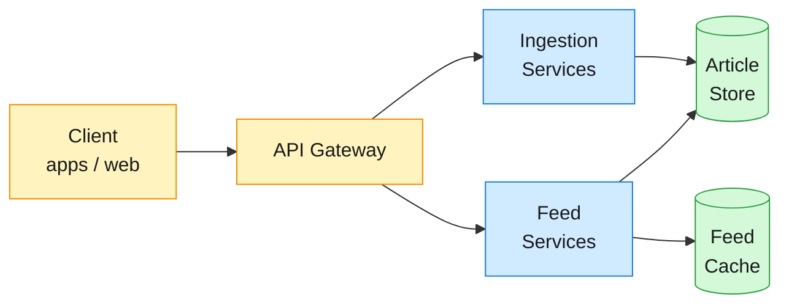
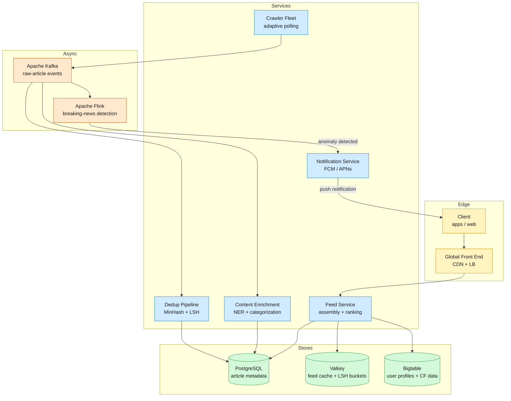

Google News aggregates articles from 50,000+ publishers worldwide, groups coverage of the same event into story clusters, and serves a ranked, personalized feed to over 150 million monthly users across 70+ regional editions in 30+ languages.

<!--more-->

## 1. Problem

Google News aggregates articles from 50,000+ publishers worldwide, groups coverage of the same event into story clusters, and serves a ranked, personalized feed to over 150 million monthly users across 70+ regional editions in 30+ languages. The defining technical challenges are near-duplicate detection at ingest scale (5M articles/day, 60–80% of which are retellings of the same event), sub-200ms feed serving under 17K req/s read load, and a ranking function that decays content aggressively enough that a 24-hour-old article is essentially gone while still surfacing authoritative coverage that emerges hours after the initial report.



## 2. Requirements

**Functional**

- FR1: Ingest articles from thousands of publishers.
- FR2: Browse a global feed of articles sorted by freshness and relevance.
- FR3: Detect near-duplicate articles and group them into story clusters.
- FR4: Browse articles by category and region.
- FR5: View article snippets, then read the full article on the publisher's site.
- FR6: Scroll the feed infinitely with stable pagination.

**Non-functional**

- NFR1: Feed p99 latency under 200ms under full read load.
- NFR2: Articles appear within 15 minutes of publication; 5 minutes for breaking news.
- NFR3: 99.99% availability — stale content is better than no content.
- NFR4: Crawler respects robots.txt, per-domain rate limits, and publisher crawl budgets.

*Out of scope: search indexing, publisher payment/ad-revenue splitting, offline reading, user commenting.*

## 3. Back of the envelope

- **Ingestion rate:** 5M articles/day ÷ 86.4K s ≈ 58 articles/s → the write rate is modest; the dedup pipeline (pairwise comparisons) is the throughput bottleneck, not the crawler.
- **Feed read load:** 150M MAU × 10 visits/day ÷ 86.4K s ≈ 17K req/s peak → heavily read-dominant; the bottleneck is serving 17K req/s with sub-200ms latency from a relational store.
- **Metadata storage:** 5M articles × 2 KB × 30-day retention ≈ 300 GB → metadata is small; storage size is not the constraint.

## 4. Entities

```
Article {
  article_id:    uuid  PK
  canonical_url: string  CK        ← unique per article, used for exact-dedup
  source_id:     uuid   FK
  title:         string
  snippet:       string
  published_at:  timestamp
  category:      enum             ← world, business, tech, sports, entertainment, science, health
  cluster_id:    uuid?  FK
  minhash_sig:   integer[]        ← 128 × 32-bit, 512 B; shard-local for dedup lookups
  ranking_score: float
  entities:      string[]         ← extracted named entities (people, orgs, locations)
}

Source {
  source_id:       uuid  PK
  domain:          string CK
  name:            string
  topic_authority: jsonb?           ← per-topic authority weights from topic-authority system
  crawl_interval:  smallint         ← seconds between polls
  last_crawled_at: timestamp
}

Cluster {
  cluster_id:     uuid  PK
  representative: uuid  FK        ← article_id of the highest-authority member
  size:           integer
  topics:         string[]
  created_at:     timestamp       ← TTL 48h after last member added
}

User {
  user_id:            uuid  PK
  interest_weights:   jsonb        ← per-category weight vector
  click_history:      uuid[]       ← recent article_ids, capped at 500
  minhash_clusters:   integer[]    ← cluster assignments for CF model
  region:             string
}
```

### API

- `GET /feed?category=tech&region=us&cursor=...` — browse the global or category feed, 20 articles per page
- `GET /feed/personalized?cursor=...` — personalized feed for authenticated users
- `GET /articles/{id}` — article metadata, snippet, source info, and cluster context
- `GET /clusters/{id}` — full-coverage view: all articles in a story cluster
- `GET /sources/{id}` — source profile and topic authority breakdown
- `PUT /users/me/interests` — update category interest weights for personalization

## 5. High-Level Design



#### FR1: Ingest articles from thousands of publishers

- **Components:** Publisher RSS/sitemaps → Crawler Fleet → Kafka → Dedup Pipeline → Article Store.
- **Flow:**
  1. Crawler polls 50,000+ sources on an adaptive schedule: major outlets every 5 minutes, medium outlets every 15 minutes, niche blogs every 2–6 hours.
  1. Each poll sends a conditional GET with `If-Modified-Since` / `ETag` — a `304 Not Modified` response skips the fetch, saving 60–80% of crawl bandwidth.
  1. On new content, the crawler fetches the full article HTML, extracts title, body text, and canonical URL, and publishes a `raw-article` event to Kafka.
  1. Publishers using WebSub or IndexNow push a ping on new publication; the scheduler bumps the source to the front of the crawl queue for near-instant ingestion.
- **Design consideration:** the adaptive polling cadence is inferred from historical publishing frequency, not declared by the publisher. A source averaging 4+ articles per day over 6 months gets a 5-minute interval; a weekly blog stays at 6 hours. This self-tuning keeps crawl load proportional to news output without operator intervention. A publisher that suddenly increases output (e.g., during a crisis) sees its interval halved within 2–3 poll cycles.

#### FR2: Browse a global feed of articles sorted by freshness and relevance

- **Components:** Client → GFE → Feed Service → Valkey Cache → PostgreSQL.
- **Flow:**
  1. Client requests `GET /feed?category=tech&region=us&cursor=...` — the request hits the nearest GFE PoP.
  1. GFE checks its edge cache. On hit (popular categories cached at 2–5 min TTL), the feed is served from the edge in 5–20ms.
  1. On edge miss, the request reaches the Feed Service, which looks up `feed:global:tech:us` in Valkey — a sorted set of `(ranking_score, article_id)` pairs.
  1. Valkey hit: the service fetches article metadata from PostgreSQL in a single batch query by `article_id IN (...)`, assembles the response, and returns it.
  1. Valkey miss: the service queries PostgreSQL directly with `ORDER BY ranking_score DESC LIMIT 20`, populates the cache, and returns.
- **Design consideration:** cursor-based pagination uses a compound key `(ranking_score, published_at, article_id)` to avoid the offset problem. Each page returns the next 20 articles where `(ranking_score, published_at, article_id) < (last_score, last_published, last_id)`. Between page requests, new articles may enter the top of the feed — the cursor guarantees no duplicates or gaps because it pins to a snapshot of the article order at request time.

#### FR3: Detect near-duplicate articles and group them into story clusters

- **Components:** Kafka → Dedup Pipeline (MinHash + LSH) → Cluster Store.
- **Flow:**
  1. When a `raw-article` event arrives on Kafka, the dedup worker strips HTML, normalizes text, and extracts 5-character shingles from the article body.
  1. The worker computes a 128-element MinHash signature (512 bytes) and writes it to the article metadata row.
  1. LSH banding: the signature is split into 32 bands of 4 values each. Each band is hashed into a bucket in Valkey (`lsh:band:{band_id}:{band_hash}`). Articles sharing any bucket are near-duplicate candidates.
  1. For each candidate pair, exact Jaccard similarity is computed. Pairs with J ≥ 0.4 are assigned to the same cluster; articles with no match create a new cluster.
  1. The article with the highest source authority score becomes the cluster representative — it appears as the primary article in the feed, with the cluster size and "also covered by N sources" label.
- **Design consideration:** storing the 512-byte MinHash signature per article is the key trade-off. It costs 512 bytes × 5M articles = 2.5 GB/day in the hot database, but it drops the dedup problem from O(N²) pairwise comparisons to O(N) LSH bucket lookups. The LSH bucket TTL in Valkey is 48 hours — after that, an article is too old to be a meaningful duplicate of new arrivals, so the bucket entries expire and free memory.

#### FR4: Browse articles by category and region

- **Components:** Kafka → Content Enrichment Pipeline → Feed Service → Valkey Cache.
- **Flow:**
  1. After dedup, the article flows through the enrichment stage: fastText category classification (World, Business, Technology, Sports, Entertainment, Science, Health), NER entity extraction, language detection, and geographic tagging.
  1. Enriched metadata is written to the article row (category, entities, region tags).
  1. The feed cache is populated per `(category, region)` key: `feed:global:tech:us`, `feed:global:sports:uk`, etc. Each key is a Valkey sorted set of `(ranking_score, article_id)` for that slice.
  1. Regional filtering is applied at feed assembly time: the Feed Service intersects the category feed with articles whose `entities` or geographic tags match the requested region.
- **Design consideration:** category feeds are pre-computed globally (one sorted set per category × region, ~70 categories × 70 regions ≈ 4,900 keys) rather than computed per-request. At 17K req/s, querying PostgreSQL for each request's category slice would overwhelm the database. Pre-computed sorted sets in Valkey deliver O(log N) retrieval and keep the database on the write path only.

#### FR5: View article snippets, then read the full article on the publisher's site

- **Components:** Client → GFE → Feed Service → Article Store.
- **Flow:**
  1. User taps an article card. The client calls `GET /articles/{id}`.
  1. The Feed Service fetches the article row from PostgreSQL (metadata, snippet, source info, cluster context) and returns it.
  1. The response includes the `canonical_url`, `source.name`, `published_at`, a 2–3 sentence snippet, and the cluster ID for "full coverage" linking.
  1. The client renders the snippet with a prominent "Read full article" button linking to the publisher's canonical URL.
- **Design consideration:** the system never stores full article text — only a short snippet. This is both a legal constraint (copyright law in many jurisdictions prohibits re-hosting full articles) and a storage optimization. The full text is used transiently during ingestion for dedup signature computation and entity extraction, then discarded. The article metadata row is ~2 KB, keeping total storage at a manageable 300 GB for 30 days of content.

#### FR6: Scroll the feed infinitely with stable pagination

- **Components:** Client → Feed Service → Valkey → PostgreSQL.
- **Flow:**
  1. The initial `GET /feed?category=tech` returns the first 20 articles plus a `next_cursor` token: a base64-encoded `(ranking_score, published_at, article_id)` tuple of the last article in the page.
  1. The client requests `GET /feed?category=tech&cursor=<next_cursor>` when the user scrolls near the bottom.
  1. The Feed Service decodes the cursor and queries: `WHERE (ranking_score, published_at, article_id) < ($score, $time, $id) ORDER BY ranking_score DESC, published_at DESC, article_id DESC LIMIT 20`.
  1. The response returns the next page plus a new cursor. When the cursor is empty (`null`), the client stops requesting.
- **Design consideration:** the compound cursor `(score, time, id)` handles the case where multiple articles share the same ranking score. Using `(published_at DESC, id DESC)` alone would miss articles with identical timestamps; the id tiebreaker ensures deterministic ordering. Between page requests, new high-scoring articles may arrive — these appear at the top of the feed but don't shift the cursor's position because the cursor pins to a specific point in the ordered set.

## 6. Deep dives

### DD1: Near-duplicate detection and story clustering

**Problem.** 5M articles arrive daily, and 60–80% of them are retellings of the same event — 500 outlets covering "election results" with different headlines, different angles, and different text structures. Detecting these duplicates requires comparing each new article against all recent articles. At 5M/day, pairwise comparison is 25 trillion operations — infeasible. Exact URL or title matching catches only ~10% of duplicates. The system needs O(N) detection that works across paraphrased, re-structured, and translated articles, with storage proportional to articles, not articles².

**Approach 1: Exact URL and title dedup**

Hash every article's canonical URL and normalized title into a lookup table. If a new article's URL or title matches an existing entry, flag it as a duplicate and assign it to that article's cluster.

```sql
SELECT cluster_id FROM article_dedup
WHERE canonical_url_hash = $url_hash OR title_hash = $title_hash;
```

**Challenges:** recall is ~10%. Two articles about the same event nearly always have different URLs (different publishers) and different headlines ("Stocks plunge on trade fears" vs "Dow drops 800 points amid tariff concerns"). The remaining 90% of duplicates go undetected. The feed shows 10 nearly identical stories as separate entries — the core value proposition of story clustering is lost.

**Approach 2: SimHash fingerprinting**

Compute a 64-bit SimHash fingerprint from the article body using a weighted hash over term frequencies. Two articles are near-duplicates if their SimHash signatures differ by at most 3 bits (Hamming distance ≤ 3). To find matches in O(1): split the 64-bit fingerprint into 4 blocks of 16 bits. For each incoming fingerprint, query 4 hash tables (one per block) — any article sharing a block with the new fingerprint is a candidate. Verify with full Hamming distance.

```javascript
fingerprint = weighted_simhash(article_body, term_weights)
blocks = [fingerprint[0:16], fingerprint[16:32], fingerprint[32:48], fingerprint[48:64]]
candidates = union(hash_table[b][block] for b, block in enumerate(blocks))
near_dups = [c for c in candidates if hamming(fingerprint, c.fingerprint) <= 3]
```

**Challenges:** SimHash works well for structurally similar documents — it was validated on 8 billion web pages where duplicate pages share the same boilerplate, navigation, and text structure. News articles about the same event can have radically different structures: a 150-word breaking-news bulletin, a 2,000-word analysis piece, and a 500-word local-angle rewrite all cover the same event with different vocabulary and structure. SimHash misses these structurally dissimilar articles. It also requires the full article body, consuming 10–50 KB per article in the hot comparison path.

**Approach 3: MinHash + LSH**

Four-step pipeline:

**a) Shingling.** Tokenize article text into overlapping 5-character n-grams. A 500-word article yields roughly 5,000 shingles. The shingle set is the feature representation — two articles with similar shingle sets have similar content regardless of overall structure.

**b) MinHash signature.** Apply k=128 independent hash functions to the shingle set. For each hash function, record the minimum hash value produced. The 128 minimum values form the MinHash signature (512 bytes per article). The key property: the probability that two signatures agree on position i equals the Jaccard similarity of their shingle sets: P(sig_a[i] = sig_b[i]) = J(A, B).

```javascript
signature = [inf] * 128
for shingle in article_shingles:
    for i in range(128):
        h = universal_hash(i, shingle)
        signature[i] = min(signature[i], h)
```

**c) LSH banding.** Split the 128-element signature into b=32 bands of r=4 values each. Hash each band into a Valkey bucket: `lsh:band:{band_id}:{band_hash}` → set of article IDs. Two articles sharing at least one band are candidate near-duplicates. The band parameters b=32, r=4 tune the probability curve: articles with Jaccard ≥ 0.4 have a high probability of sharing a band; articles with Jaccard < 0.2 almost never do.

**d) Cluster assignment.** For each candidate pair, compute exact Jaccard similarity on their original shingle sets. Pairs with J ≥ 0.4 are assigned to the same cluster. The LSH filter reduces candidates from 5M to ~20 per article — the exact Jaccard step is cheap at that scale.

```javascript
// LSH candidate lookup in Valkey
for band in range(32):
    band_hash = murmur3(signature[band*4 : band*4+4])
    candidates += SMEMBERS(f"lsh:band:{band}:{band_hash}")

// Exact Jaccard on candidates (typically 5-20)
for candidate in candidates:
    j = jaccard(shingles, candidate.shingles)
    if j >= 0.4:
        assign_to_cluster(candidate.cluster_id)
```

**Decision:** MinHash + LSH wins. It delivers ~90% precision and ~85% recall on near-duplicate news articles at roughly 2ms per article and constant 512 bytes of storage per article in the comparison path. The 15% recall gap (articles that cover the same event but use completely different vocabulary) is an acceptable trade-off — those articles are caught by the downstream entity-overlap cross-linking that runs per language edition.

**Rationale:** the dominating constraint is CPU, not storage. Pairwise comparison at 5M/day would need 25 trillion operations; MinHash compresses each article to 512 bytes and LSH reduces candidates to ~20 per article. The storage model is also favorable: 512 bytes × 5M articles × 30 days = 77 GB for the hot signature store, which fits in a single Valkey instance. BERT embeddings would deliver ~95% recall but require GPU inference per article at roughly $200K/month — the 5% improvement does not justify the cost when the ranking stage scores all cluster members anyway.

**Edge cases:**

- **Cross-language duplicates:** a story published in Japanese and English has different shingle sets and different MinHash signatures. Clustering runs per language edition; cross-language linking uses named-entity overlap (e.g., "earthquake" + "Tokyo" matching across editions).
- **Wire copy verbatim reprints:** AP/Reuters articles published identically by hundreds of outlets have Jaccard > 0.95. They cluster correctly. The representative selector prefers the original wire source over re-publishers.
- **False positives on generic announcements:** "Company X reports quarterly earnings" published by 50 outlets with near-identical financial data. These cluster correctly — they are the same story. The ranking stage handles the signal-to-noise ratio via per-source authority scoring.

### DD2: Low-latency feed serving

**Problem.** The feed is read 17,000 times per second at peak. Each request must return 20 ranked articles with metadata (title, snippet, source, cluster context) under 200ms p99. Generating a feed from scratch per request would query PostgreSQL 17K times per second — a saturated database. The ranking function spans 5M recent articles, so a full sort per request is non-viable. The system must deliver ranking-aware feeds with database-scale read throughput at cache-scale latency.

**Approach 1: On-demand assembly from PostgreSQL**

Each feed request queries PostgreSQL with the full ranking sort:

```sql
SELECT a.*, s.name as source_name
FROM articles a JOIN sources s ON a.source_id = s.source_id
WHERE a.category = $category AND a.published_at > NOW() - INTERVAL '48 hours'
ORDER BY a.ranking_score DESC
LIMIT 20;
```

**Challenges:** at 17K req/s, even indexed, this query saturates a relational database. A single PostgreSQL instance handles roughly 5–10K read queries per second for this workload. Adding read replicas helps but shifts the bottleneck to the ranking computation — `ORDER BY ranking_score` over 300K+ rows per category is not a cheap sort even with a covering index. p99 latency degrades to 500ms+ under load.

**Approach 2: Pre-computed sorted sets**

Pre-compute a Valkey sorted set per `(category, region, language)` key. A batch job re-ranks all articles every 2 minutes and updates the sorted sets:

```javascript
ZADD feed:global:tech:us $score $article_id  (repeated for top 200 per slice)
```

On each feed request, the Feed Service issues `ZREVRANGE feed:global:tech:us 0 19 WITHSCORES` — an O(log N + M) operation returning the top 20 article IDs. It then bulk-fetches metadata from PostgreSQL in a single `SELECT … WHERE article_id IN (...)`.

**Challenges:** a 2-minute recomputation cycle introduces staleness. Between recomputations, new articles are invisible and ranking score adjustments (engagement feedback, breaking-news boosts) don't take effect. During a breaking event, articles published at minute 1 don't appear until minute 3 — violating the 5-minute freshness target for breaking news. The 2-minute sweep also has a write amplification problem: 4,900 sorted-set keys × 200 entries × 2 minutes = 8M writes per interval, or 67K writes/s sustained.

**Approach 3: Pre-computed feeds with CDC-driven incremental updates**

Instead of full recomputation every 2 minutes, the sorted sets are updated incrementally via change-data-capture:

1. **CDC stream.** Debezium reads the PostgreSQL write-ahead log. Every article `INSERT` or `UPDATE` (when ranking_score changes, or when an article is assigned to a cluster) produces a change event on Kafka.
1. **Cache worker.** A consumer reads the CDC stream and updates only the affected Valkey sorted sets: `ZADD feed:global:{category}:{region} {ranking_score} {article_id}` for new articles, `ZREM` for expired or retracted articles.
1. **Ranking refresh.** A lightweight batch job re-computes `ranking_score` for the top 2,000 articles per slice every 5 minutes (engagement signals, cluster-size updates). Changed scores flow through the same CDC path.
1. **Cursor pagination over Valkey.** The cursor token encodes `(score, published_at, article_id)`. The Feed Service uses `ZREVRANGEBYSCORE` instead of simple `ZREVRANGE` to implement cursor-based traversal through the sorted set.

```javascript
ZREVRANGEBYSCORE feed:global:tech:us ($cursor_score LIMIT 21
```

The 21st result becomes the `next_cursor`. When no cursor is provided, the top 20 are returned.

**Decision:** pre-computed feeds with CDC-driven incremental updates. The CDC stream keeps cache latency under 2 seconds from article publication to feed appearance — well within the 15-minute target. The 5-minute ranking refresh handles engagement signal updates without the write amplification of full 2-minute sweeps. Valkey sorted sets deliver the O(log N + M) read performance needed for 17K req/s.

**Rationale:** the core insight is that news feed writes are predictable — one article insertion produces one or two Valkey `ZADD` operations (one for the global slice, optionally one for the category slice). CDC translates the database's write rate of 58 articles/s into roughly 100 Valkey writes/s, which a single Valkey instance handles with ease. The read path then stays a simple sorted-set range query that completes in under 1ms. This decoupling means feed serving scales independently of the ranking pipeline — the Feed Service never touches the ranking computation, and the ranking pipeline never blocks feed reads.

**Edge cases:**

- **CDC lag spike.** Debezium falls behind the WAL during a publisher surge. The cache is briefly stale but the feed never errors — the Feed Service falls back to a direct PostgreSQL query when the sorted set for a slice is empty or the most recent article in the cache is over 10 minutes old.
- **Cold-start for a new category.** A newly created category has no sorted set. The first request triggers the fallback path: a PostgreSQL query populating the cache. Subsequent requests within the same 5-minute window hit Valkey.
- **Article deletion/retraction.** A publisher pulls an article. The `DELETE` CDC event triggers `ZREM` on all sorted sets containing that article. The retracted article disappears from all feeds within 2 seconds.

### DD3: Multi-signal ranking

**Problem.** News ranking is fundamentally different from general content ranking. A 2-year-old "how to file taxes" article remains useful; a 2-day-old "earthquake hits Tokyo" article is obsolete. The ranking function must decay content age aggressively — a 24-hour-old article should contribute essentially nothing from freshness alone. But authoritative coverage often takes hours to publish (investigations, analysis, fact-checked reporting), so freshness cannot be the only signal. The function must balance five competing forces: recency, source quality, story importance, original reporting, and user engagement — without letting any single force dominate.

**Approach 1: Reverse chronological feed**

Articles are sorted by `published_at DESC`. No ranking computation, no scoring pipeline.

**Challenges:** a feed sorted purely by time buries major investigative journalism under a flood of routine updates. During a breaking event, hundreds of low-authority sources publish first; authoritative reporting that takes 2–4 hours to produce is pushed below the fold. The feed becomes a firehose, not a curated news experience.

**Approach 2: Engagement-weighted ranking**

Score articles by CTR and dwell time, with a time-decay factor. Popularity alone determines feed position.

```javascript
score = ctr * exp(-lambda * age_hours)
```

**Challenges:** engagement ranking amplifies clickbait. A sensationalized celebrity headline outranks measured economic analysis every time. It also creates a rich-get-richer feedback loop — top-ranked articles get more clicks, which increases their score, which keeps them at the top. Breaking news with no click history yet is invisible. Diversity of coverage collapses.

**Approach 3: Multi-signal scoring with tuned half-life**

The ranking score is a weighted sum of five signals, applied per article:

```javascript
score = 0.30 * freshness + 0.25 * authority + 0.20 * cluster_bonus
      + 0.15 * original_reporting + 0.10 * engagement
```

**Freshness.** Exponential decay with a 6-hour half-life:

```javascript
freshness = exp(-0.693 * age_hours / 6.0)
```

At publication: 1.0. After 6 hours: 0.5. After 24 hours: 0.062 — essentially dropped from freshness alone. The 6-hour half-life matches the median time between a story breaking and authoritative analysis appearing, so the "freshness window" covers both the initial report and the high-quality follow-up.

**Authority.** Per-topic source reputation, not a global score. A source can be authoritative for local sports but not for international politics. The topic authority system scores per `(source_id, topic, region)` tuple, updated weekly from cross-source citation patterns: how often other publishers cite this source's coverage of a topic.

```sql
SELECT authority_score FROM source_topic_authority
WHERE source_id = $sid AND topic = $topic AND region = $region;
```

**Cluster bonus.** Logarithmic boost for story importance — when many sources cover the same event, it's more important. Source count signals story significance:

```javascript
cluster_bonus = min(1.0, log(cluster_size + 1) / log(50))
```

A story covered by 1 source gets 0.0; 5 sources → 0.46; 50 sources → 1.0.

**Original reporting.** Articles that break a story first or contribute unique information get a boost. Computed from cross-source citation analysis: which article in a cluster was published first with the most unique named entities not appearing in other cluster members? Articles cited by subsequent coverage from high-authority sources score higher.

**Engagement.** CTR and recency-weighted click velocity, computed from a ClickHouse analytics pipeline in 15-minute batches. The engagement weight is intentionally low (0.10) — it tunes ranking, not drives it. This prevents the clickbait feedback loop.

**Decision:** the multi-signal formula with the 6-hour half-life. It is not a cascade of alternatives but a deliberately weighted ensemble where each signal addresses a blind spot of the others: freshness handles recency, authority handles quality, cluster size handles importance, original reporting handles novelty, and engagement provides a light relevance nudge.

**Rationale:** the 6-hour half-life is the single most consequential parameter. A 2-hour half-life would bias too heavily toward breaking news and miss developing stories (investigations, feature reporting). A 24-hour half-life would keep old content too visible. The 6-hour value means a 12-hour-old article loses 75% of its freshness weight — it must win on authority, cluster size, or original reporting to stay visible. This naturally creates the "front page" dynamic: breaking news dominates the first few hours, then authoritative coverage takes over, then the story fades as new events arrive.

**Edge cases:**

- **Election night: hundreds of sources publish simultaneously.** All articles have identical freshness (age ≈ 0). Authority and original reporting decide the order. The AP feed (highest wire-service authority) wins the top position; a local newspaper with unique exit-poll data gets the original-reporting boost.
- **Story with no new developments for 12 hours.** Cluster size stops growing, freshness decays, engagement saturates. The score drops to near-zero and the story falls off the front page. Correct behavior — it's no longer "news."
- **High-authority source publishes late.** A major investigation published 10 hours after the initial story has freshness ≈ 0.31 but authority ≈ 1.0 and original-reporting ≈ 1.0. Combined score: 0.30 × 0.31 + 0.25 × 1.0 + 0.15 × 1.0 = 0.49, competitive with a fresh low-authority article (0.30 × 1.0 + 0.25 × 0.2 = 0.35). The investigation surfaces even though it's hours old.

### DD4: Breaking news detection

**Problem.** When a major event occurs, the system must detect it within seconds — not wait for engagement signals or the 5-minute ranking batch. But false positives (a celebrity rumor amplified by 10 low-authority sources for 5 minutes then dropped) waste notification budget and erode user trust. The detection function must balance speed, sensitivity, and precision without hardcoding which topics matter.

**Approach 1: Fixed threshold**

If any `(topic, region)` pair sees more than N articles in a 5-minute window, flag it as breaking news. A fixed N=20 triggers on both a genuine earthquake and a routine sports game with routine pre-game coverage.

**Challenges:** a single threshold cannot distinguish between "this is abnormally high for this topic" and "this is normal volume for this topic." During an election night, "election" sees 500+ articles every 5 minutes — still newsworthy, but the threshold fires once and the signal saturates. A 5-amplifier burst about a minor celebrity fires the same trigger. Fixed thresholds produce both false negatives (saturating topics get missed after the first window) and false positives (low-baseline topics flag on normal variation).

**Approach 2: Rolling average anomaly detection**

Flink consumes the enriched-article stream and maintains a rolling 24-hour average per `(topic, region, language)` key. Every 5-minute tumbling window, the current window's article count is compared against the rolling average:

```javascript
if current_count > 5 * rolling_average AND current_count > 10:
    flag as breaking
```

The 5x multiplier catches anomalies — a topic that normally sees 3 articles per 5 minutes suddenly seeing 15 is breaking; a topic that normally sees 80 articles per 5 minutes (sports game) needs 400 to trigger, which it won't during routine coverage. The minimum threshold (count > 10) prevents zero-baseline topics from triggering on a single article.

```sql
SELECT topic, region,
       COUNT(*) as current_count,
       AVG(COUNT(*)) OVER (RANGE BETWEEN INTERVAL '24' HOUR PRECEDING
                           AND CURRENT ROW) as rolling_avg
FROM article_stream
GROUP BY topic, region, TUMBLE(event_time, INTERVAL '5' MINUTES)
HAVING COUNT(*) > 5 * AVG(COUNT(*)) OVER (RANGE BETWEEN INTERVAL '24' HOUR PRECEDING AND CURRENT ROW)
   AND COUNT(*) > 10
```

**State management.** Flink stores the rolling average in RocksDB-backed keyed state per `(topic, region)`, so state survives worker restarts with exactly-once semantics. The state is small — roughly 10,000 topic × region keys × 100 bytes each ≈ 1 MB.

**Decision:** rolling average anomaly detection on Flink. The 5x multiplier is the production-tuned sweet spot where the signal-to-noise ratio is high enough to justify the fast-path injection (put article at feed position 0) without degrading feed quality from false positives.

**Rationale:** the key insight is that "breaking" is inherently a relative concept — it means "abnormally many articles about this topic," where "abnormal" depends on the topic's baseline. A Monday morning political scandal producing 50 articles in 5 minutes is breaking (baseline: 3). A Wednesday afternoon sports game producing 80 articles in 5 minutes is not (baseline: 75). The rolling average captures the baseline per `(topic, day-of-week, hour)` implicitly — no hardcoded topic importance weights, no editorial override. The 5x multiplier is validated by the shape of news volume distributions: genuine breaking events produce 5–50x spikes; routine variation stays within 2–3x.

**Edge cases:**

- **Sustained events with high baselines.** During a war, "Ukraine" sees 200 articles per hour for months, so the rolling average is high and the 5x multiplier is never reached. The system handles this via an absolute fallback: if `current_count > 500` (an absolute high-water mark), flag regardless of the multiplier — a sustained event at this volume is news even if it's "normal" for the current cycle.
- **Breaking event cooldown.** After a breaking event is detected for a `(topic, region)` pair, the system suppresses re-detection for 2 hours. This prevents a single event from generating a notification every 5 minutes as new articles continue to arrive.
- **Cross-region propagation.** A breaking event in Japan (Japanese-language cluster) that is globally relevant propagates to the English edition if entity overlap between the Japanese cluster and any recent English-language cluster exceeds a threshold. The system identifies key entities ("earthquake," "Tokyo") and checks for matching English-language coverage.

## 7. References

1. Das, A., Datar, M., Garg, A., & Rajaram, S. (2007). ["Google News Personalization: Scalable Online Collaborative Filtering"](https://dl.acm.org/doi/10.1145/1242572.1242610). Proceedings of WWW 2007.
1. Manku, G.S., Jain, A., & Das Sarma, A. (2007). ["Detecting Near-Duplicates for Web Crawling"](https://static.googleusercontent.com/media/research.google.com/en/us/pubs/archive/33026.pdf). Proceedings of WWW 2007.
1. Upstill, T. (2018). ["Building Google News for everyone — a retrospective"](https://blog.google/products-and-platforms/products/news/building-google-news-everyone-retrospective/). Google Blog.
1. Google Search Central. (2023). ["Understanding news topic authority"](https://developers.google.cn/search/blog/2023/05/understanding-news-topic-authority). Google Search Blog.
1. Google. (2023). ["How Google supports the news industry"](https://blog.google/supportingnews/). Google Blog.
1. Google. (2019). ["Elevating original reporting in Search"](https://blog.google/products-and-platforms/products/search/original-reporting/). Google Blog.
1. Google. (2010). ["Our new search index: Caffeine"](https://developers.google.cn/search/blog/2010/06/our-new-search-index-caffeine). Google Search Blog.
1. Feedly Engineering. (2023). ["Optimizing News Aggregation: Clustering & Deduplication"](https://feedly.com/engineering/posts/reducing-clustering-latency). Feedly Engineering Blog.
1. Peng, D., & Dabek, F. (2010). ["Large-scale Incremental Processing Using Distributed Transactions and Notifications"](https://static.googleusercontent.com/media/research.google.com/en/us/pubs/archive/36726.pdf). Proceedings of OSDI 2010.
1. Google. (2022). ["United States Patent US9361369B1: Method and apparatus for clustering news online content"](https://patents.google.com/patent/US9361369B1/en). U.S. Patent Office.
1. Google. (2022). ["Get the full news story with Full Coverage in Search"](https://blog.google/products-and-platforms/products/news/get-full-news-story-full-coverage-search/). Google Blog.
