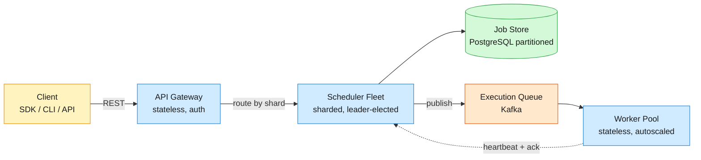
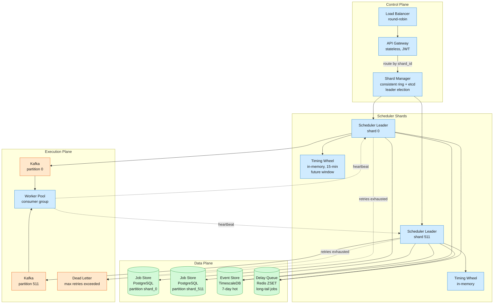
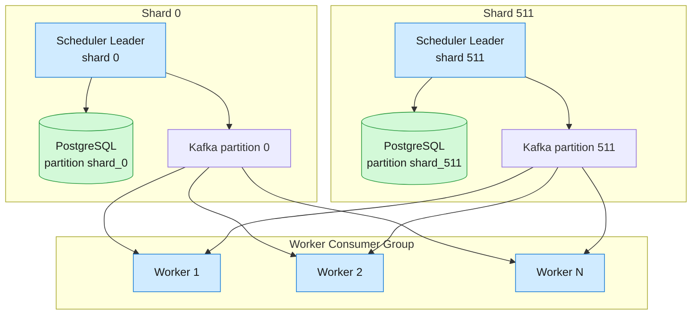
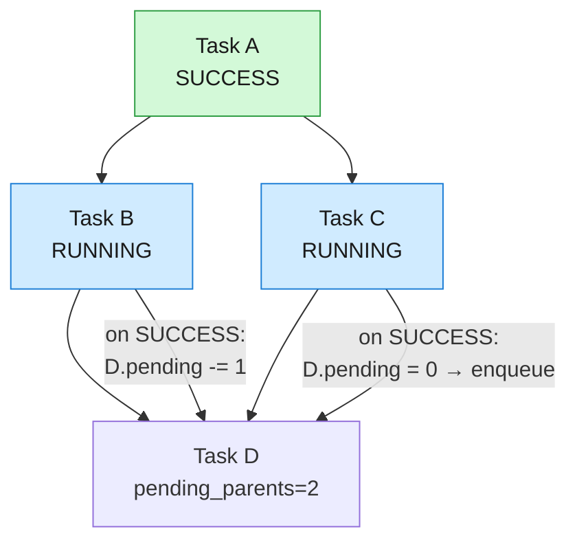

A distributed job scheduler that accepts work definitions and fans execution across a fleet of workers — on demand, at a future wall-clock time, or on a recurring cron schedule — with at-least-once guarantees, DAG workflow support, and horizontal scale to 10,000 jobs/sec.

## 1. Problem

A distributed job scheduler accepts work definitions from users and fans their execution across a fleet of workers — on demand, at a future wall-clock time, or on a recurring cron schedule. It tracks dependencies between tasks so a DAG workflow advances only when all upstream steps succeed, and guarantees each job runs at least once through machine crashes, network partitions, and scheduler failovers. This is infrastructure that powers ETL pipelines at Shopify (10K+ DAGs, 150K Airflow runs/day), async compute at Pinterest (billions of Pacer tasks), and workflow automation at Uber (12B+ Cadence executions). The system targets 10,000 jobs/sec peak throughput with sub-2-second scheduling precision and no single-process SPOF.



## 2. Requirements

**Functional**

- FR1: Schedule jobs — execute immediately, at a future UTC timestamp, or on recurring cron expression.

- FR2: Define DAG workflows — tasks declare upstream parent dependencies resolved before downstream execution.

- FR3: Execute reliably — at-least-once delivery with configurable retries and exponential backoff.

- FR4: Monitor status — query job state, workflow progress, and per-execution event history.

- FR5: Cancel jobs — cancel pending jobs; signal running workers to abort in-flight execution.

- FR6: Retrieve execution history — append-only log of every state transition with timestamps and worker IDs.

*Out of scope: multi-tenant quota enforcement, resource-aware bin-packing, visual DAG editor.*

**Non-functional**

- NFR1: 10,000 jobs/sec peak throughput — horizontal scaling beyond a single machine.

- NFR2: ≤2s scheduling precision — job fires within 2 seconds of its scheduled wall-clock time.

- NFR3: 99.9% availability — no single scheduler process is a SPOF; leader failover under 10 seconds.

- NFR4: Durability — zero accepted jobs lost on crash; all jobs either execute or land in a dead-letter queue.

## 3. Back of the envelope

- 10K jobs/sec × 86,400 sec/day = **864M jobs/day**. Each job record ~500 bytes (UUID, timestamps, status, params JSONB) → 432 GB raw daily. With 30-day retention, the `job` table hits ~13 TB. With PostgreSQL native partitioning by shard and BRIN indexes on timestamps, sequential scans of old partitions are cheap. Execution events (2 KB each) are heavier at 1.7 TB/day — store in a separate time-series store with 7-day hot window, archive cold.
- 10K jobs/sec across 512 shards = **~20 jobs/sec per shard**. A scheduler leader processes one job (timing-wheel tick + status update + Kafka publish) in ~5ms. 20 jobs/sec × 5ms = 100ms CPU/sec = **10% utilization**. A single shard leader saturates at ~200 jobs/sec → 512 shards give 50× headroom. Decision: **fixed 512-shard partitioning** (Temporal's model), over-provision for burst headroom since scheduler leaders are lightweight processes, not heavy DB instances.
- ≤2s scheduling precision means the scheduling hot path can't wait on a DB poll. A `FOR UPDATE SKIP LOCKED` scan at 500ms intervals gives 250ms average precision but P99 spikes under DB load. Decision: **in-memory timing wheel** for the near-future window (next 15 min) with O(1) tick cost; fall back to DB polling for jobs farther out.
## 4. Entities & API

```
task {
  task_id:        uuid PK
  name:           string
  schedule_type:  enum      ← IMMEDIATE | SCHEDULED | RECURRING
  cron_expr:      string    ← NULL unless RECURRING; parsed once at create
  max_retries:    integer   ← default 3
  timeout_sec:    integer   ← default 3600
  backoff_base_ms:integer   ← default 1000; first retry delay; exponential multiplier
  created_at:     timestamp
}

job {
  job_id:         uuid PK
  task_id:        uuid FK     ← → task
  shard_id:       integer     ← hash(job_id) % 512; partition key
  status:         enum        ← PENDING | CLAIMED | RUNNING | SUCCESS | FAILED | CANCELLED
  scheduled_at:   timestamp
  started_at:     timestamp
  completed_at:   timestamp
  params:         jsonb
  idempotency_key:uuid UNIQUE ← client-gen; dedup across duplicate submissions
  retry_count:    integer     ← default 0
  next_retry_at:  timestamp   ← computed from backoff_base × 2^retry_count
  fence_token:    bigint      ← default 0; monotonic; storage rejects lower-token writes
  catch_up:       boolean     ← default true; for recurring: fire for missed intervals?
  worker_id:      string      ← which worker claimed this job
}

workflow {
  workflow_id:uuid PK
  name:       string
  status:     enum      ← PENDING | RUNNING | SUCCESS | FAILED
  created_at: timestamp
}

workflow_edge {
  workflow_id:    uuid FK ← → workflow
  child_task_id:  uuid FK ← → task
  parent_task_id: uuid FK ← → task
  pending_parents:integer ← default 0; denormalized; enqueue child when reaches 0
  PRIMARY KEY (workflow_id, child_task_id, parent_task_id)
}

execution_event {
  event_id:   bigint PK
  job_id:     uuid FK   ← → job
  event_type: enum      ← ENQUEUED | CLAIMED | STARTED | HEARTBEAT | COMPLETED | FAILED | RETRYING | CANCELLED
  occurred_at:timestamp
  worker_id:  string
  payload:    jsonb     ← error trace, heartbeat progress, retry reason
}
```

**API**

- `POST /tasks` — Create a task definition, returns `task_id`.
- `POST /jobs` — Schedule a job with `schedule_type`, `scheduled_at` or `cron_expr`, `params`, `idempotency_key`. Returns `job_id`.
- `GET /jobs/{job_id}` — Get job status, timestamps, retry count, worker ID, last error.
- `GET /jobs/{job_id}/history?cursor={event_id}&limit=50` — Paginated execution event timeline, newest first.
- `POST /jobs/{job_id}/cancel` — Cancel a PENDING job or signal the RUNNING worker to abort.
- `POST /workflows` — Define a DAG of tasks with parent edges, returns `workflow_id`.
- `GET /workflows/{workflow_id}` — Get workflow status and per-task status across all DAG nodes.
## 5. High-Level Design



The **Shard Manager** holds a fixed 512-shard ring. Each shard elects one scheduler leader via an etcd lease (30s TTL, renewed at 10s). The shard count matches Temporal's proven default — 512 shards provides headroom from startup scale through Uber-sized workloads (12B+ executions). Leader failure causes a ≤10s election gap; jobs scheduled during the gap fire under the catch-up policy on the new leader's restart.

Each **Scheduler Leader** owns one PostgreSQL table partition and runs three concurrent loops: (a) a timing-wheel tick firing due jobs at O(1), (b) a Redis ZSET poll for jobs >15 min out, and (c) a retry scanner re-enqueuing FAILED jobs whose `next_retry_at` has elapsed. The scheduler publishes due jobs to a Kafka partition matching its shard — one partition per shard keeps ordering and lets worker consumer groups scale independently.

**Workers** pull batches from Kafka, invoke the external target (HTTP callback, gRPC, or PubSub publish), heartbeat to the scheduler every 15s during long executions, and write terminal status back to the job store with a fencing token for stale-write protection.

#### FR1: Schedule jobs — immediate, future, recurring

**Components:** API Gateway → Shard Manager → Scheduler Leader → Job Store + Timing Wheel + Redis ZSET.

**Flow:**

1. Client `POST /jobs` with `schedule_type` and `idempotency_key`. Gateway hashes `job_id % 512` to determine the shard and routes to the owning scheduler leader.
1. Scheduler inserts into `job` table with `status = PENDING`. The `UNIQUE(idempotency_key)` constraint catches duplicate submissions — `ON CONFLICT DO NOTHING RETURNING job_id, status` returns the existing job and its current state.
1. `IMMEDIATE`: scheduler publishes directly to the Kafka execution queue.
1. `SCHEDULED` with `scheduled_at ≤ now + 15 min`: insert into in-memory timing wheel. The timing wheel is a 3-level hierarchical structure (60 seconds wheels × 60 minutes wheels × 24 hours wheels). Jobs land in the seconds wheel if they fire within 60s, minute wheel otherwise. When a minute hand advances, jobs cascade into the seconds wheel. Tick fires all jobs in the current second slot.
1. `SCHEDULED` with `scheduled_at > now + 15 min`: `ZADD delayed_queue {scheduled_at} {job_id}` in Redis. A background poller runs `ZRANGEBYSCORE delayed_queue -inf NOW LIMIT 500` every 1s and feeds arriving jobs into the timing wheel as they enter the 15-minute window.
1. `RECURRING`: parse cron expression once at task creation, compute `next_fire_at`. Each execution writes a new `job` row as a concrete instance (not reusing the template row). After completion, the scheduler computes the next `scheduled_at` from the cron expression and inserts the next instance. If `catch_up = true`, missed intervals during scheduler downtime fire sequentially up to a configurable cap (default: 10).

**Design consideration:** Cron parsing happens once at task creation, not at every fire. The parsed representation (a set of time fields) is stored alongside the cron string for efficient `next_fire_at` computation. DST transitions use the same approach as Airflow and Sidekiq: spring-forward gaps skip the interval (no 2:30 AM fire in a "every hour" cron), fall-back duplicates fire at the first occurrence only. BullMQ's timestamp baking trick — `timestamp = timestamp × 0x1000 + (jobId & 0xfff)` — packs 12 bits of job ID into the ZSET score, guaranteeing FIFO order for up to 4096 jobs at the same timestamp without extra sorting. We adopt the same for the Redis ZSET layer.

#### FR2: Define DAG workflows — dependencies and fan-out

**Components:** API Gateway → Scheduler Leader → Job Store (`workflow_edge` with `pending_parents` counter).

**Flow:**

1. Client `POST /workflows` with a list of task IDs and parent edges. Scheduler writes workflow metadata and populates `workflow_edge` rows, initializing `pending_parents` to the count of upstream parents per child.
1. When the workflow starts, all tasks with `pending_parents = 0` (root nodes) are enqueued.
1. On any task reaching `SUCCESS`, the scheduler runs an atomic decrement:

```sql
UPDATE workflow_edge
SET pending_parents = pending_parents - 1
WHERE workflow_id = $wf_id
  AND parent_task_id = $completed_task_id;

SELECT child_task_id
FROM workflow_edge
WHERE workflow_id = $wf_id
  AND parent_task_id = $completed_task_id
  AND pending_parents = 0;
```

1. Each child whose counter reached zero is enqueued as a new job, inheriting the workflow context.
1. If any task exhausts retries, the workflow transitions to `FAILED`. Downstream PENDING tasks are cancelled. Tasks already RUNNING are allowed to finish but their children remain blocked.

**Design consideration:** The `pending_parents` counter is Airflow's internal DAG resolution model and the standard optimization: O(1) work per completion event instead of O(E) per scheduler tick. Postgres row-level locking on `UPDATE` serializes concurrent parent completions — if task B and C (both parents of D) finish simultaneously, their `UPDATE` statements execute serially. The second decrement (from 1 → 0) triggers the `SELECT` and enqueues D exactly once. Diamonds and complex fan-in patterns resolve without additional coordination.

#### FR3: Execute reliably — at-least-once delivery, retries, backoff

**Components:** Scheduler Leader → Kafka → Worker Pool → Job Store (status updates + heartbeat + fencing token).

**Flow:**

1. Scheduler publishes `{job_id, task_id, params, fence_token}` to the Kafka partition matching the job's shard.
1. Worker consumer group pulls batches. Worker claims a job by updating `status = RUNNING, fence_token = fence_token + 1` with a CAS on the current token.
1. Worker invokes the external target via HTTP POST (or gRPC, PubSub publish) with `timeout = task.timeout_sec`. The `X-Idempotency-Key` header carries the job's `idempotency_key` for target-side dedup.
1. **Success:** worker writes `status = SUCCESS, fence_token = next`; Kafka offset commits. Scheduler checks if this triggers downstream DAG children.
1. **Failure:** worker writes `status = FAILED` with error payload. Scheduler computes `next_retry_at = now + min(backoff_base_ms × 2^retry_count, max_backoff)`. If `retry_count < max_retries`, job re-enters the timing wheel. Otherwise, job routes to the dead-letter queue.
1. **Worker crash:** workers heartbeat every 15s. If 3 consecutive heartbeats are missed (45s window), the scheduler increments `fence_token`, resets `status = PENDING`, and re-enqueues. The stale worker's next write fails the fencing token check (token lower than last committed → rejected).

**Design consideration:** The heartbeat-leased claim pattern (Temporal's model) catches the core failure mode — a worker crashes mid-execution. Without heartbeats, a long-running job is invisible until its timeout expires. With a 45s detection window, the scheduler reassigns within 45s of a crash. The fence token (monotonic BIGINT, wraps at 9×10^18) prevents the stale worker — recovering from a GC pause — from overwriting the replacement worker's progress. At 100K increments/sec, overflow is ~3 billion years away.

#### FR4: Monitor status — job state and workflow progress

**Components:** API Gateway → Job Store (read replicas).

**Flow:**

1. `GET /jobs/{job_id}`: single-row PK lookup. Returns `status`, timestamps, `retry_count`, `worker_id`, and last error payload. Served from read replicas — no scheduler involvement.
1. `GET /jobs/{job_id}/history`: cursor-paginated on `execution_event` table: `WHERE job_id = $id ORDER BY event_id DESC LIMIT 50`. Events carry `event_type`, `occurred_at`, `worker_id`, and `payload` (error stack or heartbeat progress).
1. `GET /workflows/{workflow_id}`: fetches workflow metadata + aggregating query: `SELECT job_id, task_id, status FROM job WHERE task_id IN (SELECT child_task_id FROM workflow_edge WHERE workflow_id = $wf_id)`. Results grouped per task — shows green/red/amber per DAG node.

**Design consideration:** Status reads bypass the scheduler entirely. The read path hits PostgreSQL read replicas while the write path (schedulers) hits the primary — clean read/write split. The event store is a separate time-series database (TimescaleDB) optimized for append-heavy, time-range scans. Event consistency lags behind status reads: a job may show `RUNNING` in the main table while the `STARTED` event is still flushing (≤2s lag). This is documented in the API contract: status is authoritative; events are eventually consistent.

#### FR5: Cancel jobs

**Components:** API Gateway → Shard Manager → Scheduler Leader → Timing Wheel + Worker control channel.

**Flow:**

1. `POST /jobs/{job_id}/cancel`. Gateway hashes `job_id` to determine shard, routes to owning scheduler.
1. `status = PENDING`: scheduler removes job from timing wheel or Redis ZSET, sets `status = CANCELLED`, writes event. Immediate.
1. `status = RUNNING`: scheduler publishes a cancel signal to the worker's control channel (per-worker Redis pub/sub keyed by `worker_id`). Worker checks this channel between heartbeat intervals. On receiving cancel, sends SIGTERM to the job subprocess, marks `status = CANCELLED`. If worker doesn't acknowledge within 30s, scheduler forces `status = CANCELLED` on the next missed-heartbeat cycle.

**Design consideration:** Cancellation is best-effort for RUNNING jobs — the cancel signal tells our worker to stop, but if the external target already received the HTTP request and is mid-computation, that is outside our control. This matches Airflow's "mark as failed" for in-flight tasks and Temporal's cancel-requested state. The 30s ack timeout bounds the worst case.

#### FR6: Retrieve execution history — event log

**Components:** Event Store (TimescaleDB) → API Gateway.

**Flow:**

1. Every state transition writes a row to `execution_event` via the scheduler's event bus. The scheduler buffers events in an in-memory ring buffer and flushes in batches of 100 or every 200ms.
1. `GET /jobs/{job_id}/history?cursor={event_id}&limit=50` with cursor-based pagination, newest first.
1. Retention: 7 days hot in TimescaleDB (automatic partition drop via `drop_chunks`), 90 days warm in compressed S3 (queryable via Athena/Trino), permanent cold archive (S3 Glacier, not queryable via API).

**Design consideration:** The event store is decoupled from the job table to avoid bloating the OLTP working set. Each retried execution produces 4+ events (ENQUEUED, STARTED, FAILED, RETRYING); mixing that into the job table's primary store would inflate the working set and slow the scheduling hot path. TimescaleDB's chunk-based partitioning with TTL keeps hot storage bounded regardless of total event volume.

## 6. Deep dives

### DD1: Scheduling precision — firing within 2s of scheduled time

**Problem.** A job scheduled for T must fire by T+2s, even at 10K jobs/sec peak. The forces conflict: precision demands a fast, constant-cost operation per tick; durability demands that job state survive crashes. An in-memory data structure is fast but volatile; a database is durable but slow under concurrent load. Resolving this requires layering — a fast cache in front of a durable store.

**Approach 1: Database-only polling**

Poll `SELECT ... WHERE scheduled_at <= NOW() AND status = 'PENDING' ORDER BY scheduled_at LIMIT 500 FOR UPDATE SKIP LOCKED` every 500ms. With a partial index on `(status, scheduled_at)`, this is an index-only scan.

- **Pro:** Single source of truth. Survives crashes — state is in the DB. Simple to reason about.
- **Con:** Poll interval is the precision floor — average 250ms latency, but P99 spikes when the DB is under load. At 10K jobs/sec, multiple scheduler replicas scanning the same B-tree cause buffer pool contention on the hot leaf pages. `SKIP LOCKED` avoids row-level blocking but not page-level churn. Shopify reported their Airflow scheduler DB CPU as the #1 scaling complaint at 10K DAG scale.

**Approach 2: Redis sorted set**

`ZADD delayed_queue {scheduled_at_unix_ms} {job_id}` with BullMQ-style timestamp baking for FIFO. Poll `ZRANGEBYSCORE -inf NOW LIMIT 500` every 200ms. Atomic claim via Lua `ZPOPMIN`.

- **Pro:** Sub-millisecond poll latency (single-threaded, memory-resident). 200ms poll interval → ~100ms average precision. Pinterest Pacer uses this pattern (MySQL + Redis dual storage).
- **Con:** Redis is not the source of truth — if Redis restarts, the ZSET is lost. Must replay from the DB, creating recovery lag. Lua scripts block the event loop during the pop-and-move operation; partitioning the ZSET at 10K+ items keeps `M` bounded. Google SRE Book explicitly warns against making the in-memory structure the authority.

**Approach 3: In-memory hierarchical timing wheel (HTW)**

A 3-level circular buffer: 60 second slots (1s each), 60 minute slots (60s each), 24 hour slots (3600s each). Jobs in the far future land in the hour wheel; when the minute hand advances, jobs cascade into the seconds wheel. Tick fires all jobs in the current second slot.

- **Pro:** O(1) insertion, O(1) tick, O(1) removal. The cascade (hour → minute → second) is rare and amortized. Kafka uses HTW internally for delayed produce/fetch operations: 9× faster than `java.util.Timer` with half the heap allocations. Google's internal cron leader uses an in-memory sorted list with the same constant-tick philosophy.
- **Con:** Volatile — crash loses the entire wheel. Must reload from durable store on restart. Cascade spikes if many jobs land in the same hour slot (mitigate by re-inserting into seconds wheel with randomized offsets).

**Approach 4: Hybrid — HTW for near-future + DB for long-tail**

Load jobs with `scheduled_at ≤ now + 15 min` into the HTW on scheduler startup and every 30s. Jobs beyond 15 min stay in the DB. HTW handles the hot path; DB `SKIP LOCKED` polling handles the cold path. Redis ZSET sits as an optional middle tier for >15 min jobs if DB poll latency exceeds 200ms.

**Decision:** Hybrid HTW + DB (Approach 4).

**Rationale:** Google's distributed cron (SRE Book Chapter 24) maintains an in-memory sorted job list on the Paxos leader, with synchronous consensus announcements before each fire — achieving firm ≤2s precision at datacenter scale. We adopt the same in-memory principle but back it with DB durability instead of Paxos because our 99.9% availability target does not require a consensus round per job fire. The 15-minute window covers the overwhelming majority of scheduled jobs and keeps the HTW footprint bounded (~9M entries worst-case × 200 bytes = 1.8 GB, fits in heap). The 30s reload interval means at most 30s of newly-scheduled jobs bypass the wheel and fire via DB poll (250ms precision, within SLA).

**Edge cases:**

- **Scheduler crash:** HTW lost. On restart, reload from DB. Jobs whose `scheduled_at` passed during the crash fire late under `catch_up` policy (up to 10 missed intervals).
- **Cascade spike:** 50K jobs landing in the same hour slot cause a single-tick burst. Mitigation: re-insert into the seconds wheel with randomized sub-second offsets within the minute window, spreading the work across 60 seconds.
- **Clock skew:** Only the shard leader writes claims — uses its own monotonic clock for the HTW. NTP keeps wall clocks synced within 100ms. The `scheduled_at` comparison in the DB poll uses the DB server clock, which is NTP-synced.
> [!TIP]
> **Key insight:** Precision and durability are competing goals. The timing wheel gives precision; the database gives durability. The hybrid design resolves the tension by keeping only the next 15 minutes of hot state in memory — a crash loses at most 15 minutes of "what the wheel knew," and even that is recoverable from the DB because the DB is always the source of truth. The wheel is a performance cache, not a data store.

### DD2: Horizontal scale — 10,000 jobs/sec throughput

**Problem.** A single scheduler process saturates around 2K–5K jobs/sec (scheduling logic + DB I/O). Scaling to 10K/sec requires partitioning work across multiple schedulers. But partitioning introduces coordination: who owns which shard, how do shards rebalance, and how do workers consume from multiple shards without creating cross-shard contention?

**Approach 1: Multi-scheduler replicas, shared DB**

Run N identical scheduler processes, each polling the same job table with `SKIP LOCKED`. Workers consume from a shared queue.

- **Pro:** Simplest scaling model. Airflow 2.4+ operates this way — multiple scheduler replicas, one database.
- **Con:** The DB is the bottleneck, not the schedulers. The scheduling query contends on the same B-tree hot pages; adding replicas increases concurrent index scans without increasing the DB's capacity. Shopify's 10K DAG deployment found scheduler DB CPU as the primary limit. The ceiling is the database, not the number of schedulers.

**Approach 2: Partitioned job table, per-shard leader**

Divide the job table into N fixed shards (`hash(job_id) % N`). Native PostgreSQL table partitioning by `shard_id`. One elected leader per shard runs the scheduling loop on its partition only. Kafka topic has one partition per shard — workers consume across all partitions via a consumer group.

- **Pro:** Linear horizontal scaling. Each shard is an independent domain — no cross-shard coordination on the hot path. Adding shards increases aggregate throughput proportionally. Each leader operates on a smaller working set, improving Postgres buffer pool locality and HTW footprint. Temporal uses 512 fixed history shards for this exact reason.
- **Con:** Fixed shard count at creation time — Temporal's `numHistoryShards` is immutable. Under-provisioning caps peak throughput. Cross-shard DAG workflows require a coordinator to fan out job creation across shards (rare: most DAGs are submitted together and hash naturally to one shard).

**Approach 3: Consistent-hash ring with dynamic resizing**

Replace `hash % N` with a consistent-hash ring. Adding shards remaps only ~1/N of jobs. Migration window dual-writes to old and new shards.

- **Pro:** Online resizing. Add shards as throughput grows without cluster restart.
- **Con:** Ring management adds operational complexity. Dual-write migrations need careful fencing to avoid duplication. In practice, most deployments size for peak — Temporal's fixed 512 shards has worked from startup through 12B+ executions at Uber without resizing.

**Decision:** Fixed-shard partitioning at cluster creation with `hash(job_id) % 512`. Start at 512 (over-provisioned at launch, headroom for 100K+ jobs/sec peak). Workers consume from Kafka partitions 1:1 mapped to shards.

**Rationale:** Temporal's 512-shard design is proven at Uber scale: 270B+ actions/month, 1000+ services. A scheduler leader is lightweight (~200 MB RAM, single-digit % CPU at 20 jobs/sec) — over-provisioning 512 shards costs ~100 GB RAM cluster-wide, roughly 2–3 Kubernetes nodes. This is cheap insurance against the operational pain of resharding live. If resizing is ever needed, a blue-green migration (deploy new cluster with 1024 shards, dual-write, drain old cluster) is simpler than maintaining a consistent-hash ring in production.

**Throughput per shard:** 10K jobs/sec ÷ 512 shards = ~20 jobs/sec/shard. At 5ms per job, scheduling CPU is 10% utilized. The bottleneck shifts from scheduling to the execution queue and workers — which scale horizontally without coordination.



**Edge cases:**

- **Hot shard:** A tenant or job type hashing to a single shard saturates its leader. UUIDs (`job_id`) are uniformly distributed, so this is statistically unlikely. For known hot keys, a `shard_hint` parameter on `POST /jobs` overrides hash assignment and spreads load manually.
- **Leader election gap:** On leader failure, the shard is unowned for ≤10s (etcd lease TTL). Jobs scheduled during the gap fire late under the catch-up policy. This is the 99.9% availability tradeoff — we accept ≤10s per-shard gap rather than paying synchronous replication per job fire.
- **Kafka rebalance:** Worker join/leave triggers consumer group rebalance (5–10s). During rebalance, Kafka buffers messages — no job loss. Scheduler publish is asynchronous.
> [!TIP]
> **Key insight:** The scheduler is not the bottleneck; the database is. Sharding the database via table partitioning and assigning one scheduler leader per partition eliminates the coordination problem without introducing distributed consensus on the job hot path. The only coordination is leader election per shard — at human timescales (seconds), not job timescales (milliseconds).

### DD3: At-least-once execution — layered defense through the stack

**Problem.** "At-least-once" means the system retries on failure, but the failure modes are subtle and varied: a client retries a submission, a worker crashes mid-execution, a stale worker overwrites a replacement's progress, the external target processes our request but our ack is lost. Each failure mode requires its own defense, and no single mechanism catches them all.

**Approach 1: Idempotency key on submission**

The `UNIQUE(idempotency_key)` constraint on the `job` table catches client-side retries. If a client submits the same job twice (network timeout → retry), the second `INSERT` hits the constraint and returns the existing `job_id` and current status. No duplicate job enters the system.

```sql
INSERT INTO job (job_id, idempotency_key, task_id, ...)
VALUES ($job_id, $key, $task_id, ...)
ON CONFLICT (idempotency_key) DO NOTHING
RETURNING job_id, status;
```

- **Edge case:** The retry arrives while the original is still `PENDING`. The handler returns the in-flight job. The client polls `GET /jobs/{job_id}` until a terminal status.

**Approach 2: Fencing token + CAS claim**

Every job carries a `fence_token` (monotonic BIGINT). Workers claim jobs by incrementing it atomically:

```sql
UPDATE job
SET status = 'RUNNING',
    fence_token = fence_token + 1,
    worker_id = $worker_id
WHERE job_id = $job_id
  AND fence_token = $expected_token
RETURNING fence_token;
```

If the returned token does not match the expected token + 1, the claim fails — another worker got there first. Every subsequent status write includes the token. The storage layer (or application-level check) rejects writes with a token lower than the last committed value.

- **Normal path:** Scheduler publishes with `fence_token = 5`. Worker A claims → token 6. Worker A writes `SUCCESS` with token 6 → accepted.
- **Stale worker path:** Worker A GC-pauses for 60s. Scheduler declares it dead, increments token to 7, re-enqueues. Worker B claims → token 8. Worker A recovers, tries to write token 6 → rejected. The stale write is fenced.

**Approach 3: Heartbeat-based liveness**

Workers emit a heartbeat every 15s for long-running jobs (`timeout_sec > 60`). Scheduler tracks `last_heartbeat_at`. After 3 missed intervals (45s), the scheduler increments `fence_token`, resets `status = PENDING`, and re-enqueues. The stale worker's next write fails the fence-token check. This is Temporal's lease-renewal model: the worker holds a soft lease; the scheduler revokes it on missed heartbeats.

**Approach 4: Target-side idempotency**

Even if our system perfectly avoids internal duplicates, the external target can receive the same job twice if: worker succeeds → target processes request → HTTP response is lost → worker retries → target sees the same payload again. Pass the `idempotency_key` as `X-Idempotency-Key` header. The target is responsible for deduplication (Stripe's pattern: store key → response, replay on retry). This is documented as an API contract: "Targets requiring exactly-once side effects MUST implement idempotency key dedup."

**Decision:** Layered defense: `UNIQUE` constraint → heartbeat TTL → fencing token → `X-Idempotency-Key` header. This is the same stack used by Temporal (lease + sequence numbers), Stripe (idempotency keys), and Kafka (producer ID + epoch + sequence number).

**Rationale:** No distributed system can guarantee exactly-once delivery (Two Generals Problem — the sender cannot distinguish "target processed the request but ack was lost" from "target never received the request"). The correct target is "at-least-once delivery + idempotent processing = effectively-once" (CrackingWalnuts' formulation). Each layer catches a specific failure mode:

| Layer | Failure mode caught | Misses |
| --- | --- | --- |
| `UNIQUE(idempotency_key)` | Client retries (network timeout) | Worker crash after claim |
| Heartbeat TTL (45s) | Worker crash mid-execution | Stale worker GC pause |
| Fencing token CAS | Stale worker overwrite | External target duplicate delivery |
| `X-Idempotency-Key` header | Duplicate external side effects | (target must implement dedup) |

**Edge cases:**

- **Heartbeat partition:** Worker can reach target but not scheduler. After 45s, scheduler re-enqueues. Original worker eventually succeeds but its status write is fenced. Re-enqueued job runs again → target gets duplicate. This is the fundamental limit of at-least-once: network partitions between worker and scheduler cause duplication. The target's idempotency key dedup is the backstop.
- **Idempotency key expiry:** Keys retained for 30 days (configurable). After expiry, a duplicate submission with the same key creates a new job — acceptable because the original reached a terminal state long ago.
- **Fencing token overflow:** `BIGINT` max = 9×10^18. At 100K increments/sec, overflow in ~3 billion years. Not a practical concern.
> [!TIP]
> **Key insight:** At-least-once is not one mechanism — it's a stack of defenses each catching a different failure mode, and the stack is intentionally incomplete. The last mile (external side effects) can only be made idempotent by the target. This is why Stripe's API requires idempotency keys and why Temporal's activities must be idempotent. The scheduler guarantees delivery; the target guarantees safe re-processing.

### DD4: DAG dependency resolution — fan-in and fan-out at scale

**Problem.** When task C depends on A and B completing first, the scheduler must fire C exactly once after both finish — without scanning the entire DAG on every tick. The challenge is not graph traversal (that's easy), but concurrency: two parents finishing within microseconds must both decrement a shared counter without double-firing the child or missing the trigger. At scale (thousands of tasks per workflow), polling the full DAG is O(E) per tick — 10K DAGs × 100 edges = 1M checks per scheduling cycle.

**Approach 1: Polling scheduler walks every edge**

Every tick, scan all workflows, check every upstream task's status. Fire children whose parents are all `SUCCESS`.

- **Pro:** Zero additional state beyond task status. Simple to implement.
- **Con:** O(W × E) work per tick — 1M queries/sec just for dependency resolution at Shopify scale. This dominates scheduling CPU before any jobs are actually dispatched.

**Approach 2: Denormalized ****`pending_parents`**** counter, atomic decrement**

Store `pending_parents = count(upstream_parents)` per edge. On task completion, atomically decrement all its outgoing edges. Children reaching zero fire.

- **Pro:** O(1) per completion event. Only the finishing task's immediate children are touched. Airflow's internal DAG resolution uses this exact model. Netfix Conductor's Decider state machine uses the same pattern (denormalized pending-parent counters in the workflow state).
- **Con:** The atomic decrement must serialize concurrent parent completions. PostgreSQL row-level locking on `UPDATE` handles this naturally — two concurrent parent completions targeting the same child execute serially, the second sees the counter at 1 → 0 and triggers the enqueue.

**Approach 3: Event-sourced state machine (Temporal/Cadence model)**

Instead of counters, emit a `TASK_COMPLETED` event. A workflow orchestrator (deterministic state machine) subscribes to these events per workflow instance. On each event, the orchestrator replays the workflow code, determines which tasks are now unblocked, and fires them.

- **Pro:** No polling, no counters. The workflow is entirely event-driven. Handles dynamic fan-out naturally — the workflow code can spawn new tasks at runtime, not just at DAG definition time. Temporal's workflow-as-code uses this model.
- **Con:** Requires a durable state machine runtime per workflow instance. Workers must be deterministic. Replay must be exact. This is the right model for long-running business workflows (days to months at Uber) but overkill for a second-scale job scheduler where most DAGs complete in minutes.

**Decision:** Denormalized `pending_parents` counter with atomic decrement (Approach 2). Dynamic fan-out handled by allowing executing tasks to insert new `workflow_edge` rows at runtime, registering spawned children with `pending_parents = 1`.

**Rationale:** Airflow processes 150K DAG runs/day at Shopify and 800K task instances/day at Uber using this exact counter model. The counter serializes through Postgres row locks — no distributed coordination needed. Temporal's event-sourced model is more general (handles arbitrary workflow code with branching and loops) but introduces deterministic replay and event-sourcing complexity that adds operational burden without benefit for DAGs that complete in seconds or minutes. The counter model handles ~95% of production DAG patterns (ETL pipelines, cron-driven workflows, ML training pipelines).



**Edge cases:**

- **Parent fails (retries exhausted):** Workflow transitions to `FAILED`. All downstream PENDING tasks are cancelled. Already-RUNNING tasks finish but their children remain blocked. The workflow status is `FAILED` even if some branches succeeded — partial failure.
- **Diamond dependency:** A → B → D and A → C → D. When A completes, B and C fire. When B completes, D goes 2→1. When C completes, D goes 1→0 and fires. The counter handles diamonds without special casing.
- **Cross-shard DAG:** Tasks within a workflow may hash to different shards. The workflow coordinator (the shard owning the workflow metadata) fans out job creation to each task's owning shard. Completion events route back via an internal event bus. In practice, tasks submitted together hash to the same shard, so cross-shard DAGs are rare.
- **Dynamic fan-out:** A running task calls `POST /jobs` with `workflow_id` and `parent_task_id`. The scheduler inserts a new `workflow_edge` with `pending_parents = 1`. The child fires when the spawning task completes and triggers the decrement.
> [!TIP]
> **Key insight:** DAG resolution is not a graph algorithm problem — it's a concurrency problem. The challenge is not "find tasks with no remaining dependencies" (trivial counter check), but "decrement a counter atomically when two parents finish within microseconds and fire the child exactly once." PostgreSQL's row-level locking on `UPDATE` solves this without distributed locks, without consensus, and without polling.

## 7. Trade-offs

| Decision | Chosen | Rejected | Why |
| --- | --- | --- | --- |
| Scheduling precision | In-memory HTW (15-min window) + DB `SKIP LOCKED` | DB-only polling, Redis ZSET-only | HTW gives O(1) tick; DB is the durable source of truth. Redis alone risks data loss on restart. Pure DB polling P99 spikes under load. |
| Horizontal scale | Fixed 512 shards, per-shard leader | Shared DB with multi-scheduler, consistent-hash ring | Temporal's model proven at 12B+ executions. Consistent-hash resizing adds complexity rarely needed — 512 shards gives 50× headroom at 10K/sec. |
| Execution guarantees | 4-layer defense: idempotency key → heartbeat TTL → fencing token → target dedup | Single retry mechanism, 2PC | Each layer catches a different failure mode. 2PC blocks on partitions and doubles latency. |
| DAG resolution | `pending_parents` counter, atomic decrement | Polling every tick, event-sourced state machine | O(1) per completion vs O(E) per tick. Event sourcing (Temporal) overkill for second-scale DAGs. |
| Message queue | Kafka (persistent, partitioned) | Redis LIST, RabbitMQ | Kafka partitions map 1:1 to shards. Redis lists are ephemeral. RabbitMQ clustering adds operational cost without throughput benefit. |
| Event store | Separate TimescaleDB, 7-day hot window | Same PostgreSQL as job store | Decouples append-heavy event writes from OLTP scheduling queries. Prevents event data from bloating the job table's buffer pool. |
| Worker model | Consumer group pulling from Kafka | Push dispatch (scheduler → workers) | Pull lets workers scale independently and apply backpressure. Push requires scheduler to track per-worker capacity. |
| Cron handling | Parse once, compute `next_fire_at` at create + after each completion | Re-parse cron string on every execution | Parsing is cheap but computing `next_fire_at` from parsed fields is deterministic and fast. Storing the parsed representation avoids CronExpression library overhead on the hot path. |

## 8. References

1. [Google SRE Book — Distributed Periodic Scheduling with Paxos](https://sre.google/sre-book/distributed-periodic-scheduling/)
1. [Temporal Architecture — History Shards and Matching Service](https://temporalio-temporal.mintlify.app/architecture/overview)
1. [Cadence Architecture — Sharded History Service (Uber Engineering)](https://cadenceworkflow.io/docs/concepts/topology/)
1. [Apache Airflow — Scheduler Internals (AIP-15, DAG Serialization)](https://airflow.apache.org/docs/apache-airflow/stable/administration-and-deployment/scheduler.html)
1. [Shopify — Running Airflow at Scale (10K DAGs, 150K Runs/Day)](https://shopify.engineering/lessons-learned-apache-airflow-scale)
1. [Hashed and Hierarchical Timing Wheels — Varghese & Lauck, SOSP '87](https://www.cs.columbia.edu/~nahum/w6998/papers/sosp87-timing-wheels.pdf)
1. [CrackingWalnuts — Effectively-Once Execution, Fencing Tokens, DAG Resolution](https://crackingwalnuts.com/post/job-scheduler-system-design)
1. [BullMQ Architecture — Redis Sorted Sets, Timestamp Baking, Lua Scripts](https://taskforcesh-bullmq.mintlify.app/architecture)
1. [Fencing Tokens and Lease-Based Claims — Martin Kleppmann / DDIA](https://martin.kleppmann.com/2016/02/08/how-to-do-distributed-locking.html)
1. [Stripe — Idempotency Key Design Pattern](https://stripe.com/docs/api/idempotent_requests)
1. [Kafka — Exactly-Once Semantics (Idempotent Producer, Transactions)](https://www.confluent.io/blog/exactly-once-semantics-are-possible-heres-how-apache-kafka-does-it/)
1. [Temporal Scaling Guide — Shards, Task Queues, Matching Service](https://temporalio-temporal.mintlify.app/operations/scaling)
