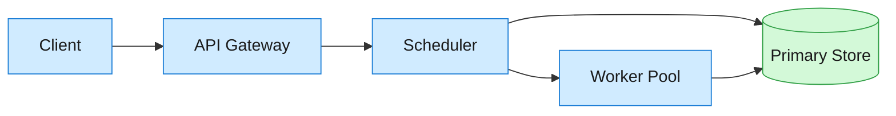
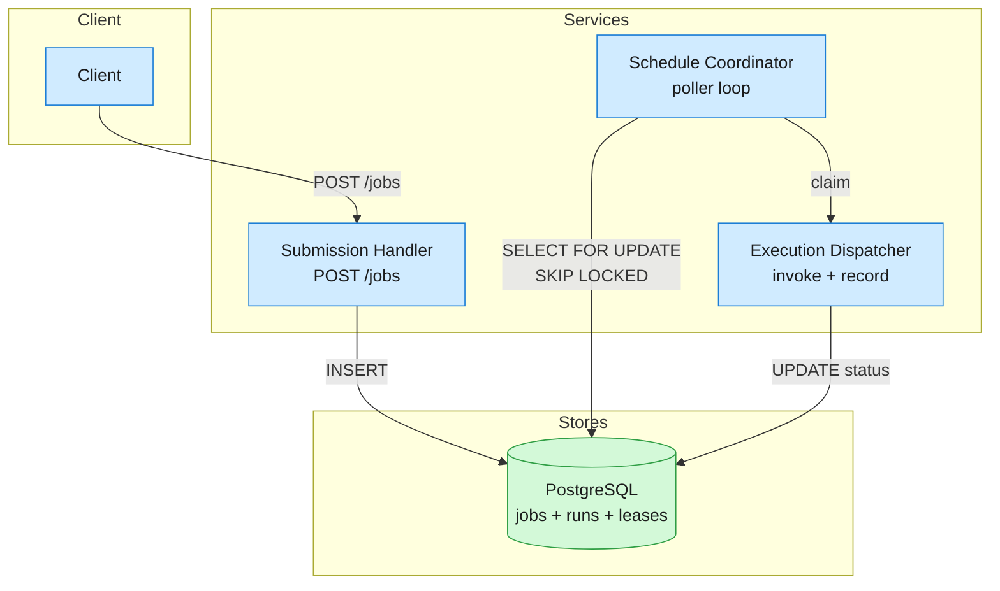

A job scheduler accepts one-shot and scheduled job submissions, executes them at the specified time, retries on failure, and surfaces execution history. Users submit, cancel, and monitor jobs through an API with no infrastructure management.

<!--more-->

## 1. Problem

A job scheduler accepts one-shot and scheduled job submissions, executes them at the specified time, retries on failure, and surfaces execution history. Users submit, cancel, and monitor jobs through an API with no infrastructure management. The system must handle ~10K jobs/s sustained with sub-2s scheduling precision and 30-day history retention — 864M jobs/day generating ~13 TB of state.



## 2. Requirements

**Functional**

- FR1: Schedule a job to run at a specified time.
- FR2: Cancel a scheduled job before execution.
- FR3: Execute jobs reliably; retry on failure.
- FR4: List jobs filtered by status and time range.
- FR5: Retrieve execution history for any job.

**Non-functional**

- NFR1: 99.9% availability with PostgreSQL HA.
- NFR2: Submission latency under 200 ms p99.
- NFR3: Once acknowledged, a job is never lost.
- NFR4: Failed jobs retained for operator review.

*Out of scope: recurring cron schedules, workflow DAGs, multi-region disaster recovery, priority queues with preemption, sub-second precision guarantees.*

## 3. Back of the envelope

- **Daily volume:** 10K jobs/s × 86.4K s ≈ 864M jobs/day → ~13 TB over 30-day retention; storage volume is the binding constraint.
- **Per-shard throughput:** 10K/s ÷ 512 shards ≈ 20 jobs/s/shard → scheduling overhead is negligible at ~5 ms per claim query.
- **Precision:** Sub-2s scheduling target → 1s poll cycle gives ~1s average latency; DB poll tail latency drives the P99 gap.

## 4. Entities

```
Job {
  job_id:           uuid      PK
  status:           string    ← scheduled | running | completed | failed | cancelled
  run_at:           timestamp
  started_at:       timestamp?
  completed_at:     timestamp?
  payload:          jsonb
  max_retries:      integer   ← default 3
  retry_count:      integer   ← default 0
  last_error:       string?
  idempotency_key:  string    CK ← unique; client-supplied, blocks duplicate submission
  created_at:       timestamp
}

JobRun {
  run_id:           bigint    PK
  job_id:           uuid      FK → Job.job_id
  attempt:          integer
  status:           string    ← started | completed | failed
  worker_id:        string?
  started_at:       timestamp
  ended_at:         timestamp?
  error:            jsonb?
}
```

### API

- `POST /jobs` — schedule a job; returns `job_id`
- `GET /jobs/{id}` — job status and details
- `DELETE /jobs/{id}` — cancel a scheduled job
- `GET /jobs` — list jobs with status and time filters
- `GET /jobs/{id}/history` — execution event log

## 5. High-Level Design

The scheduler is a single FastAPI service with three logical components sharing one PostgreSQL database.



#### FR1: Schedule a job

- **Components:** Client → API Gateway → Submission Handler → PostgreSQL.
- **Flow:**
  1. Client sends `POST /jobs` with `{run_at, payload, idempotency_key}`.
  1. Submission Handler validates `run_at` is in the future; rejects with 422 if missing or in the past.
  1. Inserts row into `Job` table with `status = 'scheduled'`.
  1. Returns `201` with `{job_id, status: 'scheduled'}`.
- **Design consideration:** the `idempotency_key` column carries a `UNIQUE` constraint. A retried `POST` with the same key hits the constraint and returns `409`, preventing duplicate jobs. The application-level `SELECT`-before-`INSERT` provides a clear error message but the database constraint is the real guard against TOCTOU races.

```sql
INSERT INTO job (job_id, status, run_at, payload, idempotency_key, max_retries, created_at)
VALUES ($1, 'scheduled', $2, $3, $4, 3, now())
ON CONFLICT (idempotency_key) DO NOTHING
RETURNING job_id, status;
```

#### FR2: Cancel a job

- **Components:** Client → API Gateway → Submission Handler → PostgreSQL.
- **Flow:**
  1. Client sends `DELETE /jobs/{id}`.
  1. Handler reads the job row. If `status` is not `'scheduled'`, returns `409` — too late to cancel.
  1. Updates `status = 'cancelled'`, `completed_at = now()`.
  1. Returns `200`.
- **Design consideration:** cancellation is a simple status transition with no side effects — the poller skips non-`scheduled` rows. No need to dequeue from a message broker because there is no separate queue; the poller reads directly from the table.

#### FR3: Execute jobs reliably

- **Components:** Schedule Coordinator → Execution Dispatcher → PostgreSQL.
- **Flow:**
  1. Schedule Coordinator polls every 1s: `SELECT ... WHERE status = 'scheduled' AND run_at <= now() ORDER BY run_at LIMIT 50 FOR UPDATE SKIP LOCKED`.
  1. For each claimed row, the Coordinator transitions `status = 'running'` and hands off to the Execution Dispatcher.
  1. Dispatcher invokes the registered handler function for the job type.
  1. On success: sets `status = 'completed'`, writes result to `payload.result`.
  1. On failure with retries remaining: increments `retry_count`, computes backoff `run_at`, resets `status = 'scheduled'`, writes `last_error`.
  1. On failure with retries exhausted: sets `status = 'failed'`.
- **Design consideration:** the `FOR UPDATE SKIP LOCKED` query is the concurrency primitive. Multiple replicas polling the same table skip rows already locked by another replica — no external lock service, no duplicate execution. A crashed worker that claimed but never executed leaves a row stuck at `running`. A secondary reaper scans for rows with `status = 'running'` and `started_at < now() - 5 min`, resetting them to `scheduled`.

```sql
UPDATE job SET status = 'running', started_at = now()
WHERE job_id IN (
  SELECT job_id FROM job
  WHERE status = 'scheduled' AND run_at <= now()
  ORDER BY run_at
  LIMIT 50
  FOR UPDATE SKIP LOCKED
)
RETURNING *;
```

#### FR4: List jobs

- **Components:** Client → API Gateway → Submission Handler → PostgreSQL.
- **Flow:**
  1. Client sends `GET /jobs?status=scheduled&from=<ISO>&to=<ISO>&cursor=<id>`.
  1. Handler builds a filtered query on the `Job` table, ordered by `created_at DESC`.
  1. Returns paginated results with a `next_cursor` for the next page.
  1. Invalid `status` values return `422`.
- **Design consideration:** listing is a direct read on the `Job` table with no joins. An index on `(status, created_at)` covers the common filter shape. For high-throughput deployments, a read replica offloads listing queries from the write path.

#### FR5: Retrieve execution history

- **Components:** Client → API Gateway → Submission Handler → PostgreSQL.
- **Flow:**
  1. Client sends `GET /jobs/{id}/history`.
  1. Handler queries `JobRun` rows for the given `job_id`, ordered by `attempt ASC`.
  1. Returns the list: each entry has `attempt`, `status`, `started_at`, `ended_at`, `error`, `worker_id`.
- **Design consideration:** `JobRun` is an append-only log per job — one row per execution attempt. The first attempt is `attempt = 0`; each retry increments by 1. This gives operators a complete audit trail: when each attempt started, which worker ran it, what error it hit, and whether it eventually succeeded.

```sql
SELECT attempt, status, worker_id, started_at, ended_at, error
FROM job_run
WHERE job_id = $1
ORDER BY attempt;
```

## 6. Deep dives

### DD1: Job polling at scale

**Problem.** Multiple scheduler replicas poll the same table for due jobs. Without coordination, every replica picks up the same batch, wastes work on duplicate claims, and risks double-execution. The coordination primitive must be fast, PostgreSQL-native, and degrade gracefully under replica churn.

**Approach 1: Leader-elected polling**

A single leader replica does all polling and dispatches work to followers. Leader election runs through a separate coordination service — etcd, ZooKeeper, or a PostgreSQL advisory lock.

- **Pro:** Zero contention on the jobs table — only one poller.
- **Con:** Leader is a SPOF with failover latency. Leader election adds infrastructure and operational complexity. Followers are idle outside failover windows, wasting capacity.

**Approach 2:** **`FOR UPDATE SKIP LOCKED`**

Every replica runs an identical poller loop. The claim query atomically locks rows and skips those already locked by another replica:

```sql
UPDATE job SET status = 'running', started_at = now()
WHERE job_id IN (
  SELECT job_id FROM job
  WHERE status = 'scheduled' AND run_at <= now()
  ORDER BY run_at
  LIMIT 50
  FOR UPDATE SKIP LOCKED
)
RETURNING *;
```

- **Pro:** No leader election, no external coordination service. PostgreSQL-native since 9.5. Replicas self-balance — each grabs an independent batch of up to 50 rows per tick. Adding or removing replicas requires zero reconfiguration.
- **Con:** Poller overhead scales linearly with replica count — N replicas each issue one query per second. At 512 replicas, this is 512 queries/s, negligible against a 10K/s write throughput. `SKIP LOCKED` guarantees no duplicate claims but does not guarantee fairness — a fast replica may claim more rows per tick than a slow one.

**Decision:** `FOR UPDATE SKIP LOCKED` with a 50-row batch limit per tick and a 1s poll interval. The batch size caps lock-hold duration; the interval keeps poller queries at a fraction of total DB capacity.

**Rationale:** PostgreSQL row-level locking with `SKIP LOCKED` eliminates the need for a separate queue system. The job table doubles as the queue — no consistency gap between a queue and a state store, no dual-write atomicity problems. This pattern is proven at throughput well above 10K jobs/s on modern PostgreSQL instances.

**Edge cases:**

- **Empty poll:** Replicas that find no unlocked rows return an empty result set and sleep until the next tick — no wasted work beyond the query itself.
- **Replica crash mid-claim:** Rows locked by a crashed replica are released when PostgreSQL detects the connection drop. The next poll cycle picks them up.
- **Batch sizing:** Too small (1 row/tick) under-utilizes the poll cycle; too large (1000 rows/tick) holds locks too long and starves other replicas. 50 is a balanced default for sub-200ms query times.

### DD2: Idempotent submission

**Problem.** A client's `POST /jobs` succeeds on the server but the response is lost to a network timeout. The client retries, creating a second identical job — causing duplicate execution at the scheduled time.

**Approach 1: Client-supplied idempotency key with application-level check**

Before inserting, the handler queries for an existing row with the same `idempotency_key`. If found, returns the existing `job_id` as `200` instead of `201`.

- **Pro:** Simple to implement — a single `SELECT` before `INSERT`.
- **Con:** TOCTOU race. Two concurrent `POST` requests with the same key both pass the `SELECT` check, both proceed to `INSERT`, and the second one either creates a duplicate or hits the constraint — the race window is the gap between the `SELECT` and the `INSERT`.

**Approach 2: Database unique constraint as the guard**

The `idempotency_key` column carries a `UNIQUE` constraint. The handler does a `SELECT`-then-`INSERT`, but the constraint is the real defense — a concurrent duplicate insert is rejected by the database:

```sql
INSERT INTO job (job_id, status, run_at, payload, idempotency_key, max_retries, created_at)
VALUES ($1, 'scheduled', $2, $3, $4, 3, now())
ON CONFLICT (idempotency_key) DO NOTHING
RETURNING job_id, status;
```

- **Pro:** No TOCTOU race — the database enforces uniqueness atomically at commit time. `ON CONFLICT DO NOTHING` returns zero rows for a duplicate, so the handler can detect the conflict and re-query for the existing row.
- **Con:** Requires the client to generate and store a unique key per submission. A client that reuses the same key for different jobs will see its second submission silently absorbed — this is a client bug, not a scheduler defect.

**Decision:** `UNIQUE(idempotency_key)` with `ON CONFLICT DO NOTHING`. The application-level `SELECT` before `INSERT` is an optimization to return a clear `409` with the existing `job_id` in the response body; the constraint is the correctness guard.

**Rationale:** This is the same pattern used by payment APIs — the idempotency key is the client's contract with the server. The database constraint is the only primitive that closes the TOCTOU window without distributed locking.

**Edge cases:**

- **Key collision across clients:** Two clients accidentally generate the same key. The second submission is rejected and the client receives the first client's `job_id` — the key should be a UUIDv4 or a hash of `(client_id, request_id)` to make collision astronomically unlikely.
- **Idempotency key TTL:** Keys accumulate indefinitely if never pruned. A 30-day TTL matching the retention window — expired keys are irrelevant because the job itself is gone.

### DD3: Stale-worker recovery

**Problem.** A worker claims a job (sets `status = 'running'`, `started_at = now()`) but crashes before executing it. The job stays `running` forever — a zombie blocking its slot indefinitely.

**Approach 1: Heartbeat with lease expiration**

Every worker heartbeats on a `ScheduleLease` row for each claimed job. A reaper scans for leases whose `expires_at < now()` and resets the associated jobs to `scheduled`.

- **Pro:** Fine-grained — each job has its own lease. Workers can heartbeat at different intervals for different job types.
- **Con:** Requires a `ScheduleLease` table and per-job heartbeat writes, doubling the write volume on the claim path. If a worker is slow but alive, a misconfigured lease TTL can trigger false-positive resets.

**Approach 2: Timeout-based reaper**

No per-job lease. A secondary reaper scans for `status = 'running'` rows where `started_at < now() - execution_timeout` and resets them:

```sql
UPDATE job SET status = 'scheduled', retry_count = retry_count + 1, last_error = 'stale worker timeout'
WHERE status = 'running' AND started_at < now() - interval '5 minutes'
RETURNING *;
```

- **Pro:** Zero additional writes on the claim path. One reaper query per cycle covers all stale jobs. The timeout is a global constant — easy to tune.
- **Con:** Coarse granularity. A job that completed in 2 minutes but the worker crashed before writing the result waits the full 5-minute timeout before re-scheduling. A job that legitimately runs for 6 minutes gets falsely reset unless the timeout exceeds the max expected execution time.

**Decision:** Timeout-based reaper scanning every 30s with a 5-minute execution timeout. The timeout is generous enough to cover realistic job durations and short enough that a crash is detected within a few poll cycles.

**Rationale:** The simplicity of a single reaper query outweighs the precision of per-job leases for this scale. At 10K jobs/s, a lease-based approach adds 10K writes/s for heartbeats — nearly doubling the write path. The 5-minute re-scheduling delay after a crash is acceptable because (a) worker crashes are rare, and (b) jobs that miss their `run_at` by 5 minutes are re-scheduled and still execute.

**Edge cases:**

- **Long-running jobs:** A job that legitimately needs 7 minutes gets falsely reaped at the 5-minute mark. The counter: `max_execution_seconds` on the job config overrides the global timeout per-job.
- **Reaper replica coordination:** The reaper uses `FOR UPDATE SKIP LOCKED` like the poller — multiple replicas' reapers claim non-overlapping slices of stale rows.

### DD4: Exponential backoff for retries

**Problem.** A downstream service outage causes all jobs that depend on it to fail simultaneously. Retrying them all at fixed intervals reproduces the same failure at the same time — a retry storm that extends the outage.

**Approach 1: Fixed-interval retry**

On failure, re-schedule the job `run_at = now() + fixed_delay`. Every job retries at the same cadence.

- **Pro:** Simplest possible retry logic. Predictable timing.
- **Con:** A downstream outage at T+0 means every affected job retries at T+fixed_delay, fails again, retries at T+2*fixed_delay — the retry storm never dissipates. The downstream sees correlated spikes at every retry interval.

**Approach 2: Exponential backoff with jitter**

Each retry multiplies the wait by a base, capped at a maximum. A random jitter of ±10% staggers jobs so they spread across the retry window:

```python
def next_retry_at(retry_count: int, base_s: int = 2, max_s: int = 3600) -> datetime:
    delay = min(base_s ** retry_count, max_s)
    jitter = random.uniform(0.9, 1.1)
    return datetime.utcnow() + timedelta(seconds=delay * jitter)
```

- **Pro:** Retry storms dissipate naturally — after the third retry, jobs that started together are spread across an ~8s window. The jitter ensures no two jobs land on the same second. The 1-hour cap prevents unbounded growth.
- **Con:** Cumulative recovery time grows exponentially. A job that exhausts 3 retries waits ~14s total before failing permanently. A downstream recovering in 10s still sees failures from jobs retrying at 16s — wasteful but harmless.

**Decision:** Exponential backoff with base=2s, max=3600s, ±10% jitter, cap of 3 retries by default.

**Rationale:** The backoff gives transient failures time to recover. The jitter breaks correlation between jobs that failed together. The cap prevents a single stuck job from consuming poller attention for hours — after 3 retries (~14s cumulative), the job is marked `failed` and operators triage it directly.

**Edge cases:**

- **Max retries exhausted:** The job lands in `failed` state with `last_error` set. An operator can manually re-schedule it with `POST /jobs` or reset `retry_count` and `status = 'scheduled'` via a database command.
- **Clock skew during DST transitions:** `run_at` is stored as a UTC timestamp. The backoff computation uses `utcnow()`. DST transitions have no effect on retry timing.

> [!TIP]
> **Key insight:** the exponential backoff + jitter pattern is load-bearing not for correctness but for system stability. Without jitter, N jobs failing together retry together indefinitely — the downstream sees a spike at every retry interval. With jitter, the spike flattens into a continuous low-level retry rate within 2–3 cycles.

## 7. References

1. [PostgreSQL Documentation — SELECT FOR UPDATE / SKIP LOCKED](https://www.postgresql.org/docs/current/sql-select.html#SQL-FOR-UPDATE-SHARE)
1. [PostgreSQL Documentation — Advisory Locks](https://www.postgresql.org/docs/current/explicit-locking.html#ADVISORY-LOCKS)
1. [PostgreSQL Documentation — INSERT ON CONFLICT](https://www.postgresql.org/docs/current/sql-insert.html#SQL-ON-CONFLICT)
1. [Stripe API Reference — Idempotent Requests](https://stripe.com/docs/api/idempotent_requests)
1. [AWS Architecture Blog — Exponential Backoff and Jitter](https://aws.amazon.com/blogs/architecture/exponential-backoff-and-jitter/)
1. [Google SRE Book — Handling Overload](https://sre.google/sre-book/handling-overload/)
1. [PostgreSQL Documentation — MVCC and Row-Level Locking](https://www.postgresql.org/docs/current/mvcc.html)
1. [Shopify Engineering — Resilient Job Scheduling at Scale](https://shopify.engineering/building-resilient-job-scheduler)
