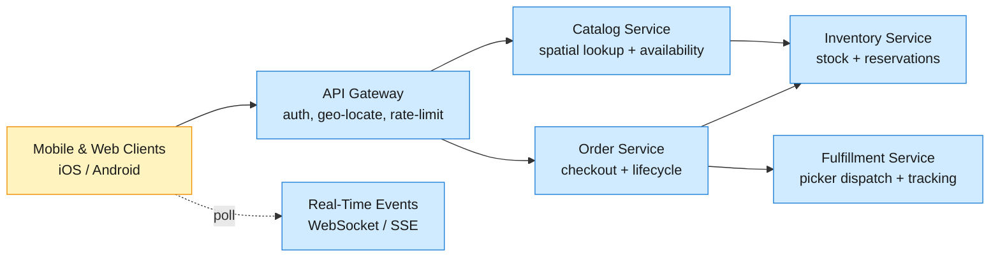
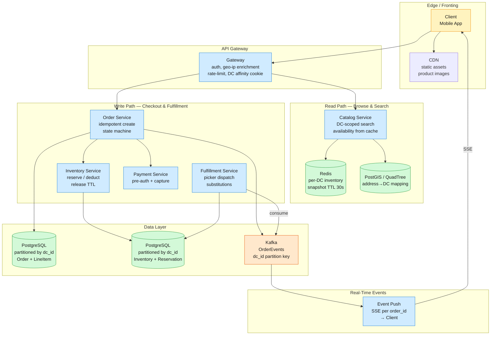
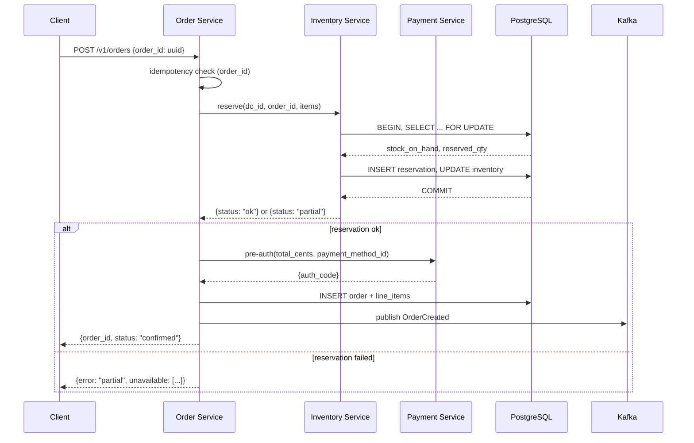
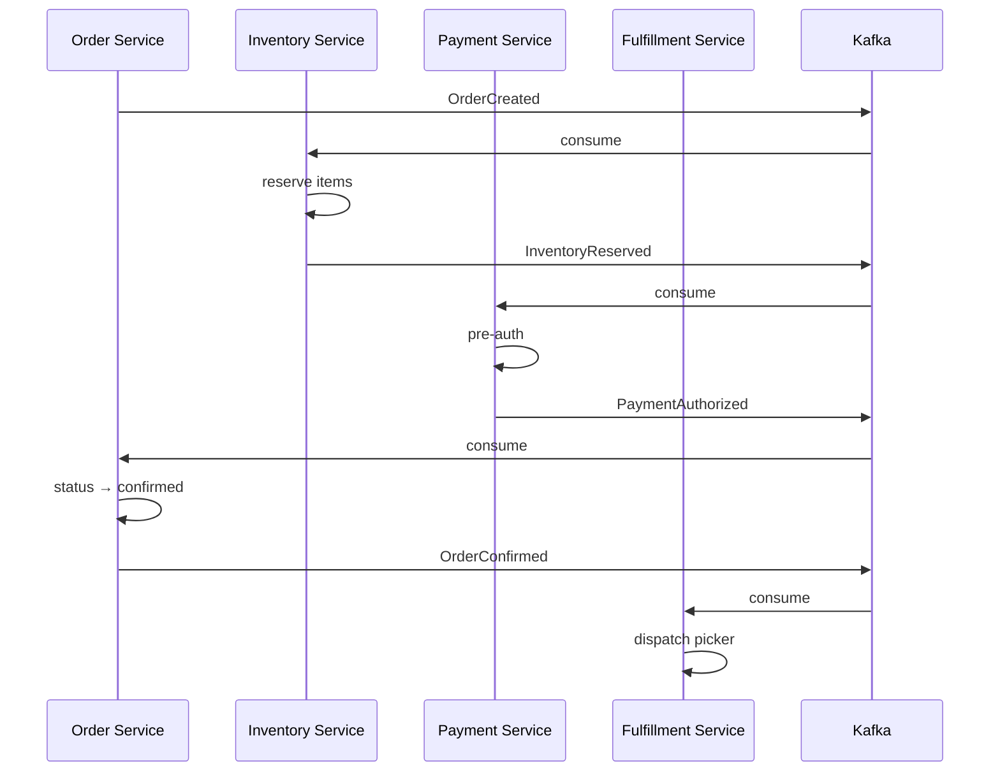

A local-delivery platform lets customers order convenience-store goods (snacks, drinks, household items) from nearby micro-fulfillment centers and receive them in 30 minutes. The operator runs ~500 dark stores across US metros, each stocking 2,000–4,000 SKUs within a 2–3 mile delivery radius.

<!--more-->

## 1. Problem
A local-delivery platform lets customers order convenience-store goods (snacks, drinks, household items) from nearby micro-fulfillment centers and receive them in 30 minutes. The operator runs ~500 dark stores across US metros, each stocking 2,000–4,000 SKUs within a 2–3 mile delivery radius. A user opens the app, sees what's available from the DC that serves their address, builds a cart, and checks out — the system reserves inventory, charges payment, dispatches a picker, and routes a driver. The core tension is that inventory sitting on a physical shelf depletes in real time: a customer entering checkout can lose items to another checkout that completes first, yet holding inventory too long blocks other users. Every piece of the stack — catalog, availability, reservation, fulfillment — is scoped to a single DC, making the DC the natural partition boundary.



## 2. Requirements

**Functional**

- FR1: Browse a product catalog filtered to the DC serving the user's delivery address

- FR2: Search products by name, category, or brand with real-time stock availability

- FR3: Place a multi-item order for delivery within a 30-minute window

- FR4: Track an order from placement through picking, packing, and delivery in real time

- FR5: Receive substitution recommendations when a picked item is out of stock

- FR6: View order history and re-order from a past purchase in one tap

**Non-functional**

- NFR1: Catalog reads with availability filtering return p95 under 200 ms

- NFR2: 99.95% availability during peak evening hours (6pm–10pm local time)

- NFR3: No customer is sold an item already allocated to another active checkout

- NFR4: Order status events visible to the customer within 5 seconds of occurrence

*Out of scope: fleet routing and ETA optimization, driver onboarding and payouts, DC restocking and supply-chain forecasting, promotional pricing engines, subscription/membership tiers.*

## 3. Back of the envelope

- `500 DCs × ~3,000 SKUs/DC` → 1.5M inventory rows total, ~10 GB without indexes. Small enough to fit in memory on a single modern host, but the workload is write-heavy at peak (reservations, deductions, restock) — practical ceiling is per-DC partitioning so hot DCs don't saturate a shared instance.
- `500 DCs × 5 orders/min peak rush` → ~42 orders/s sustained. Each order touches inventory (reserve + deduct), payment (authorize + capture), and fulfillment (dispatch picker). The concurrency point is the per-DC inventory row — at 5 orders/min per DC, the contention window is ~12 seconds per order, well within row-lock tolerances.
- `2M DAU × 3 page loads/session` → ~6M catalog reads/day ≈ 70 QPS average, 200 QPS peak. But each page load is a geo-filtered availability query: "show me all chips in stock at DC #247." If every SKU query fans out to inventory, that's 200 × 3,000 = 600K sub-queries — a DB killer.
## 4. Entities & API

```
DC {
  dc_id:             string PK    ← short code, e.g. "PHL-12"
  geo_hash:          string INDEX ← GeoHash-7 (~153m cell); spatial index key
  center_lat:        float        ← actual lat/lon for drive-time routing
  center_lon:        float
  delivery_radius_mi:decimal(3,1) ← configurable per-DC; typically 2.0–3.5
  status:            enum         ← active | paused | closed (paused = weather/incident)
  address_line:      string
}

Product {
  product_id:bigint PK    ← global catalog; shared across all DCs
  name:      string INDEX
  category:  enum         ← snacks | beverages | household | frozen | alcohol
  brand:     string
  image_ref: string[]
  is_alcohol:boolean      ← flags age-gating and compliance checks
  is_active: boolean      ← soft-delete for discontinued products
}

Inventory {
  dc_id:          string PK ← partition key; co-located per DC
  product_id:     bigint PK ← sort key; one row per SKU per DC
  stock_on_hand:  integer   ← physical count; updated on pick + restock
  reserved_qty:   integer   ← sum of active Reservation rows for this SKU
  available_qty:  integer   ← computed = stock_on_hand − reserved_qty; maintained by trigger
  aisle:          string    ← picker-facing location, e.g. "A-4-2"
  last_restock_at:timestamp
}

Reservation {
  reservation_id:uuid PK
  dc_id:         string CK ← scoped to the same DC partition as Inventory
  product_id:    bigint CK
  order_id:      string CK ← links to Order; key for idempotent release
  quantity:      integer
  expires_at:    timestamp ← TTL; released after 15 min if order incomplete
  created_at:    timestamp
}

Order {
  order_id:          string PK ← UUID, generated client-side for idempotency
  user_id:           string CK ← partition key; user's order history is user-scoped
  dc_id:             string
  delivery_address:  jsonb     ← street, city, zip, lat, lon
  status:            enum      ← cart | confirmed | picking | packed | en_route | delivered | cancelled
  subtotal_cents:    bigint
  delivery_fee_cents:bigint
  total_cents:       bigint
  created_at:        timestamp
}

OrderLineItem {
  order_id:           string PK
  product_id:         bigint PK
  quantity:           integer
  unit_price_cents:   bigint    ← snapshot at checkout; decoupled from live catalog price
  actual_product_id:  bigint?   ← null if exact match; non-null if picker substituted
  substitution_reason:enum?     ← oos | damaged | customer_requested
}
```

**API**
- `GET /v1/dc/lookup?lat=39.95&lon=-75.16` — find the DC serving an address; returns `dc_id`
- `GET /v1/catalog?dc_id=PHL-12&category=snacks&q=chips&page=1` — browse/search products with real-time availability at a DC
- `POST /v1/orders` — create an order; body: `{dc_id, items[{product_id, quantity}], delivery_address, payment_method_id}`; returns `order_id`
- `GET /v1/orders/{order_id}` — current order status + line items + substitutions
- `POST /v1/orders/{order_id}/cancel` — cancel before picking starts; releases reservations
- `POST /v1/orders/reorder/{previous_order_id}` — re-create a cart from a past order; body may override delivery address; returns new `order_id`
## 5. High-Level Design



#### FR1: Browse a catalog filtered to the DC serving the user's delivery address
**Components:** Client → Gateway → Geo Index (PostGIS/QuadTree) → Catalog Service → Redis availability cache → Catalog response
**Flow:**
1. Client calls `GET /v1/dc/lookup?lat=...&lon=...` on app open or address change. Gateway enriches with IP-derived location if lat/lon omitted.
2. Geo Index runs a spatial query: nearest DC with `status=active` within its `delivery_radius_mi`. Query uses a GeoHash prefix scan (7-char ≈ 150m cell) followed by a Haversine filter on the candidates:

```sql
SELECT dc_id, center_lat, center_lon
FROM dc
WHERE geo_hash LIKE :geohash_prefix || '%'
AND status = 'active'
ORDER BY earth_distance(ll_to_earth(center_lat, center_lon),
                        ll_to_earth(:lat, :lon))
LIMIT 1;
```

1. Gateway caches the `user_id → dc_id` mapping in a session cookie (TTL 1 hour) and returns `dc_id` to the client. Subsequent catalog requests carry the cookie.
2. Catalog Service receives `GET /v1/catalog?dc_id=PHL-12&category=snacks&q=chips&page=1`. It queries the Product table for matching SKUs, then bulk-fetches availability from Redis:

```javascript
HMGET dc:PHL-12:stock product:4821 product:1733 product:9012 ...
```

1. Products with `available_qty = 0` are either dropped or shown as "out of stock" (configurable per category). Results are paginated (30 items/page) and returned with availability flags.

**Design consideration:** The DC lookup is the critical first touch. An address near the boundary of two DCs produces ambiguity — PostGIS chooses the closest by straight-line distance, but road-network drive time may favor the other DC. A 2-phase approach (straight-line candidate list → OSRM drive-time check before final assignment) is overkill for the browse path and adds 50–100ms. The chosen trade-off: assign to the closest DC by Haversine at browse time, re-verify with drive-time at checkout if the address is within 0.5 mi of another DC's boundary. 95%+ of addresses are unambiguously inside a single DC radius.
#### FR2: Search products by name, category, or brand with real-time stock availability
**Components:** Client → Catalog Service → Elasticsearch (full-text index) → Redis (availability) → merged response
**Flow:**
1. Client sends `GET /v1/catalog?dc_id=PHL-12&q=sparkling water`. Catalog Service routes text queries to Elasticsearch.
2. Elasticsearch runs a `multi_match` against `name`, `brand`, and `category` fields with category boosting (exact matches rank higher). The query is scoped to `is_active=true`:

```json
{
  "query": {
    "bool": {
      "must": [
        { "multi_match": { "query": "sparkling water", "fields": ["name^3", "brand^2", "category"] } },
        { "term": { "is_active": true } }
      ]
    }
  },
  "size": 30, "from": 0
}
```

1. Elasticsearch returns `product_id` + relevance score. Catalog Service pipeline-fetches availability from Redis for all matching product IDs in a single `HMGET`.
2. Service merges availability into the response and ranks: in-stock items first within each relevance tier (configurable: some DCs show OOS items at the bottom, others hide them).

**Design consideration:** Full-text search is expensive relative to category browse. Elasticsearch is deployed as a single-cluster secondary index — not the system of record. Product data is written to PostgreSQL first, then CDC'd into Elasticsearch via Kafka Connect with < 1s lag. If Elasticsearch is unavailable, the Catalog Service falls back to PostgreSQL `ILIKE` with `pg_trgm` trigram indexes — slower (~50ms vs ~5ms) but functional. This avoids a hard dependency on the search engine for basic operations.
#### FR3: Place a multi-item order for delivery within a 30-minute window
**Components:** Client → Order Service → Inventory Service (reserve) → Payment Service (pre-auth) → Inventory Service (confirm/deduct) → Order Store → Kafka
**Flow:**
1. Client sends `POST /v1/orders` with `{dc_id, items: [{product_id, quantity}], delivery_address, payment_method_id}`. The client generates `order_id` as a UUIDv4 and includes it in the request body for idempotency.
2. Order Service checks idempotency: `SELECT status, created_at FROM orders WHERE order_id = ?`. If found, return the existing order state immediately — no reprocessing.
3. Order Service calls Inventory Service: `POST /v1/inventory/reserve` with `{dc_id, order_id, items: [{product_id, quantity}]}`. Inventory Service runs a transactional reserve:

```sql
BEGIN;
-- Lock rows for these products at this DC
SELECT product_id, stock_on_hand, reserved_qty
FROM inventory
WHERE dc_id = :dc_id AND product_id = ANY(:product_ids)
FOR UPDATE;

-- For each: if stock_on_hand - reserved_qty - :requested >= 0, create reservation
INSERT INTO reservation (reservation_id, dc_id, product_id, order_id, quantity, expires_at)
VALUES (:rid1, :dc_id, :pid1, :order_id, :qty1, NOW() + INTERVAL '15 minutes'),
       ...
ON CONFLICT (order_id, dc_id, product_id) DO NOTHING; -- idempotent reserve

UPDATE inventory
SET reserved_qty = reserved_qty + :qty
WHERE dc_id = :dc_id AND product_id = :pid;

COMMIT;
```

1. If any line item fails reservation (insufficient stock), Inventory Service returns `{status: "partial", unavailable: [{product_id, quantity_available}]}`. Order Service returns this to the client so the user can adjust their cart — the order is NOT created.
2. On full reservation success, Order Service calls Payment Service for a pre-authorization hold on the total amount. Payment Service returns `auth_code`.
3. Order Service inserts the `Order` + `OrderLineItem` rows and publishes `OrderCreated` to Kafka. The client receives `{order_id, status: "confirmed", estimated_delivery: <ISO8601>}`.

**Design consideration:** The reservation window (15 minutes) is the central fairness trade-off. Too short: checkout-abandoned users lose their cart items silently. Too long: popular SKUs (e.g., White Claw at 9pm on a Friday) become starved. GoPuff uses 10 minutes; Instacart uses 15. At 5 orders/min/DC, a 15-min window means ~75 active reservations per DC — negligible lock contention per SKU. The reservation TTL is enforced by the Inventory Service: a background sweeper (`SELECT reservation_id FROM reservation WHERE expires_at < NOW() LIMIT 100 FOR UPDATE SKIP LOCKED`) runs every 30 seconds within each DC partition and releases expired holds.



#### FR4: Track an order from placement through picking, packing, and delivery in real time
**Components:** Order Service → Kafka (OrderEvents) → Fulfillment Service → Order Store (status update) → SSE Push → Client
**Flow:**
1. After order confirmation (FR3), Fulfillment Service consumes `OrderCreated` from Kafka and dispatches to a picker at the DC via the internal picking app. Order status advances to `picking`.
2. As the picker scans each line item, the picking app sends `POST /v1/fulfillment/scan` with `{order_id, product_id, actual_product_id?, substitution_reason?}`. Fulfillment Service:
	- If `actual_product_id != product_id` (substitution): updates the `OrderLineItem` row with `actual_product_id` and `substitution_reason`, charges the customer the lower of the two prices.
	- Publishes `OrderEvent {type: "item_picked", order_id, product_id, ...}` to Kafka.
3. When all items are picked or substituted, the picker confirms the bag; status advances to `packed`. Fulfillment Service publishes `OrderEvent {type: "packed"}` and dispatches a driver via the routing system (out of scope).
4. Driver marks pickup → status `en_route`. Driver marks delivery → status `delivered`. Payment Service captures the pre-auth.
5. An SSE push worker consumes the Kafka topic, filters by `order_id`, and pushes events to the client via `GET /v1/events/{order_id}` SSE stream. The client subscribes on order confirmation and receives incremental status updates.

**Design consideration:** The SSE worker filters Kafka at the consumer level — each worker subscribes to the full `OrderEvents` topic but only pushes events for actively-subscribed `order_id` values (tracked in a Redis set with TTL = max delivery time + 5 min). This avoids per-order Kafka partitions, which would create millions of partitions for historical data. At 42 orders/s peak and ~200 bytes/event, Kafka bandwidth is ~8 KB/s — negligible. The push path is the only customer-facing real-time component; the poll fallback is `GET /v1/orders/{order_id}`.
#### FR5: Receive substitution recommendations when a picked item is out of stock
**Components:** Picker App → Fulfillment Service → Catalog Service (similarity) → Picker App (choice) → Order Store (update)
**Flow:**
1. When a picker scans a product that is out of stock (shelf empty despite system inventory — a stock-count discrepancy), the picking app shows an "Item Unavailable" screen.
2. Fulfillment Service queries Catalog Service for substitution candidates: `GET /v1/catalog/substitutions?product_id=4821&dc_id=PHL-12`. Catalog Service returns the top 3 candidates ranked by:
	- Same category + same brand (exact variant: 12-pack → 6-pack of same SKU)
	- Same category + similar price (within ±20%)
	- Same category + historically successful substitution (based on prior substitution data with low rejection rate)

```sql
SELECT p.product_id, p.name, p.brand, i.available_qty, i.unit_price_cents
FROM product p
JOIN inventory i ON p.product_id = i.product_id
WHERE p.category = (SELECT category FROM product WHERE product_id = :pid)
AND p.is_active = true
AND i.dc_id = :dc_id
AND i.available_qty > 0
AND p.product_id != :pid
ORDER BY
  CASE WHEN p.brand = :brand THEN 0 ELSE 1 END,
  ABS(i.unit_price_cents - :price_cents) ASC,
  i.substitution_success_rate DESC
LIMIT 3;
```

1. The picker selects one or taps "skip item." The choice is written to `OrderLineItem` and the customer sees the substitution in their order status (FR4).
2. Post-delivery, the customer can rate the substitution (thumbs up/down). This feeds back into `substitution_success_rate`.

**Design consideration:** Substitution is the UX moment where internal stock-count errors become visible to the customer. The substitution query is a point-read at picking time — no caching, always fresh. If Catalog Service is down, the picker can manually search or skip. The substitution data model (`actual_product_id` on `OrderLineItem`) means the original ordered item is never lost — analytics and reorder logic (FR6) can distinguish "they ordered X but got Y" from "they intentionally ordered Y."
#### FR6: View order history and re-order from a past purchase in one tap
**Components:** Client → Order Service → Order Store (user-scoped query) → Reorder endpoint
**Flow:**
1. `GET /v1/orders?user_id=<id>&page=1&limit=20` queries the Order table scoped to the user's partition. Results are ordered by `created_at DESC`.
2. For re-order: `POST /v1/orders/reorder/{previous_order_id}`. Order Service:
	a. Reads the previous `OrderLineItem` rows.
	b. Maps to current products: if `actual_product_id` is set, use that (they got a substitution and kept it — prefer it next time); otherwise use `product_id`.
	c. Checks current DC availability for each item (same DC, or nearest active DC to the delivery address if the address changed).
	d. Runs reservation (FR3, step 3). Returns `{order_id, items: [{product_id, available, quantity}]}` — the client shows which items made it into the cart and which are OOS.
3. The returned `order_id` is now a live cart; the client transitions directly to checkout (FR3).

**Design consideration:** Re-order is a convenience shortcut, not a guarantee. At the time of re-order, some items may be discontinued, out of stock, or unavailable at the user's current DC. The service does NOT silently drop OOS items — it returns them with `available: false` so the client can surface "these 2 items are currently unavailable" to the user before they check out. This avoids the surprise of a smaller-than-expected order.
## 6. Deep dives
### DD1: Inventory consistency — preventing double-booking across concurrent checkouts
**Problem.** Two customers A and B both add the last can of Red Bull from DC #247 to their carts. Customer A checks out 3 seconds before Customer B. If both checkouts process concurrently and neither sees the other's reservation, both succeed — the picker has one can but two orders. The system must ensure the quantity deducted never exceeds physical stock, even under concurrent checkout within the same DC, while keeping the reservation path fast enough that checkout latency stays under 200ms.
**Approach 1: Optimistic concurrency with version-column retry**
The Inventory table carries a `version` column (integer, incremented on every update). On reserve, the service reads `stock_on_hand`, `reserved_qty`, and `version`. It computes the new reserved quantity client-side, then issues:

```sql
UPDATE inventory
SET reserved_qty = reserved_qty + :delta, version = version + 1
WHERE dc_id = :dc_id AND product_id = :pid
AND stock_on_hand - reserved_qty - :delta >= 0
AND version = :read_version;
```

If zero rows updated (version mismatch or stock exhausted), the caller retries from read. Under low contention (~5 orders/min per DC), retries rarely exceed 1. Under high contention (a flash sale on a popular item), retries spike and latency degrades non-deterministically — worst case, a customer sees a spinner for 3–5 seconds and bounces.
**Challenges:** Retry storms under meaningful contention. No fairness guarantee — a retrying transaction can be starved by newer transactions that keep incrementing the version.
**Edge case:** A checkout with 15 line items does 15 sequential single-row optimistic updates. If item #14 fails, items #1–13 are already reserved with rows locked by open transactions. The service must either roll back all 13 (leaving ghost locks until commit) or hold item #14 as "waitlisted" — both add complexity.
**Approach 2: Pessimistic row-lock on cart-add with TTL**
Each DC's inventory lives in a dedicated PostgreSQL partition. On cart-add (before checkout), the Inventory Service acquires a row-level lock with a short TTL:

```sql
-- Checkout locks all line-item rows in one call
BEGIN;
SELECT product_id, stock_on_hand, reserved_qty
FROM inventory
WHERE dc_id = :dc_id AND product_id = ANY(:product_ids)
ORDER BY product_id    -- deterministic lock order prevents deadlocks
FOR UPDATE;            -- blocks concurrent checkouts on same SKU

-- Validate each, then reserve
INSERT INTO reservation (...) VALUES (...), (...), ...;
UPDATE inventory SET reserved_qty = reserved_qty + :qty WHERE ...;
COMMIT;
```

All rows are locked in a consistent order (by `product_id ASC`), which eliminates deadlocks — every checkout at DC #247 locks rows in the same sequence. The lock is held only for the duration of the reserve transaction (~5–10ms) and released on commit. The reservation itself carries a 15-minute TTL (FR3).
**Challenges:** Row locks serialize checkout on contested SKUs. At peak (5 orders/min/DC), the serialization window is ~12 seconds between orders for the same SKU — well within tolerances. If a single SKU gets 50 concurrent checkout attempts (a viral TikTok product), the lock queue becomes a bottleneck. The mitigation is the reservation TTL: if the hot SKU is fully reserved, subsequent attempts fail immediately (no lock wait) because `stock_on_hand - reserved_qty <= 0` is visible from the uncommitted reservation.
**Normal path:** Two users checkout simultaneously for the same last-in-stock item. One acquires the lock, sees `qty_available - reservation_qty >= 1`, reserves it, commits. The other acquires the lock, sees `available = 0`, receives `{status: "partial", unavailable: [{pid, available: 0}]}` — no spin, no retry storm.
**Decision:** Pessimistic row-level locking on checkout, with deterministic lock ordering by `product_id` within each DC-scoped partition.
**Rationale:** This is the standard inventory pattern used at scale — Amazon's fulfillment-center inventory uses the same `SELECT FOR UPDATE` with TTL holds. At GoPuff's per-DC order rate (5/min peak), the serialization overhead is invisible. Optimistic locking would add retry complexity for a problem that doesn't exist at this write volume. The real danger at GoPuff scale is not lock contention but *stock-count drift* — physical inventory diverging from digital inventory due to theft, damage, or mis-picks. That is solved with cycle counts (out of scope), not a different locking strategy.
**Edge cases:**
- **Race between reservation expiry and checkout confirm:** Customer A checks out, the 15-min TTL fires 1ms before the confirm transaction commits, another customer B grabs the released reservation. Solution: the confirm step re-validates all reservations (`SELECT ... WHERE order_id = :oid AND expires_at > NOW() FOR UPDATE`) before deducting. If any reservation expired, confirm fails with an error and the customer is prompted to re-checkout.
- **Partial fulfillment mid-checkout:** A picker grabs the last can while a customer is in checkout flow. The reservation prevented this — the picker's deduction only applies to `stock_on_hand - reserved_qty`, so the reserved can is invisible to picking until either confirmed (deducted) or expired (released).
> 💡 **Why not Redis for inventory locking?** Redlock (Redis distributed lock) looks appealing for per-SKU locks — sub-millisecond acquire/release. But inventory locks must be transactional with the reservation insert (if the lock is acquired but the reservation write fails, the lock must be released atomically). Redis transactions (`MULTI`/`EXEC`) don't span the lock-and-write semantic. PostgreSQL row locks give you both in one `SELECT FOR UPDATE` + `INSERT` — and the lock survives a crash via WAL. At 5 orders/min/DC, PostgreSQL handles the lock throughput with headroom to spare.
### DD2: Geo-spatial DC discovery — mapping an address to the right fulfillment center
**Problem.** A user at 39.9526° N, 75.1652° W in Center City Philadelphia must be routed to DC PHL-03 (1.8 mi northeast) and not DC PHL-07 (2.1 mi southwest), even though PHL-07 is technically closer by straight-line distance because the user is on the wrong side of the Schuylkill River. A naive Haversine ranking assigns the wrong DC 5–8% of the time in dense urban grids with river crossings, highways, and one-way street networks. Getting the DC wrong means showing inventory from a DC that can't deliver to the user — a broken first experience.
**Approach 1: Pre-computed service area polygons (GeoJSON) per DC**
Each DC owns a hand-drawn or algorithmically-generated polygon defining its delivery area. On API call, the Geo Index runs `ST_Within(user_point, dc_polygon)` and returns the matching DC. This is O(1) if polygons are indexed.
**Challenges:** Polygons require maintenance — when a DC adjusts its radius or street patterns change, polygons must be regenerated. Overlapping DC edges (two DCs can deliver to the same block) require a tiebreaker (closest center, load balancing, or explicit owner). At 500 DCs, manual polygon curation is a staffing problem, not a technical one.
**Approach 2: GeoHash prefix scan + Haversine**
Every DC is indexed by a GeoHash-7 prefix (~153m × 153m cell). A user at a given lat/lon hashes to a 7-char prefix. The DC lookup queries all DCs sharing that prefix (typically 1–3 DCs) and ranks by Haversine distance. This is what FR1 describes.
**Challenges:** GeoHash cells are rectangular, not circular. A DC on the edge of a cell may be closer to a user in the neighboring cell than to users inside its own cell. Fixing this requires a 9-neighbor scan (the cell itself + 8 adjacent cells), which returns up to 20–30 candidate DCs. Still O(1) but post-filtering with Haversine can return the wrong DC near water crossings and highways for the 5–8% of edge cases.
**Approach 3: Drive-time pre-computation with OSRM isochrones**
At checkout time (not browse), the Order Service calls an OSRM routing server with the user's lat/lon and the top-2 DC candidates from the GeoHash lookup. OSRM returns `{driving_time_seconds: 720}` for each DC. The DC with the lowest drive time under the delivery radius wins. This corrects the 5–8% river-crossing and highway-boundary errors.

```javascript
OSRM GET /table/v1/driving/{user_lon},{user_lat};{dc1_lon},{dc1_lat};{dc2_lon},{dc2_lat}
→ {durations: [[0, 680], [720, 0]]}   // 680s to DC1, 720s to DC2
```

**Challenges:** OSRM table queries add 50–100ms to the checkout path. At 42 orders/s, the OSRM server handles this comfortably (a single OSRM instance does ~1,000 table queries/s on a loaded US Northeast graph). OSRM requires pre-loaded OpenStreetMap data for the service region. The graph must be refreshed weekly to reflect road closures.
**Decision:** GeoHash prefix scan + Haversine for DC assignment at browse time (FR1); OSRM drive-time verification at checkout (FR3) for addresses within 0.5 mi of a DC boundary. Only ~5% of checkouts trigger the OSRM call.
**Rationale:** This mirrors the Uber Eats dispatch pattern — fast spatial index for candidate generation, precise routing for final assignment. The 95% of users who are unambiguously inside a single DC radius never pay the 50ms OSRM penalty.
**Edge cases:**
- **OSRM unavailable:** Fall back to Haversine ranking. The 5–8% boundary-error rate is temporarily exposed, but orders placed at the wrong DC during an OSRM outage are manually re-routed by the fulfillment team.
- **New DC onboarding:** A new DC's GeoHash prefix is computed from its `center_lat, center_lon` on insert. Neighboring DCs may have overlapping prefixes — the Haversine tiebreaker handles this naturally.
- **User moves during session:** The `dc_id` in the session cookie is invalidated if the user changes their delivery address. The client calls `GET /v1/dc/lookup` again.
### DD3: Scaling availability reads — caching inventory so catalog queries don't hit the transactional store
**Problem.** The catalog browse path (FR1/FR2) needs per-product availability at the serving DC. At 200 QPS peak × 3,000 SKUs per query (worst case: unfiltered category browse), that's 600,000 inventory lookups per second — enough to saturate the transactional PostgreSQL instance that also handles the write path (reservations, deductions). The read path must not compete with the write path for the same database resources. Availability data has a specific tolerance for staleness: showing an item as "in stock" when the last can was reserved 2 seconds ago is acceptable; showing "out of stock" for 5 minutes after a restock is not.
**Approach 1: Read replicas with async replication**
Deploy PostgreSQL read replicas per region. Catalog reads hit replicas; writes go to the primary. Replication lag is typically < 100ms.
**Challenges:** Under peak write load (42 orders/s across all DCs), replication lag can spike to 2–5 seconds. During a replication lag spike, a user browsing catalog sees stale availability — they add an item to cart, then checkout fails because the primary shows it as reserved. This "ghost stock" problem erodes trust. PostgreSQL read replicas also don't scale writes — if write throughput grows with order volume, the primary becomes the bottleneck regardless of how many replicas serve reads.
**Approach 2: Redis per-DC inventory snapshot with TTL refresh**
An `InventorySnapshotter` worker (one per DC partition, co-located with the Catalog Service) periodically bulk-loads the current inventory state into Redis:

```python
# Runs every 30 seconds per DC partition
def snapshot_dc(dc_id):
    rows = db.query("""
        SELECT product_id, available_qty, unit_price_cents
        FROM inventory
        WHERE dc_id = :dc_id AND stock_on_hand > 0
    """, dc_id=dc_id)

    pipe = redis.pipeline()
    key = f"dc:{dc_id}:stock"
    pipe.delete(key)  # atomic replacement
    pipe.hset(key, mapping={f"product:{r.product_id}": r.available_qty for r in rows})
    pipe.expire(key, 60)  # 60s TTL — next snapshot replaces before expiry
    pipe.execute()
```

Catalog reads use `HMGET dc:PHL-12:stock product:4821 product:1733 ...` — a single Redis call, sub-millisecond, regardless of how many products are in the browse result.
**Challenges:** The 30-second snapshot interval means availability is up to 30 seconds stale. During a flash sale (e.g., a new energy drink drops at 6pm), 30 seconds of overselling is possible — 10 users could all see "in stock" from the same snapshot while only 3 cans are physically available. The mitigation: at cart-add time (before checkout), the client calls `GET /v1/inventory/check?dc_id=PHL-12&product_id=4821`, which hits the transactional DB directly. If the snapshot was stale, the user sees "item no longer available" at cart-add, not at checkout — a less frustrating failure point.
**Normal path:** User browses chips, sees 15 in stock (from Redis, up to 30s stale). Adds to cart → real-time check against transactional DB → confirms 14 available (one was reserved in the last 28 seconds). User proceeds to checkout with accurate count.
**Decision:** Redis per-DC snapshot with 30-second TTL for browse-level availability; transactional DB check at cart-add for correctness.
**Rationale:** This is the standard two-level availability pattern — DoorDash uses the same approach (menu cache on Redis with 30s TTL, real-time check at cart-add). The snapshot approach also means the Catalog Service never calls the Inventory Service during browse — it talks only to Redis and the Product DB. The Inventory Service is called on cart-add and checkout only, keeping its QPS at ~84 (2 actions × 42 orders/s) — well within single-host PostgreSQL capability.
> 💡 **Why not Redis Streams / CDC for real-time invalidation?** A more advanced approach uses Debezium CDC on the Inventory table to push real-time updates into Redis (item reserved → `HINCRBY dc:PHL-12:stock product:4821 -1`). This eliminates the 30s staleness window entirely. The trade-off: CDC pipeline complexity, exactly-once delivery challenges during Kafka rebalancing, and the fact that at GoPuff scale (42 orders/s), a 30s snapshot is perfectly adequate for browse. Implement the snapshot first. Add CDC only if customer complaints about ghost stock exceed 0.1% of sessions.
### DD4: Order lifecycle — idempotency, cancellation, and partial fulfillment with Saga
**Problem.** An order spans four services (Order, Inventory, Payment, Fulfillment) and a payment network. If the payment pre-auth succeeds but the order INSERT fails (DB connection drop mid-transaction), the customer's card has a hold with no corresponding order — they call support. If a picker discovers half the line items are missing from the shelf, the order must be partially fulfilled and the customer charged only for what they receive. The lifecycle must guarantee exactly-once order creation (idempotency), graceful partial fulfillment, and clean cancellation with reservation release — even when individual services fail mid-operation.
**Approach 1: Synchronous orchestration with compensating transactions (Saga)**
The Order Service is the orchestrator. Each step (reserve inventory, pre-auth payment, confirm order) is a local transaction. If any step fails, the orchestrator runs compensating transactions in reverse: release reservation, void payment. This is a linear Saga.
**Challenges:** The payment network may not support synchronous voids (some gateways batch-process voids every 15 minutes). If the pre-auth succeeds and the order insert fails, the void may take 15 minutes — during which the customer's credit limit is reduced. The inventory compensating step (release reservation) is straightforward since it's a local DB operation. The Saga also adds complexity to the Order Service: it must track which steps completed so it knows which compensations to run.
**Approach 2: Event-driven choreography with outbox pattern**
Each service publishes domain events to Kafka. Downstream services react to events. Idempotency is enforced at every consumer by the event's `order_id` + event type acting as a dedup key.
**Normal path:**
1. Order Service receives `POST /v1/orders`, validates, inserts `Order (status=cart)` and publishes `OrderCreated` via the outbox.
2. Inventory Service consumes `OrderCreated`, reserves items, publishes `InventoryReserved` or `InventoryUnavailable`.
3. Payment Service consumes `InventoryReserved`, pre-auths, publishes `PaymentAuthorized` or `PaymentDeclined`.
4. Order Service consumes `PaymentAuthorized`, advances status to `confirmed`, publishes `OrderConfirmed`.
5. Fulfillment Service consumes `OrderConfirmed`, dispatches picker.

**Failure handling:** If Payment Service crashes after pre-auth but before publishing `PaymentAuthorized`, the pre-auth is dangling. A reconciliation job (every 5 minutes) queries for orders in `cart` status older than 2 minutes and checks with the payment gateway — if an auth exists, it publishes `PaymentAuthorized` and the flow resumes. If Inventory Service reserves items but Payment Service declines, Inventory Service publishes `PaymentDeclined` → Inventory Service consumes its own event and releases the reservation. No orchestrator; each service owns its own compensation.



**Partial fulfillment path:** If the picker finds 3 of 5 items and substitutes 1, the Fulfillment Service publishes `OrderPartiallyFulfilled {line_items: [{product_id, status: picked|substituted|oos}]}`. Payment Service consumes this and adjusts the capture amount to match what was actually delivered. The customer is charged only for picked + accepted substitutions.
**Cancellation path:** `POST /v1/orders/{order_id}/cancel` triggers Order Service to publish `OrderCancelled`. Inventory Service consumes and releases reservations. Payment Service consumes and voids the pre-auth. If the order is already `picking`, cancellation is rejected — the picker is already handling the order.
**Decision:** Event-driven choreography with outbox pattern, idempotency keyed on `order_id + event_type`, with a reconciliation job for dangling gateway states.
**Rationale:** DoorDash's order lifecycle uses the same choreography pattern with Kafka — the outbox ensures the event is published atomically with the local DB write, eliminating the dual-write problem. The reconciliation job is the safety net: in production, the #1 cause of stuck orders is not service crashes but payment gateway timeouts (the gateway accepted the charge but the response was lost). A 5-minute reconciliation sweep catches these without manual intervention.
**Edge cases:**
- **Duplicate `OrderCreated` event:** The consumer deduplicates on `order_id`. If the event is re-delivered (Kafka at-least-once), the Inventory Service's reservation insert uses `ON CONFLICT (order_id, dc_id, product_id) DO NOTHING` — idempotent at the DB level.
- **Payment capture after partial fulfillment:** The final charge amount differs from the pre-auth. Some payment gateways require pre-auth amount ≥ capture amount. The initial pre-auth includes a 10% buffer (e.g., pre-auth $42 even if estimated total is $38) to cover substitutions that are slightly more expensive. If no substitution occurs, the capture is for the actual amount and the unused hold is released.
- **Order stuck in `cart` > 15 minutes:** The reservation TTL sweep (DD1) releases expired reservations. The Order Service reconciliation job cancels orders in `cart` status older than 15 minutes and publishes `OrderCancelled` to clean up any dangling payment authorizations.
## 7. Trade-offs
| Decision | Chosen | Rejected | Why |
|---|---|---|---|
| Inventory locking | Pessimistic row-lock (PostgreSQL `SELECT FOR UPDATE`) per DC partition | Optimistic concurrency with version column; Redis Redlock | Contention is too low to justify retry complexity; row-locks are transactional with reservation insert; no distributed coordination needed |
| DC discovery | GeoHash prefix scan + Haversine; OSRM drive-time at checkout for boundary cases | Full drive-time routing for every lookup; pre-computed GeoJSON polygons | 95% of addresses are unambiguous with Haversine; OSRM adds 50ms only for the 5% edge cases; polygon maintenance at 500 DCs is a staffing cost |
| Availability caching | Redis per-DC snapshot (30s TTL) with transactional check at cart-add | Read replicas; CDC-based real-time Redis updates | 30s staleness is acceptable for browse; snapshot is 50 lines of code vs a CDC pipeline; add CDC later only if ghost-stock complaints exceed threshold |
| Order lifecycle | Event-driven choreography (Kafka + outbox) with reconciliation job | Synchronous Saga orchestration | Decouples services — each owns its own compensation; reconciliation handles the real-world failure mode (payment gateway timeouts); outbox eliminates dual-write problem |
| Substitution engine | Deterministic ranking (same brand + price proximity + historical success rate) | ML model for personalized substitutions | 500 DCs × 2,000 SKUs = too few products for a meaningful per-user model; a simple ranking covers 90%+ of substitution satisfaction; add ML later as A/B experiment |
| Database topology | PostgreSQL partitioned by `dc_id` with one partition per physical DC | Single global PostgreSQL; distributed SQL (CockroachDB/Spanner) | Per-DC partitioning isolates hot DCs, simplifies backup/restore, and matches the physical boundary; no cross-DC transactions exist in the product; 500 partitions is well within PostgreSQL limits |
## 8. References
**Primary sources**
1. [Uber: Evolution and Scale of Uber's Delivery Search Platform](https://www.uber.com/us/en/blog/evolution-and-scale-of-ubers-delivery-search-platform/) — two-tower semantic search, HNSW indexing, biweekly index refresh, blue/green column-level deployment for catalog updates
2. [Uber: Cart Assistant — Agentic Grocery Shopping on Uber Eats](https://www.uber.com/us/en/blog/uber-cart-assistant/) — multi-prompt state graph with 8 stages, parallel item processing, guardrail architecture for product recommendations
3. [PostgreSQL: SELECT FOR UPDATE and Row-Level Locks](https://www.postgresql.org/docs/current/explicit-locking.html) — row-level locking semantics, deadlock detection, lock ordering
4. [Redis: Pipelining and Hashes for Bulk Reads](https://redis.io/docs/latest/develop/use/pipelining/) — `HMGET` for batch field retrieval, pipeline batching for snapshot loads
5. [Kafka: Exactly-Once Semantics and the Outbox Pattern](https://www.confluent.io/blog/exactly-once-semantics-are-possible-heres-how-apache-kafka-does-it/) — transactional outbox, idempotent producers, consumer deduplication
6. [OSRM: Open Source Routing Machine — Table Service](https://project-osrm.org/docs/v5.24.0/api/#table-service) — distance/duration matrices for candidate routing at < 50ms per query

