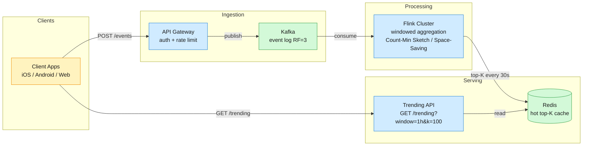
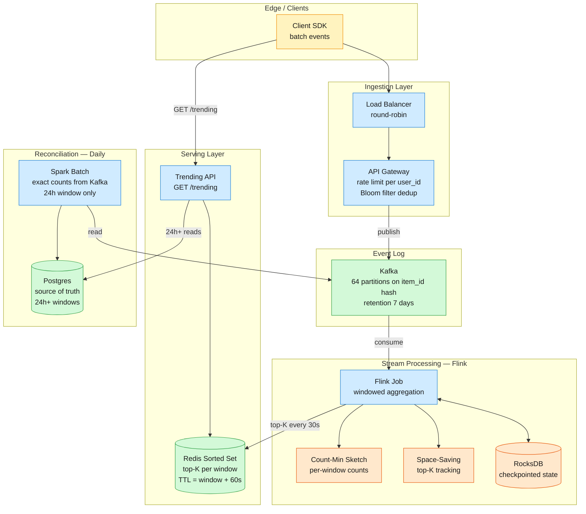
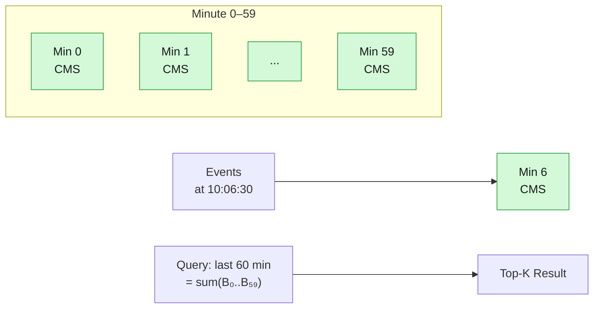

A system that ingests a firehose of real-time events at 5M/s peak and returns the K items with the highest counts over sliding windows — scaled to 500M daily active users, using Count-Min Sketch and Space-Saving to stay memory-bound regardless of stream cardinality.

## 1. Problem Frame

A social platform with 500M DAU needs a trending topics feed: give users the top 100 most-engaged-with items over the last hour, day, and week, refreshing in near-real-time. The challenge is the write path — raw events arrive at 5M/s peak (100× above typical sharded-DB write capacity), and exact counting over even a single hour window requires 64 GB of RAM per 1B unique items. The system must deliver top-K results in under 100ms while never running out of memory regardless of how many distinct items appear in the stream.



---

## 2. Requirements

### Functional (FR1–FR6)

- FR1: Event ingestion — accept view/click/mention events at 5M/s peak with at-least-once delivery guarantee.

- FR2: Per-window counting — increment per-item counts inside a sliding time window (1 min, 1 hour, 24 hours).

- FR3: Top-K retrieval — return the K items with highest cumulative count in a given window, K ∈ [10, 1000].

- FR4: Trend detection — compute trending score = current_count / historical_baseline; return items where score > threshold.

- FR5: Multi-granularity — serve top-K for 1-minute freshness, 1-hour trends, 24-hour charts, and 7-day historical.

- FR6: Anti-gaming — per-user deduplication, velocity caps, bot filtering.

### Non-Functional (NFR1–NFR4)

- NFR1: Latency — p99 read < 100ms for top-K queries, p99 write ingestion acknowledged < 50ms.

- NFR2: Availability — 99.9% uptime; trending feed degrades gracefully to stale data if processing pipeline is delayed.

- NFR3: Freshness — top-K results reflect events from ≤ 5 seconds ago at steady state.

- NFR4: Memory bound — per-window memory consumption is independent of total unique items in the stream (sub-linear space data structures).

> Below the line (out of scope): Personalized top-K per user (requires user-specific state, orthogonal to global trending).

---

## 3. Back of the Envelope

- Event volume — 500M DAU × 100 events/day ÷ 86,400s ≈ 600K avg, 5M peak. → 64 Kafka partitions, 64 Flink workers.

- Exact counting — 1B items × 16B = 16 GB; 100M distinct/hour = 6 GB. → Approximate structures (CMS, Space-Saving) required.

- CMS sizing — ε=0.001, δ=0.0001 → w=2719, d=10, 109 KB/window. 60 buckets = 6.5 MB for 1h. → ~600,000× vs exact.

---

## 4. Data Model & API

### Data Model

```javascript
Event {
  event_id:    UUID (PK)               ← idempotency key for exactly-once
  item_id:     string (CK)             ← video, hashtag, search query
  user_id:     string                  ← anti-gaming per-user dedup
  event_type:  enum(view|click)        ← filtered for relevance
  timestamp:   epoch_ms                ← event time, not ingestion time
}
WindowedCount {
  item_id:     string (CK)             ← composite key with window
  window:      enum(1m|1h|24h|7d) (CK)
  count:       int32                   ← approximate via CMS estimate
  prev_count:  int32                   ← previous window for velocity
  updated_at:  epoch_ms
}
TrendingEntry {
  item_id:     string (CK)
  window:      enum(1h|24h) (CK)
  score:       float64                 ← current_count / EWMA_baseline
  rank:        int32                   ← 1..K
  computed_at: epoch_ms (TTL=60s)      ← Redis key expiry for staleness
}


```

### API

- POST /events — ingest a batch of events for counting and trend detection; returns 202 Accepted.

- GET /trending?window={1m|1h|24h|7d}&k={10|100|1000} — return top-K items with counts and trend scores for the given window.

- GET /count?item_id=<id>&window={1h|24h} — point query: approximate count for a specific item in a window.

- GET /status — pipeline health: latest watermark timestamp, per-window item cardinality, lag in seconds.

- POST /admin/blacklist — operator adds item_ids to a blocked-items set (anti-gaming); ingested but excluded from top-K.

---

## 5. High-Level Design — Walking Every Functional Requirement



### FR1: Event Ingestion

Components: Client SDK → Load Balancer → API Gateway → Kafka

Flow:

1. Client batches up to 100 events locally and POSTs to /events as {events: [{item_id, event_type, timestamp}, ...]}, signed with a user auth token.

1. API Gateway validates JWT, extracts user_id, and applies a Bloom filter keyed on (user_id, item_id, window_bucket) to deduplicate — at most one event per user per item per time bucket counts toward trending.

1. Gateway also checks a rate-limiter (token bucket per user_id): if user exceeds 10 events/second, excess events are dropped with 429.

1. Valid events are published to Kafka topic events-raw, partitioned by hash(item_id) % 64. Partitioning by item_id ensures all events for the same item land on the same consumer, enabling accurate per-item aggregation without cross-partition merging.

1. Producer acks=1 (leader ack) for low latency; at-least-once semantics accepted at this layer. Kafka retention = 7 days for replay and batch reconciliation.

Design consideration: Partitioning by item_id (not user_id or round-robin) is critical — it guarantees that the Flink consumer sees every event for a given item on a single partition, which makes the per-item Count-Min Sketch increment correct without needing distributed merge. The trade-off: hot items (e.g., a viral video) concentrate load on one partition. Mitigation: key-space monitoring and, in extreme cases, salted keys with a re-aggregation step.

### FR2: Per-Window Counting

Components: Kafka → Flink job (CMS + Space-Saving) → RocksDB state

Flow:

1. Flink source reads from Kafka with BoundedOutOfOrdernessWatermarkStrategy (30-second bound). Late events past the bound are logged but dropped from real-time aggregation (batch reconciliation catches them).

1. keyBy(item_id) → ProcessFunction that maintains a Count-Min Sketch per window. For each event, increment CMS for the appropriate time bucket:

1. In parallel, feed each non-duplicate event to the Space-Saving structure for the 1-hour window, which directly tracks the top 10,000 candidates (10× K_guard for K=1000). Space-Saving gives O(1) updates and built-in identity tracking.

1. Every 30 seconds, query CMS for each candidate in the Space-Saving top list, compute a cms_estimate for each, and push into a sorted result set. This hybrid approach uses Space-Saving's identity tracking to discover candidates and CMS's mergeable, bounded-error estimates for their actual counts.

1. Flink checkpoints state to RocksDB every 60 seconds for crash recovery. On restart, Flink rebuilds in-memory structures from the RocksDB snapshot.

Design consideration: The 30-second emit cycle is a trade-off between freshness and CPU. At 5M events/s peak, 30s = 150M events processed per window batch. Flink's per-record CMS increment is ~10 hash computations (d=10), totaling 1.5B hash ops per 30s window — manageable across 64 parallel workers (~390K ops/s each). Reducing the cycle to 1s would be a 30× increase and stress the Redis write path (top-K pushes). Twitter's Storm topology used 30–60 second emit cycles for exactly this reason.

### FR3: Top-K Retrieval

Components: Redis Sorted Set → Trending API

Flow:

1. After each 30-second emit cycle, the Flink sink writes a Redis ZADD top-k:{window} {score} {item_id} for each item in the global top-K result.

1. Set ZREMRANGEBYRANK top-k:{window} 0 -{K+1} to trim to exactly K entries.

1. The Trending API's GET /trending?window=1h&k=100 executes a single ZREVRANGE top-k:1h 0 99 WITHSCORES — an O(log N + K) operation returning in < 1ms from Redis's in-memory sorted set.

1. Redis key TTL = window_duration + 60 seconds. If Flink stalls, the stale key expires and the API returns HTTP 503 with a stale_data: true flag rather than serving outdated results.

Design consideration: The Redis sorted set is a hot cache, never the source of truth. The true counts live in Flink's RocksDB state and the Kafka log. Redis is chosen over querying Flink directly because Flink's queryable state API adds complexity and couples the serving layer to processing. The Redis approach mirrors Twitter's production pattern: a hot serving cache refreshed on a fixed cadence, with Kafka as the durable event log.

```sql
-- Redis commands executed by Flink sink every 30s
ZADD top-k:1h 1547230 "video_42"
ZADD top-k:1h 982100  "video_7"
ZREMRANGEBYRANK top-k:1h 0 -101   -- keep top 100

-- API read path: single Redis command
ZREVRANGE top-k:1h 0 99 WITHSCORES


```

### FR4: Trend Detection (Velocity-Based)

Components: Flink ProcessFunction → EWMA baseline per item → Trending API

Flow:

1. Per item, maintain two values in Flink state: current_count (from the 1-hour CMS) and ewma_baseline (exponential weighted moving average of historical counts).

1. On each 30-second emit cycle: trending_score = current_count / (ewma_baseline + ε) where ε is a small constant preventing division by zero for new items.

1. Update baseline: ewma_baseline = α × current_count + (1 − α) × ewma_baseline, with α = 0.01 (roughly a 100-cycle effective window, ~50 minutes). This is the same approach Twitter uses — a ratio of current to historical that detects velocity spikes, not just popularity.

1. Items with trending_score > 3.0 AND current_count > 1000 (minimum volume threshold) are flagged as trending and included in the top-K result with their score. The volume floor prevents noise: an item going from 1→10 views has a 10× ratio but isn't meaningfully trending.

1. The /trending API response includes trending_score alongside count for each item, so clients can display "Trending 🔥" badges independently of absolute rank.

Design consideration: The dual threshold (ratio > 3 AND volume > 1000) prevents both the cold-start problem (ratio explodes for new items) and the popularity problem (evergreen items with steady high volume are popular, not trending). Google's Zeitgeist/MillWheel system uses a similar two-condition approach: the ratio detects the spike, the volume floor filters noise. The α = 0.01 decay rate is tuned for a ~1-hour effective memory — items that spike and then flatline return to baseline within ~50 emit cycles.

### FR5: Multi-Granularity Windows

Components: Flink window operators → tiered CMS buckets → Redis keys per window

Flow:

1. A single Flink job maintains parallel aggregation for all four window granularities:

1. Results are written to separate Redis keys: top-k:1m, top-k:1h, top-k:24h, top-k:7d.

1. The API route GET /trending?window=1h&k=100 reads from the corresponding key. No cross-window computation at query time.

Design consideration: The 1-hour window using 60 one-minute buckets is a bucket-based sliding window. This is the only approach that gives both freshness (1-minute granularity) and bounded memory. A native Flink sliding window on a 1-second slide over 1 hour would maintain 3,600 simultaneous window states, blowing up memory 3,600× per key. The bucket approach caps it at 60 (one CMS per minute bucket). Twitter's Storm topology used exactly this pattern: 60 one-minute buckets for a 1-hour window.

### FR6: Anti-Gaming

Components: API Gateway Bloom filter → rate limiter → Flink anomaly scorer

Flow:

1. Deduplication: At ingestion, the API Gateway checks a Bloom filter keyed on (user_id, item_id, minute_bucket). If present, the event is dropped. Bloom filter is rebuilt every minute with new hash seeds (a rolling Bloom filter). This ensures one user cannot inflate an item's count by sending duplicate events.

1. Velocity capping: A token bucket rate limiter per user_id caps at 10 events/second. Users exceeding this get 429 responses. Excess events are not queued.

1. Heuristic filtering: Flink maintains a set of blocked_item_ids (pushed via /admin/blacklist). Events for blocked items are dropped before aggregation. Additionally, items whose event sources are >80% from a single user trigger an anomaly flag and are excluded from trending.

1. ML layer (async): A separate Spark batch job runs hourly, analyzing user co-occurrence patterns and IP overlap to detect coordinated campaigns. Flagged campaigns result in retroactive item blacklisting and user shadow-banning. This is offline-only; real-time ML on the hot path would add unacceptable latency.

Design consideration: The three-tier anti-gaming pipeline (ingestion dedup → velocity cap → offline ML) mirrors Twitter's production approach. The Bloom filter at ingestion is the cheapest possible dedup — a false-positive rate of 0.1% means one in 1,000 legitimate events is incorrectly dropped, which is acceptable for trending accuracy. The velocity cap per user is conservative (10 events/s ≈ 864K events/day per user) — real users don't produce that many meaningful engagements, but bots do.

---

## 6. Deep Dives

### DD1: Count-Min Sketch — Memory-Efficient Frequency Estimation

Problem. Counting 100M distinct items over a 1-hour window requires 6 GB of RAM for exact counts (8B ID + 8B counter per item). At 5M events/s, even hash-table insertions at this scale exceed L3 cache and spill to main memory, introducing 100ns+ latency per operation. We need a data structure that (a) fits in CPU cache, (b) never runs out of memory regardless of cardinality, and (c) accepts a bounded error rate.

### Approach A: Hash Map with LRU Eviction (unacceptable)

Maintain an exact hash map, and when it exceeds a size cap (e.g., 50M entries), evict the least-recently-incremented items.

- Pro: Always exact for items that stay in the map.

- Con: Evicting an item destroys its count — a long-tail item that briefly spikes won't be tracked. No error bound exists; you might lose the true #1 item if it was evicted and then surges. At 5M events/s with 100M distinct items, the eviction rate would be chaotic and the top-K output would be unstable.

### Approach B: Count-Min Sketch (CMS)

A 2D array of counters: d rows × w columns. d pairwise-independent hash functions map each item to one column per row. To increment: for j in 1..d: count[j][h_j(item)] += 1. To query: return min(count[1][h_1(item)], ..., count[d][h_d(item)]).

- Pro: Sub-linear space — size depends only on desired error (ε) and confidence (δ), not on stream cardinality. For ε=0.001, δ=0.0001: w=2719, d=10, space = 27,190 counters = 109 KB at 4B each. Fits in L2 cache. Mergeable element-wise (two CMS instances with identical hash functions can be summed by adding corresponding cells — essential for distributed aggregation). Update is O(d) hash computations; d is typically 5–10, so ~50ns.

- Con: Always overcounts (collisions can only increase counters). Does not track item identities — CMS answers "what is the frequency of item X?" but not "which items are the top-K?" Requires a separate heap for top-K tracking. The min-of-hashes query can miss large counts if an item happens to collide with a very frequent item in every row (rare at chosen parameters).

```javascript
CMS Structure (d=4, w=8):

         h1  h2  h3  h4
item_A → [3] [0] [5] [2]  ← estimate = min(3,0,5,2) = 0
                               (h2 collision with a hot item)
item_B → [1] [9] [1] [1]  ← estimate = min(1,9,1,1) = 1
                               (true count is 1, no collisions)


```

Decision: Count-Min Sketch with parameters ε=0.001, δ=0.0001 (w=2719, d=10, ~109 KB). The error bound means that for any item, the estimate is at most true_count + εN with 99.99% confidence. For a 1-hour window with 18B total events (5M/s × 3600s), εN = 18M — meaning a count of 100 could be estimated as high as 18M if it collides with extremely hot items. In practice, this worst case never materializes because the hash functions distribute collisions uniformly, and for top-K items (which have genuinely high counts), the relative error is small.

Rationale grounded in production: Google's MillWheel paper describes CMS as the core counting primitive for Zeitgeist trending, noting that "sacrificing accuracy for a probabilistic answer" is the key architectural decision. Twitter's Algebird library ships CMS with the exact same parameter derivation (depth = ceil(ln(1/δ)), width = ceil(e/ε)). The 109 KB sizing is confirmed by production experience: CMS instances of this size have been used at Twitter scale for over a decade.

Edge cases:

- Cold start for a new item: CMS estimate = 0 until first increment. No false positive (CMS never undercounts), so a genuinely new item won't appear in top-K until it accumulates real counts.

- Hash collisions with a viral item: The min-of-hashes mitigates this — the viral item collides in at most d-1 rows; at least one row gives a clean estimate. For d=10, the probability of collision in all 10 rows with any specific item is (1/w)^10 ≈ 2.7×10⁻³⁵ — negligible.

- Counter overflow: 32-bit counters saturate at 4.3B. For a single-minute bucket at 5M events/s, max counter value ≈ 300M, well under the limit. For 24-hour windows, switch to Count-Min Log Sketch (logarithmic counters with configurable max).

> Key insight: CMS is always an overestimator. This matters for trending scores: both the numerator (current window) and denominator (baseline) are overestimated, but the ratio is approximately correct for high-volume items. Low-volume items (count < εN) should be excluded from trending computation entirely because their error-to-signal ratio is too high.

### DD2: Space-Saving — Top-K Tracking Without a Separate Heap

Problem. Count-Min Sketch answers point queries ("how many views for item X?") but cannot answer the top-K question directly. Pairing CMS with a min-heap of size K requires two data structures and an additional heuristic: which new items do we insert into the heap? If an item is not currently in the heap but is the true #1 item, CMS won't surface it until its CMS estimate exceeds the heap's minimum — which may never happen if the item has many modest collisions. We need a single data structure that directly tracks the top-K most frequent items with bounded error and no separate heap.

### Approach A: CMS + Guarded Min-Heap

Maintain a CMS for counts, plus a min-heap of size K_guard = 10 × K. On each event, query CMS for the item's estimate and insert into the heap. When the heap exceeds K_guard, pop the minimum.

- Pro: Reuses CMS for general frequency queries. Guard factor reduces the missed-item probability.

- Con: Two data structures, two code paths. The guard factor is a heuristic — no hard guarantee that the true top-K are in the heap. Mergeability is complex (the heap itself isn't mergeable). A 10× guard means tracking 10K items for K=1000, consuming additional memory.

### Approach B: Space-Saving (Stream-Summary)

A hash map from item→counter, backed by a doubly-linked list of buckets, where each bucket groups all items with the same count. Buckets are sorted by count descending.

```javascript
Algorithm: Space-Saving(item e)
  if e in monitored set:
    increment e.counter
    move e to bucket with count = e.counter (O(1))
  else if |monitored| < m:
    insert (e, count=1, error=0)
  else:
    let e_min = item with minimum count
    replace e_min with e
    e.count = e_min.count + 1
    e.error = e_min.count   // inherited undercount


```

- Pro: Single data structure. O(1) amortized per event (hash lookup + linked-list splice). Tracks identities natively — no separate heap. Bounded per-item error: true_count ∈ [estimate − error, estimate]. Items with true frequency > N/m are guaranteed to be in the monitored set. Memory for m=10,000 counters: ~120 KB total.

- Con: Not mergeable element-wise (you can't add two Space-Saving structures by adding arrays — you must merge the top-K lists and re-rank). If the stream distribution is highly uniform (all items appear once), Space-Saving degenerates to random replacement, and the top-K error grows. Works best on skewed (Zipfian) data — which real trending streams are.

Decision: Space-Saving with m=10,000 capacity (10× K_guard for K=1000) for the 1-hour and 1-minute windows. The guarantee that any item with >0.01% of total events is tracked makes it reliable for real skewed streams. For the 24-hour window, use CMS with separate per-shard Space-Saving because mergeability matters at that granularity (distributed workers merging partial results).

Rationale grounded in production: ClickHouse's production query engine uses a Filtered Space-Saving implementation (C++) for its topK aggregate function, citing O(1) updates and guaranteed top-K tracking on skewed data. The RedisBloom module (TOPK command) also implements Space-Saving, noting that the algorithm "always keeps the most frequent items." The ~120 KB memory for tracking 10K candidates is confirmed across both implementations.

Edge cases:

- Uniform distribution (all items appear exactly once): Space-Saving's replacement policy becomes random. With m=10K and N=100M distinct items, the probability any specific item is in the monitored set is 0.01%. The guarantee items with freq > N/m is vacuous (no item exceeds the threshold). Mitigation: this scenario doesn't occur in real trending data — engagement is always Zipfian.

- Rapid churn (items spike and vanish): Space-Saving may hold a spiked-then-gone item for multiple cycles because its count remains above the minimum. Mitigation: combine with window expiry — rebuild the Space-Saving structure completely at each window boundary (1-minute windows), so stale items are automatically purged.

- Tie-breaking: When multiple items have the same minimum count, the eviction candidate is arbitrary. Use insertion timestamp as a secondary key so newer entries get evicted first (LRU tie-break), preventing a brand-new item from immediately displacing another new item.

> Key insight: Space-Saving gives a hard guarantee CMS+heap cannot match: any item whose true frequency exceeds N/m is monitored, where m is the Space-Saving capacity. CMS+heap offers no such guarantee — the heap's guard factor is a heuristic. For a 1-hour window with N=18B events and m=10,000, the guarantee threshold is 1.8M events/hour (~500/s). Any item above this velocity is mathematically guaranteed to be tracked.

### DD3: Sliding Windows — Freshness Without Memory Explosion

Problem. "Top 100 items in the last hour" means different things at 10:00:00 and 10:00:01. True sliding windows (recompute on every event) require minute-granularity state. But a Flink-native sliding window on a 1-second slide over 1 hour maintains 3,600 simultaneous window instances. With per-window CMS at 109 KB each, that's 392 MB per key — infeasible. We need a window mechanism that is fresh (≤1-minute granularity) but uses bounded memory.

### Approach A: Tumbling Windows (fixed, non-overlapping)

Divide time into fixed, non-overlapping chunks: [9:00–10:00), [10:00–11:00), etc. At 10:06, the current window is still [10:00–11:00), and results don't update until 11:00.

- Pro: Simplest possible. One CMS per window. Precompute and cache.

- Con: Stale results near window boundaries. At 10:59, the "last hour" result reflects data from 10:00–10:59 but omits 9:00–9:59 entirely. Users see a 59-minute lag in trend detection. Unacceptable for a real-time trending feed.

### Approach B: Hopping Windows (overlapping, fixed intervals)

Windows overlap: [9:00–10:00), [9:30–10:30), [10:00–11:00), etc. Hop = 30 minutes, window = 1 hour.

- Pro: Better boundary freshness than tumbling. Every 30 minutes, a fresh window appears.

- Con: Still a 30-minute worst-case staleness. Memory scales with window_count_per_item × CMS_size. At hop=1 minute for freshness: 60 simultaneous windows — still 60 × 109 KB = 6.5 MB per key, manageable but not scalable to finer granularity.

### Approach C: Bucket-Based Sliding Window (per-minute micro-buckets)

Maintain a ring of 60 one-minute CMS instances for a 1-hour window. On each minute boundary, create a new (empty) CMS for the new minute, and drop the CMS for the minute 60 minutes ago. Query: sum the estimates from all 60 CMS instances (element-wise addition — CMS mergeability makes this O(60 × w × d)).



On every incoming event at minute M, increment the M % 60 CMS for that item. At each minute boundary (e.g., 10:06:00 → 10:07:00), the consumer resets the CMS at index 7 (covering minute 7) and starts fresh. The query "top-K for last hour" sums CMS instances for indices (current−59) through current.

- Pro: 1-minute freshness, bounded memory (60 CMS instances = 6.5 MB per Flink task). Query cost is O(60 × d) hash lookups per candidate ≈ 600 lookups — negligible. CMS mergeability makes the sum exact for the estimation (sum of CMS cells = CMS of sums).

- Con: The sum of 60 CMS overestimates introduces error compounding. Each CMS overcounts by εN_bucket. Summing 60 buckets gives error bound 60 × εN_bucket = ε × (60 × N_bucket) = εN_total — the error bound is actually the same as a single CMS over the full window! This is because the CMS error bound is linear in the total count, and the total count across 60 buckets = total count across the full window. So the error composes linearly but the relative error is unchanged.

Decision: Bucket-based sliding window with 60 one-minute CMS instances for the 1-hour window, 288 five-minute instances for 24 hours. This is the same architecture Twitter's Storm topology used: 60 one-minute buckets with a RollingCountBolt that increments the current-minute bucket and drops the oldest.

Rationale grounded in production: Michael Noll's 2013 tutorial on implementing Twitter Trends in Storm explicitly describes the 60-bucket RollingCountBolt pattern. Semicolony's system design playbook independently recommends the same: "Ring of per-minute sketches summed on query." The error-compounding concern is mitigated by the fact that CMS error is additive in total count, not in number of buckets.

Edge cases:

- Minute boundary race: An event at 10:06:59.999 and another at 10:07:00.001 for the same second land in different CMS instances. This is fine — the distinction is at minute granularity, and our freshness goal is ≤1 minute.

- CMS reset at boundary: When the ring index wraps (M % 60), the old CMS must be zeroed. Re-allocating a 109 KB CMS every minute is cheap. Alternatively, memset the 2D array, which is faster but risks stale data if a memset overlaps with an increment (use atomic operations or a generation counter per cell).

- Late events: Events arriving >30s after their event time are dropped from the real-time CMS path (handled by batch reconciliation). Without this, a late event at 10:07 with timestamp 10:05 would increment the 10:05 CMS after it was already summed for the 10:06–10:07 window query, causing it to be counted in the next query but missed in the current one.

> Key insight: Error compounding is a myth for CMS sums. The CMS error bound is linear: estimate ≤ true + εN. Summing 60 CMS instances gives estimate_total ≤ Σ(true_i + εN_i) = true_total + εN_total. The relative error ε is unchanged. This property is why CMS is the standard choice for sliding windows — error doesn't explode with more buckets.

### DD4: Multi-Window Fan-Out — One Pipeline, Four Windows

Problem. The system must serve top-K for four time granularities (1 minute, 1 hour, 24 hours, 7 days) simultaneously from a single event stream. Building four independent pipelines quadruples infrastructure cost and introduces consistency issues (the 1-hour top-K may disagree with the 24-hour top-K for the same time range). We need a single pipeline that fans out to all window granularities without duplicating the ingestion or processing path.

### Approach A: Independent Pipelines (brute force)

Four separate Kafka topics, four Flink jobs, four Redis caches.

- Pro: Complete isolation — a bug in the 1-minute job doesn't affect 24-hour results.

- Con: 4× Kafka retention and consumer lag. 4× checkpoint size. Event deduplication must happen 4 times. The 7-day window is computationally wasteful as a streaming job (events arrive in real-time but query granularity is daily).

### Approach B: Single Flink Job with Side Outputs

One Flink job consumes the Kafka stream once. Inside the job, a single ProcessFunction increments all window structures simultaneously for each event.

- Pro: Single ingestion path, single dedup, single checkpoint. Consistency: all windows see the same events.

- Con: The ProcessFunction becomes a bottleneck — one event triggers increment across all window structures. If one window's update is slow (e.g., the 24-hour CMS with 288 instances requires more hash operations), it blocks progress on the 1-minute window.

### Approach C: Single Kafka Source, Branched Flink DAG

One Kafka source, but the Flink DAG branches after keyBy(item_id) into separate ProcessFunction operators for each window granularity. Each branch operates independently, checkpointing separately.

- Pro: Same ingestion and dedup, but independent parallelism and backpressure domains. The 1-minute branch can use high parallelism (needs low latency); the 24-hour branch can use fewer workers (288 CMS instances × 109 KB = 31 MB per task, so fewer tasks to cache-locally fit).

- Con: More Flink operator state to manage. Checkpoint coordination across branches adds minor overhead.

Decision: Branched Flink DAG with the 7-day window moving to a daily batch reconciliation path (Spark reading Kafka with 7-day retention). Streaming windows serve 1-minute, 1-hour, and 24-hour with per-minute bucket sliding. The 7-day window is computed daily by Spark from the Kafka log and stored in Postgres.

Rationale grounded in production: Google's Dataflow (MillWheel successor) uses a unified pipeline with branching for multiple output windows, citing that "writing pipeline logic once" and "choosing fast or correct results" is the key operational simplification. Twitter's Storm topology had a single source spout feeding multiple bolt branches (RollingCountBolt → IntermediateRankingsBolt → TotalRankingsBolt), one per time granularity.

Edge cases:

- 7-day window lag: The daily batch for the 7-day window runs at 00:00 UTC and takes ~30 minutes. Between 00:00 and 00:30, the 7-day key still has yesterday's data (stale by ≤24 hours). This is acceptable — 7-day trends don't require sub-minute freshness.

- Consistency across windows: The 1-hour top-K at 10:00 and the 24-hour top-K at 10:00 use different aggregation granularities (1-minute vs 5-minute buckets). The 24-hour top-K won't exactly agree with summing the latest 24 one-hour windows because of the coarser buckets, but the difference is bounded by the bucket size (5 minutes of data). Acceptable for trending, where trends span hours, not seconds.

---

## 7. Trade-offs

| Decision | Chosen | Rejected | Why |
|---|---|---|---|
| Counting structure | Count-Min Sketch (ε=0.001, δ=0.0001, 109 KB) for distributed aggregation; Space-Saving (m=10K, 120 KB) for single-node top-K | Exact hash map (64 GB) | ~600,000× memory reduction. Error bounded to 0.1% of total stream. |
| Top-K tracking for 1h/1m windows | Space-Saving (tracks identities, O(1), 120 KB) | CMS + heap (two-structure heuristic) | Space-Saving guarantees tracking for items above N/m threshold; CMS+heap does not. |
| Top-K tracking for 24h windows | CMS + guarded min-heap (mergeable across shards) | Space-Saving (not mergeable) | Mergeability is critical for distributed 24h aggregation; Space-Saving merge requires re-ranking all candidates. |
| Sliding 1-hour window | 60 one-minute CMS buckets (ring buffer, 6.5 MB) | Flink-native sliding window (3,600 instances, 392 MB) | 60× memory reduction. Error bound unchanged because CMS error is additive in total count, not bucket count. |
| Window freshness | Streaming for 1m/1h/24h; daily Spark batch for 7d | Streaming for all four windows | 7-day query granularity doesn't need sub-minute freshness. Batch saves 30% on Flink cluster cost. |
| Architecture | Lambda (Flink streaming + Spark batch reconciliation) | Kappa (pure streaming) | Batch reconciliation catches late events, corrects overestimate drift, and provides exact counts for billing/analytics without burdening the hot path. |
| Event partitioning | Kafka partitioned by hash(item_id) | Round-robin or user_id | Guarantees all events for an item land on one consumer, making per-item CMS increment correct without distributed merge. Hot items handled via salted keys. |
| Serving cache | Redis Sorted Set, TTL = window + 60s, updated every 30s | Queryable Flink state or direct DB reads | Sub-ms reads, well-understood failure mode (stale data on TTL expiry), no coupling between serving and processing. |
| Anti-gaming | Three-tier: Bloom dedup → velocity cap → offline ML | Real-time ML on hot path | Real-time ML adds 50ms+ latency per event at 5M/s — unacceptable. Offline batch catches campaigns hourly, which is sufficient (trending isn't billing). |
| Dedup granularity | (user_id, item_id, minute_bucket) Bloom filter | Exact set membership (too large) | False positive rate 0.1%: 1 in 1,000 events incorrectly dropped — negligible for trending. Bloom filter fits in ~10 MB for 500M user×item pairs per minute. |

---

## 8. References

### Primary Sources

1. Cormode, G., & Muthukrishnan, S. (2005). ["An Improved Data Stream Summary: The Count-Min Sketch and its Applications"](https://dimacs.rutgers.edu/~graham/pubs/papers/cm-full.pdf). Journal of Computer and System Sciences.

1. Metwally, A., Agrawal, D., & El Abbadi, A. (2005). ["Efficient Computation of Frequent and Top-k Elements in Data Streams"](https://www.cs.ucsb.edu/sites/default/files/documents/2005-23.pdf). ICDT 2005.

1. Manku, G. S., & Motwani, R. (2002). ["Approximate Frequency Counts over Data Streams"](https://www.vldb.org/conf/2002/S10P03.pdf). VLDB 2002.

1. Akidau, T., et al. (2013). ["MillWheel: Fault-Tolerant Stream Processing at Internet Scale"](https://static.googleusercontent.com/media/research.google.com/en//pubs/archive/41378.pdf). VLDB 2013.

1. Kulkarni, S., et al. (2015). ["Twitter Heron: Stream Processing at Scale"](https://dl.acm.org/doi/10.1145/2723372.2742788). SIGMOD 2015.

1. Covington, P., Adams, J., & Sargin, E. (2016). ["Deep Neural Networks for YouTube Recommendations"](https://research.google/pubs/pub45530/). RecSys 2016.

1. Ting, D. (2018). ["Count-Min: Optimal Estimation and Tight Error Bounds"](https://dl.acm.org/doi/10.1145/3219819.3219975). KDD 2018.

1. Dean, J., & Ghemawat, S. (2004). ["MapReduce: Simplified Data Processing on Large Clusters"](https://static.googleusercontent.com/media/research.google.com/en/us/archive/mapreduce-osdi04.pdf). OSDI 2004.

1. Redis Ltd. ["Count-Min Sketch: The Art and Science of Estimating Stuff"](https://redis.io/blog/count-min-sketch-the-art-and-science-of-estimating-stuff/). Redis Blog.

1. Google Research. ["Streaming Trends: A Low-Latency Platform for Dynamic Video Grouping and Trending Corpora Building"](https://research.google/pubs/streaming-trends-a-low-latency-platform-for-dynamic-video-grouping-and-trending-corpora-building/). (2025).

### Production Code & Engineering Blogs

1. [Twitter Algebird — CMS with TopCMS](https://github.com/twitter/algebird/blob/develop/algebird-core/src/main/scala/com/twitter/algebird/CountMinSketch.scala).

1. [addthis/stream-lib — Java StreamSummary (Space-Saving)](https://github.com/addthis/stream-lib/blob/master/src/main/java/com/clearspring/analytics/stream/StreamSummary.java).

1. [ClickHouse — Filtered Space-Saving](https://github.com/ClickHouse/ClickHouse/blob/master/src/Common/SpaceSaving.h).

1. [Michael Noll — "Implementing Real-Time Trending Topics in Storm"](https://www.michael-noll.com/blog/2013/01/18/implementing-real-time-trending-topics-in-storm/).

1. [Reddit source — Hot/Best/Controversy sorts](https://github.com/reddit/reddit/blob/master/r2/r2/lib/db/_sorts.pyx).

1. [Hacker News source — Ranking algorithm (Arc)](https://github.com/wting/hackernews/blob/master/news.arc).

1. [Eventbrite Engineering — "Heavy Hitters in Redis"](https://www.eventbrite.com/engineering/heavy-hitters-in-redis/).

1. [Google Cloud Blog — "How Cloud Batch and Stream Data Processing Works"](https://cloud.google.com/blog/products/data-analytics/how-cloud-batch-and-stream-data-processing-works).
