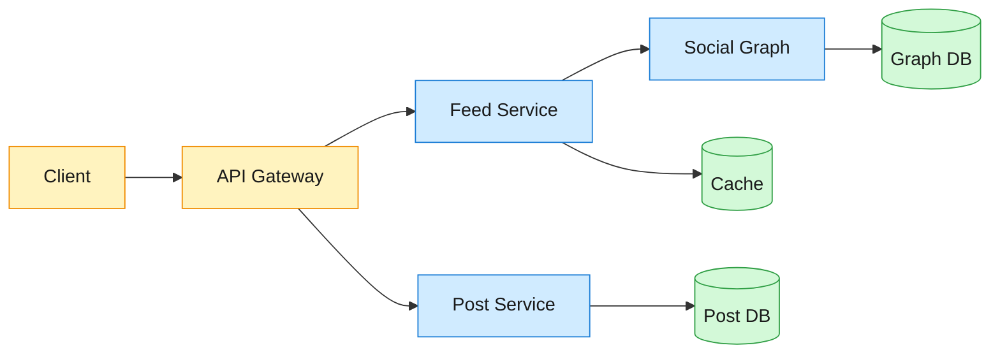
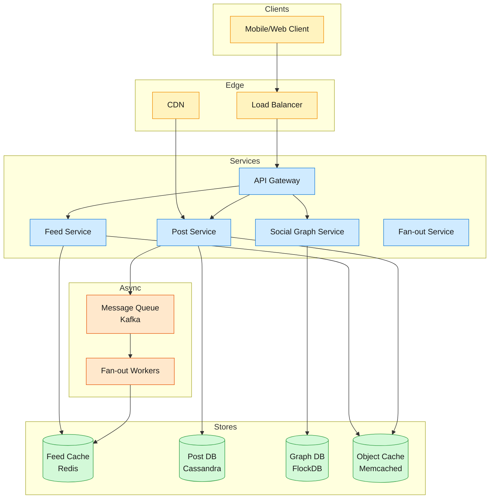

How a social news feed serves ~2B readers at ~1M QPS with hybrid push/pull fan-out, a multi-stage ML ranking funnel, and lease-based multi-tier caching — a deep dive into a timeline that handles 100M-follower accounts without write-amplification collapse.

<!--more-->

## 1. Problem
A social media news feed surfaces posts from followed accounts to billions of users. The hard part is serving a personalized, fresh feed at low latency when some users follow thousands of accounts and some accounts have hundreds of millions of followers. At scale this means roughly 500M posts/day fanning out to ~2B daily readers, with sustained reads near 1M QPS at peak. A single account with 100M+ followers breaks naive fan-out-on-write; recomputing every feed at read time can't meet a sub-500ms budget at that QPS; and chronological ordering leaves relevance on the table. The design has to reconcile write amplification, read latency, and freshness at once.



## 2. Requirements

**Functional**

- FR1: Create and publish posts (text, media, links)

- FR2: Follow and unfollow other users

- FR3: View home feed in reverse chronological order

- FR4: Page through feed (cursor-based pagination)

- FR5: Like, comment, and share posts

- FR6: View user profile timeline (posts by a specific user)

**Non-functional**

- NFR1: High availability with eventual consistency (≤1 min staleness)

- NFR2: <500ms p95 latency for feed reads and writes

- NFR3: Support 2B+ users with unlimited follow counts

- NFR4: Handle celebrity accounts with 100M+ followers without write amplification

*Out of scope: content moderation, real-time notifications, search, ads, direct messaging.*

## 3. Back of the envelope

- **Write volume:** 500M posts/day × avg 300 followers = 150B fan-out writes/day → 1.7M writes/sec peak. Synchronous writes would collapse under celebrity load.
- **Feed storage:** 2B users × 800 cached post IDs × 50 bytes/post = 80TB hot cache.
- **Peak read QPS:** 2B DAU × 10 feeds/day ÷ 86400 sec = ~230K QPS avg, 3-5× peak = 1M QPS. On-demand computation at this scale is impossible.
## 4. Entities & API

```javascript
User {
  user_id:   uuid PK
  username:  string
  created_at:timestamp
}

Post {
  post_id:      uuid PK   ← snowflake ID for time-ordering
  author_id:    uuid
  content:      string
  media_urls:   string[]
  created_at:   timestamp
  like_count:   integer   ← denormalized, eventually consistent
  comment_count:integer
}

Follow {
  follower_id:uuid PK   ← shard key
  followee_id:uuid PK
  created_at: timestamp
}

FeedItem {
  user_id:   uuid PK   ← shard key
  post_id:   uuid PK
  created_at:timestamp ← for pagination
}

Like {
  user_id:   uuid PK
  post_id:   uuid PK
  created_at:timestamp
}

Comment {
  comment_id:uuid PK
  post_id:   uuid
  author_id: uuid
  content:   string
  created_at:timestamp
}
```

**API**
- `POST /posts` — create a post, returns `post_id`
- `GET /feed` — get home feed, returns paginated list of posts
- `GET /users/{id}/posts` — get posts by a specific user
- `POST /follows` — follow a user
- `DELETE /follows/{id}` — unfollow a user
- `POST /posts/{id}/like` — like a post
- `POST /posts/{id}/comments` — comment on a post
## 5. High-Level Design



#### FR1: Create and publish posts
**Components:** Client → API Gateway → Post Service → Message Queue → Fan-out Workers → Feed Cache
**Flow:**
1. Client sends `POST /posts` with content and media
2. API Gateway validates request, checks rate limits
3. Post Service generates snowflake `post_id`, writes to Post DB (Cassandra)
4. Post Service publishes `PostCreated` event to Kafka topic
5. Fan-out Workers consume event, fetch author's followers from Graph DB
6. For non-celebrity authors (<100K followers): workers write `post_id` to each follower's feed cache (Redis list)
7. For celebrity authors (≥100K followers): skip fan-out; posts enter a celebrity pool for lazy pull at read time
8. Return `post_id` to client immediately (async fan-out continues in background)

**Design consideration:** The celebrity threshold (100K followers) is tunable. The key insight is that fan-out cost is O(followers), so accounts with 100M followers would require 100M cache writes per post — causing write amplification and latency spikes. Lazy pull at read time avoids this.
#### FR2: Follow and unfollow users
**Components:** Client → API Gateway → Social Graph Service → Graph DB
**Flow:**
1. Client sends `POST /follows` with `followee_id`
2. API Gateway validates request
3. Graph Service writes edge to Graph DB (FlockDB or similar)
4. Graph Service triggers async backfill: fan-out worker fetches recent posts from `followee` and writes to follower's feed cache
5. Return success to client

**Design consideration:** The backfill step is critical — without it, a user who follows someone new sees an empty feed until the followee posts again. The fix is to backfill the most recent ~100 posts from the followee. The backfill is async and eventually consistent; the follow itself is synchronous.
#### FR3: View home feed (reverse chronological)
**Components:** Client → API Gateway → Feed Service → Feed Cache + Celebrity Pool
**Flow:**
1. Client sends `GET /feed` with optional `cursor` for pagination
2. API Gateway validates request, extracts `user_id` from auth token
3. Feed Service reads user's feed from Feed Cache (Redis list of `post_id`s)
4. Feed Service fetches post objects from Object Cache (Memcached) or Post DB on cache miss
5. Feed Service merges in posts from celebrity pool (accounts user follows with ≥100K followers)
6. Feed Service sorts merged results by `created_at` descending
7. Return paginated list of posts to client

**Design consideration:** The celebrity pool merge is the key complexity. Maintain a per-user list of celebrity followees, fetch their recent posts at read time, and merge with the pre-computed feed. This adds latency (extra DB reads) but avoids write amplification. An alternative is full read-time assembly with ML ranking and no pre-computed feed at all — it maximizes ranking freshness but pays the candidate-fetch cost on every read; the hybrid keeps the chronological baseline a simple sorted-set scan.
#### FR4: Page through feed
**Components:** Same as FR3, with cursor-based pagination
**Flow:**
1. Client sends `GET /feed?cursor=<last_post_id>`
2. Feed Service uses cursor to fetch next page from Redis list (using `ZRANGEBYSCORE` with score = timestamp)
3. Continue from step 4 of FR3

**Design consideration:** Cursor-based pagination (not offset-based) is mandatory at scale. Offset pagination requires scanning and discarding rows, which is O(offset) and breaks under concurrent writes. Cursor pagination is O(page_size) and stable.
#### FR5: Like, comment, and share posts
**Components:** Client → API Gateway → Post Service → Post DB + Object Cache
**Flow:**
1. Client sends `POST /posts/{id}/like`
2. API Gateway validates request
3. Post Service writes like to Post DB, increments `like_count` (atomic counter)
4. Post Service invalidates `post_id` in Object Cache (or updates with new count)
5. Return success to client

**Design consideration:** Like counts are eventually consistent. The counter is atomic and its new value propagates to read replicas and caches asynchronously. The count may be stale by seconds, but users don't notice. The key is read-your-writes consistency: if you like a post, your like appears immediately in your own view.
#### FR6: View user profile timeline
**Components:** Client → API Gateway → Post Service → Post DB
**Flow:**
1. Client sends `GET /users/{id}/posts`
2. API Gateway validates request
3. Post Service queries Post DB for posts by `author_id`, sorted by `created_at` descending
4. Post Service paginates results using cursor
5. Return list of posts to client

**Design consideration:** Profile timelines are simpler than home feeds — no fan-out, no merge, just a direct query. But popular users (celebrities) get millions of reads, so caching is critical. Profile timelines are cached with a short TTL (seconds to minutes) because new posts arrive frequently.
## 6. Deep dives
### DD1: Fan-out strategy — hybrid push/pull for celebrity handling
**Problem.** Write volume scales with follower count. A post from an account with 100M followers requires 100M cache writes if using pure fan-out-on-write. This causes write amplification, latency spikes, and cache stampedes. But pure fan-out-on-read (compute feed at read time) adds latency to every read and doesn't scale to 1M QPS. We need a hybrid that minimizes write amplification while keeping read latency <500ms.
**Approach 1: Pure fan-out-on-write (push)**
When a user posts, write the `post_id` to every follower's feed cache synchronously. O(1) reads, O(followers) writes.

```python
def on_post_created(post):
    followers = graph_service.get_followers(post.author_id)
    for follower in followers:  # 100M iterations for celebrity
        feed_cache.push(follower.user_id, post.post_id)
```

**Challenges:**
- Write amplification: 500M posts/day × avg 300 followers = 150B writes/day
- Celebrity problem: a 130M-follower account × 1 post = 130M cache writes
- Latency spikes: synchronous fan-out blocks the write path
- Cache stampede: when a celebrity posts, all followers hit the cache simultaneously

**Approach 2: Pure fan-out-on-read (pull)**
Compute the feed at read time by querying posts from all followees and merging.

```python
def get_feed(user_id):
    followees = graph_service.get_followees(user_id)
    posts = []
    for followee in followees:  # 5000 iterations for power user
        posts.extend(post_db.get_recent_posts(followee, limit=100))
    return sorted(posts, key=lambda p: p.created_at, reverse=True)[:50]
```

**Challenges:**
- Read latency: 5000 DB queries per read → >500ms p95
- Read amplification: 1M QPS × 5000 queries = 5B queries/sec
- No caching benefit: every read recomputes the feed
- Doesn't scale to power users who follow thousands of accounts

**Approach 3: Hybrid push/pull with celebrity threshold**
Push for non-celebrities (<100K followers), pull for celebrities (≥100K followers). Maintain a per-user list of celebrity followees; at read time, merge pushed feed with celebrity posts fetched on-demand.

```python
def on_post_created(post):
    followers = graph_service.get_followers(post.author_id)
    if len(followers) < CELEBRITY_THRESHOLD:  # 100K
        # Push to all followers
        for follower in followers:
            feed_cache.push(follower.user_id, post.post_id)
    else:
        # Celebrity: add to celebrity pool
        celebrity_pool.push(post.author_id, post.post_id)

def get_feed(user_id):
    # Read pushed feed
    feed = feed_cache.get(user_id)

    # Merge celebrity posts
    celebrity_followees = graph_service.get_celebrity_followees(user_id)
    for celebrity in celebrity_followees:
        celebrity_posts = celebrity_pool.get(celebrity, limit=100)
        feed.extend(celebrity_posts)

    return sorted(feed, key=lambda p: p.created_at, reverse=True)[:50]
```

**Decision:** Hybrid push/pull with celebrity threshold (Approach 3).
**Rationale:** Pure fan-out-on-write hits write-amplification limits once an account has a very large follower count, which is what forces the hybrid. Variants exist — push only for a bounded set (e.g. a close-friends story feed), or weight the push/pull split by connection strength — but all keep the same push-for-most, pull-for-celebrities core. The hybrid is the only approach that handles both the celebrity problem and power users who follow thousands of accounts.
**Edge cases:**
- **Celebrity threshold tuning:** the cutoff is tunable. Too low → too many celebrities, read latency increases. Too high → write amplification returns.
- **Backfill on follow:** When a user follows a new account, backfill recent posts (~100 posts). Without backfill, the feed is empty until the followee posts again.
- **Unfollow cleanup:** When a user unfollows, remove the followee's posts from the feed cache. The cheap option is lazy cleanup — posts remain until they expire from the cache.
> [!NOTE]
> The celebrity threshold is not binary — it's a spectrum. A "celebrity score" combining follower count, engagement rate, and post frequency beats a hard cutoff: accounts with high scores use lazy pull, accounts with low scores use push.
> [!NOTE]
> The celebrity pool is a separate cache key space (e.g., `celebrity:{user_id}:posts`). This isolates celebrity reads from regular feed reads, preventing cache stampedes.
> [!NOTE]
> Hybrid push/pull adds complexity to the read path. The merge step (pushed feed + celebrity posts) must be fast (<50ms) to meet the <500ms p95 latency target. Keep the pushed feed pre-sorted, then merge-sort it with the celebrity posts at read time.
> [!NOTE]
> Why not pure pull? Pure pull pairs naturally with ML ranking (which fetches candidates at read time anyway), but for a chronological feed it's too slow at 1M QPS. Hybrid push/pull is the sweet spot.
### DD2: Feed ranking — multi-stage ML pipeline
**Problem.** Reverse chronological order is simple but suboptimal. Users want to see the most relevant posts first, not just the newest. But ML ranking adds latency (model inference) and complexity (feature engineering, model training). We need a ranking pipeline that improves relevance without blowing up read latency.
**Approach 1: No ranking (reverse chronological)**
Sort posts by `created_at` descending. Zero latency overhead, zero complexity.
**Challenges:**
- Users see low-quality posts from accounts they follow
- No way to prioritize high-engagement content
- Switching from chronological to an algorithmic timeline tends to draw user backlash (users feel they're missing breaking news), even as engagement rises

**Approach 2: Single-stage ranking**
Fetch all candidate posts, score them with a single ML model, return top N.

```python
def get_feed(user_id):
    candidates = get_all_candidate_posts(user_id)  # 10,000 posts
    scored = []
    for post in candidates:
        score = ml_model.predict(user_id, post)  # 10,000 inference calls
        scored.append((post, score))
    return sorted(scored, key=lambda x: x[1], reverse=True)[:50]
```

**Challenges:**
- Latency: 10,000 ML inference calls per read → >500ms p95
- Cost: ML inference is expensive (GPU/CPU)
- Doesn't scale to 1M QPS

**Approach 3: Multi-stage funnel (candidate generation → coarse ranking → fine ranking → re-ranking)**
Reduce candidates at each stage with progressively heavier models.

```python
def get_feed(user_id):
    # Stage 1: Candidate generation (10M → 10,000)
    candidates = candidate_generation(user_id)  # collaborative filtering, embeddings

    # Stage 2: Coarse ranking (10,000 → 1,000)
    candidates = coarse_ranker.predict(user_id, candidates)  # shallow model

    # Stage 3: Fine ranking (1,000 → 100)
    candidates = fine_ranker.predict(user_id, candidates)  # deep model (DLRM)

    # Stage 4: Re-ranking (100 → 50)
    candidates = reranker.apply_business_logic(candidates)  # diversity, recency boost

    return candidates[:50]
```

**Decision:** Multi-stage funnel (Approach 3) for ranked feed; reverse chronological (Approach 1) as a user-selectable option.
**Rationale:** The multi-stage funnel is the standard shape: candidate generation → coarse ranking (a shallow, cheap model) → fine ranking (a deep model, e.g. DLRM) → re-ranking for business logic. The funnel reduces the candidate set from millions to ~50 with minimal latency overhead (each stage is fast because the candidate set shrinks).
**Edge cases:**
- **Cold start:** New users have no interaction history. Serve a diverse "exploration" feed and use multi-armed bandits to learn interests quickly.
- **Diversity:** Pure engagement optimization leads to filter bubbles. Add diversity constraints in the re-ranking stage (cap posts from the same account, mix content types).
- **Recency vs. relevance:** offer a ranked tab and a chronological ("Following") tab so users can choose, and bake recency into the ranking model as a feature.
> [!NOTE]
> The multi-stage funnel is not just about latency — it's about cost. Fine ranking (DLRM) is expensive; you only want to run it on 1,000 candidates, not 10 million. The funnel is a cost optimization as much as a latency optimization.
> [!NOTE]
> DLRM (Deep Learning Recommendation Model) is a published recommendation architecture (KDD 2019). It predicts multiple engagement signals independently: P(Like), P(Comment), P(Share), P(Save), P(Spend Time). Each signal is a separate neural-network head, and the final score is a weighted combination: `Score = f(P(Like), P(Comment), P(Share), P(Save), P(Time))`. Weighting Saves and Shares above Likes is a common choice — they correlate better with long-term value than a Like.
> [!NOTE]
> ML ranking requires a feature store (user embeddings, content embeddings, interaction history) and a model-serving infrastructure (e.g. TensorFlow Serving, PyTorch Serve). This is a significant operational burden — it also pulls in upstream systems for community detection, graph/heterogeneous-network embeddings, and a user-interaction graph to generate features.
> [!NOTE]
> Why not single-stage? Single-stage ranking doesn't scale. A typical feed has ~2,000-3,000 candidates; running DLRM on 3,000 candidates per read is feasible, but running it on the full multi-million candidate pool is not. The funnel is mandatory at scale.
### DD3: Cache architecture — multi-tier with lease-based consistency
**Problem.** Feed reads must be <500ms p95, but the database can't handle 1M QPS. Caching is mandatory, but caches go stale. We need a cache architecture that minimizes database load while keeping staleness acceptable (≤1 min).
**Approach 1: Single-tier cache (Redis only)**
Cache everything in Redis. On write, invalidate the cache.

```python
def get_post(post_id):
    post = redis.get(f"post:{post_id}")
    if not post:
        post = post_db.get(post_id)
        redis.set(f"post:{post_id}", post, ex=3600)
    return post

def on_post_updated(post):
    post_db.update(post)
    redis.delete(f"post:{post_id}")  # invalidate
```

**Challenges:**
- Cache stampede: when a hot post's cache expires, thousands of requests hit the database simultaneously
- Invalidation complexity: must invalidate all dependent caches (post, feed, user profile)
- Memory cost: caching everything in Redis is expensive (RAM)

**Approach 2: Multi-tier cache (L1 in-memory → L2 Redis → L3 database)**
Use multiple cache layers with different TTLs. L1 is per-process in-memory (fast, small); L2 is distributed Redis (slower, larger); L3 is the database.

```python
def get_post(post_id):
    # L1: in-memory cache (per-process)
    post = local_cache.get(f"post:{post_id}")
    if post:
        return post

    # L2: distributed cache (Redis)
    post = redis.get(f"post:{post_id}")
    if post:
        local_cache.set(f"post:{post_id}", post, ex=60)  # L1 TTL: 1 min
        return post

    # L3: database
    post = post_db.get(post_id)
    redis.set(f"post:{post_id}", post, ex=3600)  # L2 TTL: 1 hour
    local_cache.set(f"post:{post_id}", post, ex=60)
    return post
```

**Challenges:**
- Consistency: L1 and L2 may have different versions of the same post
- Invalidation: must invalidate both L1 and L2 on write
- Complexity: more layers = more bugs

**Approach 3: Multi-tier cache with lease-based consistency**
Use a lease mechanism to prevent cache stampedes and ensure consistency. When a cache entry is written, it gets a short lease. Reads during the lease period may return stale data, but the lease prevents stampedes.

```python
def get_post(post_id):
    # L1: in-memory cache
    post = local_cache.get(f"post:{post_id}")
    if post and not post.lease_expired():
        return post

    # L2: distributed cache with lease
    post = redis.get(f"post:{post_id}")
    if post:
        if post.lease_expired():
            # Lease expired: refresh from DB
            post = post_db.get(post_id)
            post.lease = time.now() + 10  # 10-second lease
            redis.set(f"post:{post_id}", post, ex=3600)
        local_cache.set(f"post:{post_id}", post, ex=60)
        return post

    # L3: database
    post = post_db.get(post_id)
    post.lease = time.now() + 10
    redis.set(f"post:{post_id}", post, ex=3600)
    local_cache.set(f"post:{post_id}", post, ex=60)
    return post
```

**Decision:** Multi-tier cache with lease-based consistency (Approach 3).
**Rationale:** Lease-based consistency is a proven approach at billions of QPS. The lease mechanism prevents cache stampedes (a classic problem when hot keys expire) and provides a bounded staleness guarantee (≤10 s for the lease, ≤1 min for our target). The multi-tier approach minimizes database load: L1 handles per-process hot data, L2 handles distributed hot data, L3 is the system of record.
**Edge cases:**
- **Hot posts:** A viral post gets millions of reads per second. The lease mechanism ensures all reads hit L1/L2, not the database.
- **Cold posts:** Posts with no reads expire from L1/L2 and are fetched from the database on demand.
- **Write amplification:** When a post is updated (e.g., like count increments), the cache must be invalidated or updated. Use asynchronous updates: the like count is written in the background, and the cache is eventually consistent.
> [!NOTE]
> The lease mechanism is not just about consistency — it's about preventing cache stampedes. Without leases, when a hot key expires, thousands of requests hit the database simultaneously, causing a stampede. The lease ensures only one request refreshes the cache; others wait.
> [!NOTE]
> The lease mechanism works as follows: when a cache entry is written, it gets a 10-second lease. Reads during the lease period return the cached value. When the lease expires, the next read triggers a cache refresh. This provides a bounded staleness guarantee (≤10 seconds) while preventing stampedes.
> [!NOTE]
> Lease-based consistency adds complexity to the cache layer. Every cache read must check the lease, and every write must update the lease. This is a significant operational burden: open-source caches (Redis, Memcached) don't have built-in lease support, so you must implement it in the application layer.
> [!NOTE]
> Why not single-tier? Single-tier cache (Redis only) doesn't scale to 1M QPS. Redis is fast, but it's still a network hop. An L1 in-memory cache (per-process) eliminates that hop for hot data, which is why a single distributed tier gives way to a multi-tier setup under load.
### DD4: Write path at scale — async fan-out workers with idempotency
**Problem.** Fan-out writes scale with follower count. A post from an account with 100M followers requires 100M cache writes. Synchronous fan-out blocks the write path and causes latency spikes. We need an async fan-out system that handles write amplification without blowing up latency or losing writes.
**Approach 1: Synchronous fan-out**
Fan out writes synchronously in the write path.

```python
def create_post(post):
    post_db.insert(post)
    followers = graph_service.get_followers(post.author_id)
    for follower in followers:  # 100M iterations
        feed_cache.push(follower.user_id, post.post_id)
    return post.post_id
```

**Challenges:**
- Latency: 100M cache writes → >500ms p95
- Write amplification: 150B writes/day → 1.7M writes/sec peak
- Blocking: synchronous fan-out blocks the write path

**Approach 2: Async fan-out with message queue**
Fan out writes asynchronously via a message queue (Kafka). The write path publishes a `PostCreated` event and returns immediately. Fan-out workers consume the event and write to the feed cache.

```python
def create_post(post):
    post_db.insert(post)
    kafka.produce("post_created", {"post_id": post.post_id, "author_id": post.author_id})
    return post.post_id  # return immediately

# Fan-out worker
def on_post_created(event):
    post_id = event["post_id"]
    author_id = event["author_id"]
    followers = graph_service.get_followers(author_id)
    for follower in followers:
        feed_cache.push(follower.user_id, post_id)
```

**Challenges:**
- Eventual consistency: the post may not appear in followers' feeds for seconds
- Idempotency: if the worker crashes and restarts, it may process the same event twice
- Backpressure: if the queue backs up, fan-out latency increases

**Approach 3: Async fan-out with batching and idempotency**
Fan out writes asynchronously via Kafka. Workers batch writes to the feed cache (reduce network overhead). Use idempotency keys to prevent duplicate writes.

```python
def create_post(post):
    post_db.insert(post)
    kafka.produce("post_created", {
        "post_id": post.post_id,
        "author_id": post.author_id,
        "idempotency_key": generate_idempotency_key()
    })
    return post.post_id

# Fan-out worker
def on_post_created(event):
    post_id = event["post_id"]
    author_id = event["author_id"]
    idempotency_key = event["idempotency_key"]

    # Check idempotency
    if idempotency_store.exists(idempotency_key):
        return  # already processed

    followers = graph_service.get_followers(author_id)

    # Batch writes
    batch_size = 1000
    for i in range(0, len(followers), batch_size):
        batch = followers[i:i+batch_size]
        feed_cache.push_batch(batch, post_id)

    # Mark as processed
    idempotency_store.set(idempotency_key, ex=86400)  # 24-hour TTL
```

**Decision:** Async fan-out with batching and idempotency (Approach 3).
**Rationale:** A durable message queue (e.g. Kafka) with fan-out workers that batch writes to the timeline cache is the standard write-path shape. Batching reduces network overhead (1000 writes per batch instead of 1 write per network call). Idempotency prevents duplicate writes when workers crash and restart.
**Edge cases:**
- **Celebrity posts:** For accounts with ≥100K followers, skip fan-out and use lazy pull (see DD1).
- **Backfill on follow:** When a user follows a new account, backfill recent posts (see DD1).
- **Unfollow cleanup:** When a user unfollows, remove the followee's posts from the feed cache (lazy cleanup).
> [!NOTE]
> Batching is not just about performance — it's about reducing network overhead. A single network call to write 1000 posts to the feed cache is 1000× faster than 1000 network calls.
> [!NOTE]
> The idempotency key is a UUID generated at write time. The idempotency store is a separate Redis cache with a 24-hour TTL. If a worker crashes and restarts, it checks the idempotency store before processing the event. If the key exists, the event was already processed.
> [!NOTE]
> Async fan-out introduces eventual consistency. The post may not appear in followers' feeds for seconds (or minutes if the queue backs up). A reasonable SLA is posts landing in followers' feeds within 10 seconds 99% of the time. This is acceptable for social media, but not for real-time applications (e.g., stock trading).
> [!NOTE]
> Why not synchronous fan-out? Synchronous fan-out doesn't scale: it blocks the write path and spikes latency whenever a high-follower account posts. Move fan-out off the write path onto an async queue.
## 7. Trade-offs
| Decision | Chose | Rejected | Why |
|---|---|---|---|
| Fan-out strategy | Hybrid push/pull with celebrity threshold | Pure push, pure pull | Pure push causes write amplification at celebrity scale; pure pull adds latency to every read. Hybrid is the only approach that handles both. |
| Feed ranking | Multi-stage ML funnel (for ranked feed) + reverse chronological (user option) | Single-stage ranking, no ranking | Single-stage doesn't scale to millions of candidates. No ranking is simple but suboptimal. Multi-stage works because each heavier stage runs on a smaller candidate set. |
| Cache architecture | Multi-tier (L1 in-memory → L2 Redis → L3 DB) with lease-based consistency | Single-tier Redis, no cache | Single-tier doesn't scale to 1M QPS. No cache is impossible at this scale. Multi-tier with leases prevents stampedes and provides bounded staleness. |
| Write path | Async fan-out with batching and idempotency | Synchronous fan-out | Synchronous fan-out blocks the write path and causes latency spikes. Async with batching keeps the write path O(1). |
| Database | Cassandra for posts, FlockDB for graph, Redis for cache | PostgreSQL, MySQL | Cassandra handles high write throughput (150B writes/day). FlockDB is optimized for graph queries. Redis is the fastest cache. PostgreSQL/MySQL don't scale to this write volume. |
| Pagination | Cursor-based | Offset-based | Offset pagination is O(offset) and breaks under concurrent writes. Cursor is O(page_size) and stable. |
## 8. References
**Primary sources**
1. [New from @twitter: Fanout](https://blog.twitter.com/engineering/en_us/a/2011/new-from-twitter-fanout) — Twitter Engineering Blog, 2011
2. [Building the New Twitter Home Timeline](https://blog.twitter.com/engineering/en_us/a/2014/building-the-new-twitter-home-timeline) — Twitter Engineering Blog, 2014
3. [Manhattan, our real-time, multi-tenant distributed database for Twitter timeline](https://blog.twitter.com/engineering/en_us/a/2014/manhattan-our-real-time-multi-tenant-database-for-twitter-timel) — Twitter Engineering Blog, 2014
4. [Diamond: A Distributed Cache Layer for Facebook](https://engineering.fb.com/2013/12/data-infrastructure/diamond-a-very-pre-shiny-cache-layer/) — Facebook Engineering, 2013
5. [TAO: Facebook's Distributed Data Store for the Social Graph](https://engineering.fb.com/2015/09/data-infrastructure/tao-the-distributed-data-store-that-scales-facebook-social-graph/) — ATC 2013
6. [Deep Learning Recommendation Model for Facebook](https://arxiv.org/abs/1906.00091) — Naumov et al., KDD 2019
7. [Instagram's Feed algorithm explained](https://about.instagram.com/blog/announcements/instagram-feed-algorithm) — Instagram Blog, 2021
8. [Twitter Algorithm open-source announcement](https://blog.twitter.com/developer/en_us/topics/open-source/2023/twitter-recommendation-algorithm) — Twitter Blog, 2023
9. [The Algorithm (open-source)](https://github.com/twitter/the-algorithm) — Twitter/X, 2023
10. [How Reddit Ranking Algorithms Work](https://blog.reddit.com/2009/10/how-reddit-ranking-algorithms-work.html) — Reddit Blog, 2009

