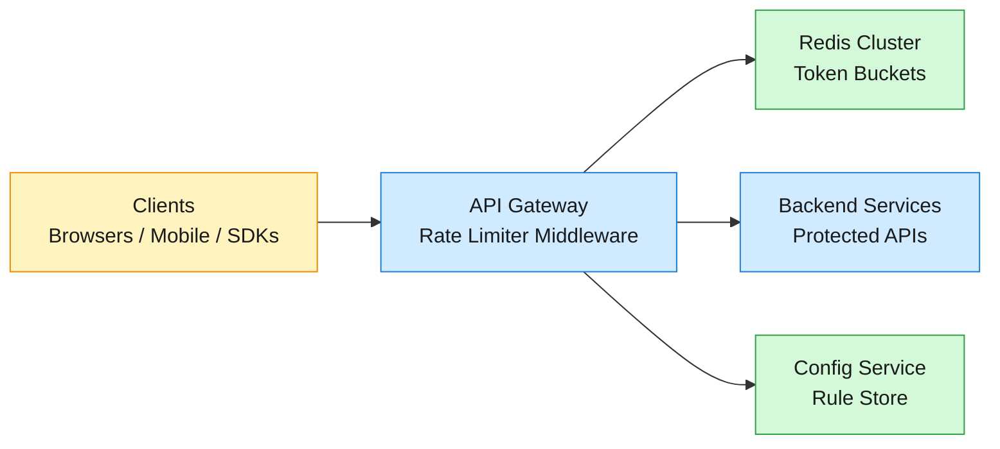
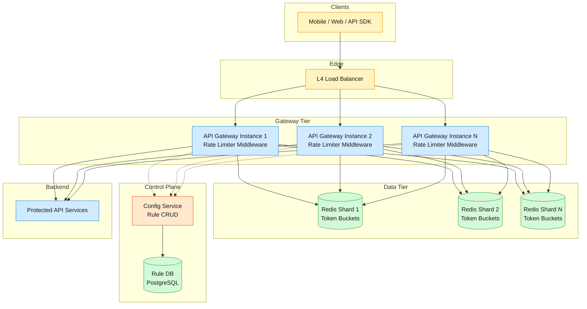
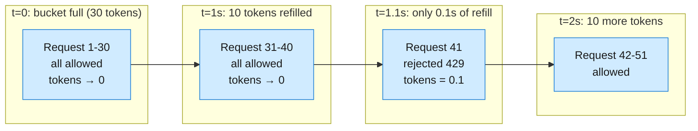
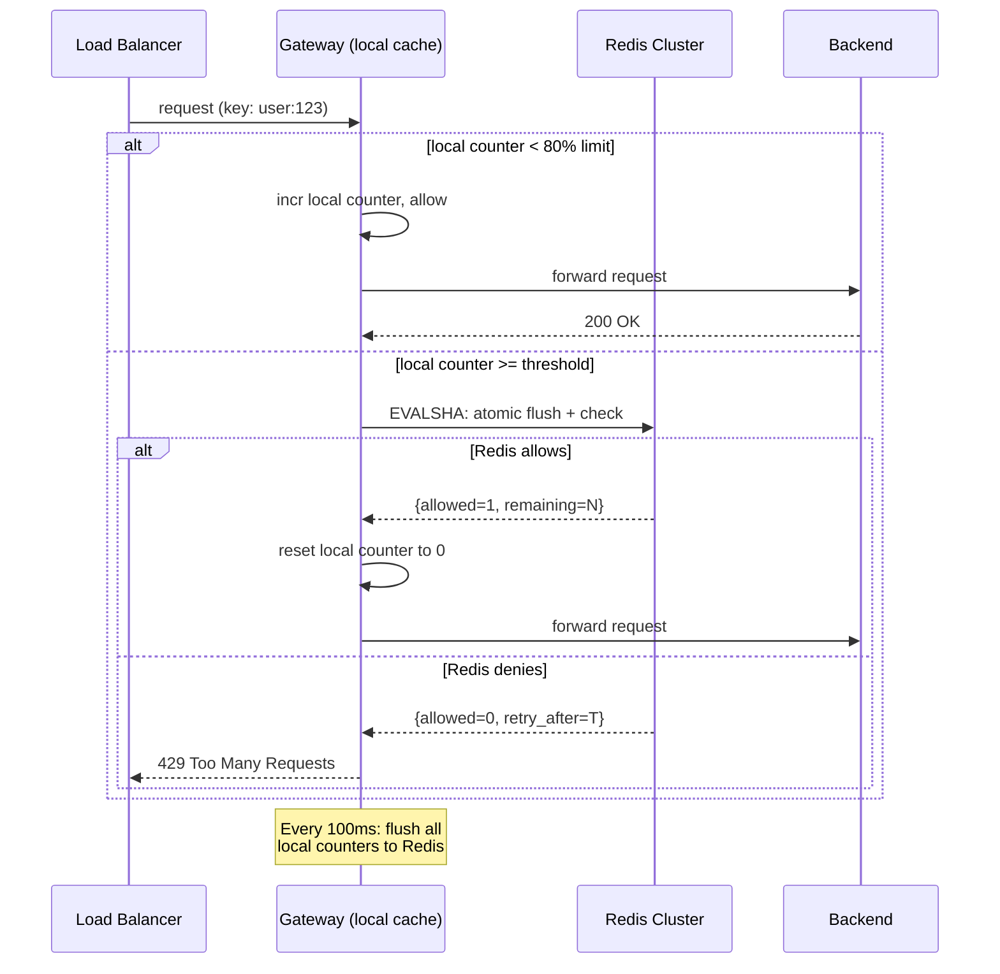

How a distributed rate limiter adds under 1 ms of p99 latency while enforcing per-client, per-endpoint, and global limits at 1M requests/sec — a deep dive into token buckets, sliding windows, Redis-backed counters, and failing open without opening the floodgates.

<!--more-->

## 1. Problem
A rate limiter is the traffic controller for an API — it tracks how many requests each client makes, enforces configurable ceilings, and rejects excess traffic with HTTP 429 before it reaches backend services. Without one, a single misbehaving client or a spike in legitimate demand can saturate shared resources and degrade the experience for everyone else.



The rate limiter runs as middleware inside the API gateway — there is no extra network hop. Every request passes through a Lua script that atomically checks and decrements a token bucket in Redis. The decision is binary and immediate: allow (forward to backend) or deny (return 429 with `Retry-After`). The design must absorb bursts naturally (flash sales, viral content), survive Redis node failures without opening the floodgates, and support layered rules — per-user, per-endpoint, and global — without ballooning latency above a millisecond.
## 2. Requirements

**Functional**

- FR1: Identify clients by user ID, IP address, or API key from request headers.

- FR2: Enforce configurable rate limits per client, per endpoint, and globally.

- FR3: Reject excess requests with HTTP 429 and standard `X-RateLimit-*` headers.

- FR4: Support burst tolerance — allow brief traffic spikes above the steady-state limit.

- FR5: Dynamically add, update, and remove rules without restarting gateways.

- FR6: Enforce a concurrent request cap on expensive endpoints to prevent resource exhaustion from impatient retries.

**Non-functional**

- NFR1: Add less than 1 ms of latency at p99 to the request path.

- NFR2: Handle 1 million requests per second aggregate throughput across the cluster.

- NFR3: Remain available during Redis node failures without opening the floodgates.

- NFR4: Support 100 million daily active users with per-user counter state.

*Out of scope: L3/L4 volumetric DDoS mitigation, WAF and content inspection, authentication and authorization, billing and usage metering, per-tenant analytics dashboards.*

## 3. Back of the envelope

- 1M req/sec × 2 Redis operations per check (HGET + atomic Lua EVALSHA) → **2M Redis ops/sec**. A single Redis instance handles ~120K ops/sec → need **~20 shards** for headroom; Redis Cluster with consistent hashing across 20 shards provides ~2.4M ops/sec — comfortably above peak.
- 100M DAU with token bucket state per user (2 floats × 8 bytes + key overhead ~80 bytes) → **~8 GB** total working set. Fits in a 20-node Redis Cluster with 16 GB RAM per node, leaving room for replication overhead.
- At 1 ms latency budget, Redis round-trip must stay under 0.5 ms. Same-AZ deployment achieves ~0.3 ms; same-region ~1 ms.
## 4. Entities & API

```
Rule {
  rule_id:   uuid PK
  key_type:  enum     ← user_id | ip | api_key
  key_value: string?  ← null = applies to all clients of key_type
  endpoint:  string   ← * for global, /search, /upload, etc.
  limit:     integer  ← max requests per window_sec
  window_sec:integer  ← refill window in seconds
  burst_size:integer  ← max tokens the bucket can hold
  priority:  integer  ← lower = evaluated first; per-user beats global
  concurrent:integer? ← also enforce max in-flight (null = no concurrent limit)
}

Bucket {
  bucket_key: string PK ← composite: {key_type}:{key_value}:{rule_id}
  tokens:     float     ← current token count (can exceed limit up to burst_size)
  last_refill:timestamp ← monotonic clock, used to calculate refill delta
  inflight:   integer   ← current concurrent request count (concurrent rules)
  ttl:        timestamp ← auto-expire inactive buckets
}
```

**API**
- `POST /v1/check` — check whether a request is allowed. Body: `{key_type, key_value, endpoint}`. Returns `{allowed: bool, remaining: int, reset_at: timestamp, retry_after_sec: int}`. Gateway calls this as middleware on every inbound request.
- `GET /v1/limits?key_type=<t>&key_value=<v>` — return all active limits and current remaining counts for a client.
- `PUT /v1/rules/<rule_id>` — upsert a rate limit rule. Body: `{key_type, key_value?, endpoint, limit, window_sec, burst_size, priority, concurrent?}`.
- `DELETE /v1/rules/<rule_id>` — remove a rule. Active buckets for that rule expire naturally via TTL.
- `GET /v1/rules` — list all active rules, ordered by priority.
## 5. High-Level Design



#### FR1: Identify clients by user ID, IP, or API key
The gateway extracts the client identity from incoming request headers before any rate limiting logic runs:
- **User ID:** Parsed from a signed JWT in the `Authorization: Bearer <token>` header. The JWT is validated once at the edge (by an auth middleware that runs before rate limiting), and the extracted `user_id` is attached to the request context. This is the most reliable key — it survives NATs, device changes, and IP rotation.
- **IP address:** Read from `X-Forwarded-For` (trusting the upstream L4 load balancer or CDN to set it). Used for unauthenticated endpoints and as a fallback when no JWT is present. NATs and carrier-grade NATs make IP an imperfect identifier — corporate offices and mobile carriers can share a single IP across thousands of users — so IP-based limits are set higher than user-based limits.
- **API key:** Read from `X-API-Key` header. Used for developer-facing APIs where rate limits are negotiated per integration rather than per end user.
The gateway normalizes all three into a uniform `{key_type}:{key_value}` tuple. If multiple identities are present (e.g., a user behind an IP that also has a per-IP rule), the strictest limit wins.
#### FR2: Enforce configurable rate limits
The core algorithm is a **token bucket** implemented as an atomic Lua script in Redis. Each `Bucket` row holds two fields: `tokens` (current count, initialized to `burst_size`) and `last_refill` (monotonic timestamp of last check). On every request:
1. Gateway hashes `bucket_key` to a Redis shard using CRC16 (Redis Cluster's native slot assignment).
2. Gateway calls `EVALSHA <sha> 1 <bucket_key> <now> <burst_size> <refill_rate>` where `refill_rate = limit / window_sec`.
3. The Lua script atomically: reads `tokens` and `last_refill`, computes `tokens_to_add = (now - last_refill) × refill_rate`, sets `tokens = min(burst_size, tokens + tokens_to_add)`, then checks if `tokens >= 1`. If yes, decrements by 1, updates `last_refill = now`, refreshes TTL, and returns `{1, remaining_tokens, reset_at}`. If no, returns `{0, 0, reset_at}`.
4. Gateway reads the Lua return value. On allow, forward to backend. On deny, return 429.
Why Lua scripting is essential: a naive read-check-write with `HMGET` then `HSET` has a race condition — two concurrent requests both read `tokens=1`, both allow, effectively doubling the rate. Lua executes the entire read-calculate-update sequence inside Redis's single-threaded event loop, making it atomic without locks.
#### FR3: Reject with HTTP 429 and standard headers
When the Lua script returns `allowed=0`, the gateway responds immediately — no queuing, no backpressure. Queuing rejected requests consumes memory, adds unpredictable latency, and clients retry anyway.

```javascript
HTTP/1.1 429 Too Many Requests
X-RateLimit-Limit: 100
X-RateLimit-Remaining: 0
X-RateLimit-Reset: 1719705600
Retry-After: 42
Content-Type: application/json

{"error":"rate_limit_exceeded","retry_after_sec":42}
```

The `Retry-After` header is computed by the Lua script as `ceil((1 - tokens) / refill_rate)` — the number of seconds until at least one token refills. Clients that honor this header naturally spread their retries without coordination.
#### FR4: Support burst tolerance
The token bucket naturally supports bursts through its `burst_size` parameter. A client with `limit=10/sec` and `burst_size=30` can send 30 requests in the first instant (consuming the full bucket), then settles into the steady 10/sec refill rate. This handles flash sales, batch API calls, and cold-start traffic spikes without special-casing.
The alternative — a strict sliding window that rejects every request above the per-second rate — is simpler but punishes legitimate traffic patterns. Token bucket is the standard in production: Stripe uses it for all four of their rate limiter types, and NGINX's `burst` + `nodelay` parameters implement the same concept.



#### FR5: Dynamic rule configuration
Gateways poll the Config Service every 30 seconds for rule updates. The Config Service exposes `GET /v1/rules` with an `If-Modified-Since` header — gateways send a `last_polled_at` timestamp and receive only rules changed since then. This is simpler than push-based config (ZooKeeper watch storms on mass reconnect) and the 30-second window is acceptable because rate limit rule changes are operational, not real-time.
When a gateway picks up a new rule, it does not need to create buckets in Redis — the Lua script initializes `tokens = burst_size` on first access of a new `bucket_key`. When a rule is deleted, the gateway stops evaluating it; existing buckets expire via TTL.
Rule evaluation is ordered by `priority`. Per-user rules (priority 10) beat per-endpoint rules (priority 50) beat global catch-alls (priority 100). The gateway evaluates rules in order and stops at the first match.
#### FR6: Concurrent request limiting
For CPU-intensive or database-saturating endpoints, a request-per-second cap is insufficient — a user can open 20 parallel connections and all 20 land simultaneously, each within the per-second allowance. The concurrent request limiter adds a second dimension: a semaphore in Redis that tracks in-flight requests.
The Lua script for concurrent limiting increments `inflight` on request start (gated by `concurrent` in the Rule) and decrements it when the gateway receives the backend's response. If `inflight >= concurrent`, the request is rejected with HTTP 429 (or 503, if the system prefers "service unavailable" semantics for server-side resource pressure). Stripe triggers this limiter ~12,000 times per month — an order of magnitude less than the request-rate limiter, but critical for preventing retry storms on expensive endpoints.
## 6. Deep dives
### DD1: Token Bucket vs Sliding Window Counter — algorithm selection
**Problem.** The rate limiter must accurately enforce a per-second or per-minute ceiling while minimizing memory per client and CPU per check. The algorithm choice determines whether the system can handle 1M req/sec within the 1 ms latency budget, and whether the ceiling is actually respected at boundary conditions.
**Approach: Fixed Window Counter.** Divide time into discrete windows (e.g., 1-minute buckets). Maintain one counter per client per window. On each request, increment the counter for the current window. Reject if the counter exceeds the limit.
- *Pro:* Trivially simple — one integer per client. Atomic `INCR` in Redis, no Lua needed.
- *Con:* Boundary effect — a client sending 100 requests at 12:00:59 and 100 requests at 12:01:00 achieves 200 requests in 2 seconds while respecting a 100/min limit. This is not a theoretical edge case; it is the default behavior of any time-windowed counter and defeats the purpose of rate limiting.

**Approach: Sliding Window Log.** Store the timestamp of every request in a sorted set per client. On each check, remove timestamps older than the window, then count remaining entries. Reject if count exceeds limit.
- *Pro:* Perfect accuracy — no boundary effect, no approximation.
- *Con:* Memory explodes. A client making 1,000 req/sec for a 1-hour window stores 3.6M timestamps. Multiply by millions of clients and the working set is terabytes, not gigabytes.

**Approach: Sliding Window Counter (hybrid).** Maintain only two counters per client: one for the current window, one for the previous window. The effective count at time `t` (fraction `f` into the current window) is: `count = previous_window × (1 - f) + current_window`. If `count < limit`, increment `current_window` and allow. If the limit is crossed, reject.
- *Pro:* Exactly two counters per client (16 bytes). Cloudflare measured a **0.003% error rate** at 400M requests — the weighted approximation is nearly exact for real traffic patterns because the assumption of uniform request distribution within a window is statistically valid at scale. Memory footprint is independent of request volume.
- *Con:* Still an approximation. Under pathological patterns (all requests arriving in the first 1% of each window), the counter underestimates and allows more traffic than intended. Also cannot express burst tolerance natively — the bucket must fill at a fixed rate.

**Approach: Token Bucket (chosen).** A bucket holds up to `burst_size` tokens, refilling at `rate = limit / window_sec` tokens per second. Each request consumes 1 token. The bucket state is `{tokens, last_refill}` — two values, same memory as sliding window counter.
- *Pro:* Burst tolerance is built in — the bucket capacity is the burst ceiling. Refill is continuous and smooth. Two fields per client, same memory cost as sliding window counter. The algorithm is intuitive to operators: "100 requests per second, burst to 500" maps directly to `limit=100, burst_size=500`. Stripe, Envoy, and NGINX all use token bucket in production.
- *Con:* Slightly more complex to implement atomically (requires Lua for read-calculate-update). A client that goes silent and returns will find a full bucket — intentional, but can surprise operators who expect "100 per second" to mean a hard ceiling.

**Decision:** Token bucket as the default algorithm. Offer sliding window counter as a configurable option for operators who need a hard ceiling with no burst tolerance.
**Rationale:** The choice mirrors what production systems converge on. Stripe's engineering blog describes token bucket as their primary algorithm across all four rate limiter types. Cloudflare's sliding window counter implementation (described in their blog post "How we built rate limiting capable of scaling to millions of domains") achieves 0.003% error at planetary scale — not because the approximation is theoretically perfect, but because real traffic is smooth enough that the hybrid weighting works. The key insight is that **burst tolerance is a feature, not a bug**: APIs experience bursts (deployments, cache invalidations, cron jobs) and a hard ceiling forces client-side retry logic that is more expensive than absorbing the burst server-side. Token bucket absorbs the burst and settles into the steady rate — the best of both worlds.
**Edge cases:**
- **Bucket initialization race:** Two gateways process the first request for a new client simultaneously. Both see no bucket in Redis, both initialize `tokens = burst_size`. The client gets 2× burst on first access. Mitigation: the Lua script uses `SETNX` (set-if-not-exists) to initialize the bucket atomically — only one gateway wins the initialization race.
- **Clock skew between gateways:** If gateway A's clock is 100 ms ahead of gateway B's, `last_refill` timestamps are inconsistent. The Lua script uses Redis's own `TIME` command (not the gateway's clock) for `now`, avoiding this entirely. All gateways see the same Redis monotonic time.
- **Token underflow with sub-1-token rates:** A rule of `limit=1, window_sec=60` means `refill_rate = 1/60 ≈ 0.0167 tokens/sec`. A request arriving 55 seconds after the last one should have `0.0167 × 55 ≈ 0.92 tokens` — not enough for one request. The Lua script uses floating-point arithmetic and rejects until `tokens >= 1.0`. The client sees a `Retry-After: 5` header and waits.
### DD2: Storage layer — Redis vs in-memory vs hybrid
**Problem.** Every request reads and writes counter state. At 1M req/sec, that is 2M state operations per second — 1M reads, 1M writes. The storage layer must serve these operations with sub-millisecond latency while maintaining consistency across multiple gateway instances.
**Approach: In-memory per gateway (no shared state).** Each gateway instance maintains its own hash table of buckets. No network call, pure memory access — single-digit microseconds.
- *Pro:* Fastest possible — no network, no serialization. Trivially simple implementation. No single point of failure.
- *Con:* No coordination across instances. A client behind an L4 load balancer can be routed to different gateways on each request. If gateway A sees 50 requests and gateway B sees 50 requests, both allow them — the client achieves 2× the limit. For sticky-session architectures this can work, but sticky sessions break on gateway restarts, deployments, and scale-out events.
- *Verdict:* Unusable for horizontally-scaled API gateways. Only viable for single-instance deployments or architectures where the rate limiter sits upstream of the load balancer.

**Approach: Centralized Redis with synchronous reads.** Every gateway checks and updates Redis on every request.
- *Pro:* Single source of truth — all gateways see the same bucket state. Atomic Lua scripts eliminate race conditions. Redis's single-threaded event loop serializes operations on the same key naturally. TTL-based cleanup eliminates garbage collection.
- *Con:* Every request pays the network round-trip (~0.1–0.3 ms same-AZ, ~1 ms cross-AZ). Under DDoS or traffic spikes, Redis becomes the bottleneck — a single instance caps at ~120K ops/sec. At 1M req/sec, the Redis cluster itself is a significant operational cost (20+ sharded instances).

**Approach: Hybrid — local in-memory cache with async flush to Redis (chosen for high-scale deployments).** Each gateway maintains a local, approximate counter for hot keys. On every request, the gateway first checks the local counter. If the local counter is below a threshold (e.g., 80% of limit), increment locally and allow immediately — no Redis call. Periodically (every 100 ms or when the local counter crosses the threshold), flush the accumulated count to Redis. Redis enforces the global limit; the local cache reduces Redis load proportionally.
- *Pro:* Cloudflare documented this approach under DDoS: async counting with local cache achieves **10× the throughput** of synchronous memcache under attack, because most requests never touch the central store. Under normal traffic, the local cache absorbs 80-95% of operations.
- *Con:* Approximation — the global limit may be slightly exceeded during the flush interval. A client sending a burst distributed across 10 gateways could exceed the limit by up to `10 × local_threshold`. The tradeoff is controlled by tuning the flush interval and local threshold: shorter intervals and lower thresholds reduce overshoot at the cost of more Redis operations. For most APIs, a 5-10% overshoot during bursts is acceptable; the alternative (precise enforcement with Redis on every call) costs 20× more infrastructure.

**Decision:** Redis + Lua as the default (simple, correct, sufficient for most deployments). Hybrid local cache + async flush as an opt-in mode for deployments exceeding 500K req/sec or facing DDoS.
**Rationale:** This mirrors the evolution of production rate limiters. Stripe uses Redis (ElastiCache) synchronously — their scale (~hundreds of thousands of requests/sec) fits comfortably within a Redis Cluster. Cloudflare, operating at 400M+ requests/sec across millions of domains, needs the hybrid approach to survive DDoS without deploying thousands of Redis nodes. The default should be simple and correct; the escape hatch should be documented and available. Most systems never need the hybrid mode — YAGNI applies.



**Edge cases:**
- **Gateway crash with unflushed local counters:** The local counters are lost. Redis has a stale (lower) count. The client gets a brief window of extra capacity on the next request — the limit is slightly under-enforced for one flush interval. Acceptable for rate limiting, which is a soft guarantee.
- **Redis partition during hybrid mode:** The gateway cannot flush. If the local counter is below the flush threshold, the gateway continues allowing requests locally (optimistic). After a configurable grace period (e.g., 5 seconds without a successful Redis flush), the gateway falls back to fail-closed — it rejects all requests until Redis recovers. This prevents unbounded overshoot during extended partitions.
### DD3: Coordination across replicas
**Problem.** Multiple API gateway instances, each possibly in a different AZ or region, must enforce a single global limit per client. Redis provides the shared state, but three coordination challenges remain: (a) how do gateways discover the correct Redis shard for a given bucket key, (b) how do rule updates propagate to all gateways consistently, and (c) what happens when a Redis shard fails?
**Shard discovery.** Redis Cluster divides the keyspace into 16,384 hash slots. The CRC16 of `bucket_key` determines the slot, and each shard owns a range of slots. Redis Cluster clients (like `ioredis` for Node, `redis-py-cluster` for Python, `go-redis` for Go) maintain a slot-to-node map and route commands automatically. When a shard is added or removed, the cluster reshuffles slots — the client library refreshes its map on `MOVED` redirections.
For consistent-hashing deployments without Redis Cluster's built-in sharding, the gateway applies a hash function (e.g., MD5 of `bucket_key` → first 8 hex digits → modulo shard count) and connects directly to the target shard. This is simpler to operate than Redis Cluster (no cluster bus, no gossip protocol) but requires manual resharding when adding nodes — consistent hashing with virtual nodes minimizes key migration.
**Rule propagation.** Gateways poll the Config Service every 30 seconds. The Config Service stores rules in PostgreSQL with a `version` column (monotonic integer). Each poll sends `GET /v1/rules?since_version=<last_seen>`. The Config Service returns only changed rules. This is **poll-based, not push-based** — simpler, works across network partitions (gateways cache the last known rule set), and the 30-second staleness window is acceptable. Rule changes are operational (minutes-to-hours cadence), not real-time (seconds).
**Redis shard failure.** The gateway's Redis client detects a connection failure to a shard (timeout or TCP RST). The behavior depends on the deployment mode:
- **Redis Cluster with replicas:** The cluster promotes a replica to master. The gateway client refreshes its slot map (on the next `MOVED` or `ASK` redirection) and resumes. The failover window is typically 1–3 seconds. During this window, requests to buckets on the failed shard are rejected (fail-closed).
- **Standalone Redis with no replicas:** Requests to the failed shard are rejected until the shard recovers or an operator manually reassigns its key range. This is a deliberate choice: **fail-closed is safer than fail-open**. Allowing all requests when Redis is down (fail-open) turns a rate limiter outage into a backend overload outage — the rate limiter's job is to prevent exactly that cascade. Stripe explicitly chose fail-closed for all four of their rate limiter types.

**Decision:** Redis Cluster for auto-sharding and auto-failover. Poll-based rule propagation with 30-second interval. Fail-closed on Redis unavailability.
**Rationale:** Redis Cluster provides sharding, replication, and failover out of the box — no external coordination service (ZooKeeper/etcd) needed. The operational simplicity of polling over pushing comes from production experience: Stripe's rate limiter blog emphasizes building kill switches and monitoring before optimizing rule propagation latency. A 30-second rule update lag is acceptable when rules change a few times per day; if sub-second propagation is needed, the pattern shifts to a push-based system like ZooKeeper, but that adds operational complexity (ZK ensemble, watch storms, session management) that is rarely justified for rate limiting.
**Edge cases:**
- **Split-brain during Redis Cluster partition:** Two nodes both believe they own the same slot range. Writes to both nodes create divergent bucket states. Redis Cluster's consensus protocol (based on epoch numbers and majority voting) prevents this in correctly configured deployments. If it occurs despite safeguards, the rate limiter may briefly under-enforce limits — the TTLs on bucket keys ensure the divergence is short-lived.
- **Gateway restart with stale rule cache:** The gateway starts up and immediately loads rules from its last persisted snapshot (written to disk on graceful shutdown). It then polls the Config Service. There is a startup window (≤ 30 seconds) where the gateway enforces potentially stale rules. Acceptable — the rules are almost always the same, and the window is bounded.
### DD4: Rate limit key hierarchy — per-user, per-endpoint, global
**Problem.** A single rate limit ceiling is too coarse. Different endpoints have different costs (`/search` is expensive, `/health` is cheap). Different clients have different entitlements (free tier vs premium). Some limits should apply globally (protect the entire API from aggregate overload), others per user (fairness), others per endpoint (protect expensive resources). The key hierarchy must compose without creating N² state explosion.
**Approach: Flat evaluation loop (chosen).** All rules live in a flat list ordered by priority. The gateway iterates through the list for each request, stopping at the first rule that matches the request's `{key_type, key_value, endpoint}`. A rule matches if:
- `rule.key_type == request.key_type`
- AND (`rule.key_value IS NULL` OR `rule.key_value == request.key_value`)
- AND (`rule.endpoint == '*'` OR `rule.endpoint == request.endpoint`)
The bucket key is `{key_type}:{key_value}:{rule_id}` — a composite that isolates state per rule. This means a single user matched by a per-user rule and a per-endpoint rule has two independent buckets, and the stricter one fires first.
**Layered defense example (inspired by Stripe's 4-layer model):**

```javascript
Priority 10: per-user, per-endpoint   — user:alice on /search: 10 req/min
Priority 20: per-user, global         — user:alice on *:        1000 req/min
Priority 30: per-IP, global           — ip:203.0.113.5 on *:   500 req/min
Priority 50: global, per-endpoint     — * on /search:           5000 req/min
Priority 100: global                  — * on *:                 100000 req/sec
```

A request from Alice to `/search` matches priority 10 first: 10 req/min. A request from an unauthenticated IP to `/health` skips priorities 10–20 (no user), matches priority 30: 500 req/min. A DDoS flood across all endpoints hits priority 100 as the last line of defense.
- *Pro:* Simple to reason about. Operators add rules in priority order and the gateway evaluates deterministically. No fancy composition algebra. Stripe uses exactly this flat evaluation model.
- *Con:* No hierarchical quota sharing — a premium user's limit cannot borrow from a pool of unused free-tier capacity. For that, a more complex quota system (like Google's CPU-seconds quota model) is needed, but that is a different problem (resource allocation, not rate limiting).

**Decision:** Flat priority-ordered rule list with composite bucket keys. No hierarchical nesting.
**Rationale:** Production rate limiters overwhelmingly use flat rules. NGINX's `limit_req_zone` directives are evaluated top-to-bottom. Stripe's four rate limiter types are independent flat rules. Envoy's descriptor-based rate limiting generates a flat set of descriptor tuples evaluated in order. Hierarchical quotas (e.g., a user draws from a team pool which draws from an org pool) require a different system — a resource quota manager, not a rate limiter. Keeping rate limiting flat keeps it fast (O(rules) evaluation, typically < 50 rules, well under 1 ms) and debuggable (operators can trace exactly which rule blocked a request).
**Edge cases:**
- **Rule explosion:** 10,000 endpoints × 3 key types × 100K users = 3 billion potential rules. The flat list is bounded at ~100 rules — rules use `key_value=NULL` and `endpoint='*'` as catch-alls. Per-user rules are reserved for high-value clients (enterprise tiers, abusive users on blocklists), not every user.
- **Shadowing:** A high-priority rule with `key_value='*'` and `endpoint='/search'` matches every request to `/search` before per-user rules can be evaluated. Prevented by sorting per-user rules at lower priority numbers (higher priority) than catch-all rules. The Config Service's validation rejects rules where a catch-all shadows a specific rule at a higher priority number.
- **Rule update race:** Gateway A evaluates rules while Gateway B receives a rule update. Gateway A uses the old set for this request. The window is ≤ 30 seconds (poll interval). Acceptable — rate limiting is eventually consistent by design.
## 7. Trade-offs
| Decision | Chosen | Rejected | Why |
|---|---|---|---|
| Algorithm | Token bucket | Fixed window counter, sliding window log | Token bucket provides burst tolerance natively; fixed window has boundary defects; sliding window log memory explodes at scale |
| Storage | Redis + atomic Lua | In-memory per-gateway | In-memory state is not shared across gateway instances — two gateways each allow the limit, doubling the effective rate |
| Rate limiter placement | API Gateway middleware | Sidecar, dedicated service, library | Middleware adds no extra network hop; dedicated service adds 1–2 ms RTT; sidecar duplicates state across instances; library couples rate limiting to application deploy cycle |
| Coordination | Poll-based config (30s interval) | Push-based (ZooKeeper/etcd) | Polling is simpler, survives partitions (cached rules), and rule changes are operational (minutes), not real-time; push adds ZK ensemble complexity |
| Failure mode | Fail-closed (reject all) | Fail-open (allow all) | Fail-open during Redis outage turns a rate limiter failure into a backend overload cascade — the rate limiter's job is to prevent exactly that |
| Rule hierarchy | Flat priority-ordered list | Hierarchical nested quotas | Flat rules are fast (O(n) where n < 100), debuggable, and match production systems (Stripe, NGINX, Envoy); hierarchical quotas are a different problem (resource allocation) |
| Reject strategy | Immediate 429 with Retry-After | Queue and retry server-side | Queuing consumes memory, adds unpredictable latency, and clients retry anyway; immediate rejection pushes backpressure to the client |
| Hybrid caching | Opt-in local counter + async flush | Always-on (adds complexity for all) | Synchronous Redis is sufficient for most deployments; hybrid mode is for DDoS or >500K req/sec — YAGNI for the default path |
## 8. References
1. [HelloInterview — Rate Limiter](https://www.hellointerview.com/learn/system-design/in-a-hurry/rate-limiter) — FR-driven walkthrough, algorithm comparison, Redis + Lua implementation, scaling with consistent hashing
2. [Stripe Engineering Blog — Rate Limiters](https://stripe.com/blog/rate-limiters) — Production implementation: 4 rate limiter types (request rate, concurrent, fleet shed, worker shed), token bucket + Redis, fail-closed, kill switches
3. [Cloudflare Blog — How We Built Rate Limiting](https://blog.cloudflare.com/how-we-built-rate-limiting/) — Sliding window counter at 400M req/sec with 0.003% error, hybrid local cache + async flush under DDoS
4. [NGINX Blog — Rate Limiting with NGINX](https://www.nginx.com/blog/rate-limiting-nginx/) — Practical burst handling with `burst` + `nodelay`, shared memory zones, per-IP limiting at the edge
5. [Google SRE Book — Handling Overload](https://sre.google/sre-book/handling-overload/) — Client-side adaptive throttling, CPU-seconds vs request-count quotas, load shedding as distinct from rate limiting
6. [Envoy Proxy — Rate Limiting](https://www.envoyproxy.io/docs/envoy/latest/configuration/http/http_filters/rate_limit_filter) — Descriptor-based rate limiting: separation of decision (rate limit service) from enforcement (sidecar proxy)
7. [Uber Engineering — Rate Limiting at Scale](https://www.uber.com/blog/rate-limiting-at-scale/) — Lock-free atomic CAS leaky bucket, cache-line padding, sharded rate limiter per service mesh node
