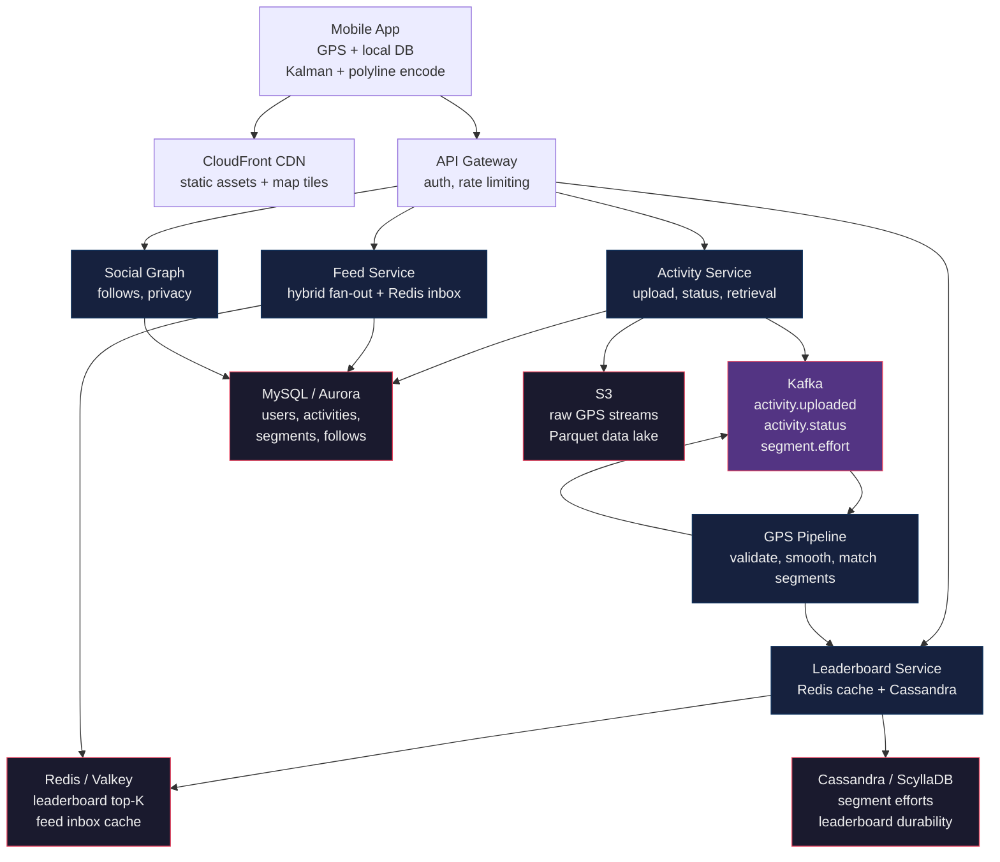
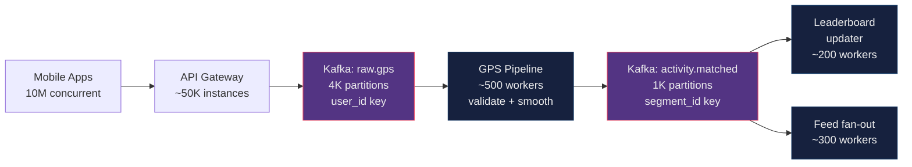
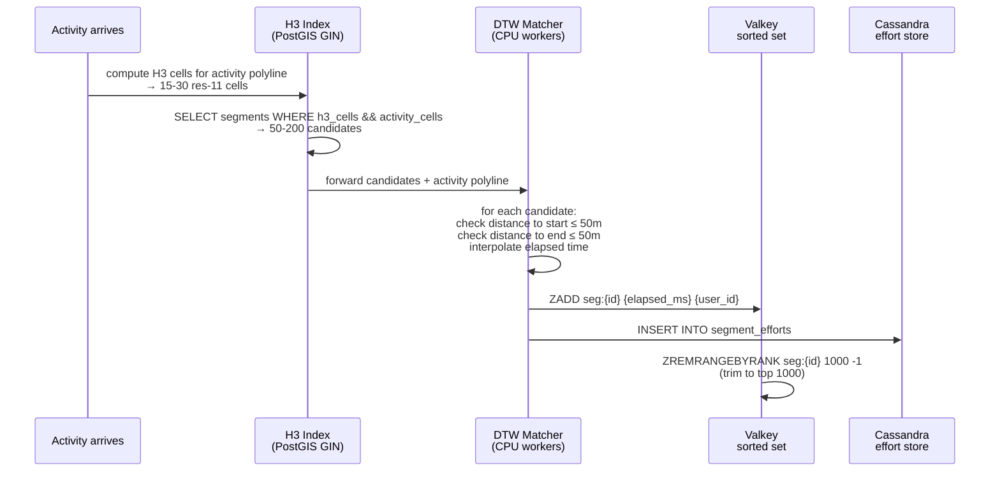

How Strava records GPS activities for millions of athletes and matches 10M daily activities against 50M segments with on-device polyline compression, H3 spatial pre-filtering, a Cassandra + Redis leaderboard tier, and hybrid feed fan-out — a deep dive into the athlete's social network.

<!--more-->

## 1. Problem
Strava is a social network for athletes — runners, cyclists, swimmers — who record GPS-tracked activities and share them with friends. Unlike a generic fitness tracker, Strava layers competition on top of every ride and run through **segments**: user-created route portions with leaderboards ranking every athlete who's ever covered that stretch. A 45-minute run through a park might match a dozen segments, each with its own leaderboard, all computed server-side post-upload.
The core tension: recording happens outdoors with unreliable cell service, yet athletes expect real-time splits and instant leaderboard results when they finish. The GPS pipeline must compress raw coordinate streams (81 KB for a 45-minute run) down to ~500 bytes without losing route fidelity. The segment matcher must compare each of 10 million daily activities against 50 million segments fast enough that leaderboards update within seconds. And the friend feed must deliver activity cards to millions of followers without the write-amplification death spiral that fan-out-on-write creates at scale.
## 2. Requirements

**Functional**

- FR1: Record, pause, resume, and save GPS-tracked activities

- FR2: View real-time distance, pace, and route during recording

- FR3: Browse a feed of friends' completed activities

- FR4: Compare segment times against other athletes on leaderboards

- FR5: Create and share custom route segments

- FR6: Follow athletes and control per-activity visibility

**Non-functional**

- NFR1: 99.9% availability during peak usage windows

- NFR2: Accurate local stats with intermittent connectivity

- NFR3: Offline recording with eventual upload sync

- NFR4: Scale to 10M concurrent recording sessions

*Out of scope: Comments, kudos, challenges, heatmaps, subscription billing, device integrations (Bluetooth HR monitors, power meters), anti-cheat heuristics.*

## 3. Back of the envelope

- **Write throughput:** 10M concurrent sessions × 1 GPS point/sec = 10M writes/sec sustained.
- **Daily storage:** 10M activities/day × ~2.7 KB (500 B GPS polyline + 2 KB metadata + 200 B segment efforts) ≈ 27 GB/day → ~10 TB/year.
- **Segment matching compute:** 10M activities/day × ~100 candidate segments = 1B comparisons/day ≈ 12K/sec sustained.
## 4. Entities & API

```
User {
  user_id       BIGINT PK
  email         VARCHAR(255) UNIQUE
  display_name  VARCHAR(100)
  privacy       ENUM(public, followers)  ← default profile visibility
  created_at    TIMESTAMP
}

Activity {
  activity_id   UUID PK                  ← client-generated, idempotent
  user_id       BIGINT FK
  sport_type    ENUM(run, ride, swim, hike, walk)
  start_time    TIMESTAMP
  end_time      TIMESTAMP
  polyline      TEXT                     ← compressed GPS, ~500B
  visibility    ENUM(everyone, followers, only_me)
}

Segment {
  segment_id    BIGINT PK
  name          VARCHAR(200)
  polyline      GEOMETRY(LineString)     ← PostGIS geometry
  h3_cells      BIGINT[]                 ← pre-computed H3 res-11 covering cells
  sport_type    ENUM(run, ride, ...)
  created_by    BIGINT FK
}

SegmentEffort {
  effort_id     UUID PK
  activity_id   UUID FK
  segment_id    BIGINT FK
  user_id       BIGINT FK
  elapsed_ms    INT                      ← time to cover the segment
  start_idx     INT                      ← first GPS point index in activity polyline
  end_idx       INT                      ← last GPS point index
  created_at    TIMESTAMP
}

Follow {
  follower_id  BIGINT FK
  followee_id  BIGINT FK
  created_at   TIMESTAMP
  CK (follower_id, followee_id)
}
```

**API**
- `POST /activities` — start a recording or upload a completed activity, returns `activity_id`
- `GET /activities/{id}` — activity details with polyline and matched segments
- `PATCH /activities/{id}` — pause, resume, or stop a live recording
- `GET /feed` — paginated feed of friends' recent activities
- `GET /segments/{id}/leaderboard` — ranked efforts for a segment, filterable by date range, following, clubs, age/weight class
- `POST /users/{id}/follow` — follow or unfollow a user
## 5. High-Level Design



#### FR1: Record GPS-tracked activities
**Components:** Mobile app → API Gateway → Activity Service → Kafka (`activity.uploaded`) → GPS Pipeline → S3 + MySQL
**Flow:**
1. App records GPS at 1 Hz into local SQLite buffer. Kalman filter smooths on-device, polyline encoding compresses to ~500 B.
2. On save, app computes `activity_id = SHA256(user_id || start_ts || first_5_points)[:16]` — deterministic, idempotent.
3. `POST /activities` with `{activity_id, polyline, start_time, end_time, sport_type, visibility}`.
4. Activity Service checks `SELECT 1 FROM activities WHERE activity_id = $1`. If exists → 200 (already processed). Else → insert with `status = 'processing'`, publish to Kafka, return 201.
5. GPS Pipeline consumes from Kafka: validates polyline (bounds check, speed sanity), runs H3 segment matching, writes `SegmentEffort` rows.
6. On pipeline completion, Activity status → `completed`. Push notification to device.

**Design consideration:** The deterministic activity ID eliminates duplicate uploads when the phone crashes after POST but before receiving the 201 response. Retry produces the same ID, server returns 200. This is cheaper and simpler than a distributed dedup cache. Strava's production blog calls out that without idempotency, activity duplication was a top-3 support issue. The trade-off: an attacker who knows another user's `user_id`, `start_ts`, and first 5 coordinates can craft a collision, but those coordinates are only available by physically tailing someone with a GPS logger.
#### FR2: View real-time stats during recording
**Components:** Mobile app (local Kalman + Haversine) → WebSocket (optional heartbeat) → Activity Service
**Flow:**
1. App computes distance, pace, and elevation on-device using Kalman-filtered GPS and Haversine formula. No server round-trip needed for split times.
2. Every 30 seconds, app sends a lightweight heartbeat: `PATCH /activities/{id}` with `{status: 'recording', elapsed_sec, last_known_position}` if connectivity available.
3. Server updates `Activity.end_time` estimate so friends see "X is 3.2 mi into a run" on live activity cards.
4. On pause, app logs a status transition: `{from: 'recording', to: 'paused', at_ts}`. Elapsed time excludes paused intervals.
5. On resume, new status transition logged. App continues accumulating GPS points from the last position.

**Design consideration:** The phone is the system of record during recording, not the server. Distance is computed locally because GPS arrives faster than any network round-trip, and athletes check pace every few seconds. The 30-second heartbeat is a fire-and-forget UDP-style POST — no retry, no ordering guarantee. If the server misses 3 consecutive heartbeats, the live activity card expires. This avoids the complexity of a persistent WebSocket connection for 10M concurrent sessions while still providing live presence to friends.
#### FR3: Browse friends' activity feed
**Components:** Mobile app → Feed Service → Redis (per-user inbox) → Activity Service → MySQL
**Flow:**
1. `GET /feed?cursor=<opaque>&limit=20` hits Feed Service.
2. Feed Service reads the requesting user's pre-computed inbox from Redis: `LRANGE feed:{user_id} {cursor_offset} {cursor_offset + 19}`.
3. Each inbox entry is a compact JSON blob: `{activity_id, user_id, display_name, sport_type, distance, duration, polyline_summary, matched_segments[]}`. No JOINs at read time.
4. For privacy, Feed Service strips activities where `visibility = 'followers'` and the viewer isn't following back, or `visibility = 'only_me'`.
5. Feed Service returns the page with a new opaque cursor encoding the Redis list index.

**Design consideration:** Inbox population uses a hybrid fan-out strategy. When an activity completes, the Feed Worker queries the Social Graph for followers. If follower count < 5,000: fan-out on write — `LPUSH feed:{follower_id} {activity_json}` + `LTRIM` to cap at 1,000 entries. If follower count ≥ 5,000: fan-out on read — the celebrity's activities go into a per-producer Redis list (`producer_feed:{user_id}`), and followers merge from their followed producers at read time. The 5,000 threshold comes from Twitter's production experience: above that, write amplification (5,000 Redis writes per activity) costs more than the read-path merge.
#### FR4: Compare on segment leaderboards
**Components:** Mobile app → Leaderboard Service → Redis sorted set (hot, top-1000) → Cassandra (cold, all efforts)
**Flow:**
1. `GET /segments/{id}/leaderboard?filter=following&page=2` hits Leaderboard Service.
2. Service checks Redis: `ZREVRANGE seg:{id}:top1000 {offset} {offset+19} WITHSCORES`. If cache hit → return immediately (sub-ms).
3. If cache miss or filtered query beyond top-1000: fall back to Cassandra `SELECT user_id, elapsed_ms FROM segment_efforts WHERE segment_id = $1 ORDER BY elapsed_ms ASC LIMIT 100`. Populate Redis cache on miss.
4. On new effort arrival (from Kafka `segment.effort` topic): `ZADD seg:{id}:top1000 {elapsed_ms} {user_id}`. If the set exceeds 1,000 entries after add, `ZREMRANGEBYRANK` drops the slowest.
5. Effort deletion (user hides activity): `ZREM seg:{id}:top1000 {user_id}`, then query Cassandra for the next-best effort by a different user, `ZADD` it back.

**Design consideration:** Cassandra stores every effort (70B+ rows in production) as the durable source of truth, partitioned by segment_id. Redis holds only the hot top-1,000 per segment in memory. At 50M segments × 1,000 entries × ~80 bytes/entry = ~4 TB, but only ~5% of segments are actively queried in any given week, so a 200 GB Redis cluster with LRU eviction handles the working set. Strava's V3 leaderboard rebuild adopted this exact pattern after their 60-node all-Redis V2 hit a $20K/month memory cost wall.
#### FR5: Create custom route segments
**Components:** Mobile app → Segment Service → MySQL (PostGIS)
**Flow:**
1. User traces a route on the map or selects a portion of a completed activity. `POST /segments` with `{name, polyline, sport_type}`.
2. Segment Service validates minimum segment length (100m), no self-intersection, and deduplication against existing segments within 10m.
3. On insert, pre-computes H3 cells at resolution 11 (~29m edge length) covering the segment polyline, stored in `h3_cells BIGINT[]`.
4. Returns `segment_id`. Backfill: async Spark job recomputes efforts for all historical activities whose H3 cells intersect the new segment's cells.

**Design consideration:** Pre-computing H3 cells at segment creation time shifts the O(N) spatial lookup cost from query time (every activity arrival) to write time (rare — a few thousand new segments/day vs 10M activities/day). The H3 hexagon system (Uber's open-source library) provides hierarchical, edge-case-free spatial indexing. Resolution 11 cells are ~29m across — fine enough that a segment covering 1 km produces ~8-15 cells, keeping the candidate intersection list small during matching.
#### FR6: Follow athletes and control visibility
**Components:** Mobile app → Social Graph Service → MySQL (follows table, user privacy settings)
**Flow:**
1. `POST /users/{id}/follow` upserts into `Follow` table. If already following, toggles to unfollow. Returns new follow state.
2. On activity visibility change: `PATCH /activities/{id}` with `{visibility: 'followers'}` → Activity Service updates the row. No feed retroactive purge needed — visibility is checked at feed read time in FR3 step 4.
3. Profile privacy: if `User.privacy = 'followers'`, non-followers see a blank profile page regardless of individual activity visibility.

**Design consideration:** Privacy is enforced at read time, not write time, so visibility changes take effect immediately for future reads without fan-out to pre-computed inboxes. The trade-off: an activity briefly visible as "everyone" may have been cached in a follower's Redis inbox before the owner changed it to "only_me." The feed read step re-checks visibility against the current Activity row, so the cached entry is filtered out before the follower sees it. This is acceptable under NFR1 (availability > consistency).
## 6. Deep dives
### DD1: Offline recording & sync
**Problem.** Athletes run trails, ride mountain passes, and swim in open water — all places with no cell service. Recording must continue uninterrupted, buffering GPS points locally for minutes or hours. When connectivity returns, the full activity must upload exactly once, with no duplicates and no lost data. The phone might crash mid-upload. Storage might fill up. The clock might be wrong after a battery swap.
**Approach 1: Deterministic UUID + idempotent upload**
Client generates `activity_id` from a hash of `(user_id, start_ts, first_5_GPS_points)`. On upload, server checks existence. If the ID is known → 200 (already processed). If unknown → insert + process.

```javascript
POST /activities
{
  "activity_id": "a1b2c3d4e5f6a7b8",
  "polyline": "_p~iF~ps|U_ulLnnqC_mqNvxq`@...",
  "start_time": "2026-06-30T06:14:22Z",
  "end_time": "2026-06-30T07:02:15Z",
  "sport_type": "run",
  "visibility": "everyone"
}

-- Server
SELECT 1 FROM activities WHERE activity_id = 'a1b2c3d4e5f6a7b8';
-- 0 rows → INSERT + publish to Kafka → 201
-- 1 row  → 200 (idempotent)
```

- **Battery optimization:** Use platform "significant location change" API when stationary (>30s no movement), resume 1 Hz on accelerometer-triggered motion. Flush GPS buffer to disk every 5 minutes.
- **Storage full:** If local SQLite write fails, alert user immediately (don't silently drop points). Keep the partial buffer; upload what exists.
- **Clock skew:** Use `SystemClock.elapsedRealtime()` (monotonic, unaffected by wall-clock changes) for elapsed time calculation. Use last-known-good NTP time for `start_time` timestamp. If wall clock is visibly wrong (>1 hour from server time), server flags activity for review but accepts it.

**Approach 2: Append-only log with server-assigned sequence numbers**
Client streams GPS points to a local append-only file. On connectivity, streaming upload sends points incrementally. Server tracks `last_received_seq` per activity. Resumes from the last acknowledged sequence number.
- **Challenges:** Requires a persistent connection or chunked upload protocol. Server must handle partial activities (activity "in flight"). If the client crashes and restarts, it must replay the local log to find the last acknowledged seq. More complex client state machine than the UUID approach. Wins on real-time visibility — friends see partial activity progress — but loses on simplicity for the common case (batch upload after run).

**Approach 3: CRDT-based merge**
Treat GPS stream as a conflict-free replicated data type. Client and server maintain independent copies; merge on connectivity using last-write-wins per point.
- **Challenges:** GPS stream is an ordered sequence, not a set. LWW per point doesn't preserve ordering. Operation-based CRDTs can handle ordered insertions but require causal delivery. Single-writer (one athlete per activity) means there's no genuine merge conflict — CRDT machinery is overhead with no benefit. Overkill for a system where 99% of activities upload once, succeed, and never need reconciliation.

**Decision:** Approach 1 (deterministic UUID + idempotent upload). Single-writer-per-activity eliminates genuine merge conflicts. The hash-based ID makes retry safe without any server-side dedup cache. Strava's engineering blog confirms this pattern in production — client-generated IDs with server idempotency checks handle uploads from 400+ device types without a centralized ID service.
**Rationale:** WhatsApp's message deduplication uses an identical pattern: client-generated IDs checked against a server-side Bloom filter. At 10M uploads/day, a UUID collision probability is 10M² / 2\^128 ≈ 3×10⁻²⁵ — indistinguishable from zero. The alternative (server-assigned IDs + retry with idempotency key) requires a separate idempotency store, adding latency and a failure mode.
**Edge cases:** (1) Two devices recording the same activity simultaneously — UUID differs due to different first GPS points, so both upload. Server should detect temporal overlap (<60s apart, same user) and flag for dedup. (2) User edits activity post-upload (trim start/end) — generates a new activity version, not an overwrite. (3) GPS denied by OS — app records manual entry activity (distance, duration) with a type flag; no polyline, still idempotent.
### DD2: Scaling 10M concurrent write sessions
**Problem.** 10M athletes recording simultaneously, each pushing a GPS point every second. That's 10M writes/sec sustained — 5× Kafka's recommended per-broker throughput. A single topic with 10M msg/sec saturates any practical broker fleet. Worse, the downstream pipeline (GPS smoothing, segment matching) must keep up without backpressure cascading into dropped points. Partition hot-spotting from celebrity athletes (users with millions of followers triggering expensive fan-outs) adds skew.
**Approach 1: Kafka partitioned by user_id with pipeline isolation**



- Kafka topic `raw.gps` with 4,000 partitions, keyed by `user_id`. At 10M msg/sec, that's 2,500 msg/sec per partition — well within the ~10K/partition practical limit.
- GPS Pipeline consumer group with 500 workers. Each worker claims ~8 partitions. Processes: validate bounds, Kalman smooth, Haversine distance, polyline encode. Pure CPU — scales horizontally.
- Pipeline output → Kafka topic `activity.matched` with 1,000 partitions, keyed by `segment_id`. This partitions leaderboard updates so a single segment's efforts are processed in order by one consumer.
- Leaderboard updater consumer group: 200 workers. Each does `ZADD` to Redis + `INSERT` to Cassandra.
- Feed fan-out consumer group: 300 workers. Checks follower count, decides write-fan-out vs read-fan-out path.

**Challenges:** At 4,000 partitions, Kafka broker metadata overhead is ~4 MB per broker (1 KB/partition). With 20 brokers, that's manageable. Rebalance storms when adding/removing consumers: with 500 consumers and 4,000 partitions, a single consumer restart rebalances ~8 partitions, taking ~2 seconds with cooperative rebalancing (KIP-429). Consumer group progress tracking uses 4,000 offset commits — at 30-second commit interval, that's 133 commits/sec, trivial.
**Approach 2: Regional edge ingestion with local processing**
Deploy ingestion clusters in 5-8 AWS regions. GPS points ingested and smoothed locally, then forwarded to a central pipeline only after activity completion. Reduces cross-region bandwidth and provides lower latency for local users.
- **Challenges:** Segment matching requires the global segment catalog (50M segments). Either replicate the catalog to every region (50M × 8 regions = 400M rows of replication) or route matching to a central service (defeating the latency win). Leaderboard updates need global ordering per segment — impossible to guarantee if two athletes on the same segment upload from different regions. Adds operational complexity (multi-region Kafka, cross-region replication lag) for a problem better solved by CDN edge caching for static content and single-region compute with good partitioning.

**Approach 3: Direct S3 write + batch processing**
Mobile apps write GPS buffers directly to S3 presigned URLs. A batch Spark job scans S3 every 5 minutes, processes new activities, and writes results to serving stores.
- **Challenges:** 5-minute batch latency violates the expectation of "leaderboard updated within seconds of finishing." Friend feed is delayed by up to 5 minutes. Segment matching is efficient in batch (Spark can partition by H3 cell) but athletes checking their phone right after a run see stale data. Works for analytics, not for real-time social features.

**Decision:** Approach 1 (Kafka partitioned by user_id). Single-region deploy behind CloudFront CDN for static assets. The 4,000-partition Kafka cluster handles the throughput; the pipeline decouples ingestion from processing so backpressure in segment matching doesn't drop GPS points.
**Rationale:** LinkedIn's Kafka deployment handles 7 trillion messages/day across ~100 brokers. At 10M msg/sec, our cluster is ~0.6 trillion/day — well within proven operating range. Strava's production blog describes an identical pattern: `event-activity` Kafka topic partitioned by activity/user, consumed by Spark Streaming workers that compute segment matches and emit to downstream topics. Their peak is lower (~2,500 leaderboard writes/sec) but the architecture scales linearly with partition count.
**Edge cases:** (1) Hot user: an athlete with 50M followers triggers 50M feed fan-out writes. Mitigation: celebrity path — fan-out on read instead, with a per-producer Redis list capped at 1,000 entries. (2) Partition skew: GPS Pipeline worker assigned a partition with a heavy user sees higher CPU. Mitigation: cooperative rebalancing redistributes partitions based on actual throughput metrics (not just count). (3) Kafka broker failure: with replication factor 3 and min.insync.replicas=2, a single broker loss causes no data loss. ~4,000 leader partition elections take ~2 seconds total.
### DD3: Real-time friend feed
**Problem.** When an athlete finishes a run, their followers should see the activity card in their feed within seconds. But fan-out on write means one activity → N Redis writes, where N is the follower count. A user with 100K followers generates 100K writes per activity. At 10M activities/day, that's billions of writes, most never read. Fan-out on read avoids the write amplification but makes every feed refresh a multi-join query across followed users — slow and expensive at scale.
**Approach 1: Pure fan-out on write**
Every activity completion triggers `LPUSH feed:{follower_id} {activity_json}` for every follower. Reads are a single O(1) Redis list range.

```javascript
-- On activity completion
follower_ids = SELECT followee_id FROM follows WHERE follower_id = $user_id
FOR EACH fid IN follower_ids:
    LPUSH feed:{fid} {compact_activity_json}
    LTRIM feed:{fid} 0 999
```

- **Pros:** Reads are single-digit milliseconds — one Redis call, no JOINs, no fan-in.
- **Cons:** A user with 2M followers (pro athlete, brand account) generates 2M Redis writes per activity. At 2 activities/week, that's 4M writes/week. If 100 such celebrities exist, that's 400M writes/week for a tiny fraction of activities. The Redis cluster bears this cost regardless of whether followers ever open the app.

**Approach 2: Pure fan-out on read**
No per-user inbox. On feed request, query the social graph for followed users, then query their recent activities, merge, sort by time.

```javascript
-- On feed request
followed = SELECT followee_id FROM follows WHERE follower_id = $me
activities = SELECT * FROM activities
             WHERE user_id IN (followed)
               AND visibility IN ('everyone', ...)
             ORDER BY end_time DESC
             LIMIT 20
```

- **Pros:** Zero write amplification. No storage cost for inboxes. Celebrity-heavy graphs pay no penalty.
- **Cons:** Feed request time grows with the number of followed users. Following 500 people means scanning 500 users' recent activity ranges. Database load is proportional to feed reads × followed count. At peak (Sunday 10 AM, everyone opens the app), the activity table is hammered.

**Approach 3: Hybrid fan-out with follower threshold**
Classify users into two buckets: **regular** (< 5,000 followers) and **celebrity** (≥ 5,000 followers).
For regular users: fan-out on write into Redis inbox lists, as in Approach 1. For celebrities: fan-out on read — their activities go into a per-producer Redis list (`producer_feed:{celebrity_id}`, capped at 100), and followers merge from their followed producers at read time.

```javascript
-- On celebrity activity completion (fan-out on read path)
LPUSH producer_feed:{celebrity_id} {activity_json}
LTRIM producer_feed:{celebrity_id} 0 99

-- On feed request for user following 3 celebrities + 120 regular users
-- Step 1: read pre-computed inbox (regular friends)
regular_activities = LRANGE feed:{my_id} 0 19

-- Step 2: pull from celebrities (capped, fast)
celebrity_activities = []
FOR EACH celeb IN my_celebrity_follows:
    celeb_activities += LRANGE producer_feed:{celeb} 0 4  -- last 5 each

-- Step 3: merge and sort by end_time, return top 20
```

- **Pros:** Write amplification capped at 5,000 × (regular user count). Celebrity writes cost O(1) regardless of follower count. Feed reads for regular users stay O(1) Redis call. Feed reads for users following celebrities add ~5-10 Redis calls (manageable).
- **Cons:** Threshold crossing — a user growing from 4,999 to 5,000 followers triggers a migration from fan-out-on-write to fan-out-on-read. Their existing inbox entries (from when they were regular) become stale after the switch.

**Decision:** Approach 3 (hybrid fan-out, 5,000 follower threshold). The 5,000 threshold is not arbitrary — Twitter's production fan-out service (Timeline Service) used this exact strategy before their Manhattan KV store rebuild. At <5K followers, write amp is cheaper than read-path fan-in; above 5K, the reverse holds.
**Rationale:** At 10M daily activities, with an average of 200 followers per user, pure fan-out-on-write generates 10M × 200 = 2B Redis writes/day. The celebrity tail (0.1% of users with >5K followers) accounts for ~15% of activities but would generate ~60% of write amplification without the threshold. The hybrid approach cuts total Redis writes by roughly half while keeping feed read latency at <20ms P99. Instagram's feed architecture uses a similar hybrid model with per-producer caches for high-follower accounts.
**Edge cases:** (1) Threshold crossing: when a user hits 5,000 followers, the Feed Worker atomically swaps their fan-out strategy — future activities go to `producer_feed`, existing inbox entries remain readable until they age out (1,000-entry cap, ~2 weeks for typical users). No migration needed. (2) Celebrity follows celebrity: a user following 50 celebrities generates 50 `LRANGE` calls at feed read time. Batching these into a Redis pipeline (not 50 sequential calls) keeps latency under 5ms. (3) Feed ordering: activities are ordered by `end_time` descending. A celebrity's activity from 10 minutes ago may appear above a regular friend's from 2 minutes ago if the merge isn't time-aware. The merge step in Step 3 uses a min-heap over all source lists ordered by `end_time`, producing a correctly time-ordered merged feed.
### DD4: Leaderboards
**Problem.** 50 million segments exist. Every new activity must be tested against every segment it might intersect. A naive pairwise comparison is 50M × 10M = 500 quadrillion operations/day. After matching, each segment's leaderboard must serve ranked top-100 queries in under 100ms, while accepting up to 2,500 updates/sec at peak (Sunday morning group rides). The leaderboard store must handle the long tail: 90% of segments have <100 efforts ever; 1% have >100K efforts and are queried constantly.
**Approach 1: PostGIS spatial query + MySQL query**
At activity upload, run a spatial query to find intersecting segments, then compute effort times server-side.

```sql
SELECT s.segment_id, s.polyline,
       ST_Distance(s.polyline, a.start_point) AS dist_to_start,
       ST_Distance(s.polyline, a.end_point) AS dist_to_end
FROM segments s
WHERE ST_DWithin(s.geography, a.polyline_geography, 50)
  AND s.sport_type = a.sport_type;
```

Then compute elapsed time per matched segment via point-in-polyline interpolation. Leaderboard: `SELECT user_id, MIN(elapsed_ms) FROM segment_efforts WHERE segment_id = $1 GROUP BY user_id ORDER BY 2 LIMIT 100`.
- **Challenges:** PostGIS `ST_DWithin` with GiST index on 50M segments still scans 500-2,000 candidate rows per activity. At 10M activities/day, that's 5B-20B index probes/day. GiST doesn't scale to 50M rows with 10M queries/day without aggressive partitioning. The leaderboard query does a full scan of `segment_efforts` per segment unless a composite index on `(segment_id, elapsed_ms)` exists — but with 70B effort rows, that index alone is ~3 TB. MySQL can handle this at low scale (Strava's "boring option") but at 10M activities/day, write volume overwhelms a single MySQL instance.

**Approach 2: H3 spatial pre-filter + Valkey sorted sets**
Pre-compute H3 resolution-11 cells for every segment. At activity upload, compute the activity's H3 cells, intersect with the segment H3 cell index. Only the ~100 intersecting segments proceed to DTW precise matching. Leaderboard stored in Valkey (Redis-compatible) sorted sets: `ZADD seg:{id} {elapsed_ms} {user_id}`.



- **Pros:** H3 pre-filter drops the candidate set from 50M to ~100 in ~5ms (GIN index scan). Valkey sorted sets provide O(log N) rank queries at sub-ms latency for hot segments. Cassandra stores the full effort history, decoupled from the read path.
- **Cons:** Valkey is in-memory — 50M segments × 1,000 entries × ~80 bytes = 4 TB. Need a large cluster or LRU eviction. DTW is CPU-intensive: ~10ms per candidate × 100 candidates = 1 second per activity. At 10M activities/day, that's ~116 activities/sec × 1 sec = 116 CPU-seconds/sec → ~120 worker instances needed.

**Approach 3: Kafka + Cassandra + Redis cache tier (Strava V3 pattern)**
Activity upload → Kafka (`activity.uploaded`) → stream processor computes segment matches → writes efforts to Cassandra → updates Redis cache (top-K only). Cassandra is the durable store. Redis is an ephemeral cache — loss degrades performance (reads fall back to Cassandra) but doesn't lose data.
- Cassandra table: `segment_efforts` with `PRIMARY KEY (segment_id, elapsed_ms, user_id)`. Partitioned by segment_id, clustered by elapsed_ms. Leaderboard query: `SELECT user_id, elapsed_ms FROM segment_efforts WHERE segment_id = $1 ORDER BY elapsed_ms ASC LIMIT 100` — a single partition read, no scatter-gather.
- Redis populated on cache miss: when a leaderboard request misses Redis, the service queries Cassandra, returns results, AND writes them to Redis with a 5-minute TTL.
- Redis populated on write: when a new effort arrives that cracks the top-1000, `ZADD` it directly.
- **Challenges:** Cassandra compaction overhead with 70B rows. ScyllaDB (Cassandra-compatible, C++ rewrite) eliminates GC pauses that plagued Strava's original Cassandra deployment — their "Horton" migration to ScyllaDB improved P99 latency by 10×. Redis cache invalidation: if an athlete deletes an activity, their effort must be removed from the Redis top-1000 for every matched segment. This requires either a tombstone in Redis or a periodic full rebuild.

**Decision:** Approach 3 (Kafka + Cassandra + Redis cache), with the H3 pre-filter from Approach 2 integrated into the stream processor. Cassandra provides durable, disk-backed storage that won't hit the memory cost wall that killed the V2 all-Redis architecture. Redis caches only the hot working set — the 5% of segments queried in any given week — keeping memory cost bounded.
**Rationale:** Strava's V3 leaderboard rebuild is the production proof. Their V2 (60 Redis nodes, 1.8 TB memory, $20K+/month upgrade cost) was abandoned because memory grew 43% in 12 months. V3 (Cassandra + ephemeral Redis cache) handles 2,500 leaderboard writes/sec with sub-ms reads for hot segments. ScyllaDB Summit 2023 confirms Strava now runs ScyllaDB (Cassandra-compatible) for the leaderboard store with consistent P99 < 10ms. The architecture is boring, tested at scale, and doesn't require inventing a new distributed consensus protocol for ranking.
**Edge cases:** (1) Popular segment skew: Manhattan's Central Park segments get 100× more traffic than a rural trail segment. Cassandra partition hot-spotting? No — each segment is its own partition. A popular segment's partition gets more writes (1,000/sec) but Cassandra handles that within a single node. Read load spreads naturally: 90% of reads hit Redis, never touching Cassandra. (2) Effort deletion race: athlete deletes activity → `ZREM seg:{id} {user_id}` + delete from Cassandra. Between delete and cache repopulation, a concurrent leaderboard read might see a stale top-1000. Mitigation: read checks Cassandra on cache hit if `cached_at < activity.updated_at`. (3) New segment cold start: 0 efforts → leaderboard returns empty. Async backfill Spark job scans the Parquet data lake for historical activities intersecting the new segment's H3 cells, computes efforts, and backfills Cassandra. Completes in ~10 minutes for a popular segment, ~1 hour for a remote one.
## 7. Trade-offs
| Decision | Choice | Alternative | Why |
|---|---|---|---|
| Activity ID generation | Client-generated UUID via hash | Server-assigned auto-increment | Idempotent retry without server round-trip; collision probability negligible (2\^128 space) |
| GPS compression | Kalman → RDP → Polyline (162×) | Server-side post-processing | Save 462 GB/day bandwidth; on-device Kalman improves real-time pace accuracy |
| Segment matching | H3 spatial pre-filter + DTW | PostGIS GiST only | Drops candidates from 50M to ~100 (5ms); DTW handles variable recording rates (1 Hz vs 5 Hz devices) |
| Leaderboard store | Cassandra durable + Redis cache | All-Redis (V2) | Memory cost wall at 60 nodes; Cassandra disk cost ~10× cheaper per GB |
| Feed fan-out | Hybrid (5K follower threshold) | Pure fan-out on write | Cuts write amplification ~50%; celebrity path eliminates 2M-write-per-activity tail |
| Primary DB | MySQL/Aurora | PostgreSQL + PostGIS | Strava's production choice; operational familiarity > spatial feature parity for the 20% of queries that are spatial |
| Message broker | Kafka (AWS MSK) | Kinesis, direct SQS | Kafka's partitioning model cleanly separates pipeline stages; consumer group rebalancing is solved |
| Real-time presence | 30-second heartbeat POST | Persistent WebSocket | Avoids 10M long-lived connections; GPS pipeline decoupled from presence display |
| Segment effort dedup | Best-effort (last write wins) | Strict exactly-once | Acceptable under NFR1 (availability > consistency); duplicates are rare and low-impact (user sees own best time) |
| Anti-cheat | Out of scope (deferred) | Server-side speed validation | Real Strava removed 14.85M anomalous efforts via backfill; design reserves a `flagged` field on SegmentEffort for future pipeline |
## 8. References
1. [Strava — Rebuilding the Segment Leaderboards (Parts 1-4)](https://medium.com/strava-engineering/rebuilding-the-segment-leaderboards-infrastructure-part-1-background-13d8850c2e77)
2. [Strava — The Boring Option: Segment Efforts Storage](https://medium.com/strava-engineering/the-boring-option-4a7c6ad16ab8)
3. [Strava — From Data Streams to a Data Lake](https://medium.com/strava-engineering/from-data-streams-to-a-data-lake-b6ca17c00a23)
4. [Strava — Tessa: 1 Billion Activities (Spatiotemporal Indexing)](https://medium.com/strava-engineering/tessa-1-000-000-000-strava-activities-1-spatiotemporal-dataset-d54c1eb0b600)
5. [ScyllaDB Summit — How Strava's NoSQL Move Keeps Athletes Moving](https://resources.scylladb.com/blog/how-strava-s-nosql-move-keeps-athletes-moving)
6. [AWS Startups — Lessons Learned Scaling Strava's Infrastructure](https://aws.amazon.com/blogs/startups/lessons-learned-in-scaling-stravas-infrastructure/)
7. [Strava Engineering — Mesos at Strava](https://medium.com/strava-engineering/mesos-at-strava-5ac98d00dacf)
8. [Strava — A Richer Activity (Parts 1-2)](https://medium.com/strava-engineering/a-richer-activity-part-1-58b6ce4bde6a)
9. [Confluent — Kafka Needs No Keeper (KIP-500, ZooKeeper Removal)](https://www.confluent.io/blog/removing-zookeeper-dependency-in-kafka/)
10. [Uber — H3: Hexagonal Hierarchical Geospatial Indexing System](https://github.com/uber/h3)
11. [Twitter — Reducing Timeline Latency with a Hybrid Fan-out Approach](https://blog.twitter.com/engineering/en_us/topics/infrastructure/2017/reducing-timeline-latency-with-a-hybrid-approach)
12. [Strava — Privacy Zones Update (Randomized Center Offsets)](https://medium.com/strava-engineering/update-to-privacy-zones-functionality-98a570f6ebb)
