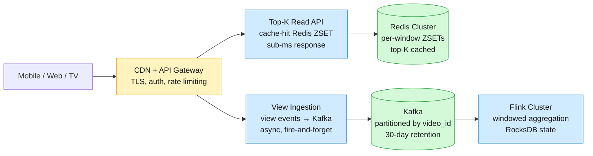
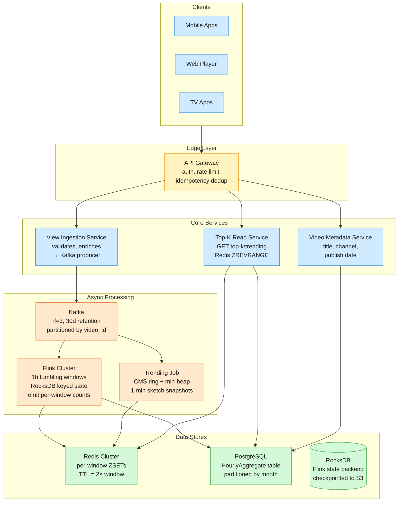
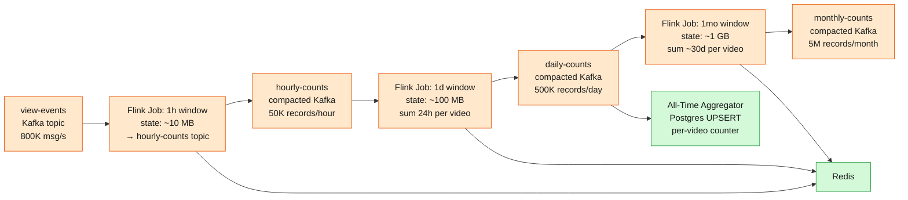

How a Top-K service ranks the most-viewed and trending videos across tumbling hour/day/month/all-time windows while ingesting 800K view events/sec (2M/sec at peak) — a deep dive into streaming aggregation, sketches, and sub-50ms ranked reads over a 3.6B-video catalog.

<!--more-->

## 1. Problem

YouTube viewers want to see what is most popular — the top K videos by view count and by trending velocity, sliced across tumbling windows of the last hour, day, month, and all time. The read side is a simple ranked list (K ≤ 1000) served to millions of concurrent users with sub-50ms latency. The write side ingests 70 billion view events per day — roughly 800,000 writes per second sustained, with viral spikes reaching 2 million per second — across a catalog of 3.6 billion videos. Three forces collide: the write volume demands aggregation before any durable store can absorb it, the read latency ceiling forbids scanning raw event tables at query time, and time windows multiply storage across four granularities.



## 2. Requirements

**Functional**

- FR1: Record a view event for a given video with sub-second acknowledgement
- FR2: Retrieve top K most-viewed videos per tumbling window: 1h, 1d, 1mo, all-time
- FR3: Retrieve trending videos ranked by view velocity over the last hour (sliding window)
- FR4: Display exact view count, velocity indicator, and rank change for each result
- FR5: Support K up to 1000 per window with ≤1 minute freshness

**Non-functional**

- NFR1: Ingest 800K view events/sec sustained; 2M/sec burst without backpressure
- NFR2: Top-K read latency p99 < 50ms for any window and any K ≤ 1000
- NFR3: Exact counts for tumbling windows; ≤1% error rate acceptable for trending
- NFR4: Zero permanent view loss; in-memory data reconstructible from the durable event log

*Out of scope: Personalized recommendations, arbitrary time-range queries, per-country or per-category filtering, anti-gaming/bot filtering.*

## 3. Back of the envelope

- **Write throughput:** 70B views/day ÷ 86,400 s ≈ 810K writes/sec → no single DB node absorbs this; the ingest path is the bottleneck (≈810 MB/sec at 1 KB/event, ~10 brokers at 100 MB/sec).
- **All-time storage:** 3.6B videos × 16 bytes (8B id + 8B counter) ≈ 58 GB → small enough for an SSD-backed key-value store, but past a practical in-memory budget (~$1,500/mo at $25/GB).
- **Per-hour top-1K:** 800K writes/s × 3600 s = 2.88B raw events/hour, yet only ~50K distinct videos get views in a typical hour → a per-window top-1K sorted set is ~4 MB (50K × ~80 B), ~16 MB across 4 concurrent windows; the working set is tiny, the event volume is not.

## 4. Entities & API

```sql
ViewEvent
  event_id:    uuid PK          ← dedup idempotency key; Kafka message key
  video_id:    bigint CK        ← Kafka partition key = hash(video_id) % N
  user_id:     bigint
  timestamp:   timestamp          ← event time, not ingestion time
  source:      enum               ← mobile, web, tv, embed

HourlyAggregate
  window_start: timestamp CK    ← tumbling hour boundary (truncated to hour)
  video_id:     bigint CK       ← composite key with window_start
  view_count:   bigint            ← sum of views within that hour
  unique_viewers: bigint          ← HLL estimate for velocity scoring

TopKCachedResult
  window_key:   text PK         ← "topk:1h:2026-06-30T14" — compound string key
  rank:         int
  video_id:     bigint
  view_count:   bigint
  previous_rank: int              ← rank in prior window; null for first window
  cached_at:    timestamp

VideoMetadata
  video_id:     bigint PK
  title:        text
  channel_id:   bigint
  published_at: timestamp
  duration_sec: int
```

**API**

- `POST /v1/views` — ingest a view event; returns `202 Accepted` immediately, body `{event_id, video_id, user_id, timestamp, source}`
- `GET /v1/top-k?window={1h|1d|1mo|all}&k={1..1000}` — returns ordered list of `{rank, video_id, view_count, previous_rank}`
- `GET /v1/trending?k={1..1000}` — returns top K by 1h velocity score (view acceleration); list of `{rank, video_id, velocity_score, current_views}`
- `GET /v1/videos/{video_id}/rank?window={1h|1d|1mo|all}` — returns `{rank, view_count, window}` for a single video
- `GET /v1/videos/{video_id}/metadata` — returns title, channel, published date, duration

## 5. High-Level Design



#### FR1: Record a view event

**Components:** Client → API Gateway → View Ingestion Service → Kafka

**Flow:**

1. Client sends `POST /v1/views` with `{event_id, video_id, user_id, timestamp, source}` after every 30-second watch threshold
2. API Gateway validates auth token, applies per-user rate limiting (50 req/s per user), checks `event_id` idempotency in a 5-minute Redis LRU cache — duplicate `event_id` returns `202 Accepted` immediately without re-processing
3. View Ingestion Service enriches the event with server-side timestamp and geographic region, then produces to Kafka topic `view-events` with partition key `hash(video_id) % 128`
4. Kafka acks with `acks=all` and `min.insync.replicas=2` — producer blocks only on leader ack (fire-and-forget from client perspective)
5. Client receives `202 Accepted` in <50ms. The view event is now durably stored

**Design consideration:** The idempotency check is load-bearing. At 800K writes/sec, clients retry on network timeouts — without dedup, 5–15% of events would be double-counted. The 5-minute dedup window covers a typical client retry budget (exponential backoff, max 3 retries). Kafka's `event_id` as message key provides a secondary dedup layer via log compaction.

#### FR2: Retrieve top K for a tumbling window

**Components:** Client → API Gateway → Top-K Read Service → Redis ZSET (cache hit) or Postgres (cache miss)

**Flow:**

1. Client sends `GET /v1/top-k?window=1h&k=100`
2. Top-K Read Service constructs cache key: `topk:1h:{current_hour_start}` where `current_hour_start` is the most recently closed tumbling window boundary (e.g., `2026-06-30T14:00:00Z` when the clock reads 14:04)
3. Service queries Redis: `ZREVRANGE topk:1h:2026-06-30T14 0 99 WITHSCORES`
4. If Redis returns results → return to client with enriched metadata from an in-memory video metadata cache (populated by the Metadata Service, refreshed every 60 seconds)
5. If Redis returns empty (cache miss: cold start, Redis restart, or cron failure) → fall back to Postgres: `SELECT video_id, view_count FROM hourly_aggregate WHERE window_start = '2026-06-30 14:00:00' ORDER BY view_count DESC LIMIT 100` — takes ~200ms on the indexed table but preserves availability
6. On cache miss, asynchronously warm Redis for the next request by writing the Postgres result set into the ZSET

**Design consideration:** The cache key always points at a *closed* window — never the current in-progress hour. This avoids the partial-results problem: a user requesting top-K at 14:04 sees the complete 13:00–14:00 window, not an incomplete 14:00–15:00 window. The 4-minute gap between window close and the next window boundary is the freshness SLA window (<1 minute) plus a safety margin for late-arriving events (watermark tolerance = 30 seconds in Flink).

#### FR3: Retrieve trending videos (velocity-based sliding window)

**Components:** Client → API Gateway → Top-K Read Service → Redis (CMS-based trending ZSET)

**Flow:**

1. Client sends `GET /v1/trending?k=50`
2. Top-K Read Service reads from Redis key `trending:current` → returns precomputed velocity-ranked list
3. The Trending Job (CMS-based Flink job) continuously recomputes velocity scores by comparing the current partial-hour view count against the same offset in the previous hour — `velocity = views_this_hour_so_far − views_last_hour_at_same_offset`
4. Every 60 seconds, the Trending Job writes the top-K velocity scores to Redis ZSET `trending:current`, overwriting the previous snapshot
5. Read path is a simple `ZREVRANGE trending:current 0 49 WITHSCORES` — sub-millisecond

**Design consideration:** Trending is deliberately approximate. Velocity scoring uses Count-Min Sketch accumulators per minute, merged into a sliding 60-minute window ring. Exact velocity computation across 3.6B videos would require per-video per-minute counters (1.7 TB). CMS with ε=0.001 gives ±0.1% error on view counts within a ~3.3 MB ring of 60 sketches. The velocity calculation itself is a simple delta. A production trending signal can fold in more inputs (view-source diversity, external embeds, video age), but the velocity core is always view acceleration.

#### FR4: Display per-rank metadata

**Components:** Top-K Read Service → Redis ZSET (rank) + Video Metadata Service (title, channel) + previous-window ZSET (rank change)

**Flow:**

1. After retrieving the top-K list from Redis, the Top-K Read Service bulk-fetches video metadata from an in-memory cache (LRU, 100K entries, 60s TTL) keyed by `video_id`
2. Metadata cache misses fall back to the Video Metadata Service, which queries Postgres `video_metadata` table — a simple point lookup by `video_id` primary key
3. For `previous_rank`, the service reads the prior window's ZSET: `ZREVRANK topk:1h:{previous_hour_start} {video_id}` — returns the video's rank in the previous hour, or nil if the video was not in the top 1000
4. Rank change is computed as `previous_rank − current_rank` (positive = rising, negative = falling) and included in the response

**Design consideration:** Previous-rank lookup is a `ZREVRANK` operation, O(log N) where N is the ZSET size (~50K entries for an hour window). At 1000 requests for the top-K result, this is 1000 × O(log 50K) ≈ 16K comparisons per request — still sub-millisecond. The metadata cache's 60s TTL is acceptable because video titles and channel names change rarely; the cost of a Postgres round trip on cache miss (~2ms) is amortized across all requests within the TTL window.

#### FR5: K up to 1000 with ≤1 minute freshness

**Components:** Flink → Redis ZSET (bulk write at window close)

**Flow:**

1. Flink's 1-hour tumbling window closes at the hour boundary (e.g., 14:00:00). The window trigger fires after the watermark passes the boundary plus a 30-second allowed lateness tolerance
2. Flink emits `(window_start, video_id, view_count)` for every video that received ≥1 view in the window — typically 30K–80K records per hour
3. A Flink sink operator batches these into a Redis pipeline: `ZADD topk:1h:{window_start} {view_count} {video_id}` for each record, using Redis pipelining (batch of 1000 commands per network round trip)
4. After all ZADDs complete, Flink trims the ZSET to exactly K entries: `ZREMRANGEBYRANK topk:1h:{window_start} 0 -(K+1)` — removes entries ranked beyond position 1000
5. Flink sets TTL: `EXPIRE topk:1h:{window_start} 7200` (2 hours — double the window size as a safety margin)
6. The same Flink job writes the full aggregate to Postgres `hourly_aggregate` table (all videos, not just top-K) for recovery and analytics

> [!NOTE]
> The ZSET trim to K is essential for memory control. Without it, an hour window ZSET would retain all 50K+ distinct videos × ~80 bytes ≈ 4 MB per window × 24 hourly windows retained = 96 MB for the hour window alone. With four window types and edge-case retention, total Redis memory stays under 500 MB.

**Design consideration:** The 1-minute freshness target is met by Flink's watermark triggering: window closes at 14:00:00, watermark passes at 14:00:30 (30s lateness tolerance), Flink emits within ~5 seconds of trigger, Redis ZADD batch completes within ~2 seconds. Total: ~37 seconds from window close to Redis availability. The remaining 23 seconds are headroom for GC pauses, network jitter, and Flink checkpointing.

## 6. Deep dives

### DD1: Scaling writes — counter sharding + Flink windowed aggregation

**Problem.** NFR1 demands 800K writes/sec sustained, 2M/sec burst. A naive `INCRBY` per video per view event hits two walls: Redis single-threaded execution serializes all increments to one video into a CPU bottleneck (a viral video with 100K concurrent viewers blocks the event loop), and at 800K Redis commands per second the cluster requires hundreds of shards to stay under ~10K ops/sec per node. Raw Postgres `UPDATE video_views SET count = count + 1` per event amplifies writes through the B-tree index on `views` — each update rewrites the index entry, and at 800K/sec the WAL alone saturates any single disk.

**Approach 1: Redis counter sharding (per-video)**

Partition each video's counter across 128 Redis keys — `counter:{video_id}:{shard_0}` through `counter:{video_id}:{shard_127}`. Each write hashes `event_id % 128` to choose a shard, spreading concurrent writes to a single video across 128 Redis keys.

```javascript
Write:  shard = hash(event_id) % 128
        INCRBY counter:{video_id}:{shard} 1

Read:   sum = 0
        for shard in 0..127:
            sum += GET counter:{video_id}:{shard}
        return sum
```

- **Read amplification:** Every read fans out 128 GETs. Acceptable for single-video queries (batched in a pipeline, ~2ms), but prohibitive if every top-K item needs its count verified (1000 × 128 = 128K Redis commands per top-K query).
- **Durability gap:** Redis counters are in-memory. A node restart loses all counter shards on that node. Redis AOF everysec reduces the loss window to 1 second but adds fsync overhead at 800K writes/sec.
- **Key explosion:** 3.6B videos × 128 shards = 460B Redis keys. Even with a sparse subset (only active videos), viral events create millions of new shard keys per hour.

**Approach 2: Flink windowed aggregation with RocksDB state**

Run a Flink job that consumes from Kafka (partitioned by `video_id`), maintains a per-video counter in RocksDB-backed keyed state, and emits aggregated counts once per window — not once per event. A 1-minute micro-batch window absorbs 800K writes/sec × 60s = 48M raw events and emits only the distinct-video aggregates (~10K–50K records per minute).

```sql
-- Flink SQL: 1-hour tumbling window aggregation
INSERT INTO hourly_aggregates
SELECT
    TUMBLE_START(event_time, INTERVAL '1' HOUR) AS window_start,
    video_id,
    COUNT(*) AS view_count,
    APPROX_COUNT_DISTINCT(user_id) AS unique_viewers
FROM view_events
GROUP BY TUMBLE(event_time, INTERVAL '1' HOUR), video_id;
```

Under the hood, Flink's DataStream API pipeline:

```javascript
Kafka source (partitioned by video_id)
  → keyBy(video_id)
  → window(TumblingEventTimeWindows.of(Time.hours(1)))
  → aggregate(CountingAggregator, RocksDB state backend)
  → sink → Redis ZADD + Postgres INSERT
```

The RocksDB state backend stores per-video counters on local SSD, checkpointed incrementally to S3 every 60 seconds. Only changed SST files are uploaded — typically 2–5 GB of delta vs. 10+ GB of full state. This checkpoints exactly-once: after a Flink job crash, state restores from the last checkpoint and Kafka offsets rewind, producing no duplicates.

- **Operational complexity:** Flink requires a running cluster (JobManager + TaskManagers), state backend configuration, and monitoring for checkpoint failures and backpressure.
- **Late events:** Events arriving after the watermark passes the window boundary are dropped (with allowed lateness of 30 seconds). The trade: ~0.01% of events are late at this scale (network delay > 30s is rare for a client-side event).
- **State growth:** RocksDB state grows with distinct active videos. At ~10M distinct videos receiving views per day, state reaches ~2 GB — well within a single TaskManager's SSD.

**Approach 3: G-Counter CRDT across regions**

Each regional data center maintains an independent counter per video. The displayed count is `SUM(max(per-replica-values))` — the grow-only CRDT merge. No locks, no coordination, survives network partitions.

```javascript
Region A: counter[video_123] = 1,540,000
Region B: counter[video_123] = 1,532,000
Region C: counter[video_123] = 1,548,000

Displayed: SUM([1,540,000, 1,532,000, 1,548,000]) = 4,620,000
```

- **Eventually consistent:** The displayed count is always approximate. Individual region counters lag behind the global sum by the cross-region replication delay (typically 100–500ms).
- **Overkill for single-region:** a CRDT counter pays off across 10+ data centers, but for a single-region design it adds complexity without benefit.

> [!NOTE]
> Why not Kafka Streams instead of Flink? Kafka Streams embeds RocksDB inside each application instance with no centralized checkpointing. At 800K writes/sec across 128 partitions, rebalancing (adding a partition, replacing a failed instance) requires rebuilding the full state store from the source topic — minutes of downtime. Flink's externalized checkpointing to S3 decouples state from individual TaskManagers: on failure, a new TaskManager downloads the RocksDB snapshot and resumes in seconds. This is the exact reason production video platforms at 81K/sec chose Flink over Kafka Streams — the gap only widens at 10× their scale.

**Decision:** Approach 2 (Flink windowed aggregation), with Approach 1 (counter sharding) retained as an optimization *within* the Flink operator for the hottest video keys to avoid RocksDB write contention on a single key during viral spikes.

**Rationale.** This is the natural counting-evolution path: single DB row → Redis `INCR` (which hits a single-key bottleneck) → 128-shard counter sharding → Kafka + a stream processor (Flink/Dataflow) → a distributed SQL engine for ad-hoc queries. The 1-minute aggregation window reduces downstream writes by ~80× — from 800K/sec to ~10K distinct-video aggregates per minute. At 50M distinct active video keys, RocksDB state is ~10 GB on SSD — fits comfortably, and Flink's incremental checkpointing (only changed SST files) keeps checkpoint duration under 5 seconds.

**Edge cases:**

- **Viral spike burst to 2M writes/sec:** Kafka absorbs the burst via partitioning — 128 partitions each take ~15.6K msgs/sec, well under the ~100K/sec per-partition ceiling. Flink backpressures naturally: if the aggregator falls behind, Kafka consumer lag grows, and the Flink job scales out by adding TaskManagers (Flink supports rescaling without full state rebuild when using keyed state with consistent hashing).
- **Flink job crashes mid-window:** State restores from the last successful checkpoint. Events between the checkpoint and crash are replayed from Kafka (exactly-once semantics). The 1-minute checkpoint interval means at most 1 minute of duplicate processing, deduped by the idempotent Redis ZADD (same video_id + same count → no net change to ZSET).
- **RocksDB state exceeds local SSD:** Flink supports spilling to remote DFS (HDFS/S3) for state larger than local disk. For 10M+ active keys, configure `state.backend.rocksdb.localdir` to a high-IOPS SSD volume and set `state.backend.rocksdb.writebuffer.count` to limit memory usage.

### DD2: Serving low-latency reads — precomputation + Redis ZSET

**Problem.** NFR2 requires p99 < 50ms for any top-K query. Scanning billions of raw view events at query time is impossible — a `SELECT video_id, SUM(view_count) ... GROUP BY video_id ORDER BY SUM(view_count) DESC LIMIT 1000` across the `HourlyAggregate` table (600K rows per hour × 720 hours/month = 432M rows) would take seconds even with a composite index. The read path must hit precomputed results in memory every time.

**Approach 1: Cron-based precomputation + Redis cache**

A cron job runs at every window boundary (e.g., at 15:01:00 — 1 minute after the 15:00 hour closes). It queries Postgres for the top-K rows, then writes them to Redis as individual ZSET entries. The read path only hits Redis.

```javascript
Cron (runs at hour boundary + 60s):
  SELECT video_id, view_count
  FROM hourly_aggregate
  WHERE window_start = '2026-06-30 14:00:00'
  ORDER BY view_count DESC LIMIT 1000;

  for each row: ZADD topk:1h:2026-06-30T14 view_count video_id
  EXPIRE topk:1h:2026-06-30T14 7200
```

- **Single point of failure:** If the cron job fails (scheduler down, network partition, Postgres timeout), Redis serves stale data from the *previous* window — or nothing at all on cold start.
- **Cron drift:** At this scale with 200+ cron jobs, scheduler contention can delay execution by minutes. A 5-minute cron delay means top-K is unavailable for 5 minutes after the window closes.
- **Cold start:** After a Redis restart or cluster expansion, all ZSETs are empty. The cron job must backfill all active windows before reads succeed — a sequential process.

**Approach 2: Flink direct-to-Redis at window close**

Flink, which already computes the per-window aggregates (see DD1), writes the top-K results directly to Redis ZSETs as the final step of window processing. No external scheduler needed.

```javascript
Flink window close (hour boundary + watermark):
  1. Emit (window_start, video_id, view_count) for all videos
  2. Sort locally within Flink operator, take top K
  3. Pipeline ZADD to Redis: topk:{window}:{window_start}
  4. ZREMRANGEBYRANK to trim beyond K
  5. EXPIRE to set TTL
  6. Sink full dataset to Postgres (all videos, not just top-K)
```

- **Redis durability gap:** If Redis restarts between window closes, the ZSET is lost. Postgres holds the full aggregate data and can reconstruct it, but the reconstruction path must be fast (see Approach 3).
- **Network dependency:** Flink → Redis is a network write. At window close, 50K ZADD commands fire in a pipeline — ~2 seconds at 25K Redis ops/sec. If Redis is unreachable, the Flink sink retries with exponential backoff (max 5 retries, 30-second total timeout) before alerting.
- **Write amplification:** Each video in the top-K is written to *all four* window ZSETs (hour, day, month, all-time). For the all-time window, every new top-K entrant triggers a ZADD. This is acceptable — ZADD is O(log N) and all-time ZSET is at most 3.6B entries × ~80 bytes ≈ 288 GB, sharded across a Redis Cluster.

**Approach 3: Dual-write — Redis (hot) + Postgres (durable)**

Flink writes to both Redis and Postgres within the same window close transaction (Flink's two-phase commit sink). On read, the Top-K Read Service always tries Redis first. On cache miss, it falls back to Postgres with a bounded query, then asynchronously warms Redis for subsequent requests.

```javascript
Read path:
  result = ZREVRANGE topk:1h:{window_start} 0 {K-1} WITHSCORES
  if result is empty:
      result = SELECT video_id, view_count
               FROM hourly_aggregate
               WHERE window_start = {window_start}
               ORDER BY view_count DESC LIMIT {K}
      async_warm_redis(window_start, result)  # fire-and-forget
  return result
```

- **Slow fallback:** The Postgres query takes 100–300ms (indexed, but still I/O-bound). This is acceptable for the 0.01% of requests that hit a cache miss, but unacceptable as the steady-state path.
- **Two-phase commit overhead:** Flink's 2PC sink adds ~50ms latency to each window close for the Postgres prepare/commit round trip. At one window close per hour, this is irrelevant.

> [!NOTE]
> The Postgres fallback is the safety net, not the primary path. Gaming leaderboards at 10M+ DAU use the identical pattern: Redis ZSETs for sub-millisecond reads with Postgres as the rebuild source. Redis `ZREVRANGE` on a 50K-entry ZSET returns top-1000 in <1ms — the skip-list walks ~24 comparisons to find the top entries, then iterates K entries. This is 100–1000× faster than any SQL ORDER BY + LIMIT.

**Decision:** Approach 2 (Flink direct-to-Redis) as the primary path, with Approach 3's Postgres fallback as the recovery mechanism. The cron-based approach (Approach 1) is rejected: it introduces a scheduler dependency with no benefit over Flink's built-in window trigger.

**Rationale.** Every top-K production system at scale uses Redis Sorted Sets as the serving layer: leaderboard architectures write Kafka → aggregator → Redis ZSET, 10M-user gaming leaderboards serve ZREVRANGE reads at sub-ms latency, and Redis's own documentation positions ZSETs as the canonical leaderboard data structure. The skip list + hash table combination gives O(log N) writes and O(log N + K) reads — for N = 50K and K = 1000, reads complete in ~25 skip-list comparisons plus 1000 iterations, all in-memory, consistently under 1ms. Postgres stores the full aggregate for durability, not for serving.

**Edge cases:**

- **Redis node fails between window closes:** The failed node's ZSET shards are lost. Read requests for that shard's window segment fall back to Postgres. Once Redis recovers (or the cluster rebalances), the *next* window close repopulates the shard normally. Windows already closed and lost are served from Postgres indefinitely — acceptable since windows older than 2× their size are rarely queried.
- **ZSET exceeds memory on a single Redis node:** Redis Cluster shards the ZSET across nodes by hash of the key name. The key naming scheme `topk:{window}:{window_start}` distributes windows uniformly across the cluster. For the all-time ZSET (288 GB theoretical max, but practically ~50 GB for videos with >0 views), configure Redis Cluster with 6–8 nodes at 16 GB each.
- **Flink emits duplicate window results (checkpoint replay):** ZADD with the same score and member is idempotent — it updates the score to the same value, producing no net change. The ZREMRANGEBYRANK trim is also idempotent. No duplicate entries.

### DD3: Multi-granularity rollups — hour → day → month aggregation

**Problem.** The system must serve four window granularities (1h, 1d, 1mo, all-time). Running four independent Flink jobs, each reading from the same Kafka topic with different window sizes, wastes 4× the compute and checkpoint overhead. A 1-month window scanning raw events would aggregate 70B × 30 = 2.1 trillion events — impossible at query time, and the Flink state for 30 days of per-video counters would be impractically large.

**Approach 1: Independent Flink jobs per window**

Four separate Flink jobs, each with its own consumer group on the same Kafka topic. The 1-hour job has a 1-hour tumbling window. The 1-day job has a 24-hour tumbling window. The 1-month job has a 30-day window. The all-time job has a global window that never fires (or fires only on explicit trigger).

```javascript
Job 1: 1-hour window  → state ≈ 50K keys × 200B = 10 MB in RocksDB
Job 2: 1-day window   → state ≈ 500K keys × 200B = 100 MB in RocksDB
Job 3: 1-month window → state ≈ 5M keys × 200B = 1 GB in RocksDB
Job 4: all-time       → state ≈ 3.6B keys × 200B → impractical
```

- **4× Kafka read amplification:** Each view event is read 4 times — once by each consumer group. At 800K events/sec, this is 3.2M reads/sec total. Manageable with 128 partitions (25K reads/sec per consumer per partition), but wasteful.
- **4× checkpoint overhead:** Each job checkpoints its own RocksDB state. The month window job checkpoints 1+ GB every 60 seconds — significant S3 PUT cost.
- **All-time job cannot use RocksDB:** 3.6B keys × 200 bytes = 720 GB — exceeds practical RocksDB state size. Requires an external database.

**Approach 2: Hierarchical rollup via intermediate Kafka topics**

A single Flink job produces 1-hour aggregates. These are written to an "hourly-counts" Kafka topic (compacted). A second job reads hourly-counts and produces daily aggregates (sum of 24 hour records per video). A third reads daily aggregates and produces monthly. All-time is a continuously updated Postgres materialized view.



**Data reduction at each stage:**

```javascript
Stage 1 (raw → hourly):   2.88B events/hour → ~50K records/hour  (57,600× reduction)
Stage 2 (hourly → daily): 1.2M hour-records/day → ~500K records/day (2.4× reduction)
Stage 3 (daily → monthly): 15M day-records/month → ~5M records/month (3× reduction)
```

- **Cascade latency:** The daily window cannot close until all 24 hour aggregates for that day are produced. The latest hour aggregate arrives at hour boundary + ~37 seconds. The daily job triggers at 00:00:35 UTC — 35 seconds after midnight. Total delay from event to daily top-K: up to 1 day + 35 seconds. Acceptable.
- **Late hour records:** If the hourly Flink job runs late (backpressure, checkpoint stall), the daily job must wait. Flink's watermark propagation across topics handles this natively — the daily job's watermark is the minimum watermark across all upstream hour partitions.
- **All-time aggregation is a hot-spot:** A single Postgres row per video, updated every day with `INSERT ... ON CONFLICT (video_id) DO UPDATE SET view_count = view_count + EXCLUDED.view_count`. At 3.6B rows, the table is large but manageable with partitioning by `video_id % 1024` hash.

**Approach 3: Single Flink job, in-state multi-window**

One Flink job maintains all four window states simultaneously. Each view event increments counters in four separate RocksDB column families (one per window size). Hourly windows fire and emit; daily/monthly windows accumulate and emit less frequently.

- **4× state write amplification:** Every view event triggers 4 RocksDB writes — one per window. At 800K writes/sec, this is 3.2M state writes/sec. Flink TaskManagers become CPU-bound on RocksDB merge operations.
- **All-time state still impossible in RocksDB:** 3.6B keys × 200 bytes = 720 GB. Even with compression, impractical for a single state backend.

**Decision:** Approach 2 (hierarchical rollup). The single-job approach (Approach 3) is rejected because it amplifies state writes and cannot handle all-time. Independent jobs (Approach 1) are rejected because they waste Kafka read bandwidth and duplicate checkpointing.

**Rationale.** Hierarchical aggregation is the standard pattern at scale: roll minute windows into hours and hours into days, so each tier reads the tier below instead of re-reading the raw stream (stream → hourly batch → daily rollup). The key insight is the 57,600× data reduction from raw events to hourly aggregates — downstream windows operate on a tiny fraction of the original volume. The approach also cleanly separates concerns: if one window granularity needs a logic change, only that Flink job is modified.

**Edge cases:**

- **Hour job fails for one specific hour:** The upstream Kafka topic retains raw events for 30 days. The hour job can be re-run for the missing window by resetting its consumer offset to the start of that hour. Downstream daily/monthly jobs will see the delayed hour aggregate when it arrives (late data, handled by watermark tolerance).
- **Daylight saving time boundary (23h/25h day):** The day window for a 23-hour day (spring forward) aggregates 23 hour records; for a 25-hour day (fall back), 25 hour records. Flink's `TUMBLE` with event-time handles this correctly — the window size is always a calendar day, not 24 × 3600 seconds.
- **All-time Postgres table grows to 3.6B rows:** Partition by `hash(video_id) % 1024` across 1024 child tables. Each daily UPSERT touches exactly one partition. The `view_count` index on each partition keeps top-K queries fast even as the table grows.

> [!NOTE]
> The all-time ZSET in Redis is the only window that cannot be bounded by TTL — it must retain every video with >0 views forever. At 3.6B entries × ~80 bytes per ZSET entry, the theoretical maximum is 288 GB. In practice, only ~500M videos have received any views, and the tail of videos with 1–10 views can be pruned below the top-1000 threshold (they will never appear in queries). Configure Redis Cluster with 8 nodes × 32 GB = 256 GB capacity, and monitor the all-time ZSET size. If it exceeds 80% capacity, add nodes and rebalance.

### DD4: Approximate trending via Count-Min Sketch

**Problem.** NFR3 permits ≤1% error for trending (sliding window velocity scores). Exact per-video per-minute counters for a 1-hour sliding window across 3.6B videos would require `3.6B × 60 minutes × 8 bytes = 1.7 TB` of counter storage — impractical for an in-memory serving layer. Even with RocksDB, this is an extreme state size. A probabilistic sketch reduces this to megabytes while maintaining bounded error.

**Approach 1: Exact per-minute bucket counters in Flink RocksDB**

Maintain a per-video array of 60 counter slots (one per minute) in Flink's keyed state. On each view event, increment the slot corresponding to `event_timestamp.minute`. On a trending query, sum the last 60 slots per video, sort, return top-K.

```javascript
Per-video state in RocksDB: video_123 → [c0, c1, c2, ..., c59]
Trending query: for video in active_set:
    velocity = sum(video.counters[now_minute-60 : now_minute])
    heap.push(video, velocity)
```

- **State size:** Only feasible for the active video set (~500K videos receiving views in the last hour), not all 3.6B. Since trending only cares about videos with *non-zero* recent views, this is viable — 500K × 60 × 8B = 240 MB.
- **Boundary condition:** At 500K active videos, the approach works. But the active set can spike during global events (World Cup, election) to 2–5M videos — now 1.2–3 GB. Still within RocksDB SSD budget but approaching the limit.
- **No decay model:** Pure sum-of-last-60-minutes gives equal weight to a view at T-1min and T-60min. Real trending systems apply exponential decay. Computable with weighted slots, but doubles state complexity.

**Approach 2: Count-Min Sketch ring**

Maintain 60 Count-Min Sketch instances — one per minute — each with parameters `ε=0.001, δ=0.01`. Width `w = ceil(e/ε) ≈ 2719`, depth `d = ceil(ln(1/δ)) ≈ 5`. Each sketch: 2719 × 5 × 4 bytes = ~55 KB. Ring of 60: ~3.3 MB total.

On each view event, update the sketch for the current minute. On a trending query, sum the last 60 sketches element-wise (CMS arrays are mergeable via direct addition), query each candidate video's estimated count, and maintain a min-heap of size K.

```javascript
CMS Ring (60 sketches, each 55 KB):
  sketch[0]  → minute 14:00
  sketch[1]  → minute 14:01
  ...
  sketch[59] → minute 14:59

On view event (video_id, 14:03:22):
  for d in 0..4:
      h = hash_d(video_id)
      sketch[3].counters[d][h % 2719] += 1

On trending query (now = 14:05):
  merged = element_wise_sum(sketch[5], sketch[6], ..., sketch[4])  # last 60 min
  for candidate in candidate_set:
      est = min(merged.counters[0][h0], ..., merged.counters[4][h4])
      if heap.size < K or est > heap.min:
          heap.push(candidate, est)
  return heap.to_sorted_list()
```

- **CMS cannot enumerate items:** "Give me the top K" is impossible from a CMS alone — you must query each candidate individually. A separate heavy-hitter tracker maintains the candidate set: a Space-Saving structure fed by a second pass over recent items.
- **Candidate set maintenance:** Use a Space-Saving sketch (deterministic, fixed memory, `1/ε` counters) running in parallel to track items that *may* be in the top K. The candidate set size is ~2K items — enough to catch all heavy hitters with ε=0.001.
- **Sliding window via ring:** When a sketch falls out of the 60-minute window, its counters are *subtracted* from the merged sum. CMS supports subtraction (counter decrement) unlike HyperLogLog. The risk: a counter reaching zero or negative due to overestimation. Mitigation: clamp counters to ≥0.

**Approach 3: Redis Top-K (HeavyKeeper)**

Use Redis's built-in `TOPK` data type, which implements the HeavyKeeper algorithm — a hash-table-plus-decay structure optimized for top-K with sub-linear memory.

```javascript
TOPK.RESERVE trending 1000 2000 7 0.925
  K=1000, width=2000, depth=7, decay=0.925
TOPK.ADD trending video_123 video_456
  → returns nil if still in top-K, else returns evicted item
TOPK.LIST trending  → returns current top-K list
```

- **Not mergeable:** Redis TOPK cannot be merged across instances. Each Redis node has an independent view of the top-K. For a cluster deployment, an external aggregator must merge results from each shard.
- **Single-window only:** HeavyKeeper has no notion of time windows — it tracks all-time heavy hitters. For sliding window trending, you would need multiple TOPK keys (one per minute) and merge them externally.
- **Decay parameter tuning:** The decay factor (0.925) controls how aggressively old entries are evicted. Tuning it for a 1-hour sliding window requires careful calibration — too aggressive and genuine surges are missed, too conservative and stale trends persist.

> [!NOTE]
> The CMS mergeability property is the killer feature for multi-window top-K. Unlike Space-Saving (deterministic but not mergeable) or HeavyKeeper (fast but not mergeable), CMS counters can be added element-wise. This enables the ring-of-sketches pattern: merge any contiguous range of minute sketches to answer arbitrary sliding window queries without re-scanning raw events. Redis exposes this via `CMS.MERGE dest numKeys key [key ...]`, making hierarchical window merging trivial at the infrastructure level.

**Decision:** Approach 2 (Count-Min Sketch ring + Space-Saving candidate tracker) for trending velocity. Approach 1 (exact per-minute buckets) is viable at current scale but rejected because it does not scale to the 3.6B catalog and provides no error-bound guarantee when memory is tight. Approach 3 (Redis Top-K) is rejected because it cannot merge across windows and lacks time-window semantics.

**Rationale.** Distributed Count-Min Sketch on a stream processor (Heron/Storm-class) is a long-proven trending approach, tracking unbounded key frequencies across short sliding windows. CMS runs in production at 20M requests/sec on edge nodes for connection tracking — 5× faster than hash tables, collision probability 1/2\^52. At ε=0.001 and δ=0.01, the CMS ring occupies 3.3 MB total — vanishingly small compared to the 240 MB–1.7 TB of exact approaches. The Space-Saving sketch for candidate tracking adds ~200 KB and guarantees that any items with frequency > εN appear in the candidate set.

**Edge cases:**

- **CMS overestimates a low-frequency video into the top K:** Every CMS query returns a value ≥ the true count (overestimate). A video with 10 true views might show 10,500 estimated views. The Space-Saving candidate set acts as a gate: only items that Space-Saving has tracked (deterministic guarantee for heavy hitters) are queried against the CMS. False positives from CMS alone don't create false candidates.
- **Sketch counter overflow (32-bit int):** At 800K writes/sec, a single CMS counter could theoretically overflow a 32-bit int (max ~2.1B). Per-minute counters: 800K × 60 = 48M per minute max, and the counter is shared across all videos hashing to that position — but with `w=2719` the average load per counter is 48M/2719 ≈ 17.6K/minute. Overflow impossible. Use 64-bit counters for the all-time merged CMS.
- **Window boundary skew:** At 14:00:00.500, the ring must switch from sketch\[59\] to sketch\[0\]. A view at 14:00:00.100 that maps to sketch\[59\] (minute 13:59) and a view at 14:00:00.600 that maps to sketch\[0\] (minute 14:00) are correctly separated. The minute boundary is event-time, not wall-clock — Flink's event-time processing ensures correctness even with delayed events.

## 7. Trade-offs

| What we chose | What we rejected | Why |
|---|---|---|
| Flink windowed aggregation (1-min micro-batches) for write scaling | Per-event Redis `ZINCRBY` or Postgres `UPDATE` | Single-key bottleneck for viral videos; 800K writes/sec requires ~80× write reduction before any indexed store |
| Redis Sorted Set (`ZREVRANGE`) as the hot serving layer | Postgres `ORDER BY ... LIMIT` as the primary read path | `ZREVRANGE` is O(log N + K) in-memory (<1ms); Postgres is 100–300ms even with B-tree index |
| Hierarchical rollup (hour → day → month) via intermediate Kafka topics | Four independent Flink jobs reading raw events | 4× Kafka read amplification; month window cannot hold all-time state in RocksDB; 57,600× data reduction from raw to hourly aggregates |
| Count-Min Sketch ring for trending (approximate, 3.3 MB) | Exact per-video per-minute counters (240 MB–1.7 TB) | CMS with ε=0.001 gives ≤0.1% error; exact approach doesn't scale to 3.6B videos for sliding windows |
| Postgres as durable recovery store for aggregates, Redis as volatile projection | Redis AOF for durability, no Postgres | Kafka is the ultimate source of truth; Postgres holds the *aggregated* views (not per-event) for fast rebuild on Redis loss; Redis AOF fsync at 800K writes/sec is a disk bottleneck |
| Kafka partitioned by `hash(video_id)` (semantic partitioning) | Round-robin partitioning | Ensures all events for a video land in the same Flink key group — RocksDB state is local per TaskManager, and Flink `keyBy(video_id)` requires co-located messages |
| Tumbling windows (fixed boundaries) for top-K, sliding only for trending | Sliding windows for all queries | Tumbling windows give clean, auditable results ("top of the hour"); sliding windows add complexity (dual consumer groups for increment/decrement) that only trending needs |
| Space-Saving as the candidate tracker for CMS queries | CMS-only (iterate all active videos) | CMS cannot enumerate; Space-Saving at 200 KB guarantees all heavy hitters appear in the candidate set with deterministic bounds |

## 8. References

**Primary sources**

1. [Procella: Unifying serving and analytical data at YouTube](https://vldb.org/pvldb/vol12/p2022-chattopadhyay.pdf) — VLDB 2019, Google Research. Counters in "stats serving mode," MDS compiled into Root Server.
2. [Twitter Heron: Stream Processing at Scale](https://doi.org/10.1145/2723372.2742788) — SIGMOD 2015. Storm replacement, distributed CMS for trending, 3× hardware reduction.
3. [How Pingora Keeps Count](https://blog.cloudflare.com/how-pingora-keeps-count) — Cloudflare blog. CMS in production at 20M req/s, 5× faster than hash tables.
4. [Fast Data in the Era of Big Data: Twitter's Real-Time Related Query Suggestion Architecture](https://ar5iv.labs.arxiv.org/html/1210.7350) — VLDB 2012. Time decay strategies in production trending systems.
5. [Apache Flink Windows Documentation](https://nightlies.apache.org/flink/flink-docs-stable/docs/dev/datastream/operators/windows/) — Official. Tumbling windows, watermark strategies, allowed lateness.
6. [Flink SQL Window Top-N](https://www.ververica.com/blog/flink-sql-recipe-window-top-n-and-continuous-top-n) — Ververica. Window Top-N vs. Continuous Top-N semantics and performance.
7. [Redis Sorted Sets — Leaderboard Use Case](https://redis.io/docs/latest/develop/use-cases/leaderboard/) — Redis official. ZADD/ZREVRANGE/ZREVRANK, skip list internals.
8. [Count-Min Sketch in Redis](https://redis.io/docs/latest/develop/data-types/probabilistic/count-min-sketch/) — RedisBloom docs. CMS.INCRBY, CMS.QUERY, CMS.MERGE for hierarchical windows.
9. [Redis Top-K — HeavyKeeper Implementation](https://redis.io/blog/meet-top-k-awesome-probabilistic-addition-redis/) — Redis blog. HeavyKeeper internals, memory comparison vs. ZSET.
10. [How We Brought Down Storage for the Ads Platform](https://medium.com/sharechat-techbyte/how-we-brought-down-storage-for-the-ads-platform-cfefdf53f0a5) — ShareChat. CMS abandoned for ad frequency capping; Bigtable migration rationale.
11. [Building a Real-Time Leaderboard with Kafka and Flink](https://factorhouse.io/how-to/building-a-real-time-leaderboard-with-kafka-and-flink) — Factor House. Flink keyed state + Redis ZSET serving pattern.
12. [Top-K Streaming System Design](https://crackingwalnuts.com/post/top-k-streaming-system-design) — CrackingWalnuts. Production video platform at 81K/sec; Flink vs. Kafka Streams comparison, RocksDB state sizing.
13. [YouTube View Count System Design](https://scalablesystem.dev/system-design/build-youtubes-view-count-system) — [ScalableSystem.dev](http://ScalableSystem.dev). Counter sharding evolution: Redis INCR → 128-shard → Flink/Procella.
