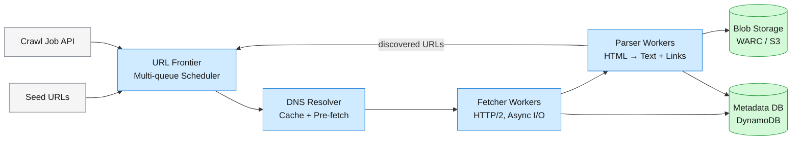
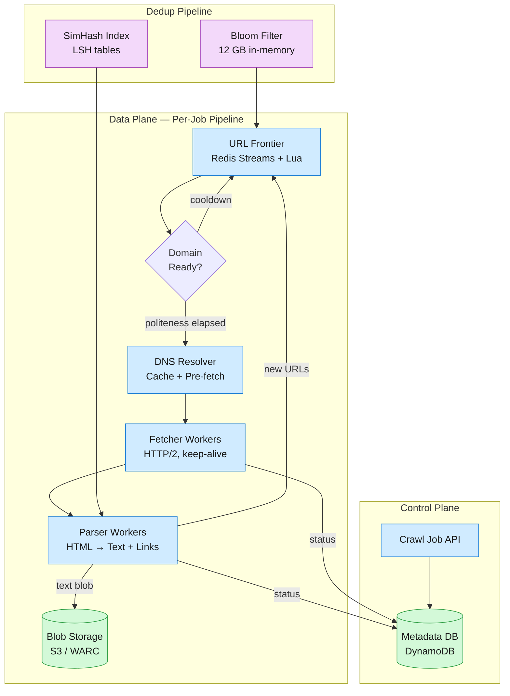
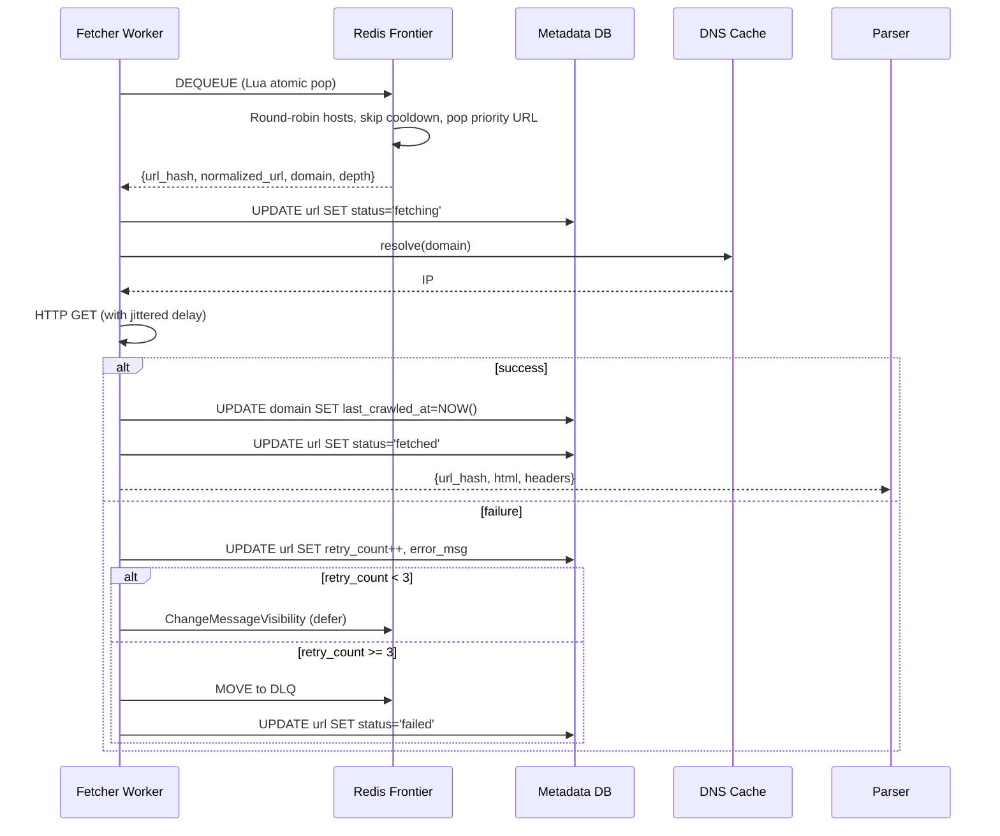

How a web crawler fetches 10 billion pages in under five days with a politeness-aware frontier, robots.txt enforcement, exact and near-duplicate detection, and a fault-tolerant, horizontally-scaled fetch pipeline — a deep dive into the system design of large-scale web crawling.

<!--more-->

## 1. Problem
A web crawler systematically fetches pages from the internet, extracting text content and discovering new URLs from each page's outlinks. The system starts from seed URLs and traverses the web graph breadth-first, producing a corpus of extracted text stored durably for downstream consumers — a search index, an LLM training pipeline, or an analytics warehouse.



The hardest constraint is politeness: we must fetch billions of pages from millions of independent hosts without overwhelming any single one. A naive single-queue design either saturates small sites (DDoS by accident) or leaves the pipeline idle waiting for slow hosts. The solution is per-host scheduling — treating each domain as its own queue with an adaptive delay — which transforms the frontier from a simple buffer into the system's central coordination point. Every other component (DNS, fetchers, parsers, dedup) is stateless and horizontally scalable; the frontier is the only stateful scheduler.
## 2. Requirements

**Functional**

- FR1: Crawl the web from seed URLs, discovering new URLs from outlinks to a configurable depth.

- FR2: Respect robots.txt directives and enforce per-domain rate limits (politeness).

- FR3: Extract text content from crawled HTML pages and store it durably.

- FR4: Deduplicate URLs (exact) and page content (near-duplicate) to avoid wasted bandwidth and storage.

- FR5: Scale horizontally to crawl 10 billion pages in under 5 days.

**Non-functional**

- NFR1: Fault tolerance — no lost crawl progress on worker failure; at-least-once fetch semantics.

- NFR2: Freshness — support periodic re-crawling with adaptive intervals based on observed page change frequency.

- NFR3: Observability — expose crawl progress, queue depth, per-domain error rates, and throughput metrics.

- NFR4: Extensibility — pluggable protocol handlers (HTTP/HTTPS, FTP) and content parsers (HTML, PDF, plain text).

*Out of scope: JavaScript rendering (headless browser), non-text content (images, video), full-text search indexing, link graph computation (PageRank), legal compliance (GDPR, robots.txt opt-out enforcement).*

## 3. Back of the envelope

- 10B pages × 30 KB extracted text per page → **300 TB text corpus**. Raw HTML at 2 MB/page → **20 PB total fetched**.
- 10B pages / 5 days / 86,400 sec/day → **~23,100 pages/sec sustained throughput**. At 200 Gbps per machine (c6in.32xlarge), 30% practical utilization → 60 Gbps → 3,750 pages/sec per machine.
- 10B unique URLs at 1% false positive rate in a Bloom filter: m = −n · ln(p) / ln²(2) = −10B · (−4.605) / 0.4805 ≈ 95.9B bits → **12 GB**.
- DNS: 23K lookups/sec naive, but 90% cache hit rate (aggressive TTL-respecting cache) → **2.3K actual lookups/sec**. A single resolver process handles ~10K lookups/sec.
## 4. Entities & API

```
CrawlJob {
  job_id:       uuid PK
  seed_urls:    string[]
  max_depth:    integer    ← cap crawl depth (default 15)
  max_pages:    integer?   ← optional hard cap; null = unbounded
  politeness_ms:integer    ← per-domain delay override (default 10000)
  status:       enum       ← pending | running | paused | completed | failed
  pages_crawled:integer    ← running counter, updated periodically
  created_at:   timestamp
  completed_at: timestamp?
}

UrlEntry {
  url_hash:       string PK  ← SHA-256 of normalized URL
  normalized_url: string
  domain:         string
  path:           string
  depth:          integer    ← hops from nearest seed
  status:         enum       ← pending | fetching | fetched | parsing | done | failed
  content_hash:   string?    ← SHA-256 of extracted text (content dedup)
  text_s3_key:    string?    ← S3 path to extracted text blob
  error_msg:      string?
  retry_count:    integer    ← number of fetch attempts
  created_at:     timestamp
  last_fetched_at:timestamp?
}

DomainState {
  domain:         string PK
  robots_txt:     string?   ← cached robots.txt content
  crawl_delay:    integer   ← effective delay in ms (robots.txt or adaptive)
  last_crawled_at:timestamp ← last request to this domain
  error_count:    integer   ← consecutive failures, reset on success
  is_blocked:     boolean   ← true if domain returns 429/403 repeatedly
}
```

- `POST /crawl-jobs` — start a new crawl job. Body: `{seed_urls: [...], max_depth?, max_pages?, politeness_ms?}`. Returns `{job_id, status: "running"}`.
- `GET /crawl-jobs/{job_id}` — job status and progress. Returns `{job_id, status, pages_crawled, pages_failed, elapsed_seconds}`.
- `GET /crawl-jobs/{job_id}/stats` — detailed stats. Returns `{pages_by_status: {...}, top_domains: [...], throughput_pages_per_sec, queue_depth}`.
- `POST /crawl-jobs/{job_id}/pause` — pause a running crawl. Workers finish in-flight fetches, drain.
- `POST /crawl-jobs/{job_id}/resume` — resume a paused crawl.
- `GET /crawl-jobs/{job_id}/text/{url_hash}` — retrieve extracted text for a crawled URL. Redirects to S3 signed URL.
## 5. High-Level Design



**Walkthrough for one URL.** The crawl API seeds the frontier with normalized URLs. A fetcher worker dequeues a URL from the frontier: the frontier's Lua script selects a URL whose domain's politeness window has elapsed, marks it as `fetching`, and updates the domain's `last_crawled_at`. The fetcher resolves the domain via the DNS cache (populated by a dedicated resolver process that pre-fetches A/AAAA records for domains entering the frontier) and issues an HTTP GET. The response body (raw HTML) and headers (Content-Type, Content-Length, Last-Modified) are packaged into a message and pushed to the parser queue.
A parser worker deserializes the message, detects the charset, sanitizes malformed HTML, extracts text via DOM traversal, and computes a SimHash fingerprint. The text blob is written to S3 under a content-addressed key. Outlinks are extracted, normalized (lowercase host, remove fragments, resolve relative paths, strip tracking params), and each is checked against the Bloom filter. URLs not seen before are pushed back into the frontier with `depth = parent_depth + 1`. The parser updates the UrlEntry in the Metadata DB to `status: done` with the S3 key and content hash.
**Failure recovery.** The frontier queue holds messages with a visibility timeout (60 seconds). If a fetcher crashes mid-download, the message reappears after the timeout. The fetcher's HTTP client includes retries with exponential backoff and jitter. After 3 failed attempts, the URL is marked `failed` and sent to a dead-letter queue for operator review. The parser is similarly protected — if it crashes, the raw HTML message re-enters the queue. Both stages are idempotent by design: re-fetching a URL produces the same content (within a crawl window), and re-parsing produces the same SimHash and text output.
## 6. Deep dives
### DD1: URL Frontier — Per-Host Scheduling with Adaptive Politeness
**Problem.** Crawling millions of domains at 23K pages/sec requires scheduling that maximizes throughput while respecting each host's capacity. A single FIFO queue forces all traffic to wait for the slowest host's politeness window. A naive round-robin across domains wastes slots on hosts with empty queues. Without jitter, N workers waiting on the same domain's cooldown all retry simultaneously — one succeeds, N−1 fail, and the pattern repeats.
**Approach: Single queue + per-request delay.** One global queue. Before each fetch, check `now - domain.last_crawled_at >= domain.crawl_delay`. If not, sleep and retry.
- *Pro:* Simplest possible implementation. Single source of truth for URL ordering.
- *Con:* Head-of-line blocking — if the next URL in the queue belongs to a domain in cooldown, the entire pipeline stalls. Workers spin-waiting waste CPU. No priority differentiation.

**Approach: Per-host sub-queues with dedicated workers.** Partition URLs into per-host queues. Assign each worker to a fixed set of hosts. Worker loops over its assigned queues, fetching when politeness allows.
- *Pro:* No cross-host contention. Natural isolation — misbehaving hosts only affect their assigned worker.
- *Con:* Load imbalance — a worker assigned to [wikipedia.org](http://wikipedia.org) gets 5M URLs; another assigned to 1,000 tiny blogs gets 50 URLs each. Hotspot hosts overload their worker while others idle. Adding a new host requires rebalancing worker assignments.

**Approach: Centralized scheduler with per-host priority queues and jitter (chosen).** A Redis-backed frontier maintains per-host priority queues (high: rapidly-changing pages, medium: normal, low: long-tail). A Lua script atomically selects the next fetchable URL: it iterates hosts in round-robin order, skips those in cooldown, and pops the highest-priority URL from the first ready host. The cooldown is adaptive: `delay = max(1s, min(300s, 10 × last_download_time))`. Each worker adds random jitter (±20% of delay) to its individual retry timing.
- *Pro:* Round-robin across ready hosts ensures fairness — no host starves. Adaptive delay (Mercator's 10× rule) automatically throttles slow servers and accelerates fast ones. Priority queues let important pages (news sites, sitemap-discovered) jump the line. Jitter desynchronizes worker retries probabilistically. Lua atomicity guarantees no two workers claim the same URL.
- *Con:* Redis is a single point of failure — requires sentinel or cluster mode with failover. The Lua script runs in Redis's single thread; at very high throughput (>100K ops/sec), it becomes the bottleneck. Per-host state grows unboundedly — needs periodic eviction of hosts with empty queues.

**Decision:** Redis-backed centralized frontier with Lua scripting. Redis's single-threaded execution model is exactly what makes the atomic host-selection script possible — it cannot race. The Mercator architecture (1999) demonstrated that a centralized frontier with per-host queues scales to hundreds of fetcher threads on a single machine. Modern Redis can handle 100K+ ops/sec, far exceeding our 23K dequeues/sec.
**Rationale:** The Mercator paper's per-host queuing is still the canonical approach 25 years later because the problem hasn't changed — TCP connections per host, HTTP keep-alive, and server capacity are still per-host concepts. Apache Nutch (used by Common Crawl for 300B+ cumulative pages) uses per-host queues with AdaptiveFetchSchedule. Googlebot's public documentation confirms per-host rate limiting. The central insight is that the frontier is a scheduler, not a queue — it makes scheduling decisions (which URL next, how long to wait) that no distributed worker can make independently without coordination.
**Edge cases:**
- **Host with 10M URLs blocks all others:** The round-robin iterator skips any host in cooldown after one URL. No single host can consume more than 1/N of total throughput (N = number of ready hosts). If only one host is ready, the system naturally limits to that host's politeness rate — which is correct behavior, since hammering it would be a DDoS.
- **Redis failover during a dequeue:** The worker that executed the atomic pop crashes before processing the URL. The URL is gone from the frontier. Mitigation: the worker's visibility timeout. If the worker doesn't update the URL's status in Metadata DB within 60 seconds, a reaper process re-enqueues URLs with `status: fetching` and `last_fetched_at` older than 60 seconds.
- **New domain joins mid-crawl:** The Lua script treats unknown hosts as having `crawl_delay` = default (10 seconds) and `last_crawled_at` = 0 (immediately fetchable). The first fetch to that host establishes the adaptive delay baseline.
- **robots.txt fetch fails:** The domain is added with a 24-hour `is_blocked` flag. A background job retries robots.txt every 6 hours. URLs for that domain are skipped (not dequeued) until robots.txt is resolved.



### DD2: Content Deduplication — Exact URL + Near-Duplicate Content
**Problem.** Up to 30% of the web is duplicate content. Mirrors (same content on different domains), session IDs in URLs (`?sid=abc` vs `?sid=def`), tracking parameters, and scraped/republished articles all produce different URLs pointing to identical or near-identical content. Crawling duplicates wastes 30% of bandwidth and storage. The dedup pipeline must handle 10B unique URLs at sub-millisecond lookup time per check.
**Approach: Hash set for URL dedup.** Store every seen URL in a hash set. Before adding a URL to the frontier, check the set.
- *Pro:* Zero false positives — definitive answer. Simple to implement and reason about.
- *Con:* 10B URLs × 100 bytes per entry (URL string + overhead) = 1 TB of memory. Doesn't fit on any single machine. A distributed hash set (e.g., Redis Cluster) adds network latency to every frontier push.

**Approach: Bloom filter only.** Use a 12 GB Bloom filter (7 hash functions, 96B bits) as the URL dedup store. Accept the 1% false positive rate — 1% of genuinely new URLs are incorrectly skipped.
- *Pro:* 12 GB fits comfortably in memory on one machine. Sub-microsecond check time. 83× memory savings vs hash set.
- *Con:* 1% false positive rate means ~100M genuinely new URLs are never crawled. False positive rate compounds: a URL that produces 10 outlinks loses ~0.1 pages per crawl level on average, but over 15 levels of depth the cumulative loss is significant. No delete support — you cannot remove a URL if it is later found to be dead.

**Approach: Bloom filter front-end + on-disk confirmation (chosen).** A 12 GB in-memory Bloom filter serves as the fast path (L1). A LevelDB/RocksDB instance on SSD holds the definitive URL set (L2). On a Bloom filter hit, the worker checks L2 for confirmation. On a Bloom filter miss, the URL is definitively new — added directly.
- *Pro:* Bloom filter filters out 99%+ of checks, so the SSD round-trip (L2) is hit <1% of the time. False positives from the Bloom filter are caught by L2 — no lost URLs. SSD costs ~$0.10/GB vs $5/GB for RAM — the 500 GB L2 store costs $50 in SSD vs $5,000 in RAM.
- *Con:* Two-level architecture adds complexity. L2 must be sharded (by URL hash prefix) for parallel access. The Bloom filter must be periodically rebuilt as the URL set grows — a snapshot-and-rotate process.

**Decision:** Two-level dedup with Bloom filter (L1) + RocksDB (L2). The Bloom filter is rebuilt daily from the RocksDB snapshot.
**Rationale:** IRLbot (Lee et al., 2008) used exactly this pattern to crawl 6B pages on a single machine — L1 Bloom filter in RAM, L2 on-disk Berkeley DB. Google's Bigtable uses Bloom filters as a front-end for its distributed storage. The cost argument is decisive: 12 GB RAM + 500 GB SSD vs 1 TB RAM. Even at cloud prices, the RAM difference alone is ~$15K/month.
**Content dedup (SimHash).** URL dedup catches exact URL duplicates. For near-duplicate content (different URLs, identical text), we compute a 64-bit SimHash (Manku et al., 2007) over the extracted text tokens, weighted by TF. Pages with Hamming distance ≤ 3 bits are considered duplicates. The 64-bit fingerprints are stored in 4 LSH (Locality-Sensitive Hashing) tables of 16 bits each for O(1) lookup. This catches mirrors, scraped content, and pages that differ only in boilerplate (ads, nav, footer).
**Edge cases:**
- **Bloom filter false positive on a high-value URL:** The L2 check catches it. The URL is crawled normally. The cost is one extra SSD read per false positive — negligible at 1% FP rate × <1% of URL checks that hit the filter.
- **Bloom filter fills up:** At 10B insertions with m=96B bits and k=7, the false positive rate drifts from 1% to ~2% at 15B URLs. Mitigation: rebuild the Bloom filter from the RocksDB snapshot when FP rate exceeds 2%. The rebuild takes ~30 minutes (scanning 500 GB at SSD speed).
- **SimHash collision on genuinely different content:** Two pages with identical TF-IDF token vectors produce the same SimHash. Probability for a single pair: negligible (2\^64 space). Across 10B pages with LSH bucketing, the expected collision count is <10 — acceptable. Mitigation: L2 content-hash check on any SimHash match before discarding.
- **Canonical URL handling:** Before adding to the frontier, the URL normalizer reads `<link rel="canonical">` from the fetched HTML's head. If the canonical URL differs from the fetched URL and the canonical URL is already in the Bloom filter, the fetched URL is discarded as a duplicate — even though its own URL was new.
### DD3: Parsing Pipeline — From Raw Bytes to Structured Text
**Problem.** HTML on the wild web is malformed — missing closing tags, nested incorrectly, wrong charset declarations, embedded scripts, inline CSS, and binary garbage. A parser must produce clean, charset-correct text and a complete set of normalized outlinks from any HTML the world's browsers would render. Speed matters: parsing must keep pace with fetching (23K pages/sec).
**Approach: Regex-based extraction.** Match `<a href="...">` with a regex, strip tags with another regex, done.
- *Pro:* Fastest possible — no DOM construction. Works on 95% of pages. Trivial to implement.
- *Con:* Fails on the 5% of pages with complex markup: nested quotes in attributes, JavaScript that constructs URLs, `<base>` tag changing relative URL resolution, conditional comments in IE HTML. Regex is not a parser — it misses links in `<area>`, `<frame>`, `<form action>`, and meta-refresh redirects.

**Approach: Full browser rendering engine (Chromium headless).** Load every page in a headless Chrome instance, let it execute JavaScript, then read the DOM.
- *Pro:* Parses anything a browser can render. Handles JavaScript-generated content, lazy-loaded images, SPA routing. Produces the exact DOM a user sees.
- *Con:* 10–100× slower than raw HTML parsing. Each page requires a browser process (~100 MB RAM) and 2–10 seconds of CPU. At 23K pages/sec, this would require ~230K Chromium instances — completely infeasible. This is why Googlebot splits into a fast raw-HTML crawl and a slower render crawl.

**Approach: Streaming HTML5 parser with charset detection (chosen).** Use a spec-compliant HTML5 parser (e.g., html5ever in Rust, Gumbo in C) that handles tag-soup repair — it implements the WHATWG parsing algorithm, which defines exactly how to recover from any malformed input and produce a consistent DOM. Pair it with a multi-stage charset detector: BOM → Content-Type header → `<meta charset>` → byte-order heuristics → fallback (UTF-8).
- *Pro:* Correct on 100% of HTML (WHATWG spec guarantees a deterministic tree for any byte stream). 5–10× faster than headless browser — ~5 ms per page on modern hardware. Memory-efficient — streaming parser doesn't hold the full HTML in memory.
- *Con:* Still slower than regex (2–3×). Requires a native library — Python bindings add overhead; the parser should run as a compiled service (Rust/C/Go) invoked by the Python orchestration layer. No JavaScript execution — we are explicitly out of scope for JS rendering.

**Decision:** Streaming HTML5 parser (html5ever) with multi-stage charset detection. The parser runs as a separate compiled service. Python parser workers call it via gRPC with raw bytes, receive a protobuf containing extracted text and a list of normalized URLs.
**Rationale:** The WHATWG parsing algorithm is one of the few true standards of the web — every browser implements it identically. An HTML5 parser produces the same DOM from the same bytes as Chrome, Firefox, and Safari. Using it eliminates the entire class of "malformed HTML" bugs. Common Crawl's Nutch-based parser uses a similar approach (Tika + tagsoup repair). The performance tradeoff (regex → 2× slower for HTML5 parser) is justified by correctness — missing 5% of outlinks on 23K pages/sec is 1,150 missed URLs per second.
**Pipeline stages:**
1. **Charset detection:** Check BOM (bytes 0-3), then Content-Type header, then scan first 1KB for `<meta charset>` or `<meta http-equiv="Content-Type">`. If all fail, use statistical detection (chardet) with UTF-8 fallback.
2. **HTML sanitization:** Strip `<script>`, `<style>`, `<!-- comments -->`, CDATA sections before DOM construction — these produce no outlinks and bloat the tree.
3. **DOM construction:** Feed sanitized bytes to the HTML5 parser. Hold in streaming mode — emit text nodes and element open/close events as they are parsed, without building the full tree.
4. **Text extraction:** Concatenate text nodes. Apply whitespace normalization (collapse runs, strip leading/trailing). Skip text nodes inside `<script>`, `<style>`, `<noscript>`, `<svg>`.
5. **Link extraction:** On `<a href>`, `<area href>`, `<link href>` (with rel=next/prev/canonical), `<frame src>`, `<iframe src>`, and `<meta http-equiv="refresh">` (extract URL from content attribute), emit a candidate URL. Resolve relative URLs against the base URL (from `<base href>` or document URL). Apply URL normalization.
6. **URL normalization:** Lowercase host. Remove fragment. Remove default ports. Resolve `.` and `..` segments. Decode percent-encoding, then re-encode only bytes that must be escaped. Strip known tracking parameters (`utm_source`, `fbclid`, `gclid`, `ref`, `sessionid`). Cap URL length at 2048 bytes.

**Edge cases:**
- **Document in a charset not detected by the detector:** The HTML5 parser will encounter invalid byte sequences. The WHATWG spec mandates replacement characters (U+FFFD). The text output will have some corruption but the parse continues. Mitigation: log charset detection failures per domain; if a domain consistently produces broken text, flag it for operator review.
- **Infinite redirect chain:** The HTTP fetcher follows redirects (301, 302, 307, 308) up to 5 hops. On the 6th redirect, the fetcher treats it as a crawl trap — marks the domain with a warning and skips. The redirect chain is stored in the Metadata DB for debugging.
- **Binary content served as text/html:** The Content-Type header says `text/html` but the body is a PDF or ZIP file. Charset detection fails; the HTML5 parser produces a tree with only a text node of garbage. Mitigation: check the first 4 bytes against known magic numbers (PDF: `%PDF`, ZIP: `PK`, PNG: `\x89PNG`). If magic number matches, skip parsing, log the MIME mismatch, and store the binary as-is.
### DD4: DNS Resolution at Scale
**Problem.** 23K page fetches per second across millions of unique domains. Naive DNS resolution (one `getaddrinfo()` per fetch) would issue 23K DNS queries per second. At 50–200 ms per uncached lookup, this saturates any upstream resolver and introduces a median 100 ms per-fetch latency that dominates total page fetch time. The Mercator paper (1999) found DNS accounted for 70% of each thread's elapsed time before they built a custom resolver.
**Approach: Per-worker OS-level DNS cache (getaddrinfo with nscd).** Each fetcher worker calls the standard OS resolver. The OS's nscd daemon caches results per TTL.
- *Pro:* Zero application code. Works out of the box on every Linux distribution.
- *Con:* nscd is notoriously unreliable — it's single-threaded, prone to cache corruption, and often disabled in containerized environments. OS-level TTLs are often ignored by misconfigured DNS servers. No cross-worker sharing — each machine's cache is independent, so 8 machines each do a cold lookup for every new domain.

**Approach: Global DNS cache in Redis.** Every DNS result is stored in Redis with TTL = min(returned TTL, 3600). Workers check Redis before issuing a real DNS query.
- *Pro:* Shared cache across all machines — 90%+ hit rate after warmup. TTL enforced in application code, bypassing OS resolver quirks.
- *Con:* Redis adds 0.1–0.5 ms latency per cache hit. Redis is already the frontier — coupling DNS to the same Redis instance increases blast radius. Redis network round-trip per DNS lookup is 2× the latency of a local in-process cache.

**Approach: Dedicated DNS resolver process with local LRU + pre-fetch (chosen).** A separate DNS resolver process (not thread, not library) runs on each machine. It maintains a 10M-entry in-process LRU cache. It resolves domains asynchronously using a custom non-blocking UDP implementation (not `getaddrinfo`). A background pre-fetcher scans newly discovered domains from the frontier and issues lookups before any fetcher needs them.
- *Pro:* No per-lookup network round-trip — cache hit resolves in microseconds from local memory. Dedicated process isolates DNS from the fetcher's event loop — DNS timeouts don't block fetches. Pre-fetching eliminates cold-start latency for domains entering the frontier. Async resolution handles 10K+ concurrent in-flight queries without thread-per-query overhead.
- *Con:* Custom resolver is complex to build — requires implementing the DNS wire protocol (RFC 1035), handling EDNS0, DNSSEC validation, and CNAME chasing. More operational surface area — the resolver process must be monitored, restarted on failure, and its cache must survive restarts (warm-up on startup from a snapshot).

**Decision:** Dedicated DNS resolver process with local LRU cache and pre-fetching. The resolver process is a compiled Rust binary that reads domain names from a Unix domain socket and writes IP addresses back. Its LRU cache is exported as a Prometheus metric for monitoring hit rate.
**Rationale:** Mercator (1999) used a dedicated resolver process for exactly these reasons. IRLbot (2008) demonstrated that aggressive DNS caching reduces DNS queries by 80%+ and increases effective throughput from ~200 to ~1,000 pages/sec on a single machine. The key performance insight is that DNS latency is not just about the query time — it's about the opportunity cost of a blocked fetcher thread. A fetcher waiting 100 ms on DNS is a fetcher not downloading a page. A local cache hit at 1 µs keeps the pipeline full.
**Edge cases:**
- **NXDOMAIN (domain doesn't exist):** Common Crawl reports ~30% of domain lookups fail with NXDOMAIN. The resolver caches NXDOMAIN results with a 1-hour TTL (SOA negative TTL overridden — real-world negative TTLs are often 60 seconds which is too short). Domains with 3 consecutive NXDOMAIN results across separate crawls are added to a permanent blocklist.
- **Resolver process crash:** The fetcher workers detect the closed Unix socket and fall back to `getaddrinfo()` (system resolver) on a separate thread pool with a 5-second timeout. A supervisor restarts the resolver process. On restart, the resolver loads its cache from a disk snapshot (mmap'd binary file, loaded in <1 second).
- **DNSSEC validation failure:** The resolver logs the failure and falls back to non-validated resolution. Crawling is not a security-sensitive operation — we prefer availability over strict DNSSEC enforcement.
### DD5: Storage for Crawled Content
**Problem.** 10B pages × 30 KB extracted text = 300 TB of stored text. Plus metadata (URL, fetch time, status, content hash) at ~500 bytes per URL = 5 TB. Plus raw HTML for debugging/reprocessing (ephemeral, 7-day TTL) = ~140 TB at any moment. The storage system must handle append-heavy writes at 23K inserts/sec, support point reads by URL hash, and enable bulk exports for downstream consumers.
**Approach: Individual files per page.** Store each page's extracted text as a separate file on a distributed filesystem (HDFS, GCS FUSE).
- *Pro:* Simple — one file per URL. Any tool can read it. No format dependency.
- *Con:* 10B individual files is catastrophic for any filesystem. HDFS namenode memory = ~150 bytes per file → 1.5 TB of namenode heap. GCS object listing is O(n). Small file overhead: a 30 KB text file stored as a GCS object still consumes one inode, one metadata entry, and one billing unit. 10B objects × $0.005/10K class A operations = $5,000 just to list them.

**Approach: Single large database (Bigtable, Cassandra).** Store all text as rows in a wide-column database. URL hash as row key, text as a column value.
- *Pro:* Excellent for point reads — O(1) by row key. Built-in compression, replication, compaction. No small-file problem.
- *Con:* 300 TB of text in a database is expensive — databases charge a premium per GB vs blob storage (Bigtable: ~$0.17/GB vs GCS: ~$0.02/GB). Bulk exports require scanning the entire table, which contends with live writes. LSM-tree write amplification on 30 KB values causes compaction storms.

**Approach: WARC (Web ARChive) files on blob storage + columnar metadata index (chosen).** Batch extracted text into WARC files (~1 GB each, ~30K pages per file). Write WARC files to S3/GCS. Maintain a columnar index (Parquet on S3, or DynamoDB) mapping `url_hash → {warc_file, offset, length, content_hash, status, timestamp}`.
- *Pro:* WARC is an ISO standard (ISO 28500) — downstream consumers (Common Crawl, Internet Archive, any WARC-compatible tool) can read it directly. S3 is 5–8× cheaper per GB than database storage. Batched writes (1 GB files) eliminate the small-file problem — 300 TB is ~300K files, trivial for any filesystem. The columnar index enables fast point reads and bulk exports without scanning WARC files. Extracted text is content-addressed (SHA-256) — two pages with identical text share the same S3 key, saving storage.
- *Con:* Point reads require two operations: index lookup → S3 range GET (byte offset + length). This adds ~50 ms latency vs a database point read. Writing a WARC file requires buffering ~30K pages in memory before flushing — a parser worker crash loses the current batch (acceptable, since pages are re-parseable from the raw HTML queue). WARC format overhead is ~1% (headers, record separators).

**Decision:** WARC files on S3 with a Parquet metadata index on S3 and a hot index in DynamoDB.
**Rationale:** Common Crawl has delivered 300B+ pages over 19 years using exactly this architecture — WARC files on S3 with CDX/columnar indexes. The format choice has network effects: any tool that processes Common Crawl data processes our crawl data without modification. The cost difference is decisive: 300 TB in S3 Standard = $6,900/month; the same data in Bigtable = $53,550/month. The two-read latency for point reads (50 ms) is acceptable because the primary access pattern is bulk export, not interactive point reads.
**Storage tiers:**
- **Hot (DynamoDB):** URL status + content hash for all in-flight URLs — last 7 days of crawl activity. ~5M entries, ~2.5 GB.
- **Warm (S3 Standard):** WARC files from the current crawl job + Parquet index. Accessible for point reads and batch exports. 300 TB.
- **Cold (S3 Glacier Deep Archive):** Completed crawl archives. Bulk access only, 12-hour retrieval delay. $1/TB/month.

**Edge cases:**
- **Parser produces identical text for two URLs:** The content hash (SHA-256 of extracted text) matches. The parser writes the text once, stores two URL records pointing to the same S3 key. Saves storage for mirrors and duplicate content.
- **WARC file write fails mid-batch:** The parser's current buffer (up to 30K pages) is lost. The parser worker reports the failure, and all in-flight pages in that batch re-enter the parser queue (they're still in the raw HTML queue with their visibility timeout). The next parser worker re-processes them into a new WARC batch.
- **Downstream consumer wants the last 24 hours of crawl:** The columnar index allows `SELECT url_hash, s3_key FROM index WHERE timestamp > NOW() - 24h`. This is an S3 Select query over the Parquet index files — no per-object GETs, sub-second for a day's worth of crawl metadata (<1 GB of index data).
## 7. Trade-offs
| Decision | Option A | Option B | Choice | Rationale |
|---|---|---|---|---|
| **Frontier queue technology** | SQS (managed, visibility timeout, DLQ built-in) | Redis Streams (self-managed, Lua atomicity, lower latency) | Redis Streams | SQS visibility timeout enables automatic retry, but SQS has no atomic per-host round-robin — you'd need per-host queues (one SQS queue per domain, millions of queues, API rate limits). Redis Lua scripts provide the atomic "select next fetchable URL across all hosts" primitive that SQS cannot. Common Crawl's Nutch uses a similar self-managed frontier (HBase-backed). |
| **URL dedup** | Bloom filter only (12 GB, 1% FP) | Hash set only (1 TB, 0% FP) | Two-level (Bloom + RocksDB) | Bloom filter alone loses 100M URLs to false positives. Hash set alone costs $15K/month in RAM. The two-level approach gives 0% effective FP at ~$50/month in SSD — the L2 check is hit <1% of the time, so the latency cost is negligible. |
| **Content dedup** | SimHash (64-bit, LSH lookup) | MinHash + Jaccard (b-bit, banding) | SimHash | SimHash fingerprints are 64 bits vs MinHash's 84 hashes × 4 bytes = 336 bytes per page. SimHash LSH lookup is O(1) per bucket; MinHash requires comparing sets of hashes. Google's 2007 paper on SimHash demonstrated it scales to billions of pages with sub-3% false negative rate at Hamming distance ≤3. |
| **DNS resolution** | System resolver (getaddrinfo, nscd cache) | Dedicated async resolver with pre-fetch | Dedicated async resolver | System resolver blocks fetcher threads for 50–200 ms per uncached lookup. At 23K req/sec with 10% cache miss rate, that's 2,300 threads blocked on DNS at any moment. The Mercator paper demonstrated a dedicated resolver reduces DNS overhead from 70% to <5% of thread time. |
| **Storage format** | Individual files (GCS/S3 per page) | WARC archives on blob storage | WARC | 10B individual files is operationally infeasible — GCS object listing is O(n), and 10B objects incur $5K just to enumerate. WARC batches 30K pages per file, producing 300K files for the entire corpus — trivially manageable. Plus network effects: WARC is the standard for web archives. |
| **Parsing strategy** | Regex (fast, brittle) | Headless browser (correct, slow) | HTML5 streaming parser | Regex misses ~5% of links on complex pages. Headless browser is 10–100× too slow for 23K req/sec. HTML5 parser is a middle ground: correct on 100% of HTML (WHATWG spec), 2–3× faster than regex is slower, and produces deterministic output. |
| **Re-crawl policy** | Proportional (fast-changing pages more often) | Uniform (all pages same interval) | Uniform-leaning adaptive | Cho & Garcia-Molina (2000) proved uniform policy achieves higher average freshness than proportional. The intuition: pages that change fastest go stale immediately after crawling, so the freshness contribution of each re-crawl is near-zero. Googlebot's documentation describes an adaptive policy that "learns how often content changes" — closer to uniform than proportional. |
## 8. References
- Brin & Page. "The Anatomy of a Large-Scale Hypertextual Web Search Engine." WWW, 1998. — Original Google architecture: URL Server → Crawlers → Store Server → Indexer.
- Heydon & Najork. "Mercator: A Scalable, Extensible Web Crawler." WWW, 1999. — Per-host queues, adaptive politeness (10× download time), dedicated DNS resolver.
- Cho & Garcia-Molina. "Synchronizing a Database to Improve Freshness." SIGMOD, 2000. — Uniform re-visit policy outperforms proportional for page freshness.
- Manku, Jain, Sarma. "Detecting Near-Duplicates for Web Crawling." WWW, 2007. — SimHash algorithm for content-based dedup at web scale.
- Lee et al. "IRLbot: Scaling to 6 Billion Pages and Beyond." ACM TWEB, 2008. — Single-machine 6B page crawl, Bloom filter + on-disk hash table dedup, TCP reuse.
- Google. "How Search Works — Crawling and Indexing." [google.com/search/howsearchworks](http://google.com/search/howsearchworks). — Scale numbers: 100M+ GB index, hundreds of billions of pages, Googlebot architecture.
- Google Search Central. "Googlebot." [developers.google.com/search/docs/crawling-indexing/googlebot](http://developers.google.com/search/docs/crawling-indexing/googlebot). — File size limits (2MB HTML, 64MB PDF), crawl rate, robots.txt handling.
- Common Crawl. "FAQ" and "Statistics." [commoncrawl.org](http://commoncrawl.org). — 300B+ cumulative pages, WARC format, Nutch-based, 2.1B pages/month.
- Apache Nutch. [nutch.apache.org](http://nutch.apache.org). — AdaptiveFetchSchedule, pluggable protocol handlers, per-host queuing.
- HelloInterview. "Web Crawler System Design." [hellointerview.com/learn/system-design/problem-breakdowns/web-crawler](http://hellointerview.com/learn/system-design/problem-breakdowns/web-crawler). — Interview framing, SQS vs Kafka tradeoff, level expectations.
- System Design Sandbox. "Design Web Crawler." [systemdesignsandbox.com](http://systemdesignsandbox.com). — API-first design, Bloom filter sizing, per-domain back queues.
- Bloom, Burton H. "Space/Time Trade-offs in Hash Coding with Allowable Errors." CACM, 1970. — Bloom filter original paper.
