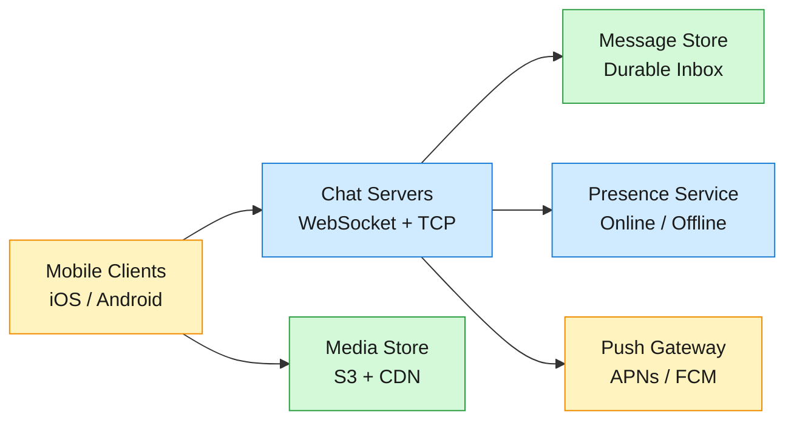
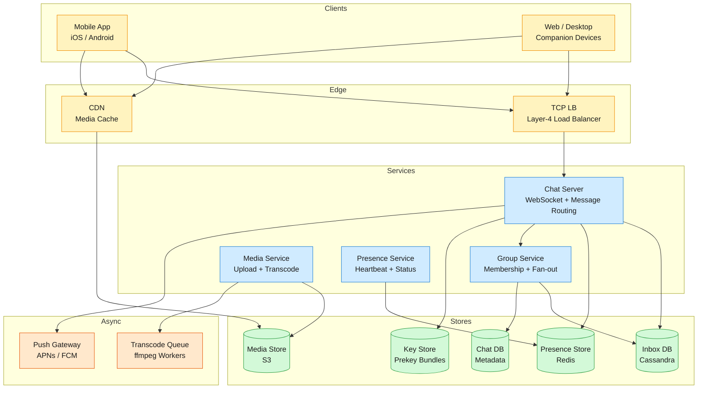
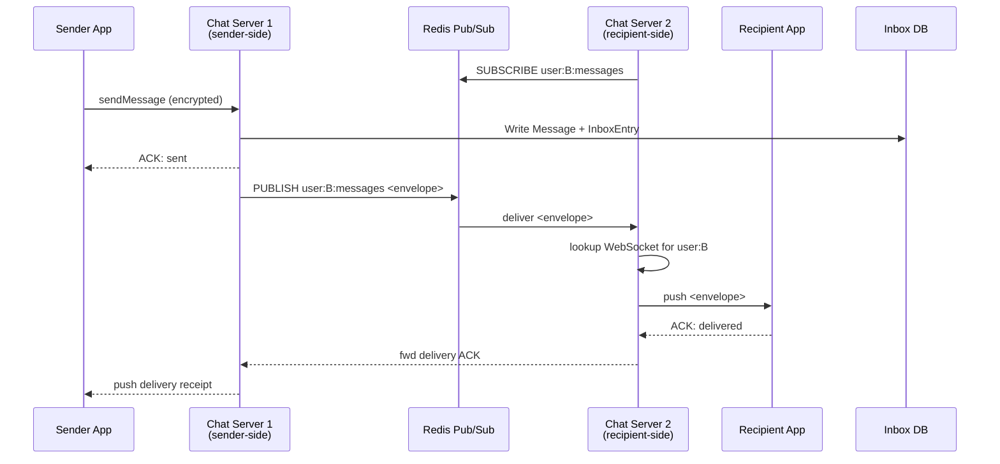
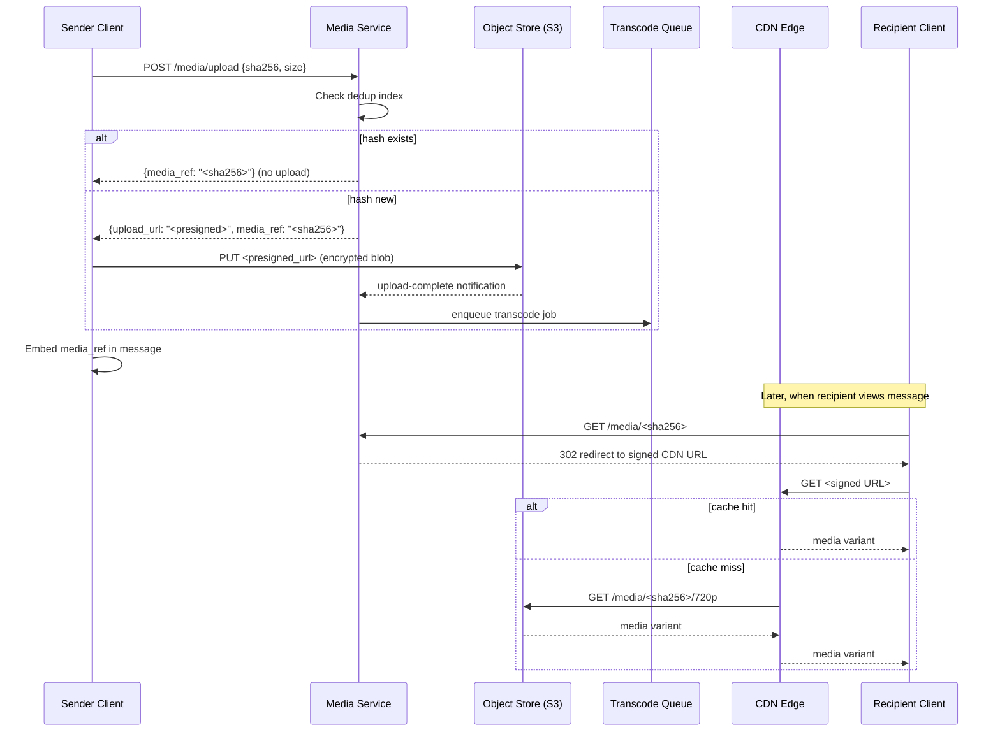

How WhatsApp delivers 100B+ end-to-end-encrypted messages a day to 2 billion users over unreliable mobile networks with sub-second delivery, offline queuing up to 30 days, three-tier delivery receipts, and 1,024-member group fan-out — a deep dive into the world's largest messaging platform.

<!--more-->

## 1. Problem
WhatsApp is a real-time messaging platform serving 2 billion monthly active users who exchange over 100 billion messages daily — text, images, video, and audio — across unreliable mobile networks worldwide. Every message must be end-to-end encrypted so that no intermediary, including the platform itself, can read it. Messages must reach recipients within one second whether they are online or offline (up to 30 days), and delivery acknowledgements must propagate back to senders reliably. Groups of up to 1,024 members compound the fan-out challenge: a single message in a large group can spawn a thousand delivery operations.



## 2. Requirements

**Functional**

- FR1: Send and receive text messages in real time.

- FR2: Receive messages sent while offline for up to 30 days.

- FR3: Create and participate in group chats with up to 1,024 members.

- FR4: Send and receive media including images, video, and audio.

- FR5: View three-tier delivery status: sent, delivered, and read.

- FR6: See when contacts are online, offline, or were last seen.

**Non-functional**

- NFR1: End-to-end encrypt all messages and media by default.

- NFR2: Deliver messages within 1 second at the 99.99th percentile.

- NFR3: Support 2 billion monthly active users globally.

- NFR4: Operate reliably over unreliable low-bandwidth 2G/3G networks.

*Out of scope: voice and video calling, status/stories, payments, the business/API platform, and full-text message search.*

## 3. Back of the envelope

- 100B messages/day ÷ 86,400 seconds ≈ **1.16M msgs/sec** average, peak ~3M/sec → a write-fan-out message to a 1,024-member group would require 3B inbox writes/sec if done synchronously per recipient → the write path is the bottleneck.
- ~1% of messages carry media averaging 1 MB → **~1 PB of new media uploaded daily** → media storage dwarfs text by orders of magnitude; the storage layer is the tightest resource.
- Production WhatsApp ran 1M+ concurrent TCP connections per commodity server (Erlang/BEAM, per-process connection model). At 1B DAU with ~50% online concurrently, that is **~500 servers for the real-time tier** → connection density is not the limiting factor; the message delivery path drives cost.
## 4. Entities & API

```
User {
  user_id:     uuid PK          ← globally unique, shard key
  phone:       string UNIQUE    ← hashed at rest
  display_name:string
  identity_key:blob             ← Curve25519 public key
  prekey_bundle:blob            ← signed pre-key + one-time pre-keys (refreshed by client)
  created_at:  timestamp
}

Message {
  message_id:  uuid PK
  chat_id:     uuid             ← partition key; for 1:1 = sorted(user_a, user_b)
  sender_id:   uuid
  ciphertext:  blob             ← E2E encrypted; server never decrypts
  content_type:enum             ← text | image | video | audio | system
  media_ref:   string?          ← content-hash reference to media store
  client_seq:  bigint           ← per-chat monotonic, set by sender
  created_at:  timestamp
}

InboxEntry {
  user_id:     uuid PK          ← partition key
  device_id:   uuid SK          ← sort key; one entry per device
  message_id:  uuid
  chat_id:     uuid
  global_seq:  bigint           ← global monotonic for efficient reconnect sync (range scan)
  status:      enum             ← pending | delivered | read
  ttl:         timestamp        ← auto-expire after 30 days
}

Chat {
  chat_id:     uuid PK
  chat_type:   enum             ← direct | group
  group_name:  string?
  created_by:  uuid
  created_at:  timestamp
  last_msg_at: timestamp        ← denormalized for inbox sort order
}

ChatMember {
  chat_id:     uuid PK
  user_id:     uuid SK
  role:        enum             ← member | admin
  joined_at:   timestamp
}
```

**API**
- `POST /v1/messages` — send a message; returns `message_id` + server-assigned `global_seq`
- `GET /v1/inbox?since=<global_seq>&limit=<n>` — sync messages since last acknowledged sequence; returns ordered batch of `InboxEntry` + `Message` payloads
- `POST /v1/chats` — create a 1:1 or group chat; returns `chat_id`
- `GET /v1/chats/<chat_id>/messages?before=<cursor>` — paginated chat history for a loaded conversation
- `POST /v1/media/upload` — request a presigned upload URL; returns `upload_url` + `media_ref` (content hash)
- `GET /v1/media/<media_ref>` — download media; 302 redirect to CDN edge with short-lived signed URL
- `WS /v1/ws` — persistent WebSocket for real-time message push, presence events, and delivery receipts
## 5. High-Level Design



#### FR1: Send and receive text messages in real time
**Components:** Sender Client → Chat Server (sender-side) → Chat Server (recipient-side) → Recipient Client
**Flow:**
1. Client establishes a persistent WebSocket to a Chat Server via L4 load balancer. On connect, the Chat Server subscribes to the user's pub/sub channel (`user:<user_id>:messages`) in Redis.
2. Sender's client encrypts the plaintext message body using the Double Ratchet-derived message key (see DD4). The ciphertext is opaque to the server.
3. Sender sends `{"cmd":"send","chat_id":"<id>","ciphertext":"<blob>","client_seq":<n>}` over WebSocket.
4. Chat Server writes a `Message` row to Cassandra keyed by `chat_id`, then inserts one `InboxEntry` per recipient device (partitioned by `user_id`).
5. The server returns `{"status":"sent","message_id":"<uuid>","global_seq":<n>}` — this is the single-check (✓) receipt.
6. For each online recipient, the Chat Server publishes the message envelope to `user:<recipient_id>:messages` in Redis Pub/Sub. The recipient's Chat Server (subscribed to that channel) receives the publish, looks up the recipient's active WebSocket connections from a local connection map, and pushes the envelope to each device.
7. The recipient's client decrypts the ciphertext and sends a delivery ACK: `{"cmd":"ack_delivery","message_id":"<uuid>"}`. The ACK propagates to the sender's server, which pushes a double-check (✓✓) receipt.

**Design consideration:** The key routing problem is that the sender's Chat Server does not inherently know which server hosts the recipient's connection. At WhatsApp's scale, a fully-connected mesh of servers (N² connections) breaks down. Redis Pub/Sub solves this efficiently — each server subscribes only to channels for its currently-connected users, and unsubscribes on disconnect. Pub/Sub is at-most-once, so it is paired with the durable Inbox as the source of truth (see FR2). A server crash during delivery loses the pub/sub event but the message survives in the Inbox and is delivered on the next reconnect sync.
#### FR2: Receive messages sent while offline for up to 30 days
**Components:** Chat Server → Inbox DB (Cassandra) → Push Gateway → Reconnecting Client → Inbox DB (sync)
**Flow:**
1. When the Chat Server determines a recipient has no active WebSocket connections (checked via the local connection map), it skips the Pub/Sub publish step from FR1.
2. The `InboxEntry` already written in step 4 of FR1 remains with `status = pending` and a TTL of 30 days.
3. The Chat Server triggers a push notification via APNs (iOS) or FCM (Android). The push payload is a silent wake-up containing no message content — only a badge count increment and a flag to reconnect.
4. When the device reconnects and opens a WebSocket, it sends a sync request: `{"cmd":"sync","last_ack_seq":<global_seq>}`.
5. The Chat Server queries Cassandra: `SELECT * FROM inbox_entries WHERE user_id = ? AND device_id = ? AND global_seq > ? ORDER BY global_seq ASC LIMIT 500`. Because `InboxEntry` is partitioned by `(user_id, device_id)`, this is a single-partition range scan — no scatter-gather.
6. The server streams each pending message to the client and awaits a delivery ACK for each. On ACK, it updates the `InboxEntry.status` to `delivered` and deletes the row after a short grace period (or leaves it to TTL-expire).
7. If the device goes offline again mid-sync, the `last_ack_seq` cursor ensures the next sync picks up exactly where it left off.

**Design consideration:** The `global_seq` is a cluster-wide monotonic sequence (e.g., Twitter Snowflake or a sequence service). It is critical because a per-chat `client_seq` can't be used for reconnect sync — a user belongs to hundreds of chats, and scanning each one on reconnect would be an N-way scatter-gather. A single global sequence per `(user_id, device_id)` means one efficient range scan restores the full state. The tradeoff is that `global_seq` gaps appear when a message is sent to a group but not all members download it — the sequence still increments, and the client simply skips gaps.
#### FR3: Create and participate in group chats with up to 1,024 members
**Components:** Client → Group Service → Chat Server (fan-out) → Inbox DB → Recipient Chat Servers → Recipient Clients
**Flow:**
1. User A creates a group via `POST /v1/chats` with `{"type":"group","name":"...","members":[...]}` (up to 1,024). The Group Service writes a `Chat` row and `ChatMember` rows for each participant.
2. On the first message to the group, the sender's client generates a random 32-byte Chain Key and a Curve25519 Signature Key pair (the "Sender Key"). The client encrypts this Sender Key distribution message individually to each group member using their existing pairwise Double Ratchet session — this is N encryption operations, done once.
3. The sender's client derives a Message Key from the Chain Key via HKDF, encrypts the ciphertext with AES-256-CBC, signs with the Signature Key, and transmits a single ciphertext blob to the Chat Server.
4. The Chat Server forwards the request to the Group Service, which queries `ChatMember` to retrieve the full member list.
5. The Group Service performs **server-side fan-out**: for each member, it writes one `InboxEntry` row (partitioned by `member.user_id`). For online members, it publishes to `user:<member_id>:messages` in Redis Pub/Sub; for offline members, it triggers a push notification.
6. Each recipient's Chat Server delivers the message via its existing WebSocket (as in FR1). Recipients decrypt using the same Sender Key.

**Design consideration:** Without Sender Keys, every group message would require N asymmetric encryption operations (one per member) — for a 1,024-member group, that is 1,024 Curve25519 operations per message. With Sender Keys, the O(N) cost is paid once at key distribution; every subsequent message costs O(1) symmetric encryption. The trade-off surfaces when a member leaves the group: all active Sender Keys must be rotated and re-distributed. WhatsApp handles this by having the Group Service coordinate a key rotation epoch — when a member leaves, the epoch increments, and all senders re-derive and re-distribute their Sender Keys on their next message.

```sql
-- Fan-out: single INSERT per member, async
INSERT INTO inbox_entries (user_id, device_id, message_id, chat_id, global_seq, status, ttl)
VALUES (?, ?, ?, ?, next_global_seq(), 'pending', NOW() + INTERVAL '30 days');
-- Executed once per group member (up to 1,024 times) inside an async batch
```

For groups larger than ~256 members, the fan-out-on-write approach (1,024 inbox writes per message) can be replaced with a fan-out-on-read hybrid: the message is written once to a group feed partition, and members fetch it on their next reconnect sync. The threshold is adaptive and configurable.
#### FR4: Send and receive media including images, video, and audio
**Components:** Sender Client → Media Service (presigned URL) → Object Store (S3) → Transcode Queue → CDN → Recipient Client
**Flow:**
1. The sender's client requests an upload slot: `POST /v1/media/upload` with `{"content_type":"image/jpeg","byte_size":2450000,"sha256":"<hash>"}`.
2. The Media Service checks the SHA-256 hash against the dedup index. If the hash already exists, it returns the existing `media_ref` immediately — no upload needed; reference count incremented.
3. If the hash is new, the Media Service generates a presigned S3 PUT URL (valid for 5 minutes, scoped to the exact object key `media/<sha256>`) and returns `{"upload_url":"<presigned_url>","media_ref":"<sha256>","expires_in":300}`.
4. The client uploads the encrypted media blob directly to S3 via HTTP PUT. The Chat Server never touches the large payload.
5. On upload completion, S3 triggers a notification (via SQS or webhook) to the Transcode Queue. ffmpeg workers generate device-appropriate variants: 720p/480p/240p for video, thumbnail for images, Opus/AAC for audio.
6. The sender's client includes `"media_ref":"<sha256>"` in the message envelope sent via `POST /v1/messages`.
7. When a recipient's client renders the message, it requests `GET /v1/media/<sha256>`. The Media Service generates a short-lived signed CDN URL (or S3 presigned URL) and responds with a 302 redirect. The CDN edge caches the variant and serves it from the nearest POP.

**Design consideration:** Client-direct upload via presigned URLs keeps the Chat Servers' network bandwidth free for message routing. A single Chat Server handling 1M concurrent connections at WhatsApp's scale would saturate its NIC if media passed through it — 214M images/day at 29 Gb/sec would require dedicated hardware. The Media Service itself is a lightweight metadata layer: it owns the reference-counting table (`media_ref → {byte_size, content_type, ref_count, variants[], created_at}`) and the SHA-256 dedup index, but never stores or proxies blob data. Reference counting ensures storage is reclaimed when all referring messages are TTL-expired.
#### FR5: View three-tier delivery status: sent, delivered, and read
**Components:** Sender Client → Chat Server (sender) → Chat Server (recipient) → Recipient Client → reverse path for ACKs
**Flow:**
1. **Sent ✓:** The sender's Chat Server acknowledges receipt and persistence of the message (step 5 in FR1). The sender's UI renders a single grey checkmark.
2. **Delivered ✓✓:** When the recipient's Chat Server successfully pushes the message to at least one of the recipient's devices, the recipient's Chat Server sends a delivery ACK. This ACK does NOT route back through Pub/Sub — it follows the reverse server-to-server path. The sender's Chat Server pushes a receipt update to the sender's WebSocket. The sender's UI renders a double grey checkmark.
3. **Read ✓✓ (blue):** When the recipient opens the chat, the recipient's client sends `{"cmd":"ack_read","chat_id":"<id>","up_to_global_seq":<n>}`. The server updates `InboxEntry.status = 'read'` for all messages in that chat up to the given sequence, then propagates the read receipt to the sender's Chat Server. The sender's UI renders blue double checkmarks.

**Design consideration:** Exactly-once delivery semantics require client-side deduplication. The sender generates a `client_msg_id` (UUID) and includes it in every send request. The Chat Server checks a short-lived dedup cache (Redis, TTL 24 hours): if `client_msg_id` already exists, the server returns the original `message_id` and `global_seq` without reprocessing. This handles the case where the server persisted the message and sent the ACK, but the ACK was dropped before the client received it — the client retries, and the server deduplicates. Without this, a TCP-level retry after a successful server-side write would produce a duplicate message.
#### FR6: See when contacts are online, offline, or were last seen
**Components:** Client → Chat Server (heartbeat) → Presence Store (Redis) → Presence Pub/Sub → Subscribed Clients
**Flow:**
1. Every 30 seconds, the client sends a heartbeat frame over its WebSocket: `{"cmd":"heartbeat"}`. The Chat Server updates the user's presence record in Redis: `SET user:<user_id>:presence '{"status":"online","last_seen":<ts>}' EX 90` — the TTL of 90 seconds means if three heartbeats are missed, the key expires and the user is considered offline.
2. When a user opens a chat (or their contact list), the client subscribes to presence for those contacts: `{"cmd":"sub_presence","user_ids":[...]}`. The Chat Server subscribes to Redis Pub/Sub channels `presence:<each_user_id>`.
3. On each user's presence state change (online → offline via TTL expiry, or explicit offline when the client sends `{"cmd":"go_offline"}` before disconnecting), the Chat Server publishes to `presence:<user_id>`. All subscribed servers receive the event and push a presence update to their respective clients.
4. "Last seen" is a secondary read: when a client requests presence for a user who is offline, the server reads the last known `last_seen` timestamp from a secondary Redis key that persists beyond the TTL.

**Design consideration:** Full-contact-list presence subscription creates quadratic fan-out — if 500M users are online and each has 200 contacts, every heartbeat tick generates 100B presence events. WhatsApp mitigates this with **on-demand subscriptions**: the client subscribes only to presence for currently visible contacts (e.g., the 10–20 chats on screen) and the chat list's top contacts. When the user scrolls or navigates away, the client unsubscribes. This reduces the fan-out multiplier from the full contact graph (~200) to the viewport (~20), a 10× reduction. Heartbeats themselves are batched server-side — the Chat Server buffers presence state changes and flushes every 5 seconds, so a flapping connection (connect/disconnect/connect) produces one aggregated event rather than a storm.
## 6. Deep dives
### DD1: Connection routing at scale (2 billion users, millions of concurrent connections)
**Problem.** A chat server that receives a message from the sender must locate the server holding the recipient's WebSocket connection. A naive broadcast ("does anyone have user B?") floods every server for every message. A server-to-server mesh (every server knows every other server) requires N² connections. At 500 servers, that is 125,000 persistent TCP links — and connection state churn (deployments, crashes) makes this fragile. The routing mechanism must answer "which server has user B?" in O(1) time with minimal coordination.
**Approach 1: Global routing table in a coordination service (ZooKeeper/etcd)**
Every server registers its connected users in a shared key-value store. On `sendMessage`, the sender's server queries the store for the recipient's server address, then forwards directly.
- **Challenges:** a coordination service with 500M ephemeral keys (one per online user) becomes the bottleneck — ZK's watch mechanism is designed for config, not per-user-connection churn. A server restart re-registers 500K+ users and creates a thundering-herd of watches.

**Approach 2: Consistent hashing ring with direct server-to-server mesh**
Users are assigned to servers by hashing `user_id` onto a ring. Every server maintains a full mesh connection to every other server. On message send, the sender's server hashes the recipient's `user_id` to find the owning server and forwards directly.
- **Challenges:** the full mesh grows as O(N²). At 1,000 servers (WhatsApp's scale with redundancy), that is ~500K connections. Every server restart requires re-establishing 999 connections. Consistent hashing rebalancing (adding/removing servers) triggers mass reconnection storms. This is fragile at scale.

**Approach 3: Redis Pub/Sub per user channel**
Each server subscribes to Redis Pub/Sub channels ONLY for its currently-connected users. On connect: `SUBSCRIBE user:<user_id>:messages`. On disconnect: `UNSUBSCRIBE`. On message send: `PUBLISH user:<recipient_id>:messages <envelope>`. Redis routes the publish to every subscriber (exactly the one server holding the recipient's connection). No global routing table, no server mesh, no coordination service.
**Decision:** Redis Pub/Sub as the real-time delivery channel, paired with a durable Inbox for reliability.
**Rationale:** This pattern is battle-tested: Canva scaled Redis Pub/Sub to 100K events/sec at 27% CPU utilization on a single host. The key insight is that pub/sub is intentionally at-most-once — it is an optimization for latency, not a durability guarantee. The Inbox (Cassandra) is the system of record. If Redis drops a publish (network partition, subscriber lag, server crash), the message is already in the recipient's Inbox and will be delivered on the next reconnect sync. This decoupling means Redis can run without persistence (pure in-memory, no AOF/RDB), maximizing throughput. At 500 servers × ~500K connected users each = 250M subscriptions, Redis Cluster with 10–20 shards handles the subscription set comfortably (subscriptions are per-node metadata, not per-message overhead).
**Edge cases:**
- **Redis partition:** If a Chat Server loses its Redis connection, it cannot receive publishes. The server's health check detects the partition, marks all locally-connected users as "degraded," and stops accepting sends for them until the Redis connection heals. Messages already in the Inbox are safe.
- **Server crash:** The crashed server's subscriptions are cleaned up by Redis when the TCP connection drops. Users reconnect to a different server (L4 LB re-routes), which subscribes to their channels on the new server. The reconnect sync (FR2) delivers any messages missed during the failover window.
- **Subscription lag:** If a server subscribes to a user's channel but the user's WebSocket has already disconnected (race condition), the publish is silently dropped by the server (local connection map miss). The Inbox covers this — the message is delivered on next sync.



💡 **What the WhatsApp team actually did:** Instead of Redis, they used Erlang's built-in distribution protocol — process mailboxes are the pub/sub channel. One Erlang process per connection means `Pid ! Msg` is the "publish." The routing table lives in Mnesia (distributed in-memory table): querying which server owns a user is a local Mnesia read, not a network call. This collapses the routing + pub/sub layers into the runtime itself — no external Redis, no Kafka. The cost is that you must run Erlang/BEAM, and you must patch the VM to fix contention at 2M connections/server.
### DD2: Group messaging fan-out (1,024-member groups)
**Problem.** A message sent to a 1,024-member group must be delivered to every member's inbox. A naive fan-out-on-write performs 1,024 inbox INSERTs and up to 1,024 Pub/Sub publishes — per message. At scale, a single popular group with 1,024 members sending 1,000 messages/day generates 1M inbox writes/day from that group alone. Encryption compounds this: encrypting the message individually to each member requires 1,024 asymmetric operations (Curve25519) per message, which is ~50ms of CPU time even on modern hardware — a throughput ceiling of ~20 messages/sec per sender in that group.
**Approach 1: Fan-out on write (simple, N inbox writes)**
Every group message writes one InboxEntry per member. Works well for small groups (≤100 members).
- **Challenges:** write amplification is O(N). For 1,024 members at 1,000 msgs/day, that is 1,024,000 writes/day for one group. For 100 such groups (a fraction of WhatsApp's total), that is 100M writes/day just for fan-out. Cassandra can handle this, but the cost is proportional to group size — it doesn't scale economically.

**Approach 2: Fan-out on read (single write, N reads on fetch)**
Write the message once to a group feed partition (`chat_id` as partition key). Members fetch messages from the group feed on their next sync.
- **Challenges:** latency suffers — a message isn't pushed; the recipient discovers it on their next poll/sync. For real-time messaging, this is unacceptable for active groups. Also, 1,024 members independently querying the same partition creates a hot partition — the group feed becomes a read bottleneck.

**Approach 3: Sender Keys + adaptive fan-out**
Encryption: Sender Keys reduce the per-message encryption to O(1). The sender distributes a symmetric Chain Key to all members once (O(N) encryption, paid once). Every subsequent message is encrypted with a single symmetric operation.
Delivery: For groups ≤ ~256 members, fan-out on write (N inbox writes). For groups > 256, hybrid — fan-out on write for members currently online (push via Pub/Sub) plus a group feed for offline members (read on reconnect). The threshold is adaptive based on observed group activity.
**Decision:** Sender Keys for encryption, server-side fan-out with adaptive write/read threshold.
**Rationale:** WhatsApp uses Sender Keys in production for groups up to 1,024 members. The O(N) one-time cost of key distribution is amortized over the lifetime of the group. For delivery, the majority of groups are small (median group size is < 30 members), so fan-out-on-write is the common case and is fast. For the long tail of large groups, the hybrid approach caps write amplification at the cost of slightly higher latency for offline members — an acceptable tradeoff. Signal Protocol's Double Ratchet + Sender Keys together provide both forward secrecy and scalable encryption.
**Edge cases:**
- **Member leaves the group:** Security requires that the departed member can no longer read future messages. The Group Service increments the key epoch for the group. Every active sender must rotate their Sender Key — they generate a new Chain Key, encrypt it to every remaining member, and distribute. This is O(N²) in the worst case (every sender rotates for every leave), so key rotation is batched: a member removal queues a rotation, and senders rotate lazily on their next message. There is a brief window (one message) where the departed member could theoretically decrypt if they intercepted the ciphertext before their client enforced the epoch change. WhatsApp accepts this window as a pragmatic tradeoff.
- **Concurrent sends:** Two members send messages simultaneously in a large group. Fan-out workers are per-group serialized (ordered by `client_seq` or server arrival time) to avoid InboxEntry sequence gaps. The Group Service uses a single-threaded writer per `chat_id` (actor model or partition-level lock) to ensure deterministic Inbox ordering across all recipients.
- **Sender Key server storage:** The `GroupSenderKey` table stores each member's encrypted copy of each sender's key. When a member gets a new device, all Sender Keys must be re-encrypted for that device — the Group Service triggers a background fan-out to re-encrypt all active keys for the new device.
### DD3: Media sharing at planetary scale (1 PB uploaded daily)
**Problem.** Media files are 1,000–100,000× larger than text messages. If media transits through Chat Servers, they become a bandwidth and memory bottleneck — a server handling 1M text-message connections cannot also proxy multi-megabyte uploads. Uploads to a single origin create a geographic bottleneck: a user in Mumbai uploading to a Virginia data center adds 200ms of latency to every byte. Downloads suffer the same — streaming a video from a single origin to 1,024 group members in different regions saturates inter-region links.
**Approach 1: Chat Server as media proxy**
Clients upload media to the Chat Server, which stores it and serves it to recipients.
- **Challenges:** the Chat Server's NIC is the bottleneck. At WhatsApp's peak (214M images/day, 29 Gb/sec), even dedicated hardware struggles to proxy both uploads and downloads. Memory pressure from buffering large uploads degrades message routing latency for other users on the same server.

**Approach 2: Dedicated media servers behind a CDN**
Uploads go to a fleet of media servers (YAWS/nginx) that write to attached storage. Downloads are served through a CDN.
- **Challenges:** still requires running and scaling a separate server fleet; upload bandwidth is server-side; geographic distribution is tied to data center locations.

**Approach 3: Client-direct upload via presigned URLs + CDN download**
Upload: the Media Service issues a time-limited presigned S3 PUT URL. The client uploads directly to the nearest S3 region (or multi-region bucket with latency-based routing). Download: the Media Service issues a short-lived signed CDN URL redirect. The CDN edge caches the object and serves it from the nearest POP.
**Decision:** Presigned S3 uploads + CDN download + content-addressable deduplication.
**Rationale:** This pattern removes the platform's servers from the media data path entirely. S3 handles the upload bandwidth (horizontally scalable, multi-region). The CDN handles download bandwidth (tens of thousands of edge POPs with CloudFront/Cloudflare). The Media Service is a lightweight metadata layer that only handles control-plane operations: issuing presigned URLs, tracking reference counts, and orchestrating transcoding. At 1 PB/day of uploads with 60% dedup, this design stores ~400 TB/day net-new. Content addressing (SHA-256 as the object key) makes dedup implicit — the PUT to `s3://media/<sha256>` is idempotent; if the object already exists, S3 returns 200 OK without overwriting. Reference counting in the metadata table (`ref_count++` on new use, `ref_count--` on message TTL expiry, delete when `ref_count = 0`) ensures storage is reclaimed.
**Edge cases:**
- **Upload interrupted:** The client uploads in chunks (multipart S3 upload). If the connection drops, the client resumes from the last completed chunk. The presigned URL is scoped to the object key, and S3's multipart API handles partial uploads natively.
- **Transcoding backlog:** If the Transcode Queue depth grows (viral video spike), the system degrades gracefully — the original-quality media is available immediately via the `media_ref`, while transcoded variants arrive later. Clients request a specific variant and fall back to original if unavailable.
- **CDN cache stampede:** When a popular media item (viral video) is requested simultaneously by thousands of group members, the CDN edge for that region may not have the object cached. The CDN collapses concurrent requests to the origin (request coalescing) — only one request fetches from S3; the others block until the object is cached. This is a built-in CDN feature (e.g., CloudFront's regional edge caches, Cloudflare's Tiered Cache).



💡 **What the WhatsApp team actually did:** Before S3/CDN, WhatsApp ran their own media servers on FreeBSD with directly-attached JBOD storage (6×800 GB SSD for images, 4 TB SATA for audio/video). Their key optimization was a hashed directory tree — no more than 1,000 files per leaf directory — to avoid filesystem directory-entry contention. They also hit a `sendfile()` bug on FreeBSD where async I/O threads caused long BEAM stalls, so they disabled kernel-level sendfile entirely and used userspace async threads (`+A 1024`). This is the cost of running your own storage layer: you inherit kernel and filesystem bugs.
### DD4: End-to-end encryption (Signal Protocol — X3DH + Double Ratchet)
**Problem.** Messages must be readable only by sender and recipient — not by the server, not by an attacker who compromises the server, not by law enforcement with a subpoena. This constraint fundamentally changes the architecture: the server cannot index message content (no full-text search), cannot perform server-side spam/content filtering on plaintext, cannot transcode or resize media server-side (media is encrypted before upload), and cannot generate read receipts by inspecting message content. Encryption must work asynchronously — the recipient may be offline when the sender composes the first message.
**Approach 1: TLS everywhere, server decrypts and re-encrypts**
Client→Server communication is encrypted with TLS. The server decrypts, processes (stores, indexes, spam-checks), then re-encrypts for delivery to the recipient.
- **Challenges:** the server sees plaintext. A server compromise, insider threat, or government subpoena exposes all messages. This is how email (SMTP) and most pre-2016 chat systems worked. It fails the core requirement.

**Approach 2: Pairwise shared secret per conversation**
Sender and recipient establish a shared AES key (via Diffie-Hellman) and use it for all messages in the conversation.
- **Challenges:** one key for all messages means that compromising the key reveals the entire conversation history. No forward secrecy. Key distribution requires both parties to be online simultaneously — impossible for asynchronous messaging.

**Approach 3: Signal Protocol — X3DH + Double Ratchet**
*Session establishment (X3DH):* The initiator downloads the recipient's prekey bundle from the server: Identity Key (long-term), Signed Pre-Key (medium-term, rotated weekly), and one One-Time Pre-Key (single-use, replenished in batches). The initiator computes:

```javascript
master_secret = ECDH(I_A, S_B) || ECDH(E_A, I_B) || ECDH(E_A, S_B) || ECDH(E_A, O_B)
```

This is four Diffie-Hellman operations that together produce a shared secret even though the recipient is offline. The server stores and serves prekey bundles but never sees the resulting secret. The master secret is fed through HKDF to produce a Root Key and initial Chain Key.
*Message encryption (Double Ratchet):* For every message, a symmetric ratchet derives a fresh Message Key: `MK = HKDF(CK, constant)`. The Chain Key is then ratcheted forward: `CK = HKDF(CK, different_constant)`. Each Message Key encrypts exactly one message with AES-256-CBC and is then discarded. Additionally, a DH ratchet is performed periodically (every N messages or on direction change): the sender generates a new ephemeral keypair, performs DH with the recipient's current public key, and derives a new Root Key and Chain Key from the result. This DH ratchet provides post-compromise security — if an attacker steals the current Chain Key, they can decrypt future messages only until the next DH ratchet, after which the stolen key is useless.
**Decision:** Signal Protocol (X3DH for asynchronous session establishment, Double Ratchet for per-message forward secrecy).
**Rationale:** WhatsApp deployed the Signal Protocol to all users in 2016 (in partnership with Open Whisper Systems), making it the largest E2E-encrypted messaging platform at the time. X3DH's key property — enabling encryption without both parties online — is what makes E2E viable for asynchronous messaging. The Double Ratchet's per-message key derivation means that compromising a single Message Key reveals only that one message. The DH ratchet layer means that even a full state compromise (all current keys) is healed after one round-trip — the attacker is "ratcheted out." This "self-healing" property is why security researchers consider the Signal Protocol the gold standard for asynchronous messaging encryption.
**Edge cases:**
- **Pre-key pool exhaustion:** If a recipient's one-time pre-keys are exhausted (all 100 consumed without replenishment), the server returns a "last-resort" pre-key. The initiator still computes DH4 with the last-resort key. Security is slightly weakened (the last-resort key is reused), but the session still establishes. The recipient is notified to replenish their pre-key pool.
- **Device change / re-install:** When a user reinstalls the app or gets a new phone, their Identity Key changes. Senders are notified of a "security code change" and must explicitly verify the new key before sending. Messages sent during the key-change window are held until the sender confirms or the new prekey bundle is fetched.
- **Group key rotation:** When a member leaves, all Sender Keys are rotated (see DD2). During the rotation window, the departing member could theoretically decrypt one more message. WhatsApp accepts this as a pragmatic tradeoff — the alternative (blocking the group during rotation) is worse for user experience. Signal mitigates this more aggressively with "Post-Compromise Security via Puncture" in newer group protocols, but WhatsApp's Sender Key implementation has not adopted this yet.
- **Server compromise:** Even if an attacker gains full access to the server's database, they see only ciphertext blobs — unreadable without the private keys that exist only on user devices. The attacker could serve malicious prekey bundles to future session establishments (a man-in-the-middle attack), but this requires active interference and is detectable if users verify security codes out-of-band.
## 7. Trade-offs
| Decision | Chosen | Rejected | Why |
|---|---|---|---|
| Connection routing | Redis Pub/Sub per-user channels | Consistent hashing + server mesh | Pub/Sub eliminates N² server connections and coordination service bottleneck; at-most-once semantics are acceptable because the durable Inbox is the system of record |
| Message queue | None — Pub/Sub + direct DB write | Kafka per user or per chat | Kafka imposes ~50 KB metadata per topic; 2B users → 100 TB of topic metadata before storing a single message. BEAM process mailboxes are the queue in production WhatsApp |
| Group fan-out | Sender Keys + adaptive write/read | Fan-out on write for all groups | Write amplification becomes untenable above ~256 members; Sender Keys amortize encryption cost over group lifetime |
| Media path | Presigned S3 upload + CDN download | Server-proxied media | Chat Servers must not touch large blobs — NIC saturation degrades message latency for all users on the server; presigned URLs push bandwidth to S3/CDN |
| Storage engine | Cassandra for Inbox, S3 for media, Redis for presence | Single monolithic store | Each workload has different access patterns: high-write sequential (Inbox), large-blob read-heavy (Media), ephemeral TTL (Presence) |
| Encryption | Signal Protocol (X3DH + Double Ratchet) | TLS-only or static per-conversation keys | Server must never see plaintext; X3DH enables async session establishment; Double Ratchet provides per-message forward secrecy and post-compromise security |
| Sequence numbers | Global monotonic sequence per (user, device) | Per-chat sequence | Reconnect sync with per-chat sequences requires N range scans (one per chat); a single global sequence enables one efficient range scan |
| Connection density | 1M+ connections per server (Erlang/BEAM) | 50K–100K connections (thread-per-connection) | Thread/goroutine-per-connection models hit memory and scheduling walls at ~100K; BEAM's lightweight processes (~2.7 KB each) enable 10–20× density — WhatsApp's ~10 server engineers managed 550 servers |
## 8. References
1. [WhatsApp Encryption Overview — Technical Whitepaper](https://files.catbox.moe/fopl6w.pdf) — Signal Protocol integration, X3DH, Double Ratchet, Sender Keys
2. [Open Whisper Systems: WhatsApp's Signal Protocol Integration Complete](https://signal.org/blog/whatsapp-complete/) — E2E rollout to 1B+ users
3. [Meta Engineering: How WhatsApp Enables Multi-Device Capability](https://engineering.fb.com/2021/07/14/security/whatsapp-multi-device/) — Device identity keys, client-fanout sending
4. [Rick Reed, Erlang Factory SF 2012 — Scaling WhatsApp (PDF)](http://www.erlang-factory.com/upload/presentations/558/efsf2012-whatsapp-scaling.pdf) — 2M connections/server, contention fixes
5. [Rick Reed, Erlang Factory SF 2013 — Multimedia Galore (PDF)](http://www.erlang-factory.com/upload/presentations/752/reed-efsf2013-whatsapp.pdf) — 214M images/day, media storage architecture
6. [Rick Reed, Erlang Factory SF 2014 — WhatsApp Scaling (PDF)](http://www.erlang-factory.com/static/upload/media/1394350183453526efsf2014whatsappscaling.pdf) — Mnesia island architecture, meta-clustering, BEAM patches
7. [Igors Istocniks, Code BEAM SF 2019 — How WhatsApp Moved 1.5B Users Across Data Centers (PDF)](https://codemesh.io/uploads/media/activity_slides/0001/01/f9539fb9fd3565db0de255bbbb0289ad5fe17414.pdf) — Per-prefix failover, db_module abstraction, C++ gateway
8. [WhatsApp/warts on GitHub](https://github.com/WhatsApp/warts) — WhatsApp's open-source Erlang runtime fork (Apache 2.0)

