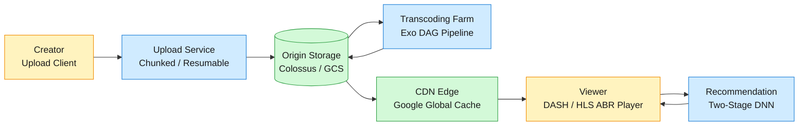
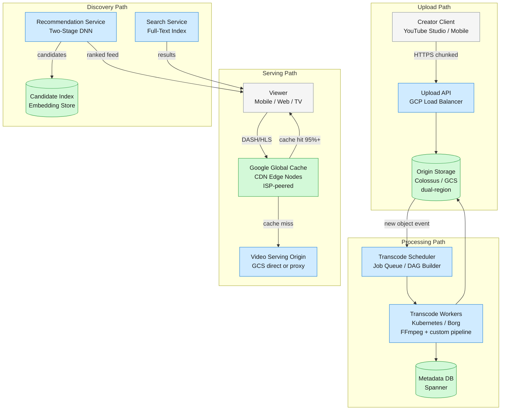
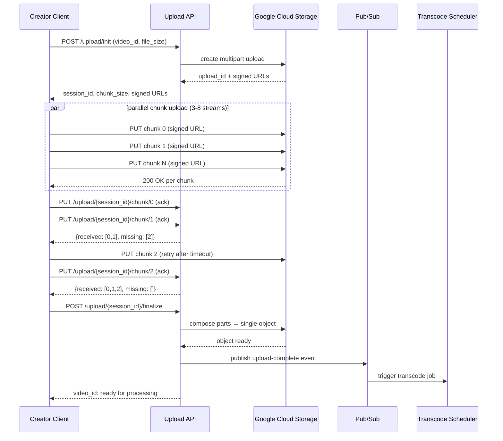

YouTube is the world's largest video platform — 2 billion monthly users upload 500 hours of video every minute, transcode it into a ladder of resolutions and codecs, and stream it to viewers on any device anywhere on Earth.

<!--more-->

## 1. Problem
YouTube is the world's largest video platform — 2 billion monthly users upload 500 hours of video every minute, transcode it into a ladder of resolutions and codecs, and stream it to viewers on any device anywhere on Earth. The core loop is upload → process → distribute → recommend. Each step operates at a scale where naive approaches fail: a single large upload dropped at 99% wastes hours of a creator's time; a transcode backlog measured in days destroys the immediacy creators expect; a CDN miss on a popular video melts the origin servers.



The design's hardest tension is not technical — it's economic. Transcoding every uploaded video into 10+ renditions costs compute; storing those renditions costs disk; serving them from edge caches costs bandwidth. YouTube's architecture is a machine for reducing the per-video cost of processing and delivery at a scale where even sub-cent optimizations save millions of dollars annually. Every architectural decision — from chunk size in uploads to codec selection to CDN cache warming — is a lever on that cost curve.

## 2. Requirements
**Functional**
- FR1: Upload video up to 256 GB with resumable, chunk-level fault tolerance.
- FR2: Transcode every upload into a multi-bitrate ladder (144p–8K, H.264/VP9/AV1).
- FR3: Stream via DASH/HLS with adaptive bitrate that switches quality mid-playback.
- FR4: Search billions of videos by title, description, and captions with relevance ranking.
- FR5: Generate a personalized feed from billions of candidates in under 200 ms.
**Non-functional**
- NFR1: 99.95% playback availability; 5+ effective nines with CDN cache serving.
- NFR2: Under 2 seconds video startup latency at p95 globally.
- NFR3: Survive datacenter loss without data loss — dual-region source storage.
- NFR4: Keep transcoding cost under $0.002 per source-minute amortized at scale.
**Out of scope:** Live streaming (different latency envelope), monetization/ad serving infrastructure, content ID/copyright matching, comment/moderation systems.

## 3. Back of the envelope
- 500 hrs/min uploaded × 60 × 24 → **720K hrs/day raw video**. At 500 MB/hr (compressed source) → **360 TB/day raw ingest**.
- 720K hrs/day × 10 renditions × 300 MB/hr avg → **2.2 PB/day of transcoded output**. At 5-year retention → **~4 EB total storage** for renditions alone.
- 500 hrs/min source → 10 renditions/video → **5K compute-hours of transcoding per minute of wall clock**, or ~83 concurrent compute-hours per second. At 4 vCPUs per transcode worker → **~750 workers needed just for steady state**. Peak uploads after events (Super Bowl, elections) can 3× this.
- 1B hours watched/day × 1 GB/hr streamed → **1 EB/day CDN egress**. At ~$0.01/GB (peered CDN) → **$10M/day bandwidth cost**.

## 4. Entities & API

```sql
Video {
  video_id:     uuid PK
  user_id:      uuid FK
  title:        string
  status:       enum      ← uploading | queued | processing | ready | failed
  source_bucket:string    ← GCS bucket + path to original upload
  duration_ms:  integer
  created_at:   timestamp
  renditions:   jsonb     ← denormalized []Rendition, written on transcode complete
}

Rendition {
  resolution:         string  ← 144p | 240p | … | 2160p | 4320p
  codec:              string  ← avc1 | vp9 | av01
  bitrate_kbps:       integer
  manifest_path:      string  ← GCS path to DASH .mpd or master .m3u8
  segment_duration_ms:integer ← typically 2000–5000
}

UploadSession {
  session_id:     uuid PK
  video_id:       uuid FK
  chunk_size:     integer   ← negotiated during init, typically 8–64 MB
  chunks_total:   integer?  ← null until finalize (unknown file size mid-upload)
  chunks_received:blob      ← Roaring bitmap tracking received chunk indices
  expires_at:     timestamp ← TTL, auto-cleanup stale sessions after 7 days
}

TranscodeJob {
  job_id:        uuid PK
  video_id:      uuid FK
  dag_definition:blob      ← serialized task DAG: split → encode → package
  priority:      integer   ← lower = sooner; normal=100, partner=10, re-transcode=500
  created_at:    timestamp
}

```

**API**
- `POST /upload/init` — create an upload session. Body: `{video_id, file_size?, chunk_size?}`. Returns `{session_id, upload_url, chunk_size}`. Chunk size negotiates to 8–64 MB.
- `PUT /upload/{session_id}/chunk/{index}` — upload chunk N. Returns `{received: [index, ...], missing: [index, ...]}`. Idempotent — re-PUT the same chunk is a no-op.
- `POST /upload/{session_id}/finalize` — close the session, verify all chunks received, assemble the source file, enqueue transcode.
- `GET /video/{video_id}/manifest` — return the DASH `.mpd` manifest listing all available renditions and segment timelines.
- `GET /video/{video_id}/segment/{rendition}/{index}` — fetch a specific media segment. Served from CDN edge; origin is fallback.
- `GET /search?q=...&page_token=...` — full-text search across titles/descriptions/captions with relevance ranking.
- `GET /recommendations?user_id=...&page_token=...` — personalized video feed, 30–50 results per page.

## 5. High-Level Design



The upload path is direct-to-storage: the upload API hands the client a signed URL for Google Cloud Storage, and chunks land directly in Colossus — the API tier never sees video bytes. This eliminates the upload proxy as a bandwidth bottleneck.
When the final chunk lands, a Pub/Sub event fires the transcode scheduler. It builds a DAG: split the source at scene boundaries → fan out per-chunk encode jobs (one per rendition) → assemble segments → write manifests. Workers pull jobs from a priority queue; partner-uploaded videos skip the line.
Serving is CDN-first. The origin stores master copies; edge caches (Google Global Cache nodes inside ISP networks) serve 95%+ of bytes. The viewer player runs BBA (Buffer-Based Adaptation), choosing rendition quality based on measured throughput and buffer occupancy — not a fixed bitrate ladder.
Discovery is two disjoint systems: search (inverted index over metadata and captions, relevance-ranked) and recommendations (two-stage DNN: candidate generation from a deep collaborative filtering model, ranking from a wide-and-deep model incorporating hundreds of features).

## 6. Deep dives

### DD1: Resumable chunked upload pipeline
**Problem.** Creators upload files from hundreds of MB to tens of GB over consumer internet connections that drop, throttle, and change IP addresses mid-transfer. An upload that fails at 99% must resume from the last committed byte, not restart from zero — losing hours of a creator's time to a network glitch is unacceptable churn.
**Approach: Single HTTP PUT with Content-Range resume.** The client issues a single PUT with the full file. On connection drop, the client sends a HEAD to learn how many bytes the server received, then resumes with a `Content-Range: bytes 52428800-*` PUT.
- *Pro:* Simple client logic — one HTTP request, standard `Content-Range` semantics, no session state on the server beyond the partially-written file.
- *Con:* No parallelism — the client uploads sequentially. For a 50 GB file at 10 Mbps, that is 11 hours; a single TCP flow cannot saturate available bandwidth. Server must hold a partially-written file that is unreadable until complete.
**Approach: Client-side chunking with server-coordinated session.** The client splits the file into fixed-size chunks (8–64 MB). It uploads each chunk as an independent HTTP request. The server tracks which chunks have arrived. The client can upload chunks in parallel (typically 3–8 concurrent streams).
- *Pro:* Parallelism — a client on a 100 Mbps connection can saturate it with 4 concurrent 25 Mbps streams. Chunk-level resume — only the chunks lost during a disconnect are retransmitted.
- *Con:* Server must maintain session state (chunk receipt bitmap). Client must implement chunking, parallel dispatch, and backoff logic. More complex than a single-stream upload.
**Approach: Direct-to-cloud multipart upload (chosen).** The upload API initiates a GCS multipart (compose) upload and returns signed URLs for each part. The client PUTs each chunk directly to GCS — the API tier never touches video bytes. When the client calls `/finalize`, the server issues a GCS compose call that assembles the parts into a single object atomically.
- *Pro:* Zero bandwidth through the application tier — the API is a control plane only. GCS multipart is battle-tested for objects up to 5 TB. Parallel upload of 32 parts simultaneously. Chunk-level idempotency via signed URLs. Server-side compose is a metadata operation (no data copy), completing in milliseconds.
- *Con:* Ties the design to a specific object store's multipart API (though S3 and Azure Blob have equivalent semantics). The compose operation is atomic, but individual part uploads are not — a part in flight when the client calls finalize is silently discarded.
**Decision:** Direct-to-cloud multipart upload. The upload API is a session manager that issues signed URLs and tracks receipt state. Video bytes flow from client to GCS directly.
**Rationale:** YouTube's own upload architecture (documented in the YouTube Data API v3 resumable upload protocol) uses exactly this pattern. The separation of control plane (API) from data plane (GCS) means the API scales independently of upload bandwidth — a $10/month API instance can orchestrate a 200 GB upload without breaking a sweat. The real constraint is the creator's uplink, not the server. Netflix's upload pipeline for studio content similarly uses direct-to-S3 multipart uploads.
**Edge cases:**
- **Chunk arrives after finalize:** The compose call has already executed. The late chunk is orphaned in GCS. The server writes a cleanup job that deletes orphaned parts older than 8 hours.
- **Client crashes mid-upload with no session state:** The client on restart calls `/upload/init` with the same `video_id`. The server returns the existing session with the current `chunks_received` bitmap. The client diffs against its local chunk list and uploads only missing chunks.
- **Signed URL expiry during a slow upload:** GCS signed URLs default to a configurable TTL (e.g., 4 hours). For uploads stretching longer, the client calls `POST /upload/{session_id}/extend` to refresh all outstanding signed URLs without re-uploading any data.
- **Chunk index collision from parallel upload threads:** Two client threads both upload chunk 42. GCS overwrites the part — the last write wins. The bitmask shows chunk 42 received. No corruption because chunks are immutable blobs.



### DD2: Transcoding pipeline — multi-bitrate DAG with scene-adaptive encoding
**Problem.** A single uploaded source video must become a ladder of 10+ renditions (144p through 8K) in multiple codecs (H.264 for legacy, VP9 for web, AV1 for efficiency). A naive sequential transcode of a 4-hour 4K video takes 12+ hours on a single machine. Doing this 500 hours/minute requires a parallel pipeline that splits the work without introducing visible seams between chunks.
**Approach: Monolithic FFmpeg pipeline.** One process transcodes the full video sequentially into all renditions. FFmpeg's filter graph handles scaling, encoding, and segmenting in one pass.
- *Pro:* Simple to operate — one command, one machine, no coordination. No seam artifacts because FFmpeg sees the full GOP structure.
- *Con:* Single-threaded by design (encoding is CPU-bound, not easily parallelized across frames because of inter-frame dependencies). A 4-hour 4K video takes 12–24 hours. Cannot scale horizontally — doubling throughput means duplicating the entire pipeline for each video, not splitting one video across workers.
**Approach: MapReduce-style split → transcode → concat.** Split the source video into equal-duration chunks (e.g., 30 seconds each) at arbitrary byte offsets. Fan out each chunk to a worker that transcodes it into all renditions. Concatenate the resulting segments.
- *Pro:* Embarrassingly parallel — 100 chunks = 100 workers, near-linear speedup. Simple chunk assignment.
- *Con:* Splitting at arbitrary offsets cuts through GOPs (Groups of Pictures). An H.264 video with a 5-second GOP split at second 3 produces a chunk whose first 2 seconds reference frames in the previous chunk — un-decodable without that reference. Concatenation at GOP boundaries requires re-encoding boundary frames, reintroducing sequential work. Visible artifacts (frame flickers, audio pops) at every seam.
**Approach: Scene-aware GOP-aligned splitting with task DAG (chosen).** The pipeline first analyzes the source to detect scene boundaries (sharp visual cuts, silence gaps in audio). It splits at scene boundaries, which naturally align with GOP boundaries because encoders insert keyframes at scene changes. Each split becomes a task in a DAG: split → encode (one task per chunk × per rendition) → assemble segments → package manifest.
- *Pro:* Perfectly parallel encode phase — all chunk × rendition combinations run independently. No seam artifacts because splits align with GOP boundaries. Scene-aware splitting improves compression efficiency: a static talking-head scene and an action scene get different encoder parameters (CRF, motion estimation) optimized for their content.
- *Con:* A pipeline orchestrator is needed to build and execute the DAG. Scene detection adds a sequential pre-pass (~5% of total transcode time). Worker utilization is uneven — a 30-second action scene encodes slower than a 30-second static scene, creating stragglers.
**Decision:** Scene-aware GOP-aligned DAG pipeline. The transcode is not a batch job — it is a workflow with dependencies, fan-out, and fan-in. A DAG scheduler (similar to Airflow or Google's internal workflow engine) handles retries, straggler mitigation (speculative execution), and priority ordering.
**Rationale:** YouTube's Exo transcode system (described in Google technical talks) uses exactly this architecture. The key insight is that video encoding has a natural parallelism point — scene boundaries — and exploiting it requires a pre-pass analysis step that pays for itself many times over through parallel execution. Netflix's encoding pipeline similarly uses shot-based encoding: split at scene cuts, encode each shot at multiple quality levels, then assemble. The DAG model also enables partial re-encoding: if YouTube adds a new codec (e.g., AV1), only the encode tasks are re-run, not the split or package tasks.
**Edge cases:**
- **Single-scene video (e.g., security camera footage):** The scene detector finds 0 boundaries in a 24-hour video. The pipeline falls back to fixed-interval splitting at 30-second boundaries with GOP-aware alignment — it scans forward from each split point to find the nearest keyframe. This produces uneven chunks (28–32 seconds) but avoids GOP cuts.
- **Straggler worker:** A 4K AV1 encode of a complex scene takes 5× the median chunk time. The DAG scheduler launches a speculative copy on another worker after 2× median time has elapsed. Whichever finishes first is used; the other is killed.
- **Worker crash mid-encode:** The DAG scheduler detects the task timeout (no heartbeat for 60 seconds) and re-queues it at the same priority. The partial output is discarded — encoders cannot resume from mid-stream state.
- **Codec availability per rendition:** H.264 is encoded for all resolutions (universal device support). VP9 is encoded for 360p and above (Android/Chrome). AV1 is encoded for 480p and above (bandwidth savings justify the 3× encode time). The DAG encodes only the relevant codec × resolution combinations — ~25 tasks per video, not 10 renditions × 3 codecs = 30.

### DD3: CDN streaming and adaptive bitrate
**Problem.** A viewer in Mumbai on a 2 Mbps mobile connection and a viewer in Seoul on a 500 Mbps fiber connection both expect smooth playback of the same video. The player must select the right quality in real time, switch quality when conditions change, and start playback in under 2 seconds. The CDN must serve 1 EB/day of video without the origin melting.
**Approach: Throughput-based ABR.** The player measures the download throughput of the last few segments and picks the highest bitrate below that throughput. Simple rule: `bitrate < measured_throughput × 0.9`.
- *Pro:* Trivially simple to implement. Reacts quickly to bandwidth increases.
- *Con:* Overreacts to transient throughput spikes — a brief burst of bandwidth causes an aggressive quality increase, then a drop when the spike ends, producing visible quality oscillation. Ignores buffer state — on a connection with 5 Mbps average but 30-second buffered video, there is headroom to try a higher quality safely even if throughput momentarily dips.
**Approach: Buffer-Based Adaptation (BBA).** Ignore throughput entirely. Map buffer occupancy directly to quality: buffer < 5 seconds → lowest quality; buffer 5–10 seconds → middle quality; buffer > 30 seconds → highest quality. Fill the buffer as fast as possible at the chosen quality.
- *Pro:* Eliminates quality oscillation — buffer level changes slowly and predictably. Handles variable throughput gracefully: a temporary dip drains the buffer a bit; the quality drops only if the buffer crosses a threshold. Works well for on-demand video where buffer can be large.
- *Con:* Startup delay is higher — the player must fill the buffer to the first threshold before playback begins. On a very fast connection, BBA stays at medium quality until buffer crosses a threshold, wasting the available bandwidth.
**Approach: Hybrid BBA with throughput cap (chosen).** The player runs BBA as the primary controller but caps the selected quality at the measured throughput. `selected_quality = min(BBA_quality(buffer_level), throughput_quality(measured_bw × 0.9))`. This combines buffer-level stability with throughput-aware ceiling — a viewer on gigabit fiber reaches max quality quickly because throughput is never the bottleneck; a viewer on 2 Mbps stays at low quality because throughput caps it regardless of buffer.
- *Pro:* Eliminates oscillation (from BBA) while respecting the hard constraint of bandwidth (from throughput cap). The 2014 SIGCOMM paper that introduced BBA found this hybrid performs best in real-world traces. Used in production by YouTube's DASH player.
- *Con:* Slightly more complex — the player must track both buffer level (in seconds of video) and throughput (in Mbps). The throughput measurement requires a moving average over the last 3–5 segments to smooth out TCP bursts.
**Decision:** Hybrid BBA. The player requests DASH segments from the closest CDN edge. The DASH manifest lists all available renditions and their segment URLs; the player's ABR logic picks which rendition's next segment to download.
**Rationale:** BBA is the academic consensus algorithm for ABR streaming. The SIGCOMM 2014 paper "A Buffer-Based Approach to Rate Adaptation" demonstrated that BBA outperforms throughput-based algorithms across a corpus of real-world network traces, achieving 10–20% higher average quality with 40–60% fewer quality switches. YouTube's player (per analysis of their DASH implementation) uses BBA-derived logic. The hybrid with throughput cap addresses BBA's one weakness: on fast connections, the buffer fills instantly at the highest quality that fits — the throughput cap prevents the player from selecting 4K on a 1080p display just because the buffer is full.
**Edge cases:**
- **Live streaming (different animal):** BBA assumes the player can build a large buffer. In live streaming, the buffer is capped at 2–30 seconds (latency vs stability tradeoff). Live ABR typically uses throughput-based adaptation with a conservative quality cap, because buffer-based adaptation with a small buffer is essentially throughput-based (buffer drains immediately on any mismatch).
- **CDN cache miss storm:** A new viral video gets 1M simultaneous first views. The CDN edge serving those viewers has 0% cache hit rate for that video. The edge node's upstream connection to origin saturates. The player detects slow downloads, drops quality to 144p via BBA, and the storm passes. Mitigation: YouTube pre-warms CDN caches for videos from channels with >1M subscribers — the transcode pipeline pushes the first segments to top-level CDN nodes on completion.
- **Segment duration tradeoff:** Shorter segments (2 seconds) allow faster quality switching but increase manifest size and HTTP request overhead. Longer segments (10 seconds) reduce overhead but slow quality adaptation. YouTube uses 5-second segments (per their DASH manifest analysis), a middle ground that keeps request overhead under 1% while allowing quality switches within 5 seconds of a bandwidth change.
- **Codec switch mid-stream:** A viewer on Chrome starts with VP9, then moves to a device that only supports H.264. The DASH manifest includes multiple AdaptationSets (one per codec). The player switches AdaptationSets at a segment boundary — the ABR logic runs independently for each codec, and the player picks the AdaptationSet whose best rendition fits the current conditions.

### DD4: Two-stage DNN recommendation system
**Problem.** YouTube must select 30–50 videos for a user's homepage from a corpus of billions. The system must do this in under 200 ms, incorporating the user's watch history, search history, demographic signals, and contextual features (time of day, device, location). The model must balance relevance (will they click?), engagement (will they watch to completion?), and freshness (is this newly uploaded and trending?).
**Approach: Single-stage collaborative filtering.** Precompute video-video and user-video similarity matrices using matrix factorization (SVD, ALS). At serving time, look up the user's embedding, find the nearest video embeddings, and return the top-N.
- *Pro:* Fast at serving time — just a nearest-neighbor lookup in a pre-built index. Well-understood, proven for decades (Netflix Prize era).
- *Con:* Cannot incorporate side features (freshness, device, time of day) — the embedding captures only watch history. Cold start for new videos — a video with 0 watches has no embedding. Cold start for new users is even worse. Retraining the full matrix takes hours, so the model is always days stale. Scale: a 2B-user × 10B-video matrix does not fit in RAM; approximate nearest neighbor (ANN) is required, but even the index is 10B × 256 dimensions × 4 bytes = 10 TB.
**Approach: Content-based filtering with metadata only.** Rank videos by matching user's past watch topics (tags, categories, captions) to candidate videos' metadata using TF-IDF or embeddings.
- *Pro:* No cold start problem — new videos have metadata. Simple to implement and explain. Deterministic and debuggable.
- *Con:* Ignores behavioral signals entirely. A user who watches one cooking video because it went viral is not actually a cooking enthusiast — content-based systems overfit on transient interests. Cannot learn subtle patterns (users who watch video A tend to then watch video B, even if they have no overlapping metadata).
**Approach: Two-stage DNN — candidate generation + ranking (chosen).** Stage 1 (candidate generation): a deep neural network trained on watch history as a classification problem — given a user's context, predict which video they will watch from the entire corpus. This is formulated as extreme multiclass classification with millions of classes (one per video). At serving time, the model's final softmax layer is replaced with an ANN lookup — given the user embedding from the penultimate layer, find the nearest few hundred video embeddings.
Stage 2 (ranking): a separate DNN scores each of the ~500 candidates on predicted watch time. The model is trained with logistic regression on watch-time-weighted binary labels (positive = user watched, weighted by watch duration; negative = impression without click). Features include hundreds of signals: user embedding from stage 1, video metadata, video embedding, freshness, language match, session features (time of day, device), and historical CTR for this (user, channel) pair.
- *Pro:* Scales to billions of videos — stage 1 reduces the search space from billions to hundreds in one ANN lookup. Stage 2 can incorporate any feature, trained offline, and deployed as a real-time scorer. Watch-time optimization (not click-through rate) naturally penalizes clickbait — a 1-second click on a misleading thumbnail contributes near-zero watch time. The architecture is proven: YouTube's 2016 RecSys paper describes exactly this system, reporting that watch-time-weighted ranking increased total watch time by 20% over CTR-optimized ranking.
- *Con:* Two models to train, deploy, and monitor. Stage 1 requires a full re-train to pick up new videos (daily cadence in practice). The ANN index for stage 1 must be rebuilt after each training run and pushed to serving infrastructure. The system is a black box — explaining why a particular video was recommended requires tracing both models.
**Decision:** Two-stage DNN. Stage 1 reduces search space; stage 2 scores for watch time. The model training pipeline runs daily; the serving path queries a pre-built embedding index and a real-time scorer.
**Rationale:** YouTube's published architecture (RecSys 2016) is one of the most influential recommendation system designs in industry because it explicitly optimizes for engagement, not clicks. The two-stage pattern — candidate generation followed by ranking — has been adopted by nearly every large-scale recommendation system since (TikTok, Netflix, Spotify, Amazon). The key production insight is that candidate generation is a retrieval problem (find a few hundred from billions), while ranking is a scoring problem (sort the few hundred). Separating them lets each stage use the right algorithm for its scale — ANN for retrieval, DNN with rich features for ranking.
**Edge cases:**
- **Cold start for new users:** Stage 1 has no watch history to build a user embedding. The system falls back to a demographic prior — age group, geographic region, and device type predict a default slate (e.g., trending in the user's country). After 3–5 watches, the personalized model takes over with an initial user embedding. YouTube's actual practice: the homepage for a first-time visitor shows trending and popular videos in their language.
- **Cold start for new videos:** A freshly uploaded video has no watch history, so its stage 1 embedding is random or zero-initialized. Mitigation: the ranking stage includes freshness as an explicit feature — brand-new videos from a user's subscribed channels get a freshness boost. Additionally, YouTube runs a separate "exploration" pipeline that inserts a small percentage of new videos into feeds to collect initial engagement signals.
- **Filter bubble / diversity collapse:** A purely engagement-optimized recommender converges on a narrow set of popular, high-watch-time videos. Mitigation: the ranking stage adds a diversity penalty — if N videos from the same channel or the same narrow topic are already in the feed, subsequent candidates from that channel/topic are down-ranked. YouTube also injects "exploration" items (1–3 per page) from outside the user's learned interest cluster.
- **Serving latency budget:** Stage 1 (ANN lookup) takes ~10 ms. Stage 2 (scoring 500 candidates) takes ~50 ms with a small model on GPU. Total: ~60 ms, well within the 200 ms budget. The remaining budget covers network round-trips and page assembly. Model inference runs on GPU-accelerated servers (TPU or NVIDIA T4); the embedding index is served from in-memory ANN indices (ScaNN or FAISS).

## 7. Trade-offs
| Decision | Chosen | Rejected | Why |
|---|---|---|---|
| Upload architecture | Direct-to-GCS multipart | Proxy-through-API upload | Eliminates upload bandwidth bottleneck at the API tier; GCS multipart is battle-tested for TB-scale objects; API becomes a lightweight control plane |
| Upload chunk size | 8–64 MB (client-negotiated) | 1 MB (many small) or 256 MB (few large) | 1 MB chunks = excessive HTTP overhead (10K requests for 10 GB); 256 MB = high retransmit cost per chunk loss; 8–64 MB balances overhead and granularity |
| Transcode parallelism | Scene-aware GOP-aligned splitting | Fixed-interval splitting or monolithic FFmpeg | GOP-aligned splitting eliminates seam artifacts; scene awareness improves compression per scene; monolithic is too slow at scale |
| Codec strategy | H.264 universal + VP9/AV1 selective | Single codec (H.264 only) | VP9 saves 30% bandwidth vs H.264; AV1 saves another 20% vs VP9; but encode cost is 3–5× higher — selective encoding for higher resolutions amortizes the compute cost against bandwidth savings |
| ABR algorithm | Hybrid BBA (buffer + throughput cap) | Pure throughput-based or pure BBA | BBA eliminates oscillation; throughput cap prevents wasteful quality selection on fast connections; SIGCOMM 2014 benchmarks show 10–20% higher avg quality with 40–60% fewer switches |
| CDN architecture | Google Global Cache (ISP-peered) | Commercial CDN (Akamai, CloudFront) | YouTube runs on Google's network — peering directly with ISPs at thousands of edge locations reduces latency and eliminates per-GB egress fees that would cost $10M+/day |
| Storage durability | Erasure coding (Reed-Solomon) | 3× full replication | At 4 EB of rendered video, 3× replication = 12 EB raw storage; Reed-Solomon with 1.2–1.5× overhead = 5–6 EB; saves ~$500M/year in disk and power |
| Recommendation freshness | Daily model retrain + freshness feature boost | Real-time model updates | Full model retraining is hours; daily cadence captures new video trends; freshness as a ranking feature handles intra-day recency; real-time training adds complexity disproportionate to gain |
| Search index | Inverted index over metadata + captions | Full video-content indexing | Transcribing and indexing every frame of every video is cost-prohibitive at YouTube scale; metadata + auto-generated captions (speech-to-text) capture ~95% of search intent |
| Failure mode during CDN miss | Serve from origin (degraded performance) | Fail (error page) | A slow-loading video is better than no video; viewers tolerate 5s startup, not a dead page; origin has sufficient capacity for the 5% tail of CDN misses |

## 8. References
1. [YouTube Data API — Resumable Uploads](https://developers.google.com/youtube/v3/guides/using_resumable_upload_protocol) — HTTP 1.1 resumable upload protocol, chunk sizing, session management
1. [Google Cloud Storage — Multipart Uploads](https://cloud.google.com/storage/docs/parallel-composite-uploads) — Composable object semantics, signed URLs, part management
1. [YouTube DNN Recommendation (Covington et al., RecSys 2016)](https://research.google/pubs/pub45530/) — Two-stage deep neural network: candidate generation via extreme multiclass classification, ranking via watch-time-weighted logistic regression
1. [Buffer-Based Rate Adaptation (Huang et al., SIGCOMM 2014)](https://dl.acm.org/doi/10.1145/2619239.2626296) — BBA algorithm: buffer occupancy → quality mapping, hybrid with throughput cap, benchmarks vs throughput-based ABR
1. [DASH Standard (ISO/IEC 23009-1)](https://www.iso.org/standard/83314.html) — MPEG-DASH manifest format, segment structure, AdaptationSet for codec switching
1. [Google Global Cache](https://peering.google.com/#/infrastructure) — ISP-peered edge caching, thousands of nodes in ISP networks globally
1. [Netflix Technology Blog — Shot-Based Encoding](https://netflixtechblog.com/optimized-shot-based-encodes-now-streaming-4b846f5ef0b0) — Scene-aware split → parallel encode → assemble pipeline, the architecture YouTube's Exo system mirrors
1. [Google SRE Book — Managing Critical State](https://sre.google/sre-book/managing-critical-state/) — Distributed consensus, erasure coding vs replication for durability at exabyte scale
1. [WebM Project / VP9](https://www.webmproject.org/vp9/) — VP9 codec specification and real-world bandwidth savings vs H.264
1. [AOM AV1 Specification](https://aomedia.org/av1/) — AV1 codec: 30% bandwidth reduction over VP9, 3–5× encode cost tradeoff
