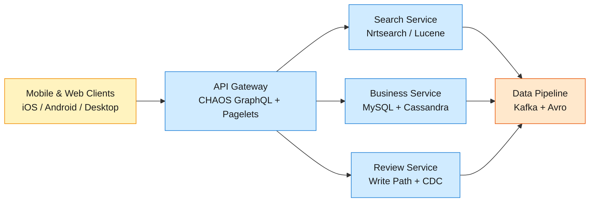
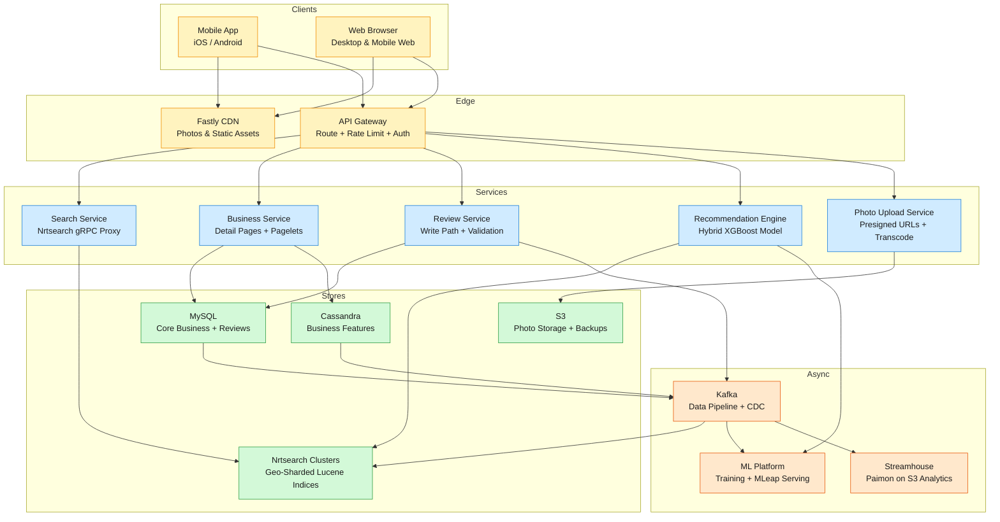

Yelp is a local business discovery platform that connects 139 million monthly active users with over 200 million businesses worldwide through search, reviews, photos, and recommendations.

<!--more-->

## 1. Problem

Yelp is a local business discovery platform that connects 139 million monthly active users with over 200 million businesses worldwide through search, reviews, photos, and recommendations. A user opens the app near a location, searches for "ramen open now," and expects a ranked list of nearby restaurants with star ratings, review snippets, and photos — in under 200 milliseconds. The core technical tension is the 100:1 read-to-write ratio: every review written fans out to update search indexes, rating aggregates, recommendation models, and analytics pipelines, while millions of concurrent read requests must be served from precomputed, cached, and geographically distributed indices. Reliability is existential — a degraded search result loses the user to Google Maps or DoorDash in the time it takes to tap "back."



## 2. Requirements

**Functional**

- FR1: Search for businesses by text query, category, and geographic area.

- FR2: View a business detail page with ratings, reviews, photos, and hours.

- FR3: Submit a review with a 1–5 star rating and optional text body.

- FR4: Browse recommended reviews filtered from low-quality or suspicious contributions.

- FR5: Upload photos alongside reviews and view them at multiple resolutions.

- FR6: Receive personalized business and review recommendations by location.

*Out of scope: business owner administration tools, reservations and transactions, real-time chat, advertising platform.*

**Non-functional**

- NFR1: Serve search results with p95 latency under 200 ms.

- NFR2: Maintain 99.95% availability across all regions.

- NFR3: Sustain a 100:1 read-to-write ratio at 100M+ MAU scale.

- NFR4: Display newly submitted reviews to their author immediately (read-your-writes).

## 3. Back of the envelope

- 100M DAU × 5 searches/day ≈ **500M searches/day → ~5,800 QPS avg, ~15K peak**. Each search is a geo-filtered Lucene query scanning thousands of nearby businesses, then running a ranking model per candidate. A single monolithic ES cluster would need to handle peak geo queries across the entire planet — decision: **geo-shard the search index by continent-scale regions**, each running an independent Nrtsearch cluster sized for its own peak.

- 100:1 read:write ratio with ~1M new reviews/day → read path (~100M QPS across all page loads) dwarfs the write path. The hot dataset (business names, ratings, top reviews, photos) totals ~10 TB and is largely immutable between writes — decision: **cache everything except the ranking model inference at the CDN and application layer**, with write-through cache invalidation via the data pipeline.

- 200M businesses × ~2 KB avg document × Lucene indexing overhead (~2.5×) ≈ **1 TB per geo-shard replica**. With 3 replicas per shard across 6 geo regions, the full search footprint is ~18 TB — well within a modest cluster of ~50 storage-optimized nodes and a fraction of the bandwidth budget of the media pipeline (100K+ photo uploads/day at ~200 KB each → 20 GB/day uploaded).

## 4. Entities & API

```
Business {
  business_id:  uuid PK
  name:         string
  location:     geo_point           ← lat/lon, indexed in Lucene BKD tree
  categories:   string[]            ← denormalized for fast filtering
  avg_rating:   decimal(2,1)        ← precomputed aggregate, updated async
  review_count: integer             ← precomputed; drives Bayesian smoothing
  price_level:  enum                ← $ | $$ | $$$
  hours:        jsonb               ← structured open/close per day
  photos:       string[]            ← top-N photo keys for detail page
}

Review {
  review_id:    uuid PK
  business_id:  uuid FK             ← partition key for business-scoped queries
  user_id:      uuid FK
  rating:       smallint            ← 1–5
  text:         text
  photos:       string[]            ← media refs; empty for text-only reviews
  is_recommended:boolean            ← set by async recommendation classifier
  created_at:   timestamp
}

User {
  user_id:      uuid PK
  display_name: string
  avatar_ref:   string
  review_count: integer             ← denormalized for trust scoring
  elite_since:  integer?            ← year; null if never elite
  created_at:   timestamp
}

Photo {
  photo_ref:    string PK           ← content-hash (SHA-256) for dedup
  business_id:  uuid FK
  user_id:      uuid FK
  s3_key:       string              ← raw upload path
  resolutions:  jsonb               ← {small, medium, large, original} CDN URLs
  category:     enum?               ← food | interior | menu | exterior (ML classifier)
  uploaded_at:  timestamp
}

BusinessCategory {
  business_id:  uuid PK
  category:     string SK           ← sort key; enables category-filtered geo search
}
```

**API**

- `GET /v1/search?q=<text>&lat=<float>&lon=<float>&radius=<meters>&categories=<csv>&sort=<relevance|distance|rating>` — search businesses near a point; returns ranked list of `business_id`, name, rating, distance, and category.

- `GET /v1/businesses/:id` — full business detail including hours, top reviews, photos, and aggregate rating.

- `GET /v1/businesses/:id/reviews?sort=<newest|highest|lowest>&cursor=<opaque>` — paginated review list for a business; cursor-based after ~20 reviews deep.

- `POST /v1/reviews` — submit a review; body includes `business_id`, `rating` (1–5), `text`, and optional `photo_refs`. Returns `review_id`. Idempotency via `Idempotency-Key` header.

- `POST /v1/photos/upload` — request a presigned S3 upload URL; returns `upload_url` + `photo_ref` (content hash). Client uploads directly to S3, then references the hash in the review submission.

- `GET /v1/recommendations?lat=<float>&lon=<float>` — personalized business recommendations within range; returns ranked business cards.

## 5. High-Level Design



#### FR1: Search for businesses by text, category, and location

**Components:** Client → API Gateway → Search Service → Nrtsearch Clusters (geo-sharded)

**Flow:**

1. Client sends `GET /v1/search?q=ramen&lat=37.7749&lon=-122.4194&radius=5000&categories=restaurants&sort=relevance`.

1. API Gateway authenticates the request, rate-limits by user session, and routes to the **Search Service**.

1. Search Service encodes the user's `(lat, lon)` into a geohash at precision 6, then expands to the 9-cell grid (target cell + 8 neighbors) to capture boundary businesses.

1. Search Service dispatches a gRPC `SearchRequest` to the **Nrtsearch Coordinator**, which fans the query out to the geo-shard cluster(s) covering the user's location.

1. Inside each Nrtsearch cluster, a `geo_distance` filter on the `location` BKD-tree field prunes the candidate set to businesses within 5 km, a `match` query on `categories` filters, and a `function_score` query applies the ranking model (distance decay × Bayesian-smoothed rating × Lucene BM25 text relevance).

1. Coordinator merges results from all shards via a top-K priority-queue merge, respecting the requested sort order.

1. Search Service returns an ordered list of `{business_id, name, rating, distance, top_category, photo_thumb_url}` to the client.

**Design consideration:** The geohash 9-cell expansion is a fixed-overhead trade-off. At precision 6 (~1.2 km × 0.6 km cells), searching 9 cells covers a ~3.6 km × 1.8 km area — more than enough to envelop a 5 km radius circle without missing edge cases. For dense urban cores (Manhattan, Tokyo), a single geohash-6 cell can contain thousands of businesses; the real pruning happens inside Lucene's BKD tree, not in the cell pre-filter. The geohash step narrows the shard set — the BKD tree does the spatial math.

#### FR2: View a business detail page

**Components:** Client → CDN (photos) + API Gateway → Business Service → MySQL + Cassandra + Pagelets (parallel sub-requests)

**Flow:**

1. Client requests `GET /v1/businesses/:id`.

1. API Gateway routes to **Business Service**, which queries MySQL for core data: `SELECT * FROM businesses WHERE business_id = ?`.

1. Business Service fires parallel **Pagelet** HTTP futures: `/pagelet/reviews`, `/pagelet/photos`, `/pagelet/map`, `/pagelet/info` — each targeting a dedicated microservice.

1. While pagelets render asynchronously, Business Service assembles the skeleton response from its own synchronous work (name, rating, hours, price level).

1. On pagelet completion (with a 2-second timeout per fragment), Business Service assembles the final response, falling back to cached or skeleton HTML for any fragment that missed its deadline.

1. Client receives a complete page with inlined photos (resolved to CDN URLs like `s3-media. fl.yelpcdn.com/.../ms.jpg` for medium thumbnails, `/l.jpg` on tap-to-expand).

**Design consideration:** Pagelet timeouts are the circuit breaker. If the photos microservice is slow, the user still sees the business name, rating, and reviews within the 200 ms SLA — the photos slot fills in a loading skeleton. The `avg_rating` and `review_count` on the `Business` row are **precomputed aggregates** updated asynchronously via the data pipeline; the detail page never joins the reviews table. This is the same pattern that keeps Amazon product pages fast: read a single denormalized row, not a scatter-gather across normalized tables.

#### FR3: Submit a review with star rating and text

**Components:** Client → API Gateway → Review Service → MySQL (outbox) → Kafka CDC → search index + rating recompute + ML classifier

**Flow:**

1. Client sends `POST /v1/reviews` with `{business_id, rating, text}` and an `Idempotency-Key` header.

1. Review Service validates `rating` is 1–5, `text` is under 5,000 characters, and the user hasn't already reviewed this business (optimistic: check `UNIQUE(user_id, business_id)` on insert).

1. Review Service writes the review to the `reviews` table in MySQL inside a transaction — this is the **outbox row** and the system's single source of truth.

1. MySQL binlog CDC (**MySQLStreamer**) captures the `INSERT` event and publishes it to the `reviews.created` Kafka topic in canonical Avro format.

1. **Elasticpipe** (Flink-based consumer) picks up the event and indexes the review text into the relevant Nrtsearch cluster for future text searches.

1. **Rating Aggregator** (another Kafka consumer) recomputes `avg_rating` and `review_count` on the `businesses` table with an atomic delta: `UPDATE businesses SET avg_rating = (avg_rating * review_count + :new_rating) / (review_count + 1), review_count = review_count + 1`.

1. **Recommendation Classifier** (async Spark/ML batch) evaluates the new review against hundreds of trust signals and sets `is_recommended` — the review appears on the business page only after this flag flips to true.

**Design consideration:** The `Idempotency-Key` prevents duplicate submissions on retry — the Review Service stores the key in a `idempotency_keys` table with a 24-hour TTL. If the client retries a POST with the same key, the service returns the original `review_id` instead of creating a duplicate. The at-least-once Kafka delivery means downstream consumers must also be idempotent: the rating aggregator's delta update is commutative and the search indexer uses `review_id` as the document ID (upsert semantics). The read-your-writes guarantee for the review author is handled optimistically: after POST, the client inserts the review at the top of the business's review list locally, then refreshes after ~3 seconds when the recommendation classifier has evaluated it.

#### FR4: Browse recommended reviews

**Components:** Business Service → MySQL (only `is_recommended = true`) → Pagelet review fragment

**Flow:**

1. When the review Pagelet queries `SELECT * FROM reviews WHERE business_id = ? AND is_recommended = true ORDER BY created_at DESC LIMIT 20`, ~26% of reviews are filtered out — those caught by the classifier.

1. The recommendation classifier runs as an offline batch job (hourly), evaluating every unreviewed review against four signal dimensions: conflict of interest (IP matching, single-review accounts), solicitation (review-ring detection via graph analysis), reliability (new account, low activity, no elite status), and usefulness (sentiment outliers, distribution anomalies).

1. Reviews classified as **not recommended** aren't deleted — they live behind an expandable link at the bottom of the page. Their star ratings don't feed into the business's `avg_rating`.

1. A review's status can change as the reviewer accumulates more history: a previously "not recommended" review from a user who later becomes active and elite may be reclassified to "recommended" during a periodic full re-evaluation.

**Design consideration:** The recommendation classifier is Yelp's key differentiator and a hard requirement for trust. Without it, a restaurant owner could register five accounts and boost their rating from 3.0 to 4.5 in an afternoon. The classifier doesn't aim for perfect recall — it optimizes for precision on the "recommended" label, accepting that some legitimate reviews from new users are hidden temporarily. The `is_recommended` boolean is indexed and included in the composite index `(business_id, is_recommended, created_at)` so the common query path hits a covering index scan.

#### FR5: Upload photos alongside reviews

**Components:** Client → S3 (direct upload) → Photo Upload Service → Image Processing Pipeline → CDN → Metadata in MySQL

**Flow:**

1. Client calls `POST /v1/photos/upload` with content type and expected byte length.

1. Photo Upload Service generates a **presigned S3 PUT URL** with a 5-minute expiry and returns it alongside a `photo_ref` (SHA-256 of the expected content).

1. Client uploads the raw photo directly to S3 via the presigned URL — bypassing the application servers entirely.

1. S3 `PutObject` event triggers the **Image Processing Pipeline** (Lambda or Flink): `mozjpeg` re-encodes the image at 85% quality with 4:2:0 chroma subsampling (30% size reduction, imperceptible quality loss), then resizes to four resolutions: `ms.jpg` (100×100), `s.jpg` (240×240), `l.jpg` (600×600), `o.jpg` (original).

1. Processed images land back in S3 under content-hash-addressed paths; CDN caches them at the edge via `s3-media.fl.yelpcdn.com`.

1. Client includes the `photo_ref` in the review submission body. Review Service links it to the `reviews` and `businesses` rows.

1. An hourly **photo classification** batch job runs a deep learning model over uncategorized photos to assign labels like `food`, `interior`, `menu`, `exterior`.

**Design consideration:** The presigned-URL pattern keeps multi-megabyte photo uploads off the application servers entirely. The content-hash addressing (`photo_ref`) means identical photos uploaded by different users (same menu photo, same storefront) deduplicate automatically — SHA-256 collision isn't a practical concern for user-generated content. The `mozjpeg` step saves terabytes per day in CDN egress bandwidth; Yelp reported a 30% average size reduction with no user-visible quality change.

#### FR6: Personalized recommendations

**Components:** Client → API Gateway → Recommendation Engine → Nrtsearch (recall) + MLeap (rerank)

**Flow:**

1. Client calls `GET /v1/recommendations?lat=37.7749&lon=-122.4194`.

1. Recommendation Engine performs a **two-stage retrieval**: first, Nrtsearch returns ~500 candidate businesses within the user's radius, filtered by preferred categories, weighted by recent search history.

1. Second, a **hybrid XGBoost LambdaMART model** (served via MLeap) scores each candidate on interaction features (past views, bookmarks, calls from this user and similar users), content features (category match, review text similarity via Universal Sentence Encoder embeddings), and freshness signals.

1. The model was trained with `rank:ndcg` objective, grouped by `(user_id, location_hash)`, and uses a recall-based negative sampling strategy — negatives are drawn from businesses the user could realistically have seen but didn't interact with, not random businesses from another continent.

1. Top 20 scored businesses are returned with reason snippets (e.g., "You've bookmarked similar ramen spots").

**Design consideration:** The two-stage design solves the classic recommendation latency problem at scale. Computing the full XGBoost model over 200M businesses per request is prohibitive; the Nrtsearch recall step narrows to ~500 candidates in ~10 ms, and the MLeap rerank over 500 candidates runs in ~5 ms. The model's negative sampling strategy is critical: random negatives create a biased training set because 99.99% of the world's businesses are irrelevant to any given user. By sampling only from businesses the user was exposed to (search results viewed, page impressions), the model learns to rank among realistic alternatives.

## 6. Deep dives

### DD1: Geo-spatial search

**Problem.** A user searches for "pizza" within 5 km of their location. The system must return the 20 most relevant businesses from a corpus of 200M+ spread across the globe — in under 50 ms. A naive approach (full scan or a single giant index) collapses at Yelp's read volume: 15K peak QPS means 750K businesses evaluated per second before ranking, at minimum. The spatial index must prune 99.99% of the corpus *before* text matching and ranking begin, and it must handle the reality that business density varies by three orders of magnitude between Manhattan and rural Montana.

**Approach: Geohash prefix sharding + neighbor expansion**

Yelp's legacy search sharded businesses by geohash prefix at precision 2 (~2,500 km × 1,250 km cells). Each cell maps to an independent search cluster. A search at `(lat, lon)` routes to the cluster covering that cell plus, for queries near a cell boundary, the adjacent cluster.

*How it works:* Encode `(lat, lon)` to a geohash string, truncate to length 2 — e.g., `9q` for western Americas. The Coordinator maintains a mapping of geohash-2 prefixes to cluster endpoints. On a boundary query (within a configurable "fudge factor" distance of the cell edge), the Coordinator fans out to both clusters and merges results. For dense regions (a single cell containing millions of businesses), the cluster itself is horizontally scaled via microsharding (`business_id % n`).

**Challenges:**

- **Precision is fixed.** A precision-2 cell covers 2,500 km — it's a continent-level split, not fine-grained. Dense cells (Asia-Pacific) still hold tens of millions of businesses, so microsharding is mandatory. But microsharding by `business_id` scatters nearby businesses across all shards, forcing every search to broadcast to all microshards within the region. This works at moderate scale (6 microshards × 5M businesses each) but the broadcast cost grows linearly with the number of shards.

- **Boundary queries amplify load.** Every query near a cell boundary hits two full clusters. At 15K peak QPS, 10% boundary overlap means 1,500 extra cluster queries per second — manageable but it demands capacity headroom on every cluster for its neighbors' boundary traffic.

- **No adaptive density.** A single geohash cell that contains Manhattan (>20K restaurants per km²) and a cell covering the Sahara (~0 businesses) get the same index allocation. The fixed grid wastes infrastructure on sparse regions and under-provisions dense urban cores.

**Approach: Quadtree with dynamic subdivision**

A quadtree recursively subdivides the world into quadrants until each leaf cell contains ≤ N businesses. Dense Manhattan might split 12 levels deep (leaf cells of ~100 m × 100 m); the Atlantic Ocean stays at level 1. Search traverses from the root: at each node, check if the node's bounding box intersects the search radius; if yes, descend. Leaf cells contain up to N businesses stored in a sorted list.

*How it works:* Build time is O(n log n) — for 200M businesses, a full in-memory quadtree takes <5 minutes on a single large server. Search time is O(log n + K) where K is the number of businesses in intersecting leaves. Query: find the leaf containing the search center, then traverse outward through sibling and cousin nodes until the union of leaf bounding boxes fully covers the search circle.

**Challenges:**

- **In-memory only.** A quadtree with 200M nodes at ~200 bytes/node ≈ 40 GB. Fits on a beefy server (256 GB RAM) but can't spill to disk easily — pointer-chasing patterns kill SSD random-read throughput.

- **Write amplification on insertion.** Adding a business near the edge of a saturated leaf cell triggers a split that cascades up the tree. At 10K daily business adds/edits, the write cost is noise. At 100K/hour, the quadtree becomes a contention point.

- **No built-in text search.** A quadtree is spatial-only. The text index (inverted index on name and categories) must live separately, forcing a two-phase query: quadtree for spatial pruning, then an external index join for text matching. This doubles the per-query hop count.

**Approach: Lucene BKD tree (Nrtsearch's production choice)**

Lucene's BKD tree is a block-compressed k-d tree stored on disk with an in-memory skip-list index. Every business document contains a `geo_point` field; Lucene builds a 2D BKD tree over all `(lat, lon)` pairs. For a geo-distance query, the BKD tree intersects the search circle with internal node bounding boxes, descending only into nodes whose bounding box overlaps the circle. Text filtering is evaluated simultaneously: the BKD tree prunes spatially while the inverted index prunes textually, and Lucene's conjunctive query engine intersects the two doc-ID sets efficiently.

*How it works:* The BKD tree is stored as an array of packed leaf blocks on disk (~1,024 points per block) with a recursive index structure cached in memory. A spatial query traverses the index, identifying leaf blocks that intersect the search radius, then loads and scans those blocks. Because each block is a sorted array of packed integers, the scan is CPU cache-friendly and branch-predictable. The `geo_distance` + `match` query is a single Lucene `BooleanQuery` — no two-phase hop, no external join.

**Challenges:**

- **Single-index limitation.** All 200M businesses in one BKD tree is ~1 TB on disk. A single-node query scans ~0.01% of blocks for a 5 km radius search — fast at low QPS, but at 5,800 average QPS the single-node disk throughput becomes the bottleneck (100 MB/s per query × ~60 concurrent queries = 6 GB/s, exceeding even NVMe bandwidth).

- **Replication cost.** Lucene's traditional approach copies the entire index to each replica. With 3 replicas, a 1 TB index becomes 4 TB of storage and 4× the indexing CPU. Nrtsearch sidesteps this via NRT segment replication: only the primary node indexes; replicas pull immutable segment files and never re-index.

**Decision.** Geohash prefix sharding at precision 2 for cluster routing, with BKD-tree geo indexing inside each Nrtsearch cluster. This is a hybrid: coarse spatial sharding handles the multi-terabyte index distribution problem, while the BKD tree handles the sub-second spatial pruning per query.

**Rationale.** Yelp ran this exact hybrid in production from 2017–2021 (Elasticsearch with geosharding) and iterated it into Nrtsearch (2021–present) with the same spatial architecture. The quadtree approach — while elegant in theory (and used successfully by Uber for their real-time driver-location index) — breaks down for Yelp's combined spatial + text workload: a quadtree can't participate in a Lucene conjunctive query, forcing a two-phase execution plan that adds 10–20 ms of overhead per query. At 5,800 QPS, that's 60–120 seconds of cumulative latency per second — a 10–20% degradation. The BKD tree's integration with the inverted index is the decisive advantage.

💡 The spatial index strategy isn't about picking the best spatial data structure in a vacuum — it's about picking the structure that participates directly in the compound query engine (Lucene). Any approach that requires a separate spatial pass before text filtering adds a serialization hop and a merge step. The BKD tree lives *inside* the same `IndexSearcher` that evaluates the text query; the two prune simultaneously in a single pass over the segment.

**Edge cases:**

- **Boundary businesses** within the fudge factor of a geoshard boundary exist in two adjacent Nrtsearch clusters. Deduplication at the Coordinator level (by `business_id`) ensures no duplicate results. The fudge factor is tuned per region — wider for dense boundary corridors (US East/West split), narrower for sparse ocean-boundary splits.

- **Moving businesses** (a restaurant relocates) require a delete from the old geoshard and an insert into the new one. The CDC pipeline handles this: a MySQL `UPDATE` to `Business.location` triggers a `DELETE` + `INSERT` via Elasticpipe. During the propagation window (~2 seconds), the business appears in both shards — the Coordinator deduplicates on `business_id`, picking the entry with the higher `version` field.

- **Sparse regions** where a precision-2 geoshard covers an ocean + small island population (e.g., Pacific islands in the "West" shard). Rather than running a full Nrtsearch cluster for 10K businesses, Yelp colocates sparse shards as separate indices on a shared cluster with weighted resource allocation — the Hawaiian index gets 5% of cluster CPU, the California index gets 95%.

### DD2: Review ranking and recommendation

**Problem.** A business page loads and must display the 20 most useful reviews out of potentially thousands — sorted not just by recency but by trustworthiness and informativeness. Simultaneously, the business's aggregate star rating must reflect only these trustworthy reviews. The challenge compounds: a restaurant with 3 reviews (all glowing, all from day-old accounts) should not outrank a restaurant with 200 reviews and a 4.2 average. The system must distinguish signal from noise, and it must do so at page-load speed — no heavy model inference on the hot path.

**Approach: Simple average star rating + chronological review sort**

Store `avg_rating = SUM(rating) / COUNT(*)` on the business row. Sort reviews by `created_at DESC`. On new review, update the aggregate with an atomic increment.

**Challenges:**

- **Small-N distortion.** A business with one 5-star review from the owner's cousin ranks above a business with 200 reviews averaging 4.8. This is catastrophic for trust: the top search result for "best ramen NYC" would be a pop-up with one planted review.

- **No spam filtering.** Every review, including blatant astroturfing, feeds the rating equally. The system has no mechanism to distinguish a genuine review from a competitor's sabotage.

- **Recency bias.** Chronological sort buries detailed, thoughtful reviews from last year under a pile of "Great!" one-liners from last week. Useful content decays away.

**Approach: Bayesian average + two-tier recommendation classifier**

The Bayesian average shrinks the raw mean toward a global prior: `bayesian_avg = (C × global_avg + n × business_avg) / (C + n)`, where `C` is a confidence constant (e.g., 50 reviews). A business with 0 reviews gets the global average (3.5). A business with 5 reviews gets a weighted blend. A business with 500 reviews is dominated by its own data. This eliminates the small-N distortion: no business with fewer than `C` reviews can outrank a well-reviewed competitor on rating alone.

The recommendation classifier runs asynchronously, evaluating every incoming review against hundreds of signals — account age, review count, IP geolocation, review-text sentiment, rating distribution, graph proximity to other reviewers and businesses. Reviews classified as "not recommended" (~26% of all reviews) are hidden behind an expandable link and excluded from the Bayesian rating computation.

**Decision.** Bayesian average for rating display + the full recommendation classifier for review filtering. The Bayesian estimate is computed at write time and stored as a precomputed `avg_rating` on the business row. The classifier runs as an offline batch job (hourly), updating `is_recommended` on each review.

**Rationale.** Yelp's recommendation software is the platform's core trust mechanism — without it, the platform is indistinguishable from any review site overrun by fake reviews. Yelp's own data shows ~74% of reviews pass the classifier, and the classifier's precision matters more than its recall: a false positive (a fake review marked "recommended") erodes user trust immediately, while a false negative (a genuine review hidden temporarily) has low user-visible impact since it's still accessible via the "not recommended" link. The Bayesian average, meanwhile, is a one-liner that fixes the most glaring fairness problem; it's used by Amazon, IMDb, and Reddit for exactly the same small-N smoothing reason.

💡 The Bayesian average and the recommendation classifier solve different halves of the trust problem. The Bayesian average is a **statistical correction** — it answers "given limited data, what's the best estimate of the true rating?" The recommendation classifier is a **fraud detection system** — it answers "is this review genuine?" Neither alone suffices. Bayesian without filtering still averages fake reviews into the score. Filtering without Bayesian still lets a business with one genuine review appear at 5.0 stars.

**Edge cases:**

- **Review status flips.** A "not recommended" review may later flip to "recommended" as the reviewer accumulates more history. The `avg_rating` must be recomputed when this happens — the rating aggregator subscribes to an `is_recommended` change-topic and recomputes the full business average from scratch (not a delta), since multiple flips can't be composed incrementally without risking drift.

- **Cold-start reviewers.** A genuine user signing up to review their favorite restaurant gets caught by the classifier (new account, one review). The system errs on the side of hiding the review — it'll likely flip to recommended as the user reviews more businesses. The UX mitigates this by showing the reviewer their own review on the page (read-your-writes) even while it's hidden from other users.

- **Brigading attacks.** A coordinated group creates accounts to boost or tank a business. The classifier's graph-analysis signals (clustering coefficient of reviewer-business interactions, temporal burst detection) catch these, but the detection is batch (hourly) — a brigade could distort the rating for up to an hour. For businesses under active brigade (sudden spike in reviews from new accounts), the rating aggregator temporarily freezes the `avg_rating` at its pre-spike value until the classifier clears the batch.

### DD3: Business search relevance

**Problem.** A search for "ramen" in San Francisco's Japantown returns 50+ results within 1 km. The system must rank them so the user picks the best one — not the closest, not the highest-rated, but the most relevant. Relevance is a compound function: distance, rating, review volume, text match quality, category match, personalization, and freshness. A hand-tuned linear combination (`w1×distance + w2×rating + w3×text_score`) can't capture non-linear interactions: a 4.8-rated ramen spot 2 km away might beat a 3.9-rated one 200 m away for a user who historically picks highly-rated destinations, but a linear model can't express "distance matters more when ratings are close."

**Approach: Hand-tuned linear combination**

Assign weights to distance, rating, review count, and text relevance. Sort by the weighted sum. Tune weights by trial and error.

**Challenges:**

- **Weight interaction blindness.** The optimal weight for distance depends on the density of the result set. In a sparse suburb with 3 results within 5 km, distance should barely matter. In a dense downtown with 200 results within 1 km, distance should dominate. A single set of global weights can't express this.

- **No personalization.** Every user searching for "ramen" gets the same ranking. A user who consistently picks high-end spots ($$$ vs $) gets the same results as a bargain hunter.

- **Brittle tuning.** Tweaking one weight affects every query. Adding a new signal (review freshness, photo count) requires manual re-tuning of all other weights.

**Approach: Two-stage retrieval with Learning to Rank**

Stage 1 (recall): Nrtsearch returns ~500 candidates via a fast `function_score` query that applies coarse distance decay and BM25 text relevance. This is a Lucene-native operation completing in ~10 ms. No ML in the first stage — it's pure inverted-index + BKD-tree pruning.

Stage 2 (rerank): A **pointwise Learning to Rank model** (XGBoost regression) scores each of the 500 candidates on 50+ features extracted at query time: distance, Bayesian rating, review count, text match score (BM25), category overlap, price level match vs. user history, user's prior clicks/views/bookmarks on similar businesses, photo count, review recency, and business-response rate. The model is trained offline on historical click data: for each logged (query, business) impression, the label is 1 if the user clicked/engaged and 0 otherwise. The model is served inside Nrtsearch via an **MLeap plugin**, which deserializes the trained XGBoost bundle and calls `.predict()` per candidate in a tight Java loop — ~0.5 ms per candidate, for a total rerank time of ~2.5 ms.

**Decision.** Two-stage retrieval with XGBoost pointwise LTR. Recall stage is Lucene-native; rerank stage is MLeap-served XGBoost inside Nrtsearch.

**Rationale.** Yelp shipped Learning to Rank in 2014 and reports it "boosted F1 significantly" over the hand-tuned linear model. The two-stage architecture is the industry standard — Google Search, Amazon product search, and Airbnb all use variations of recall-then-rerank. The key insight for Yelp's scale is that the recall stage must be Lucene-native (no network hop, no serialization) and the rerank stage must run inside the search engine process (no gRPC call per candidate — at 5,800 QPS × 500 candidates, that's 2.9M RPC calls/second). MLeap inside a Lucene plugin solves this: the model is loaded once at startup, and scoring is a direct function call on a pre-allocated float array. Yelp's hot-reloadable ranking jar (deployed via private classloader, triggered by a REST endpoint) means model updates take minutes, not hours — critical for the 200+ features shipped per year.

💡 The MLeap-in-Lucene-plugin architecture is a pattern worth stealing. Serializing a model to an interchange format (MLeap bundle), loading it once into the search process, and scoring inline avoids the "prediction service" anti-pattern where every search query fans out to an external ML serving endpoint. The model is just a library call in the scoring hot path. Elasticsearch and Solr both support this pattern; it's the difference between 3 ms and 30 ms of rerank latency.

**Edge cases:**

- **Model staleness.** The ranking model is trained weekly on the prior month's click logs. A new business category (e.g., "boba shop" explodes from 500 to 50,000 listings in a month) has no training data in the model — the model falls back to the untuned linear baseline for that category. The fallback is configured as a per-category weight override in a dynamic config key, hot-reloadable without retraining.

- **Position bias.** Clicks are a biased training signal: users click the top result disproportionately, reinforcing its position. Yelp counters this by logging impressions where the user scrolled past a result without clicking and including them as negative examples, weighted by the position discount. The training pipeline also injects 5% exploration (random business in the top 10) to gather unbiased click data.

- **Cold-start businesses.** A new business with 0 reviews and 0 clicks has no behavioral features. The model relies entirely on content features (category match, distance, name relevance) for these businesses. The Bayesian rating defaults to the global mean. To prevent the business from being buried, the ranking applies a small "freshness boost" (linear decay over 30 days) to new businesses, ensuring they appear in the top 20 for relevant searches at least temporarily.

### DD4: Read-heavy sharding and write propagation

**Problem.** Yelp's 100:1 read-to-write ratio means 99% of database and search-index operations are reads. Sharding must optimize for read parallelism — write throughput is a distant second concern. But even the 1% of writes (1M reviews/day, plus business updates, photo uploads) must propagate to every read replica consistently and fast. The classic tension: read-optimized sharding (many small independent read replicas) conflicts with write consistency (every write must reach every replica). A stale review on one business page is embarrassing; a stale aggregate rating across millions of searches is a trust failure.

**Approach: Single-primary, multi-replica MySQL with async replication**

One MySQL primary handles all writes. Multiple read replicas (one per region) serve reads. MySQL async replication streams binlog events to replicas. The search index is rebuilt nightly from a SQL dump.

**Challenges:**

- **Replication lag.** At peak write load (1M reviews/day ≈ 12 writes/sec, plus business updates), binlog replay on replicas adds 1–5 seconds of lag. A user who just submitted a review might not see it on the business page for 5 seconds — unacceptable for the read-your-writes requirement.

- **Search index staleness.** A nightly index rebuild means new businesses are invisible in search for up to 24 hours. New reviews don't affect search ranking until the next day. For a platform where "what's open now" is a core query, 24-hour staleness breaks the product.

- **Write bottlenecks.** The single primary is a SPOF and a scaling ceiling. Yelp's business-hours updates (hundreds per second during peak), review submissions, and photo metadata inserts all contend for the same MySQL primary.

**Approach: CDC pipeline with async fan-out to all read stores**

MySQL remains the source of truth for writes, but binlog CDC (**MySQLStreamer**) publishes every change to Kafka in real time. Downstream consumers — the search indexer (Elasticpipe), the rating aggregator, the recommendation classifier, and the analytics pipeline — all read from Kafka independently. The search index updates within seconds (not hours), and the read replicas for the business service are still conventional MySQL replicas (binlog replication), but the search and recommendation stores are Kafka-fed.

**Challenges:**

- **Operational complexity.** CDC adds infrastructure: Kafka cluster, MySQLStreamer, schema registry, Flink jobs, connector monitoring. Yelp's data pipeline team grew to handle this, but for a smaller organization the operational cost of CDC (schema evolution, connector failures, partition rebalancing) can outweigh the freshness benefit.

- **At-least-once semantics.** Kafka delivers messages at least once. The rating aggregator must be idempotent — a duplicate review-created event must not double-count the rating. The aggregator achieves this by storing `(review_id, version)` in a dedup table and skipping replays.

- **Schema evolution.** When the `reviews` table adds a column, the Avro schema in the Schematizer must evolve compatibly. Yelp's Schematizer enforces backward-compatible schema changes and requires documentation for every field — this discipline prevents the all-too-common CDC failure mode where a producer adds a field and all consumers crash on deserialization.

**Approach: Read-your-writes via primary-read routing + optimistic client display**

For the review author's read-your-writes guarantee, two mechanisms combine: (1) The Review Service routes the author's immediate "view my review" request to the **MySQL primary** (not a replica) for 30 seconds after submission via a session flag. (2) The client **optimistically inserts** the submitted review at the top of the local review list immediately after POST, with a "pending" visual state indicator. After a 3-second refresh, the client fetches the canonical review list — by then the review has propagated through the CDC pipeline, been classified by the recommendation engine, and is either visible as "recommended" or hidden in the "not recommended" section.

**Decision.** CDC pipeline (MySQL binlog → Kafka → all downstream stores) for async propagation, with primary-read routing + optimistic client display for read-your-writes.

**Rationale.** Yelp's actual production architecture uses exactly this CDC-driven propagation, handling "billions of messages a day" through the data pipeline. The nightly-rebuild approach (still common in interview answers) is a non-starter at Yelp's scale because it creates a freshness cliff: business-hours changes, new reviews, and photo uploads all surface instantly on the write path (via primary read) but disappear from search results for 24 hours — the UX inconsistency is worse than no update at all. CDC eliminates this cliff. The operational cost is real but amortized: the same Kafka + Schematizer + Flink infrastructure serves search indexing, analytics, recommendations, and GDPR data deletion, so the marginal cost of adding one more consumer (e.g., the rating aggregator) is just a new Flink job, not a new CDC pipeline.

💡 The CDC pipeline is the **nervous system** of Yelp's architecture. Every significant state change — review submitted, business hours updated, photo uploaded, business relocated — enters the system through MySQL (ACID, durable), then radiates outward through Kafka to every consumer that needs it. This is the **outbox pattern at platform scale**: the database is the outbox table, the binlog is the outbox relay, and Kafka is the message bus. The alternative (dual writes: write to MySQL AND publish to Kafka in the same transaction) requires distributed transactions or risks inconsistency when one write succeeds and the other fails. CDC sidesteps this entirely — the binlog is the transaction log; Kafka is downstream of committed state.

**Edge cases:**

- **CDC connector failure.** If MySQLStreamer crashes, Kafka topics go stale. The search index and recommendation models drift. Recovery: on restart, MySQLStreamer replays from the last committed binlog position. The window of staleness equals the crash duration. Yelp monitors end-to-end latency from MySQL write to Kafka publish with a canary row written every 10 seconds — if the canary's Kafka delay exceeds 30 seconds, on-call is paged.

- **Kafka topic partitioning skew.** Reviews for a mega-popular business (e.g., a viral TikTok restaurant) all land on the same Kafka partition (keyed by `business_id`). The consumer processing that partition falls behind while other partitions are idle. Yelp's Flink consumers handle this with per-partition watermark tracking and alert on partition lag exceeding 2 minutes — the downstream effect is that reviews for the hot business appear late, but no other businesses are affected.

- **GDPR data deletion.** A user invokes their right to deletion. The review must be removed from MySQL (source of truth), the Kafka topic (via a tombstone record with the same key), the Nrtsearch index (delete-by-query), the analytics store, and the ML training data. Yelp's data pipeline encodes GDPR deletion as a special event type that all consumers are contractually required to handle — the Schematizer's "guaranteed registration" ensures every consumer is known and can be audited for compliance.

## 7. Trade-offs

| Decision | What we chose | What we rejected | Why |
|---|---|---|---|
| Spatial index | Geohash sharding + BKD tree per shard | Quadtree, Google S2, PostGIS | BKD tree integrates with Lucene's conjunctive query engine — single-pass spatial + text filtering. Quadtree forces a two-phase query. S2 adds sphere-aware precision but Yelp's local-search radius (<50 km) doesn't need it. |
| Search engine | Nrtsearch (custom Lucene-based) | Elasticsearch, Solr | ES's document-based replication wastes CPU on re-indexing per replica; NRT segment replication avoids this. Yelp measured 30–50% latency improvement and up to 40% cost reduction post-migration. |
| Rating aggregation | Bayesian average, precomputed on write | Simple average, real-time aggregate query | Simple average lets a 1-review business rank at 5.0; Bayesian shrinks toward the global mean. Precomputing avoids joining the reviews table on every page load — detail pages read a single denormalized row. |
| Review trust | Async classifier (hourly batch), hidden not deleted | Real-time classifier, hard-delete spam | Real-time classification is more expensive (ML inference on every write) for marginal gain — a spam review visible for <1 hour does negligible harm. Hidden-not-deleted preserves the review for re-evaluation if the reviewer later becomes trusted. |
| Write propagation | CDC pipeline (binlog → Kafka → consumers) | Dual writes, nightly index rebuild | Dual writes need distributed transactions for consistency. Nightly rebuilds create 24-hour freshness gaps — unacceptable when "open now" is a core query. CDC provides near-real-time propagation with ACID-guaranteed source of truth. |
| Recommendation model | Hybrid XGBoost with USE text embeddings | Pure collaborative filtering (ALS), deep learning only | Pure CF fails on tail users (most of the userbase has few interactions). USE embeddings add a content signal that works for cold-start users. Yelp reports 2× user coverage and >2× NDCG improvement over CF-only. |
| Page rendering | Pagelets — parallel HTTP fragments with timeouts | Server-side monolithic render, client-side SPA | Pagelets let slow sub-services (photos, maps) degrade independently without blocking the entire page. Server-side monoliths couple every downstream failure. SPAs shift rendering cost to the client — bad for mobile on slow networks. |
| Infrastructure | PaaSTA on Kubernetes with Karpenter autoscaling | Raw Mesos, manual EC2 provisioning | Kubernetes operators for Cassandra, Kafka, and Nrtsearch encode operational knowledge into software. Karpenter replaced in-house Clusterman in 2024, improving spending efficiency 25%. |

## 8. References

**Primary sources**

1. [Moving Yelp's Core Business Search to Elasticsearch](https://engineeringblog.yelp.com/2017/06/moving-yelps-core-business-search-to-elasticsearch.html)

1. [Nrtsearch: Yelp's Fast, Scalable and Cost Effective Search Engine](https://engineeringblog.yelp.com/2021/09/nrtsearch-yelps-fast-scalable-and-cost-effective-search-engine.html)

1. [Nrtsearch Coordinator — The Gateway For Nrtsearch](https://engineeringblog.yelp.com/2023/10/coordinator-the-gateway-for-nrtsearch.html)

1. [Nrtsearch v1.0.0 Release](https://engineeringblog.yelp.com/2025/05/nrtsearch-v1-release.html)

1. [Beyond Matrix Factorization: Hybrid Features for Recommendations](https://engineeringblog.yelp.com/2022/04/beyond-matrix-factorization-using-hybrid-features-for-user-business-recommendations.html)

1. [Learning to Rank for Business Matching](https://engineeringblog.yelp.com/2014/12/learning-to-rank-for-business-matching.html)

1. [Billions of Messages a Day — Yelp's Real-Time Data Pipeline](https://engineeringblog.yelp.com/2016/07/billions-of-messages-a-day-yelps-real-time-data-pipeline.html)

1. [How Yelp Modernized Its Data Infrastructure with a Streaming Lakehouse on AWS](https://aws.amazon.com/blogs/big-data/how-yelp-modernized-its-data-infrastructure-with-a-streaming-lakehouse-on-aws/)

1. [Yelp's Recommendation Software](https://trust.yelp.com/recommendation-software/)

1. [Introducing PaaSTA: An Open Platform-as-a-Service](https://engineeringblog.yelp.com/2015/11/introducing-paasta-an-open-platform-as-a-service.html)

1. [Maptype — Fast Doc-Value Lookups for Map Data in Elasticsearch](https://engineeringblog.yelp.com/2019/07/maptype-fast-doc-value-lookups-for-map-data-in-elasticsearch.html)

1. [Generating Web Pages in Parallel with Pagelets](https://engineeringblog.yelp.com/2017/07/generating-web-pages-in-parallel-with-pagelets.html)

1. [Making Photos Smaller](https://engineeringblog.yelp.com/2017/06/making-photos-smaller.html)

1. [CHAOS: Yelp's Unified Framework for Server-Driven UI](https://engineeringblog.yelp.com/2024/03/chaos-yelps-unified-framework-for-server-driven-ui.html)

1. [Scaling Collaborative Filtering with PySpark](https://engineeringblog.yelp.com/2018/05/scaling-collaborative-filtering-with-pyspark.html)

[Alex Xu Vol 2 — Proximity Service Chapter](https://www.amazon.com/System-Design-Interview-Insiders-Guide/dp/1736049119) · [System Design School — Yelp Solution](https://systemdesignschool.io/problems/yelp/solution) · [ByteByteGo — Proximity Service](https://blog.bytebytego.com/p/proximity-service) · [Nrtsearch GitHub](https://github.com/Yelp/nrtsearch)
