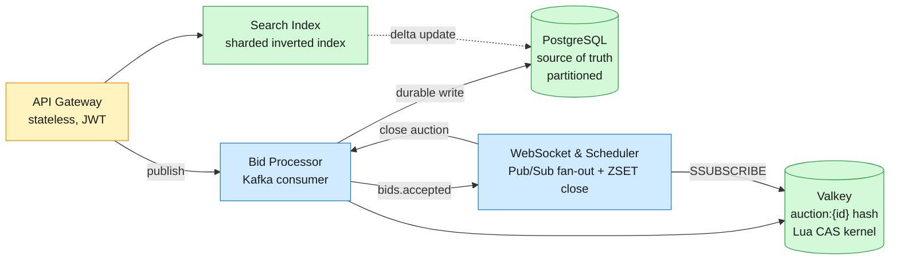
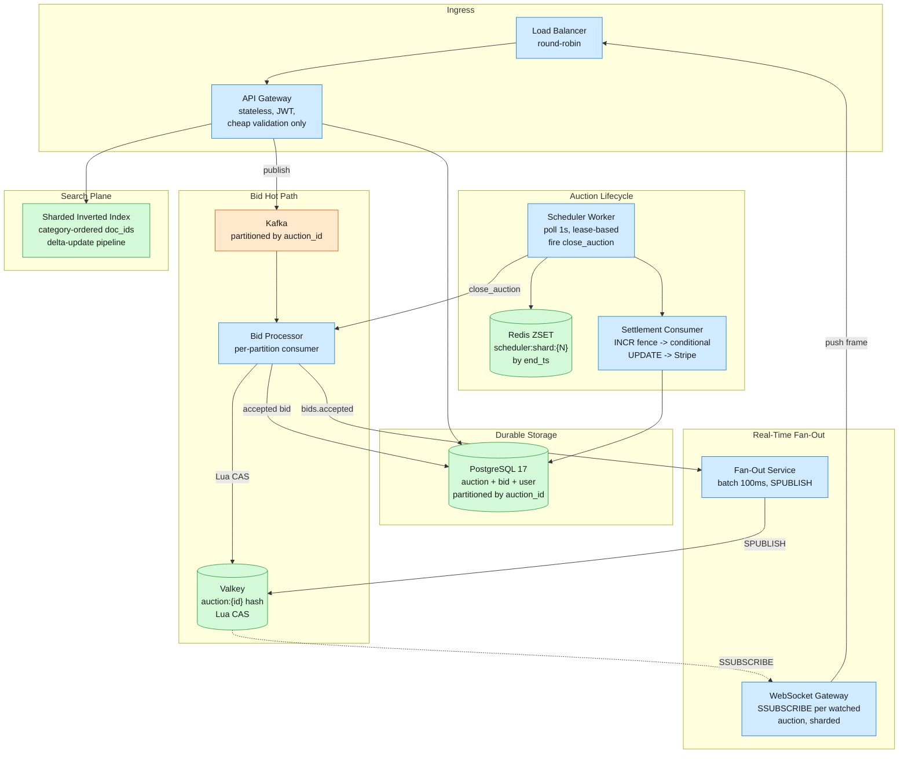
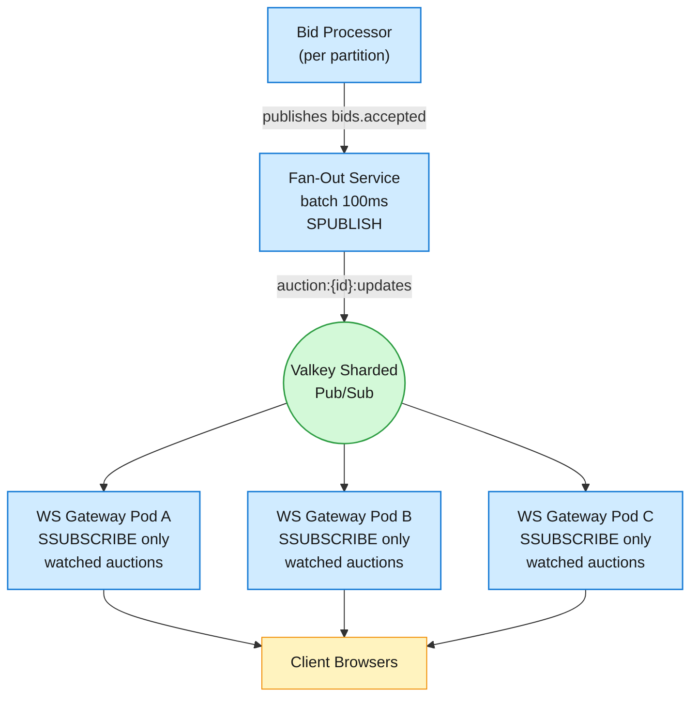

An online auction platform lets sellers list items with a starting price and end time, and buyers compete by placing ascending bids. The winner is the highest bidder at close.

<!--more-->

## 1. Problem

An online auction platform lets sellers list items with a starting price and end time, and buyers compete by placing ascending bids. The winner is the highest bidder at close. This is a marketplace transaction system where 10M auctions run concurrently, each processing up to 500 bids/sec from millions of concurrent watchers — but only one bidder can win any single auction. The core tension: strong consistency on the bid path clashes with the read fan-out and scheduling demands of 10M independent timelines.



## 2. Requirements

**Functional**

- FR1: Post auction item with starting price and end date.
- FR2: Place bid accepted only if higher than current highest bid.
- FR3: View auction details and real-time current highest bid.
- FR4: Set proxy bid — auto-bid up to a hidden maximum amount.
- FR5: Auction lifecycle — scheduled start, anti-sniping soft-close, end settlement.
- FR6: Search active auctions by category, price range, and keyword.

*Out of scope: payment processing, seller payout, dispute resolution, seller reputation, shipping integration.*

**Non-functional**

- NFR1: Strong bid consistency — at most one winning bidder per auction at close.
- NFR2: 10M concurrent active auctions with 50K bids/sec peak throughput.
- NFR3: Real-time bid display — accepted bid visible to watchers within 200ms p99.
- NFR4: Fault tolerance — accepted bids survive crash/restart; auction end fires exactly once.

## 3. Back of the envelope

- **Write volume:** 50K bids/sec x 86,400 sec -> **4.3B bids/day** -> 860 GB/day -> ~26 TB at 30-day retention.
- **Read fan-out:** read:write = 100:1 -> **5M reads/sec peak** -> Valkey sharded hash covers 99% of reads.
- **Hot-auction CAS headroom:** 500 bids/sec on one Valkey key -> **500 CAS ops/sec**. Single-core Lua ceiling 100-200K ops/sec -> 200x headroom.

## 4. Entities

```
auction {
  auction_id:     uuid PK
  seller_id:      uuid FK          ← user
  title:          string
  category:       string
  starting_price: decimal(12,2)
  reserve_price:  decimal(12,2)
  end_ts:         timestamp
  state:          enum             ← UPCOMING / ACTIVE / CLOSING / CLOSED / SOLD / UNSOLD
  highest_bid:    decimal(12,2)
}

bid {
  bid_id:       uuid PK
  auction_id:   uuid FK
  bidder_id:    uuid FK          ← user
  amount:       decimal(12,2)
  is_proxy:     boolean
  sequence_num: integer
  status:       enum             ← ACCEPTED / REJECTED
  created_ts:   timestamp
}

proxy_bid {
  proxy_id:   uuid PK
  auction_id: uuid FK
  bidder_id:  uuid FK          ← user
  max_bid:    decimal(12,2)
  entered_ts: timestamp
  active:     boolean
}

user {
  user_id:      uuid PK
  display_name: string
  risk_tier:    enum             ← LOW / MEDIUM / HIGH
  created_at:   timestamp
}
```

### API

- `POST /auctions` — Create auction with title, starting price, end time, reserve, increment. Returns `auction_id`.
- `POST /auctions/{id}/bids` — Place bid. Body: `{amount, is_proxy?, proxy_max?}`. Returns `{bid_id, status, rejection_reason?}`.
- `GET /auctions/{id}` — Auction detail page: metadata + current highest bid (masked) + bid count + time remaining.
- `GET /auctions/{id}/history?cursor={seq}&limit=50` — Paginated accepted bid history, newest first.
- `GET /auctions?category=X&price_min=N&price_max=N&q=keyword&cursor=...` — Search active auctions with attribute filters.
- `WS /auctions/{id}/live` — WebSocket stream of real-time bid updates: `{sequence_num, current_price, high_bidder_masked, time_remaining}`.

## 5. High-Level Design



**Components:** The system splits into five planes. The **Ingress** layer authenticates, rate-limits, and publishes bids to Kafka — it never validates bid amounts (which creates a race window). The **Hot Path** serializes bids per auction via Kafka partitioning by `auction_id`, then runs an atomic Valkey Lua CAS as the single consistency kernel. The **Storage** plane persists accepted bids and auction state in PostgreSQL partitioned by `auction_id`. The **Fan-Out** plane batches bid events in 100ms windows, publishes them via sharded Valkey Pub/Sub, and pushes to WebSocket gateways that subscribe only to auctions their connected users are watching. The **Lifecycle** plane schedules auction starts and ends via sharded Redis sorted sets, fires soft-close extensions inside the CAS script, and runs a fencing-token-based settlement consumer for effectively-once close. The **Search** plane maintains a sharded inverted index with category-ordered document IDs and a delta-update pipeline for near-real-time listing visibility.

**Design consideration:** The bid path is intentionally asynchronous at the API boundary — the gateway returns `202 Accepted` with a `bid_id`, and the real acceptance/rejection flows through Kafka. This buys two properties: (1) the API is never blocked on the hot key, so load-spike absorption is Kafka's responsibility (not ours), and (2) all bids for one auction are serialized onto a single partition -> single consumer -> single-threaded processing without a distributed lock manager.

---

#### FR1: Post auction item

- Components: Client → API Gateway → PostgreSQL → Redis ZSET scheduler → Search index
- **Flow:**
  1. Seller `POST /auctions` with title, description, category, `starting_price`, `reserve_price`, `min_increment`, `end_ts`.
  1. API Gateway validates auth, truncates `end_ts` to a configurable max (e.g., 30 days), applies +/-15 min of random jitter to `end_ts` to smooth scheduler storms at round hours.
  1. Auction row inserted into PostgreSQL with `state = UPCOMING`.
  1. `ZADD scheduler:shard:{hash(auction_id) % N} {end_ts} {auction_id}` — registers the close event in the scheduler.
  1. Search index receives the new listing via CDC or direct async write.
- **Design consideration:** The reserve price is stored in PostgreSQL but never returned to bidders or the read path. It is checked only at settlement time: if `highest_bid < reserve_price`, the auction closes as `UNSOLD`. This avoids the common pitfall of leaking reserve-price metadata through API responses or cache layers.

---

#### FR2: Place bid

- **Components:** API Gateway, Kafka, Bid Processor, Valkey.

**Flow:**

1. Bidder `POST /auctions/{id}/bids` with `{amount}`. Gateway performs cheap validation only: auth token, rate limit (100 bids/min per user, 10/sec per auction), risk-tier check. It does NOT compare `amount` against `current_price` — that check must happen atomically inside the Lua CAS.
1. Gateway publishes `{bid_id, auction_id, bidder_id, amount, client_ts}` to Kafka topic `bids` partitioned by `auction_id`, returns `202 {bid_id, status: "QUEUED"}`.
1. The **Bid Processor** consumer (one per partition) receives the bid in FIFO order. It runs the Valkey Lua CAS script (see DD1) which atomically: checks `state == ACTIVE`, checks `now < end_ts`, checks `amount >= current_price + min_increment`, updates `highest_bid` and `highest_bidder`, extends `end_ts` if within the anti-snipe window.
1. On ACCEPTED: inserts bid row into PostgreSQL with `sequence_num` (from Valkey `HINCRBY`), publishes to `bids.accepted` Kafka topic for fan-out.
1. On REJECTED: inserts bid row with `status = REJECTED` and `rejection_reason`, pushes rejection to the bidder's WebSocket.
1. Deduplication: before the CAS, the processor runs `SET bid_result:{bid_id} NX EX {ttl_until_end+48h}`. If the key already exists, the bid was already processed — return cached result without re-executing the CAS.

**Design consideration:** The API-to-Kafka publish adds ~5-10ms latency but guarantees bid ordering per auction without a lock manager. The Kafka partition-by-auction-id pattern serializes all bids for one auction through a single consumer thread — the CAS is still necessary (the consumer could restart mid-processing), but the hot-path contention is reduced to the Valkey key, not a database row lock.

---

#### FR3: View auction

**Components:** CDN, Valkey, PostgreSQL (read replica), WebSocket Gateway.

**Flow:**

1. `GET /auctions/{id}`: metadata from PostgreSQL read replica or CDN cache (1h TTL for static fields). Current price and time remaining from Valkey `HMGET auction:{id} highest_bid end_ts state` — 1s client-side or CDN edge TTL on the price field.
1. Live updates via `WS /auctions/{id}/live`: client opens WebSocket, gateway subscribes to `auction:{id}:updates` on Valkey sharded Pub/Sub, pushes `{sequence_num, current_price, high_bidder_masked, end_ts}` on each accepted bid.
1. Bid history via `GET /auctions/{id}/history`: paginated from PostgreSQL `bid` table, `WHERE auction_id = $id ORDER BY sequence_num DESC`.

**Design consideration:** The read path and write path are completely separated. The current price is served from Valkey (the same hash the CAS writes to) — no join, no secondary index, sub-ms reads. The winner's identity is masked in broadcast payloads (`high_bidder_masked` = first 4 chars of user_id hash) unless the requesting user IS the winner, verified by comparing the user's session against the `highest_bidder` field on the read path. CDN edge caching of price with 1s TTL absorbs 95% of read load.

---

#### FR4: Proxy bidding

**Components:** Bid Processor, Valkey (sorted set + hash), PostgreSQL, WebSocket Gateway.

**Flow:**

1. `POST /auctions/{id}/bids` with `{is_proxy: true, proxy_max: 500}`. The proxy max is encrypted at the API layer and stored in `proxy_bid` table. The immediate bid amount submitted is `current_price + min_increment` (fetched from Valkey — an eventually-consistent pre-read for the initial amount).
1. On any new bid arriving at the Bid Processor, before executing the Lua CAS, the processor resolves all active proxy bidders:
  - Loads `ZRANGE proxy:auction:{id} 0 -1 WITHSCORES` (a sorted set keyed by `max_bid`, value = `bidder_id:entered_ts`).
  - Sorts by `(max_bid DESC, entered_ts ASC)` — higher max wins; at a tie, earlier timestamp wins.
  - Compares `new_bid.amount` against each proxy's `max_bid`:
1. Only ONE CAS call is made per bid event — the result of the proxy resolution, not N sequential proxy counter-bids.
1. Outbid proxy bidders receive a WebSocket notification: `{event: "OUTBID", auction_id, current_price}`.

**Design consideration:** The "proxy storm" problem — one external bid triggering N auto-counter-bids — is eliminated by resolving all proxies in the processor's memory in one pass and submitting a single CAS write. Without this optimization, 10 active proxies on a hot auction would require 10 sequential CAS calls, saturating the Valkey key's throughput. The sorted-set storage in Valkey keeps proxy resolution fast: the ZRANGE is O(log N + M) where M is the number of active proxies (typically < 50).

---

#### FR5: Auction lifecycle

**Components:** Redis ZSET scheduler, Scheduler Worker, Valkey (bid state), Settlement Consumer, PostgreSQL.

**Flow:**

1. **Start:** `state` transitions from `UPCOMING` to `ACTIVE` at `start_ts`. A separate scheduler worker (same Redis ZSET mechanism as close) fires `start_auction` RPCs. On start, the Valkey hash for `auction:{id}` is initialized with `state=ACTIVE, highest_bid=0, highest_bidder=nil`.
1. **Active bidding:** All bids flow through the hot path described in FR2. The Lua CAS enforces `state == ACTIVE` as a precondition.
1. **Anti-sniping:** When a bid arrives within `anti_snipe_window` seconds of `end_ts` (e.g., 60s), the CAS script extends `end_ts` by that window and increments `extensions_used`. Capped at `max_extensions` (e.g., 5) to prevent indefinite auctions. The extension is atomic with the bid — no separate scheduling call.
1. **Close:** The scheduler worker fires `close_auction(auction_id)` when `end_ts` is reached. The Valkey hash transitions to `CLOSING` — a drain window (e.g., 5s) where bids already in the Kafka queue are still processed, but no new bids are accepted. After drain, `state = CLOSED`.
1. **Settlement:** A consumer picks up `CLOSED` auctions, increments a fencing token (`INCR fence:auction:{id}`), reads the winning bid, checks reserve price, and executes a conditional UPDATE on PostgreSQL: only commits if no higher fence token has already committed. Calls Stripe with idempotency key `settle:{auction_id}`. Marks `state = SOLD` or `UNSOLD`.

**Design consideration:** The `CLOSING` state is critical — without it, bids in flight inside the Kafka pipeline at close time would be silently dropped. The drain window (longer than the Kafka consumer's worst-case processing lag) ensures every bid placed before close is adjudicated. The Redis ZSET scheduler with +/-15s jitter at auction creation and the soft-close extension logic combine to prevent both the round-hour thundering herd and last-second sniping.

---

#### FR6: Search

**Components:** API Gateway, Search cluster, Sharded inverted index, CDC delta pipeline.

**Flow:**

1. `GET /auctions?category=electronics&price_min=100&q=watch&cursor=...`. Query hits the search cluster.
1. The sharded inverted index routes the query to the relevant shards (category filtering narrows the shard set).
1. **Phase 1 — fast approximate:** Category-filtered posting list intersection using category-ordered document IDs for better compression and CPU cache locality.
1. **Phase 2 — accurate re-ranking:** Top-K candidates from Phase 1 are re-ranked with behavioral signals (bid velocity, watcher count, time remaining).
1. Results returned with cursor-based pagination (no deep offsets — cap at 1000 results).
1. **Index updates:** A change-data-capture pipeline consumes auction creates, price changes, and state transitions from PostgreSQL WAL. Updates stream through a delta pipeline and reach the search index within 30s.

**Design consideration:** eCommerce search differs from web search in two ways: (1) real-time updates matter — a newly listed item or a price change must be searchable within seconds, not hours, and (2) exhaustive recall matters — sellers notice missing items. The category-ordered document ID optimization reduces d-gap sizes within posting lists (items in the same category get contiguous IDs), improving both compression ratios and CPU cache hit rates during intersection operations.

## 6. Deep dives

### DD1: Strong bid consistency — the atomic CAS kernel

**Problem.** Two bidders submit bids at the same instant for the same auction. The system must accept exactly the higher one and reject the lower one — no overlap, no phantom acceptance, no two-winner scenario. Traditional database approaches (SELECT FOR UPDATE, optimistic version-based locking) break down at 500 bids/sec on a single hot auction: row locks queue, connection pools saturate, P99 latency spikes into seconds.

**Approach 1: Database pessimistic locking (SELECT FOR UPDATE)**

Lock the auction row before reading/updating.

```sql
BEGIN;
SELECT highest_bid, state, end_ts FROM auctions WHERE id = $1 FOR UPDATE;
-- Application: validate bid amount > highest_bid + min_increment
UPDATE auctions SET highest_bid = $2, highest_bidder = $3 WHERE id = $1;
COMMIT;
```

- **Pro:** Single source of truth. Survives crashes — state is in the database. Simple mental model.
- **Con:** Row locks queue under contention. At >500 concurrent bidders on a hot auction page, the lock wait queue grows linearly. Connection pool saturation is the failure mode — 100 pooled connections, all waiting on the same row lock. P99 latency >2s at 200 concurrent attempts. PostgreSQL is designed for short critical sections, not a hotspot held for application-level validation.

**Approach 2: Database optimistic locking (version column CAS)**

```sql
SELECT highest_bid, version FROM auctions WHERE id = $1;
-- Application: check amount >= current + min_increment
UPDATE auctions
SET highest_bid = $2, highest_bidder = $3, version = version + 1
WHERE id = $1 AND version = $prev_version AND highest_bid < $2;
-- If rows_updated == 0: retry
```

- **Pro:** No row locks held during validation. Higher throughput than pessimistic locking under moderate contention.
- **Con:** Retry storms under high contention. At 500 bids/sec on one auction, the retry rate approaches 50% — half of all bids fail the version CAS and must re-fetch + re-validate. Wastes DB cycles on doomed updates.

**Approach 3: Redis/Valkey atomic Lua CAS**

A Lua script executed atomically on Valkey's single-threaded event loop checks preconditions and updates state in one shot. No locks — serialization is implicit in the event loop.

```lua
-- KEYS[1]:  auction:{id}
-- ARGV[1]:  bid amount
-- ARGV[2]:  bidder_id
-- ARGV[3]:  current unix timestamp
-- ARGV[4]:  min_increment
-- ARGV[5]:  anti_snipe_window_seconds
-- ARGV[6]:  max_extensions

local h = redis.call
local state = h('HGET', KEYS[1], 'state')
if state ~= 'active' then return {err='AUCTION_NOT_ACTIVE'} end

local end_ts = tonumber(h('HGET', KEYS[1], 'end_ts'))
local now = tonumber(ARGV[3])
if now >= end_ts then return {err='AUCTION_ENDED'} end

local current = tonumber(h('HGET', KEYS[1], 'highest_bid') or 0)
local min_bid = current + tonumber(ARGV[4])
if tonumber(ARGV[1]) < min_bid then return {err='BID_TOO_LOW'} end

h('HSET', KEYS[1], 'highest_bid', ARGV[1], 'highest_bidder', ARGV[2], 'last_bid_ts', ARGV[3])

-- Anti-snipe extension
local ext_window = tonumber(ARGV[5])
if (end_ts - now) < ext_window then
    local ext_used = tonumber(h('HGET', KEYS[1], 'extensions_used') or 0)
    if ext_used < tonumber(ARGV[6]) then
        h('HSET', KEYS[1], 'end_ts', end_ts + ext_window, 'extensions_used', ext_used + 1)
    end
end

return {ok='ACCEPTED', price=ARGV[1], new_end_ts=h('HGET', KEYS[1], 'end_ts')}
```

- **Pro:** Sub-millisecond atomicity. No lock manager, no deadlocks, no retry storms. The single-threaded event loop guarantees serial execution — the second bidder's script starts only after the first completes. Anti-snipe extension is free (already inside the atomic boundary). Throughput: 100-200K ops/sec per shard.
- **Con:** Single-key bottleneck. All bids for one auction contend on one Valkey key -> one CPU core. Throughput is physically capped at ~200K ops/sec — rate-limit at the edge for auctions exceeding this. Valkey is an in-memory store: a crash before the bid is persisted to PostgreSQL loses the bid. This is mitigated by (a) the Kafka message is the durable record — the processor replays unacknowledged bids on restart, (b) bid deduplication via `SET NX bid_result:{bid_id}` prevents double-accept on replay, and (c) Valkey AOF persistence with `appendfsync everysec` limits data loss to 1 second.

**Decision:** Approach 3 (Valkey Lua CAS), with PostgreSQL as the durable source of truth and Kafka as the at-least-once delivery layer.

**Rationale:** The single-key Valkey CAS ceiling at ~100K ops/sec is 200x the expected peak of 500 bids/sec on the hottest auction — the physical limit is not a practical concern. The Redis single-thread event loop guarantees serial execution of the Lua script — the second bidder's script starts only after the first completes. Throughput: 100-200K ops/sec per shard. The durability concern is real: Valkey can lose the last second of accepted bids on crash. This is acceptable because (a) the bid processor retries unacknowledged Kafka messages, (b) deduplication prevents double-accept, and (c) the auction close only finalizes after the `CLOSING` drain window — any bid accepted during that window exists in at least one of Valkey, the Kafka log, or PostgreSQL.

**Edge cases:**

- **Bid duplicates on retry:** The processor crashes after accepting the bid (Valkey CAS succeeded) but before committing the Kafka offset. On restart, the same Kafka message is redelivered. The `SET bid_result:{bid_id} NX` dedup key catches this — it was set inside the first attempt's CAS script, so the second attempt returns the cached result without re-executing the CAS.
- **Valkey crash mid-CAS:** The Lua script either completes fully (and the result is in the AOF or replication stream) or not at all (atomicity guarantee). No partial state.
- **Anti-snipe extension race:** If the `end_ts` extension pushes into the next scheduler tick, the scheduler sees `state == ACTIVE`, `end_ts > now` — correctly skips the close. The scheduler's next poll (1s later) sees the extended `end_ts`.

---

### DD2: Real-time bid updates at 5M concurrent watchers

**Problem.** After accepting a bid, the system must push the new price to every user watching that auction within 200ms p99 — across millions of concurrent watchers. A naive fan-out (one publish per watcher) saturates at O(W) work per bid. The challenge is broadcasting to the W watchers without doing O(W) work.

**Approach 1: Client polling**

Clients poll `GET /auctions/{id}` every 1-2s for price updates.

- **Pro:** Trivial server-side implementation. No persistent connections, no pub/sub infrastructure. CDN edge caching of price (1s TTL) absorbs 99% of poll requests.
- **Con:** Poll interval is the staleness floor — average 500ms-1s lag. 5M concurrent watchers polling every 1s = 5M req/s just for price updates. Polling wastes bandwidth on unchanged values (auctions where no bid occurred in the poll window). Does not meet the 200ms real-time requirement.

**Approach 2: Single Pub/Sub channel per auction, global broadcast**

One Redis Pub/Sub channel per auction. On bid accepted: `PUBLISH auction:{id}:updates {payload}`. WebSocket gateways subscribe to all channels.

- **Pro:** Push model — zero staleness beyond network latency. Work is O(1) for the publisher (one PUBLISH call).
- **Con:** Redis PUBLISH broadcasts to ALL subscribers across the cluster, even if only 1 of 100 gateway pods has a user watching that auction. At 50K bids/sec x 8-byte channel name overhead, the cluster cross-talk dominates network bandwidth. Global Pub/Sub in Redis does not scale to cluster mode — fan-out is broadcast, not targeted.

**Approach 3: Sharded Valkey Pub/Sub (SPUBLISH/SSUBSCRIBE) + delta batching**

Use Valkey 7+ sharded Pub/Sub: `SPUBLISH` routes the message to the shard that owns the channel's hash slot, and only subscribers on that shard receive it. Gateway pods `SSUBSCRIBE` only to channels for auctions their connected users are watching. A fan-out service batches all bids in a 100ms window and emits one delta message per auction per tick.



```python
# Per gateway pod, every 30s:
for channel in active_subscriptions:
    if local_connection_count[channel] == 0:
        SUNSUBSCRIBE(channel)
        DEL ws:{pod_id}:sub:{channel}

# On connection close:
decrement(local_connection_count[auction_id])
# TTL on ws:{pod_id}:sub:{auction_id} = 60s handles pod crash
```

- **Pro:** Work is O(N_gateways) per bid where N_gateways is bounded (tens to hundreds), not O(W) where W = millions. Sharded Pub/Sub eliminates cluster-wide cross-talk — a message for auction X only hits the shard that owns hash(X). Delta batching (one message per 100ms per auction) caps the message rate at 10 msg/sec per auction regardless of bid velocity.
- **Con:** 100ms batching introduces a 100ms worst-case staleness ceiling — still within the 200ms p99 target. Requires Valkey 7+ (production-stable since 2023). Gateway pods must track subscriptions and clean up stale ones on disconnects.

**Decision:** Approach 3 — sharded Valkey Pub/Sub with delta batching.

**Rationale:** Sharded Pub/Sub maps the one-to-many relationship (one bid -> many watchers) onto the infrastructure efficiently. The 100ms batch window is the sweet spot: shorter loses batching benefits, longer crosses 200ms. Gateway pods need only in-memory tracking of active subscriptions — a Redis hash `ws:{pod_id}:sub:{channel}` with 60s TTL, refreshed per client heartbeat. Stale subscription cleanup is a 30s reaper loop, not a critical-path operation.

**Edge cases:**

- **Gateway pod crash:** Subscriptions vanish with it. TTL on the Valkey subscription keys expires within 60s. Surviving pods see no disruption. Reconnecting clients are routed to a new pod by the load balancer.
- **Client reconnection:** Client sends `last_seen_seq` on WebSocket reconnect. Gateway fetches missed bids from PostgreSQL (`WHERE auction_id = $id AND sequence_num > $last_seen_seq`) and pushes them before resuming the live stream.
- **Delta batching at 0 bids:** The fan-out service tracks whether any bids occurred for each auction in the 100ms window. Auctions with no bids produce no message — no empty heartbeats, no wasted bandwidth.

---

### DD3: Auction lifecycle — scheduling 10M concurrent close events

**Problem.** 50M auctions have their end times clustered at round hours (sellers choose 7-day listings starting at common times like 9 AM, 6 PM). A single-instance scheduler that wakes at `:00` to process 500K close events in one tick will fall over. The challenge is sharding the timeline so close events fire on time without thundering herds, while supporting soft-close extensions that dynamically shift the `end_ts`.

**Approach 1: Single database poller**

Poll `SELECT auction_id FROM auctions WHERE state = 'ACTIVE' AND end_ts <= NOW() LIMIT 1000` every 1s.

- **Pro:** Simplest model. No additional infrastructure. Source of truth is the database.
- **Con:** One poller scanning 50M rows every second burns CPU on full-table or index scans. Jittering end_ts at creation smooths the spike but doesn't eliminate the scanning cost.

**Approach 2: Cron-based per-auction timers (Flink keyed timers)**

Each auction gets a keyed timer in Flink's state backend. When the timer fires, Flink executes the close logic with exactly-once state guarantees.

- **Pro:** Exactly-once semantics built into the stream processor. RocksDB state backend survives crashes. Handles dynamic timer rescheduling (anti-snipe extensions) natively.
- **Con:** Flink's operational overhead is significant — a full streaming platform (JobManager, TaskManagers, state backends, checkpointing) for what is fundamentally a sorted-set look-up. Overkill for a system where the rest of the stack is Kafka + Valkey + Postgres.

**Approach 3: Sharded Redis sorted sets with lease-based failover**

```lua
ZADD scheduler:shard:{hash(auction_id) % N} {end_ts} {auction_id}
```

Each of N workers polls its shard every second: `ZRANGEBYSCORE scheduler:shard:{S} -inf NOW LIMIT 0 1000`. On picking due auctions, the worker acquires a lease: `SET scheduler:lease:{S} {worker_id} NX PX 5000`. If the lease is held, the worker fires `close_auction` RPCs for the batch. On lease expiry (worker crash), another worker takes over.

- **Pro:** O(log M) per poll via ZRANGEBYSCORE (M = active auctions per shard). Sharding eliminates the single-poller bottleneck — N workers, each responsible for 1/N of auctions. Random +/-15s jitter at auction creation smooths round-hour spikes across a 30s window. Dynamic rescheduling (soft-close extension) is a simple `ZADD ... GT` with the new end_ts.
- **Con:** Requires a Redis/Valkey cluster with persistence (AOF everysec). Lease-based failover is coarse (5s gap on worker crash). Close events during the gap fire late but are eventually processed.

**Decision:** Approach 3 — sharded Redis sorted sets with lease-based workers.

**Rationale:** The problem reduces to a sorted insert + range query by timestamp — Redis sorted sets are the canonical data structure for this. The shard count N = 64 gives ~156K auctions per shard at 10M total; a `ZRANGEBYSCORE` with LIMIT 1000 takes <1ms. The +/-15s jitter applied at auction creation is invisible to users (they choose a time, the system adds a random offset within a 30s window) and spreads the scheduler load across 30 seconds instead of one. The 5s lease gap on worker crash is acceptable: auctions whose close fires 5s late are within the soft-close extension window anyway.

**Edge cases:**

- **Scheduler worker crash:** Lease expires after 5s. Another worker takes over. Auctions due during the gap fire late. The `CLOSING` state (drain window) absorbs this: if a bid arrived during the gap, the CAS script would have accepted it (since `state == ACTIVE` until the close actually fires), and the close now processes it correctly.
- **Soft-close extension moves end_ts beyond current poll:** The CAS script atomically updates the Redis hash's `end_ts`. The scheduler worker, on picking the auction, re-reads `end_ts` from Valkey before firing close. If `end_ts > now`, the close is skipped — the new `end_ts` was already `ZADD`'d by the bid processor, so the scheduler will pick it up on a future poll.
- **Multiple workers racing on close:** The lease (`SET NX PX 5000`) ensures only one worker processes a given shard. If a worker's lease expires mid-close, the replacement worker picks up the same auction again. The `CLOSING -> CLOSED` transition is idempotent (the close RPC checks current state and skips if already CLOSED).

**Settlement — effectively-once guarantee:**

```sql
-- 1. Generate monotonic fencing token
token = INCR fence:auction:{id}

-- 2. Conditional UPDATE: only highest token commits
UPDATE auctions
SET state = CASE WHEN highest_bid < reserve_price THEN 'UNSOLD' ELSE 'SOLD' END,
    winner_id = CASE WHEN highest_bid >= reserve_price THEN highest_bidder ELSE NULL END,
    final_price = highest_bid,
    settlement_fence = $token
WHERE auction_id = $id
  AND (settlement_fence IS NULL OR settlement_fence < $token)
  AND state = 'CLOSED';

-- 3. If 0 rows -> another attempt already won; stop
-- 4. Call Stripe with idempotency_key = 'settle:{auction_id}'
```

The fencing token + conditional UPDATE ensures only the highest-token settlement attempt commits. If the settlement consumer crashes after step 2 but before step 4, the retry generates a higher token, its UPDATE succeeds (overwrites with the same values — idempotent at the DB level), and Stripe's idempotency key prevents double-charge. The fencing token + conditional UPDATE + provider-side idempotency key form a 3-layer effectively-once guarantee without distributed transactions.

---

### DD4: Proxy bidding — the resolution algorithm

**Problem.** Proxy bidding is the defining mechanic of online auctions: a bidder sets a hidden maximum, and the system automatically bids on their behalf — only the minimum increment above the next-highest bidder, up to their max. The challenge is that one external bid can trigger counter-bids from every active proxy, and all of them contend on the same hot Valkey key. A naive approach of N sequential CAS calls per proxy wastes throughput and creates visible latency.

**Approach 1: Sequential proxy resolution (N CAS calls)**

On a new bid, iterate through all active proxies, run CAS for the highest one, update state, notify the winner and loser, repeat.

- **Pro:** Simple — each proxy is processed independently through the normal bid path.
- **Con:** 10 active proxies -> 10 sequential CAS calls -> 10x latency on the hot key. Throughput wasted on counter-bids that are immediately outbid by the next proxy.

**Approach 2: In-memory resolution + single CAS write**

On a new bid:

1. Load all active proxies for the auction into the processor's memory (ZRANGE from Valkey sorted set).
1. Sort by `(max_bid DESC, entered_ts ASC)` — higher max wins; at a tie, earlier timestamp wins.
1. Walk the sorted list: the highest proxy becomes the winner at the lower of (a) the new bid + min_increment, or (b) the proxy's max_bid. The new bidder only wins if their amount exceeds the highest proxy's max_bid.
1. Submit exactly ONE CAS call with the resolved winner and price.
1. Notify all outbid proxies via WebSocket.

```javascript
ResolveProxyBids(auction_id, new_bid_amount):
    proxies = ZRANGE proxy:auction:{id} 0 -1 WITHSCORES
    sorted = sort(proxies, key=(max_bid DESC, entered_ts ASC))

    // Edge case: no active proxies
    if sorted is empty:
        return (winner=manual_bidder, price=new_bid_amount)

    highest = sorted[0]

    if new_bid_amount < highest.max_bid:
        // Highest proxy wins: bid at new_bid + increment (capped at max)
        resolved_price = min(highest.max_bid, new_bid_amount + MIN_INCREMENT)
        winner = highest.bidder_id
    elif new_bid_amount == highest.max_bid:
        // Tie: earlier timestamp wins at the tied amount
        resolved_price = highest.max_bid
        winner = (sorted[0].entered_ts < new_bid.entered_ts)
                  ? highest.bidder_id : manual_bidder
    else:  // new_bid > highest.max_bid
        winner = manual_bidder
        resolved_price = new_bid_amount

    // Single CAS call
    result = redis.eval(CAS_SCRIPT, KEYS=[auction:{id}],
                        ARGV=[resolved_price, winner, now(), MIN_INCREMENT, ...])

    if result.ok:
        for each loser in sorted where loser.max_bid < resolved_price:
            send_outbid_notification(loser.bidder_id, auction_id, resolved_price)
```

- **Pro:** O(1) CAS calls regardless of the number of active proxies. Resolves all counter-bidding in memory where it's cheap. The Valkey key handles one write per external bid, not N writes.
- **Con:** The proxy resolution pass must have an up-to-date view of all active proxies. The Valkey sorted set `proxy:auction:{id}` is the authority — loaded once per bid event. If a proxy was added/removed between the ZRANGE and the CAS, the CAS fails (e.g., a removed proxy still appears as winner). Mitigated by including a proxy-set version in the CAS precondition.

**Approach 3: No proxy bidding — manual bids only**

- **Pro:** Eliminates the entire proxy subsystem. Simpler system.
- **Con:** Proxy bidding is the core differentiator of online auctions vs. fixed-price marketplaces. Without it, bidders must monitor auctions manually and bid in the closing seconds — driving sniping behavior and reducing bid volume.

**Decision:** Approach 2 — in-memory resolution with single CAS write.

**Rationale:** The single-CAS optimization is the difference between O(N) and O(1) hot-key writes per external bid. On an auction with 15 active proxies at peak interest, Approach 1 would consume 15 CAS calls, burning 75% of the key's throughput on counter-bids that are all resolved in a deterministic pass. The in-memory sort is trivially fast: 50 active proxies sorted in microseconds. The version-check precondition (include a `proxy_set_version` field in the CAS) prevents the stale-read edge case without adding a second CAS call.

**Edge cases:**

- **Two proxies with the same max_bid:** Resolved by `entered_ts` tie-breaker. Earlier timestamp wins at the tied amount. The loser is outbid — their max was met but they placed it later.
- **Bidder cancels proxy mid-resolution:** The CAS precondition includes the proxy set version. If the cancel arrived and updated the version before the CAS executes, the CAS fails and the processor retries with the updated proxy set.
- **Proxy increment exceeds max_bid:** If `current_price + min_increment > proxy.max_bid`, the proxy is effectively outbid already and is removed from the active set (or marked inactive, to be cleaned up lazily).

## 7. References

1. [Martin Kleppmann — Fencing Tokens and Lease-Based Claims](https://martin.kleppmann.com/2016/02/08/how-to-do-distributed-locking.html)
1. [Stripe — Idempotency Key Design Pattern](https://stripe.com/docs/api/idempotent_requests)
1. [Redis/Valkey — Lua Scripting and Atomicity](https://redis.io/docs/latest/develop/interact/programmability/eval-intro/)
1. [Kafka — Exactly-Once Semantics and Idempotent Producers](https://kafka.apache.org/documentation/#upgrade_11_exactly_once_semantics)
1. [PostgreSQL — Table Partitioning](https://www.postgresql.org/docs/current/ddl-partitioning.html)
1. [Valkey — Sharded Pub/Sub](https://valkey.io/topics/pubsub/#sharded-pubsub)
1. [Redis Sorted Sets — ZRANGEBYSCORE Time-Based Scheduling](https://redis.io/docs/latest/develop/data-types/sorted-sets/)
1. [Designing Data-Intensive Applications — Kleppmann, Ch. 7-9: Transactions, Consistency, and Consensus](https://dataintensive.net/)
