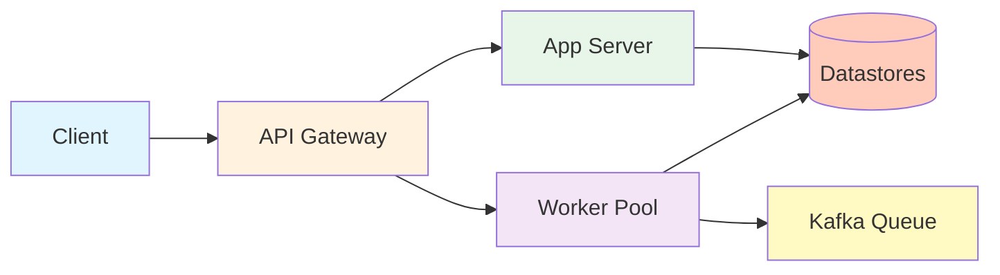
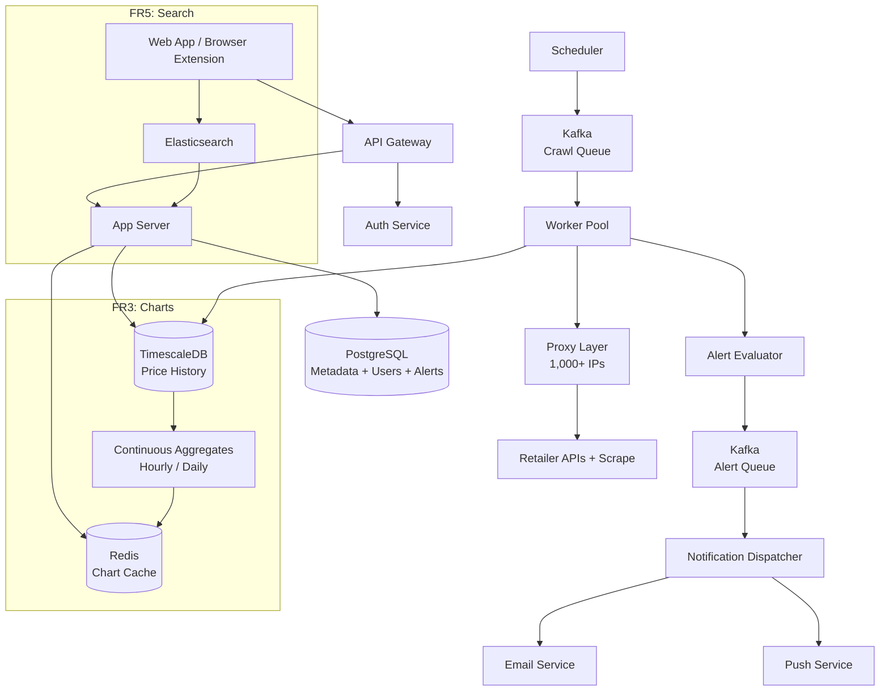

Design a price tracking service that lets users monitor product prices across online retailers, view historical price charts, and receive alerts when prices drop to a target threshold. The system must acquire price data at scale (100M+ products), store it efficiently for interactive chart rendering, enforce crawl politeness to avoid being blocked, and deliver timely notifications without spam.

<!--more-->

## 1. Problem

Design a price tracking service that lets users monitor product prices across online retailers, view historical price charts, and receive alerts when prices drop to a target threshold. The system must acquire price data at scale (100M+ products), store it efficiently for interactive chart rendering, enforce crawl politeness to avoid being blocked, and deliver timely notifications without spam.



The gateway routes user-facing requests (watchlist management, charts, search) to the app server, and enqueues crawl jobs to the worker pool. Workers read from Kafka, fetch prices through a rotating proxy layer, write price changes to TimescaleDB, and evaluate alerts in a Kafka-backed fanout pipeline.

---

## 2. Requirements

**Functional**
- **FR1: Watchlist management** — Users add and remove products from a personal watchlist.
- **FR2: Scheduled price monitoring** — System periodically checks product prices on a configurable schedule.
- **FR3: Price history charts** — Users view price charts with configurable time ranges (1m, 3m, 1y, 2y).
- **FR4: Price-drop alerts** — Users create threshold alerts and receive notifications when triggered.
- **FR5: Product search and discovery** — Users search products or discover them via URL pasting from a retailer site.
**Non-functional**
- **NFR1: Scale to 100M products** — 100M tracked products across 10 retailers of 10M each; availability over consistency.
- **NFR2: Chart <500 ms p95** — Chart queries return in under 500 ms p95 for any time range.
- **NFR3: Alert delivery latency** — Within 1 hour for free-tier, under 5 minutes for paid subscribers.
- **NFR4: Crawl politeness** — Never exceed 1 request per second per (domain, source IP).
**Out of scope:** User authentication (delegated to identity provider), retailer API integration contracts, mobile app.

---

## 3. Back of the envelope
- **Daily crawl volume:** 1M hot x24 + 80M warm x1 + 19M cold x1/7 ≈ 107M checks/day → 1,240 req/s average; the crawl pipeline, not the write path, is the bottleneck.
- **Price-change writes:** 13% change rate → ~14M writes/day → 165 writes/s sustained → trivial for a single TimescaleDB node.
- **Storage for 2 years:** 50 bytes/row x 107M checks/day x 730 days ≈ 3.6 TB raw → TimescaleDB compression at 90-95% brings this to ~180 GB; fits on a single SSD volume.
- **Proxy costs:** 107M req/day at 1 req/s per (domain, IP) requires ~1,240 IPs → ~$5,000/month in datacenter proxy bandwidth; the dominant operational cost.
---

## 4. Entities

```sql
products {
    id:            bigint  PK
    asin:          string  ← not globally unique — composite with marketplace
    marketplace:   string
    current_price: decimal(10,2)
    crawl_tier:    smallint  ← 1=hot, 2=warm, 3=cold
    subscriber_count: integer
}

users {
    id:         bigint  PK
    email:      string
    tier:       string  ← `free` or `paid`
}

watches {
    id:                bigint  PK
    user_id:           bigint  FK → users.id
    product_id:        bigint  FK → products.id
    target_price:      decimal(10,2)
    last_notified_price: decimal(10,2)?  ← non-null = already notified at this price
    is_active:         boolean
}

price_history {
    product_id:   bigint  FK
    fetched_at:   timestamp  CK  ← hypertable partition key
    price:        decimal(10,2)
    currency:     string
    availability: boolean
}
```

### API
- `POST /v1/watches` — Add product to watchlist
- `DELETE /v1/watches/:id` — Remove watch
- `GET /v1/watches` — List user's watches with current prices
- `GET /v1/products/:asin/history?range=1m,3m,1y,2y` — Price history data points
- `POST /v1/alerts` — Create price-drop alert with target_price
- `DELETE /v1/alerts/:id` — Delete alert
- `PATCH /v1/alerts/:id` — Update alert threshold
- `GET /v1/products/search?q=term` — Search products by name, brand, category
---

## 5. High-Level Design



#### FR1: Watchlist Management

**Components:** App server, PostgreSQL, URL normalization module, Redis dedup cache.

**Flow:**
1. User submits an Amazon URL via the web app or browser extension.
1. URL normalizer extracts ASIN using regex `(?:/dp/|/gp/product/|/ASIN/)([A-Z0-9]{10})`; marketplace is inferred from the URL's TLD.
1. App server upserts into products: `INSERT INTO products (asin, marketplace, title) VALUES ($1, $2, $3) ON CONFLICT (asin, marketplace) DO UPDATE SET title = COALESCE(products.title, EXCLUDED.title)`.
1. Watch record is inserted: `INSERT INTO watches (user_id, product_id, target_price) VALUES ($1, $2, $3)`.
1. Product's `subscriber_count` is incremented and crawl_tier promoted to 1 (hot).
**Design consideration:** ASIN alone is not globally unique — `amazon.com/dp/B08N5WRWNW` and `amazon.co.uk/dp/B08N5WRWNW` are different products with different prices. The composite key `(asin, marketplace)` prevents collision. URL normalization handles six distinct Amazon URL formats: `/dp/`, `/gp/product/`, `/ASIN/`, short links, affiliate-wrapped URLs, and mobile product-page variants.

**Edge cases:** Duplicate watch submission for the same (user, product) returns the existing watch id. Removing the last watch demotes crawl priority but does not delete the product or its price history.

#### FR2: Scheduled Price Monitoring

**Components:** Scheduler (single instance with leader election via PostgreSQL advisory lock), Kafka crawl queues (256 partitions keyed by `hash(hostname)`), Kafka consumer group (worker pool), rotating proxy layer, dual-extractor parser ([Schema.org](http://schema.org/) JSON-LD + CSS fallback), change detector.

**Flow:**
1. Scheduler ticks every 60 seconds and queries products due for re-check:
1. Products are grouped by retailer hostname and enqueued to Kafka partitions keyed by `hash(hostname)`.
1. Workers fetch jobs, route through the proxy layer, extract price via [Schema.org](http://schema.org/) JSON-LD (falling back to CSS selectors).
1. Change detector computes `MD5(price || availability || hash(metadata))` and compares to stored hash. If unchanged, only `last_checked_at` is batched-updated:
1. If changed, a new row is written to price_history and the alert evaluator is invoked.
**Design consideration:** Store-only-changes reduces TimescaleDB write volume from 107M to ~14M rows per day (87% reduction). The three-tier schedule (hot 1h, warm 24h, cold 7d) reduces total checks 16x versus uniform hourly polling.

**Edge cases:** Fetch failure uses exponential backoff: 5s to 30s to 5m to 1h, max 4 retries, then quarantine. A 404/410 immediately dead-letters the product. Sustained retailer outages suspend crawl jobs for that host to preserve proxy budget.

#### FR3: Price History and Charts

**Components:** TimescaleDB hypertable with continuous aggregates, Redis cache layer, server-side downsampling.

**Flow:**
1. Frontend requests `GET /v1/products/:asin/history?range=1y`.
1. API checks Redis key `chart:{asin}:{marketplace}:1y` (TTL 1 hour). On cache miss:
1. Server downsamples to at most the viewport pixel width (800 points per range).
1. Response cached in Redis and returned as JSON array of `{timestamp, price}` objects.
**Design consideration:** Continuous aggregates are materialized views, not logical views — reads are <5 ms per query. Columnar compression in TimescaleDB achieves 90-95% on numerical price data. Layered downsampling across the three tiers requires at most ~9,500 data points for a full 2-year chart.

**Edge cases:** Data gaps beyond 7 days are rendered as break lines; gaps under 7 days are linearly interpolated. A product with no price history returns an empty array with 200 status. Querying beyond available data returns everything without error.

#### FR4: Alerts and Notifications

**Components:** Change event emitter, alert evaluator (inverted index scan on watches), Kafka alert topic (64 partitions keyed by `user_id`), notification dispatcher (SES for email, FCM for push), Redis rate-limiter.

**Flow:**
1. Price change event `{product_id, new_price, old_price, fetched_at}` emitted after price_history write.
1. Alert evaluator queries the covering index:
1. For each matching watch, `should_notify()` is evaluated — true only when `new_price < target_price AND (last_notified_price IS NULL OR new_price < last_notified_price)`.
1. Triggered alert published to Kafka with idempotency key `(watch_id, crossing_ts)` at second-bucket resolution.
1. Notification dispatcher reads alerts per partition, sends via the user's preferred channel, updates `last_notified_price`.
**Design consideration:** A five-layer dedup cascade eliminates notification spam at every stage: (1) content hash eliminates 87% of evaluations before they start, (2) `last_notified_price` stops oscillation re-triggers, (3) Kafka idempotency key with 60s LRU dedup window handles producer/consumer retries, (4) Redis rate-limit caps at 24 notifications per watch per day, (5) digest mode merges bursts into summary notifications when alert rate exceeds 10x the rolling average.

**Edge cases:** Flash sales produce 50M events in 5 minutes — free-tier alerts are shed when consumer lag exceeds 5 minutes. A price oscillation $49 to $51 to $49 triggers only one notification. Failed deliveries retry 3x over 24 hours, then flag for manual review.

#### FR5: Product Search and Discovery

**Components:** Elasticsearch cluster, URL lookup endpoint, browser extension content script.

**Flow:**
1. User types a search query on the web app; API proxies to Elasticsearch:
1. Results returned sorted by subscriber count and recent price drop magnitude.
1. Alternatively, user pastes a retailer URL — ASIN is extracted and the product page with chart and alert UI is returned.
1. Browser extension content script injects on retailer product pages, queries the backend, and overlays the price chart.
**Design consideration:** For single-retailer tracking, product search can proxy directly to the retailer's own search API — authoritative results with zero indexing cost, and this is the real CamelCamelCamel approach. For multi-retailer systems, Elasticsearch populated from scrape data is necessary with cross-retailer product matching via GTIN/EAN/UPC.

**Edge cases:** Empty results include spelling suggestions from Elasticsearch suggest API. The browser extension degrades gracefully when the backend is unreachable. Malicious ASIN submissions are rate-limited by source IP and quarantined if unverifiable within 24 hours.

---

## 6. Deep dives

### DD1: Crawl Scheduling with Three-Tier Urgency Decay

**Problem:** Polling 100M products uniformly at hourly frequency costs 1.2B requests/day, making proxy bandwidth the dominant operational cost. But not every product needs hourly checks — flash-sale items change prices every few minutes while long-tail products may go months without a change. The tension is between freshness for volatile products and cost savings from skipping stable products.

**Approach 1: Uniform polling**

Check every product at the same fixed interval (e.g., every hour). Simple to implement — a single query selecting all products sorts by `last_checked_at`. But at 1.2B requests/day and ~$50K/month in proxy bandwidth, the cost is prohibitive at scale.

**Challenges:** Proxy costs scale linearly with request volume. Uniform frequency wastes the proxy budget on products that haven't changed in months.

**Approach 2: Two-tier static split**

A simple priority split: high-subscriber products polled hourly, everything else daily or weekly. Tier boundaries are static, set once at onboarding. The 80/20 split cuts ~80% of requests compared to uniform, but a product that gains subscribers mid-week stays on the slow schedule until the next tier audit, missing a flash sale.

**Challenges:** Static tier assignment means promotion is delayed. A product with 0 subscribers one day and 100 the next won't be checked hourly until the next audit cycle (daily or weekly), so its price drops go undetected for up to 24 hours.

**Approach 3: Three-tier urgency decay with online promotion**

Three tiers with dynamic promotion and demotion:

```sql
-- Hot tier selection (every 60s tick)
SELECT id, asin, marketplace FROM products
WHERE crawl_tier = 1
  AND last_checked_at < NOW() - INTERVAL '1 hour'
ORDER BY last_checked_at ASC
LIMIT 100000;
```

| Tier | Criteria | Size | Interval | Daily Checks |
|---|---|---|---|---|
| Hot | >=100 subscribers or changes >5x/week | 1M (1%) | 1 hour | 24M |
| Warm | 1-100 subscribers or changes >1x/week | 80M (80%) | 24 hours | 80M |
| Cold | 0 subscribers, stable price | 19M (19%) | 7 days | 2.7M |


Promotion is immediate: watch creation fires a `crawl_tier = 1` update on the product row. Demotion runs offline every 6 hours: zero watches + zero price changes for 7 consecutive days triggers one-tier demotion.

**Challenges:** Queue management across tiers — products promoted to hot need immediate scheduling, not waiting for the next tick. Products demoted from hot to warm whose price changes during the demotion window are stale for up to 24 hours.

**Edge cases:** A product with exactly 100 subscribers stays in hot tier even if its price is stable (no changes in 7 days). The `subscriber_count` threshold could be adjusted per retailer — a niche retailer with 10 total products should not have all products in cold. The cold tier 7-day interval is safe because products with zero subscribers have no user-facing impact if their chart data lags.

> [!TIP]
> The 16x request reduction (1.2B to 107M) means proxy costs drop from ~$50K to ~$5K/month. The trade-off — up to 7 days of staleness for products with no subscribers — is harmless because cold-tier products have no active alerts, so stale data has no notification impact.

### DD2: Time-Series Price Storage with TimescaleDB

**Problem:** Storing 107M price checks per day produces 3.6 TB of raw data per year. Chart queries need sub-500 ms p95 response times across a wide range of time granularities (1m raw data through 2y daily). The storage layer must serve both fast point-in-time reads (most recent price for a product) and range scans over years. SQL JOINs with relational product metadata are also frequent — watch alerts need to query `watches WHERE product_id = $N` immediately after a price change.

**Approach 1: Cassandra**

Linear write scaling with no single-writer bottleneck. But Cassandra lacks built-in downsampling — hourly/daily aggregation is an application-level job running periodic map-reduce. Range scans over time are efficient only with a well-chosen compound partition key. The bigger problem: no JOINs. Alert evaluation after a price change requires a two-round-trip pattern — read product partition first, then join with watches in the application. Each alert evaluation becomes a minimum of two reads.

**Approach 2: InfluxDB 3.x**

Purpose-built time-series with high cardinality support (millions of unique series). Built-in downsampling via tasks/continuous queries. But InfluxDB 3.x (the Parquet-rewrite) has a turbulent API history (1.x to 2.x with Flux to 3.x). It still lacks JOIN capabilities — alert evaluation requires the same two-round-trip pattern as Cassandra.

**Approach 3: TimescaleDB with continuous aggregates**

A hypertable on `fetched_at` (7-day chunk interval) with hash-based space partitioning on `product_id` (16 partitions), co-locating all data for one product on one chunk shard:

```sql
SELECT create_hypertable('price_history', 'fetched_at',
    chunk_time_interval => INTERVAL '7 days');
SELECT add_dimension('price_history', 'product_id', number_partitions => 16);
```

Continuous aggregate materialized views auto-refresh — hourly view refreshes every 5 minutes, daily view refreshes every hour. Columnar compression (delta-of-delta timestamps + XOR float) achieves 90-95% compression ratio, shrinking 3.6 TB raw to ~180 GB for 2 years.

| Tier | Duration | Storage | Cost |
|---|---|---|---|
| Hot | 90 days (full) | SSD | ~$50/TB/mo |
| Warm | 90-365d (hourly) | HDD | ~$10/TB/mo |
| Cold | 1-2y (daily) | S3 Parquet | ~$2/TB/mo |
| Archive | 2y+ (weekly) | Glacier Deep | ~$1/TB/mo |


**Decision:** TimescaleDB.

**Rationale:** Chart queries need SQL JOINs with `products` and `watches` — a single query replaces the two-round-trip pattern Cassandra and InfluxDB require. Continuous aggregates eliminate daily ETL jobs (auto-refresh with configurable lag). Columnar compression at 90-95% is competitive with InfluxDB 3.x Parquet. Single-node handles the 165 writes/s and ~1,500 reads/s target comfortably.

**Edge cases:** Single-node scaling limits emerge beyond ~1M writes/second — mitigation is read replicas for chart queries and application-level sharding across multiple TimescaleDB instances. Old data (2+ years) exported to S3 Glacier via pg_cron — restore takes 1-12 hours, acceptable for rare query requests. Chunk management for hypertables with 2+ years of data needs a retention policy: `SELECT add_retention_policy('price_history', INTERVAL '2 years')`.

### DD3: Alert Evaluation with Five-Layer Dedup Cascade

**Problem:** A single price change at a popular product (50K active Prime Day deals) must evaluate up to 50,000 watches. Without dedup, the same price event triggers notifications repeatedly, and price oscillations ($49 → $51 → $49) re-trigger on every crossing. The tension is delivering every genuine drop at least once while never delivering the same drop twice.

**Approach 1: Simple SQL poll with per-user rate limit**

A cron job polls `watches` joined with `products` every minute, scans for `current_price < target_price`, and sends notifications. No dedup beyond the database query. When prices drop during Black Friday, this single poll generates 50M notifications in one run — email service rate limits are exceeded and users are spammed.

**Challenges:** No cross-event dedup. A price oscillation triggers on every poll cycle. No backpressure mechanism — if the email service is slow, notifications queue in memory and the cron job stacks.

**Approach 2: Kafka event pipeline with single idempotency key**

Price changes emit events to Kafka; alert evaluators read from a topic and publish alert events with a single idempotency key. This handles at-least-once delivery from Kafka retries but does not eliminate upstream waste — every unchanged check still triggers an evaluation. A price oscillation still generates two events that the evaluator must process and deduplicate at the output.

**Challenges:** The evaluator reviews every check (107M/day), not just changes (14M/day) — 87% waste. The single idempotency key handles only Kafka retries, not oscillation dedup (the price actually changed twice).

**Approach 3: Layered five-cascade dedup**

Each layer eliminates a different source of duplicates:

**Layer 1 — Write dedup (content hash):** Before writing to `price_history`, compute `MD5(price || availability || metadata_hash)` and compare to the previous record. Match = no write, no alert evaluation. Eliminates 87% of evaluations.

**Layer 2 — last_notified_price:** Each watch record stores the last price at which a notification was sent. The evaluator checks `new_price < target_price AND (last_notified_price IS NULL OR new_price < last_notified_price)`:

```python
def should_notify(alert, new_price):
    if new_price >= alert.target_price:
        return False                           # still above threshold
    if alert.last_notified_price is None:
        return True                             # first crossing
    return new_price < alert.last_notified_price  # deeper than last time
```

A $49 → $51 → $49 oscillation triggers only one notification.

**Layer 3 — Kafka idempotency key:** Each alert event carries `(watch_id, crossing_ts)` where `crossing_ts = floor(unix_ts / 1_000_000)`. Consumer de-duplicates by composite key using a 60-second LRU cache. Handles producer/consumer retries.

**Layer 4 — Per-watch rate limit:** Redis key `rate_limit:{watch_id}` with 3600s TTL — caps at 24 notifications per watch per day. After the limit, events are logged and dropped.

**Layer 5 — Digest mode:** Monitors the alert event rate vs the 24-hour rolling average. When rate exceeds 10x normal for 30 seconds, digest mode activates: all pending events for a user are merged into 5-minute buckets. Single notification: "3 products dropped — save $47 total." Deactivates when rate normalizes for 2 consecutive minutes.

**Decision:** Layered five-cascade dedup.

**Rationale:** Each layer eliminates duplicates at a different stage in the pipeline — upstream layers prevent unnecessary work (write dedup eliminates 87% of evaluations before they reach the evaluator), while downstream layers handle output dedup and burst management. The cascade means no single layer needs to be perfect — a missed dedup at layer 2 is caught by layer 4, and a missed rate-limit at layer 4 is caught by digest mode at layer 5.

**Edge cases:** Second-bucket resolution means two genuine price drops in the same second produce one notification — acceptable for users, and digest mode would batch them anyway. During Kafka leader re-elections, the idempotency key prevents duplicate deliveries. A price that drops $50, rises to $10 above target, and drops again by $1 — the evaluator fires both times because `new_price < last_notified_price` each time (each new price is the lowest yet).

### DD4: Crawl Pipeline Scaling with Host-Sharded Kafka Queues

**Problem:** The crawl pipeline processes 107M requests/day (~1,240 req/s) across 10 retailer domains. Each domain imposes a 1 req/s politeness limit per source IP. Without careful partitioning, a single misbehaving host blocks others, and per-worker politeness becomes a distributed coordination problem.

**Approach 1: Centralized politeness queue**

A single PriorityQueue (or Redis sorted set) holds all pending crawl jobs ordered by `next_allowed_at`. Workers pop the global queue and fetch. Simple to reason about, but the queue is a single point of contention — at 1,240 req/s the lock contention on the sorted-set head becomes the bottleneck. A full queue sweep of 107M entries to find the next eligible host is too slow.

**Challenges:** Contention at the queue head at scale. Worker crashes leave the queue state consistent (Redis persists), but re-insertion on crash recovery duplicates jobs. Single point of failure.

**Approach 2: Host-sharded Kafka partitions with per-worker politeness heap**

Kafka has 256 partitions, each keyed by `hash(hostname)` — all jobs for `www.amazon.com` land in the same partition. Workers use `cooperative-sticky` assignment so each worker statically owns a set of partitions. A single worker owns the politeness clock for all hosts in its partitions — no distributed coordination needed.

Each worker maintains a per-host min-heap:

```python
class PolitenessHeap:
    def __init__(self, interval=1.0):
        self.heap = []  # (next_allowed_at, host, proxy_ip)
        self.interval = interval

    def pop_ready(self):
        if not self.heap or self.heap[0][0] > time.monotonic():
            return None  # sleep until heap[0][0]
        ts, host, proxy = heapq.heappop(self.heap)
        return host, proxy

    def push(self, host, proxy):
        heapq.heappush(self.heap,
            (time.monotonic() + self.interval, host, proxy))
```

If all entries have `next_allowed_at > now()`, the worker calls `heap[0][0] - now()` to sleep precisely before polling again.

**Decision:** Host-sharded Kafka partitions with per-worker politeness heap.

**Rationale:** The politeness heap eliminates distributed coordination — each worker is the sole decision-maker for its assigned hosts. Kafka partitions provide fault tolerance and replayability: if a worker crashes, its partitions are reassigned by `cooperative-sticky` rebalancing, but the politeness heap (in-memory, lost on crash) is rebuilt from the next scheduler tick. The 256-partition count matches the max worker count, so each worker owns exactly one partition at steady state.

**Edge cases:** Rebalancing a large consumer group (hundreds of workers) takes 15-30 seconds during which throughput for affected partitions drops to zero — CooperativeStickyAssignor (Kafka 3.x) minimizes disruption by rebalancing only the partitions that change ownership. The politeness heap is in-memory and lost on worker crash — the scheduler drops the old Kafka topic and creates a fresh queue each cycle, so rejoined workers pick up fresh jobs within the next scheduler tick. Proxy rotation on 403/429 responses:

| Failure | Action |
|---|---|
| 5xx timeout | Retry same proxy, backoff 5s to 30s to 5m to 1h, max 4 |
| 429 rate-limited | Read Retry-After, rotate to new proxy |
| 403 blocked | Rotate to new proxy, never retry same proxy for this host |
| 404/410 | Dead letter queue, mark product for manual review |


**Dual-extractor confirmation:** Every fetch runs [Schema.org](http://schema.org/) JSON-LD and per-retailer CSS parsers in parallel. A price change is recorded only if both parsers agree, or if one is null and the other is within 50-200% of the last known price — prevents "$0" price disasters from parser errors.

---

## 7. Trade-offs

| Decision | Alternative | Rationale |
|---|---|---|
| Hybrid API + scraping | Pure API only (C3 model) | API provides reliability for core products; scraping extends coverage to long-tail and non-Amazon retailers. Pure API works only with preferential rate limits from high affiliate volume. |
| TimescaleDB for price history | InfluxDB 3.x | SQL JOINs with product metadata outweigh InfluxDB's higher cardinality ceiling. TimescaleDB compression (90-95%) is competitive with InfluxDB's Parquet-based storage. |
| Kafka for crawl + alert queues | Amazon SQS | Kafka provides partition-keyed delivery for host sharding, exactly-once semantics via idempotent producers, and consumer group rebalancing. SQS lacks ordered delivery per message group and partition-awareness. |
| Host-sharded crawl partitioning | Random partitioning | Host sharding enables per-worker politeness without coordination — each worker owns its host's clock. Random partitioning would require a shared distributed mutex per host. |
| Three-tier crawl schedule | Uniform polling | 16x cost reduction with bounded staleness (7 days for cold vs 1 hour). Cold products have zero subscribers, so stale data has no user-facing impact beyond delayed chart updates. |
| Store-only-changes | Snapshot every check | 87% write reduction (107M checks to 14M writes). Price history interpolation fills gaps linearly. Snapshot approach would increase storage 8x and degrade write throughput. |
| Continuous aggregates | On-query downsampling | Pre-computed hourly/daily views serve chart queries in <50 ms vs 200-500 ms computing on the fly from raw data. Storage overhead of aggregates is ~2% of raw data. |
| Five-layer dedup cascade | Single idempotency key | Layered approach prevents unnecessary upstream work — write dedup eliminates 87% of alert evaluations before they start. Single-key approach evaluates all alerts before deduplicating the notification output. |
| Email + FCM push | Email only | Free tier is email-only to control cost. Push via Firebase Cloud Messaging provides sub-minute delivery for paid subscribers and re-engages users via browser notifications. |
| S3 cold storage for 1yr+ data | Keep all in TimescaleDB | S3 Glacier Deep Archive at ~$1/TB/month vs TimescaleDB at ~$50/TB/month. Restore latency of 1-12 hours is acceptable for rare view-all-time-history queries. |


---

## 8. References
1. Software Engineering Daily #837 — [CamelCamelCamel (Daniel Green, 2019)](https://softwareengineeringdaily.com/wp-content/uploads/2019/05/SED837-CamelCamelCamel.pdf). Full transcript: Ruby on Rails + PHP + MySQL/Percona stack, SQS queues per country, PA-API, priority system, affiliate business model.
1. [Mercator: A Scalable, Extensible Web Crawler (Heydon & Najork, 1999)](https://dl.acm.org/doi/10.1023/A%3A1019213109274). ACM paper defining the two-tier URL frontier design (front priority queues + back politeness queues) used as the foundation for distributed crawl systems.
1. [TimescaleDB whitepaper — Benchmarking InfluxDB vs TimescaleDB](https://assets.timescale.com/whitepapers/Timescale_WhitePaper_Benchmarking_Influx.pdf). Official benchmark data on compression ratios (90-95%), memory usage, insert performance at varying cardinality levels.
1. [PayPal Technology Blog — Honey Migration to Spanner (Sam Aronoff, 2018)](https://medium.com/paypal-tech/hi-ho-hi-ho-its-off-to-spanner-we-go-22c79d970708). Real-world architecture: Node.js + K8s + GCP, CloudSQL-to-Spanner migration taking a full year, GraphQL API gateway, hard lessons on undocumented assumptions.
1. [Keepa API documentation](https://github.com/keepacom/php_api). Open-source Java backend (`keepacom/api_backend`), PHP API framework, and Python client library confirming time-series compression scheme and token-based pricing (20-250 tokens/min).
1. [camelcamelcamel.com — How Our Price Checking System Works](https://camelcamelcamel.com/support/price_checks). Official documentation on price check frequency, data sources (Amazon PA-API), and browser extension (The Camelizer) functionality.
