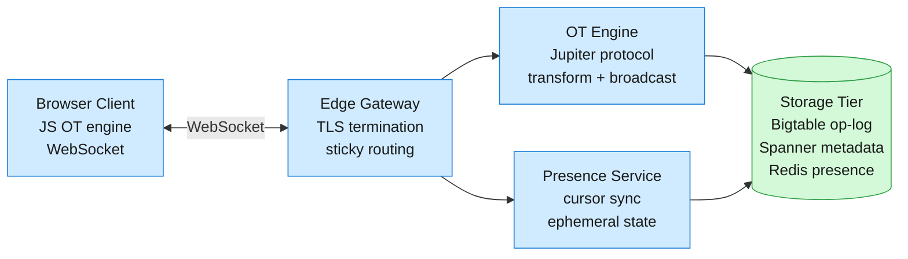
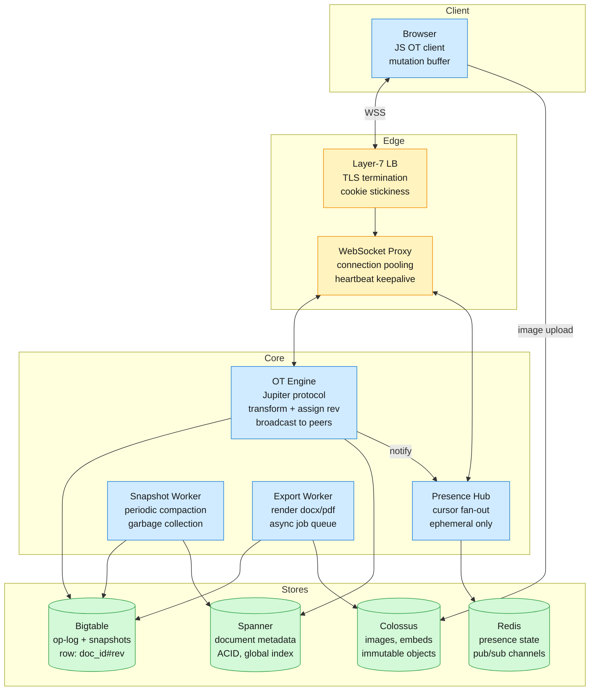

Google Docs serves ~2B monthly active users editing documents collaboratively in real time. A document open for editing draws 1–100 concurrent collaborators whose keystrokes must resolve to a single consistent document state with sub-200ms latency.

<!--more-->

## 1. Problem
Google Docs serves ~2B monthly active users editing documents collaboratively in real time. A document open for editing draws 1–100 concurrent collaborators whose keystrokes must resolve to a single consistent document state with sub-200ms latency. Under the hood this means millions of persistent connections, an operational transform engine that merges concurrent edits without locking, and a storage layer durable enough that no keystroke is ever lost.



## 2. Requirements

**Functional**

- FR1: Create, open, rename, and delete documents.

- FR2: Edit document text concurrently with other users in real time.

- FR3: See other editors' cursors and text selections live.

- FR4: View and restore any past revision from document history.

- FR5: Apply rich formatting — fonts, colors, lists, alignment.

- FR6: Insert images, tables, comments, and embedded content.

**Non-functional**

- NFR1: Sub-200ms edit-to-screen latency for all collaborators.

- NFR2: Up to 100 concurrent editors per document with zero conflicts.

- NFR3: 99.99% write durability — no keystroke loss on acknowledged edits.

- NFR4: Causal ordering: every user sees edits in the order they were made.

*Out of scope: authentication, authorization, offline editing with local-merge, real-time video/voice, add-on marketplace.*

## 3. Back of the envelope

- **Edit throughput:** 150K ops/sec × avg 3 downstream collaborators → 450K delivers/sec. Each delivery runs an OT transform (~50 µs), so a single server core handles ~20K delivers/sec. The OT cluster needs ~25 cores at median load, ~75 at 3× peak.
- **Connection density:** 50M persistent WebSocket connections ÷ 50K connections per server → ~1,000 edge servers. At 100 KB state per connection (document buffer + session context), each server carries ~5 GB of hot working set — fits comfortably in 32 GB RAM nodes.
- **Op-log growth:** 150K ops/sec × 200 bytes/op × 86,400 sec ≈ 2.6 TB/day. With 3× Bigtable replication and 90-day retention, the op-log cluster holds ~700 TB. Snapshot compaction at 5-minute intervals reduces the replay chain to ~300 ops per document.

## 4. Entities

```

Document {
  doc_id:        string     PK         -- UUID, consistent-hash routing key
  owner_id:      string
  title:         string
  created_at:    timestamp
  current_rev:   int64                  -- monotonically increasing revision counter
  snapshot_blob: bytes                  -- latest compacted snapshot (protobuf)
  snapshot_rev:  int64                  -- revision at which snapshot was taken
}

Op {
  doc_id:        string     CK         -- partitions op-log by document
  rev:           int64      CK         -- global revision number, server-assigned
  user_id:       string
  op_type:       enum                  -- insert, delete, retain (per Jupiter spec)
  payload:       bytes                 -- serialized OT operation (variant encoding)
  timestamp:     timestamp
}

Presence {
  doc_id:        string                -- session key for presence channel
  user_id:       string
  cursor_pos:    int32                 -- character offset in document
  selection:     bytes                 -- {anchor, focus} range, nullable
  heartbeat_at:  timestamp             -- last ping; TTL 30s for stale cleanup
}

```

### API
- `POST /docs` — create a new document, returns `doc_id`
- `GET /docs/{doc_id}` — fetch document snapshot with metadata
- `WS /docs/{doc_id}/edit` — upgrade to WebSocket for edit session; carries OT operations
- `GET /docs/{doc_id}/revisions?from=<rev>&to=<rev>` — fetch op-log range for history playback
- `POST /docs/{doc_id}/snapshot` — force snapshot compaction (internal, called by archival worker)
- `WS /docs/{doc_id}/presence` — lightweight presence channel for cursor broadcast
- `GET /docs/{doc_id}/export?format=docx|pdf` — export document in requested format

## 5. High-Level Design



### FR1: Create, open, rename, and delete documents
**Components:** Browser → API Gateway → Spanner.
**Flow:**
1. User clicks "New Document." Browser calls `POST /docs` with title.
1. Gateway generates a UUID `doc_id` and inserts a `Document` row in Spanner with `current_rev: 0`, empty `snapshot_blob`.
1. Spanner returns the row; browser redirects to the document editor at `/docs/{doc_id}`.
1. Open: `GET /docs/{doc_id}` fetches the latest snapshot from Spanner. If the snapshot is stale (behind the op-log tail), the OT server replays ops from Bigtable and returns the hot result.
1. Rename: `PATCH /docs/{doc_id}` updates Spanner `title` — a single-row ACID write.
1. Delete: soft-delete with `deleted_at` timestamp in Spanner; document hidden from listing but recoverable for 30 days.

**Design consideration:** `doc_id` doubles as the consistent-hashing routing key. The first 2 bytes of the UUID hash determine the OT server shard — the gateway routes every connection for that document to the same shard without a separate lookup table. New documents spread evenly across the ring.
### FR2: Edit document text concurrently with other users in real time
**Components:** Browser OT client → WebSocket → OT Engine → Bigtable.
**Flow:**
1. Browser captures a keystroke, generates an OT operation (e.g., `insert('H', 42)` where 42 is the character offset relative to the last acknowledged revision).
1. Browser sends the operation over the document's WebSocket to the OT Engine.
1. OT Engine transforms the incoming operation against any concurrent operations it has already applied (server-side transform). It assigns the next monotonically increasing `rev`.
1. OT Engine appends the transformed operation to Bigtable (`Op` row at `doc_id#rev`).
1. OT Engine broadcasts the transformed operation to every other collaborator on the same document via their WebSocket connections.
1. Each receiving browser applies the operation against its local document state, adjusting the cursor offset if needed.

```javascript
Client A: insert('H', 0) @rev=base    ──→  Server: transform, assign rev=5
Client B: insert('W', 0) @rev=base    ──→  Server: transform vs A's op, assign rev=6

Server broadcasts:
  → All clients: {rev:5, op: insert('H', 0), user: A}
  → All clients: {rev:6, op: insert('W', 0), user: B}   // 'W' offset adjusted after 'H'

```

**Design consideration:** The client operates on a **stop-and-wait** model — it sends one operation at a time and waits for the server's acknowledgment (carrying the assigned `rev`) before sending the next. This keeps the client's local revision counter in lockstep with the server and eliminates a whole class of undoing/redoing transforms. For fast typists (100+ WPM), a single-keystroke-per-roundtrip is still 5–10 ms on a good connection — faster than human perception. Batching multi-character inserts (paste operations) into a single `insert(string, offset)` operation keeps throughput reasonable.
### FR3: See other editors' cursors and text selections live
**Components:** Browser → Presence Hub → Redis Pub/Sub → all collaborators.
**Flow:**
1. On every cursor move or selection change, the browser sends a lightweight presence update over the `/docs/{doc_id}/presence` WebSocket.
1. The Presence Hub writes the update to Redis (key: `presence:{doc_id}:{user_id}`, TTL 30s) and publishes to channel `presence:{doc_id}`.
1. All other collaborators subscribed to that Redis channel receive the update and render the remote cursor.
1. If no update arrives for 30 seconds, the Redis key expires and the remote cursor disappears from all clients.

**Design consideration:** Presence traffic is unbundled from the OT channel. Cursor updates fire at 10–30 Hz (mouse movement) vs. keystrokes at 3–10 Hz — combining them would inflate the OT engine's workload by 3×. Keeping presence on a separate Redis Pub/Sub path also means a presence node crash doesn't interrupt editing — cursors blink out briefly and reappear on reconnect, which users tolerate.
### FR4: View and restore past document revisions
**Components:** Browser → OT Engine → Bigtable op-log.
**Flow:**
1. User opens the version history panel. Browser calls `GET /docs/{doc_id}/revisions?from=<rev>&to=<rev>`.
1. OT Engine reads the op-log slice from Bigtable — a contiguous range scan on the `doc_id` partition.
1. Browser replays operations locally to reconstruct the document at any target revision.
1. "Restore this version": browser generates an OT operation that inverts all ops between the current head and the target revision, sends it as a regular edit. The restored state becomes the new head revision — history is append-only, never rewritten.

**Design consideration:** Replay from op-log is linear in the number of operations between the snapshot and the target revision. The Snapshot Worker compacts snapshots every 5 minutes or every 500 ops (whichever comes first), bounding replay depth to ≤ 500 ops per document. A user opening a 10-year-old document replays at most 500 operations — ~50 ms of replay time in the browser.
### FR5: Apply rich formatting — fonts, colors, lists, alignment
**Components:** Browser OT client (local model) → OT Engine.
**Flow:**
1. User selects a text range and picks "Bold." Browser generates an OT operation with type `retain(range, {bold: true})` using the Jupiter component model — formatting operations are retained (no text change) with an attribute delta.
1. OT Engine transforms the retain operation identically to insert/delete: it shifts offsets if concurrent edits move the target range.
1. Broadcast to all collaborators; each browser applies the attribute change to its local model.
1. Renderer re-serializes the document model to HTML/DOM with the updated inline styles.

**Design consideration:** Formatting uses the same OT pipeline as text edits — no separate protocol. The component model treats the document as a sequence of characters with attribute spans: `[{char: 'H', bold: true}, {char: 'i', bold: false}]`. Inserting in the middle of a bold region inherits the surrounding attributes automatically. This avoids "format paint" bugs where typing after a bold word produces non-bold text.
### FR6: Insert images, tables, comments, and embedded content
**Components:** Browser → BlobStore (images) / OT Engine (references).
**Flow:**
1. User inserts an image. Browser uploads the binary to Colossus via a pre-signed upload URL, receives a content hash.
1. Browser sends an OT operation `insert_image(hash, dimensions, offset)` through the edit WebSocket.
1. OT Engine treats it as a special insert: the payload is an opaque blob reference, not text. Transform logic skips content merging for blob ops — concurrent text inserts around the image only shift the reference's offset.
1. Collaborators render the image by resolving `GET /blobs/{hash}` from Colossus — cached at the CDN edge.
1. Tables: serialized as an embedded sub-document model (rows × cells as nested character sequences). Comments: anchored to a text range by offset; stored in a `Comment` entity indexed by `(doc_id, anchor_rev, anchor_offset)`.

**Design consideration:** Blob operations are opaque to the OT engine — the server never inspects image bytes. This keeps the transform path fast and avoids pathologically large operation payloads. The image upload is out-of-band, so a 20 MB image doesn't block the edit WebSocket.

## 6. Deep dives

### DD1: Real-Time Collaborative Editing — OT vs. CRDT
**Problem.** Two users type simultaneously at the same position. User A inserts "Hello" at offset 0; User B inserts "World" at offset 0. Both see their own keystrokes immediately, but the server must converge both clients to "HelloWorld" or "WorldHello" — consistently, for every collaborator. The algorithm must handle arbitrary interleaving of inserts and deletes across up to 100 concurrent editors without ever diverging document state.
**Approach 1: CRDT with list-insert semantics (RGA / Yjs)**
Each character carries a globally unique ID (Lamport timestamp + site ID). Characters are ordered by their position in a linked structure (e.g., RGA — Replicated Growable Array). There is no central authority; peers exchange operations directly and resolve ordering deterministically from the IDs.

```javascript
// RGA-style insert: each character has a permanent position ID
{char: 'H', id: (ts:1, site:A), parent: ROOT, side: LEFT}
{char: 'W', id: (ts:2, site:B), parent: ROOT, side: LEFT}
// Deterministic tiebreak: lower (ts, site) wins → 'H' before 'W'

```

**Challenges:** The document model is inherently append-only — deleted characters are tombstoned, never removed. A 500-page document edited by 100 people over 5 years accumulates millions of tombstones, bloating the in-memory representation. Garbage collection requires consensus (all peers must agree a tombstone is unreachable), which reintroduces a coordination cost CRDT was designed to avoid. The CRDT metadata overhead (16–32 bytes per character) inflates a 10 KB text document to ~500 KB in memory.
**Approach 2: OT with central server (Jupiter protocol)**
A single OT server owns the document state. Clients send operations keyed to a known base revision. The server transforms concurrent operations against each other, assigns sequential revision numbers, and broadcasts. The Jupiter protocol uses a 2D state space: each client tracks its own sent operations and the server's acknowledged operations. The transform function `xform(op_a, op_b) → (op_a', op_b')` guarantees that applying `op_a` then `op_b'` produces the same result as `op_b` then `op_a'`.

```javascript
Server state space (per document):
  Client A queue: [ins('H', 0)@rev=5]     -- op from A, based on rev 5
  Client B queue: [ins('W', 0)@rev=5]     -- op from B, based on rev 5

Server processing:
  1. Pick A's op → assign rev=6, store, broadcast {rev:6, ins('H', 0)}
  2. Pick B's op → its base (rev=5) < current head (rev=6)
     Transform: xform(ins('W',0)@5, ins('H',0)@6) → ins('W',1)@6
     Assign rev=7, store, broadcast {rev:7, ins('W', 1)}

```

**Challenges:** The server is a single point of contention per document. If the server crashes, in-flight operations are lost and clients must reconnect and re-sync. The stop-and-wait flow (client sends one op, waits for ack) limits any single client's throughput to one operation per RTT — acceptable for human typing, but paste of 10,000 characters requires a batched insert operation. Cross-document operations (copy-paste between docs) need a separate mechanism.
**Approach 3: OT with relay (client-to-client via server, no central transform)**
Clients broadcast operations to all peers through the server as a relay. Each client independently transforms incoming operations. No single server-as-authority — the server is a dumb message bus.
**Challenges:** Convergence depends on every client running the exact same OT algorithm version and seeing operations in the same order. A single client with a buggy transform (OS/browser difference, stale cache) permanently diverges the document. Debugging diverged documents requires comparing full client state dumps. Operating at Google Docs scale, this multiplies the support burden by the number of client platforms (web, Android, iOS).
**Decision.** Central-server OT with the Jupiter protocol.
**Rationale.** A central OT server side-steps the tombstone accumulation problem entirely — the server compacts the document state into snapshots, and clients only hold the current revision + a few unacknowledged operations. The 100-editor cap is a product constraint, not an OT limitation — it bounds the fan-out multiplier and keeps the server's transform queue shallow. The stop-and-wait model is a deliberate trade: it sacrifices per-client throughput (one op per RTT) for simplicity — no undo/redo stacks, no out-of-order ack handling. For human typing, 60 WPM = 5 characters/second = 200 ms per keystroke, which is 40× the typical RTT. CRDT's decentralized model wins for peer-to-peer offline-first apps; OT wins when you already have a server, need snapshots for version history, and want a single point of truth for debugging divergence.

> [!TIP]
> **Key insight:** The central server isn't a scaling bottleneck — it's a coordination bottleneck per document, and each document is independent. The real scale challenge is fanning out operations to 100 collaborators, not transforming them. A single document's OT workload fits on one core; the cluster challenge is routing 50M documents across thousands of cores.

**Edge cases:**
- **Server crash during transform:** Client receives no ack within 2s, reconnects to the same shard (sticky session). OT Engine replays the op-log from the client's last acknowledged revision and resends unacknowledged ops. Idempotent: server detects duplicate ops by `(doc_id, rev)` and drops them.
- **Stale base revision:** Client sends op based on rev 42, but server head is at rev 56. Server replays ops 43–56 against the incoming op, transforming it to base 56 before assigning rev 57. Cost: 14 transforms, ~0.7 ms — negligible.
- **Paste of 50,000 characters:** Client batches the paste as a single `insert(large_string, offset)` operation rather than 50,000 individual character inserts. The server treats it as one op, broadcasts one message. The receiving clients render the paste in one DOM update.

---

### DD2: Scaling WebSocket Connections
**Problem.** At 50M concurrent documents with an average of 2–5 editors each, the system holds ~100M open WebSocket connections at peak. Each connection carries bidirectional traffic: edits up (client→server), transforms down (server→client), presence pings, and TCP keepalives. A single server process can hold ~50K connections before kernel buffer limits and CPU saturation kick in. That means ~2,000 edge servers — and every connection for a given document must land on the same server, because the OT Engine holds the document's in-memory state on that server.
**Approach 1: Consistent-hashing load balancer (Layer 4)**
An L4 load balancer hashes the document ID to a backend server. TCP connections for the same document always land on the same server. No application-layer routing overhead.
**Challenges:** L4 balancing is connection-granularity — once a TCP connection is established, it stays pinned. But WebSocket connections drop and reconnect (network flaps, laptop lid close, mobile tower handoff). A reconnecting client may land on a different server if the hash ring changed (server added/removed). The new server has no in-memory document state and must cold-load from Bigtable, adding 200–500 ms of latency on reconnect. L4 also can't inspect WebSocket frames for routing — presence and edit traffic share the same connection, so presence can't be offloaded to a separate server pool.
**Approach 2: Layer-7 sticky sessions with cookie-based routing**
An L7 reverse proxy (Envoy, HAProxy) terminates TLS, reads the `doc_id` from the WebSocket upgrade request path (`/docs/{doc_id}/edit`), and routes to the OT server shard that owns that document. A session cookie pins the client to the same server across reconnects within a TTL window (5 minutes). If the pinned server is down, the proxy falls back to consistent hashing on `doc_id`.
**Challenges:** L7 termination at 100M connections requires a proxy tier that can hold that many connections — roughly the same scale as the OT servers themselves. Cookie stickiness adds ~50 bytes per HTTP upgrade; 100M connections × 50 bytes = 5 GB of cookie state across the proxy fleet, manageable. The proxy must handle WebSocket upgrade negotiation correctly (101 Switching Protocols) and forward frames without buffering them — any proxy-side buffering introduces latency that violates the 200ms NFR.
**Approach 3: Session-layer routing with a connection router daemon**
A thin Go daemon runs on each OT server node, holding a gossip-based membership view of the cluster. The L4 LB round-robins new connections to any node. The daemon on the receiving node looks up the `doc_id` in the first WebSocket frame, checks if this node owns the document, and if not, transparently proxies the connection to the owning node via an internal gRPC stream. The client sees one connection; the routing is server-internal.
**Challenges:** The hop-through node adds one intra-cluster network round-trip to every frame — 0.1–0.3 ms within a datacenter, acceptable. But the hop node must buffer frames during the proxy handshake, adding complexity. If the owning node crashes, the hop node must detect the failure and reconnect the client to the new owner, which requires the cluster to agree on ownership transfer — a consensus problem.
**Decision.** Layer-7 sticky sessions with cookie-based routing, falling back to consistent hashing on `doc_id`.
**Rationale.** L7 routing puts the routing decision at the edge, where the proxy already terminates TLS and inspects HTTP. No intra-cluster hop, no double-buffering. The cookie handles the reconnect case: if a client's Wi-Fi drops for 3 seconds, it reconnects and the proxy routes to the same server via cookie, hitting warm in-memory state. The 5-minute cookie TTL is a deliberate trade: long enough to cover transient network interruptions (laptop lid close, elevator ride), short enough that a permanently down server's clients redistribute within minutes. This is the standard pattern for stateful WebSocket services — Discord's guild servers, Figma's document servers, and multiplayer game servers all use cookie-based stickiness at the edge.

> [!WARNING]
> **Cost/caveat:** 100M connections at the L7 proxy tier means the proxy fleet is as large as the OT fleet. In practice they're co-located: Envoy runs as a sidecar on each OT server node, handling TLS termination locally. A thin edge LB (Cloud Load Balancer, Cloudflare) handles the first TCP accept and forwards to the sidecar over a persistent HTTP/2 mesh — the edge LB only holds ~1M connections, not 100M.

**Edge cases:**
- **Document migration (hotspot):** A document goes viral and attracts 10K concurrent viewers. The owning server saturates. The cluster controller detects the hotspot (CPU > 80% on one node for 30s), pauses new connections to that document, promotes a read replica from Bigtable snapshot to a new server, and splits viewers across two servers. Editors (writable connections) stay pinned to the primary; viewers fan out. This is rare — the 100-editor cap prevents true hotspots on the write path.
- **Connection drain on deploy:** Rolling restart: the OT server sends a `go-away` frame to all connected clients with a `retry_after: 3000` hint. Clients reconnect; the cookie routes them back to the same node if it's still alive, or to the consistent-hash fallback if the node is gone. The node flushes its in-memory state to Bigtable before shutting down. Drain takes ~10 seconds for 50K connections.
- **Cross-region latency:** A user in Tokyo edits a document whose owning server is in Oregon (because the document creator was in the US). 100ms RTT violates the 200ms latency NFR. The solution: multi-region OT servers with a Spanner-backed document ownership registry. Documents migrate to the region where the majority of active editors are located. Migration is a background operation: snapshot → ship to target region → replay recent ops → cut over. See DD3 for the storage layer that makes this possible.

---

### DD3: Document Storage and Chunking
**Problem.** A document is a sequence of operations, not a file. To render the current state, the system replays all operations from the beginning. A document edited by 10 people over 3 years accumulates ~50M operations — replaying them serially takes minutes, not milliseconds. The system must serve the current document state in <50 ms while preserving every historical operation for version history and audit. Total op-log: ~2.6 TB/day, 90-day retention, ~234 TB of operations that must be both append-written at 150K ops/sec and range-read for replay.
**Approach 1: Full op-log replay with in-memory cache**
Every document load replays the op-log from Bigtable into an in-memory model. The model is cached in the OT server's memory for the duration of the edit session. On first load, replay from rev 0; on reconnect, replay from the last acknowledged revision.
**Challenges:** First-load replay for a 3-year-old document with 50M operations takes 50M × 50 µs/transform = 2,500 seconds — over 40 minutes. Impractical. Even a moderately active document with 500K operations takes 25 seconds. Cache eviction on server restart means cold-load latency is unbounded.
**Approach 2: Periodic snapshots with bounded replay**
Every N operations (or every M minutes), the Snapshot Worker compacts the document state into a protobuf snapshot and writes it to Bigtable alongside the op-log. On load, the server fetches the latest snapshot (O(1) read) and replays only the operations after the snapshot's revision. The snapshot interval bounds replay depth to a fixed operation count.

```javascript
Bigtable row layout (row key = doc_id#padded_rev):
  doc_abc#0000000000  →  {snapshot: <protobuf blob>}     // rev 0 snapshot
  doc_abc#0000000001  →  {op: insert('H', 0), user: A}
  doc_abc#0000000002  →  {op: insert('i', 1), user: B}
  ...
  doc_abc#0000000500  →  {snapshot: <protobuf blob>}     // rev 500 snapshot
  doc_abc#0000000501  →  {op: delete(3, 1), user: A}

```

**Challenges:** Bigtable stores op-log and snapshots in the same row range for a document. At 500 ops/snapshot, an active document generates 2 snapshots/second — these blobs are large (up to 10 MB for a 500-page document) and dominate storage. Solution: snapshot every 500 ops OR every 5 minutes, whichever is less frequent. For a document edited continuously, that's 12 snapshots/hour, ~120 MB/hour of snapshot data. Acceptable for hot documents; cold documents get snapshotted on the archival worker's schedule.
**Approach 3: Event sourcing with materialized view (CQRS)**
The op-log is the write model (event store). A separate materialized view (the read model) holds the current document state in a format optimized for reading — rendered HTML or an intermediate representation. Every operation writes to the event store first, then a projector updates the materialized view asynchronously.
**Challenges:** Eventual consistency between write and read models. If the projector lags, a user opening the document sees stale state. This is acceptable for analytics dashboards, not for real-time collaborative editing where editor B must see editor A's keystroke within 200ms. The projector lag also complicates the OT server's ability to transform incoming operations against the current state — it must wait for the projector to catch up or transform against a stale base and correct later.
**Decision.** Periodic snapshots with bounded replay in Bigtable. Snapshots stored co-located with the op-log in the same row range for efficient prefix scans. The OT server holds the current in-memory model; snapshots are the cold-load path and crash-recovery mechanism.
**Rationale.** Co-locating snapshots and operations in Bigtable means a single prefix scan over `doc_id#*` fetches everything needed for replay in one read pass — no cross-table joins, no coordination between different storage systems. Bigtable's lexicographic row ordering (doc_id then padded revision) guarantees that ops and snapshots for the same document are physically adjacent on disk, making the prefix scan efficient. The 500-op replay bound keeps cold-load latency under 50ms: 500 transforms × 50 µs = 25 ms, plus ~10 ms Bigtable read latency. The snapshot interval is tunable per document based on activity — a document idle for 6 months gets snapshotted once and never replayed until the next edit.

> [!TIP]
> **Key insight:** A snapshot every 500 operations means the replay chain is never deeper than 500, regardless of the document's age. A 10-year-old document with 50M operations loads in the same time as a 1-hour-old document with 600 operations. The compaction cost is amortized: 500 operations produce one snapshot of ~100 KB (text-only), so the snapshot overhead is ~20% of op-log storage.

**Edge cases:**
- **Snapshot-worker race:** Two snapshot workers pick up the same document simultaneously (split-brain). Solution: optimistic locking — the snapshot write to Bigtable includes a `snapshot_rev` check. Only the write for the highest revision succeeds; the other is discarded.
- **Very large documents:** A 500-page document with embedded images produces a 50 MB snapshot. Bigtable row size limit varies by configuration, but 50 MB exceeds typical limits. Solution: chunk the snapshot into 1 MB segments stored as separate Bigtable rows (`doc_id#snapshot#chunk_0`, `doc_id#snapshot#chunk_1`, …) with a manifest row that lists chunk hashes.
- **Document fork:** User copies a document. The copy is a new `doc_id` with a snapshot copied from the source document's latest snapshot at the time of copy. The op-log starts fresh — the copy has no history before the fork point.
- **Multi-region op-log:** With OT servers in multiple regions, the op-log must be globally consistent. Spanner's TrueTime and externally-consistent reads guarantee that every OT server sees operations in the same order. The op-log is written to a Spanner-backed log table first (for ordering), then asynchronously flushed to Bigtable (for scale). Spanner holds the last ~1,000 ops per document; Bigtable holds the full history.

---

### DD4: Presence and Cursor Synchronization
**Problem.** 100 editors on a single document each move their cursor at 10–30 Hz (mouse) and type at 3–10 Hz. Broadcasting full cursor state through the OT channel would add 1,000–3,000 messages/second per document — 10× the edit traffic — inflating the OT engine's workload and delaying actual edits. Presence is ephemeral: a cursor that's 200ms stale is usable; a missing cursor is a minor annoyance. Presence doesn't need the same durability and consistency guarantees as document text.
**Approach 1: In-band cursor updates over the edit WebSocket**
Cursor position is an OT operation: `retain(cursor_range, {user_id: X, color: blue})`. It flows through the same transform pipeline as text edits, gets a revision number, and is broadcast to all collaborators.
**Challenges:** At 30 Hz per user and 100 users, cursor traffic is 3,000 ops/sec for a single document — more than the entire OT engine's median throughput for the document's text edits. Each cursor update runs a transform (~50 µs), gets an op-log write, and fans out to 99 peers. This overhead delays text operations queued behind cursor updates. The op-log fills with cursor revisions that are meaningless for version history — replaying them during a document load wastes time.
**Approach 2: Out-of-band presence via Redis Pub/Sub**
Cursor state travels over a separate WebSocket (`/docs/{doc_id}/presence`) and a separate server path (Presence Hub → Redis Pub/Sub). No transforms, no op-log writes, no revision numbers. Clients subscribe to `presence:{doc_id}` and receive raw cursor updates. The Presence Hub deduplicates updates in a 50ms window — if a user's cursor moves 3 times in 50ms, only the last position is broadcast.
**Challenges:** Separate WebSocket means two connections per user per document. At 100M total connections, doubling to 200M connections (edit + presence) adds significant overhead at the L7 proxy tier. However, many clients multiplex: the browser opens one WebSocket for both edit and presence, with a protocol-level multiplexing layer (sub-protocols or message type field) — the server demuxes to OT Engine and Presence Hub internally.
**Approach 3: Peer-to-peer cursor via WebRTC data channel**
Collaborators establish a WebRTC data channel mesh for cursor traffic. No server involvement — cursors go directly between browsers. The server is only involved in signaling (ICE candidate exchange) when the session starts.
**Challenges:** A 100-person WebRTC mesh is 4,950 bidirectional channels. Each browser's upload bandwidth must carry 99 cursor streams at 30 Hz = ~3,000 messages/second = ~300 KB/s of cursor traffic — manageable, but the mesh maintenance overhead (ICE restarts, NAT traversal failures) is substantial. Corporate firewalls frequently block WebRTC data channels while allowing WebSockets over TLS. Debugging a missing cursor in a 100-person mesh means checking 99 peer connections per client.
**Decision.** Out-of-band presence via Redis Pub/Sub, multiplexed over the same WebSocket connection as edits.
**Rationale.** Redis Pub/Sub is fire-and-forget — no persistence, no replication overhead (channels don't survive restarts). A presence message traverses: Client → WS Proxy → Presence Hub → Redis `PUBLISH` → Redis `SUBSCRIBE` on 99 other Presence Hub instances → 99 clients. Total latency: ~5–10ms within a datacenter, dominated by the Redis hop. The 50ms dedup window is the key optimization: it reduces 3,000 cursor messages/sec/document (raw) to ~2,000 messages/sec/document (deduped), a 33% reduction, without perceptible cursor lag. Redis's per-channel message rate is ~100K/sec on modest hardware. The 2,000 msg/sec/document figure is the worst case (100 concurrent editors); the vast majority of active documents have only two or three editors and generate ~20 msg/sec, so one Redis node sustains ~5,000 typical documents before saturating. With ~500K documents having active editors at any instant, that puts the presence tier at ~100 Redis nodes — and the rare 100-editor hot document gets a dedicated channel so it can't starve its neighbors.

> [!NOTE]
> **Load-bearing detail:** Cursor deduplication happens at the Presence Hub, not at the client. The client sends every cursor move (the browser fires `onmousemove` events at the display refresh rate, typically 60 Hz, throttled to 30 Hz by the JS client). The Presence Hub buffers the latest cursor state per user per document in a 50ms bucket; when the bucket flushes, only the most recent position is published. This is effectively a lossy throttle — acceptable because intermediate cursor positions are invisible to the human eye at 30 Hz anyway.

**Edge cases:**
- **Presence Hub crash:** Redis Pub/Sub is not durable — on crash, a Presence Hub instance loses its subscriber state. Clients reconnect to a different instance (the WS proxy retries), re-subscribe to `presence:{doc_id}`, and receive the next cursor update. Cursors disappear for 1–3 seconds — within tolerance.
- **Stale cursor linger:** User closes the laptop lid without cleanly disconnecting. The Redis key `presence:{doc_id}:{user_id}` has a 30-second TTL. After 30 seconds of no heartbeat, the key expires, and a keyspace notification triggers the Presence Hub to publish a `user_left` message. Other clients remove the cursor. No explicit "leave" message needed.
- **Presence jitter at high latency:** User on a 200ms satellite link sends cursor updates. The 50ms dedup window on the server means each cursor update arrives 150ms stale relative to the user's actual position. Other users see the cursor jump rather than glide. Acceptable — satellite users already experience 600ms+ RTT on their own screen; jittery remote cursors are a minor side effect.
- **Cursors overlaid at same position:** Two users' cursors at the same character offset. The client renders them stacked with a slight vertical offset based on `user_id` hash — no server coordination needed.

---

## 7. Trade-offs

| Decision | Chosen | Rejected | Why |
|---|---|---|---|
| Edit convergence | OT (Jupiter, central server) | CRDT (RGA / Yjs) | Central server enables snapshots and bounded replay without tombstone accumulation. CRDT wins for offline-first P2P; OT wins when you have a server and need version history. |
| Client flow control | Stop-and-wait (one op per ack) | Streaming (multiple in-flight ops) | Simplifies client-side state; a 10ms RTT supports 100 ops/sec — well beyond human typing speed. Streaming is unnecessary for text and introduces undo/redo complexity. |
| Connection routing | L7 cookie stickiness + consistent-hash fallback | L4 consistent hashing, intra-cluster proxy | Cookie handles reconnect within 5min TTL without cold-load. L4 can't inspect WebSocket upgrade path; intra-cluster proxy adds a hop. |
| Op-log store | Bigtable (row: doc_id#rev) | Spanner (for ops), Cassandra | Bigtable's lexicographic row ordering co-locates ops + snapshots for efficient prefix scans. Spanner is overkill for append-heavy, single-partition-range workloads. |
| Presence channel | Redis Pub/Sub (ephemeral) | OT engine (in-band), WebRTC mesh | Presence is 10× message volume of edits; mixing them inflates OT engine cost. WebRTC mesh is fragile behind corporate firewalls. Redis is fire-and-forget with sub-10ms latency. |
| Snapshot frequency | Every 500 ops or 5 minutes | Every N seconds, snapshot-on-idle | Ties to operation count prevents replay depth from growing unbounded during edit bursts. Time-based interval handles idle documents. |
| Document routing | Consistent hashing on doc_id | Range-based partitioning | Consistent hashing minimizes re-assignment on cluster resize. Cross-region migration is a manual operation for hot documents, not an automatic rebalance. |
| Image/blob storage | Colossus (immutable, content-addressed) | Inline in op-log, Bigtable blobs | Op-log stays lean (~200 bytes/op). Blobs are fetched from CDN edge cache, not through the OT server. Content addressing deduplicates identical images across documents. |

## 8. References

### Primary Sources
1. [High-Latency, Low-Bandwidth Windowing in the Jupiter Collaboration System](https://dl.acm.org/doi/10.1145/215585.215706) — Nichols, Curtis, Dixon, Lamping (UIST 1995). The foundational Jupiter OT paper.
1. [Google Docs: Under the Hood](https://drive.googleblog.com/2010/09/whats-different-about-new-google-docs.html) — Google Drive Blog (2010). Operational transform, stop-and-wait flow, 100-editor limit.
1. [Spanner: Google's Globally-Distributed Database](https://research.google/pubs/pub39966/) — Corbett et al. (OSDI 2012). TrueTime, externally-consistent reads, global metadata store.
1. [Bigtable: A Distributed Storage System for Structured Data](https://research.google/pubs/pub27898/) — Chang et al. (OSDI 2006). Lexicographic row ordering, column families, per-row TTL.
1. [The Google File System](https://research.google/pubs/pub51/) — Ghemawat, Gobioff, Leung (SOSP 2003). Foundation for Colossus; chunk replication, master-chunk architecture.
1. [Operational Transformation in Real-Time Group Editors](https://www.scitepress.org/papers/2005/10928/10928.pdf) — Sun, Jia, Zhang, Yang, Chen (ICEIS 1998). OT correctness conditions, transformation functions.
1. [CRDTs: Consistency without Consensus](https://crdt.tech/) — Shapiro, Preguiça, Baquero, Zawirski (2011). Counterpoint: when decentralized data types beat central coordination.
1. [How Figma's Multiplayer Technology Works](https://www.figma.com/blog/how-figmas-multiplayer-technology-works/) — Figma Engineering (2019). Real-world CRDT deployment for multi-user collaboration.
1. [Redis Pub/Sub](https://redis.io/docs/latest/develop/interact/pubsub/) — Fire-and-forget messaging with channel subscriptions, the basis for ephemeral presence.
1. [Envoy Proxy: WebSocket Support](https://www.envoyproxy.io/docs/envoy/latest/intro/arch_overview/http/upgrades) — L7 WebSocket upgrade handling, sticky sessions, connection draining.
