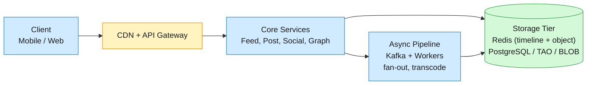
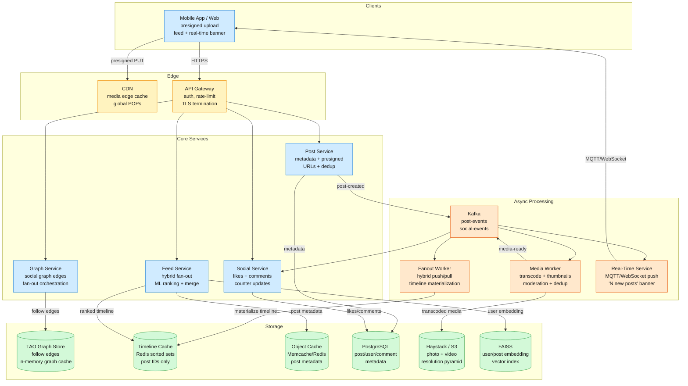
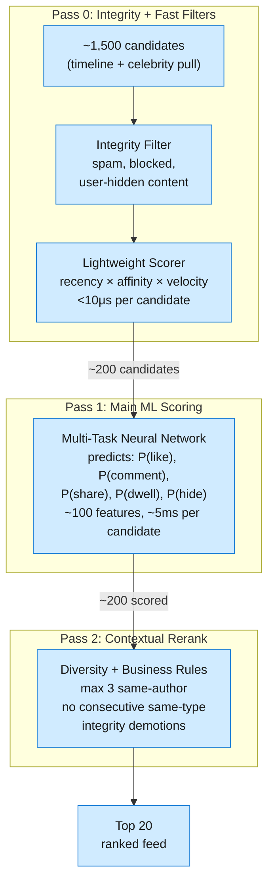
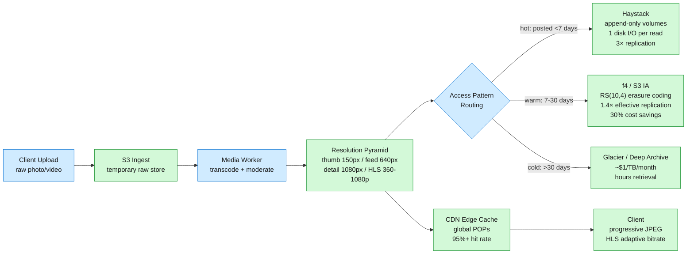

A social media news feed must distribute every post to every follower, rank millions of candidate posts per user by predicted engagement, and serve the result in under 500ms — across 2B+ monthly active users.

<!--more-->

## 1. Problem
A social media news feed must distribute every post to every follower, rank millions of candidate posts per user by predicted engagement, and serve the result in under 500ms — across 2B+ monthly active users. Three forces collide: (1) **write amplification**: a single post by a 50M-follower celebrity explodes into 50M timeline writes in a push-only fan-out, (2) **ranking complexity**: the feed must be ML-personalized, not chronological, meaning scores evolve as real-time engagement signals arrive, and (3) **real-time expectation**: followers should see new content within seconds, yet the read path must remain O(1) so 700K QPS of feed requests don't melt the storage tier.



## 2. Requirements

**Functional**

- FR1: Users create posts with text, images, video, and links

- FR2: Users browse a personalized, ML-ranked feed from followed accounts

- FR3: Users follow and unfollow other accounts; see follower/following counts

- FR4: Users like, comment, share, and save posts; see engagement counts

- FR5: Feed surfaces new posts in real time via push notification banner ("N new posts")

- FR6: Users report, hide, or mute posts and accounts for content control

**Non-functional**

- NFR1: Feed load p95 < 500ms at 700K read QPS peak across 1B DAU

- NFR2: Post publish latency p99 < 2s from upload to appearing in followers' feeds

- NFR3: 99.9% availability; new post visibility within 1s for normal accounts

- NFR4: Write fan-out must not exceed capacity: celebrity posts cannot saturate the pipeline

*Out of scope: Advertising and sponsored content injection, notifications infrastructure (APNs/FCM delivery), direct messaging, live video streaming, analytics and A/B experimentation platform, account registration and authentication.*

## 3. Back of the envelope

- **Feed reads:** 1B DAU × 20 sessions/day × 20 posts/page × 30 pages/session = 12B feed pages/day → 12B ÷ 86.4k ≈ 140K avg QPS, 700K peak
- **Celebrity write:** 50M followers × 1 post = 50M Redis ZADD if push-only × 50μs/op ≈ 2,500s (42 min) → hybrid threshold at 10K followers caps writes; inactive-follower skip (7-day) cuts volume 40-60%
- **Storage:** 500M posts/day × 1KB metadata = 500 GB/day (182 TB/year); 500M posts/day × 2MB avg media = 1 PB/day of new media; timeline cache stores 8-byte post IDs — 800 IDs/user × 500M active users = 6.4 TB cluster-wide (40× memory savings vs per-timeline copies)
- **Fan-out capacity:** 500M posts/day × 300 avg followers × (1 - 0.5 inactive) = 75B timeline writes/day → 75B ÷ 86.4k ≈ 870K write QPS sustained

## 4. Entities

```sql
User
  user_id: bigint PK           ← 64-bit Snowflake: 41b timestamp + 13b shard + 10b seq
  username: text (unique)        ← NFKC-normalized for Unicode-aware lookup
  display_name: text
  bio: text
  follower_count: int            ← gates celebrity threshold (>=10K for pull path)
  following_count: int           ← updated async; cached in TAO
  created_at: timestamp

Post
  post_id: bigint PK           ← Snowflake; time-sortable for Redis ZSET scoring
  user_id: bigint CK           ← partition key for author's post list
  content: text
  media_keys: list<text>         ← CDN variant keys (thumb, feed, detail resolutions)
  like_count: int                ← denormalized; eventual consistency via Redis INCR
  comment_count: int             ← denormalized; async Kafka consumer flush
  share_count: int
  created_at: timestamp

Follow
  follower_id: bigint CK       ← shard key: all follows by one user co-located
  followee_id: bigint CK       ← mirror table for reverse lookup (fan-out queries)
  created_at: timestamp

FeedEntry
  user_id: bigint PK           ← feed owner; single ZREVRANGE returns the feed
  post_id: bigint CK           ← scored by ML rank at fan-out time
  score: float                   ← MTML engagement prediction weighted combo
  ttl: timestamp                 ← auto-evict entries >30 days old

Like
  user_id: bigint CK
  post_id: bigint CK           ← UNIQUE(user_id, post_id) for idempotency
  created_at: timestamp

Comment
  comment_id: bigint PK        ← Snowflake
  post_id: bigint CK           ← partition key for post detail comment retrieval
  user_id: bigint
  body: text
  created_at: timestamp

```

### API
- `POST /posts` — create a post with content and media keys; returns `post_id`
- `POST /posts/presigned-url` — returns time-limited S3 presigned PUT URL (15-min TTL) for direct media upload
- `GET /feed` — personalized ML-ranked feed, cursor-paginated (`?cursor=<base64>`)
- `GET /posts/{id}` — full post detail with comments
- `POST /posts/{id}/likes` — like a post (idempotent); returns updated like count
- `POST /posts/{id}/comments` — add a comment; returns `comment_id`
- `POST /users/{id}/follow` — follow a user; triggers async backfill of recent posts
- `DELETE /users/{id}/follow` — unfollow a user; lazy cleanup via TTL eviction

## 5. High-Level Design



FR1: Create a post
**Components:** Mobile App → API Gateway → Post Service → PostgreSQL + CDN (presigned upload) + Kafka (event).
**Flow:**
1. Mobile app requests a presigned S3 URL from `POST /posts/presigned-url` — Post Service generates a 15-min TTL PUT URL scoped to a single object key.
1. Mobile app uploads raw photo/video directly to S3 via presigned URL — the API tier never touches media bytes.
1. On upload complete, app calls `POST /posts` with S3 object keys, content text, and metadata.
1. Post Service computes SHA-256 content hash, checks Redis dedup set (24h TTL). Hash hit → reuse existing `post_id`, saving ~30% transcode work.
1. Post Service writes metadata to PostgreSQL, emits `post-created` event to Kafka.
1. Media Worker picks up the event: generates resolution pyramid (thumb, feed, detail), runs perceptual hash moderation (PDQ), stores assets in Haystack/S3.
1. On completion, Media Worker emits `media-ready` event — the Fanout Worker gates on this before materializing the post into followers' timelines.

**Design consideration — media-ready gating:** The fan-out triggers only after transcoding and moderation pass. Until then, the post is visible on the author's profile but not in followers' feeds — the feed never shows a broken thumbnail. For photos (~50ms transcode), the gate is imperceptible. For videos (~5-10s), the post briefly exists only on the author's profile.
FR2: Browse personalized feed
**Components:** API Gateway → Feed Service → Timeline Cache (pre-materialized Redis sorted set) + Object Cache (post metadata) + FAISS (user embedding).
**Flow:**
1. Feed Service reads the user's pre-materialized timeline from Redis: `ZREVRANGE feed:{user_id} 0 199` — returns up to 200 post IDs sorted by ML score.
1. For authors < 10K followers: timeline was pre-built at post time by Fanout Worker (push fan-out).
1. For celebrity authors (>= 10K followers): Feed Service queries celebrity's recent posts from 60s cache and merges on read (pull).
1. Post metadata batch-fetched from Memcache/Redis object cache (single copy per post). Cache miss → read PostgreSQL → populate cache.
1. The two-tower ML re-ranker computes `user_embedding · post_embedding` dot product for ~200 candidates in <5ms, producing final ranked top 20.
1. Cursor-based pagination: client passes `cursor=<base64(score,post_id)>` for the next page.
FR3: Follow / unfollow a user
**Components:** API Gateway → Graph Service → TAO (follow edges) + Fanout Worker (async backfill).
**Flow:**
1. Graph Service writes a bidirectional Follow edge in TAO: `(follower_id, followee_id)` and a mirror edge for reverse lookup.
1. Follower/following counts on User entity incremented asynchronously via Kafka consumer.
1. On follow, Fanout Worker fetches followee's last 10 posts and inserts into new follower's timeline — prevents empty feed on new follow.
1. On unfollow, followee's posts lazily removed from follower's timeline. TTL (30 days) evicts stragglers.
FR4: Like, comment, share a post
**Components:** API Gateway → Social Service → PostgreSQL (like/comment rows) + Redis counters.
**Flow:**
1. Social Service checks idempotency via `UNIQUE(user_id, post_id)` on Like table — duplicates silently ignored.
1. Writes Like/Comment row to PostgreSQL; increments denormalized counter on Post asynchronously via Kafka consumer.
1. Share creates a new Post row with `reshare_of = original_post_id` — treated as a regular post for fan-out.

**Design consideration — denormalized counters:** `like_count`, `comment_count`, `share_count` are denormalized on the Post entity because a feed showing 20 posts would otherwise need 20 `COUNT(*)` queries. Counters use Redis `INCR`/`DECR` and periodically flush to PostgreSQL. Staleness < 5s is acceptable for social media engagement counts.
FR5: Real-time feed updates
**Components:** API Gateway → Real-Time Service → MQTT/WebSocket proxy → Mobile client.
**Flow:**
1. When a post is created and fan-out completes, the Fanout Worker publishes a `new-posts-available` event to a per-user Kafka topic.
1. Real-Time Service consumes the event and pushes to active clients via MQTT (mobile) or WebSocket (web).
1. Client receives push, shows "3 new posts — tap to refresh" banner. Does NOT auto-insert — avoids jarring layout shifts.
1. Client refreshes feed on user tap, fetching ranked posts from `GET /feed`.

**Design consideration — banner UX:** The "N new posts" banner pattern gives users control and preserves scroll position — auto-inserting posts causes layout shifts that disorient users mid-scroll. Proven in production at Facebook and Twitter scale.
FR6: Report, hide, and mute content
**Components:** API Gateway → Social Service → PostgreSQL (report rows) + integrity pipeline + content moderation.
**Flow:**
1. User reports a post via `POST /posts/{id}/report` with reason category (spam, harassment, misinformation, etc.).
1. Social Service writes a Report row to PostgreSQL — unique per `(user_id, post_id)` to prevent spam reporting.
1. Report count tracked on the Post entity asynchronously via Kafka consumer. When report count exceeds configurable threshold (3 reports in 24h), post flagged for automated integrity review (Pass 0 filter in the ranking pipeline).
1. User hides a post via `POST /posts/{id}/hide` — adds `(user_id, post_id)` to a Redis hidden-posts set (30-day TTL). In future feed renders, hidden posts are filtered from candidates at Pass 0.
1. User mutes an account via `POST /users/{id}/mute` — adds `(user_id, muted_user_id)` to a Redis muted set. All future posts from that account filtered in Pass 0.

**Design consideration — layered enforcement:** Hiding is lightweight (Redis set, user-scoped) and reversible. Reporting is persistent (PostgreSQL, platform-scoped) and feeds the integrity pipeline. Muting is the most durable per-user content-control mechanism — no human moderator required, yet it prevents the user from ever seeing content from that account again. Each mechanism targets a different trust level: hide for transient irritation, mute for persistent avoidance, report for community safety.
**Edge cases:**
- False reporting: a user reporting the same post 10 times counts as 1 (unique constraint). Excessive false reports by a user trigger a shadow restriction: their reports are still accepted but have zero weight in the report count.
- Reactive engagement: a report on a popular post should not causally degrade ranking for all viewers. Reports are counted per-post, not per-viewer — one post with 100 reports is treated identically to one post with 1 report and 99 viewers who engaged normally.
- Hide reversal: user can unhide a post by tapping "Show this post" from the context menu — removes the post ID from the hidden-posts set.
- Mute list overflow: capped at 5,000 muted accounts per user. Beyond that, the oldest mute is evicted (TTL-based, 90-day cap per mute).

## 6. Deep dives

### DD1: Hybrid Fan-Out Architecture
**Problem.** Distribute every post to every follower such that feed reads are O(1) while bounding write amplification from celebrity posts. Pure push generates 50M timeline writes per celebrity post — saturating the fan-out pipeline for seconds and delaying feeds for all users. Pure pull requires scanning every followee's partition — 150 partition scans per feed load, 800ms+ p95 latency. And ~60% of followers are inactive (no login in 7+ days), making pure push writes to their timelines wasted work.
**Approach 1: Pure fan-out-on-write (push).**
When a post is created, the Fanout Worker writes the post ID and ML score to every follower's feed timeline.

```javascript
for follower_id in get_followers(author_id, active_only=False):
    redis.zadd(f"feed:{follower_id}", score, post_id)
    redis.zremrangebyrank(f"feed:{follower_id}", 0, -801)  // cap at 800

```

**Pro:** O(1) reads — a single ZREVRANGE returns the ranked feed. Timeline is always warm.
**Con:** A celebrity with 50M followers generates 50M Redis ZADD operations. At ~50μs each in a Redis pipeline, that's ~2,500 seconds of sequential work, and existing data center networks cap parallel fan-out throughput. Even with batched pipelines across 2K workers, celebrity posts delay the fan-out pipeline for all other posts. Writes to inactive followers' caches are wasted — they evict before the user ever reads.
**Approach 2: Pure fan-out-on-read (pull).**
At feed load time, query every followed user's recent posts, merge-sort by ML score in the application layer.

```javascript
SELECT p.* FROM posts p
JOIN follows f ON p.user_id = f.followee_id
WHERE f.follower_id = ?
ORDER BY p.score DESC LIMIT 20;

```

**Pro:** Zero write amplification. Always fresh scores — no staleness window. Simple to implement.
**Con:** 150 followees × partition query + application-layer merge-sort = 800ms+ p95. Power users following 1,000+ accounts see >2s latency. At 700K QPS, 105M partition scans/second — requires massive infrastructure just for feed assembly.
**Approach 3: Hybrid fan-out with threshold, inactive skip, and score refresh.**
The fan-out decision is per-post, based on the author's follower count at post time:

```javascript
threshold = 10_000
if author.follower_count < threshold:
    PUSH: materialize to every ACTIVE follower's timeline
else:
    PULL: skip fan-out; merge at read time from cached celebrity post list

```

Active = logged in within 7 days. The inactive-follower filter cuts fan-out volume by 40-60%. The push operation is an atomic Lua script:

```lua
-- Called by Fanout Worker for each active follower
redis.call('ZADD', KEYS[1], ARGV[2], ARGV[1])      -- insert post_id with ML score
redis.call('ZREMRANGEBYRANK', KEYS[1], 0, -(ARGV[3] + 1))  -- trim to 800 entries

```mermaid
At feed read time, the Feed Service assembles candidates from two sources:
1. **Pre-built timeline** (normal users, active followers) — `ZREVRANGE feed:{user} 0 199 WITHSCORES`
1. **Celebrity posts** (pull on read, 60s TTL cache) — fetch each celebrity's last 20 posts from a Redis list `celebrity_posts:{user_id}`, which is rebuilt every 60s by a background job
The two candidate sets are merged and sent through the two-tower ML re-ranker (see DD2). The re-ranker computes personalized scores for fresh posts from the pull path and re-scores older push-path posts whose scores may have drifted.

```mermaid
flowchart TB
    NewPost["New Post Created<br/>author: user_id<br/>post: post_id + score"] --> GetCount{"follower_count<br/>&lt; 10,000?"}
    GetCount -->|"yes (~99.9%)"| FetchActive["Fetch active followers<br/>logged in ≤ 7 days<br/>skip inactive 40-60%"]
    GetCount -->|"no (~0.1%)"| SkipFanout["Skip fan-out<br/>store post metadata only"]
    FetchActive --> PushWorker["Fanout Worker<br/>ZADD + ZREMRANGEBYRANK<br/>per active follower"]
    PushWorker --> TimelineCache[("Timeline Cache<br/>Redis sorted set<br/>800 post IDs per user")]
    SkipFanout --> CelebrityCache[("Celebrity Cache<br/>Redis list<br/>last 20 posts")]
    TimelineCache --> FeedRead["Feed Read<br/>ZREVRANGE + merge<br/>celebrity pull cache"]
    CelebrityCache --> FeedRead
    FeedRead --> MLReRank["Two-Tower Re-Ranker<br/>dot product: user · post<br/>top 20 ranked posts"]

    classDef svc fill:#d0ebff,stroke:#1c7ed6,color:#1a1a1a
    classDef store fill:#d3f9d8,stroke:#2f9e44,color:#1a1a1a
    class NewPost,GetCount,FetchActive,SkipFanout,PushWorker,FeedRead,MLReRank svc
    class TimelineCache,CelebrityCache store

```

The architecture of the fan-out worker produces timeline writes that go through Redis with the atomic Lua script. This ensures the ZADD and trim happen in one operation.
**Decision.** Hybrid fan-out: push for <10K followers (active only, skip 7-day inactive), pull-on-read for celebrities (60s cache), re-rank via two-tower ML at read time.
**Rationale.** Hybrid fan-out with a 10K-follower threshold is the universal production pattern: accounts <10K (99.9% of all accounts) use push fan-out with active-only filtering; accounts >=10K use pull-on-read. The 10K threshold bounds maximum fan-out writes per post — a celebrity post saturates a pull-on-read cache, not the write pipeline. The inactive-follower filter (skip users inactive >7 days) reduces write volume by 40-60% — Meta's production fan-out uses the same configurable window. The Lua-script atomic push prevents race conditions between concurrent ZADD and ZREMRANGEBYRANK. Twitter's architecture split normal users (push via Redis TimelineCache, ~10K instances, 105TB RAM) from celebrities (EarlyBird Lucene index); Facebook's Multifeed used a push path through leaf servers with the same threshold gating.
**Edge cases:**
- **New follow backfill.** Fanout Worker inserts followee's last 10 posts into new follower's timeline — prevents an empty feed on fresh follow.
- **Unfollow cleanup.** Followee's posts lazily removed from follower's timeline. TTL eviction (30 days) handles any stragglers from missed cleanup events.
- **Threshold crossing.** When a user crosses 10K followers mid-post, the fan-out decision uses the count at post-creation time, which is pushed atomically with the post metadata — no race condition.
- **Score staleness.** Fanout Worker re-scores posts in timelines every 5 minutes for posts < 1h old. Posts older than 24h retain their original score — engagement on old content is negligible.
- **Inactive re-activation.** After 30+ days without login, feed is rebuilt from scratch by pulling all followees' recent posts — ~500ms rebuild shown as a loading state.
- **Cold start.** Users with zero follows see trending/popular content from a global trending cache until they follow enough accounts.

**The crossover math:** Push is cheaper when `follower_count × posts_per_user_per_day × ms_per_write < read_qps × follower_count × ms_per_read_pull`. With typical numbers — 2 posts/day, 50μs write, 5ms per partition read, 20 feed reads/day — the crossover is roughly at `2 × 50μs / (20 × 5ms) × follower_count`, which simplifies to ~10K followers. Below this, push is cheaper; above, pull amortizes better.

### DD2: Feed Ranking & Personalization
**Problem.** Rank ~1,500 candidate posts per user by predicted engagement probability — in under 100ms query latency — across 1B DAU. Every post must be scored against every potential viewer with a model that continuously adapts to engagement signals (likes, comments, shares, dwell time, hides, reports). The ranking model must serve 700K QPS of inference with p99 latency under 50ms. The tension: deeper models produce better rankings but exceed latency budgets; lightweight models meet latency but under-rank content.
**Approach 1: Single-stage deep neural network on all candidates.**
Score every candidate post in the user's candidate pool (up to 1,500) through a single large neural network with ~1,000 features per post-user pair.
**Pro:** Simplest architecture. One model to train and deploy.
**Con:** 1,500 candidates × 30ms inference each = 45 seconds per feed — 90× over latency budget. Even with batching and GPU predictors, the cost is prohibitive. Most candidates are obviously irrelevant — running a deep net on all of them wastes compute.
**Approach 2: Heuristic scoring with rule-based ranking.**
Rank by recency decay, author affinity score (engagement frequency × recency), and engagement velocity (likes/minute).
**Pro:** Sub-millisecond per candidate. Trivially scalable. No ML infrastructure required.
**Con:** No personalization beyond surface-level metrics. Cannot capture latent content quality, visual appeal, or semantic relevance. A user who loves cooking videos but never likes them will never see cooking content.
**Approach 3: Multi-stage ML funnel with lightweight pre-filtering.**
A four-pass pipeline narrows candidates through progressively more expensive models:



**Pass 0 — Integrity + Fast filters (~1,500 → ~200 candidates, < 5ms total):**
- Remove posts from blocked/muted accounts, reported content, content-type exclusions (user opted out of video)
- Lightweight scorer: `base_score = recency_decay(t) × author_affinity(a,u) × log(1 + engagement_velocity)` — computed in < 10μs per candidate from cached counters
- Select top 200 candidates by base score for the expensive ML pass

**Pass 1 — Multi-Task Neural Network (~200 candidates → scored, < 30ms total):**
A multi-task neural network simultaneously predicts five engagement probabilities:

```javascript
engagement_score = w_like  × P(like) + w_comment × P(comment)
                 + w_share  × P(share) + w_dwell   × E(dwell_time)
                 - w_hide   × P(hide)   - w_report  × P(report)

```

Weights are personalized per user via an online Bayesian optimization loop informed by explicit surveys (Facebook's "value model") and implicit signals (time spent, return rate). The model uses ~100 features per post-user pair:

| Category | Features |
| User-author relationship | Interaction frequency, recency of engagement, search history for that author |
| Content signals | Post type (text/photo/video/link), media quality score, embedding similarity to user's liked content |
| Behavioral signals | Viewing history, time-of-day patterns, scroll velocity, dwell time per content type |
| Real-time engagement | Like/comment/share velocity, propagation speed, reply count growth rate |
| Negative signals | "Show less" clicks, hide actions, report, scroll-past rate |

Features are pre-materialized into a feature store (Redis hash per post) at fan-out time. At ranking time, the model loads feature vectors for all 200 candidates in a single pipeline, computes predictions in batched GPU inference, and returns scores in <30ms.
**Pass 2 — Contextual rerank (200 scored → top 20, < 5ms):**
- Diversity constraints: max 3 posts per author, penalty for consecutive video posts, min 1 non-video every 10 slots
- Integrity demotions: borderline content (clickbait, engagement bait) demoted by a multiplicative factor
- Ad injection (out of scope for core feed, but slot reservation exists)
The two-tower variant (see Instagram Explore architecture) pre-computes a post embedding at upload time via the post tower and a user embedding periodically via the user tower. At ranking time, only the dot product is computed — reducing Pass 1 latency from 30ms to < 5ms for 200 candidates.
**Decision.** Four-pass pipeline: integrity filter → lightweight heuristic scorer (Pass 0) → multi-task neural network (Pass 1) → diversity + contextual rerank (Pass 2). Two-tower architecture for the main scoring pass to decouple post encoding from user personalization.
**Rationale.** The multi-pass architecture — lightweight pre-filter (Pass 0) → multi-task neural network (Pass 1, ~100 features, ~5ms per candidate) → diversity + integrity rerank (Pass 2) — is proven at scale in production: Meta's News Feed ranking (Meta Engineering Blog, 2021) uses this exact pipeline, selecting ~500 from ~1,000+ candidates then scoring with a multitask neural net. The two-tower variant (Instagram Explore, 2023) decouples post encoding (at upload) from user personalization (hourly), reducing feed-time inference to a <5ms dot product at 700K QPS. The multi-task formulation is critical — optimizing for likes alone produces clickbait echo chambers; the weighted value model predicts long-term satisfaction (dwell time, return rate). Twitter's open-sourced ranking code applies the same pattern with explicit engagement weights (reply by author: +75, retweet: +1, favorite: +0.5, report: -369).
**Edge cases:**
- **New user cold start.** Users with < 10 engagement events get a population-level model (global average weights) with a high exploration factor. After ~50 events, personalized weights phase in.
- **Real-time feature staleness.** Engagement velocity features update every 30s via Kafka stream processing. A post "going viral" takes ~30s max to reflect in feed scores.
- **Model version rollout.** New models deployed as shadow traffic first — scores computed but not used for ranking. After A/B validation against current model, traffic gradually shifted via weighted load balancer.
- **Bias toward recency.** The recency decay term in Pass 0 ensures feeds don't stagnate. Without it, the ML model converges on the user's stable preferences and never surfaces new content.
- **Content-type preferences.** User-level content-type affinity learned from historical engagement ratio: `P(engage | video) / P(engage | photo)`. Applied as a multiplicative boost in Pass 0.

### DD3: Real-Time Feed Updates
**Problem.** When a followed user posts, active followers should see a "N new posts" indicator within 1-2 seconds. At 500M posts/day, this requires pushing update notifications to billions of active client connections — but the push channel is independent of the feed fetch path (which handles ranking and pagination). The tension: maintaining persistent connections for 200M concurrent users strains server resources, and mobile networks drop connections frequently.
**The key distinction.** How events reach the user's device (the wire — polling vs SSE vs WebSocket vs MQTT) is independent of how events reach every recipient on the server (the fan-out strategy — push vs pull vs hybrid). Conflating the two is the #1 architectural mistake. The server-side fan-out (DD1) distributes posts to timeline caches; the real-time push channel (this deep dive) delivers a lightweight notification that new content is available.
**Approach 1: Client-side polling.**
Client polls `GET /feed/updates?since=<last_seen_timestamp>` every 30 seconds.
**Pro:** No persistent connections. Works through all proxies and NATs. Trivially scalable — just stateless HTTP.
**Con:** 30-second staleness floor. For 200M DAU polling every 30s, that's 6.7M polling QPS sustained — 99% return empty responses (no new posts). Wasteful bandwidth and server CPU. Battery drain on mobile from frequent radio wake-ups.
**Approach 2: WebSocket for all clients.**
Every client maintains a persistent WebSocket connection. Server pushes a lightweight event on new post availability.
**Pro:** True real-time — sub-second delivery. Server-initiated push with no client polling overhead.
**Con:** 200M concurrent WebSocket connections require 200M open file descriptors across the server fleet. WebSocket is TCP-based — mobile connections drop when switching between WiFi and cellular, requiring reconnection. WebSocket keepalive pings drain mobile battery. Facebook's Messenger team found TCP-based persistent connections performed poorly on mobile — they switched to MQTT for this reason.
**Approach 3: Dual transport — MQTT for mobile, WebSocket/SSE for web.**

```javascript
             ┌─────────────────────────────┐
             │     Real-Time Service        │
             │  consumes Kafka post-events  │
             │  manages connection registry │
             └──────────┬──────────────────┘
                        │
        ┌───────────────┴───────────────┐
        │                               │
┌───────▼────────┐            ┌────────▼────────┐
│  MQTT Broker   │            │ WebSocket Proxy │
│  (mobile)      │            │ (web clients)   │
│  binary pub/sub│            │ full-duplex TCP │
│  QoS 0/1       │            │                 │
└───────┬────────┘            └────────┬────────┘
        │                               │
┌───────▼────────┐            ┌────────▼────────┐
│  Mobile App    │            │  Web Browser    │
│  persistent    │            │  shows banner   │
│  MQTT session  │            │  + tap refresh  │
└────────────────┘            └─────────────────┘

```

**MQTT for mobile:**
MQTT is a binary publish/subscribe protocol designed for constrained devices and unreliable networks. Key properties:
- **Binary wire format:** ~2-byte fixed header overhead per message vs WebSocket's text framing — significant for metered mobile data
- **QoS levels:** QoS 0 (fire-and-forget), QoS 1 (at-least-once), QoS 2 (exactly-once) — feed updates use QoS 0 since they're idempotent "check for new posts" signals
- **Persistent session:** Client subscribes to `updates/{user_id}` topic. Broker queues messages during disconnection. On reconnect, queued messages delivered — no missed updates during tunnel transitions
- **Keepalive:** MQTT PINGREQ/PINGRESP is a 2-byte exchange vs WebSocket's larger ping/pong frames
- **Battery-aware:** MQTT's design means the radio can stay in low-power mode longer between keepalives
MQTT on mobile achieves significant battery and bandwidth improvements over HTTP long-polling — Facebook Messenger reported these gains after migrating from HTTP long-polling to MQTT.
**WebSocket for web:**
Web browsers lack native MQTT support. WebSocket provides the equivalent real-time channel for web clients. A lightweight proxy layer translates between the internal event format and WebSocket frames. For simpler deployments, Server-Sent Events (SSE) can replace WebSocket — SSE is a one-way server→client stream with native browser `EventSource` API and automatic reconnection.
**Client-side UX contract:**

```javascript
// Client receives push notification:
{ "type": "new_posts", "count": 7, "since": "cursor_base64" }

// Client updates UI:
// 1. Show banner: "7 new posts — tap to refresh"
// 2. Do NOT auto-insert posts into the visible feed
// 3. On user tap → call GET /feed?cursor=<current_top_cursor>
// 4. Replace feed with fresh ranked results

```

The banner pattern (used by Facebook, Twitter, and Instagram) prevents layout shifts that disorient users mid-scroll. Auto-inserting posts would push content down, causing users to lose their reading position — a well-documented UX anti-pattern.
**Decision.** MQTT for mobile clients (QoS 0, persistent session, battery-optimized keepalive), WebSocket/SSE for web clients, "N new posts" banner UX (never auto-insert). Transport is independent of server-side fan-out strategy.
**Rationale.** MQTT's persistent session model handles the WiFi→cellular transition that drops TCP connections; its binary framing (~2-byte overhead per message) reduces bandwidth and battery drain compared to WebSocket's text framing. Facebook Messenger adopted MQTT for mobile after HTTP long-polling and TCP-based persistent connections proved inadequate for mobile reliability and battery life — a documented production migration. For web clients, WebSocket provides an equivalent real-time push channel; SSE serves as a simpler fallback with native browser EventSource API and automatic reconnection. The banner UX pattern ("N new posts — tap to refresh") decouples real-time notification from feed refresh, giving users control and avoiding layout thrashing — it is universal across Facebook, Twitter, and Instagram.
**Edge cases:**
- **Connection drop on tunnel change (WiFi → cellular).** MQTT persistent session preserves queued messages. Client reconnects and receives all missed `new_posts` events. No data loss.
- **Mass reconnect storm.** After a regional network outage, millions of clients reconnect simultaneously. The MQTT broker cluster uses rate-limited session resumption — clients randomized reconnect delay (0-30s) via jitter.
- **WebSocket fallback.** If WebSocket connection fails, client falls back to polling at 30s intervals with exponential backoff on repeated failures (max 5-min interval).
- **Duplicate events.** MQTT QoS 0 is fire-and-forget — no duplicate detection. But the event is idempotent: receiving "3 new posts" twice still results in the same feed refresh. The `since` cursor prevents duplicate display.
- **Notification spam.** Celebrity posting 20 times in rapid succession would generate 20 push events. Client-side batching: if multiple events arrive within a 2s window, merge into a single banner update.

### DD4: Media Hosting & CDN Caching
**Problem.** 500M new posts daily carry 2-8 MB photos or 10-100 MB videos — 1+ PB of new media per day. Each post needs multiple resolution variants. Media must load instantly for 1B DAU globally. The tension: storing a full resolution pyramid for every post multiplies storage costs, while serving a single resolution wastes bandwidth on mobile and looks degraded on desktop.
**Approach 1: Single-resolution storage, on-demand resize.**
Store only the original upload. At request time, resize to the requested dimension via an image proxy service.
**Pro:** Minimum storage. No pre-processing pipeline.
**Con:** Every image request hits a resize worker — adds ~50ms latency per image. At 700K feed QPS × 20 posts × avg 2 images = 28M image requests/sec — requiring thousands of resize workers. A celebrity post with 50M views would re-resize the same image millions of times. Bandwidth waste: mobile clients receive full-resolution images scaled down by the browser — the bits still traversed the network.
**Approach 2: Pre-computed resolution pyramid, all variants stored permanently.**
Generate thumb (150px), feed (640px), and detail (1080px) variants at upload time. Store all variants in hot storage indefinitely.
**Pro:** Instant serving from CDN edge. No runtime resize. Every client gets the right resolution.
**Con:** 3× storage multiplier for photos, 4× for video renditions (360p/480p/720p/1080p). Storage cost linear with upload volume — unsustainable for a free product at 1 PB/day.
**Approach 3: Pre-computed pyramid with tiered storage and CDN edge caching.**
Generate variants at upload time, store in tiered storage keyed by access pattern, cache hot content at CDN edge.



**Transcode pipeline:**
For photos:
- Progressive JPEG encoding: the first scan renders at ~15KB and displays instantly; subsequent scans refine to full quality. This is critical UX — a feed thumbnail appears crisp in ~50ms on a 3G connection, then progressively sharpens.
- WebP/AVIF variants generated alongside JPEG for supported browsers — ~30% smaller than JPEG at equivalent quality.
- Perceptual hash moderation (PDQ 256-bit hash) runs before CDN addressability. Known CSAM hashes blocked at upload.
For videos:
- HLS adaptive bitrate with 4 renditions: 360p, 480p, 720p, 1080p. Client selects rendition based on measured bandwidth.
- First segment (2s) of the lowest rendition pre-loaded for instant playback.
- FFmpeg transcoding worker pool with GPU acceleration. Videos > 5 minutes queued to a low-priority transcode pool.

**Haystack photo storage:**
Haystack (Facebook's photo storage system, OSDI 2010) stores photos as append-only volumes. Each volume is a 100 GB file. An in-memory needle index maps `(key, alternate_key)` → `(volume_id, offset, size)`. At ~10 bytes per photo, 200B photos require only ~2 TB of RAM across the fleet for the index. A single `pread()` system call reads one photo — no directory traversal, no inode overhead, no file-system metadata reads. This is the critical optimization: traditional filesystem-based photo storage requires 3 disk I/Os per read (directory inode → directory entry → file inode → data), while Haystack requires exactly 1.
**f4 warm storage:**
f4 (Facebook's warm BLOB storage, OSDI 2014) uses Reed-Solomon erasure coding — RS(10,4): 10 data shards + 4 parity shards. Effective replication factor = 1.4× (vs 3× for triple replication). This reduces warm storage costs by ~30% while tolerating up to 4 simultaneous disk failures. Cross-DC XOR coding protects against a full region failure: one parity shard stored in a remote DC can reconstruct all 10 data shards.
**CDN edge caching:**
- Content is addressed by a CDN URL that encodes the variant: `https://cdn.example.com/{variant}/{post_id}/{media_key}`
- CDN edge POPs cache popular content. Feed images have a 95%+ edge hit rate — most feed loads fetch images from a CDN node within the user's metro area.
- **Origin shield:** A regional cache layer between CDN edges and Haystack. When a celebrity posts, millions of simultaneous CDN misses coalesce at the origin shield — only one request per region reaches Haystack. The XFetch probabilistic early-expiration algorithm prevents thundering herds on cache expiry: the cache probabilistically refreshes content before TTL expiry based on request rate.
- **Pre-warming:** Top 1K celebrity accounts' recent posts pre-loaded into CDN edge caches at post time via the Fanout Worker.

**Decision.** Pre-computed resolution pyramid at upload time, progressive JPEG encoding, HLS adaptive bitrate for video, three-tier storage (Haystack for hot 0-7 days → f4 erasure coding for warm 7-30 days → Glacier for cold), CDN edge caching with origin shield and pre-warming for celebrity content.
**Rationale.** Haystack's append-only volume design with in-memory needle index achieves 1 disk I/O per photo read — the gold standard since OSDI 2010 and the foundation of Facebook/Instagram's photo storage. f4's erasure coding (RS(10,4), OSDI 2014) reduces warm storage by 30% while maintaining durability equivalent to triple replication at 1.4× effective replication. Progressive JPEG is a critical UX detail: the first 15KB scan renders instantly, then progressively refines — feed thumbnails feel instant even on slow 3G connections. HLS adaptive bitrate for video is the industry standard across YouTube, Netflix, and Instagram. The three-tier storage strategy saves millions annually: 95% of feed loads hit the CDN edge (free), 4% hit Haystack (one disk I/O), <1% hit cold storage (>30 days old, rarely accessed).
**Edge cases:**
- **Transcode failure.** Kafka event not acknowledged; redelivered to another worker. Worker checks Haystack for existing variants before re-processing (idempotent). After 3 retries, post flagged for manual review.
- **Upload rate limiting.** During major events (World Cup final, New Year's Eve), video transcode queue depth spikes. Non-celebrity video transcoding defers to off-peak hours. Users rate-limited to 1 video per 30 seconds.
- **CDN stampede on celebrity post.** Origin shield coalesces millions of simultaneous cache fills into one Haystack read per region. XFetch probabilistic refresh prevents thundering herds on expiry.
- **Storage growth.** Cold storage (Glacier) costs ~$1/TB/month. At 1 PB/day, cold storage adds $30K/month. Warm f4 storage for 30-day window = 30 PB, ~$300K/month at $0.01/GB. Acceptable for a platform generating billions in revenue.
- **Moderation false positive.** PDQ hash match triggers human review. During review, the post is visible to the author but hidden from followers. Successful appeal re-queues the `media-ready` event, triggering fan-out.

## 7. Trade-offs

| Decision | Chosen | Rejected | Why |
|---|---|---|---|
| **Feed generation** | Hybrid fan-out (push <10K, pull >=10K, skip inactive 7d) | Pure push or pure pull | Pure push: 50M writes per celebrity post. Pure pull: 150 partition scans per feed, 800ms+ p95. |
| **Feed ordering** | ML-ranked (multi-task neural network, 4-pass funnel) | Chronological | Production feeds have been ML-ranked since 2016 (Facebook). Chronological cannot prioritize content users value. |
| **ML architecture** | Two-tower (post embedding at upload, user embedding hourly, dot product at read time) | Single-stage deep NN on all candidates | 1,500 candidates × 30ms inference = 45s per feed — 90× over budget. Two-tower: <5ms dot product for 200 candidates. |
| **Real-time transport** | MQTT (mobile) + WebSocket (web), banner UX | Pure polling or WebSocket everywhere | Polling: 6.7M empty QPS. WebSocket on mobile: connection drops on WiFi→cellular, battery drain. MQTT: persistent sessions, binary framing, battery-optimized. |
| **Real-time UX** | "N new posts — tap to refresh" banner | Auto-insert posts into feed | Auto-insert causes layout shifts, disorients users mid-scroll. Banner gives control, preserves scroll position. |
| **Timeline cache** | Post IDs only (8 bytes), full posts in separate object cache | Full post content in timeline cache | ID-only saves ~40× memory: 6.4 TB vs 256 TB for 500M active users. |
| **Cache invalidation** | Memcache leases + deletes (write-through invalidation) | Cache updates (sets on write) or TTL-only | Delete is idempotent. Leases prevent thundering herds on cache miss: only lease holder may populate, lease cancelled on concurrent write. |
| **Media upload** | Presigned S3 URL (client → object store) | App server proxies upload bytes | Saves API bandwidth; app servers handle metadata only (~1KB vs 2-100MB per upload). |
| **Photo encoding** | Progressive JPEG with 150/640/1080 resolution pyramid | Single-resolution JPEG | First 15KB scan renders instantly; full quality refines progressively. Right resolution per device saves bandwidth. |
| **Video delivery** | HLS adaptive bitrate (360p-1080p) | Single-resolution progressive download | Adaptive bitrate matches user bandwidth; HLS segments enable seeking without full download. |
| **Media storage** | Three-tier: Haystack (hot, 7d) → f4 RS coding (warm, 30d) → Glacier (cold) | Single-tier S3 | Haystack: 1 I/O/photo. f4: 30% savings via erasure coding. Matching storage cost to access pattern saves millions. |
| **Content dedup** | SHA-256 hash check on Redis (24h TTL) at upload | No dedup or perceptual-only | Eliminates ~30% of transcode work for re-uploaded viral content. Perceptual hash catches near-duplicates at moderation layer. |
| **Social graph** | TAO in-memory graph cache with bidirectional edges | Sharded PostgreSQL adjacency lists | TAO: 1 hash lookup per privacy check at millions QPS. In-memory graph enables fan-out follower queries without DB scans. |
| **Engagement counters** | Denormalized counters (Redis INCR), eventual consistency (async flush to DB) | Real-time COUNT(*) queries | Feed shows 20 posts × 3 counters = 60 reads; denormalized is O(1) per counter. Staleness <5s acceptable for social media. |
| **Fan-out worker** | Kafka consumer group with per-post fan-out tasks | Synchronous fan-out in web request path | 500M posts/day × 300 avg fan-outs = 150B timeline operations/day. Must be async to keep publish latency under 2s. |
| **Score refresh** | Re-score posts in timelines every 5 min for posts <1h old | Static score at post time | Engagement velocity changes dramatically in the first hour of a post's life. After 24h, engagement stabilizes — no further rescoring needed. |

## 8. References
**Primary sources — Meta/Facebook production papers and engineering blogs**
1. [News Feed Ranking, Powered by Machine Learning (Meta Engineering, Jan 2021)](https://engineering.fb.com/2021/01/26/ml-applications/news-feed-ranking/) — Multi-pass ranking, multitask neural network, value model with personalized weights
1. [Serving Facebook Multifeed: Efficiency and Performance Gains (Meta Engineering, Mar 2015)](https://engineering.fb.com/2015/03/10/production-engineering/serving-facebook-multifeed-efficiency-performance-gains-through-redesign/) — Disaggregated aggregator/leaf architecture, 40% efficiency gain
1. [TAO: The Power of the Graph (Meta Engineering, Jun 2013)](https://engineering.fb.com/2013/06/25/core-infra/tao-the-power-of-the-graph/) — Graph store with in-memory cache, 1B+ reads/sec, async MySQL persistence
1. [Wormhole Pub/Sub System (Meta Engineering, Jun 2013)](https://engineering.fb.com/2013/06/13/core-infra/wormhole-pub-sub-system-moving-data-through-space-and-time/) — 1T+ messages/day, tailing MySQL binlog, at-least-once ordering
1. [Scaling Memcache at Facebook (NSDI 2013)](https://www.usenix.org/system/files/conference/nsdi13/nsdi13-final170_update.pdf) — Memcache lease, thundering herd prevention, multi-region consistency
1. [Scaling Instagram Explore Recommendations (Meta Engineering, Aug 2023)](https://engineering.fb.com/2023/08/09/ml-applications/scaling-instagram-explore-recommendations-system/) — Three-stage cascade, IGQL, Two Towers + MTML, 90M predictions/sec
1. [Finding a Needle in Haystack: Facebook's Photo Storage (OSDI 2010)](https://www.usenix.org/legacy/events/osdi10/tech/full_papers/Beaver.pdf) — Append-only volumes, in-memory needle index, 1 disk I/O per photo
1. [f4: Facebook's Warm BLOB Storage System (OSDI 2014)](https://www.usenix.org/conference/osdi14/technical-sessions/presentation/muralidhar) — Reed-Solomon erasure coding, RS(10,4), 1.4× effective replication
1. [Facebook Transparency Center: Feed Ranking Signals (Meta, updated Jun 2026)](https://transparency.meta.com/features/explaining-ranking/fb-feed/) — Published feature categories, content-type weighting, negative signal handling
1. [Journey to 1000 Models: Scaling Instagram's Recommendation System (Meta Engineering, May 2025)](https://engineering.fb.com/2025/05/21/production-engineering/journey-to-1000-models-scaling-instagrams-recommendation-system/) — Model Registry, automated launch tooling, Bayesian optimization for weight tuning

**Primary sources — Twitter/X production architecture**
1. [Twitter's Recommendation Algorithm (open-source, GitHub, Mar 2023)](https://github.com/twitter/the-algorithm) — MaskNet (48M params), multi-stage ranking, engagement weights, EarlyBird + SimClusters candidate sources
1. [How Twitter Uses Redis (HighScalability, citing Yao Yue / Twitter Engineering)](https://highscalability.com/how-twitter-uses-redis-to-scale-105tb-ram-39mm-qps-10000-ins/) — 10K+ Redis instances, 105TB RAM, 39M QPS, Hybrid List + BTree timeline cache
