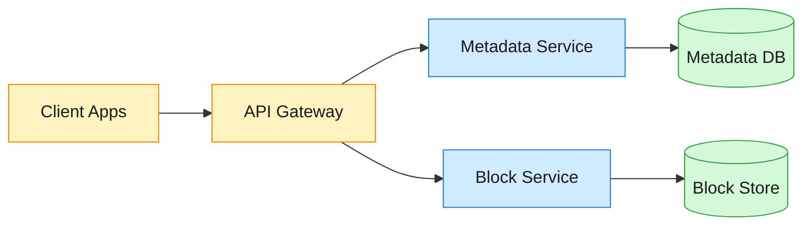
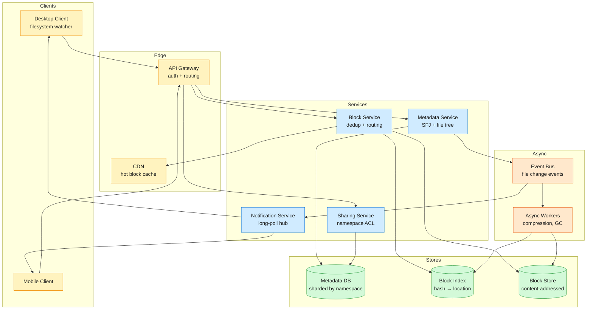

Dropbox is a cloud file storage and sync service serving 700M+ registered users with exabytes of stored content. Users upload files from any device, access them everywhere, share folders with collaborators, and recover previous versions.

<!--more-->

## 1. Problem

Dropbox is a cloud file storage and sync service serving 700M+ registered users with exabytes of stored content. Users upload files from any device, access them everywhere, share folders with collaborators, and recover previous versions. The core challenge is keeping a consistent file tree across N devices with sub-second sync latency while deduplicating content at global scale to keep storage costs sustainable for a freemium model. Individual files range from a few bytes to 50 GB, and the system must handle spikes from viral shared links without degrading sync performance for the rest of the user base.



## 2. Requirements

**Functional**

- FR1: Upload files
- FR2: Download files
- FR3: Share files and folders with other users
- FR4: Auto-sync file changes across devices
- FR5: Restore previous file versions
- FR6: Resolve sync conflicts

**Non-functional**

- NFR1: Strong consistency for file metadata operations
- NFR2: Sync notification p50 < 2 seconds
- NFR3: No accepted write is lost
- NFR4: Redundant content stored and transferred once

*Out of scope: real-time collaborative editing, full-text search, video transcoding and thumbnails, enterprise admin controls, end-to-end encryption with client-held keys.*

## 3. Back of the envelope

- **Write volume:** 700M users × 1 file revision/day × 150 KB avg file ≈ 105 TB/day ingress → ~1.2 GB/s sustained; block write path must handle ~500K puts/sec at peak.
- **Metadata QPS:** ~10M metadata reads/sec peak, ~500K writes/sec → 20:1 read:write ratio; metadata reads dominate — the read path is the latency bottleneck.
- **Total storage:** ~5 EB across all user data → storage is the dominant cost driver; redundancy and uncompressed transfer are expensive at this scale.

## 4. Entities

```
FileRevision {
  namespace_id:  uuid     CK        ← shard key; root or shared folder namespace
  journal_id:    bigint   PK        ← monotonic per namespace
  file_id:       uuid               ← globally unique, survives moves
  relative_path: string
  blocklist:     string[]            ← ordered SHA-256 hashes
  file_size:     bigint
  mtime:         timestamp
  deleted:       boolean
}

BlockIndex {
  block_hash:   binary(32) PK      ← SHA-256 of uncompressed block
  location:     string             ← cell + bucket reference
  ref_count:    integer            ← number of active file references
  created_at:   timestamp
}

SharedFolder {
  folder_id:    uuid     PK
  owner_id:     uuid     FK         ← references user
  name:         string
  policy:       jsonb               ← ACL, member invite, link settings
}

Membership {
  folder_id:    uuid     CK
  user_id:      uuid     CK
  access_level: enum               ← owner / editor / viewer
  added_at:     timestamp
}
```

### API

- `POST /files/upload-init` — submit blocklist of SHA-256 hashes, get back list of missing blocks
- `PUT /blocks/{hash}` — upload a single block (presigned URL flow, client bypasses app servers)
- `GET /blocks/{hash}` — download a block (served from CDN or block store)
- `GET /files/changes?since={cursor}` — list file revisions since cursor (sync poll)
- `POST /shares` — share a folder with users or create a shared link
- `GET /files/{file_id}/versions` — list version history for a file

## 5. High-Level Design



#### FR1: Upload a file

**Components:** Client → API Gateway → Block Service → Block Index + Block Store; Metadata Service → Metadata DB.

**Flow:**

1. Client filesystem watcher detects a new or modified file.
1. Client splits the file into fixed-size blocks and computes SHA-256 for each block.
1. Client sends `POST /files/upload-init` with the ordered blocklist.
1. Block Service queries the Block Index for each hash: existing blocks are deduplicated; only missing hashes are returned.
1. Client uploads missing blocks via `PUT /blocks/{hash}` directly to the Block Store through presigned URLs.
1. Block Store persists each block, updates the Block Index entry with `location` and increments `ref_count`.
1. Client resubmits `POST /files/upload-init` with the full blocklist; all hashes now resolve.
1. Metadata Service writes a new `FileRevision` row: `(namespace_id, journal_id, file_id, blocklist)`.

**Design consideration:** The two-phase commit (blocklist check, upload missing, recheck) is the deduplication gate. If a block already exists in the Block Index, the upload is skipped entirely and the existing block is referenced. A new block is written once and the Block Index entry is the single source of truth for its location. If the client crashes between steps 5 and 7, the uploaded blocks persist — the recheck on step 7 finds them and the commit succeeds.

#### FR2: Download a file

**Components:** Client → Metadata Service → Metadata DB → Block Service → CDN or Block Store.

**Flow:**

1. Client requests file metadata: `GET /files/changes?since={cursor}` returns new `FileRevision` rows.
1. Client reads the `blocklist` from the revision and compares against its local block cache.
1. For each missing block, client calls `GET /blocks/{hash}`.
1. Block Service checks Block Index for the block's `location`, returns a presigned CDN URL (hot files) or direct Block Store URL (cold files).
1. CDN serves the block from edge if cached; on miss, fetches from Block Store, caches, and returns.
1. Client reassembles the file from blocks in order.

**Design consideration:** Only frequently accessed blocks are promoted to the CDN. Cold blocks are served directly from the Block Store — the first-byte latency is higher but the storage cost is lower. The CDN uses short-lived signed URLs (5-minute TTL) so a leaked link is useless after expiry. For large files, the client fetches blocks in parallel and can begin reassembly before all blocks arrive.

#### FR3: Share a file or folder

**Components:** Client → Sharing Service → Metadata DB (namespace ACL).

**Flow:**

1. Client calls `POST /shares` with the folder path and target users.
1. Sharing Service creates a new `SharedFolder` namespace with the specified `policy` (ACL, who can invite, link settings).
1. `Membership` rows are inserted: `(folder_id, user_id, access_level)` for each target user.
1. The shared folder is mounted into each member's root namespace at a configurable path.
1. On every metadata operation within the shared folder, the Metadata Service checks the namespace ACL: the caller's `access_level` is read from the `Membership` table.
1. A change in one member's view (e.g., a new file) writes to the shared namespace's journal and appears in every member's sync cursor.

**Design consideration:** The namespace model is the foundation of access control. Every account has a root namespace; every shared folder is a separate namespace. The Metadata DB is sharded on `namespace_id`, so a user's root namespace and all their joined shared folders may span shards. The common query "list changes in namespace N since cursor C" is a single-shard range scan. Permission checks are a read on the `Membership` table at operation time.

#### FR4: Auto-sync file changes across devices

**Components:** Client → Notification Service (long-poll) + Metadata Service (cursor poll).

**Flow (Remote → Local):**

1. Desktop client opens a persistent long-poll HTTP connection to the Notification Service with its current cursor per namespace.
1. When the Metadata Service commits a new `FileRevision` row, it publishes a `file-changed` event to the Event Bus.
1. Notification Service receives the event, matches it against subscribed cursors, and responds to the long-poll with the new cursor.
1. Client fetches the new revisions via `GET /files/changes?since={cursor}`.
1. Client downloads missing blocks (as in FR2) and applies changes to the local filesystem.

**Flow (Local → Remote):**

1. Client-side filesystem watcher (inotify/FSEvents) detects a local change.
1. Client uploads the file (as in FR1) and the Metadata Service commits a new revision.
1. All other devices on the same account receive the change via their long-poll connections.

**Design consideration:** The long-poll is one per device, not per file. A single idle HTTP connection carries all notifications for that device. If the connection drops, the client falls back to periodic polling (`GET /files/changes?since={cursor}`) every 2 minutes, catching any missed events. The cursor is an opaque `journal_id` per namespace, so the client always knows exactly what it has seen.

#### FR5: Restore previous file versions

**Components:** Client → Metadata Service → Metadata DB → Block Service.

**Flow:**

1. Client calls `GET /files/{file_id}/versions` to list all `FileRevision` rows for that file, ordered by `journal_id DESC`.
1. User selects a previous version. Client reads its `blocklist`.
1. Since blocks are immutable in the Block Store, old blocks remain accessible as long as their `ref_count` is above zero.
1. Client downloads the old blocks (as in FR2) to reconstruct the version locally.
1. Client can choose to restore, which creates a new `FileRevision` with the old `blocklist` — the restored version becomes the current one.

**Design consideration:** Versioning is a natural side effect of the append-only `FileRevision` journal. Old revisions are never deleted by new writes — they accumulate rows. Retention is enforced by a periodic GC worker that scans `FileRevision` rows and drops those older than the retention window (30 days for free accounts, 180 days for paid), then decrements `ref_count` on the Block Index for the blocks those revisions referenced.

#### FR6: Resolve sync conflicts

**Components:** Client → sync engine (three-tree planner) → Metadata Service.

**Flow:**

1. Two devices edit the same file while offline. Each uploads a new `FileRevision` pointing at the same parent `journal_id`.
1. Metadata Service detects the conflict: two revisions claim the same `(file_id, parent_journal_id)`.
1. The first upload to commit wins the canonical path.
1. The second upload is saved as a conflicted copy: a new file entry named "Conflicted Copy (Device Name)" with the second revision's `blocklist`.
1. Both devices see both files on next sync.

**Design consideration:** Last-writer-wins is the default for simple content changes — the second writer's blocks overwrite the first. When two revisions diverge from the same parent (true conflict), the conflicted-copy strategy preserves both versions so no user data is ever silently dropped. The sync engine on each client uses a three-tree model (Local, Remote, Synced) to detect divergence and plan the merge step.

## 6. Deep dives

### DD1: Block-level deduplication and content-addressed storage

**Problem.** With 105 TB of new file data ingested daily, storing every byte naively would balloon storage costs at exabyte scale. Many files are identical across users (OS binaries, shared media, email attachments forwarded to multiple people), and even within a single user's account, files are often copied or slightly modified. Deduplication must catch identical blocks at ingest time without adding latency that slows down the upload path.

**Approach 1: Whole-file dedup with SHA-256**

Hash the entire file before upload. If the hash exists in the system, skip the upload and just create a new metadata reference to the existing file.

```python
file_hash = sha256(file_bytes)
if block_index.exists(file_hash):
    metadata_service.create_revision(user_id, file_hash)
    return  # upload skipped
```

**Challenges:** Any edit to the file — even changing one byte — produces a new hash and requires re-uploading the entire file. A 50 GB video with a metadata tag change near the end would re-upload all 50 GB. Whole-file dedup also misses cross-file duplicates: two different ZIP archives containing the same embedded library get zero dedup benefit.

**Approach 2: Fixed-size block dedup**

Split every file into fixed-size blocks (4 MiB), hash each block independently, and only upload blocks whose hashes are not already in the Block Index. A file is an ordered list of block hashes.

```javascript
File = [sha256(block_0), sha256(block_1), ..., sha256(block_n)]

Upload flow:
  1. Client sends blocklist → Server returns [missing hashes]
  2. Client uploads only missing blocks
  3. Client re-sends blocklist → all hashes resolve → commit
```

```sql
-- Dedup check: insert only if hash not already present
INSERT INTO block_index (block_hash, location, ref_count)
VALUES ($hash, $location, 1)
ON CONFLICT (block_hash) DO UPDATE
SET ref_count = block_index.ref_count + 1
RETURNING block_hash;
```

**Normal path:** A file identical to one already stored produces zero block uploads. The metadata commit references the existing blocks and increments their `ref_count`.

**Partial-edit path:** A file where only the last few blocks changed — the client uploads only the changed blocks. The unchanged blocks are reused by reference.

**Challenges:** Fixed-size blocks miss duplicates at boundaries. Insert a single byte at the start of a file and every block shifts — all blocks produce new hashes despite 99.9% of the content being identical. Cross-user dedup ratio at 4 MiB blocks is lower than what finer-grained chunking could achieve.

**Approach 3: Content-defined chunking (CDC) with rolling hash**

Use a sliding-window rolling hash to find content-dependent chunk boundaries. A boundary is declared when the rolling hash modulo a target value equals zero, within a min/max size window. An insertion only changes the chunk at the insertion point; all subsequent chunks retain their boundaries and hashes.

```python
WINDOW = 48          # sliding window bytes
TARGET = 4 * 1024 * 1024  # ~4 MiB average chunk
MIN_CHUNK = 2 * 1024 * 1024
MAX_CHUNK = 8 * 1024 * 1024

def chunk_file(data):
    chunks = []
    start = 0
    for i in range(len(data)):
        if i - start < MIN_CHUNK:
            continue
        if i - start >= MAX_CHUNK:
            chunks.append((start, i))
            start = i
            continue
        rolling = update_rolling_hash(rolling, data[i - WINDOW], data[i])
        if rolling % TARGET == 0:
            chunks.append((start, i))
            start = i
    return chunks
```

**Challenges:** CDC produces 8-64 KiB average chunks at typical configurations — 500× more chunks than fixed 4 MiB blocks. Each chunk requires a Block Index entry, a metadata row, and a storage I/O operation. At this scale, the metadata overhead dominates: querying the Block Index for 500× more hashes per upload, storing 500× more entries, and tracking 500× more reference counts pushes the metadata stack past its practical limits. The dedup improvement from CDC is real for workloads with frequent small insertions (log files, database snapshots), but for the typical user file mix (documents, photos, videos, archives), fixed blocks capture the majority of savings with far less metadata overhead.

**Decision:** Fixed-size block dedup with the two-phase upload (check, upload, recheck). The simpler metadata profile and the ability to parallelize block hashing on the client outweigh the boundary-shift dedup loss.

**Rationale:** Every block stored requires a Block Index row and contributes to the metadata read/write load. At 500K block puts/sec peak, the metadata QPS for dedup checks alone is 500K reads + 500K writes. CDC would push that to millions of metadata ops per second for the same data volume. The design keeps the block size large enough that metadata cost per byte stays low while still capturing the bulk of cross-file and cross-user duplication.

**Edge cases:**

- **Hash collision:** SHA-256 collision probability is astronomically low (~1 in 2^128 for a random collision with the birthday bound). If it occurred, two different blocks would share a Block Index entry. The design accepts this risk — the cost of a content-verification read on every put dwarfs the probability.
- **Zero-byte files:** Represented as an empty blocklist. A single revision row with `blocklist=[]`.
- **Block Index partition hotspot:** Hashing distributes block hashes uniformly, so the Block Index shards on `block_hash` naturally and evenly.

> [!TIP]
> **Key insight:** The block size choice is a metadata-to-data cost ratio decision, not a pure dedup optimization. At exabyte scale, the cost of tracking a block (Block Index row + SFJ reference + storage metadata) is high enough that smaller chunks cost more in metadata overhead than they save in storage bytes. The fixed 4 MiB size lands where the marginal cost of tracking one more block equals the marginal savings from deduplicating it.

> [!TIP]
> **Why not CDC?** Content-defined chunking maximizes dedup, which is the right answer for backup systems (where every byte saved on disk directly improves margins). For a sync service, the client-side hashing and server-side Block Index lookup costs scale with chunk count. CDC's 500× more chunks means 500× more hashing, 500× more Block Index queries, and 500× more reference-count updates — the metadata stack becomes the bottleneck long before the storage savings materialize.

### DD2: Sync protocol and the three-tree planner

**Problem.** The sync engine must keep a user's local filesystem and the cloud copy consistent. A naive approach — upload everything that changed, download everything the server says is new — loses context when a file is moved, renamed, or deleted on one device while another device is offline. Without a merge base, the engine cannot distinguish "user deleted file locally" from "file appeared on server while offline," and a network hiccup during a move (represented as delete + add) can persist the delete without the add, making the file appear lost.

**Approach 1: Stateless change list**

The server sends a list of changes since the client's last sync. The client applies each change blindly. Moves are represented as delete-then-add pairs.

```javascript
Server: "file /a.txt deleted"
Server: "file /b.txt created with blocklist [...]"
```

**Challenges:** If the connection drops between the delete and the add, the client sees only the delete and removes the file locally. The add never arrives. The user's file is gone. The server has it, but the client believes it was deleted. Recovery requires a full re-scan of the remote tree, which is expensive for large accounts.

**Approach 2: Three-tree planner with merge base**

The sync engine maintains three trees for each namespace: **Local** (what the filesystem actually looks like right now), **Remote** (the last known server state), and **Synced** (the last state both sides agreed on — the merge base). The planner compares Local against Synced to find local changes, Remote against Synced to find remote changes, and merges.

```javascript
Local tree:   files currently on disk
Remote tree:  last server snapshot received
Synced tree:  last state both sides converged on (merge base)

Planner:
  local_changes  = diff(Synced, Local)
  remote_changes = diff(Synced, Remote)
  merged = apply(local_changes) + apply(remote_changes)
  conflicts = detect_conflicts(local_changes, remote_changes)
```

**Normal path:** User edits a file offline. Local tree diverges from Synced tree — the planner identifies the file as locally modified. On reconnect, it uploads the new version. Remote tree is unchanged, so no remote changes to merge. Synced tree is updated to the new converged state.

**Remote-change path:** Another device uploads a new file version. The server sends the new `FileRevision`. Remote tree updates. Planner diffs Remote against Synced, finds the new file, downloads the blocks, and applies the change locally. Synced tree advances.

**Conflict path:** Both sides modify the same file. The planner detects two changes to the same `file_id` from the same Synced parent. It applies the remote change first (remote wins by default), renames the local version as a conflicted copy, and reports the conflict so the user can resolve it manually.

**Edge case — move surviving a network drop:** A move is represented as a single atomic operation on the server (the `file_id` is stable across paths, so a move just updates `relative_path`). The client sends a "move" intent, not a delete-then-add. If the connection drops, the client retries the move as a single operation. The server either applies it fully or not at all — the file never disappears into a partial state.

**Rationale:** The Synced tree is the load-bearing piece — it is the merge base that prevents ambiguity. Without it, every change looks like a unilateral modification and the engine must guess intent. The three-tree model is the same principle Git uses for merge-base resolution: find the common ancestor, compute diffs from both sides independently, merge the two diffs.

> [!TIP]
> **Key insight:** The Synced tree is the merge base. It answers "what did we both agree on last?" — without it, you cannot distinguish local deletes from remote creates, and every offline period becomes a potential data-loss event.

### DD3: Metadata stack for strong consistency at scale

**Problem.** File metadata operations — listing a folder, checking permissions, resolving a blocklist, committing a new revision — must be strongly consistent. A user who uploads a file and immediately lists the folder must see it. But strong consistency at 10M reads/sec with 500K writes/sec across petabytes of metadata requires careful sharding and caching to avoid every read hitting the leader.

**Approach 1: Single relational database with read replicas**

One primary database accepts writes; read replicas serve reads. The primary becomes the bottleneck at the write volume and a single point of failure.

**Challenges:** At 500K writes/sec, a single primary cannot keep up regardless of hardware. Read replicas introduce replication lag — a write on the primary may not be visible on the replica for tens of milliseconds, breaking the "upload then list" consistency requirement.

**Approach 2: Append-only per-namespace journal with sharded reads**

The core data structure is the **FileRevision journal** — an append-only log per namespace, sharded on `namespace_id`. Every write is an insert to the journal; every read is a range scan. The shard key keeps a user's root namespace and all their shared folders on one shard.

```javascript
Shard assignment: hash(namespace_id) % num_shards

Write: INSERT INTO file_revision (namespace_id, journal_id, file_id, blocklist, ...)
Read:  SELECT * FROM file_revision
       WHERE namespace_id = $ns AND journal_id > $cursor
       ORDER BY journal_id ASC
```

**Normal path:** A sync client polls with its cursor. The query is a single-shard range scan on `(namespace_id, journal_id)` — the clustered primary key makes it a sequential read. A new write lands on the same shard and is immediately visible to subsequent reads on that shard.

**Cache coherence:** A distributed cache sits in front of the journal shards. Writes invalidate cache entries for the affected namespace synchronously. Reads check the cache first; on miss, they read from the journal shard and populate the cache. A timestamp-based coherence protocol ensures a cache entry is only served if its version matches the journal's current `journal_id` for that namespace.

**Challenges:** A hot shared folder with thousands of members generates write contention on a single shard. Cross-shard operations — moving a file between namespaces or sharing a folder that spans shards — require distributed transactions.

**Approach 3: Two-phase cross-shard transactions for multi-namespace operations**

When an operation spans shards (e.g., sharing a folder creates entries on the owner's shard and each recipient's shard), the Metadata Service coordinates a two-phase commit:

```javascript
Phase 1 (Prepare):
  - Insert Membership rows on each recipient's shard with status=PREPARED
  - Acquire locks on affected namespace journals

Phase 2 (Commit):
  - On all prepares successful: UPDATE status=ACTIVE on all rows
  - On any failure: roll back PREPARED rows
```

**Normal path:** All shards acknowledge prepare → coordinator sends commit → all rows become visible simultaneously. A recipient listing their shared folders sees the new share immediately.

**Failure path:** A shard fails during prepare. The coordinator aborts — prepared rows on other shards are rolled back. The operation is retried. No partial state is visible to clients because PREPARED rows are filtered out of read queries.

**Decision:** Append-only per-namespace journal with sharded reads and cache coherence (Approach 2), with two-phase commit for the small fraction of operations that span shards (Approach 3). The journal model gives strong consistency within a namespace (the common case) without distributed transactions. Cross-shard 2PC is reserved for the ~1% of operations that need it.

**Rationale:** The append-only journal is the simplest data model that satisfies the core requirement: a cursor-based sync that never misses a change. Sharding on `namespace_id` keeps the vast majority of operations (list folder, commit revision, check permissions) on a single shard. The cache coherence layer absorbs the 20:1 read:write ratio — most reads never touch the database.

**Edge cases:**

- **Namespace hotspot:** A team folder with 10,000 active members funnels all writes to one shard. Mitigation: rate-limit writes per namespace and offload read traffic to cache followers that poll the journal tail.
- **Cache stampede on cursor advance:** Hundreds of devices on the same account all wake up at once and request the same new cursor. The cache absorbs this — the first read populates it, the other 99 hit the cache entry.

> [!WARNING]
> **Cache coherence is load-bearing.** Without timestamp-gated cache entries, a read-after-write on a read replica can return stale data. The timestamp protocol means every cache entry carries the `journal_id` it was built from — a read validates the entry's timestamp against the journal shard's current high-water mark before serving it.

### DD4: Bandwidth-efficient block transfer

**Problem.** File sync consumes bandwidth on every upload and download. At 105 TB/day of ingress and a read:write ratio skewed toward downloads (users read files more often than they write them), bandwidth is a significant cost and latency driver. Compression can reduce bytes on the wire, but it must not add so much CPU overhead that it becomes the bottleneck instead of the network.

**Approach 1: No compression**

Upload and download raw blocks. The network pipe is the only bottleneck.

**Challenges:** At typical file sizes, 30-50% of bytes are compressible (documents, code, text, email archives). Sending uncompressed data wastes bandwidth and increases transfer time. For users on slow connections, the extra bytes directly translate to longer sync times.

**Approach 2: Standard compression at the block level**

Compress each block with a general-purpose algorithm before upload. Store compressed, serve compressed. The client decompresses after download.

```javascript
Upload:   client compresses → PUT /blocks/{hash} (compressed bytes)
Download: GET /blocks/{hash} → compressed bytes → client decompresses
```

**Normal path:** A 4 MiB block of source code compresses to ~1 MiB. Upload is 4× faster; download is 4× faster. Storage in the Block Store is also reduced.

**Edge case — incompressible data:** JPEGs, videos, and already-compressed archives do not shrink under general-purpose compression. The client detects this (compression ratio below threshold) and uploads the block uncompressed. The Block Store records a flag so download also skips decompression.

**Approach 3: Delta sync for modified files**

When a file is edited, only the changed blocks are uploaded. But within a block, if only a few bytes changed, the whole 4 MiB block must still be re-uploaded. For large files with small edits (e.g., appending a line to a log file), this is wasteful.

Delta sync computes the difference between the old block and the new block and sends only the diff:

```python
# Client-side delta computation
old_block = local_cache[block_hash]
new_block = file_data[offset:offset + BLOCK_SIZE]
delta = rsync_delta(old_block, new_block)

# delta format: [(COPY, start, length), (INSERT, bytes), ...]
```

The rsync algorithm uses a weak rolling hash to find matching regions, then a strong hash (SHA-256) to confirm. Only non-matching bytes are sent.

**Normal path:** Appending 10 KB to a 4 MiB log file produces a delta of ~10 KB instead of re-uploading the whole 4 MiB block. The 400× bandwidth savings on that block compound across large files with small edits.

**Challenges:** Delta computation requires the client to have the old block cached locally. For new devices or cache evictions, the full block must be downloaded first before a delta can be computed. The CPU cost of the rolling hash is non-trivial for very large files.

**Decision:** Block-level compression (Approach 2) applied universally, with delta sync (Approach 3) as an optional optimization for files where the client has the previous version cached. Both are client-side operations — the server stores blocks compressed once and serves them as-is.

**Rationale:** Compression is a one-time cost per block that pays back on every subsequent download. Storing blocks compressed means the download path is a direct read from the Block Store — no server-side re-compression. Delta sync is opportunistic: when the old block is available locally, the savings are dramatic; when it is not, the full compressed block is uploaded, which is no worse than Approach 2.

> [!TIP]
> **Key insight:** Store blocks compressed once, serve them compressed forever. The compression cost is paid at upload time by the one user doing the write; every subsequent downloader (including the original user on another device) benefits from the smaller transfer without paying CPU again.

## 7. Trade-offs

| Decision | Rejected alternative | Why |
|---|---|---|
| Fixed-size block dedup (4 MiB) | Content-defined chunking (8-64 KiB) | CDC produces 500× more chunks, exploding metadata cost per byte stored. Fixed blocks capture the bulk of cross-file dedup with manageable metadata overhead. |
| Append-only per-namespace journal | General-purpose relational schema with UPDATEs | Append-only gives free versioning, simple cursor-based sync, and avoids write amplification from UPDATEs. The journal is the sync protocol's source of truth. |
| Long-poll HTTP for notifications | WebSocket | Long-poll is stateless on the server, trivially load-balanced, and firewall-friendly. WebSocket's bidirectional benefits are unused — the client only needs server-to-client push. |
| Client-side block hashing and compression | Server-side processing | Keeps CPU cost on the client, where it scales with the user's own hardware. Server only validates, never transforms. |
| Presigned URLs for block upload/download | Proxying all data through app servers | File bytes bypass application servers entirely. Bandwidth scales independently in the Block Store and CDN. |
| Conflicted-copy conflict resolution | Automatic merge (CRDT/OT) | Preserves both versions with zero risk of silent data corruption. Users manually resolve conflicts they understand, rather than trusting an algorithm to get it right. |
| Namespace-based sharing with ACLs | File-level permission flags | Namespaces cleanly isolate shared state. A folder shared with 10 people is one namespace with one journal — not 10 copies of permission metadata bolted onto individual files. |

## 8. References

1. Cowling, J. (2016). ["Inside the Magic Pocket"](https://dropbox.tech/infrastructure/inside-the-magic-pocket). Dropbox Tech Blog.
1. Dropbox Engineering. (2016). ["Scaling to exabytes and beyond"](https://dropbox.tech/infrastructure/magic-pocket-infrastructure). Dropbox Tech Blog.
1. Jayakar, S. (2020). ["Rewriting the heart of our sync engine"](https://dropbox.tech/infrastructure/rewriting-the-heart-of-our-sync-engine). Dropbox Tech Blog.
1. Koorapati, N. (2014). ["Streaming File Synchronization"](https://dropbox.tech/infrastructure/streaming-file-synchronization). Dropbox Tech Blog.
1. Jain, M. & Horn, I. (2020). ["Broccoli: Syncing faster by syncing less"](https://dropbox.tech/infrastructure/-broccoli--syncing-faster-by-syncing-less). Dropbox Tech Blog.
1. Tahara, D. (2016). ["Reintroducing Edgestore"](https://dropbox.tech/infrastructure/reintroducing-edgestore). Dropbox Tech Blog.
1. Le, K., Lathia, R. & Baid, A. (2022). ["Panda: Petabyte-scale transactional key-value store"](https://dropbox.tech/infrastructure/panda-metadata-stack-petabyte-scale-transactional-key-value-store). Dropbox Tech Blog.
1. Dropbox Engineering. (2016). ["Inside LAN Sync"](https://dropbox.tech/infrastructure/inside-lan-sync). Dropbox Tech Blog.
