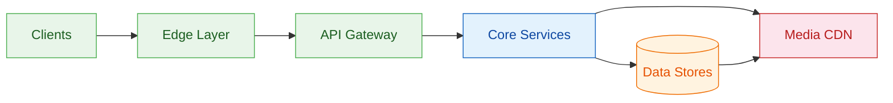
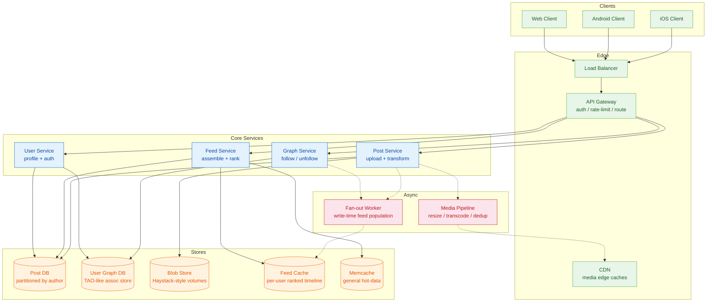
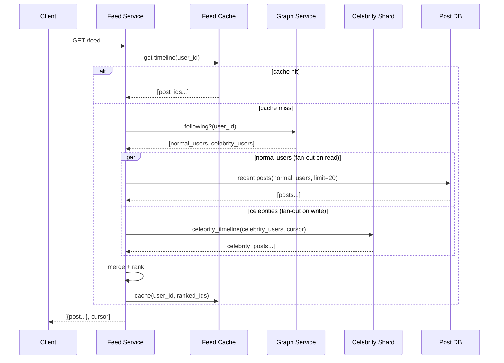
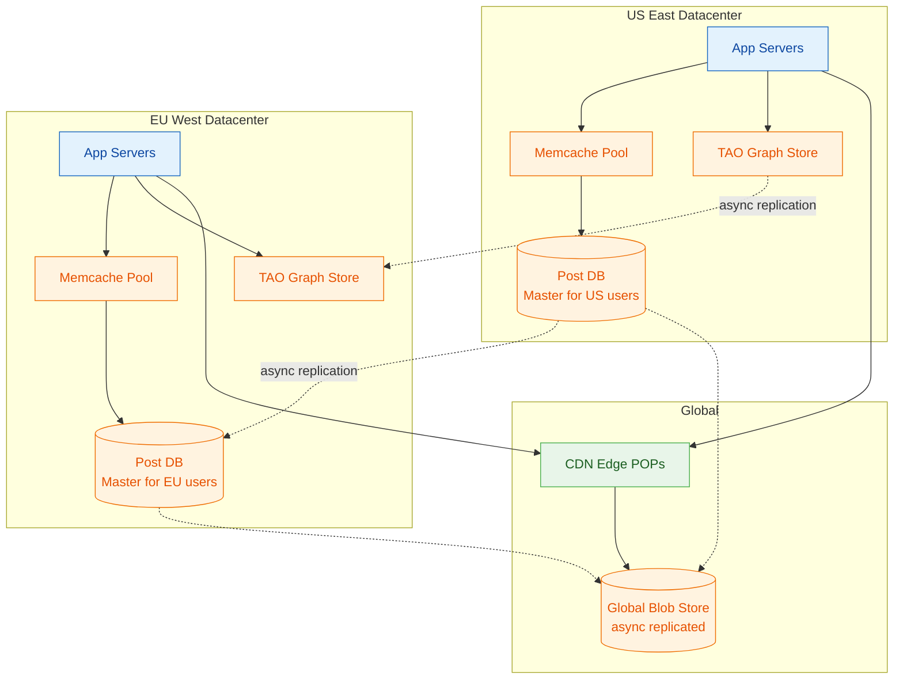

Instagram is a photo and video sharing platform where users post media, follow others, and scroll through a personalized feed.

<!--more-->

## 1. Problem

Instagram is a photo and video sharing platform where users post media, follow others, and scroll through a personalized feed. At 500 million daily active users generating 100 million posts per day, the core challenge is delivering a fresh, ranked feed from a dynamically changing follow graph — while ingesting, transforming, and serving petabytes of media with sub-second latency worldwide.



## 2. Requirements

**Functional**

- FR1: Users upload photos and videos with captions, filters, and location tags.
- FR2: Users view a ranked feed of posts from accounts they follow.
- FR3: Users follow and unfollow other accounts to build their social graph.

**Non-functional**

- NFR1: Feed loads within 200ms for the 99th percentile globally.
- NFR2: Media uploads complete within 3 seconds for images under 10MB.
- NFR3: System tolerates partition of any single datacenter without data loss.

## 3. Back of the envelope

- **Posts:** 100M/day / 86,400s ≈ 1.2K avg QPS write → peak ~3.5K QPS. Write path is light; read path dominates.
- **Feed reads:** 500M DAU × 2 sessions × 50 posts = 50B feed renders/day → ~580K QPS average, ~1.7M QPS peak. This is the system bottleneck — every user interaction is a feed read.
- **Media ingest:** 100M posts/day × 2MB avg image = 200TB/day raw → ~200PB stored over 3 years (before compression/transcoding). Storage cost dominates the media tier; throughput is secondary.
- **Graph edges:** 500M users × 300 avg followings = 150B directed edges. At ~64 bytes/edge, that's ~10TB raw — fits in memory on a moderately sized cluster if partitioned well.
- **Cache working set:** top 20% of users produce 80% of feed impressions — a ~50TB hot feed cache can absorb the bulk of read traffic.

## 4. Entities

```
-- Core user and authentication
User {
  user_id        BIGINT PRIMARY KEY    -- shard key
  username       VARCHAR(30) UNIQUE
  bio            TEXT
  profile_photo  VARCHAR(512)          -- CDN URL
  created_at     TIMESTAMP
}

-- A single piece of media content
Post {
  post_id        BIGINT PRIMARY KEY    -- shard by author_id
  author_id      BIGINT NOT NULL       -- FK → User
  media_urls     TEXT[]                -- array of CDN URLs (1-10 items)
  caption        TEXT
  location       POINT                 -- nullable geotag
  created_at     TIMESTAMP             -- secondary ordering
}

-- Follow relationship (directed edge)
Follow {
  follower_id    BIGINT                -- composite PK (follower_id, followee_id)
  followee_id    BIGINT                -- composite PK
  created_at     TIMESTAMP
}

-- Precomputed feed timeline (fan-out on write)
FeedEntry {
  owner_id       BIGINT                -- PK part 1
  post_id        BIGINT                -- PK part 2, FK → Post
  author_id      BIGINT                -- denormalized for quick render
  posted_at      TIMESTAMP             -- secondary ordering
  expires_at     TIMESTAMP             -- auto-expire after 30 days
}
```

### API

- `POST /posts` — upload media with caption and location; returns `post_id` and `media_urls`.
- `GET /feed?cursor=<opaque>&limit=<N>` — retrieve ranked feed page for the authenticated user.
- `POST /follow` — follow a user by `user_id`; idempotent.
- `DELETE /follow` — unfollow a user by `user_id`.
- `GET /users/<user_id>` — fetch profile, follower/following counts, recent posts.
- `GET /media/<media_id>` — serve a transformed media variant (thumbnail, feed-size, full-res); routed through CDN.

## 5. High-Level Design



#### FR1: Post media content

- **Components:** Post Service, Media Pipeline (async workers), Blob Store, CDN.
- **Flow:**
  1. Client uploads raw media to `POST /posts` through the API Gateway. The Post Service validates size and format.
  1. Post Service writes media bytes to the Blob Store and receives a `blob_key`. A Post row is inserted into Post DB with `status = PROCESSING`.
  1. Asynchronously, the Media Pipeline picks up the pending post and runs transcoding (resize to thumbnail, feed-standard, and full-resolution variants; transcode video to H.264/H.265 at multiple bitrates).
  1. Transformed variants are pushed to CDN origin servers. The CDN pulls and caches at edge POPs worldwide.
  1. Pipeline updates Post DB: `media_urls = [...]`, `status = READY`.
  1. On next client poll, the upload confirmation delivers the final CDN URLs.
- **Design consideration:** The write path is synchronous only until blob persistence (step 2). Everything else is async — the user sees a placeholder or progress bar, not a spinner. This keeps upload latency bounded by blob-store write time (~100ms for an in-memory write buffer) rather than transcode time (seconds for video).

#### FR2: View feed

- **Components:** Feed Service, Feed Cache, Fan-out Worker, Memcache, Graph Service.
- **Flow:**
  1. Client requests `GET /feed?cursor=X&limit=20`. API Gateway forwards to Feed Service.
  1. Feed Service checks Feed Cache for the user's precomputed timeline. If hit and fresh (TTL < 60s), return the page directly — this handles ~95% of requests.
  1. On cache miss, Feed Service queries the Graph Service for IDs the user follows, then fetches recent posts from Post DB (or Memcache) and applies the ranking model.
  1. Ranked post IDs are written back to Feed Cache for subsequent requests.
  1. Results are returned as JSON with an opaque cursor (encoded `(rank_score, post_id)`) for stable pagination.
- **Design consideration:** Hybrid fan-out is the core architectural decision. Fan-out on write gives sub-millisecond feed reads for the common case but wastes compute for inactive followers. Fan-out on read wastes nothing but hits the DB for every request. The hybrid: write-fan-out for celebrities (whose posts must land fast for millions), read-fan-out for normal users (whose ~300 followers each generate negligible DB load). The threshold for "many followers" is configurable — typically >10K followers triggers fan-out on write; below that, fan-out on read (query Post DB at request time) is cheaper.

> [!TIP]
> Key insight: The celebrity threshold (10K followers) balances two forces — the cost of writing to N feed caches vs the cost of N followers each hitting Post DB on read. At 10K followers, fan-out on write costs ~10K cache writes per post; fan-out on read would cost ~10K DB reads over the post's lifetime. Cache writes are ~10x cheaper than DB reads, so the threshold can be surprisingly low — roughly where the follower count exceeds the cache-to-DB cost ratio.

#### FR3: Build social graph

- **Components:** Graph Service, User Graph DB (TAO-like association store), Fan-out Worker.
- **Flow:**
  1. Client sends `POST /follow` with the target `user_id`. Graph Service validates both users exist.
  1. Graph Service writes a `Follow` edge to the User Graph DB: `(follower_id, followee_id, timestamp)`. Writes are synchronous to the local datacenter's association store.
  1. Counter updates (follower count, following count) are applied asynchronously via an eventually-consistent increment.
  1. The Fan-out Worker is signaled to backfill the new follower's Feed Cache with recent posts from the newly followed user (last ~50 posts), so the feed doesn't start empty.
- **Design consideration:** The graph store uses an association-centric model — edges are first-class objects, not rows in a join table. This emerges from the access pattern: "who does user X follow?" (outbound query) and "who follows user X?" (inbound query, needed for fan-out on write) are equally common. A TAO-style store keeps both directions in a single write and serves either in one cache-friendly lookup. Each edge is ~64 bytes including both IDs and a timestamp — 150B edges fit in ~10TB, or ~1.5TB after partitioning across 10 shards, small enough for RAM residency.

## 6. Deep dives

### DD1: Feed generation

**Problem.** A naive fan-out on read — query every followee's posts, merge, sort — hits the Post DB with `O(following_count * posts_per_user)` queries per feed request. At 500M DAU averaging 300 followings, that's ~150B DB queries per feed refresh cycle, utterly unsustainable. Fan-out on write eliminates the read query but generates `O(followers_count)` cache writes per post — catastrophic for celebrities with 100M+ followers where a single post triggers 100M writes. Neither extreme works alone.

**Approach 1: Fan-out on read (pull-based)**

The Feed Service queries the Graph Service for the user's followee list, then fetches the most recent N posts from each followee's Post DB partition, merges, ranks, and returns.

- **Pro:** Zero write amplification — a post costs exactly one DB write regardless of follower count. No wasted work for inactive users.
- **Con:** Every feed read performs `following_count` DB queries. At 500M DAU × 300 followings, that's 150B queries per read cycle. Even with aggressive caching, the fan-out multiplies request volume by 300x. Latency is bounded by the slowest of 300 parallel DB fetches (tail latency dominates).

**Approach 2: Fan-out on write (push-based)**

On `POST /posts`, a Fan-out Worker inserts an entry into every follower's Feed Cache timeline — one cache write per follower.

- **Pro:** Feed reads become a single cache lookup. The read path is O(1) and blazing fast — exactly what a user-facing feed needs.
- **Con:** Write amplification is `followers_count`. A user with 100M followers triggers 100M cache writes per post. The write path becomes the bottleneck, and most of those writes land in caches for users who won't log in for days (wasted compute and storage).

**Approach 3: Hybrid fan-out (selective push)**

Use a follower-count threshold. Users with fewer than T followers (T ≈ 10K) use fan-out on read — their posts are cheap to pull. Users with more than T followers use fan-out on write — their posts are pushed to follower caches to avoid the read-path fan-out explosion.

- **Pro:** Bounds both write amplification (max T cache writes per celebrity post if only active followers are pushed, or use a separate celebrity feed shard) and read amplification (the common-case user with 300 followings does at most 300 cheap cached reads, and celebrity content is pre-loaded).
- **Con:** The threshold T is a tuning parameter sensitive to the follower distribution. If the distribution shifts (e.g. a platform-wide trend toward larger follow graphs), T must be recalibrated. Celebrity posts still generate significant write fan-out — mitigated by pushing to a shared "celebrity timeline" cache shard that all their followers read from, rather than N individual caches.

**Decision:** Hybrid fan-out with per-follower push for celebrities.

> [!NOTE]
> Load-bearing detail: The "celebrity shard" optimization collapses the 100M-write problem. Instead of pushing a celebrity post to 100M individual Feed Cache entries, write it once to a shared celebrity timeline partition. Each follower's feed read merges their personal timeline (from the per-user Feed Cache) with the celebrity timeline for every celebrity they follow. This turns `O(followers)` writes into `O(1)` writes per celebrity post, at the cost of one extra cache read per celebrity per feed request. For a user following 5 celebrities, that's 5 extra cache reads — negligible.

**Edge cases:**

- **New user, empty feed:** The Feed Service falls back to a curated "explore" pool (popular posts from the last hour) until the user follows at least N accounts
- **Inactive follower:** Fan-out on write still pushes to their Feed Cache. A TTL of 30 days auto-evicts entries for users who haven't logged in, reclaiming space without explicit cleanup jobs
- **Unfollow during feed scroll:** The cursor-based pagination includes `posted_at` — posts from unfollowed users simply age out of the cursor window. No transactional coordination needed between unfollow and feed serving
- **Ranking model update:** Feed Cache entries store the raw `(post_id, posted_at)` — the ranking score is computed at read time by the Feed Service. This decouples model updates from cache invalidation; a new model takes effect immediately on the next feed read without rewriting billions of cache entries



### DD2: Media upload and serving

**Problem.** At 100M posts/day with an average of 2MB per image (and growing as phone cameras improve), the system ingests ~200TB of raw media daily. Storing the original file is straightforward; the challenge is that a single upload must be served in multiple resolutions (thumbnail, feed-standard, full-res) to different clients (iOS, Android, web) with varying viewport sizes and network conditions. On-the-fly resizing at request time is too expensive at CDN edge scale — it must happen once, at upload time.

**Approach 1: Single-resolution store, on-the-fly resize**

Store one high-resolution original. Every CDN edge request triggers an image-resize operation via a transformation service (e.g., imgproxy sitting behind the CDN).

- **Pro:** No storage duplication. Adding a new resolution variant is a config change, not a backfill.
- **Con:** Every CDN miss cascades into a CPU-bound resize at the origin. At 580K QPS feed reads with ~3 images per feed post, that's ~1.7M image serves per second peak. If even 5% miss the CDN cache, the origin resize fleet must handle 85K resizes/second — thousands of CPU cores burning on a solved problem. Resize latency adds 50-200ms to the first uncached request for every new resolution variant.

**Approach 2: Pre-transcode to a fixed variant set**

On upload, the Media Pipeline produces exactly the variants the product needs: thumbnail (150x150), feed (1080px wide), full-res (original). Store all three in the Blob Store and push their URLs to the CDN.

- **Pro:** CDN edge serves are pure file transfers — zero CPU at the origin on cache miss. Deterministic latency. Storage overhead is known and bounded.
- **Con:** Storage multiplication: 3 variants × 2MB avg = ~6MB/post = 600TB/day raw. Adding a new variant (e.g., a 4K feed variant for high-DPI displays) requires re-processing the entire back catalog — an offline batch job over exabytes of data.

**Approach 3: Layered encoding with progressive delivery**

Store one master file per image in a format that supports progressive decoding (e.g., JPEG 2000, HEIF, or a custom tiled pyramid). The CDN serves byte-range requests — the client requests only the header + resolution level it needs, pulling more data as the user zooms or scrolls.

- **Pro:** Single stored file, zero variant management, bandwidth proportional to viewport. The "variant explosion" problem (thumbnail × feed × full × 3 device pixel ratios × 2 color profiles = 18 variants) disappears.
- **Con:** Requires client-side decoder support (HEIF is well-supported on iOS/Android, less so on web). CDN must support byte-range serving with intelligent caching (range requests can fragment cache efficiency). Encoding is more CPU-intensive than a simple resize.

**Decision:** Pre-transcode to a fixed variant set, backed by a Haystack-style Blob Store.

> [!TIP]
> Why not on-the-fly resizing? The math is brutal. 100M posts/day × 3 variants × 200ms resize time = 6M CPU-seconds/day just for the first serve of each variant. Compare to pre-transcoding at upload time: the same 6M CPU-seconds spread evenly across the day (~70 cores continuously), but the CDN serves every subsequent request in <10ms of file I/O. The upload path can absorb CPU cost; the read path cannot.

**Media Pipeline architecture:**

1. **Ingest:** Post Service receives the upload, validates MIME type and size (<100MB), writes raw bytes to the Blob Store with key `raw/{post_id}`, returns `post_id` to the client.
1. **Dedup:** Before transcoding, hash the raw bytes (SHA-256). If the hash matches an existing blob, reuse the existing variants — skip steps 3-4. This is surprisingly effective for re-shared memes, screenshots, and viral content.
1. **Transcode queue:** A Kafka topic partitions work by `post_id`. Worker pool pulls jobs, runs FFmpeg/ImageMagick to produce thumbnail, feed, and full-res variants. Each variant writes to `variant/{post_id}/{resolution}` in the Blob Store.
1. **CDN pre-warm:** On completion, the worker pushes variant URLs to CDN origin with a pre-warm hint (HTTP PURGE + GET) so edge POPs likely to serve this content (geolocated near the author's followers) have it cached before the first request.
1. **Status update:** Post DB `status` field flips to `READY`, `media_urls` populated.

**Blob Store (Haystack-style):**

Each physical volume is an append-only file (~100GB) on a commodity disk. A needle — the storage unit — has a header (key, size, flags), the data bytes, and a footer (checksum). Deletes are soft (flag flip); compaction runs offline, copying live needles to a new volume and freeing the old one. The in-memory index maps `blob_key → (volume_id, offset, size)` and fits entirely in RAM: 100M posts/day × 3 variants × 365 days × 3 years ≈ 330B needles × ~64 bytes/index entry ≈ 21GB — trivial for a single machine.

> [!WARNING]
> Cost/caveat: Append-only writes are fast (sequential disk I/O) but compaction doubles storage temporarily during the copy phase. At 200PB of stored media, a full compaction cycle needs 200PB of spare capacity. In practice, volumes are compacted incrementally — only volumes with >30% deleted needles are compacted — keeping the spare-capacity overhead manageable at ~15-20% of total storage.

### DD3: Scalability at 500M DAU

**Problem.** The core data structures — user graph (150B edges), post index (billions of rows), and feed cache (trillions of entries) — must be served with single-digit millisecond latency under 1.7M QPS peak read load while accepting 3.5K QPS peak writes. A single-node database collapses under either volume or throughput. The system must partition data, route requests, and maintain consistency across datacenters.

**Graph store partitioning (TAO-like model):**

The graph store models data as objects (users, posts) and associations (follow edges, likes, comments). The access pattern is overwhelmingly reads (1B reads/s at Meta-scale, ~50M reads/s at Instagram scale) with a 96%+ cache hit rate in steady state.

**Approach 1: Shard by object ID**

Each user's data lives on one shard. "Who does user X follow?" is one shard query. "Who follows user X?" requires a scatter-gather across all shards — expensive but infrequent (only needed on celebrity fan-out, not on feed reads).

**Approach 2: Shard by association**

Store each edge on the shard owned by the edge ID. Both directions require scatter-gather for list queries. Worse than Approach 1 for the dominant access pattern.

- **Decision:** Shard by object ID (user_id). The outbound query ("who do I follow?") — needed on every feed read — resolves to a single shard. The inbound query ("who follows me?") is rarer and can tolerate higher latency through parallel scatter-gather with a timeout.

**TAO cache hierarchy:**

```plain text
Client → TAO Cache (in-process, LRU, 96% hit)
       → TAO Server (in-memory assoc list, sharded)
       → MySQL (persistent, async replication)
```

The TAO cache runs in the same process as the application server, holding the hottest associations in an LRU map. At 96% hit rate, only 4% of graph queries reach the TAO server tier. The TAO server holds the complete association list for its shard in RAM (a few GB per shard) and answers in microseconds. MySQL provides durability and async replication to follower datacenters.

**Data partitioning strategy for Post DB:**

Posts are sharded by `author_id` — all of a user's posts live on the same shard. This makes "get recent posts from user X" (the fan-out-on-read path) a single-shard query. The shard key is a hash of `author_id` modulo the shard count. At Instagram scale with ~1B registered users and billions of posts, a few hundred shards (each a MySQL or Postgres instance with read replicas) is sufficient.

**Hot key / celebrity handling:**

A user with 100M followers is a hot key in three places:

1. **Post writes:** Their shard absorbs all their post writes — manageable at ~1 post/minute per celebrity, not a bottleneck.
1. **Fan-out on write:** Solved by the celebrity shard design (DD1) — write once to a shared timeline, not 100M individual caches.
1. **Profile reads:** Their profile page is read millions of times per hour. Mitigation: a dedicated read-replica pool with aggressive Memcache fronting (TTL: 30s for profile data, 5s for follower count).

**Memcache layer (pool-based architecture):**

Memcache is organized into pools by workload:

| Pool | Data | TTL | Hit rate target |
|---|---|---|---|
| Feed | Ranked post IDs per user | 60s | 95% |
| Post | Post metadata (caption, URLs) | 300s | 98% |
| User | Profile info, follower count | 30s (hot), 300s (cold) | 99% |
| Graph | Following list per user | 120s | 96% |

The pool separation prevents a spike in one workload from evicting data needed by another. Each pool is independently sized and scaled — Feed cache needs the most capacity (~50TB), User cache is small but needs the lowest latency for auth-critical paths.

**Multi-datacenter consistency:**

Each datacenter runs the full stack independently — Post DB shards, Graph Store, Memcache pools, and Blob Store. Writes go to a single "master" datacenter per user (based on user geography). Reads are served from the nearest datacenter. The replication lag (typically <100ms for MySQL async replication) means a user in Europe might not see a post from a US-based followee for ~100ms after it's published — acceptable for a feed, intolerable for consistency-critical operations like password changes (those are routed to the master).

> [!NOTE]
> Load-bearing detail: Memcache leases prevent the "thundering herd" on cache misses. When a key expires and 100 concurrent requests all miss simultaneously, only the first request is allowed to recompute the value; the other 99 receive a short-lived "lease" token and retry after a few milliseconds. Without leases, 100 concurrent DB queries for the same data would spike the DB and cascade into a failure. The lease mechanism is a small state machine per key (a 64-bit token + TTL) — cheap enough to enforce on every cache miss.



## 7. References

1. Beaver, D. et al. ["Finding a Needle in Haystack: Facebook’s Photo Storage"](https://www.usenix.org/legacy/event/osdi10/tech/full_papers/Beaver.pdf). OSDI 2010.
1. Bronson, N. et al. ["TAO: Facebook’s Distributed Data Store for the Social Graph"](https://www.usenix.org/system/files/conference/atc13/atc13-bronson.pdf). USENIX ATC 2013.
1. Nishtala, R. et al. ["Scaling Memcache at Facebook"](https://www.usenix.org/system/files/conference/nsdi13/nsdi13-final170_update.pdf). NSDI 2013.
1. Kleppmann, M. [Designing Data-Intensive Applications](https://dataintensive.net/). O’Reilly Media, 2017. Chapters 5–7 (replication, partitioning, transactions).
1. Instagram Engineering Blog. ["Storing hundreds of millions of photos"](https://instagram-engineering.com/).
