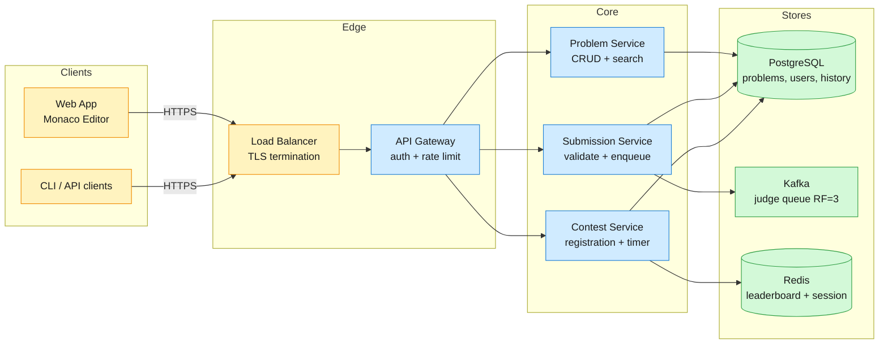
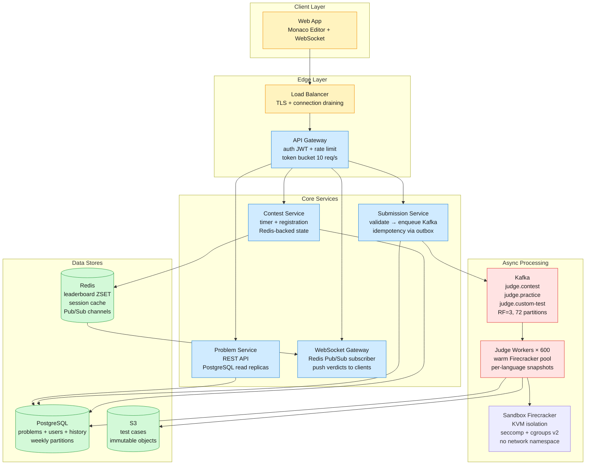

LeetCode serves ~300,000 registered users who practice coding on ~4,000 problems across 20+ languages. The platform also hosts weekly coding competitions drawing 100,000 concurrent contestants — a 30× traffic spike over baseline that lands in the first 60 seconds.

<!--more-->

## 1. Problem

LeetCode serves ~300,000 registered users who practice coding on ~4,000 problems across 20+ languages. The platform also hosts weekly coding competitions drawing 100,000 concurrent contestants — a 30× traffic spike over baseline that lands in the first 60 seconds. The hard part is running untrusted user code inside a secure sandbox, at scale, returning a verdict (pass/fail/runtime) within 5 seconds, while keeping contest scoring fair regardless of queue depth.



---

## 2. Requirements

**Functional**

- FR1: Browse and search ~4,000 problems by difficulty, tags, and acceptance rate.
- FR2: View problem description, examples, constraints, and language-specific code stubs.
- FR3: Submit solution in 20+ languages; receive verdict within 5 seconds.
- FR4: Join timed coding contests; submit solutions under contest rules with live standings.
- FR5: View per-contest leaderboard ranked by problems solved then total penalty time.
- FR6: Browse personal submission history with verdict, runtime, memory, and timestamp.

**Non-functional**

- NFR1: Untrusted code must run in full kernel isolation with zero host access.
- NFR2: p95 submission-to-verdict latency ≤ 5 seconds at steady state.
- NFR3: Handle 100K concurrent contestants at 200+ submissions/sec burst.
- NFR4: Contest scoring uses server-side submission timestamp; queue wait never penalizes rank.

*Out of scope: social features (discussion forums, user profiles, badges), plagiarism detection, paid subscription tiers, interview/assessment platform, IDE integration beyond Monaco Editor.*

---

## 3. Back of the envelope

- **Peak submission rate:** 100K contestants × 2 submissions/min ÷ 60s ≈ 3,333 submissions/sec burst at contest open.
- **Daily submission storage:** 50M submissions/day × 2 KB (source + verdict + metadata) = 100 GB/day → 90-day hot partition requires 9 TB; older data moves to cold S3 storage. Weekly partitioning by `submitted_at` keeps index scans tight.
- **Leaderboard memory:** 100K entries × (8B user_id + 8B score + 48B overhead) ≈ 6.4 MB per contest → a single Redis ZSET handles any contest size in under 10 MB; no sharding needed.

- ---

## 4. Entities

```
User {
  user_id:       uuid PK
  username:      string
  email:         string
  password_hash: string
  rating:        integer
  created_at:    timestamp
}

Problem {
  problem_id:        uuid PK
  title:             string
  description:       text
  difficulty:        enum       ← easy / medium / hard
  tags:              text[]     ← array of tag strings
  code_stubs:        jsonb      ← {"python":"def solve():","cpp":"#include..."}
  test_cases_s3_key: string     ← S3 object key for full test suite
  created_at:        timestamp
}

Submission {
  submission_id: uuid PK
  user_id:       uuid FK
  problem_id:    uuid FK
  contest_id:    uuid? FK
  language:      string
  source_code:   text
  verdict:       enum       ← queued / running / AC / WA / TLE / MLE / RE / CE
  runtime_ms:    integer    ← measured execution time
  memory_kb:     integer    ← measured peak memory
  submitted_at:  timestamp  ← server timestamp, used for contest scoring
  completed_at:  timestamp
}

Contest {
  contest_id:  uuid PK
  title:       string
  starts_at:   timestamp
  ends_at:     timestamp
  problem_ids: uuid[]     ← ordered list of contest problem IDs
}

ContestParticipation {
  user_id:       uuid PK FK
  contest_id:    uuid PK FK
  registered_at: timestamp
  score:         integer     ← problems_solved * 10^9 - penalty_seconds
  rank:          integer     ← denormalized after contest ends
}
```

### API

- `GET /problems?page=1&limit=100&difficulty=medium&tags=dp` — list problems with filtering and pagination.
- `GET /problems/{problem_id}?language=python3` — full problem detail with language-specific code stub.
- `POST /submissions` — submit code; body `{problem_id, language, source_code, contest_id?}`; returns `202` with `submission_id` and `queued` status.
- `GET /submissions/{submission_id}` — poll verdict status; returns `{verdict, runtime_ms, memory_kb, passed_tc, total_tc}`.
- `GET /contests/{contest_id}/leaderboard?page=1&limit=100` — paginated live leaderboard sorted by score descending.
- `POST /contests/{contest_id}/register` — register for an upcoming contest; idempotent.
- `WS /submissions/{submission_id}/updates` — WebSocket push for verdict notification; client connects after `POST /submissions` to receive verdict without polling.

---

## 5. High-Level Design



#### FR1: Browse and search problems

**Components:** Web Client → API Gateway → Problem Service → PostgreSQL read replicas.

**Flow:**

1. Client calls `GET /problems?page=1&limit=100&difficulty=medium&tags=dp`.
1. API Gateway validates JWT and rate limit (10 req/s per user).
1. Problem Service queries PostgreSQL read replica with GIN index on `tags` array column.
1. Response includes `{problems: [...], total: 4000, page: 1, pages: 40}`.

Read replicas handle browse traffic (99% of requests, <10ms p99). The `tags TEXT[]` column with a GIN index avoids a join table for tag filtering — given ~4,000 problems, even a full table scan completes in <1ms. No need for Elasticsearch at this corpus size.

```sql
SELECT problem_id, title, difficulty, tags, acceptance_rate
FROM problems
WHERE difficulty = 'medium' AND tags @> ARRAY['dp']
ORDER BY problem_id
LIMIT 100 OFFSET 0;
```

---

#### FR2: View problem detail with code stub

**Components:** Web Client → API Gateway → Problem Service → PostgreSQL + S3.

**Flow:**

1. Client calls `GET /problems/{problem_id}?language=python3`.
1. Problem Service fetches problem metadata (title, description, constraints, examples) from PostgreSQL.
1. Code stub extracted from `code_stubs` JSONB column: `code_stubs->>'python3'`.
1. Full test cases remain in S3; only stub and metadata returned to client.
1. Monaco Editor renders the stub in-browser with syntax highlighting.

`code_stubs` stored as a single JSONB column rather than a separate `code_stubs` table avoids a JOIN on the hottest read path. The JSONB payload is ~2-5 KB per problem across all languages — well under PostgreSQL's 1 GB per-row limit and cacheable in `pg_prewarm`.

```json
// code_stubs JSONB column value
{
  "python3": "class Solution:\n    def solve(self, nums: List[int]) -> int:\n        ",
  "cpp": "class Solution {\npublic:\n    int solve(vector<int>& nums) {\n        \n    }\n};",
  "java": "class Solution {\n    public int solve(int[] nums) {\n        \n    }\n}"
}
```

---

#### FR3: Submit solution and receive verdict

**Components:** Web Client → API Gateway → Submission Service → PostgreSQL + Kafka → Judge Worker → Firecracker Sandbox → S3 (test cases) → PostgreSQL (result) → WebSocket Gateway → Client.

**Flow:**

1. Client `POST /submissions` with `{problem_id, language, source_code, contest_id?}`.
1. Submission Service validates: problem exists, language supported, rate limit (1 per 5s outside contest).
1. Inserts the `submission` row (verdict=`queued`) **and an outbox row in the same DB transaction** (transactional outbox pattern); a separate relay publishes to Kafka asynchronously.
1. Returns `202 {submission_id, status: "queued"}` — client opens `WS /submissions/{submission_id}/updates`.
1. Judge Worker reads from Kafka partition keyed by `user_id` (maintains per-user ordering).
1. Worker acquires warm Firecracker snapshot for target language (~25ms restore).
1. Worker writes source code to `/code/solution` inside VM, invokes compiler/interpreter.
1. Test cases fetched from local SSD cache (first miss → S3, then cached for problem lifetime).
1. Each test case: pipe input to stdin, capture stdout, compare with expected; stop on first WA (fail-fast).
1. Worker writes final verdict to PostgreSQL and publishes to Redis `submission:{id}:result` channel.
1. WebSocket Gateway subscribed to Redis channel pushes verdict to connected client.
1. Worker resets VM via diff snapshot (~5ms); VM returns to warm pool.

Submission service uses the **transactional outbox pattern** — `INSERT submission` and `INSERT outbox_event` commit in one PostgreSQL transaction, so the event is captured atomically with the write (Kafka is **not** part of the DB transaction — it can't be rolled back). A background outbox relay then reads unpublished outbox rows and produces them to Kafka with **at-least-once** semantics, marking each row published; if a produce ack is lost, the next poll re-publishes (consumers dedupe by `submission_id`). Judge Workers are idempotent: if they see a `submission_id` that already has a non-`queued` verdict, they skip execution.

```python
# Submission Service — transactional outbox
def submit(user_id, problem_id, language, source_code, contest_id=None):
    submission_id = uuid4()
    now = utcnow()
    with db.transaction():
        db.execute("""
            INSERT INTO submissions (submission_id, user_id, problem_id, language,
                source_code, verdict, submitted_at, contest_id)
            VALUES (%s, %s, %s, %s, %s, 'queued', %s, %s)
        """, (submission_id, user_id, problem_id, language, source_code, now, contest_id))
        db.execute("""
            INSERT INTO outbox (aggregate_id, topic, payload, created_at)
            VALUES (%s, %s, %s, %s)
        """, (submission_id, topic_for(contest_id),
              json.dumps({'submission_id': submission_id, 'language': language,
                          'problem_id': problem_id, 'submitted_at_ms': now.timestamp_ms()}),
              now))
    return submission_id
```

---

#### FR4: Join contest and submit under contest rules

**Components:** Web Client → API Gateway → Contest Service → Redis + PostgreSQL → Kafka (judge.contest topic).

**Flow:**

1. Client `POST /contests/{contest_id}/register` up to 5 minutes before contest start.
1. Contest Service inserts `ContestParticipation` row; idempotent (ON CONFLICT DO NOTHING).
1. At contest start, Redis `contest:{id}:state` set to `active`; Contest Service starts countdown timer.
1. During contest, submissions include `contest_id` — Submission Service routes to `judge.contest` Kafka topic.
1. Contest Service validates submission window: `starts_at <= now() <= ends_at`.
1. Each accepted solution triggers the Lua leaderboard update script (see FR5).
1. At contest end: `contest:{id}:state` → `finished`; no more submissions accepted. Post-contest Elo rating batch job runs.

Contest state lives in Redis with TTL matching contest end + 1 hour. The PostgreSQL `ContestParticipation` table is the source of truth for registration, but the `active`/`finished` state flag in Redis avoids a DB query on every submission's time-window check. If Redis is unavailable during a contest, the service falls back to a PostgreSQL query comparing `starts_at`/`ends_at` — slower but correct.

```sql
-- Contest window validation fallback
SELECT starts_at <= NOW() AND ends_at >= NOW() AS is_active
FROM contests WHERE contest_id = $1;
```

---

#### FR5: Live contest leaderboard

**Components:** Contest Service → Redis ZSET + Lua scripts → WebSocket Gateway → Client.

**Flow:**

1. Judge Worker determines verdict is `AC` (accepted) for a contest submission.
1. Worker calls Redis Lua script with `{contest_id, user_id, problem_index, solve_time_seconds, penalty_per_wrong_attempt}`.
1. Lua script atomically: (a) checks if problem already solved (dedup), (b) increments `problems_solved`, (c) computes penalty = solve_time + wrong_attempts × 300s, (d) encodes composite score: `score = problems_solved × 10^9 - total_penalty_seconds`, (e) `ZADD contest:{id}:leaderboard score user_id`, (f) `PUBLISH contest:{id}:updates` with new rank.
1. WebSocket Gateway subscribed to `contest:{id}:updates` broadcasts to all connected viewers.
1. Clients display updated leaderboard in-browser; `GET /contests/{contest_id}/leaderboard` available as fallback.

The composite score encoding packs a two-dimensional ranking (problems solved first, then penalty time as tie-breaker) into a single 64-bit float. With `10^9` as the problem multiplier, penalty time (max 90 min = 5,400s + wrong attempts × 300s ≤ ~15,000s) never overflows into the higher-order bits. `ZREVRANK` is O(log N) — a 100K-entry ZSET returns rank in ~40 µs.

```lua
-- Atomic leaderboard update (Redis Lua)
-- KEYS[1] = contest:<id>:leaderboard
-- KEYS[2] = contest:<id>:user:<user_id>
-- ARGV[1] = user_id, ARGV[2] = problem_idx
-- ARGV[3] = solve_time_s, ARGV[4] = penalty_s_per_wrong

local already = redis.call('HGET', KEYS[2], 'p' .. ARGV[2] .. '_ac')
if already == '1' then return nil end  -- already solved, ignore re-submit

redis.call('HSET', KEYS[2], 'p' .. ARGV[2] .. '_ac', '1',
                              'p' .. ARGV[2] .. '_time', ARGV[3])
local wrong = tonumber(redis.call('HGET', KEYS[2], 'p' .. ARGV[2] .. '_wrong') or '0')
local solved = redis.call('HINCRBY', KEYS[2], 'solved', 1)
local penalty = tonumber(ARGV[3]) + (wrong * tonumber(ARGV[4]))
local total_penalty = tonumber(redis.call('HGET', KEYS[2], 'penalty') or '0') + penalty
redis.call('HSET', KEYS[2], 'penalty', total_penalty)

local score = solved * 1000000000 - total_penalty
redis.call('ZADD', KEYS[1], score, ARGV[1])

local rank = redis.call('ZREVRANK', KEYS[1], ARGV[1])
local channel = KEYS[1]:gsub(':leaderboard$', ':updates')  -- contest:{id}:updates
redis.call('PUBLISH', channel,
    cjson.encode({user_id=ARGV[1], rank=rank+1, solved=solved, penalty=total_penalty}))
return rank + 1
```

---

#### FR6: Browse submission history

**Components:** Web Client → API Gateway → Submission Service → PostgreSQL.

**Flow:**

1. Client calls `GET /submissions?user_id={id}&problem_id={id}&page=1&limit=50`.
1. Submission Service queries PostgreSQL with composite index on `(user_id, submitted_at DESC)`.
1. Response includes `{submissions: [{submission_id, problem_title, verdict, runtime_ms, memory_kb, submitted_at}, ...], total, page}`.
1. Problem titles resolved via JOIN on `problem_id` — cached in application-layer LRU for hot problem IDs.

Submissions table uses weekly range partitioning on `submitted_at`. Hot queries (last 7 days) hit a single partition; cold queries (older than 90 days) hit an S3-backed foreign table via `postgres_fdw` or are archived entirely. Partition pruning keeps index scans narrow regardless of total table size.

```sql
CREATE TABLE submissions (
    submission_id UUID NOT NULL,
    user_id UUID NOT NULL,
    submitted_at TIMESTAMP NOT NULL,
    ...
) PARTITION BY RANGE (submitted_at);

CREATE TABLE submissions_2026_w27
    PARTITION OF submissions
    FOR VALUES FROM ('2026-06-29') TO ('2026-07-06');
```

---

## 6. Deep dives

### DD1: Secure code execution

Execute untrusted user code in any of 20+ languages while guaranteeing zero host compromise, zero data exfiltration, and sub-400ms cold-start latency per submission. The sandbox must survive adversarial payloads — `os.system("rm -rf /")`, `/proc/self/mem` writes, fork bombs, kernel exploits — and recover to a clean state in under 10ms for the next submission.

**Approach 1: Docker container with seccomp + cgroups**

Run each submission in a throwaway Docker container with a seccomp-BPF profile restricting syscalls to a ~30-call allowlist (read, write, mmap, brk, futex, exit, etc.), cgroups v2 capping memory at 256 MB and CPU at 5 seconds, an empty network namespace, and a read-only root filesystem with a per-submission tmpfs mounted at `/code`.

```javascript
docker run --rm \
  --security-opt seccomp=judge-profile.json \
  --memory=256m --cpus=1 \
  --network=none \
  --read-only --tmpfs /code:rw,noexec,nosuid,size=64m \
  --pids-limit=32 \
  judge-python:3.12 python3 /code/solution.py < /code/input.txt
```

**Pro:** Cold start ~300ms — faster than gVisor or Firecracker cold paths. Docker ecosystem is familiar and tooling is mature. **Con:** Shared host kernel means a kernel CVE compromises all containers on that host. Docker's default seccomp profile allows ~300 syscalls — you must manually craft a tight profile per language. CVE-2024-28185 (Judge0, CVSS 10.0) exploited exactly this: a symlink from inside the sandbox to `/etc/passwd` followed by the host run script.

**Approach 2: gVisor (user-space kernel)**

Run each submission in a gVisor sandbox (`runsc`). gVisor implements the Linux syscall interface in user-space Go (Sentry), intercepting ~200 syscalls without passing them to the host kernel. A second process (Gofer) proxies file I/O over 9P.

**Pro:** Stronger isolation than Docker — no shared kernel attack surface. Syscall emulation catches raw syscall invocations that bypass seccomp. **Con:** Syscall compatibility at ~95% — some language runtimes hit unimplemented edge cases (e.g., Java 17+ virtual threads use `futex` with `FUTEX_WAIT_MULTIPLE`). 10-30% performance overhead for compute-bound workloads. Cold start ~400ms.

**Approach 3: Firecracker microVM**

Spin up a dedicated Firecracker microVM per submission. Each VM boots its own Linux kernel (KVM hardware virtualization), has its own memory space, and communicates with the host only over a virtio-vsock. After execution, restore a base snapshot (25ms) and diff-snapshot reset (5ms).

```javascript
# Cold start: boot kernel + init
firecracker --api-sock /tmp/fc-{id}.sock --config vm-config.json
# ~125ms to kernel boot, ~400ms total with language runtime init
# Warm restore from snapshot: ~25ms
curl --unix-socket /tmp/fc-{id}.sock -X PUT \
  -H 'Content-Type: application/json' \
  -d '{"snapshot_path": "python3-base/vmstate", "mem_file_path": "python3-base/mem"}'
```

**Pro:** True hardware virtualization — KVM isolation means a kernel zero-day cannot escape to the host. Diff snapshots enable 5ms reset regardless of submission memory footprint. **Con:** Operational complexity — requires KVM support, snapshot lifecycle management, and per-language base snapshots. Memory overhead ~35 MB per VM, ~40× more than a Docker container.

**Decision — layered defense.**

Don't pick one. Stack them:

1. **Outer layer: Firecracker microVM** — KVM isolation ensures kernel compromise is contained to that VM. Even a zero-day kernel exploit cannot escape KVM.
1. **Middle layer: seccomp-BPF** — Restricts syscalls even inside the VM. A kernel exploit that does escape KVM (theoretical) still faces a ~30-syscall whitelist — `socket`, `mount`, `reboot`, `ptrace`, and `init_module` are all blocked.
1. **Inner layer: cgroups v2** — Memory cap, CPU time cap, process count cap. Defeats fork bombs (`pids.max = 32`) and memory exhaustion attacks. Cgroup enforcement is per-VM, so runaway memory in one submission doesn't impact peers on the same host.

Each layer assumes the one above it has failed. The KVM boundary is the primary isolation guarantee; seccomp and cgroups are cheap defense-in-depth — they cost nothing in latency and block entire classes of nuisance attacks before they reach the kernel.

**Rationale.** AWS Lambda and Fargate run millions of concurrent tenant workloads on Firecracker — it has a 6-year production track record at trillions of invocations. Docker's shared-kernel model is the root cause behind Judge0 CVE-2024-28185 and numerous CTF escapes. For a platform accepting untrusted code from 300K users, shared-kernel isolation is insufficient — the blast radius of a single escape (all submissions on that host) is unacceptable. Firecracker's 125ms boot + 25ms warm restore is within the 5-second verdict target even at peak load.

> [!TIP]
> Per-language warm pool sizing: At 600 concurrent workers, maintaining 60 warm Python snapshots, 50 Java, 60 C++, and 40 JavaScript snapshots costs ~7 GB of RAM total (35 MB × 210 snapshots) — trivially affordable on a few `c5.metal` instances. Snapshots are replenished continuously by a background goroutine that calls `firecracker`'s snapshot API; if a worker acquires and the pool is empty, it falls back to a ~400ms cold start.

**Edge cases:** Submissions that exhaust the 5-second CPU limit trigger `SIGXCPU` from the cgroup CPU controller — the VM's init process catches this and writes `TLE` to the result channel before the VM is killed. Submissions that exceed 256 MB memory get OOM-killed by cgroup memory controller → `MLE`. Both cases produce a clean verdict, not a crashed worker.

---

### DD2: Live competition leaderboard

A contest with 100K participants needs a live leaderboard updated within 1 second of each accepted submission. A SQL `SELECT COUNT(*) FROM submissions WHERE contest_id=X AND score > Y` to compute rank takes O(N) — 100K rows scanned per accepted-submission event (potentially 200K scans during the contest). At 5 accepted submissions/second, that's 500K sequential scans against the submissions table. Unacceptable.

**Approach 1: Redis Sorted Set with composite score encoding**

Store all contest participants in a single Redis ZSET: `ZADD contest:{id}:leaderboard score user_id`. Score is a single float encoding `(problems_solved, total_penalty_seconds)`: `score = problems_solved * 10^9 - total_penalty`. ZREVRANK is O(log N) ≈ 40 µs for 100K entries.

**Pro:** Single Redis instance handles reads and writes in microseconds. Lua scripts guarantee atomic read-modify-write. **Con:** Single Redis instance is a SPOF during contest. ZSET with 100K entries is 6.4 MB — fits entirely in Redis memory with no eviction risk.

**Approach 2: Application-level leaderboard cache**

Maintain a sorted array of `(user_id, problems_solved, penalty)` in application memory on the Contest Service. After each accepted submission, do a binary-search insert and recompute ranks for affected users.

```javascript
# Binary-search insert in sorted list
pos = bisect_right(leaderboard, (new_score, user_id))
leaderboard.insert(pos, Entry(user_id, solved, penalty))
# Ranks shift for all entries after pos — O(N) update in worst case
```

**Pro:** No external dependency — pure in-memory. **Con:** The sorted-array update is O(N) for rank shifts. At 100K entries, inserting at position 0 shifts 100K entries — ~2ms in a tight C implementation, but fragile under concurrent updates (require a mutex, which serializes leaderboard updates). Not worth it when Redis gives atomicity for free.

**Decision — Redis ZSET with Lua atomicity.**

Use a single Redis instance per active contest. The Lua script runs atomically — no other client can interleave a ZADD between our HGET (duplicate check) and ZADD (write), eliminating the "lost update" race. Redis is not the source of truth (PostgreSQL `ContestParticipation` is) — if Redis is lost mid-contest, rebuild it from PostgreSQL submissions in ~5 seconds.

**Rationale.** Redis ZSET operations are O(log N) because of the underlying skip list — each node stores span counts. ZREVRANK on 100K entries touches ~17 nodes (log₂ 100K). SQL `COUNT(*) WHERE score > X` must scan the index, but MySQL/PostgreSQL don't maintain prefix counts in B-trees the way skip lists maintain span counts. The skip list is the right data structure; Redis's implementation is battle-tested at this scale.

> [!TIP]
> Tie-breaking: Two users with identical (problems solved, penalty) get different ZSET scores via fractional tie-breaking: `score = solved * 10^9 - penalty + (1.0 / (hash(user_id) % 10000 + 1))`. This ensures strict ordering without changing rank order — the adjusted score stays within `[solved*10^9 - penalty, solved*10^9 - penalty + 1)`.

**Edge cases:** A user resubmits an already-solved problem — the Lua script's `HGET` check catches this and returns `nil` (no update). A user disconnects from WebSocket mid-contest — the leaderboard page polls `GET /contests/{id}/leaderboard` every 5 seconds as fallback. Redis runs out of memory (unlikely at 6.4 MB/contest, but possible with many simultaneous contests) — eviction policy is `noeviction`; leaderboard writes fail, Contest Service detects the error and pages on-call.

---

### DD3: Competition traffic scaling

At contest start, 100K concurrent users produce 200+ submissions/sec in a burst lasting ~60 seconds. Steady-state practice traffic is 30 submissions/sec. The worker pool must scale from baseline to 6× capacity in under 60 seconds, process the burst without queuing delays exceeding the 5-second verdict target, and scale back down post-burst without losing in-flight submissions.

**Approach 1: Reactive autoscaling (Kubernetes HPA)**

Scale judge worker pods based on CPU/memory utilization or custom metrics (Kafka consumer lag). HPA checks every 15 seconds, adds pods, waits for node provisioning (60-120s for new EC2 instances), then pods become ready.

**Pro:** Zero manual intervention — fully automated. Works for gradual traffic changes. **Con:** The 60-120s node provisioning window means the burst is over before new capacity arrives. Kafka consumer lag spikes to 5,000+ messages; queue wait dominates verdict latency. Losing the first 2 minutes of a 90-minute contest to cold scale-up means contestants receive verdicts 60-90s after submitting, not the promised 5s.

**Approach 2: Scheduled pre-warming**

15 minutes before contest start, a cron job scales the worker deployment to maximum capacity regardless of current queue depth. Workers sit idle consuming from `judge.contest` with `prefetch=1`. When the burst hits, every worker is already running with warm Firecracker snapshots loaded.

```javascript
# Pre-scale 15 min before contest
kubectl scale deployment judge-worker --replicas=600  # 600 × 16 slots = 9,600 concurrent capacity

# Post-contest scale-down (graceful, drain in-flight)
kubectl scale deployment judge-worker --replicas=80   # baseline
```

**Pro:** Zero cold-start penalty during the burst — workers are ready before the first submission arrives. **Con:** Idle workers cost money — 520 idle workers × 15 min pre-warm × 2 contests/week = 260 worker-hours/week of idle time. At ~$0.05/worker-hour (spot instances), that's $13/week — negligible against the cost of a bad contest experience.

**Approach 3: Queue-depth-based autoscaling with pre-warmed nodes**

Combine scheduled pre-warming with reactive autoscaling: nodes are pre-provisioned (EC2 instances already running, no cold start) but pods scale reactively based on Kafka consumer lag. When lag >100 messages, scale up pods on pre-warm nodes (pods become ready in <5s on existing nodes vs. 60-120s on new nodes).

```javascript
# Keep nodes warm (always running, minimum pod count = 80)
# Scale pods on lag signal:
if kafka_lag('judge.contest') > 100:
    replicas = min(600, current_replicas * 1.5)
```

**Pro:** Nodes pre-provisioned → pod scale-up in seconds. Lag-based scaling handles spike shapes that scheduled pre-warming misjudges (e.g., an unusually large contest). **Con:** Pre-provisioned nodes cost money year-round, not just during contests. Slightly more complex than pure scheduled pre-warming.

**Decision — scheduled pre-warming with lag-based pod scaling.**

Pre-provision nodes 15 minutes before contest, scale pods to 30% of max (180 workers). When Kafka consumer lag on `judge.contest` exceeds 100 messages (roughly 15s of expected execution time), scale pods up by 50% every 30 seconds until either lag <100 or max capacity reached (600 workers). After contest, scale pods down to baseline (80 workers), then optionally scale down nodes after a 10-minute cooldown.

**Rationale.** Pre-provisioning nodes removes the 60-120s cold-start penalty. Lag-based pod scaling handles spike shapes that scheduled pre-warming misjudges (e.g., an unusually large contest). The 100-message lag threshold is derived from the target: at 3s avg execution time and 16 workers per pod, 100 queued messages = ~19s of expected wait — already above the 5s target, so scale immediately. This two-level approach (pre-warm nodes, scale pods reactively) costs marginally more than pure reactive but guarantees the 5-second verdict target stays intact through the burst.

> [!TIP]
> Queue depth signaling: When consumer lag on `judge.practice` exceeds 30s of expected wait, the Submission Service adds a header `X-Judge-Queue-Status: busy` to the `202` response. The frontend renders "The judge is experiencing high volume — your submission is queued and will be processed shortly." This prevents resubmission loops that worsen the spike. Contest submissions on `judge.contest` never see this message — they have dedicated capacity.

**Edge cases:** A contest with 200K participants (2× expected) may still saturate the 600-worker pool. The system degrades gracefully: contest submissions are processed first (dedicated consumer group), practice submissions queue behind them. The `X-Judge-Queue-Status` header informs practice users of delays. If a node fails mid-contest (EC2 spot interruption), Kubernetes reschedules pods on remaining nodes within ~30s; affected in-flight submissions are re-queued by the Kafka consumer group rebalance (at-least-once semantics, idempotent workers).

---

## 7. Trade-offs

| Decision | Chosen | Rejected | Why |
|---|---|---|---|
| Sandbox isolation | Firecracker microVM + seccomp + cgroups (layered) | Docker-only (shared kernel) | CVE-2024-28185 demonstrates single-layer namespace isolation is insufficient for untrusted code. Firecracker's KVM boundary limits blast radius to one VM. |
| Message queue | Kafka (partitioned by user_id, prioritized topics) | RabbitMQ (priority queues) | Kafka provides consumer-lag visibility for autoscaling and per-user ordering via partitioning. RabbitMQ priority queues work but lack lag-based observability. |
| Leaderboard storage | Redis ZSET with Lua atomic scripts | PostgreSQL `COUNT(*) WHERE score > X` | PostgreSQL requires O(N) scan per rank query. Redis skip list gives O(log N) ZREVRANK. Lua guarantees atomic read-modify-write. |
| Contest scaling | Scheduled pre-warming + lag-based pod autoscaling | Pure HPA (reactive) | HPA node provisioning (60-120s) is too slow for the 60s contest-open burst. Pre-warming guarantees capacity before the spike; lag-based scaling handles unexpectedly large contests. |
| Result delivery | WebSocket push with polling fallback | Polling-only | Polling adds 2-5s latency vs sub-100ms WebSocket push. Polling remains as fallback for clients behind proxies that strip WebSocket upgrades. |
| Test case storage | S3 with worker-local SSD cache | Database BLOB column | Test cases are immutable and large (up to 50 per problem). S3 is cheaper and avoids bloating the PostgreSQL WAL. Local cache eliminates S3 latency for 99% of executions. |
| Submission deduplication | Problem-level idempotency (same code + same problem = cached verdict) | User-level idempotency | Users often resubmit the same code after small edits; problem-level catches exact duplicates without false negatives. User-level is too aggressive. |
| Database partitioning | Weekly range partitions on `submitted_at` | Hash partitioning on `user_id` | Range partitioning prunes old partitions for archival. 90-day hot partition policy keeps active index scans tight. Hash partitioning scatters reads across all partitions — worse for time-range queries. |

---

## 8. References

1. [Firecracker: Lightweight Virtualization for Serverless Applications (NSDI 2020)](https://www.usenix.org/conference/nsdi20/presentation/agache) — KVM microVM design, 125ms boot, snapshot/restore, production at AWS Lambda scale.
1. [HackerRank Engineering: Parallel Execution of Test Cases](https://engineering.hackerrank.com/parallel-execution-of-test-cases/) — Windowing test cases across idle workers, S3 consistency failures at 0.0004%, cache store migration.
1. [Redis Leaderboard Documentation](https://redis.io/docs/latest/develop/use-cases/leaderboard/) — ZSET commands, skip list internals, O(log N) rank operations.
1. [Codeforces Creator AMA (Mike Mirzayanov)](https://codeforces.com/blog/entry/98770) — Shared-kernel sandbox tradeoff, 4-person team constraints, pretest/systest two-phase pattern.
1. [CodeSignal: What We Learned When 10,000 Users Hit Our Platform](https://codesignal.com/blog/what-we-learned-when-10000-users-hit-our-platform-at-once/) — Centralized queue migration from per-coderunner queues, Redis Pub/Sub matchmaker.
1. [AtCoder New Judge System (November 2025)](https://atcoder.jp/posts/1594) — Ubuntu 24.04 upgrade, 20+ language version bumps, TLE/MLE display changes.
