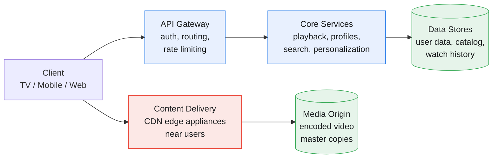
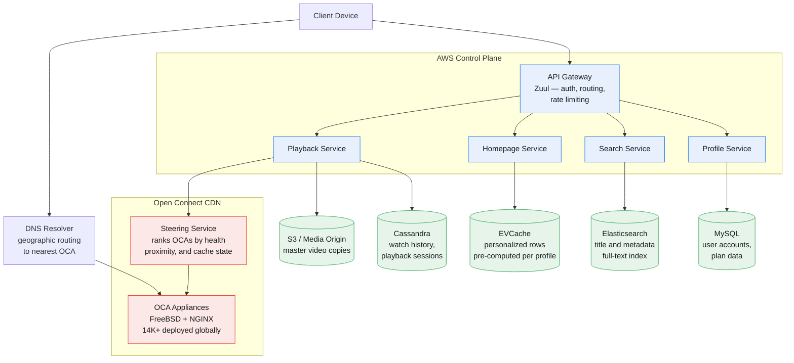

Netflix streams on-demand video to 325M+ paid subscribers across 190 countries, ingests 500+ hours of new content per minute, and serves ~15% of global internet downstream traffic.

<!--more-->

## 1. Problem
Netflix streams on-demand video to 325M+ paid subscribers across 190 countries, ingests 500+ hours of new content per minute, and serves ~15% of global internet downstream traffic. Three engineering tensions define the architecture: (1) delivering video at scale with sub-2-second startup on any device, any network — CDN economics flip at this traffic share, making a third-party CDN cost-prohibitive; (2) generating a fully personalized homepage for every subscriber — over 45 algorithms assembling rows and ranking titles, with two of every three streaming hours discovered via the homepage; and (3) encoding every title into ~1,200 output files across codecs, resolutions, and device profiles while the content library never stops growing.




> [!TIP]
> Netflix's scale is unique among streaming services: at 325 Tbps egress, building your own CDN becomes cheaper than paying a third party — the crossover happens around 10% of global internet downstream traffic.

## 2. Requirements

**Functional**

- FR1: Browse a personalized homepage of rows and ranked titles

- FR2: Search and discover content by title, genre, cast, or keyword

- FR3: Stream video with quality adapting to available bandwidth

- FR4: Resume playback from last position across any device

- FR5: Create and manage multiple user profiles per account

- FR6: Download titles for offline viewing on mobile devices

**Non-functional**

- NFR1: First video frame renders within 2 seconds on broadband

- NFR2: 99.99% availability for playback; survive a region failure

- NFR3: Support 65M peak concurrent streams and 325M+ subscribers

- NFR4: Serve content in 190+ countries; startup latency under 200ms

*Out of scope: Live streaming, advertising infrastructure, billing and subscription management, studio-side content ingestion tooling, games, DVD operations.*

## 3. Back of the envelope
- **CDN bandwidth:** 65M peak concurrent streams × 5 Mbps average bitrate = 325 Tbps egress → ~15% of global internet downstream traffic; third-party CDN egress fees alone exceed $1B/year at this volume.
- **Encoding compute:** 500 hours/min ingested × 20 compute-hours per hour of content × 1,200 output files per title → ~12M compute-core-hours per day of encoding work; the single largest batch-compute workload in the system.
- **Metadata read QPS:** 325M subscribers × 5 daily sessions × 50 API calls per session ÷ 86,400 seconds ≈ 940K read QPS at peak → the homepage-serving path handles 20× more reads than writes; read throughput is the binding constraint.

## 4. Entities

```

User {
  user_id:      uuid        PK
  email:        string
  country:      string      ← drives regional catalog availability
  plan_tier:    enum        ← basic, standard, premium (caps concurrent streams)
  created_at:   timestamp
}

Profile {
  profile_id:   uuid        PK
  user_id:      uuid        FK  ← partition key; all profiles for a user co-located
  name:         string
  avatar_url:   string?
  is_kids:      boolean     ← gates maturity-filtered catalog
  language:     string      ← preferred audio and subtitle language
}

Video {
  video_id:     uuid        PK
  title:        string
  synopsis:     text
  genres:       string[]    ← multi-hot; indexed for row assembly
  cast:         string[]
  maturity:     enum        ← all-ages, teen, mature
  runtime_sec:  integer
  release_year: smallint
  stream_urls:  jsonb       ← {codec: {resolution: [cdn_urls]}}; generated per encoding run
}

WatchHistory {
  profile_id:   uuid        PK  ← partition key; all watch rows for a profile co-located
  video_id:     uuid        CK
  last_position: integer    ← seconds into the title; updated on heartbeat
  completed:    boolean     ← true once >90% watched
  updated_at:   timestamp
}

PlaybackSession {
  session_id:   uuid        PK
  profile_id:   uuid        FK
  video_id:     uuid        FK
  device_type:  string      ← TV, mobile, web, game-console
  started_at:   timestamp
  ended_at:     timestamp?
  bitrate_log:  integer[]   ← time-series of observed bitrates; feeds ABR metrics
}

Device {
  device_id:    uuid        PK
  profile_id:   uuid        FK
  device_type:  string
  drm_key:      string      ← per-device DRM key for license server
  last_seen:    timestamp
}


```

### API
- `GET /homepage?profile_id=` — personalized rows of titles, ranked per row
- `GET /videos/{id}` — title metadata: synopsis, cast, maturity, available codecs
- `POST /playback/start` — init session, returns manifest URL and DRM license
- `POST /playback/heartbeat` — report playback position every 30s for resume
- `GET /search?q=&genre=&language=` — full-text search with facet filters
- `GET /profiles/{id}/continue-watching` — incomplete titles sorted by recency

## 5. High-Level Design



### Video Pipeline (Ingest → Transcode → Package → Encrypt → Deliver)

```mermaid
graph LR
    MEZZ[Mezzanine<br/>Source File] --> INSPECT[Inspection<br/>validate metadata,<br/>flag corruption]
    INSPECT --> COMPLEX[Complexity<br/>Analysis<br/>scene-by-scene<br/>encoding difficulty]
    COMPLEX --> LADDER[Ladder<br/>Generation<br/>per-title optimal<br/>bitrates per resolution]
    LADDER --> ENCODE[Encoding<br/>codec-specific<br/>chunked parallel<br/>H.264, HEVC, AV1]
    ENCODE --> VALIDATE[Validation<br/>codec conformance<br/>VMAF quality score]
    VALIDATE --> PACKAGE[Package<br/>CMAF fMP4 segments<br/>DASH + HLS manifests]
    PACKAGE --> ENCRYPT[Encrypt<br/>multi-DRM: Widevine<br/>PlayReady, FairPlay]
    ENCRYPT --> S3_FINAL[(S3<br/>Encoded<br/>Library)]
    S3_FINAL --> DEPLOY[CDN Deploy<br/>pre-position to OCAs<br/>by popularity model]

    classDef svc fill:#e8f0fe,stroke:#1a73e8,color:#1a1c1e
    classDef store fill:#e6f4ea,stroke:#34a853,color:#1a1c1e
    class INSPECT,COMPLEX,LADDER,ENCODE,VALIDATE,PACKAGE,ENCRYPT,DEPLOY svc
    class S3_FINAL store

```




FR1: Browse a personalized homepage
**Components:** Homepage Service, EVCache, Recommendation Pipeline (offline), Row Assembler.
**Flow:**
1. Client calls `GET /homepage?profile_id=P1` on app launch.
1. Homepage Service reads EVCache key `homepage:P1` — a pre-computed list of row definitions: `[{row_type: "continue_watching", video_ids: [...]}, {row_type: "trending_now", video_ids: [...]}, ...]`, refreshed every 15 minutes.
1. For each row, the Homepage Service bulk-fetches video metadata (title, poster art URL, maturity) from a local cache keyed by `video_id`. Video metadata is small (~2 KB per title) and changes rarely — a 5-minute CDN cache on poster art plus 1-hour application cache on metadata covers nearly every request.
1. The response payload is ~30 rows × ~12 titles per row = 360 title references with poster URLs. The client renders the row structure; poster art loads from the CDN in parallel.
1. On cache miss (new profile, cache eviction), the Row Assembler runs inline: queries WatchHistory for continue-watching candidates, queries the Trending Velocity sorted set for popular titles in the profile's country, and calls the Recommendation Service for personalized rows — capped at 200ms total assembly time.

**Design consideration:** The Homepage Service never computes rows from scratch on the request path. All candidate generation — item-to-item collaborative filtering, two-tower scoring, new-release injection — runs offline in Spark jobs and writes results to EVCache. The online path is a cache read + metadata decoration, keeping p99 latency under 50ms. The 15-minute refresh interval means a newly released title takes at most 15 minutes to appear on a homepage — acceptable for VOD; live content would need a different path.
FR2: Search content
**Components:** Search Service, Elasticsearch.
**Flow:**
1. `GET /search?q=comedy&genre=stand-up&language=en` hits the Search Service.
1. Search Service constructs an Elasticsearch query: a `multi_match` across `title^3`, `synopsis^1`, `cast^2` for the full-text term, plus `term` filters on `genres` and `language`.
1. Elasticsearch returns ranked results — BM25 relevance scoring with a recency boost (titles released in the last 90 days get a 1.2× multiplier).
1. Results are paginated (20 per page, cursor-based). The service strips results blocked by the profile's maturity gate (`is_kids=true` drops anything above `all-ages`).

**Design consideration:** The video catalog is ~15K titles — small enough that the entire index fits in memory on a modest Elasticsearch cluster. Autocomplete (type-ahead suggestions) uses a separate edge-ngram index refreshed nightly. At 940K read QPS, the search path is a small fraction of total traffic (<5%) and not the scaling bottleneck.
FR3: Stream video with adaptive bitrate
**Components:** Playback Service, Steering Service, OCA CDN, DRM License Server.
**Flow:**
1. Client calls `POST /playback/start` with `video_id`, `profile_id`, and `device_type`.
1. Playback Service validates the profile's entitlement (plan tier, concurrent stream limit, geo-restriction) and creates a `PlaybackSession` row in Cassandra.
1. Playback Service calls the Steering Service: "give me the best OCA for `video_id`, this client's IP, and this codec family (HEVC for 4K-capable devices, H.264 for older)."
1. Steering Service consults its ranked list of OCAs — scored by BGP proximity, current health, and whether the OCA holds the requested video's encoded files — and returns the top three OCA URLs.
1. Playback Service returns the DASH or HLS manifest URL (hosted on the selected OCA) and a short-lived DRM license token to the client.
1. Client fetches the manifest from the OCA, then streams segments. The ABR algorithm adjusts quality every 2 seconds: if the buffer exceeds 20 seconds, step up one bitrate; if below 10 seconds, step down immediately. Throughput is tracked as an exponential moving average of the last 5 segment downloads.

**Design consideration:** The playback control path (steps 1–5) runs in AWS and is independent of the video data path (step 6), which runs entirely through Open Connect. A full AWS region outage stops new playback sessions from starting, but in-progress streams continue uninterrupted — the OCA holds enough segments buffered locally to serve minutes of content without the control plane.
FR4: Resume playback
**Components:** Playback Service, Cassandra (WatchHistory).
**Flow:**
1. During playback, the client sends `POST /playback/heartbeat` every 30 seconds with `session_id` and `last_position`.
1. The Playback Service upserts `WatchHistory` in Cassandra: `UPDATE watch_history SET last_position = ?, updated_at = now() WHERE profile_id = ? AND video_id = ?`. The upsert is lightweight (one row, two columns changed) and runs at ~130M heartbeats per minute peak — Cassandra absorbs this with its append-only write path.
1. When the client loads `GET /profiles/{id}/continue-watching`, the Playback Service queries `SELECT * FROM watch_history WHERE profile_id = ? AND completed = false ORDER BY updated_at DESC LIMIT 20`. The partition key (`profile_id`) makes this a single-partition read.

**Design consideration:** Heartbeats are fire-and-forget — the Playback Service does not acknowledge them. A lost heartbeat means the resume position drifts backward by at most 30 seconds on the next session, which is acceptable. The heartbeat interval trades positional accuracy for write volume: 30 seconds at 65M concurrent streams = ~2.2M writes/s, which is within Cassandra's comfortable range with appropriate partitioning.
FR5: Manage multiple profiles
**Components:** Profile Service, MySQL.
**Flow:**
1. `POST /profiles` creates a new profile under the authenticated user's account. The Profile Service checks the plan tier's profile limit (basic: 1, standard: 5, premium: 5) and inserts a row.
1. `PUT /profiles/{id}` updates name, avatar, language, or kids flag. The kids flag change triggers a cache invalidation for that profile's homepage — the next homepage load recomputes with the new maturity filter.
1. Profile data is small (5 rows × ~200 bytes) and write-rare — MySQL with standard replication handles it comfortably.

**Design consideration:** The kids flag is a security boundary, not just a UX preference. If a profile switches from kids to non-kids, the maturity filter drops — the next homepage load shows mature titles. The reverse transition (non-kids to kids) immediately invalidates the EVCache entry so stale mature rows cannot leak to a kids profile.
FR6: Download for offline viewing
**Components:** Playback Service, DRM License Server, OCA CDN.
**Flow:**
1. Client calls `POST /downloads` with `video_id`. The Playback Service checks the profile's plan tier (downloads are premium-only for most regions) and the title's download availability (some licensing agreements prohibit offline viewing).
1. If authorized, the Playback Service returns download URLs for the best single-bitrate encode suitable for the device's storage and screen resolution — typically 1080p HEVC at 2–4 Mbps, producing a ~1–2 GB file for a 90-minute film.
1. The DRM License Server issues a device-bound, time-limited offline license: the downloaded file decrypts only on the requesting device, and the license expires after 48 hours of non-connectivity. The client must phone home within that window to refresh the license, enforcing licensing windows without persistent connectivity.

**Design consideration:** Downloads use a single fixed bitrate rather than an adaptive ladder — the file size is predictable and the experience is consistent. The license-expiry phone-home is the key mechanism for enforcing content licensing restrictions offline: the file is encrypted on disk and unplayable without a valid license, so even a rooted device cannot bypass expiry by copying the file.

## 6. Deep dives

### DD1: Content Delivery Architecture
**Problem.** 325M subscribers stream video across 190 countries on connections ranging from gigabit fiber to 2G mobile. A single client in Nairobi watching a title whose master copy sits in an Oregon S3 bucket would see multi-second latency if every stream pulled from the origin. The architecture must place content physically close to every user — within their ISP's network where possible — while keeping the control plane centralized for consistency. The tension: serving 325 Tbps of egress traffic globally is a cost and physics problem — bandwidth alone at third-party CDN rates exceeds $1B/year — but the control plane must remain coherent across regions.
**Approach 1: Third-party CDN with origin pull**
Use a commercial CDN (CloudFront, Akamai, Fastly). Every client request hits the nearest edge POP; on cache miss, the POP pulls from the S3 media origin. Pay per GB egress.
**Pro:** Zero CapEx. No hardware to deploy, no ISP peering relationships to negotiate. Operational simplicity — the CDN provider handles edge capacity, DDoS mitigation, and regional expansion.
**Con:** At 325 Tbps sustained egress (roughly 1.4 EB/month), third-party CDN costs exceed $1B/year at discounted enterprise rates. The CDN's cache-eviction policy is generic — a long-tail title watched by 500 people in a specific region may be evicted to make room for a different customer's content, causing cache-miss spikes. No control over placement: the CDN decides which POPs cache which files. For a 4K HDR stream requiring 16 Mbps steady-state throughput, cache misses that round-trip to Oregon introduce multi-second rebuffering.
**Approach 2: Own CDN with pre-positioning (Open Connect model)**
Deploy custom appliances inside ISP networks and at internet exchange points. Each appliance stores tens of TB of content on local disk and serves it via NGINX over HTTP. Content is pre-positioned — pushed to appliances during off-peak hours based on a predictive popularity model, not cached reactively on first request. The control plane (Steering Service) tells the client which appliance to use based on BGP proximity, appliance health, and file inventory.
**How it works:**
1. A batch job runs nightly: for each OCA region, compute the predicted demand for every title using a model trained on regional watch patterns, upcoming releases, and seasonal factors. The output is a placement manifest: "OCA 1432 in Frankfurt should store titles A, B, C at resolutions X, Y."
1. During off-peak hours (typically 2–6 AM local time), the Fill Service pushes those files from the S3 origin to each OCA over the private Open Connect backbone. The backbone is a set of dedicated transit links from AWS regions to IX points, avoiding public internet congestion.
1. When a client presses play, the Steering Service queries its in-memory map — `(OCA_id, video_id, codec, resolution) → has_file` — updated continuously as OCAs report their inventory via heartbeat. It returns the top three OCAs that hold the file and are healthy.
1. The client streams from the top-ranked OCA. If the OCA becomes unhealthy mid-session (link flap, disk failure), the client's ABR logic switches to the second-ranked OCA without interrupting playback.

```javascript
Client ABR decision loop (every 2 seconds, per segment):
  measured_throughput = EMA(last 5 downloads)
  buffer_occupancy = current_buffer_seconds

  if buffer_occupancy > 20s:
      target_bitrate = min(next_higher_bitrate, measured_throughput * 0.9)
  elif buffer_occupancy < 10s:
      target_bitrate = next_lower_bitrate  // aggressive downshift
  else:
      target_bitrate = measured_throughput * 0.9  // steady state

  fetch next segment at target_bitrate

```

**Pro:** CapEx pays for itself within ~18 months — the crossover point where hardware plus peering costs fall below third-party CDN egress fees is roughly 10% of global internet traffic. Pre-positioning during off-peak hours uses bandwidth that would otherwise be idle, effectively making the fill cost zero. Full control over cache placement means a regional hit in an obscure title never competes with another customer's content for cache residency. ISP-embedded appliances mean the stream never leaves the user's ISP network — single-digit millisecond latency to the first segment.
**Con:** Deploying and maintaining 14,000+ appliances across 142 countries and thousands of ISP networks is a massive operational undertaking. Each OCA is a physical server that requires power, cooling, rack space, and an on-site support contract with the hosting ISP. A failed disk needs a truck roll. The heterogeneous fleet — appliances range from 2011-era hardware to current-generation — means the cache-placement algorithm must account for varying storage and throughput capacities, solved via Heterogeneous Cluster Allocation (weighted consistent hashing: popular titles weighted by appliance throughput, long-tail titles weighted by storage capacity).
**Decision.** Approach 2 — own CDN with pre-positioning.
**Rationale.** The economics are decisive at this scale. At 325 Tbps, the crossover point — where hardware CapEx plus peering costs fall below third-party egress fees — was reached when traffic surpassed roughly 10% of global internet downstream volume. Pre-positioning is the critical differentiator from generic CDNs: with a recommendation-trained demand model, content can be placed before users request it. This turns the CDN from a reactive cache into a purpose-built delivery network optimized for a single workload. The operational cost of managing 14,000 appliances is amortized over 325M subscribers — roughly 23,000 subscribers per appliance, each serving multiple concurrent streams. The FreeBSD plus NGINX software stack is open-source, keeping per-appliance licensing costs at zero.
**Edge cases:**
- **OCA failure mid-stream.** The client's ABR logic has the Steering Service's second-ranked OCA URL in the manifest. On segment fetch timeout (2 seconds), the client retries the next OCA. The buffer provides 20+ seconds of playback — enough to absorb the failover.
- **Regional outage (OCA cluster loses power).** The Steering Service's health-check heartbeat times out for all OCAs in the region after 30 seconds. Clients are redirected to the nearest healthy cluster — for most users, this means the next-closest region's appliances. Latency increases from single-digit ms to ~50–100ms (cross-region), but playback continues.
- **New title release at midnight.** The overnight fill job pre-positions the title to OCAs before the release window. If the title is unexpectedly popular, the Steering Service marks it as "on-demand fill" — the OCA pulls the file from the origin during the first playback session in its region, at the cost of slightly higher startup latency for the first viewer.
- **Cold-start region.** A newly deployed OCA has an empty cache. The Fill Service seeds it with the top 100 titles for that region (derived from neighboring regions' watch patterns) in the first fill cycle. Within 24 hours, the predictive model incorporates the new region's actual watch data and adjusts placement.

> [!TIP]
> The OCA pre-positioning model is the unsung hero of Netflix's architecture: by predicting demand before it happens and pushing content during off-peak hours, the fill uses bandwidth that would otherwise be idle. The marginal cost of the nightly fill is effectively zero — and the cache-hit ratio stays above 95% for the top 500 titles in any region.

### DD2: Personalized Feed
**Problem.** Every subscriber sees a different homepage — rows ordered and populated uniquely, even within the same household. Two of every three hours streamed on Netflix are discovered through the homepage, so its quality directly drives retention. The candidate pool is the entire catalog (~15K titles), and the page must assemble in under 200ms from a cold cache. The tension: deep personalization requires rich models trained on billions of watch events, but the online serving path must be a lightweight cache read — a full model inference per request is too slow and too expensive at 940K QPS.
**Approach 1: Global ranked list (one-size-fits-all)**
Serve the same ranked list of top titles to every user in a region, sorted by a composite score of recency, popularity, and editorial promotion.
**Pro:** Trivially cacheable — one CDN-cached JSON file per region, refreshed hourly. Sub-millisecond response. Zero personalization infrastructure.
**Con:** Every subscriber sees the same page. A 14-year-old's homepage looks identical to their parent's. No accounting for watch history, genre preference, or language. The homepage becomes a billboard, not a discovery surface. Engagement drops — users who cannot find content they want to watch churn. This fails the core product requirement: the homepage is the primary discovery mechanism.
**Approach 2: Real-time model inference per request**
On every homepage request, run the full recommendation pipeline inline: candidate generation (item-to-item CF, two-tower neural scorer, trending), ranking, row assembly, and deduplication.
**Pro:** Truly real-time personalization. The page reflects the user's most recent behavior immediately — finish a documentary and the homepage shifts toward similar titles within seconds.
**Con:** 940K QPS × even 50ms of model inference = 47,000 CPU-seconds per second of wall-clock time — requiring thousands of GPU instances at enormous cost. The two-tower model's user embedding is refreshed hourly from offline training; running it per-request provides marginal freshness gain at massive cost. A real-time pipeline also introduces a new failure mode: if the recommendation service is degraded, the homepage is empty.
**Approach 3: Offline generation with online assembly and re-ranking**
The recommendation pipeline runs entirely offline (Spark jobs, refreshed every 15 minutes). It produces, for each profile, a ranked list of candidate video IDs per row type. These lists are written to EVCache (Memcached-based, ~22K servers, ~14 PB across regions). At request time, the Homepage Service reads the pre-computed cache entry, decorates with metadata, and returns.

```javascript
Offline pipeline (Spark, runs every 15 min per profile cohort):
  for each profile:
    candidates = []

    // 1. Item-to-item collaborative filtering
    last_watched = watch_history.last_n_titles(profile, 20)
    for title in last_watched:
        candidates.extend(
            item_item_cf.top_k(title, k=15)
        )

    // 2. Two-tower neural scoring
    user_embedding = user_tower.predict(profile_id)
    for title in catalog:
        score = dot(user_embedding, title_embedding)
    candidates.extend(top_k_by_score(scores, k=200))

    // 3. Continue watching
    candidates.extend(
        watch_history.incomplete(profile).order_by(updated_at.desc).limit(20)
    )

    // 4. New release injection
    candidates.extend(
        catalog.new_releases(30_days).filter_by_genre_affinity(profile).limit(30)
    )

    rows = row_assembler.assemble(candidates, profile_id)
    evcache.set(f"homepage:{profile_id}", rows, ttl=900)

Online path (Homepage Service, per request):
  rows = evcache.get(f"homepage:{profile_id}")
  video_metadata = metadata_cache.bulk_get(rows.all_video_ids)
  return decorate(rows, video_metadata)  // <50ms p99

```

**Pro:** The online path is a cache read + metadata decoration — 50ms p99 at 940K QPS on commodity hardware. The offline pipeline can use expensive models (two-tower neural scoring, graph walks on the co-watch matrix) because it runs on a batch schedule with abundant compute. A recommendation pipeline failure produces a stale homepage, not an error — the cache keeps serving the last good result until the pipeline recovers. The architecture cleanly separates heavy computation (offline, Spark) from latency-sensitive serving (online, cache read).
**Con:** The 15-minute refresh interval means a user who binge-watches three episodes of a series will see stale "Continue Watching" rows for up to 15 minutes. Mitigation: the continue-watching row is refreshed inline — the client calls `POST /playback/heartbeat` during streaming, which updates the WatchHistory table, and the continue-watching query reads directly from Cassandra (not the offline cache), so resume positions are always current even if the rest of the homepage is on a 15-minute refresh cycle.
**Decision.** Approach 3 — offline generation with targeted inline overrides.
**Rationale.** The offline/online split is the standard architecture for billion-scale recommendation serving. The core insight is that personalization freshness has diminishing returns: a user's taste doesn't change in 15 minutes, but their playback position does (episode boundary). By keeping the freshness-sensitive paths inline (continue watching, search) and batching the taste-sensitive paths (recommended rows), the system achieves both real-time accuracy where it matters and cost-efficient serving where it doesn't.
**Edge cases:**
- **Cold-start profile.** A new profile with zero watch history has no collaborative-filtering signal and no two-tower embedding. The homepage defaults to popularity-based rows (trending in country, new releases) and a brief onboarding survey (select 3 titles to seed the embedding). After the first two viewing sessions, the CF and two-tower paths produce meaningful candidates.
- **Profile switch.** When a user switches from an adult profile to a kids profile, the Homepage Service invalidates the kids profile's EVCache entry and forces a synchronous assembly (capped at 200ms) with the maturity filter applied. The maturity gate is enforced server-side.
- **Row diversity constraint.** The row assembler enforces a rule: no two adjacent rows can be of the same type, and no video can appear more than once on the page.
- **Cache eviction under memory pressure.** EVCache is configured with a max-memory policy. If memory pressure exceeds the threshold, LRU profiles' homepage entries are evicted. On next request, the Homepage Service assembles inline within the 200ms budget. Active profiles (streamed in the last 7 days) are pinned and never evicted.

> [!TIP]
> The key insight: a user's taste doesn't change in 15 minutes, but their playback position does. By keeping freshness-sensitive paths (continue watching, search) inline and batching taste-sensitive paths (recommended rows), Netflix gets real-time accuracy where it matters at a fraction of the inference cost.

## 7. Trade-offs

| Chosen | Rejected | Why |

|---|---|---|
| Own CDN (Open Connect) with pre-positioning | Third-party CDN (CloudFront, Akamai) | At 325 Tbps sustained egress (~15% of global internet downstream traffic), third-party egress fees exceed $1B/year. Pre-positioning during off-peak hours uses idle backbone capacity and guarantees cache residency for long-tail content. The CapEx crossover was passed in ~2013; at current scale, the savings are existential. |
| Hundreds of microservices with bounded contexts | Monolith or coarse-grained services | Coarse decomposition creates thick client libraries and a distributed monolith — coupling services through shared libraries is worse than coupling through well-defined APIs because the dependency graph is invisible. Bounded-context microservices force explicit interfaces and independent deployability. The cost is operational complexity (service discovery, tracing, circuit breaking), which requires a service mesh (Envoy) and observability stack. |
| Global active-active with eventual consistency for non-critical data | Multi-region primary-standby | A standby region that isn't continuously exercised in production will fail when you need it — a lesson from a 2008 datacenter corruption that caused a 3-day streaming outage. Every service must survive an AZ failure, and critical services must survive a full region failure. User data is written to the nearest region and replicated asynchronously — the consistency domain is per-user, so cross-region conflicts are rare. |
| Async encoding pipeline with media-ready gating | Synchronous encoding at ingest | Encoding a feature film takes 20+ compute-hours across 1,200 output files. Synchronous encoding makes the studio's content ingestion wait on batch compute — unacceptable turnaround for time-sensitive releases. The async pipeline ingests the mezzanine file immediately and returns a content-ID; the encoded versions stream only after the encode-and-validate pipeline completes, gated by a media-ready event. |
| EVCache with pre-computed homepage rows | Real-time recommendation inference per request | 940K homepage reads per second × even 50ms of model inference = uneconomical. The offline pipeline runs expensive models (two-tower neural scoring, graph walks, multi-tower ensembles) on a 15-minute batch schedule. The online path is a cache read decorating pre-computed rows with metadata — 50ms p99. |


> [!WARNING]
> Global active-active is the highest-operational-cost trade-off here: building every service to survive a full region failure adds significant infrastructure and testing complexity. The 2008 datacenter corruption outage — 3 days of DVD-only delivery — was the forcing function that made this investment non-optional.

## 8. References
1. Netflix Technology Blog. [Rebuilding Netflix Video Processing Pipeline with Microservices](https://netflixtechblog.com/rebuilding-netflix-video-processing-pipeline-with-microservices-4e5e6310e359) (2024).
1. Netflix Technology Blog. [Distributing Content to Open Connect](https://netflixtechblog.com/distributing-content-to-open-connect-3e3e391d4dc9) (2021).
1. Netflix Technology Blog. [Driving Content Delivery Efficiency Through Classifying Cache Misses](https://netflixtechblog.com/driving-content-delivery-efficiency-through-classifying-cache-misses-ffcf08026b6c) (2025).
1. Netflix Technology Blog. [Introducing Netflix's Key-Value Data Abstraction Layer](https://netflixtechblog.com/introducing-netflixs-key-value-data-abstraction-layer-7d5e1cdbabc8) (2024).
1. Netflix Open Connect. [Open Connect Overview](https://openconnect.netflix.com/Open-Connect-Overview.pdf) (2024).
1. Gomez-Uribe, C.A. and Hunt, N. [The Netflix Recommender System: Algorithms, Business Value, and Innovation](https://dl.acm.org/doi/10.1145/2843948) (2016).
1. InfoQ. [Building a Global Caching System at Netflix](https://www.infoq.com/presentations/netflix-evcache/) (2024).
1. Rangarajan, S. [Play API: Evolutionary Architecture at Netflix](https://www.infoq.com/presentations/netflix-play-api/) (QCon SF, 2018).
1. Netflix Technology Blog. [Service Topology: Real-Time Dependency Mapping](https://netflixtechblog.com/service-topology-real-time-dependency-mapping-at-netflix-e4b6c092e5e2) (2026).
1. Basiri, A. et al. [Chaos Engineering: Building Confidence in System Behavior through Experiments](https://netflixtechblog.com/chaos-engineering-upgraded-878d341f15fa) (2016).
