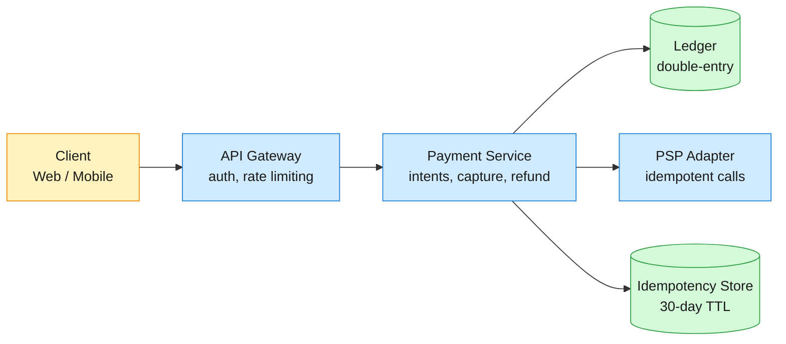
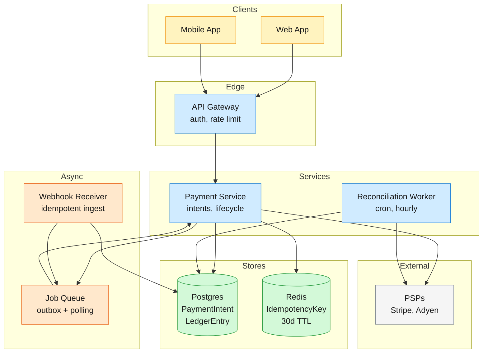
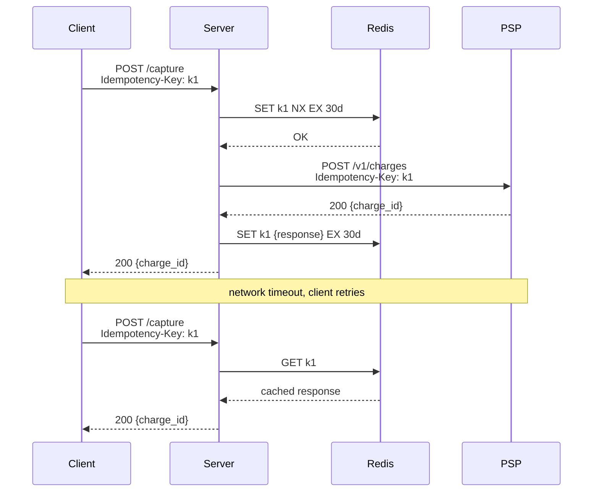

A payment system moves money from a customer's funding source to a merchant's account through payment service providers (PSPs) like Stripe and Adyen. The system authorizes funds, captures them, and records every movement in a double-entry ledger so the books balance to the cent.

<!--more-->

## 1. Problem

A payment system moves money from a customer's funding source to a merchant's account through payment service providers (PSPs) like Stripe and Adyen. The system authorizes funds, captures them, and records every movement in a double-entry ledger so the books balance to the cent. Three tensions shape the architecture: (1) network failures between the system and the PSP make it impossible to know whether a charge succeeded — retrying naively double-charges the customer, so every payment intent must carry an idempotency key that makes retries safe; (2) authorization and capture are separate steps (a hotel authorizes $100 at check-in, captures $87 at checkout after minibar charges), and the gap between them can span days — the ledger must reflect pending authorizations without double-counting; (3) the PSP’s settlement report is the ground truth of what actually moved, but it arrives hours later as a CSV file — the internal ledger must reconcile against it, surfacing discrepancies the moment they drift.



## 2. Requirements

**Functional**

- FR1: Create a payment intent with amount, currency, and payment method
- FR2: Authorize and capture funds for a payment
- FR3: View payment intent status and full transaction history
- FR4: Refund a previously captured payment
- FR5: Verify every payment matches the money that actually moved
- FR6: Receive and process asynchronous payment outcome notifications

**Non-functional**

- NFR1: Exactly-once charge across retries and network failures
- NFR2: All money movements sum to zero at any point in time
- NFR3: Authorization-to-capture p99 latency under 2 seconds end-to-end
- NFR4: No payment lost or stuck during provider outages

*Out of scope: subscription billing with proration, multi-currency conversion, dispute/chargeback handling, PCI-DSS compliance at the card-number storage level (card data is tokenized at the client and only PSP tokens touch our servers).*

## 3. Back of the envelope

- **Payment write rate:** 1M payments/day ÷ 86,400 seconds → ~12 payments/sec average; 10× peak → ~120 writes/sec peak load.
- **Idempotency storage:** 1M idempotency keys/day × 320 bytes/key × 30-day TTL → ~9.6 GB of Redis storage.
- **Ledger storage:** 2 ledger entries/payment × 1M/day × 365 days × 200 bytes → ~146 MB/year of ledger storage.

## 4. Entities

```
PaymentIntent {
  id:             uuid        PK
  idempotency_key:string     FK  -- client-supplied; unique per intent
  amount:         integer        -- minor units (cents); never float
  currency:       string(3)      -- ISO 4217
  status:         enum           -- created, authorized, captured, refunded, failed
  psp_reference:  string?        -- PSP-side identifier after authorization
  payment_method: string         -- tokenized card/bank token; never raw PAN
  created_at:     timestamp
}

LedgerEntry {
  id:             uuid        PK
  intent_id:      uuid        FK  -- PaymentIntent.id
  side:           enum           -- debit, credit
  amount:         integer        -- always positive; side determines sign
  balance_after:  integer        -- running balance post-entry; enables point-in-time audit
  description:    string         -- "authorization hold", "capture settlement", "refund"
  created_at:     timestamp
}

IdempotencyKey {
  key:            string      PK  -- client-supplied; stored for 30-day TTL
  intent_id:      uuid           -- the PaymentIntent this key maps to
  response:       jsonb          -- cached API response body; replayed on retry
  created_at:     timestamp      -- TTL-eligible; older than 30d is evicted
}

WebhookEvent {
  id:             string      PK  -- PSP's event id; used for idempotent processing
  psp:            string          -- stripe, adyen
  type:           string          -- payment_intent.succeeded, charge.refunded
  payload:        jsonb           -- raw PSP event body
  processed_at:   timestamp?
  created_at:     timestamp
}
```

### API

- `POST /payment-intents` — create a payment intent
- `POST /payment-intents/{id}/authorize` — authorize funds for a payment
- `POST /payment-intents/{id}/capture` — capture authorized funds
- `GET /payment-intents/{id}` — view payment intent status and transaction history
- `POST /payment-intents/{id}/refund` — refund a captured payment
- `POST /webhooks/{psp}` — receive payment outcome notifications

## 5. High-Level Design



#### FR1: Create a payment intent

**Components:** Client → API Gateway → Payment Service → Postgres + Redis.

**Flow:**

1. Client calls POST /payment-intents with {idempotency_key, amount, currency, payment_method}.
1. Payment Service checks Redis for the idempotency_key. If found, returns the cached response immediately — no work repeated.
1. If not found, inserts a PaymentIntent row with status = "created" inside a transaction.
1. Inserts the IdempotencyKey row in Redis with the response payload cached as JSON, TTL 30 days.
1. Returns {intent_id, status: "created", client_secret} to the client.

**Design consideration:** The idempotency check and the insert must be atomic — a race between two concurrent requests with the same key could create duplicate intents. The Redis SET key value NX EX 2592000 (set-if-not-exists with TTL) is atomic by design; if the SET fails, another request won the race and we read the cached response instead.

#### FR2: Authorize and capture funds

**Components:** Client → Payment Service → PSP Adapter → PSP → Postgres (ledger).

**Flow:**

1. Client calls POST /payment-intents/{id}/authorize. Payment Service loads the intent, confirms status = "created".
1. Payment Service calls the PSP adapter with {amount, currency, payment_method}. The adapter maps to Stripe's POST /v1/payment_intents or Adyen's /payments endpoint, forwarding the idempotency key.
1. PSP returns {psp_reference, status: "succeeded"}. Payment Service updates PaymentIntent.status = "authorized" and stores psp_reference.
1. Writes two LedgerEntry rows inside the same transaction: a debit (customer's pending balance) and a credit (merchant's pending receivable), both with description = "authorization hold".
1. For capture, client calls POST /payment-intents/{id}/capture. The PSP adapter calls the capture endpoint; on success, two new ledger entries move the amounts from pending to settled.

**Design consideration:** The PSP call and the ledger write sit in separate transactional domains. If the PSP succeeds but the ledger write fails, the system has collected money with no record of it. The fix is an outbox pattern: after a successful PSP call, write the ledger entries AND an outbox row in one Postgres transaction. A background worker polls the outbox and completes the PSP capture asynchronously. See DD2 for the full durability story.

#### FR3: View payment intent status and history

**Components:** Client → Payment Service → Postgres.

**Flow:**

1. Client calls GET /payment-intents/{id}. Payment Service loads the PaymentIntent row.
1. Queries LedgerEntry rows WHERE intent_id = $1 ORDER BY created_at ASC.
1. Returns the intent fields plus ledger_entries: [{side, amount, description, created_at}].

**Design consideration:** The balance_after column on every ledger entry means the read path never recomputes the running balance from scratch — a single ORDER BY created_at DESC LIMIT 1 gives the current balance. This is a deliberate denormalization: it costs an extra integer write per entry but saves a full-sum scan on every status poll.

#### FR4: Refund a captured payment

**Components:** Client → Payment Service → PSP Adapter → PSP → Postgres (ledger).

**Flow:**

1. Client calls POST /payment-intents/{id}/refund with optional partial amount.
1. Payment Service validates the intent status = "captured" and that the refund amount does not exceed the captured amount.
1. Calls the PSP refund endpoint with the psp_reference.
1. On success, writes two reversing ledger entries: debit the merchant's settled balance, credit the customer's settled balance.

**Design consideration:** Refunds at the PSP are asynchronous — the PSP returns a refund_id immediately but the money may take 5–10 business days to settle. The ledger reflects the refund intent as soon as the PSP accepts it (status refunded), not when the settlement batch arrives. The reconciliation worker (FR5) catches any mismatch.

#### FR5: Reconcile ledger against PSP settlement reports

**Components:** Reconciliation Worker (cron) → Postgres → PSP (SFTP/reports API).

**Flow:**

1. Every hour, the reconciliation worker fetches the latest settlement report from each PSP (CSV via SFTP or API).
1. Parses the report into {psp_reference, transaction_type, amount, settlement_date} rows.
1. For each row, looks up the matching PaymentIntent by psp_reference.
1. Compares the PSP's settled amount against the sum of LedgerEntry rows for that intent with description = "capture settlement".
1. Matching rows are marked reconciled. Mismatches generate an alert with the delta.

> [!WARNING]
> **Drift window:** A capture at 11:55 PM settles in the next day's report. The reconciliation worker tolerates a 48-hour lookback window — entries unreconciled after 48 hours are flagged as anomalies, not just delayed settlement.

#### FR6: Receive PSP webhook events

**Components:** PSP → Webhook Receiver → Job Queue → Payment Service.

**Flow:**

1. PSP sends a POST to /webhooks/{psp} with event type and payload (e.g. payment_intent.succeeded, charge.refunded).
1. Webhook receiver validates the signature (webhook secret per PSP) and inserts a WebhookEvent row — ON CONFLICT (id) DO NOTHING for idempotent ingest.
1. Returns 200 to the PSP immediately. A webhook_received outbox event is written.
1. Background worker dequeues the event, looks up the matching PaymentIntent by psp_reference, and advances the intent state machine.

**Design consideration:** Webhooks can arrive out of order — a charge.captured webhook may beat the synchronous authorize response if the network is slow. The Payment Service state machine rejects invalid transitions and parks the webhook event for retry with exponential backoff. After 3 retries, it lands in a dead-letter queue for manual inspection.

## 6. Deep dives

### DD1: Exactly-once payment processing with idempotency keys

**Problem.** The client calls POST /payment-intents/{id}/capture. The request reaches the server and the PSP, the PSP confirms the charge, but the response is lost to a network timeout. The client retries. Without idempotency, the retry creates a second charge — the customer pays twice. The system must guarantee that N retries of the same logical request produce exactly one charge, even when the first attempt partially succeeded.

**Approach 1: Client-supplied idempotency key, server-side dedup**

The client generates a unique Idempotency-Key header (UUIDv4) and sends it on every retry. The server stores (key → response) in Redis and the PSP passes the same key through. On a cache hit, the server returns the cached response without touching the PSP.



**Challenges:**

**Redis eviction before the first request completes:** If the TTL is too short or Redis is under memory pressure, the key is evicted before the initial SET can store the response. The retry sees a miss and issues a second charge. Mitigation: the idempotency window (30 days) must exceed the maximum retry window by a wide margin; Redis maxmemory-policy noeviction on the idempotency store cluster prevents LRU eviction of in-flight keys.

**Approach 2: Database-level idempotency with unique constraint**

Store the idempotency key as a column on PaymentIntent with a unique constraint. The first INSERT succeeds; concurrent inserts with the same key get a duplicate-key error, and the caller reads the existing row.

```sql
INSERT INTO payment_intents (id, idempotency_key, amount, currency, status)
VALUES (gen_random_uuid(), $1, $2, $3, 'created')
ON CONFLICT (idempotency_key) DO NOTHING
RETURNING id, status;
```

**Challenges:**

**PSP was already called in the first attempt:** The ON CONFLICT DO NOTHING returns no row, so the caller must SELECT the existing intent. But if the first attempt reached the PSP and succeeded, then crashed before updating the intent status, the retry finds status = "created" and calls the PSP again — double charge. The database alone cannot protect against a partial PSP call; only the PSP's own idempotency layer (Approach 1's key forwarding) closes this gap.

**Decision:** Approach 1 (client-supplied key forwarded to PSP) is the primary guard. Approach 2 (database unique constraint) is the secondary safety net.

Rationale: The PSP is the ultimate arbiter of whether money moved. Forwarding the idempotency key to the PSP (Stripe's Idempotency-Key header, Adyen's reference field) makes the PSP itself deduplicate — even if our server crashes mid-request and restarts with no memory, the PSP recognizes the key and returns the original result. This mirrors Stripe's internal approach: their API servers store (key, response_hash) in a distributed cache with a 24-hour window. Our 30-day Redis window is conservative, covering edge cases where a client's retry logic spans days.

**Edge cases:**

- Client reuses an idempotency key for a different payment: the server validates the request body matches the cached request body and rejects mismatches with 422 Unprocessable Entity.
- Redis cluster partition: the server falls back to the database unique constraint and forwards the key to the PSP. The PSP's own idempotency is the final safety net.
- Key collision across tenants: the idempotency key namespace is per merchant account. The Redis key is {merchant_id}:{idempotency_key} to isolate tenants.

> [!TIP]
> **Key insight:** Idempotency is a distributed systems problem, not a database problem. The PSP is outside the transactional boundary — no local lock, unique constraint, or serializable isolation level can prevent a double charge if the PSP was already told to charge. The only correct solution is to make the PSP itself idempotent by forwarding the key, and use local stores as fast-path caches and secondary guards.

### DD2: Outbox pattern for PSP call durability

**Problem.** A capture request must do two things: call the PSP and write ledger entries. These span two systems with no shared transaction. If the PSP succeeds and the server crashes before writing the ledger, money moved with no record. If the ledger writes and the PSP call fails, the books show money that doesn't exist. The system needs a durable join point between the PSP call and the local database.

**Approach 1: Outbox with polling**

Before calling the PSP, the Payment Service inserts an outbox row (capture_requested event) in the same Postgres transaction as the ledger entries. A background worker polls the outbox table and executes the PSP call. On success, it writes a capture_completed event and updates the intent status. On failure, it retries with exponential backoff.

```sql
-- Step 1: Write intent + ledger + outbox in one transaction
BEGIN;
  UPDATE payment_intents SET status = 'capturing' WHERE id = $1;
  INSERT INTO ledger_entries (intent_id, side, amount, balance_after, description)
  VALUES ($1, 'debit', $2, $3, 'capture settlement'),
         ($1, 'credit', $2, $4, 'capture settlement');
  INSERT INTO outbox (event_type, payload, created_at)
  VALUES ('capture_requested', jsonb_build_object('intent_id', $1, 'amount', $2), now());
COMMIT;
```

```plain text
Worker loop (runs every 1 second):
  SELECT * FROM outbox WHERE processed_at IS NULL ORDER BY created_at LIMIT 10;
  FOR EACH row:
    call PSP capture API
    ON success: UPDATE outbox SET processed_at = now()
                UPDATE payment_intents SET status = 'captured'
    ON failure: increment retry_count; backoff = 2^retry_count seconds
```

**Challenges:**

**Polling latency:** The worker polls every 1 second, so the capture completes 0–1 second after the ledger write. At 120 peak payments/sec, the worst-case queue depth is ~120 rows — trivial for Postgres.

**Duplicate PSP calls:** If the worker crashes after the PSP call succeeds but before updating processed_at, the next poll picks up the same row and calls the PSP again. Mitigation: forward the idempotency_key to the PSP (see DD1) — the PSP deduplicates the second call.

**Approach 2: Change data capture (CDC) with Debezium/Kafka**

Instead of polling, tail Postgres's write-ahead log (WAL) with Debezium, emit every outbox insert as a Kafka message, and have a Kafka consumer execute the PSP call. Eliminates polling latency entirely.

**Challenges:** Adds Kafka and Debezium to the infrastructure — two distributed systems to operate, monitor, and troubleshoot. For 120 peak writes/sec, the polling approach is orders of magnitude below Postgres's comfortable polling threshold (~10K rows/sec before SELECT ... LIMIT becomes a bottleneck).

**Approach 3: Transactional outbox with LISTEN/NOTIFY**

Postgres's LISTEN/NOTIFY provides push-based notification: after committing the outbox insert, the transaction emits NOTIFY capture_channel. A long-lived worker listens on this channel and wakes up immediately.

```sql
-- In the transaction:
  INSERT INTO outbox ...;
  -- Postgres fires NOTIFY on commit (not before)
  PERFORM pg_notify('capture_channel', row_id::text);
COMMIT;
```

**Challenges:** NOTIFY is lossy — if no listener is connected when the notification fires, it's dropped. The worker must still poll on startup and periodically to catch missed notifications.

**Decision:** Approach 1 (polling outbox) for the baseline, with Approach 3 (LISTEN/NOTIFY) as the latency optimization path.

Rationale: At 120 peak writes/sec and a 1-second poll interval, the average queue depth is 60 rows. A SELECT ... LIMIT 100 FOR UPDATE SKIP LOCKED on an indexed processed_at IS NULL completes in under 1ms on any Postgres version. The polling approach has one moving part and no new infrastructure — a charges table with a status column, polled by background jobs, is proven at scale before migrating to event-driven architectures. LISTEN/NOTIFY is a drop-in upgrade. CDC/Kafka is reserved for when the system grows beyond single-instance Postgres.

**Edge cases:**

- Worker crash mid-PSP-call: the outbox row is still processed_at IS NULL. On restart, the worker picks it up and retries. The PSP's idempotency key prevents a double charge.
- PSP returns a permanent error (insufficient funds, card declined): the worker sets processed_at = now() and error = 'insufficient_funds'; the intent is marked failed. Permanent errors are never retried.
- PSP timeout: the worker treats a timeout as a transient failure and retries with backoff. After 10 retries (~17 minutes), the row is moved to a dead-letter table for manual inspection.

### DD3: Double-entry ledger — the zero-sum invariant

**Problem.** Every movement of money must be recorded as a pair of equal and opposite entries — a debit from one account and a credit to another — so the sum of all ledger entries is always zero. A single missing entry breaks the invariant and the books are unreconcilable. The ledger must enforce this at the database level, not in application code, because any code path that inserts a lone entry poisons the books permanently.

**Approach 1: Application-level pairing with transaction**

The application code always inserts debit and credit as a pair inside a single INSERT statement or a transaction. The invariant is enforced by discipline — every code path that touches the ledger writes exactly two rows.

```sql
INSERT INTO ledger_entries (intent_id, side, amount, balance_after, description) VALUES
  ($1, 'debit',  $2, $3, 'capture settlement'),
  ($1, 'credit', $2, $4, 'capture settlement');
```

**Challenges:** Discipline doesn't survive schema migrations, new code paths, or direct database access by operators. A single bug (a retry loop inserting debits without matching credits) violates the invariant silently.

**Approach 2: Constraint-enforced pairing with a batch_id**

Every pair of entries shares a batch_id (UUID). A deferred constraint ensures that for every batch_id, the sum of amounts on the debit side equals the sum on the credit side.

```sql
CREATE TABLE ledger_entries (
  id          uuid PRIMARY KEY,
  intent_id   uuid NOT NULL,
  batch_id    uuid NOT NULL,  -- groups a debit/credit pair
  side        side_enum NOT NULL,
  amount      integer NOT NULL,
  ...
);

-- Deferred constraint: checked at COMMIT, not per-row
CREATE CONSTRAINT TRIGGER check_balanced_batch
AFTER INSERT ON ledger_entries
DEFERRABLE INITIALLY DEFERRED
FOR EACH ROW
EXECUTE FUNCTION verify_batch_balance();
```

```plain text
verify_batch_balance():
  SELECT batch_id,
         SUM(amount) FILTER (WHERE side = 'debit')  AS debits,
         SUM(amount) FILTER (WHERE side = 'credit') AS credits
  FROM ledger_entries
  WHERE batch_id IN (SELECT DISTINCT batch_id FROM new_rows)
  GROUP BY batch_id
  HAVING SUM(amount) FILTER (WHERE side = 'debit') <>
         SUM(amount) FILTER (WHERE side = 'credit');
  -- If any row returned, RAISE EXCEPTION and rollback
```

**Challenges:** The trigger runs on every commit and scans the newly inserted rows grouped by batch. At 120 peak writes/sec with 2 rows each (240 row inserts/sec), the grouped scan is trivial. The constraint is per-batch, not global — the global zero-sum check is still a periodic audit query.

**Approach 3: Single double-entry row with signed amount**

Collapse each pair into a single row with a signed amount — positive for credits, negative for debits. The zero-sum invariant is simply SUM(amount) = 0 across all rows.

```sql
CREATE TABLE ledger_entries (
  id          uuid PRIMARY KEY,
  intent_id   uuid NOT NULL,
  amount      integer NOT NULL,  -- positive = credit, negative = debit
  ...
);
```

**Challenges:** Obscures the double-entry structure — a credit and its matching debit are no longer visibly paired. Querying the matching entry requires finding the row with the same intent_id and opposite sign, which is fragile when multiple partial captures or refunds exist. The explicit batch_id in Approach 2 is self-documenting.

**Decision:** Approach 2 (constraint-enforced pairing with batch_id) for production; Approach 1 (application discipline) during early development before the trigger is deployed.

Rationale: The ledger is the system of record for money. A bug that violates the zero-sum invariant is catastrophic — it means the books don't balance and the reconciliation report shows a permanent, unexplainable delta. A database-enforced constraint is the only defense that covers all code paths, present and future.

**Edge cases:**

- Partial capture: Authorize $100, capture $87. Two separate balanced batches, linked by intent_id.
- Refund reversing a capture: the refund batch is a mirror of the capture batch. Net zero across capture + refund.
- Currency conversion: not yet in scope, but if added, each side would carry its own currency and exchange_rate — requiring a separate forex gain/loss entry.

### DD4: Reconciliation — matching internal ledger to PSP settlement

**Problem.** The PSP's settlement report is the ground truth of what money actually moved, but it arrives hours after the fact as a batch file. The internal ledger records what the system believes moved at the time of the API call. These two sources must agree to the cent, and any discrepancy must surface as an alert — not as a surprise during month-end accounting.

**Approach 1: Row-by-row matching with tolerance**

```plain text
Reconciliation loop (runs hourly):
  report = fetch_settlement_report(psp, date_from, date_to)
  FOR EACH row IN report:
    intent = SELECT * FROM payment_intents WHERE psp_reference = row.psp_reference
    IF intent IS NULL:
      log("orphan settlement: PSP reports charge for unknown psp_reference")
      CONTINUE
    ledger_total = SELECT SUM(amount) FROM ledger_entries
                   WHERE intent_id = intent.id AND description = 'capture settlement'
    IF ledger_total == row.amount:
      UPDATE payment_intents SET reconciled_at = now() WHERE id = intent.id
    ELSE:
      delta = row.amount - ledger_total
      log("mismatch: intent={id}, psp={row.amount}, ledger={ledger_total}, delta={delta}")
      create_alert(intent.id, delta)
```

**Challenges:** The PSP report may contain fees, refunds, and chargebacks interleaved with captures. A single psp_reference can appear multiple times. The matching logic must group by psp_reference and transaction type.

**Approach 2: Hash-based batch reconciliation**

```plain text
internal_hash = MD5(
  SELECT string_agg(intent_id || ':' || amount::text, ',' ORDER BY created_at)
  FROM ledger_entries WHERE created_at BETWEEN $1 AND $2
)
psp_hash = MD5(report_rows_sorted)
IF internal_hash == psp_hash: mark_period_reconciled()
```

**Challenges:** Hash mismatch tells you that something is wrong but not what — you still need row-by-row matching to find the specific discrepancy. The hash is a fast-path gate, not a replacement for detailed matching.

**Decision:** Two-pass reconciliation: Approach 2 (hash gate) first → if mismatch, fall back to Approach 1 (row-by-row) for the offending period.

Rationale: At 1M payments/day, 99.9% of hourly settlement windows have zero discrepancies. Running a full row-by-row scan on every window wastes database IO. The hash gate completes in milliseconds (a single aggregate query). When a mismatch is detected, the row-by-row pass pinpoints the exact transaction.

**Edge cases:**

- Timing mismatch: A capture at 23:59:59 on Monday appears in Tuesday's settlement report. A 48-hour overlap window prevents false positives from timezone or batch-cutoff drift.
- PSP fees: The PSP deducts a processing fee (2.9% + $0.30) from the settled amount. Reconciliation matches on gross and records the fee as a separate ledger entry.
- Duplicate settlement reports: The reconciliation worker is idempotent — it skips PSP rows already matched to a reconciled intent.
- Orphan PSP references: A psp_reference with no matching PaymentIntent means the PSP collected money the system doesn't know about. This is a critical alert.

## 7. References

1. [Stripe — Designing robust and predictable APIs with idempotency](https://stripe.com/blog/idempotency)
1. [Stripe — Growing your Stripe integration with Event Destinations](https://stripe.dev/blog/growing-your-stripe-integration-with-event-destinations)
1. [Stripe — Online migrations at scale](https://stripe.com/blog/online-migrations)
1. [Adyen — From 0 to $100 billion: Scaling infrastructure and workflow](https://www.adyen.com/knowledge-hub/from-0-100-billion-scaling-infrastructure-and-workflow-at-adyen)
1. [Brandur Leach — Idempotency keys: How Stripe prevents double charges](https://brandur.org/idempotency-keys)
1. [Paul Gross — Double-Entry Ledgers: The Missing Primitive in Modern Software](https://www.pgrs.net/2025/06/17/double-entry-ledgers-missing-primitive-in-modern-software/)
1. [Uber — Revolutionizing Money Movements at Scale with Strong Data Consistency](https://www.uber.com/us/en/blog/money-scale-strong-data/)
1. [Square — Books, an immutable double-entry accounting database service](https://developer.squareup.com/blog/books-an-immutable-double-entry-accounting-database-service/)
1. [AWS — Implementing the transactional outbox pattern with Amazon EventBridge Pipes](https://aws.amazon.com/blogs/compute/implementing-the-transactional-outbox-pattern-with-amazon-eventbridge-pipes/)
1. [Martin Kleppmann — Transactions: Myths, Surprises, and Opportunities](https://www.youtube.com/watch?v=5ZjhNTM8XU8)
1. [PostgreSQL Documentation — Deferred Constraints](https://www.postgresql.org/docs/current/sql-set-constraints.html)
1. [Pat Helland — Life Beyond Distributed Transactions: An Apostate's Opinion](https://queue.acm.org/detail.cfm?id=3025012)
