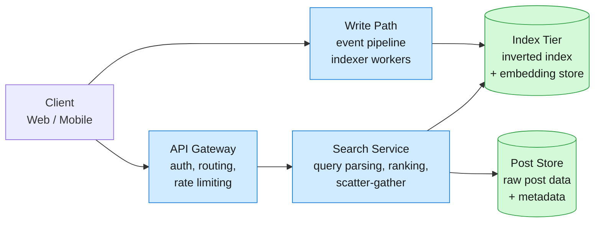
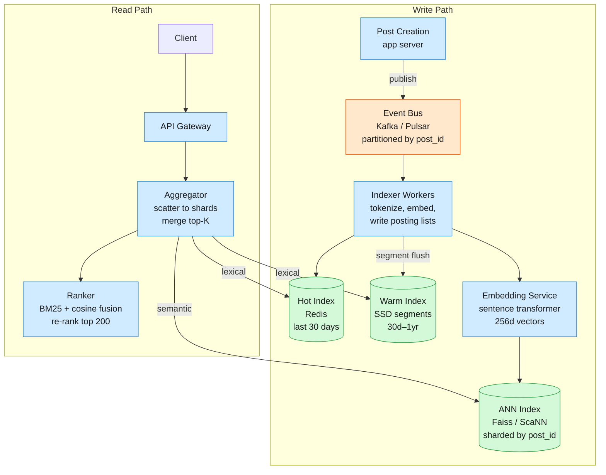
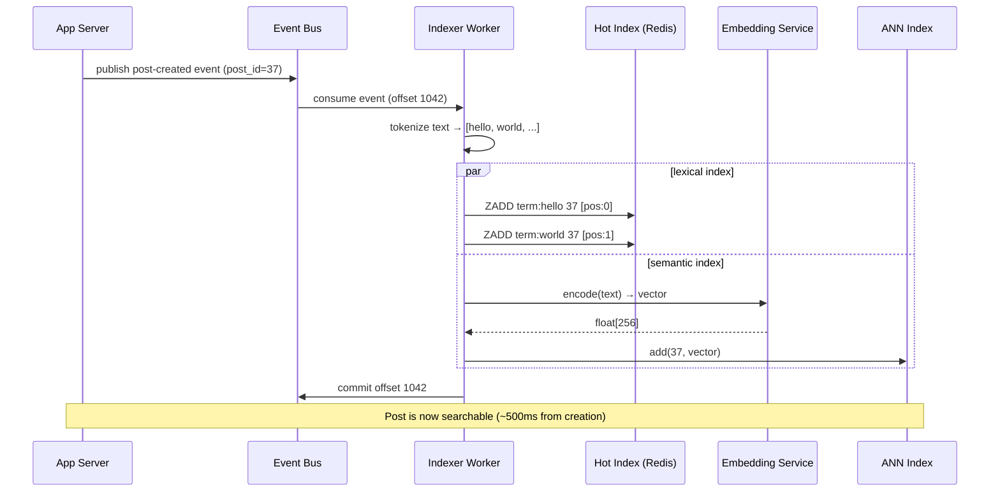

Post Search lets users find social media posts by keyword, phrase, or semantic meaning across billions of posts, returning ranked results in under 200ms. The system ingests millions of new posts per minute, indexes them in near real-time, and serves search traffic from a global user base.

<!--more-->

## 1. Problem
Post Search lets users find social media posts by keyword, phrase, or semantic meaning across billions of posts, returning ranked results in under 200ms. The system ingests millions of new posts per minute, indexes them in near real-time, and serves search traffic from a global user base. Three tensions shape the architecture: (1) the inverted index must absorb writes at line rate without blocking reads — every millisecond of indexing lag is a post the user cannot find; (2) relevance ranking must fuse lexical match signals (BM25) with semantic similarity (embeddings) without blowing the latency budget; and (3) storage spans hot in-memory posting lists, warm SSD-resident segments, and cold archival shards — the index footprint grows ~3× the raw text size.



## 2. Requirements

**Functional**

- FR1: Search posts by keyword or phrase with ranked results

- FR2: Search by semantic meaning when exact keywords miss

- FR3: Filter results by author, date range, or language

- FR4: See new posts in search results within 2 seconds of creation

- FR5: Paginate through result pages beyond the top 50

- FR6: Highlight matching terms in returned post snippets

**Non-functional**

- NFR1: p99 search latency under 200ms for top-50 results

- NFR2: 99.99% availability; no single shard takes down search

- NFR3: Ingest and index 100M new posts per day without backpressure

- NFR4: Storage cost linear in post count; index footprint under 3× raw text

*Out of scope: Social graph-aware ranking (friend-of-friend boosting), personalized relevance models per user, multi-language cross-lingual search, post deletion from the index within the latency SLO (eventual consistency acceptable).*

## 3. Back of the envelope
- **Index storage:** 10B posts × 2KB raw text × 3× index overhead (posting lists + embeddings) → 60TB total index footprint; warm SSD at $0.08/GB-month = ~$5K/month in storage.
- **Write throughput:** 100M new posts/day ÷ 86,400 seconds → ~1,200 writes/sec steady-state; with 10× peak-to-average on social platforms → 12K writes/sec peak the ingest pipeline must absorb.
- **Read QPS:** 500M daily active users × 5 searches/day ÷ 86,400 → ~29K QPS average; peak 5× higher → ~145K QPS across the search tier.

## 4. Entities

```

Post {
  post_id:      uuid        PK
  author_id:    uuid        ← indexed for author-filtered queries
  text:         text        ← raw post body; tokenized into index
  language:     string(5)   ← en, es, ja; gates language-specific analyzers
  created_at:   timestamp   ← tiered index key (hot: last 30d, warm: 30d-1y, cold: 1y+)
  privacy:      enum        ← public, followers-only (gates index visibility)
  like_count:   integer     ← denormalized; updated async, used in ranking
}

TermPosting {
  term:         string      PK  ← n-gram token (word, bigram for CJK)
  post_id:      uuid        PK  ← compound key with term
  position:     smallint[]      ← term offsets in post; enables phrase queries
  tier:         enum           ← hot (Redis), warm (SSD segment), cold (object store)
}

PostEmbedding {
  post_id:      uuid        PK
  vector:       float[256]  ← distilled sentence embedding; 256d, 1KB per post
  model_version string      ← tracks which encoder produced this vector
}


```

### API
- `POST /search` — keyword or semantic search, returns ranked posts. Body: `{query, mode: "lexical"|"semantic"|"hybrid", filters: {author_id?, date_from?, date_to?, language?}, page_size, page_token}`. Response: `{results: [{post_id, author_id, text_snippet, highlights, score, created_at}], next_page_token}`.
- `POST /index` — ingest a new post into the search index. Called by the write pipeline. Body: `{post_id, author_id, text, language, created_at, privacy}`. Returns 202 Accepted.
- `GET /index/status/{post_id}` — check whether a post is searchable yet. Returns `{indexed: bool, indexed_at: timestamp?}`.
- `DELETE /index/{post_id}` — remove a post from the index (eventual). Returns 202 Accepted.

## 5. High-Level Design



FR1: Keyword search
- **Components:** Gateway → Aggregator → Lexical Index (Redis + SSD segments) → Ranker → Client.
- **Flow:**
  1. Gateway receives `POST /search` with `mode: "lexical"` and query string.
  1. Query parser tokenizes the query using the same analyzer that built the index (lowercase, stem, stop-word removal; bigram for CJK languages).
  1. Aggregator scatters the tokenized query terms to all index shards (shard by `hash(post_id) % N`).
  1. Each shard intersects posting lists for multi-term queries, computes BM25 score per post, returns top 200 per shard.
  1. Aggregator merges shard results into a global top 200 and forwards to the Ranker.
  1. Ranker applies author/date filters, sorts by score, returns top 50 with highlighted snippets.
- **Design consideration:** Posting lists are stored as delta-encoded, varint-compressed integer arrays — a 10M-document posting list for a common term like "the" compresses from ~40MB to ~4MB. Hot terms (appearing in >1% of posts) are marked as "stop words" and excluded from the index to avoid dominating query latency.
FR2: Semantic search
- **Components:** Gateway → Aggregator → Faiss ANN Index → Ranker → Client.
- **Flow:**
  1. Gateway receives `POST /search` with `mode: "semantic"`.
  1. The Embedding Service encodes the query string into a 256d float vector using the same model that indexed the posts.
  1. Aggregator fans out the vector to all ANN shards (same shard key as lexical index; embedding and posting list co-located per shard).
  1. Each Faiss shard performs approximate nearest-neighbor search (IVF+PQ, nprobe=32) and returns the top 200 posts by cosine similarity.
  1. Aggregator merges shard results into a global top 200.
  1. Ranker re-ranks using a lightweight cross-encoder for the final top 50, and returns snippets.
- **Design consideration:** Embedding generation is the write-path bottleneck — a 256d sentence transformer encodes ~500 posts/sec per GPU. At 1,200 writes/sec steady-state, 3 GPUs cover the load. Vectors are stored in Faiss with IVF+PQ compression (256d × 1KB raw → ~64 bytes compressed), keeping the full ANN index for 10B posts at ~640GB.
FR3: Filter by author, date, language
- **Components:** Aggregator applies filters during post-fetch from DocStore before ranking.
- **Flow:**
  1. Query executes against the index (lexical or semantic), returning candidate post_ids with scores.
  1. Aggregator batch-fetches post metadata (author_id, created_at, language, privacy) from the Post Store for the top 200 candidate IDs.
  1. Filters are applied in-memory: privacy check (public-only for unauthenticated users), author_id match, date range clamp, language match.
  1. Filtered candidates proceed to the Ranker for final scoring.
- **Design consideration:** Pushing filter logic after index retrieval keeps the posting-list intersection fast (no per-document metadata lookups during the hot path). At 145K peak QPS, batch-fetching 200 post metadata records per query from a key-value store adds ~2ms — acceptable within the 200ms budget.
FR4: Real-time indexing
- **Components:** App Server → Kafka → Indexer Workers → Redis (hot tier).
- **Flow:**
  1. When a user creates a post, the app server publishes `{post_id, author_id, text, language, created_at, privacy}` to Kafka topic `post-created`, partitioned by `post_id`.
  1. Indexer Worker consumes the event and tokenizes the post text using the language-appropriate analyzer.
  1. For each term in the post, the worker atomically appends `(post_id, [positions])` to the term's posting list in Redis (using `ZADD` with the post timestamp as score for time-sorted lists).
  1. The worker also calls the Embedding Service to generate the 256d vector and writes it to the Faiss shard.
  1. The indexer acknowledges the Kafka offset after both lexical and semantic writes succeed.
  1. A separate Segment Compactor periodically flushes Redis posting lists that are >30 days old into immutable SSD segments (SSTable-like format), freeing Redis memory.
- **Design consideration:** Redis `ZADD` gives us O(log N) insert into time-sorted posting lists, which is fast enough at 12K peak writes/sec. The trade-off is Redis memory cost — keeping 30 days of the hot index in memory for 10B posts (~300M posts/day × 30 days = 9B post entries in posting lists) requires roughly 200GB of Redis cluster memory. Posts older than 30 days live in SSD segments where reads are slower (~5ms vs ~0.5ms) but acceptable for infrequently searched tail content.
FR5: Pagination
- **Components:** Aggregator uses cursor-based pagination tokens.
- **Flow:**
  1. First request: Aggregator executes the query and returns `next_page_token` encoding `(query_hash, last_score, last_post_id, page_number)`.
  1. Subsequent request with `page_token`: Aggregator re-executes the same query with the `last_score` and `last_post_id` as tiebreakers, requesting the next 50 results.
  1. The token is a base64-encoded, HMAC-signed blob to prevent tampering and avoid server-side cursor state.
- **Design consideration:** Stateless pagination avoids storing result-set cursors server-side (which would balloon at 29K QPS). The trade-off is re-executing the query, but with the same shard-scatter as the initial request, it adds negligible overhead. Search results are not deeply paginated in practice — 99% of users never go past page 3.
FR6: Result highlighting
- **Components:** Ranker generates highlighted snippets using term positions stored in the posting lists.
- **Flow:**
  1. After ranking the top 50 posts, the Ranker fetches full term positions from the posting list for each winning post_id.
  1. For each post, it identifies the densest window of matching terms (a snippet ~200 characters long that maximizes term hits).
  1. Matching terms are wrapped in `<mark>` tags and included in the response.
- **Design consideration:** Term positions are stored but only fetched for the final top 50, not the full 200 candidates — this avoids a 4× fetch amplification. Storing positions doubles the posting list size (from ~4 bytes per post_id to ~8 bytes), but the user experience of seeing highlighted matches justifies the storage cost.

## 6. Deep dives

### DD1: Inverted index structure and compression
How do we store posting lists so that 10B posts × 5,000 unique terms average = 50T post-term pairs fit in 60TB without making intersection too slow?
**Approach 1: Uncompressed integer arrays**
Store each posting list as a sorted array of 64-bit post IDs. For a common term appearing in 100M posts: 100M × 8 bytes = 800MB per list. Intersection is fast (merge join of sorted arrays), but storage explodes — 50T pairs × 8 bytes = 400TB, 6× over budget.
**Pro:** Fastest intersection, simplest code.
**Con:** Storage cost is 6× the budget; common-term posting lists don't fit in memory.
**Approach 2: Delta encoding + varint compression**
Store posting lists as delta-encoded gaps between consecutive post IDs, compressed with varint (variable-length integer) encoding. Gap between post IDs 7 and 103 is 96, encoded in 1–2 bytes instead of 8. Intersection requires decoding the gaps on the fly, but decoding is CPU-cheap (~2 cycles per varint on modern hardware).
**Pro:** 10× compression on sorted post IDs (common terms: 800MB → ~80MB). Entire index fits in the storage budget.
**Con:** Intersection requires decompressing both lists simultaneously; adds ~5% CPU overhead vs raw arrays.
**Decision:** Delta encoding + varint compression.
**Rationale:** This is what every production search engine uses — Lucene, Unicorn, and Google's indexing stack all apply gap-compressed posting lists. The CPU overhead is negligible because intersection is memory-bandwidth-bound, not compute-bound. Incremental decoding also means we never materialize the full decompressed list — we stream through both posting lists one gap at a time during intersection, keeping working-set memory constant regardless of list length. For extremely common terms (>10% hit rate), we store a bloom filter instead of a posting list and fall back to a full scan of the hot index segment.
**Edge cases:**
- **Very rare terms** (appearing in <100 posts): posting list is tiny; no compression needed. Store inline in the term dictionary.
- **Document deletions:** post deletion sets a tombstone bit in the posting list entry. The segment compactor drops tombstones during merges.
- **Concurrent writes:** The Redis hot index handles atomic appends. SSD segments are immutable once flushed; a new segment is written for deletes, and the compactor merges segments periodically.
💡 **Why delta encoding works so well for post IDs:** Post IDs are assigned in roughly increasing order (UUIDv7 or similar), so the gap between consecutive IDs is small — typically 1–100. Varint encodes numbers under 128 in a single byte, so most gaps are 1-byte. For a 10M-post posting list, the average gap is ~100 (1 byte each) vs 8 bytes raw — that's 8× compression. For a 100K-post list, the average gap might be ~1,000 (2 bytes each) — still 4× compression.

### DD2: Hybrid ranking — fusing BM25 and semantic similarity
How do we combine lexical relevance (BM25) with semantic relevance (cosine similarity) into a single ranked list without running two separate searches and merging blindly?
**Approach 1: Reciprocal rank fusion (RRF)**
Run lexical and semantic searches independently, each returning a ranked list of 200 candidates. For each candidate, compute `RRF_score = 1 / (k + rank_lexical) + 1 / (k + rank_semantic)` with k=60. Sort by RRF score, return top 50. Simple, no model training needed, widely used.
**Pro:** Zero training cost; easy to implement and debug; k parameter tunes the fusion curve.
**Con:** Ignores the magnitude of scores — a post ranked #1 lexically and #200 semantically beats one ranked #10 in both. Does not learn which mode to trust per query type.
**Approach 2: Learned linear combination**
Collect candidates from both indexes (union of top 200 from each, typically ~300 unique posts). For each candidate, compute `final_score = α × BM25_norm(post) + (1-α) × cosine_norm(post)`, where both scores are min-max normalized to [0,1]. Train α per query type using click-through data.
**Pro:** Accounts for score magnitude; can learn query-type-specific weights (e.g., α=0.8 for navigational queries, α=0.3 for exploratory).
**Con:** Requires normalized scores (BM25 is unbounded; needs log-scaling). Training data pipeline adds complexity.
**Approach 3: Two-stage re-rank with cross-encoder**
Use RRF (Approach 1) to produce a top 200 candidate pool. Feed each candidate pair (query, post_text) through a lightweight cross-encoder transformer (e.g., MiniLM, 33M params) that outputs a single relevance score. Sort by cross-encoder score.
**Pro:** Highest relevance quality; cross-encoder sees query and post together and can model term interactions BM25 and embeddings miss.
**Con:** 200 cross-encoder inferences per query at 145K QPS peak = 29M inferences/sec — requires a GPU cluster.
**Decision:** Approach 1 (RRF) for the MVP; Approach 2 (learned linear) as the optimization path.
**Rationale:** RRF works well enough to ship and requires zero training infrastructure. At launch, there is no click-through data to train Approach 2 — it's a cold-start problem. The RRF rank-merge is a single-pass O(N) sort over at most 400 candidates and adds <1ms to the latency budget. As click data accumulates, we can train the α weight offline and A/B test it against RRF. Approach 3 (cross-encoder) is reserved for when the business can justify the GPU cost — it's the asymptote of relevance quality but overkill for a general post search where users primarily want to find posts they remember seeing, not discover new content.
**Edge cases:**
- **One index returns empty:** If the semantic index finds nothing (e.g., very rare query terms the encoder hasn't seen), RRF gracefully degrades to lexical-only ranking.
- **Query-type detection:** Short queries (1–2 words) are usually navigational; long queries (5+ words) are usually exploratory. This heuristic can seed the initial α until learned weights are available.
- **Language mismatch:** If the user searches in English but the post is in Spanish, BM25 will score low (no term overlap) but the multilingual embedding model may still find it — RRF gives the embedding path a chance to surface cross-lingual matches.
💡 **Why RRF works better than it sounds:** In practice, a post that ranks highly in BOTH indices is almost certainly relevant. RRF's `1/(k+rank)` formula boosts items that appear in both lists (receiving two RRF contributions) over items that dominate one list but don't appear in the other. This is exactly the behavior we want — it's a soft AND over the two retrieval paths.

### DD3: Real-time indexing pipeline — from post creation to searchable
How do we make a just-created post discoverable in under 2 seconds without allowing the write path to block or destabilize the read path?



**Decision:** Event-sourced indexing with Kafka as the durable buffer, Redis for the hot tier, and asynchronous embedding generation.
**Rationale:** The event bus decouples post creation from indexing — the app server writes to Kafka in <1ms and returns to the user, while indexer workers process at their own pace. Kafka's partitioning by `post_id` guarantees that all events for a given post arrive in order at the same indexer, avoiding race conditions where a post-update event overtakes post-created. Redis is the hot index because `ZADD` is O(log N) and Redis handles 100K+ ops/sec on modest hardware — at 1,200 writes/sec, a single Redis shard is barely breathing. The embedding generation is the slowest step (~2ms per post on GPU), so it runs in parallel with lexical indexing — the post is lexically searchable before its embedding lands, which is acceptable because most users search by keywords, not semantic meaning. The embedding eventually catches up (typically within 500ms of the lexical index).
**Edge cases:**
- **Kafka consumer lag:** If indexer workers fall behind (e.g., during a traffic spike), the end-to-end indexing latency grows. We monitor consumer lag and auto-scale indexer workers when lag exceeds 30 seconds.
- **Duplicate events:** Kafka's at-least-once delivery means an indexer may process the same post twice. The indexer uses `post_id` as the Redis sorted set member — `ZADD` is idempotent (same member + same score = no-op).
- **Post deletion:** A `post-deleted` event triggers `ZREM` on all term posting lists. Faiss doesn't support efficient single-vector deletion; we use a bitmap filter that the Aggregator checks before returning results (the segment compactor eventually rebuilds the ANN index without deleted posts).
- **Embedding model upgrade:** When the embedding model is retrained (new `model_version`), existing vectors become stale. The indexer writes new vectors alongside old ones with a version tag; the Aggregator queries the latest version. A backfill job re-encodes old posts against the new model in the background.
💡 **Why Kafka and not direct Redis writes from the app server:** Direct writes couple the app server to Redis availability — if Redis is briefly unhealthy, post creation fails or silently loses index entries. Kafka buffers writes durably on disk; even if all indexer workers crash, events are replayed from the log when they restart. This is the same pattern that powers Facebook's Wormhole pipeline (1T+ messages/day, tailing MySQL binlogs) and every serious search infrastructure — the index is a materialized view over the event log, not a system of record.

### DD4: Sharding and scatter-gather at scale
How do we partition 60TB of index data across a cluster so that a single query touches every relevant shard without any one shard becoming a hotspot?
**Approach 1: Term-based partitioning**
Shard by term — each shard owns a subset of the term dictionary and their full posting lists. A query for "hello world" hits exactly two shards: the shard that owns "hello" and the shard that owns "world."
**Pro:** Query touches only the shards that own the query terms — O(query_terms) shards instead of O(total_shards). Less network fan-out.
**Con:** Hot terms ("breaking news", trending hashtags) concentrate all traffic onto a single shard. Shard imbalance is severe — the shard owning "the" handles 100× the QPS of the shard owning "platypus."
**Approach 2: Document-based partitioning**
Shard by `hash(post_id) % N`. Every shard owns a slice of every term's posting list — the term "hello" appears in all N shards with the post IDs that hashed to each shard.
**Pro:** Perfectly uniform load distribution — every shard handles the same proportion of every query. No hotspot terms. Adding shards is a pure repartition by hash.
**Con:** Every query fans out to all N shards. At N=100 shards, a single query generates 100 internal RPCs.
**Decision:** Document-based partitioning (Approach 2) with a two-level scatter-gather: shard → replica.
**Rationale:** Term-based partitioning creates brittle hotspots that are hard to fix — you can't just "split the 'breaking' shard" without rebuilding the entire term-to-shard mapping. Document-based partitioning gives uniform load by construction. The fan-out to N shards is mitigated by two techniques: (1) the Aggregator sends requests to all shards in parallel (not sequentially), so latency = max(shard_latency), not sum(shard_latency); (2) each logical shard has 3 replicas, and the Aggregator routes to the least-loaded replica per shard. At N=100, 100 parallel gRPC calls to in-memory posting lists complete in <10ms (network round-trip dominates compute). The scatter-gather pattern is the standard architecture for distributed search — Elasticsearch, Unicorn, and Google's web search all use document-based sharding.
**Edge cases:**
- **Shard failure:** If shard 17 goes down, results from shards 1–16 and 18–100 are returned with degraded recall (missing ~1% of posts). The response includes a `degraded: true` flag. This is preferable to failing the entire query.
- **Rebalancing:** Adding a new shard (N → N+1) changes `hash(post_id) % N` for every post. We use consistent hashing instead of modulo — only K/N posts move to the new shard, not all posts.
- **Replica consistency:** Redis replicas are eventually consistent (async replication). A just-indexed post may not appear on the replica the Aggregator hits for a few milliseconds. For the 2-second freshness SLO, this is acceptable.

## 7. Trade-offs

| Decision | Alternative | Why chosen |

|---|---|---|
| Redis for hot index (last 30 days) | Elasticsearch / Lucene for all tiers | Redis gives sub-millisecond `ZADD` for real-time updates and native sorted-set semantics for time-ordered posting lists. Lucene segments are immutable and require periodic compaction. |
| Delta encoding + varint for posting lists | Uncompressed integer arrays | 10× storage reduction; intersection CPU overhead is negligible because it's memory-bandwidth-bound. |
| Document-based sharding (hash of post_id) | Term-based sharding | Uniform load distribution; no hotspot terms. Parallel fan-out to all shards completes in <10ms. |
| RRF for hybrid ranking fusion | Cross-encoder re-rank | Zero training infrastructure; works at cold start. Cross-encoder requires GPU cluster at 29M inferences/sec — overkill for MVP. |
| Kafka as ingest buffer | Direct writes to index from app server | Decouples app server from index availability; provides durability and replay on indexer crash. |
| Stateless cursor pagination | Server-side result-set cursors | Avoids storing millions of active cursors at 29K QPS. Query re-execution is cheap. |
| 256d embeddings with IVF+PQ | 768d full-precision embeddings | 4× storage reduction (1KB → ~64 bytes per vector) at the cost of ~3% recall loss. Acceptable for a broad search system. |

## 8. References
1. Curtiss et al., "Unicorn: A System for Searching the Social Graph," VLDB 2013: [https://vldb.org/pvldb/vol6/p1150-curtiss.pdf](https://vldb.org/pvldb/vol6/p1150-curtiss.pdf)
1. Bronson et al., "TAO: Facebook's Distributed Data Store for the Social Graph," USENIX ATC 2013: [https://www.usenix.org/system/files/conference/atc13/atc13-bronson.pdf](https://www.usenix.org/system/files/conference/atc13/atc13-bronson.pdf)
1. Facebook Engineering — Under the Hood: Building Out the Infrastructure for Graph Search (2013): [https://engineering.fb.com/2013/03/06/core-infra/under-the-hood-building-out-the-infrastructure-for-graph-search/](https://engineering.fb.com/2013/03/06/core-infra/under-the-hood-building-out-the-infrastructure-for-graph-search/)
1. Facebook Engineering — Under the Hood: Indexing and Ranking in Graph Search (2013): [https://engineering.fb.com/2013/03/14/core-infra/under-the-hood-indexing-and-ranking-in-graph-search/](https://engineering.fb.com/2013/03/14/core-infra/under-the-hood-indexing-and-ranking-in-graph-search/)
1. Facebook Engineering — Under the Hood: Building Posts Search (2013): [https://engineering.fb.com/2013/10/24/core-infra/under-the-hood-building-posts-search/](https://engineering.fb.com/2013/10/24/core-infra/under-the-hood-building-posts-search/)
1. Facebook Engineering — Wormhole: Pub/Sub System Moving Data Through Space and Time (2013): [https://engineering.fb.com/2013/06/13/core-infra/wormhole-pub-sub-system-moving-data-through-space-and-time/](https://engineering.fb.com/2013/06/13/core-infra/wormhole-pub-sub-system-moving-data-through-space-and-time/)
1. Facebook Engineering — Modernizing the Facebook Groups Search (2026): [https://engineering.fb.com/2026/04/21/ml-applications/modernizing-the-facebook-groups-search-to-unlock-the-power-of-community-knowledge/](https://engineering.fb.com/2026/04/21/ml-applications/modernizing-the-facebook-groups-search-to-unlock-the-power-of-community-knowledge/)
1. Li et al., "Embedding-based Retrieval in Facebook Search," KDD 2020: [https://doi.org/10.1145/3394486.3403305](https://doi.org/10.1145/3394486.3403305)
1. Lin et al., "Content Search at Facebook," SIGMOD 2023: [https://doi.org/10.1145/3539618.3591840](https://doi.org/10.1145/3539618.3591840)
1. Huang et al., "A Case for Hybrid Search: Combining Lexical and Semantic Retrieval," arXiv 2025: [https://arxiv.org/html/2509.13603](https://arxiv.org/html/2509.13603)
