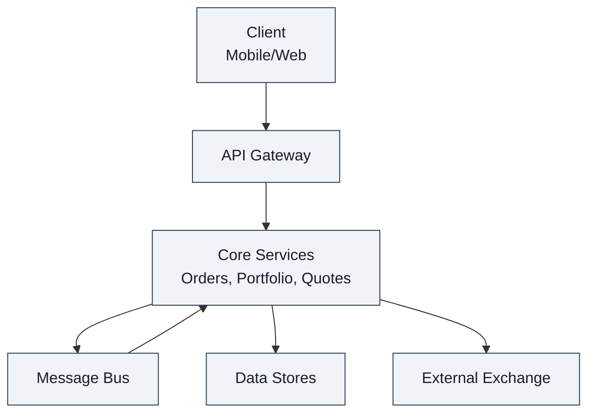
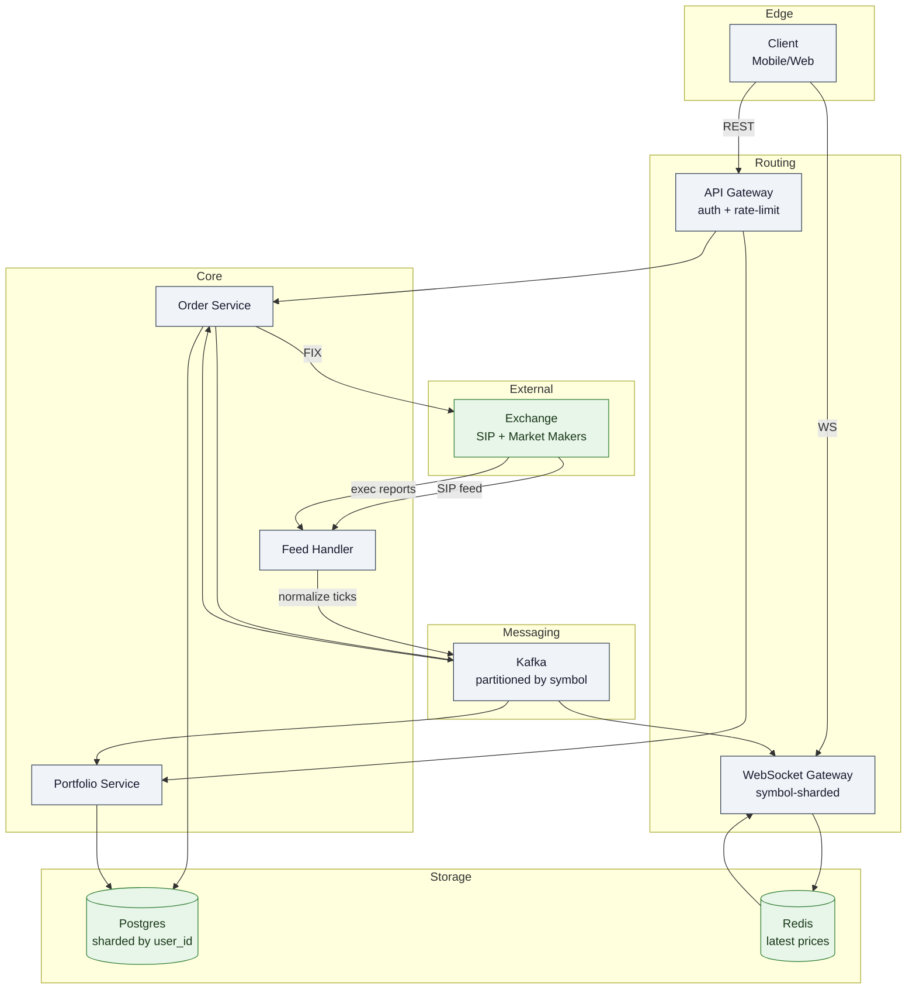

Stock trading platforms connect 23M+ retail investors to US equity markets, routing 15M orders a day through market makers and exchanges. Unlike an exchange — which maintains its own order book and matches buyers against sellers — a brokerage is a custody-and-routing layer.

<!--more-->

## 1. Problem

Stock trading platforms connect 23M+ retail investors to US equity markets, routing 15M orders a day through market makers and exchanges. Unlike an exchange — which maintains its own order book and matches buyers against sellers — a brokerage is a custody-and-routing layer. It holds customer cash and securities, validates every order against the user's buying power and regulatory constraints, then routes executions to external venues via FIX protocol sessions. The platform never matches orders internally; it is a regulated intermediary sitting between the user and the National Market System.

The hardest engineering tension is the asymmetry between reads and writes during peak events. At market open (9:30 AM ET), millions of users open the app simultaneously to check prices and place orders. The system must fan out 1M raw quote ticks per second across 5M concurrent WebSocket connections while processing order submissions that carry financial liability — a duplicate fill can cost real money, and a lost fill notification can trigger a regulatory filing.



## 2. Requirements

**Functional**

- FR1: View live stock prices with sub-second latency
- FR2: Place market and limit orders for stocks
- FR3: Cancel open orders
- FR4: View order history and fill details
- FR5: View portfolio holdings and daily P&L

**Non-functional**

- NFR1: Price delivery < 500ms from exchange tick to user display
- NFR2: Idempotent order placement — no duplicate fills on retry
- NFR3: 99.99% availability during market hours (6.5h window)
- NFR4: Survive 10x load spike at market open (9:30 AM ET)

*Out of scope: After-hours trading, ETFs/options/crypto, order book depth, social features, instant deposits.*

## 3. Back of the envelope

- **Quote fan-out:** 10K symbols × 100 ticks/s = 1M raw updates/s inbound. 5M concurrent users × 20 watched symbols = 100M active subscriptions. Naive per-user broadcast → 1M × 100M = 100T delivery events/s → physically impossible; fan-out is the primary bottleneck.
- **Order write peak:** 15M orders/day ÷ 6.5h trading window ÷ 3,600s × 10 (market-open multiplier) ≈ 6,400 writes/s → a single-partition OLTP store handles this; correctness under retry is the real constraint, not throughput.
- **Audit archive:** 15M orders/day × 1 KB per order event chain × 365 days × 7 years (SEC Rule 17a-4) ≈ 38 TB → not an OLTP bottleneck.

## 4. Entities

```
User {
  user_id:        uuid      PK
  cash_balance:   decimal(14,2)
  buying_power:   decimal(14,2)  ← margin-adjusted; == cash_balance for cash accounts
  created_at:     timestamp
}

Position {
  user_id:    uuid         PK  ← shard key
  symbol:     varchar(10)  PK
  qty:        decimal(18,8)
  avg_cost:   decimal(12,4)
  updated_at: timestamp
}

Order {
  order_id:         uuid         PK
  user_id:          uuid         FK  ← shard key
  idempotency_key:  uuid         CK
  symbol:           varchar(10)
  side:             smallint     ← enum: 0=buy, 1=sell
  type:             smallint     ← enum: 0=market, 1=limit
  qty:              decimal(18,8)
  limit_price:      decimal(12,4)  ← null for market orders
  status:           smallint     ← enum: queued, routed, filled, partial, cancelled, rejected
}

TaxLot {
  lot_id:       bigserial   PK
  user_id:      uuid        FK  ← shard key
  symbol:       varchar(10)
  qty:          decimal(18,8)
  cost_basis:   decimal(12,4)
  acquired_at:  date
  consumed_qty: decimal(18,8)
}
```

### API

- `POST /orders` — place a market or limit order, idempotent via `Idempotency-Key` header; returns `order_id` and initial status
- `GET /orders/{order_id}` — fetch single order with fill details and current status
- `DELETE /orders/{order_id}` — cancel an open order; no-op if already filled
- `GET /orders?status=open` — list orders for the authenticated user, cursor-paginated
- `GET /portfolio` — current positions, total value, day-change, unrealized P&L per symbol
- `WS /stream/prices?symbols=AAPL,TSLA` — subscribe to conflated price ticks for a symbol list
- `WS /stream/orders` — subscribe to order status changes and fill notifications

## 5. High-Level Design



#### FR1: View live stock prices

**Components:** Feed Handler, Kafka (partitioned by symbol), WebSocket Gateway cluster (sharded by `hash(symbol)`), Redis (latest-price cache per symbol), Client conflation buffer.

**Flow:**

1. The SIP (Securities Information Processor) consolidates quotes from all 17+ US exchanges and pushes trades via IP Multicast at ~1M ticks/sec peak across 10K symbols.
1. Feed Handler normalizes proprietary exchange formats to an internal schema and publishes each tick to a Kafka topic, keyed on symbol so all ticks for a symbol land on a single partition.
1. WebSocket Gateway nodes each own a contiguous range of the symbol space — a tick for AAPL arrives at exactly one gateway node regardless of which client is watching it.
1. The gateway node updates its local Redis cache with the latest price for that symbol, then iterates the in-memory subscriber list and pushes a delta-encoded JSON frame to each connected client.
1. The client renders the price. A per-symbol conflation timer (250ms default) suppresses intermediate ticks so the UI updates at ~4 frames/sec rather than 100/sec.

**Design consideration:** The gateway shards by symbol, not by user. A tick for AAPL generates exactly one cache write and as many WebSocket frames as there are current subscribers. Total work per tick is O(subscribers for this symbol), never O(total users). A hot symbol like TSLA with 1M concurrent watchers still hits one gateway node — the cluster can replicate that symbol across multiple nodes within the symbol range to spread the fan-out load.

#### FR2: Place and manage orders

**Components:** API Gateway (Nginx + Lua shard router), Order Service, Postgres (application-level shards by `user_id`), Kafka (order events), Order Router (FIX sessions to venues), Execution Service, Client WebSocket for status push.

**Flow:**

1. Client sends `POST /orders` with an `Idempotency-Key` header. The API Gateway maps `user_id` to a shard number via a lookup table and forwards the request to the Order Service in that shard.
1. Order Service opens a database transaction: it checks the idempotency key — if a matching order exists, return it immediately (retry-safe read). Otherwise, it validates the user's buying power, enforces PDT/position-limit rules, and inserts the order row with `status = queued`.
1. The service publishes an `OrderCreated` event to Kafka (partitioned by `user_id`) and returns `201 Created` with the `order_id` to the client.
1. An Order Worker in the same shard consumes the event, selects the best venue via the PFOF router (balancing price improvement for the client against the maker's rebate), and sends a FIX `NewOrderSingle` message to the chosen market maker.
1. The venue acknowledges receipt; the worker updates order status to `routed`.
1. When the venue fills the order (partial or full), it sends a FIX Execution Report back. The Execution Service - subscribed to the venue's trade-feed - maps the fill to the original order via the FIX `ClOrdID` field and publishes an `OrderFilled` event.
1. The Order Service consumes `OrderFilled`, transitions the order to `filled` or `partial`, updates `filled_qty` and `avg_fill_price`, and publishes a notification to the user's WebSocket channel.
1. For cancellation: `DELETE /orders/{order_id}` checks that the order is in a cancellable state (`queued` or `routed`), sends a FIX `OrderCancelRequest`, and transitions to `cancelled` on acknowledgment. If the fill raced ahead, the cancel is rejected — the user owns the shares.

**Design consideration:** Every order-submission path carries an idempotency key, and the check with insert happens inside a single database transaction. If the client's TCP connection drops after the server persisted the order but before the HTTP response arrived, the client retries with the same key and gets the original result — the order exists exactly once regardless of how many times the request was sent.

#### FR3: Cancel open orders

**Components:** Order Service, FIX Order Router, Order Worker.

**Flow:**

1. The client sends `DELETE /orders/{order_id}`. The shard router directs the request to the user's shard.
1. The Order Service reads the order row and checks its status. A `cancelled` or `filled` order returns immediately with its current state.
1. For an order in `queued` or `routed` state, the service sends a FIX `OrderCancelRequest` to the venue that holds the order and transitions the status to `cancelling`.
1. The venue responds with a `CancelAck` or a fill execution report — whichever arrives first determines the final state. If the fill wins the race, the order transitions to `filled` and the cancel response carries a `409 Conflict` with the fill details.

**Design consideration:** Cancellation is a fire-and-forget request with a race condition. The venue can fill the order between the time the cancel is sent and the acknowledgment arrives, and the user always owns the shares in that case. The system handles this by treating the venue's execution report as the authoritative event — a fill that races a cancel overwrites the cancel, not the other way around.

#### FR4: View order history and fill details

**Components:** Order Service, Postgres (user-sharded), cursor-based pagination.

**Flow:**

1. `GET /orders?status=open` returns all orders in an active state for the authenticated user, ordered by `created_at` descending, using a cursor over the `(user_id, created_at, order_id)` tuple.
1. `GET /orders/{order_id}` returns a single order with its full state machine history: the initial placement, routing details, fill executions (price, quantity, timestamp per fill), and current status.
1. Fill details are reconstructed from Kafka execution-report events consumed by the Order Service, stored as append-only child rows keyed to the parent order.

**Design consideration:** Order history is a single-shard read — all of a user's orders live in the user's shard. Cross-shard queries (admin dashboards, compliance scans) use the aggregation layer to fan out to all shards and merge results with a custom cursor format. The per-user path stays simple; the cross-user path pays the scatter-gather cost.

#### FR5: View portfolio holdings and P&L

**Components:** Portfolio Service (shard-local), Kafka order-fill topic consumer, Postgres positions table, Redis for active-session P&L cache, TaxLot ledger.

**Flow:**

1. The Portfolio Service consumes `OrderFilled` events from Kafka. On a buy fill, it upserts the `Position` row (incrementing `qty` and recalculating `avg_cost` on a weighted basis) and inserts a new `TaxLot` row with the filled quantity and cost basis. On a sell fill, it decrements the position and consumes tax lots in FIFO order, recording `consumed_qty` for realized gain/loss computation.
1. When a user opens the app, `GET /portfolio` reads their Position rows in one query (all co-located in the user's shard) and enriches them with the latest price from Redis to compute `current_value`, `day_change`, and `unrealized_pnl`.
1. For users with an active WebSocket session, the portfolio value is recomputed on every price tick for their held symbols — but only for those symbols, not the full universe. The recomputed value is pushed every 1-5 seconds (conflated) so the home-screen buying-power figure stays fresh.
1. At market close, a batch reconciliation job recalculates all P&L figures against official closing prices, flags discrepancies, and archives the immutable snapshot to the audit store.

**Design consideration:** Portfolio computation is user-scoped: all positions for a single user live in one shard, so the `GET /portfolio` query is a single-shard read with no cross-shard scatter-gather. The same shard holds the user's orders and tax lots, so the buy-to-position update is a local transaction. The only cross-shard dependency is the latest-price lookup, which hits the shared Redis cluster keyed by symbol — a bounded O(held-symbols) fan-out, not O(all-users).

## 6. Deep dives

### DD1: Real-time price distribution at scale

**Problem.** A raw market-data feed pushes 1M quote updates per second across 10K symbols. The user base holds 100M active subscriptions (5M users watching 20 symbols each at market open). A naive per-user broadcast loop would generate 100T delivery events per second — six orders of magnitude beyond feasible — while each individual user only needs updates for the symbols on their watchlist, and retail traders tolerate sub-second rather than microsecond precision.

**Approach 1: Per-user connection, per-client fan-out**

Each user opens a WebSocket. The streaming service, on receiving a tick for AAPL, iterates every connected user's watchlist to find AAPL watchers and pushes to each. The cost per tick is O(total users × average watchlist scan).

**Challenges:** At 5M connections, a single tick costs 5M watchlist-scans. With 1M ticks/sec, the system churns 5T scan operations per second. Network egress alone is 5M connections × 100 KB/s raw = 500 GB/s. The approach collapses below 100K concurrent users. Real brokerages abandoned this pattern in the early 2010s.

**Approach 2: Symbol-channel fan-out (invert the topology)**

Shard WebSocket gateway nodes by `hash(symbol)`. Each gateway owns a contiguous range of the symbol namespace and maintains a subscriber list per symbol in memory. A tick for AAPL arrives at exactly one gateway node (Kafka partition key = AAPL). The node does one Redis `SET` for the cache, then walks the subscriber list and pushes to each connection. Total work per tick: O(subscribers for this symbol).

```python
# Gateway per-symbol fan-out loop (conceptual — real impl uses async I/O)
def on_tick(symbol: str, price: float, timestamp: int):
    redis.set(f"price:{symbol}", json.dumps({"p": price, "t": timestamp}))
    for conn in subscribers[symbol]:
        if should_conflate(conn, symbol, timestamp):
            conn.send_frame({"symbol": symbol, "price": price, "ts": timestamp})
```

**Challenges:** A hot symbol like TSLA with 1M simultaneous watchers still hammers a single gateway node. The fix is **hot-symbol replication**: the gateway cluster assigns multiple nodes to overlapping symbol ranges when subscription counts cross a threshold. Each replica node independently maintains its subscriber list, and the Kafka partition fans out to all replicas via consumer groups or a separate fan-out topic. Redis becomes the shared truth for the latest price; the push loop is O(subscribers per node), and replicas divide the load.

**Decision.** Symbol-channel fan-out with hot-symbol replication and per-client conflation. The topology inversion is the single biggest architectural decision in the quote path — it converts an O(users × symbols × ticks) problem into O(symbols × ticks + subscribers × conflation_rate), which is bounded by network egress rather than CPU.

**Rationale.** The SIP already delivers ticks keyed by symbol. Partitioning Kafka by symbol aligns the inbound stream with the outbound topology: every consumer of a symbol's partition already sees the complete tick stream, so fan-out is a local, lock-free loop. Conflation cuts per-client bandwidth by 25x (100 raw ticks/sec → 4 pushed updates/sec) without detectable UX degradation for retail traders, who read prices, not tick-by-tick flicker. A 250ms conflation window matches the ~200ms human visual processing threshold — tighter than that is wasted bytes for a mobile screen.

**Edge cases:**

- **Symbol added to watchlist mid-session:** The WebSocket gateway subscribes the connection to the in-memory list for that symbol. The next conflated tick arrives within the window. No cold-start gap — the Redis cache always has the last known price.
- **Gateway node crash:** Clients on the failed node reconnect to the load balancer, which assigns them to a healthy replica for the same symbol range. The subscriber list is rebuilt from the new WebSocket handshake, which includes the watchlist. ~2-3 seconds of missed ticks, covered by the Redis cache snapshot on reconnect.
- **Market-wide volatility (circuit-breaker event):** The tick rate spikes 10x. The conflation timer is adaptive — when the event loop detects a growing backlog, the conflation interval coarsens from 250ms to 1s, trading freshness for throughput. Users see slightly coarser updates during the spike but no disconnections.

> [!TIP]
> **Key insight: shard by symbol, not by user.** The conventional WebSocket scaling playbook shards by user (sticky sessions). For a market-data workload, that guarantees every tick fans out to every node. Inverting the shard key to the symbol means each tick lands on exactly one node and fan-out is a tight, cache-local loop — the same insight that makes Kafka's partition model natural for this workload.

### DD2: Order idempotency and the state machine

**Problem.** An order is a financial obligation. A duplicate fill costs real money, and a lost fill notification affects portfolio accuracy and tax reporting. The system must guarantee exactly-once order placement across client retries (network timeouts, mobile app backgrounding) while maintaining correctness through partial fills, cancellations that race against fills, and exchange rejections after the order was accepted locally.

**Approach 1: Client-generated deduplication token**

The client generates a UUID and sends it as an `Idempotency-Key` header on `POST /orders`. The Order Service checks a unique constraint on `(user_id, idempotency_key)` before inserting. If the key exists, return the existing order — no side effects, no second FIX message.

**Challenges:** This handles client-retry duplicates but doesn't protect against the exchange processing the same FIX message twice due to a transport-level replay. It also doesn't prevent two concurrent requests with different idempotency keys from both passing the buying-power check before either commits — the classic write-skew on cash balance.

**Approach 2: Serialized per-user ordering with atomic balance check**

All order-submission requests for a given user are routed to a single partition — the user's application shard. Within that partition, the Order Service acquires a row-level lock on the user's cash-balance row (`SELECT ... FOR UPDATE`) before validating buying power. The idempotency-key unique constraint catches retries; the row lock serializes concurrent submissions so two orders cannot both pass the balance check.

```sql
BEGIN;
-- Lock the user's balance row to serialize concurrent orders
SELECT buying_power FROM users WHERE user_id = $1 FOR UPDATE;
-- Check: sufficient buying power for this order?
-- (buy order: cash needed = qty * limit_price; sell: enough shares)
INSERT INTO orders (order_id, user_id, idempotency_key, symbol, ...)
VALUES ($2, $1, $3, ...)
ON CONFLICT (user_id, idempotency_key) DO NOTHING;
-- If INSERT returned 0 rows → idempotency hit → return existing order
-- Deduct buying power (for buy orders) to reflect reserved funds
UPDATE users SET buying_power = buying_power - $4 WHERE user_id = $1;
COMMIT;
```

**Challenges:** The `SELECT ... FOR UPDATE` serializes all orders for a user onto a single DB row lock. For active traders submitting dozens of orders per minute, this becomes a contention point. The lock also ties order submission to the DB transaction latency (~5-10ms for a local Postgres shard), which is acceptable — retail order flow is not HFT.

**Approach 3: Double-entry ledger for end-to-end reconciliation**

Even with idempotency and locking, gaps exist: the exchange may reject an order after the balance was deducted, or a fill may arrive after a cancellation was acknowledged (the race the user always loses). A double-entry ledger records every financial movement as a pair of immutable rows — every debit (cash deduction) is balanced by a credit (share acquisition, fee income, or a reversal). The ledger is append-only; rows are never updated or deleted.

```javascript
Transaction
  debit:  user_123_cash      -4,876.50   (100 shares AAPL × $48.765 avg)
  credit: user_123_AAPL_shares  +100      (acquired at $48.765 cost basis)
  -----------------------
  net:                        0.00
```

At end-of-day reconciliation, the system sums all ledger entries per user and compares against the current positions table and cash balance. Any non-zero net indicates a bug — a fill that arrived after cancel, a balance deduction that wasn't reversed on rejection, or a fractional-share rounding drift. The ledger is the source of truth; the positions table is a materialized view that can be rebuilt from the ledger.

**Decision.** Approach 1 (idempotency key) as the client-facing correctness primitive + Approach 2 (row-lock serialization) for the write path + Approach 3 (double-entry ledger) as the reconciliation backstop. Each layer catches a different failure mode: idempotency catches client retries, serialization catches concurrent submissions, and the ledger catches any residual inconsistency.

**Rationale.** The idempotency-key pattern is a well-proven mechanism in payments infrastructure — every system that accepts financial transactions over an unreliable network faces the same retry-duplication problem and converges on this approach. The per-user serialization is a natural consequence of application-level sharding: each user's data already lives in exactly one shard, so the row lock has no cross-shard coordination cost. The double-entry ledger is financial industry standard — every brokerage and bank uses it not as a hot-path optimization but as a correctness invariant that makes bugs detectable and repairable.

**Edge cases:**

- **Client retry after server persisted but response was lost:** Idempotency key matches existing order → server returns the original `order_id` and status. No second FIX message is sent.
- **Cancel races against fill:** The venue fills the order and sends the execution report concurrently with the cancel request. The execution report wins — the order transitions to `filled`, the cancel returns a `409 Conflict` with the fill details, and the user owns the shares. The client can immediately submit a sell order if needed.
- **Exchange reject after local balance deduction:** The Order Worker receives a `Reject` execution report. It reverses the balance deduction (credit to cash, debit from a suspense account) and transitions the order to `rejected`. The ledger records both the original deduction and the reversal — the net is zero, and the audit trail is complete.

> [!TIP]
> **Key insight: the ledger is the source of truth, not the order table.** The order table answers "what state is this order in right now?" The ledger answers "what happened to this user's money and shares?" A missing fill means the ledger won't balance at end-of-day reconciliation — the positions say one thing, the cash says another, and the ledger exposes the gap. This is how real brokerages catch the cancel-that-raced-a-fill scenario before it becomes a regulatory problem.

### DD3: Portfolio computation and tax-lot accounting

**Problem.** A user's portfolio value changes on every price tick for every held symbol. For 5M concurrent users holding an average of 5 symbols each, that's 25M position-value recomputations per tick — 100M per second at peak if pushed tick-by-tick. The system must deliver fresh portfolio values to the home screen while also maintaining tax-lot-level cost-basis tracking accurate enough for IRS Form 1099-B reporting, including wash-sale adjustments across a 61-day window.

**Approach 1: Compute on every read**

On `GET /portfolio`, the service reads all Position rows, fetches latest prices from Redis for each held symbol, computes P&L inline, and returns. No precomputation, always correct as of the last price tick.

**Challenges:** For a user holding 50 symbols (unusual but possible), the read path does 51 queries (1 positions query + 50 Redis `GET`s). At 5M concurrent users refreshing every few seconds, the Redis load is 250M reads/sec — far above what a single cluster handles. Plus, the mobile home screen expects a live buying-power figure that updates without a manual refresh.

**Approach 2: Push-based recomputation for active sessions**

For users with an active WebSocket, the Portfolio Service subscribes to the price tick stream filtered to only the symbols the user holds. On each tick for a held symbol, it recomputes that position's current value (`qty × price`), updates a running total, and pushes a conflated portfolio snapshot every 1-5 seconds. Inactive users (no WebSocket) get a stale snapshot from the last DB write.

```python
# Portfolio push loop per connected user
class PortfolioPusher:
    def on_tick(self, user_id, symbol, price):
        pos = self.positions[user_id].get(symbol)
        if not pos:
            return  # user doesn't hold this symbol
        pos.current_value = pos.qty * price
        pos.day_change = pos.qty * (price - pos.prev_close)
        self.total_value[user_id] = sum(p.current_value for p in self.positions[user_id].values())
        if self.should_push(user_id):
            self.ws.send(user_id, {
                "total_value": self.total_value[user_id],
                "buying_power": self.balances[user_id],
                "positions": [p.snapshot() for p in self.positions[user_id].values()]
            })
```

**Challenges:** The push model requires the portfolio service to maintain per-user state (positions, latest prices) in memory, which demands careful shard alignment — the portfolio service must live in the same shard as the user's data so the state is local. For users with large portfolios, the recomputation per tick is heavier. And the model doesn't address tax-lot accounting, which is the harder correctness problem.

**Approach 3: Tax-lot allocation with FIFO consumption**

Each buy fill creates a tax lot: `(user_id, symbol, qty, cost_basis, acquired_at)`. Each sell fill consumes tax lots in FIFO order — the earliest-acquired shares are considered sold first. The realized gain/loss for tax reporting is `(sale_price × sold_qty) - SUM(consumed_lot.cost_basis × consumed_qty)`. The system must also track wash sales: if the user buys the same security within 30 days before or after selling at a loss, the loss is disallowed and the disallowed amount is added to the replacement lot's cost basis.

**Decision.** Approach 2 (push-based recomputation) for the real-time user-facing P&L display, with Approach 3 (tax-lot accounting) running as a batch process on each fill event, not on every price tick. Tax-lot consumption is a write-side concern — it happens once on fill, not 100 times/sec on every price change. Portfolio value recomputation is a read-side concern — it happens on every relevant price tick but only for active sessions.

**Rationale.** Decoupling the two concerns is the key design move. Tax-lot allocation is correctness-critical and infrequent (15M fills/day, not 1M ticks/sec) — it runs in the same DB transaction that records the fill. Portfolio recomputation is latency-tolerant (1-5 second push interval) and can use approximate prices from Redis rather than the official consolidated tape. At market close, the batch reconciliation corrects any drift between the approximate real-time view and the authoritative closing-price calculation.

**Edge cases:**

- **Fractional shares:** A user buys $10 of AAPL (not exactly 1 share). The brokerage aggregates fractional orders into whole-share parent orders sent to the venue, then apportions the fill back to users pro-rata. The tax-lot records the exact apportioned quantity and cost basis. Daily T+1 reconciliation catches rounding drift.
- **Wash-sale window:** A sell at a loss on June 1 and a buy on June 20 (within 30 days) triggers wash-sale adjustment. The system flags the sell lot, finds the replacement buy lot within the 61-day window, and adds the disallowed loss to the replacement lot's cost basis. This is a batch job that runs after market close, not a real-time check — the 1099-B is filed once a year.
- **Position goes to zero:** A user sells all shares. The position row is not deleted — `qty` becomes 0 and `avg_cost` is preserved for historical display and realized P&L calculation. The portfolio push shows the realized gain and removes the symbol from the active watch set.

> [!TIP]
> **Key insight: portfolio value is a read-side concern; tax-lot accounting is a write-side concern.** They happen at different frequencies (every price tick vs every fill), have different correctness requirements (approximate vs exact), and should not be coupled. The real-time P&L number on the home screen can be off by a tick's worth of price movement; the cost basis on the 1099-B cannot be off by a penny.

### DD4: Pre-trade risk and order consistency under failure

**Problem.** Before an order reaches the exchange, the system must validate it against multiple constraints: sufficient buying power, Pattern Day Trader (PDT) rule compliance, position limits, and regulatory sanctions screening. These checks must complete in under 10ms to keep order-placement latency acceptable, and they must be atomic with the order submission — a user submitting two orders in rapid succession must not have both pass the balance check before either deducts from it.

**Approach 1: Inline checks in the Order Service**

The Order Service performs all validations inside the order-submission database transaction: read buying power with `FOR UPDATE`, check PDT counters, validate OFAC sanctions list, then deduct and insert. Everything is synchronous and DB-backed.

**Challenges:** The risk checks grow in number and complexity over time — PDT requires querying a rolling 5-day window of day trades, sanctions screening hits an external service, and position limits depend on the current portfolio state. Packing all of this into a single DB transaction stretches the lock duration and couples the order path to every risk subsystem.

**Approach 2: In-memory pre-trade risk engine**

A dedicated Risk Engine maintains an in-memory cache of per-user buying power, day-trade counts, and position state — updated by consuming the same Kafka order-fill stream that feeds the Portfolio Service. On order submission, the Order Service calls the Risk Engine synchronously (RPC, <2ms overhead). The Risk Engine responds with an accept/reject decision and the reserved amount. If accepted, the Order Service proceeds with the DB transaction and deducts the reserved amount.

```javascript
Order Service                     Risk Engine (in-memory)
     │                                  │
     │── CheckRisk(user_id, order)──►   │
     │                                  │  buying_power = cache[user_id]
     │                                  │  day_trades   = cache[user_id].dt_count
     │                                  │  if order.value > buying_power → REJECT
     │                                  │  if dt_count >= 3 AND balance < 25K → REJECT
     │                                  │  cache[user_id].buying_power -= order.value  (optimistic)
     │◄── ACCEPT(reserved=4850.00) ──   │
     │                                  │
     │  BEGIN;                          │
     │  SELECT ... FOR UPDATE;  -- re-validate against DB truth
     │  INSERT order;                   │
     │  UPDATE buying_power;            │
     │  COMMIT;                         │
     │                                  │
     │── ConfirmRisk(user_id, order_id, success=true) ──►│
     │                                  │  (already deducted; confirm)
     │                                  │
     │  -- OR on failure:               │
     │── ConfirmRisk(user_id, order_id, success=false) ─►│
     │                                  │  cache[user_id].buying_power += order.value  (rollback)
```

**Challenges:** The in-memory cache can diverge from DB truth — a fill that arrived between the risk check and the DB `SELECT ... FOR UPDATE` might change the user's position state. The DB-level re-validation catches this divergence (the `FOR UPDATE` reads the authoritative balance), but the Risk Engine must be corrected afterward. This is acceptable because the DB is the final arbiter; the Risk Engine is an optimization that rejects obviously invalid orders fast, not a correctness boundary.

**Approach 3: Fencing tokens for out-of-order event processing**

When the exchange sends execution reports asynchronously, they may arrive out of order relative to the order-submission events in Kafka. A fill for an order that the local system has not yet persisted (due to a Kafka consumer lag or partition rebalance) could be processed before the order row exists. The system uses a **fencing token** — a monotonic version number per user — embedded in every order event. The Execution Service checks that the order's fencing token matches the current version in the database before applying the fill, preventing a stale execution report from overwriting a newer order state.

**Decision.** Approach 2 (in-memory risk engine with DB re-validation) for the pre-trade path, with fencing tokens (Approach 3) embedded in the Kafka event stream for ordering guarantees on the async execution-report path.

**Rationale.** The in-memory risk engine cuts the 95th-percentile order-submission latency from ~15ms (full DB read + validation) to ~3ms (RPC to in-memory cache) — the DB `SELECT ... FOR UPDATE` still runs, but the risk rejection happens before the DB transaction even opens, so obviously invalid orders (insufficient funds, PDT violation) never acquire a row lock. The fencing token is the standard Kafka event-sourcing pattern for handling late-arriving events: it's a lightweight integer check that prevents a consumer processing an event from a stale partition from corrupting the materialized state.

**Edge cases:**

- **Risk Engine restart (cold cache):** On startup, the Risk Engine replays the Kafka order-fill stream from a compacted topic to rebuild its in-memory state. During the replay window (seconds), it responds with `UNCERTAIN` — the Order Service falls back to the full DB validation path rather than trusting an incomplete cache.
- **Risk Engine false reject (cache stale):** The DB re-validation overrides the risk decision. The DB `SELECT ... FOR UPDATE` always reads the authoritative balance. If the in-memory cache was stale and rejected a valid order, the fallback path catches it — the cost is a few extra milliseconds for that one order.
- **Fencing token mismatch:** The Execution Service receives a fill with fencing token `v=5` but the user's current version in DB is `v=7`. The fill is for a stale order — the system writes it to a dead-letter topic for manual review rather than applying it. A human operator either links it to the correct order or flags it as a venue-side error.

> [!WARNING]
> **Cost: the Risk Engine adds a second source of truth for buying power.** The DB and the in-memory cache must be kept in sync via the Kafka stream. During a stream-processing lag (partition rebalance, consumer restart), the cache drifts and the system falls back to DB-only validation — acceptable because it's a performance degradation, not a correctness failure, but it means the latency guarantee is soft, not hard.

## 7. Trade-offs

| Decision | Chosen | Alternative | Why |
|---|---|---|---|
| Symbol-sharded WebSocket gateways | Symbol as shard key; each tick fan-out is O(subscribers) | User as shard key; each tick fan-out is O(all users) | Inverting the shard key cuts fan-out work from 100T/s to 100M/s. The hot-symbol replication pattern handles skew. |
|---|---|---|---|
| Application-level sharding on Postgres | 10 shards, each a full stack (app + DB + cache + Kafka consumers) | Distributed SQL (CitusDB, CockroachDB) | Blast-radius isolation: a single shard failure affects ~10% of users, not 100%. Shard-level deploys without global schema changes. |
|---|---|---|---|
| Idempotency key + `SELECT FOR UPDATE` | Client-generated UUID checked inside DB transaction | Distributed lock manager (Redis Redlock, ZooKeeper) | No extra infrastructure. The order shard already serializes per-user writes; the row lock is free. |
|---|---|---|---|
| Real-time P&L (push) + batch reconciliation | Push conflated portfolio snapshots to active sessions; correct at market close | Compute on every read with no precomputation | 100M position-value recomputations per second on read is infeasible. Push limits work to users who are actually watching. |
|---|---|---|---|
| Kafka as the internal event backbone | All inter-service state changes flow through Kafka, partitioned by domain key | Direct RPC between services | Decouples order routing, portfolio updates, and risk checks. Survives individual service restarts without data loss. |
|---|---|---|---|
| Conflation (250ms window) for price updates | Push at most 4 updates/sec per symbol per client | Push every tick at full rate (~100/sec) | Cuts bandwidth 25x without UX degradation. Retail traders read prices, not ticker tape. |

## 8. References

1. [How We Scaled Robinhood's Brokerage System for Greater Reliability](https://medium.com/robinhood-engineering/how-we-scaled-robinhoods-brokerage-system-for-greater-reliability-cfa6542bacef) — Robinhood Engineering Blog
1. [Faust: Stream Processing for Python](https://medium.com/robinhood-engineering/faust-stream-processing-for-python-a66d3a51212d) — Robinhood Engineering Blog
1. [Tracking Temporal Data at Robinhood](https://medium.com/robinhood-engineering/tracking-temporal-data-at-robinhood-b62291644a31) — Robinhood Engineering Blog
1. [Robinhood's Kafka Architecture](https://factorhouse.io/articles/robinhood-kafka-architecture) — Factor House (based on Kafka Summit talks)
1. [Preventing Fraud at Robinhood Using Graph Intelligence](https://www.robinhood.com/us/en/newsroom/preventing-fraud-at-robinhood-using-graph-intelligence) — Robinhood Engineering
1. [CTA SIP — Consolidated Tape Association](https://www.ctaplan.com/) — CTA Plan (official)
1. [UTP SIP Capacity](https://utpplan.com/PageParts/Overview.html) — UTP Plan (official)
1. [Robinhood SEC Rule 606 Disclosure (Q1 2020)](https://cdn.robinhood.com/assets/robinhood/legal/RHS%20SEC%20Rule%20606A%20and%20607%20Disclosure%20Report%20Q1%202020%20-%20Amended.pdf) — Robinhood (regulatory filing)
1. [Exactly-Once Semantics in Apache Kafka](https://www.confluent.io/blog/exactly-once-semantics-are-possible-heres-how-apache-kafka-does-it/) — Confluent
1. [Payment for Order Flow — Congressional Research Service](https://www.congress.gov/crs-product/IF12594) — U.S. Congress
