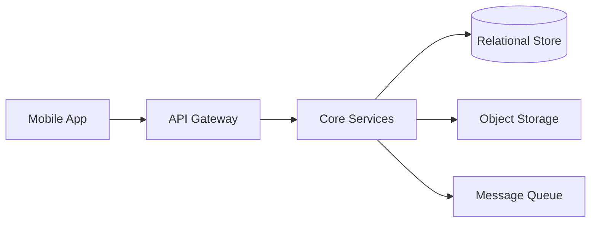
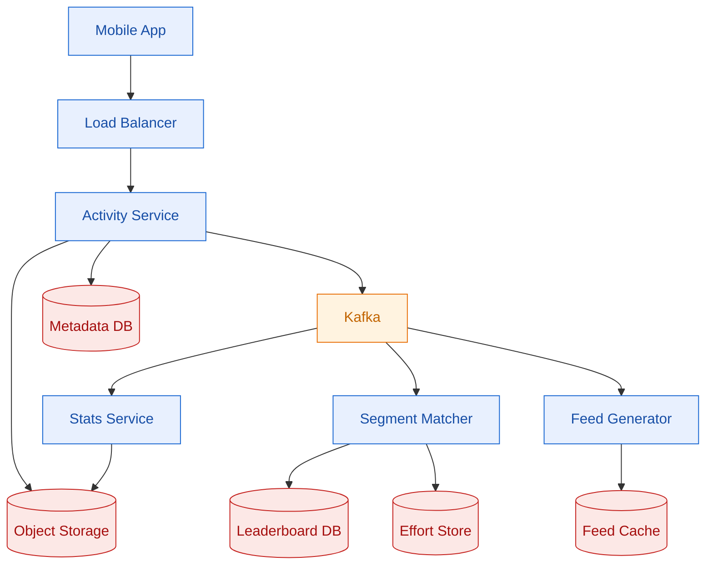

Strava lets athletes record, share, and compete over GPS-tracked activities at a scale where 10 million runs and rides arrive every day.

<!--more-->

## 1. Problem

Strava lets athletes record, share, and compete over GPS-tracked activities at a scale where 10 million runs and rides arrive every day. The core tension is that every upload triggers a cascade of heavyweight computation — segment matching against 30 million routes, leaderboard re-ranking, and feed fan-out to followers — but the athlete expects their effort to appear in the leaderboard within seconds and their friends' feeds within minutes. Offline recording in dead zones adds idempotency pressure: a phone that records a 3-hour trail run in airplane mode retries the upload hours later, and the server must accept it exactly once. The read path is even hotter — 100:1 reads to writes — so leaderboards and feeds must be served from pre-computed materializations, not ad-hoc queries across 70 billion segment-effort rows.



## 2. Requirements

**Functional**

- FR1: Record GPS-tracked activities while offline
- FR2: Upload completed activities for storage and processing
- FR3: View a feed of followed athletes' activities
- FR4: Compare segment performance on filtered leaderboards
- FR5: Give kudos and comment on activities
- FR6: Discover routes and view personal heatmaps

**Non-functional**

- NFR1: No recorded activity is lost; upload acceptance rate 99.9%
- NFR2: Leaderboard top-100 P99 under 200ms for any filter
- NFR3: Feed first page of 20 activities P99 under 500ms
- NFR4: Segment matching completes within 60 seconds of upload

*Out of scope: Real-time live tracking, social login and auth, payment and subscription, challenge creation flow, third-party device sync (Garmin/Wahoo).*

## 3. Back of the envelope

- **Write peak:** 10M activities/day / 86,400 s x 5 (Sunday spike) ~ 580 uploads/s — each upload triggers 3-8 segment matches; the combined effort-write volume (~4,600 writes/s) is the throughput bottleneck.
- **GPS stream volume:** 10M x 10,000 points x 100 bytes ~ 10 TB/day raw — a full year of raw streams is ~3.6 PB; keeping it all in hot storage is uneconomical.
- **Leaderboard hot set:** 30M segments x top-1000 entries x 60 bytes/entry ~ 1.8 TB — storing the full dataset in memory is expensive at this footprint.

## 4. Entities

```
User {
  user_id:       uuid        PK
  username:      string      CK
  display_name:  string
  gender:        enum        -- male, female, other; nullable
  weight_kg:     decimal(4,1) -- nullable; used for weight-class leaderboards
  birth_year:    integer     -- nullable; used for age-group leaderboards
  created_at:    timestamp
}

Activity {
  activity_id:   uuid        PK
  user_id:       uuid        FK
  upload_key:    string      CK  -- client-generated idempotency UUID
  activity_type: enum        -- run, ride, hike, swim, etc.
  start_time:    timestamp
  elapsed_secs:  integer
  distance_m:    integer
  polyline:      text        -- encoded polyline of the clean (privacy-clipped) trace
  raw_stream_key: string     -- S3 key for the raw, unclipped GPS stream
  status:        enum        -- processing, ready, flagged
  created_at:    timestamp
}

Segment {
  segment_id:    uuid        PK
  name:          string
  polyline:      text        -- reference trace as encoded polyline
  h3_cells:      string[]    -- H3 resolution-11 cells covering the segment; GIN-indexed for spatial pre-filter
  distance_m:    integer
  climb_m:       integer
  created_by:    uuid        FK -- user_id
}

SegmentEffort {
  effort_id:     uuid        PK
  segment_id:    uuid        FK
  activity_id:   uuid        FK
  user_id:       uuid        FK
  elapsed_secs:  integer     -- time on this segment
  start_offset:  integer     -- seconds into the activity
  matched_at:    timestamp
}

Follow {
  follower_id:   uuid        PK  FK
  followed_id:   uuid        PK  FK
  created_at:    timestamp
}
```

### API

- `POST /activities` — upload an activity file (FIT/GPX), returns `activity_id`
- `GET /activities/{id}` — activity detail, summary stats, matched segments
- `GET /activities/{id}/stream` — paginated GPS stream points in polyline or JSON
- `GET /feed` — paginated activity feed for the authenticated user
- `GET /segments/{id}/leaderboard` — leaderboard with optional `?age_group=&gender=&weight_class=&year=` filters
- `POST /activities/{id}/kudos` — give kudos to an activity
- `POST /activities/{id}/comments` — add a comment on an activity

## 5. High-Level Design



#### FR1: Record and upload an activity

**Components:** Mobile app, Activity Service, Object Storage (S3), Metadata DB (MySQL/PostgreSQL), Kafka.

**Flow:**

1. Mobile app records GPS at 1 Hz into a local SQLite buffer, flushing every 30 seconds for crash safety.
1. On stop, the app serializes the track into a FIT file (~50 KB compressed for a 1-hour run) and assigns a client-generated `upload_key` (UUID).
1. The file uploads via `POST /activities` with the `upload_key` header. If the client loses connectivity mid-upload, it retries with the same key.
1. The Activity Service checks `upload_key` against a dedup set in the Metadata DB. A duplicate returns `200 OK` with the existing `activity_id` — the upload is idempotent.
1. On first receipt: the service writes activity metadata (type, start time, elapsed time, distance) to the Metadata DB, stores the raw GPS stream as a gzipped object in S3 keyed by `activity_id`, and publishes an `activity.created` event to Kafka partitioned by `user_id`.
1. The HTTP response returns immediately after the DB write and Kafka publish — the caller does not wait for segment matching or feed fan-out.

**Design consideration:** The upload path is deliberately shallow — accept, dedup, store, publish, respond. All heavy processing (segment matching, leaderboard update, feed fan-out, stats recomputation) happens asynchronously behind Kafka. This keeps the upload endpoint fast (P99 under 1s for the 50 KB file + metadata write) and decouples the mobile client from downstream pipeline latency. If Kafka is unavailable, the service buffers events to a local write-ahead log and replays on recovery — the system favors availability over immediate processing.

#### FR2: View an activity

**Components:** Activity Service, Metadata DB, Object Storage, SegmentEffort Store.

**Flow:**

1. `GET /activities/{id}` hits the Activity Service.
1. The service reads activity metadata from the Metadata DB (indexed by `activity_id`).
1. If `status` is `ready`, it also fetches the matched segment efforts from the Effort Store and attaches them to the response.
1. The polyline for rendering the map trail is returned inline from the metadata row (encoded, ~500 bytes for a compressed trace). The full raw stream lives at `GET /activities/{id}/stream`.

**Design consideration:** The activity detail response includes the clean polyline — the privacy-zone-clipped version — not the raw trace. Raw GPS data (exact start/end coordinates that might reveal a home address) is stored in S3 and never returned directly to other users. The stream endpoint paginates by distance or time offset and honors privacy controls at the application layer.

#### FR3: View activity feed

**Components:** Feed Service, Feed Cache (Redis), Metadata DB, Activity Grouping Service.

**Flow:**

1. `GET /feed?cursor=<opaque>` hits the Feed Service.
1. The service reads the athlete's pre-computed feed from the Feed Cache — a Redis sorted set keyed by `feed:{user_id}`, scored by `activity.start_time`, storing `activity_id` members.
1. For the first page, it fetches the top 20 `activity_id`s and bulk-loads activity metadata from the Metadata DB.
1. The Activity Grouping Service decorates the feed: activities that cover the same route within a close time window are merged into a single "Athlete A and 3 others" card. This grouping uses MinHash signatures computed during ingestion, compared pairwise at read time (~40ms for 200 activities).
1. A `cursor` token encodes the last-seen score, enabling stable pagination through a moving feed.

**Design consideration:** The feed is a hybrid fan-out. For athletes with fewer than 5,000 followers, each new activity is pushed into followers' feed caches at write time via the Feed Generator consuming Kafka. For athletes with more than 5,000 followers (professionals, celebrities), the push is skipped — their activities are pulled at read time from the Metadata DB and merged into the follower's feed on the fly. See DD3 for the full mechanism.

#### FR4: Browse segment leaderboards

**Components:** Leaderboard Service, Leaderboard DB (ScyllaDB), Leaderboard Cache (Redis).

**Flow:**

1. `GET /segments/{id}/leaderboard?age_group=30-39&gender=male` hits the Leaderboard Service.
1. The service first checks Redis for a cached top-100 for this segment+filter combination. On cache hit, returns immediately.
1. On cache miss, it queries the Leaderboard DB: `SELECT user_id, elapsed_secs, effort_id FROM leaderboards WHERE segment_id = ? AND leaderboard_type = ? ORDER BY elapsed_secs LIMIT 100`. The leaderboard type encodes the filter combination as an integer enum.
1. The result is hydrated with user display names from the Metadata DB, cached in Redis with a 5-minute TTL, and returned.

**Design consideration:** Leaderboards are denormalized at write time — every new segment effort triggers a materialized insert into the Leaderboard DB, pre-sorted by elapsed time. Reads scan only the top of the sorted partition; no GROUP BY or re-sort at query time. Filtered views (age group, gender, weight class, year) are separate leaderboard types, each materialized independently during the write path (see DD2). The trade-off is write amplification: a single effort may insert into 4-6 leaderboard types, but reads stay O(1) index scans.

#### FR5: Give kudos and comment

**Components:** Social Service, Metadata DB, Notification Service.

**Flow:**

1. `POST /activities/{id}/kudos` arrives at the Social Service with the authenticated `user_id`.
1. The service inserts a row into the `kudos` table (activity_id, user_id, created_at) in the Metadata DB using an `INSERT ... ON CONFLICT DO NOTHING` for idempotency.
1. It increments a denormalized `kudos_count` on the activity row.
1. A `social.interaction` event is published to Kafka, consumed by the Notification Service, which pushes an in-app notification to the activity owner.
1. Comments follow the same path with a `comments` table and a `comments_count` counter.

**Design consideration:** Kudos and comments are eventually consistent with the feed. The feed card shows the count at the time the feed was cached, not the real-time count. A separate WebSocket channel pushes real-time count updates to clients viewing the activity detail page, but the feed does not re-render on every kudos.

#### FR6: Discover routes and view heatmaps

**Components:** Route Service, Segment Store, Heatmap Service, Object Storage.

**Flow:**

1. A route discovery query (e.g., "10K loops near me") hits the Route Service, which queries the Segment Store with a bounding-box spatial index on `h3_cells` and filters by `distance_m` and `climb_m`.
1. The personal heatmap query aggregates the athlete's activity polylines from the Metadata DB (last 2 years) and renders a tile overlay — a sparse grid where each tile's opacity encodes activity count on that tile.
1. The global heatmap is pre-computed offline via a Spark batch job that reads all public activity polylines from S3, rasterizes them at zoom level 16 using Bresenham's line algorithm, and writes tiles to a CDN-backed S3 bucket.

**Design consideration:** Heatmaps are rebuilt periodically (monthly for global, weekly for personal), not updated in real time. The personal heatmap uses a two-tier storage strategy: recent activities (last 30 days) live in a Redis bitmap for fast tile lookups; older activity data is merged into S3-backed tiles during a weekly compaction job.

## 6. Deep dives

### DD1: GPS ingestion pipeline

**Problem.** A mobile phone recording at 1 Hz generates 3,000-10,000 timestamped lat/lon/altitude tuples per activity. The raw data is noisy — urban canyons bounce signals, tree cover drops samples, a phone in a pocket loses accuracy. Uploads happen over unreliable mobile networks, often hours after recording in areas with no connectivity. The server must accept each upload exactly once (client retries with the same idempotency key), strip GPS noise, compress the trace by two orders of magnitude, and clip privacy zones before any downstream consumer — feed, leaderboard, or heatmap — sees the data. Raw GPS volume at 10M activities/day is ~10 TB/day; keeping it all hot is uneconomical, so tiering must be built into the pipeline.

**Approach 1: Synchronous pipeline**

The upload endpoint runs validation, noise filtering, compression, and privacy clipping inline before returning a response to the client. The client blocks until all processing completes.

**Challenges:** Couples upload latency to every processing stage. A slow Kalman filter pass or a spike in upload volume increases P99 latency linearly. A transient failure in any stage causes the upload to fail, forcing the client to retry the entire payload. Privacy clipping running synchronously means the raw trace is never persisted — if the clip logic has a bug, data is permanently lost. At 580 uploads/s peak, the synchronous pipeline requires the upload service to scale with processing capacity, not just acceptance capacity.

**Approach 2: Fire-and-forget with best-effort dedup**

The upload is accepted and acknowledged immediately with a 202. Processing happens asynchronously on a best-effort queue with no ordering guarantees. Deduplication is handled by a Bloom filter in front of the Metadata DB — if the Bloom filter reports "seen," the upload is silently dropped.

**Challenges:** A Bloom filter has a false-positive rate. At 10M uploads/day with a 0.1% FP rate, ~10,000 legitimate activities are silently discarded per day — athletes lose their runs. A false negative (the Bloom filter says "new" when the key is actually a duplicate) causes the activity to be processed twice, producing duplicate segment efforts on the leaderboard. No ordering guarantees means a retried upload might arrive before the original, and the pipeline must handle out-of-order processing for the same activity.

**Approach 3: Idempotent acceptance with staged processing**

The upload endpoint does exactly three things synchronously: (1) check an exact dedup set (Redis with TTL matching the processing window + a DB unique constraint on `upload_key`), (2) insert activity metadata into the Metadata DB, (3) store the raw GPS stream in S3, (4) publish an `activity.created` event to Kafka partitioned by `user_id`. Everything else — noise filtering, compression, privacy clipping, segment matching, leaderboard materialization — runs as Kafka consumers in separate processing stages. Each stage reads from one topic, processes, and writes to the next.

```json
// Stage 1: activity.created event payload
{
  "activity_id": "a1b2c3d4",
  "user_id": "u5e6f7g8",
  "upload_key": "uk-9h0i1j2",
  "raw_stream_key": "s3://strava-streams/a1/b2/a1b2c3d4.gz",
  "activity_type": "run",
  "start_time": "2026-07-01T06:30:00Z",
  "device_type": "iphone15"
}
```

The processing stages form a pipeline:

```javascript
activity.created -> [Stage A: Filter & Compress] -> activity.processed
activity.processed -> [Stage B: Privacy Clip] -> activity.clean
activity.clean -> [Stage C: Segment Match] -> effort.matched
effort.matched -> [Stage D: Leaderboard Materialize]
```

Each stage publishes a new event on completion, carrying the results of its processing. A stage failure retries the event; a poison message (malformed GPS data) is shunted to a dead-letter topic for manual inspection instead of blocking the pipeline.

**Normal path:** A 1-hour run uploads at 06:35. The upload endpoint accepts it in ~200ms. Stage A (Kalman filter + polyline encoding) completes in ~2 seconds. Stage B (privacy clipping) runs in ~100ms. Stage C (segment matching against H3 pre-filter + DTW) completes in ~15 seconds for 3-5 matched segments. Stage D (leaderboard inserts) completes in ~500ms. Total pipeline latency: under 30 seconds from upload to leaderboard visibility.

**Stale-worker path:** If the Segment Matcher is deploying when the event arrives, the Kafka consumer group rebalances, and the event is re-processed by a new worker. Because the processing is idempotent (each stage checks if its output already exists before computing), re-processing produces the same result at no correctness cost — only latency increases.

**Edge case — offline sync:** A trail runner records a 4-hour activity in airplane mode. On reconnect 6 hours later, the phone uploads with the original `upload_key`. The dedup set has long since expired from Redis, but the DB unique constraint on `upload_key` catches the duplicate. The server returns the existing `activity_id` and the client shows the already-processed activity.

**Decision.** The staged pipeline (Approach 3) wins. Synchronous processing (Approach 1) couples upload latency to pipeline depth and wastes mobile battery on retries. The Bloom-filter shortcut (Approach 2) trades correctness for throughput at a cost of thousands of lost activities per day — unacceptable when the product promise is "no activity is ever lost."

**Rationale.** The staged pipeline decouples acceptance from processing: the upload endpoint is a thin HTTP handler backed by a relational store and an object store, scaling independently of the CPU-bound filter/match stages. Kafka provides durability — if a consumer crashes mid-process, the event remains in the partition and is re-delivered. Partitioning by `user_id` ensures that all events for a single athlete are processed in order by the same consumer, so a retried upload (same `user_id`) lands in the same partition and is serialized with the original. The idempotency guard — a DB unique constraint on `upload_key` — is exact, unlike a Bloom filter, and is the standard mechanism for at-most-once ingestion where duplicate processing has downstream consequences (double-counted leaderboard entries, inflated stats).

**Edge cases:**

- **Race between concurrent uploads with the same key:** Two retries arrive at different API servers simultaneously. One wins the `INSERT`; the other gets a unique-constraint violation and returns the existing `activity_id`. No duplicate is created.
- **Partial upload failure after DB write but before S3 store:** The raw stream is missing, but the metadata row exists and the Kafka event was published. Stage A detects the missing S3 object, retries with exponential backoff for up to 24 hours, then dead-letters if the object never materializes.
- **Massive activity (ultra-marathon, 24-hour ride):** GPS points exceed 100,000. The pipeline chunks the stream into 1-hour windows, processes each independently, and stitches the results. The chunked polyline is re-joined at the segment-matching stage.

> [!TIP]
> **Key insight:** The upload endpoint itself is stateless beyond dedup. All meaningful processing — filtering, clipping, matching, ranking — runs asynchronously behind Kafka. This means the upload path scales horizontally by adding API servers, while the processing path scales independently by adding Kafka consumers. The two scaling dimensions are decoupled.

> [!WARNING]
> **Cost:** Storing the raw GPS stream in S3 for every activity — even activities that are private, flagged, or never viewed — costs ~10 TB/day of ingest. At S3 Standard rates (~$0.023/GB/month), the first month of raw data alone costs ~$7,000. Tiering to S3 Infrequent Access after 7 days and Glacier Deep Archive after 90 days brings the annual storage cost to ~$50K for raw streams — acceptable at scale, but the tiering policy must be enforced by lifecycle rules, not manual cleanup.

### DD2: Leaderboard computation

**Problem.** A popular segment — say, the Hawk Hill climb in San Francisco — has 500,000 athletes who have recorded an effort on it. Showing "You are 1,247th out of 38,412 riders in your age group" requires ranking the athlete among all efforts matching the filter. With 30M segments and up to 6 filtered views per segment (overall, male, female, and three age groups), a naive `SELECT ... GROUP BY athlete_id ORDER BY elapsed_secs LIMIT 100` on the segment-efforts table scans millions of rows per query. At 580 uploads/s peak, each producing 3-5 matched segments, the write path generates ~2,000 effort writes/second — and each write must update multiple leaderboard views. The system must serve leaderboard reads P99 under 200ms while absorbing this continuous write load, without the $20K/month Redis memory bill that killed the first production system.

**Approach 1: Relational GROUP BY with covering index**

Store a `segment_efforts` table with a composite index on `(segment_id, elapsed_secs, athlete_id)`. On each read, run a window-function query to pick the best effort per athlete, then sort and limit.

```sql
SELECT athlete_id, MIN(elapsed_secs) AS best
FROM segment_efforts
WHERE segment_id = ?
GROUP BY athlete_id
ORDER BY best
LIMIT 100;
```

**Challenges:** At 70B effort rows, even an index scan over one segment's 500K rows takes hundreds of milliseconds. The GROUP BY is a partial sort; the database materializes all 500K groups before sorting and limiting. Adding a WHERE clause for age group or gender requires a join to the users table, degrading further. Write throughput under load causes index page splits and lock contention. This works for small segments (under 10K efforts) but collapses for popular ones — exactly the ones athletes care about most.

**Approach 2: Redis sorted sets per segment**

For each segment, maintain a Redis sorted set where the member is `athlete_id` and the score is the athlete's best `elapsed_secs`. `ZADD` on each new effort (idempotent — only updates if the new time beats the old), `ZRANGE` with `LIMIT 0 99` for top-100, and `ZREVRANK` for an athlete's position.

```javascript
ZADD seg:overall:HawkHill 187.3 athlete:42   // 3:07 effort
ZRANGE seg:overall:HawkHill 0 99 WITHSCORES   // top 100
ZREVRANK seg:overall:HawkHill athlete:42      // athlete's rank
```

**Challenges:** All data lives in memory. At 30M segments x 1,000 entries average x 80 bytes per member, the dataset is ~2.4 TB. A 60-node Redis cluster with 1.8 TB of memory cost over $20K/month and still couldn't hold the full dataset — only the top-K per segment was kept, with slower hash lookups for deeper ranks. Filtered views (age group, gender, weight class) multiply the storage: 6 filters x 2.4 TB = 14.4 TB of memory, economically infeasible. Redis `WATCH` + retry for concurrent writes causes lock contention under load. On a popular segment receiving 100 effort writes/second, retry storms cascade into timeouts.

**Approach 3: Stream processing with columnar warm store**

Move from RPC-based writes to a stream-processing model. Each new effort is published to a Kafka topic partitioned by `segment_id`. Within a partition, all efforts for one segment are serialized — no lock contention. A consumer reads the effort notification, fetches canonical effort data from the Effort Store (MySQL), and materializes the leaderboard update into a columnar store (ScyllaDB) with the schema:

```sql
CREATE TABLE leaderboards (
    segment_id      uuid,
    leaderboard_type smallint,   -- encodes filter: overall=0, male=1, female=2, age_30_39=3, etc.
    elapsed_secs    integer,
    effort_id       uuid,
    user_id         uuid,
    user_gender     tinyint,     -- denormalized at write time
    user_birth_year smallint,
    user_weight_kg  decimal(4,1),
    PRIMARY KEY ((segment_id, leaderboard_type), elapsed_secs, effort_id)
);
```

**How a write works:** When an effort arrives, the consumer looks up the athlete's gender, birth year, and weight from the User table (cached). It then inserts one row for each applicable leaderboard type. For a 35-year-old male weighing 75 kg, this inserts into: overall (type 0), male (1), age_30_39 (3), and weight_70_79 (7, if that weight class exists). The insert is an `INSERT` with no read-before-write — the clustering key `elapsed_secs` naturally sorts, so a read is a simple range scan on the partition.

**How a read works:** `SELECT user_id, elapsed_secs, effort_id FROM leaderboards WHERE segment_id = ? AND leaderboard_type = ? ORDER BY elapsed_secs ASC LIMIT 100` — a partition-local range scan on the clustering column, returning in under 10ms. An athlete's personal rank is `SELECT COUNT(*) FROM leaderboards WHERE segment_id = ? AND leaderboard_type = ? AND elapsed_secs < ?` — an index count, also under 10ms.

**How caching works:** A Redis cache sits in front of the Leaderboard DB, populated on cache miss with a 5-minute TTL. Hot segments (the top 1% by query volume) stay in Redis; the long tail is served from ScyllaDB. This gives the performance of Redis for the segments that matter without the memory cost of storing 30M segments in RAM.

**Challenges:** Write amplification is real — each effort inserts into 4-8 leaderboard rows instead of 1. At 2,000 efforts/s peak x 6 rows/effort = 12,000 writes/s. ScyllaDB absorbs this comfortably (a 3-node cluster handles 100K+ writes/s), but the Kafka consumer must be fast enough to keep up. If the consumer falls behind, leaderboard staleness increases. Backpressure from ScyllaDB is handled by pausing the Kafka consumer partition — the event stays in Kafka, durable, until the consumer catches up.

**Decision.** The stream-processing model (Approach 3) wins. Redis sorted sets (Approach 2) solved the read problem but at prohibitive memory cost and with lock contention under write load — a 60-node cluster burning $20K/month that still couldn't hold filtered views is a dead end. The relational approach (Approach 1) works for small datasets but collapses on the segments athletes actually compete on.

**Rationale.** Partitioning Kafka by `segment_id` is the key insight: it serializes writes to a single segment's leaderboard without locks. With 30M segments and, say, 64 Kafka partitions, each partition handles ~470K segments — hot segments (Hawk Hill) dominate their partition, but the consumer processes them one at a time. No two workers can concurrently write to the same segment's leaderboard, so the materialized view is always consistent. ScyllaDB's log-structured merge tree and lack of GC pauses (vs Cassandra) keep P99 latency flat under write load. The Redis cache on top handles the 99th-percentile read — a hot segment's leaderboard is served from memory — while ScyllaDB serves the long tail at acceptable latency (~20ms vs Redis's ~1ms). The total cost: a 3-node ScyllaDB cluster (~$5K/month) + a modest Redis cache (~$1K/month) vs the $20K+/month Redis-only approach.

**Edge cases:**

- **Celebrity segment:** Hawk Hill has 500K athletes. The top-100 leaderboard is stable; 99% of new efforts don't break into it. The consumer can short-circuit: if the new effort's `elapsed_secs` is worse than the 100th-ranked time (cached), skip the insert. This reduces write amplification on deep leaderboards by 99%.
- **Athlete improves their time:** The consumer inserts a new row with the better time. The old row (worse time) remains in ScyllaDB. A periodic compaction job (daily) scans each partition and deletes rows where a better effort by the same athlete exists. Until compaction, `ZREVRANK`-style queries deduplicate in the application layer: `SELECT MIN(elapsed_secs) ... GROUP BY user_id`.
- **Filtered views with small populations:** A weight class with only 12 athletes doesn't need a full materialized leaderboard. The Leaderboard Service detects low-cardinality filters at read time and falls back to a direct query on the Effort Store with an in-memory sort — 12 rows sorted in microseconds.
- **Year filter:** The `leaderboard_type` enum includes `this_year` variants. On January 1, a batch job creates new partitions for the year filter by re-processing all efforts from the Effort Store. The old year's leaderboard is kept for historical queries.

> [!TIP]
> **Key insight:** The move from RPC (push a write and wait for it to land) to stream processing (publish an event, process it eventually, cache the result) eliminates lock contention entirely. By partitioning on `segment_id`, all writes to one segment are serialized in Kafka — the consumer is the single writer, so the leaderboard is always consistent without distributed transactions.

> [!NOTE]
> **Load-bearing detail:** The `leaderboard_type` integer enum encodes filter combinations so reads hit a single partition key. Without it, a filtered read would scan all efforts and filter in the application layer, losing the benefit of the clustering sort. The enum is expanded via a schema migration when new filters are added — the consumer backfills new types for existing efforts during the next compaction cycle.

### DD3: Activity feed generation

**Problem.** When an athlete uploads, their followers should see the activity in their feed. A professional cyclist with 2 million followers generates 2 million feed inserts per upload. A recreational runner with 50 followers generates 50. Naively pushing to every follower's feed inbox means the professional's upload costs 40,000x more write work than the recreational runner's — and 99% of those inboxes won't be read in the next hour. Conversely, pulling every followed athlete's recent activities at read time means a user following 2,000 athletes scans 2,000 timelines to build one feed page. The feed must also merge solo and group activities: when four friends run the same route together, the feed should show one card ("Alice and 3 others ran Hawk Hill") rather than four nearly identical entries.

**Approach 1: Pull on read**

At read time, query each followed athlete's recent activities from the Metadata DB, merge, sort by recency, and return the top 20.

```sql
SELECT * FROM activities
WHERE user_id IN (<followed_ids>)
  AND status = 'ready'
ORDER BY start_time DESC
LIMIT 20;
```

**Challenges:** The `IN` clause grows with follow count. A user following 2,000 athletes sends a query with 2,000 bound parameters, scanning an index across 2,000 partitions. The database must sort all matching activities (potentially thousands) to return 20. Latency is linear in follow count — a power user sees P99 over 2 seconds, while a new user with 10 follows sees 50ms. The system penalizes engagement.

**Approach 2: Push on write (pure fan-out)**

When an activity is created, the Feed Generator inserts the `activity_id` into every follower's feed inbox — a Redis sorted set or a dedicated Cassandra table. At read time, the feed is a single `ZREVRANGE` or range scan on the follower's own inbox.

**Challenges:** Write amplification is extreme. A single upload by an athlete with 2M followers fans out to 2M inbox writes, even though most followers aren't actively scrolling. Background fan-out delays the upload's visibility — a follower of a popular athlete sees the activity minutes after the upload because the fan-out worker is still pushing to millions of inboxes. Storage amplification is proportional to follower count: 2M inbox entries x ~100 bytes = 200 MB per viral upload. A celebrity uploading 3 activities/day generates 600 MB of inbox data daily, most of which is never read.

**Approach 3: Hybrid fan-out with cutoff**

Push the activity into the inboxes of followers who are either (a) highly engaged (scrolled their feed in the last 7 days) or (b) following fewer than some threshold N (e.g., 5,000) athletes total. For everyone else — followers of celebrities, or dormant users — do not push. At read time, pull the celebrity's recent activities from the Metadata DB and merge them into the inbox-sourced feed.

```javascript
Feed = InboxFeed (pre-pushed, from Redis sorted set)
     + CelebFeed  (pulled on read: recent activities by followed athletes with over 5K followers)
```

The merge interleaves both sources by `start_time`, deduplicates (a pushed activity that also appears in the pull source is kept once), and applies activity grouping.

**Activity grouping during merge:** Each activity carries a MinHash signature — a compact 128-bit fingerprint computed during upload that captures the route's spatial profile. During feed assembly, compute pairwise Jaccard similarity between all activities in the candidate set. Activities whose signatures match above a threshold (typically Jaccard over 0.7) and whose start times are within 30 minutes are grouped into a single card. The computation is O(n^2) where n is the candidate set size (~200), running in ~40ms — fast enough for the read path.

**Decision.** The hybrid fan-out (Approach 3) wins. Pull on read (Approach 1) penalizes power users — the very users who generate the most engagement. Pure push (Approach 2) wastes storage and write bandwidth on dormant inboxes and delays celebrity-content visibility. The hybrid approach pushes where it matters (active, low-follow-count users) and pulls the long tail, keeping read latency bounded and write amplification proportional to active audience, not total audience.

**Rationale.** The cutoff threshold (5,000 followers) is chosen so that the push path covers the median user — most athletes have fewer than 500 followers, so their activities are almost always pushed. The pull path activates only for the top 1% of followed athletes by follower count, and even then, the pulled data is a single range scan on the Metadata DB (`WHERE user_id = ? AND start_time > ? LIMIT 10`), not a fan-out query. The fan-out threshold by follower count is a pattern seen across social networks — push where the audience is small and active, pull where it is large or dormant. The follow graph here is smaller (median follow count is in the dozens, not hundreds), so a static cutoff is sufficient.

**Edge cases:**

- **New follower:** When Alice follows a celebrity, the celebrity's recent activities (last 7 days) are backfilled into Alice's inbox via an async job. Until the backfill completes, the pull path covers the gap.
- **Unfollow / block:** When Alice unfollows Bob, a tombstone is written to Alice's inbox that filters Bob's activities from both the push and pull paths. The tombstone expires after the feed retention window (30 days).
- **Group ride with mixed thresholds:** Bob (300 followers) and ProCyclist (2M followers) ride together. Bob's activity is pushed to all his followers; ProCyclist's activity is pulled on read. The grouping logic detects the match (same route, same time window) and merges them into "Bob, ProCyclist, and 2 others" — even though one came from the push path and one from the pull path.

> [!TIP]
> **Key insight:** The hybrid fan-out threshold is not just about celebrity vs normal — it is about write budget vs read budget. Pushing costs writes (cheap at this scale) but makes reads fast (the binding constraint — feed P99 must stay under 500ms). Pulling saves write budget but adds read latency. A static cutoff at 5K followers is a one-knob trade-off: lower it and more feeds are push-based (faster reads, more storage); raise it and more feeds are pull-based (cheaper writes, slower reads). The number is tunable per deployment based on observed read P99.

> [!TIP]
> **Why not a time-decay feed?** A social network with engagement-prediction ranking scores by P(like), P(comment), and affinity. Strava's feed is strictly chronological because the domain is event-driven (a friend's morning run, a club member's race result). An ML-ranked feed would bury a friend's marathon under a stranger's viral post. The chronological feed with activity grouping is the right abstraction for an athletic social network — grouping reduces repetition without hiding anything.

### DD4: Segment matching and route detection

**Problem.** Matching 10 million daily activities against 30 million segments is a 3 x 10^14 comparison problem if done naively. Each comparison is a Dynamic Time Warping (DTW) between two polylines — O(NxM) per pair. At that rate, even with optimized DTW (~10 microseconds per point-to-segment comparison), matching one activity against all segments would take hours. The matching must also handle: GPS jitter (urban canyons bounce signals 10-50m), variable sample rates (1 Hz phone vs 5 Hz bike computer vs smartwatch with 0.1 Hz in power-save mode), and false positives from parallel roads (two roads 30m apart are distinct segments but share nearly identical GPS traces at consumer-grade accuracy).

**Approach 1: Brute-force DTW**

For each activity, run DTW against every segment. Prune candidates where the segment length differs from the activity's traversed distance by more than 20%.

**Challenges:** 3 x 10^14 comparisons/day is infeasible. Even at 10 microseconds per DTW comparison (optimistic), that's 3 x 10^9 seconds of CPU — 95 years of compute per day. The 20% length filter helps but not enough: a popular 5-mile segment still matches millions of 5-mile runs. The compute cost alone (tens of thousands of machines) makes this approach non-viable.

**Approach 2: Bounding-box spatial pre-filter**

Index all segments by their lat/lon bounding box. For each activity, compute its bounding box, then query for segments whose bounding boxes intersect. Run DTW only on the intersecting set.

**Challenges:** A diagonal segment — say, a 10-mile road running northwest — has a bounding box that covers a huge swath of a city, intersecting hundreds of unrelated segments. For a long activity traversing multiple neighborhoods, the bounding box expands further, capturing thousands of false candidates. At the scale of a dense city like San Francisco, the bounding-box filter might reduce from 30M to 50,000 candidates per activity — still 5 x 10^11 comparisons/day. The spatial selectivity of a bounding box is too coarse.

**Approach 3: Two-stage: H3 spatial index then DTW with corridor check**

Stage 1 — H3 Spatial Pre-Filter: Convert each segment's polyline into a set of H3 resolution-11 cells (hexagons with ~29m edge length, ~0.002 km^2 area). A 5K segment typically maps to 40-80 H3 cells. Store these as an array column in the Segments table, GIN-indexed for fast overlap queries. When an activity arrives, compute its H3 cells from its polyline (a 5K run covers 60-120 cells), then query:

```sql
SELECT segment_id, polyline FROM segments
WHERE h3_cells && ARRAY[<activity_h3_cells>]  -- GIN-indexed overlap
  AND distance_m BETWEEN <activity_dist * 0.7> AND <activity_dist * 1.3>;
```

This reduces candidates from 30M to typically 50-200 segments per activity — a 150,000x reduction.

Stage 2 — DTW with Corridor Check: For each candidate, run DTW between the activity polyline and the segment's reference polyline. Before running full DTW, do a corridor check: compute the Frechet distance (a faster, coarser similarity measure) between the two polylines. If the Frechet distance exceeds a loose threshold (say, 200m), the polylines are too dissimilar — skip DTW entirely. For the survivors, run full DTW with a cost function that penalizes deviations from the segment path:

```javascript
DTW_cost = sum of Euclidean distances between matched point pairs
         + penalty for unmatched activity points (points far from any segment point)
```

A match is declared if the normalized DTW cost (cost / number of matched pairs) is below a threshold calibrated per segment length. For a 5K segment, a match with average point deviation under 25m is accepted.

**Cascade effect:** The two stages are complementary. H3 provides high-recall, moderate-precision spatial filtering — it might pass parallel roads 30m apart because they share H3 cells. DTW provides high-precision temporal alignment — it rejects the parallel road because the point-by-point trajectory differs. The corridor check in between catches obvious non-matches (the activity went east, the segment goes west) without paying the full DTW cost.

```python
# Pseudo-code for the segment matching pipeline
def match_activity(activity_polyline):
    h3_cells = h3.encode_polyline(activity_polyline, resolution=11)
    candidates = db.query("""
        SELECT segment_id, polyline FROM segments
        WHERE h3_cells && %(cells)s
          AND distance_m BETWEEN %(min_dist)s AND %(max_dist)s
    """, cells=h3_cells, min_dist=activity_dist*0.7, max_dist=activity_dist*1.3)

    matches = []
    for seg in candidates:
        if frechet_distance(activity_polyline, seg.polyline) > 200:
            continue  # corridor check failed
        cost = dtw(activity_polyline, seg.polyline)
        norm_cost = cost / len(activity_polyline)
        if norm_cost < THRESHOLD:
            matches.append((seg.segment_id, norm_cost))
    return matches
```

**Decision.** The two-stage H3 + DTW approach (Approach 3) wins. Brute force (Approach 1) is computationally infeasible. Bounding box (Approach 2) is too coarse for dense urban segments — it filters to 50K candidates instead of 100, gaining only a 600x reduction vs the needed 150,000x.

**Rationale.** H3 resolution 11 is the sweet spot for segment matching. Resolution 10 (~75m edge) is too coarse — too many false candidates survive the spatial filter. Resolution 12 (~15m edge) is too fine — GPS jitter of 10-50m means the activity's H3 cells might not overlap the segment's cells even when the athlete ran the segment perfectly. Resolution 11 at 29m provides enough tolerance for consumer GPS while still filtering aggressively. The GIN index on the array column enables the store to evaluate the overlap query as a bitmap index scan — sub-millisecond for 30M rows. The Frechet corridor check before DTW is a practical optimization: computing Frechet distance on a simplified polyline (Douglas-Peucker at 10m tolerance) is O(N) and catches the majority of non-matches (parallel roads, opposite directions) for under 1% of the DTW cost.

**Edge cases:**

- **GPS drift at start:** The first 30 seconds of a recording often have poor accuracy as the GPS locks. The DTW cost function applies a lower weight to the first and last 5% of points, reducing false negatives from drift at the segment boundaries.
- **Segments with loops:** A segment that self-intersects (figure-8) has overlapping H3 cells. The DTW stage handles this naturally — the temporal ordering of points disambiguates the direction of travel.
- **User-flagged false positives:** An athlete can flag "I didn't run this segment" on their activity. The effort is marked as disputed and removed from the leaderboard. The system re-runs matching at a tighter DTW threshold for that specific segment-athlete pair.
- **New segment creation:** When a user creates a new segment, a backfill job re-processes all historical activities through the H3 + DTW pipeline for that segment's H3 cells — typically 10K-100K activities covering the segment's geographic area. The backfill runs at low priority, completing within hours.

> [!TIP]
> **Key insight:** Segment matching is a spatiotemporal join — the spatial dimension (where) prunes candidates, and the temporal dimension (the trajectory over time) confirms matches. H3 is a pure spatial filter; DTW is a spatiotemporal verifier. Neither alone is sufficient: H3 without DTW produces false positives on parallel roads; DTW without H3 is computationally impossible at 30M segments. The combination is the standard solution to the trajectory-to-route matching problem in GIS and ride-hailing systems.

> [!WARNING]
> **Cost:** The H3 index on 30M segments adds ~2 GB of index storage (30M rows x ~30 H3 cells x 8 bytes + GIN overhead). The DTW computation at 10M activities/day x 100 candidates x ~500 point pairs x 1 microsecond = ~500 CPU-seconds/day — easily handled by a few worker instances. The real cost is the engineering complexity of tuning: the DTW threshold, the Frechet cutoff, the drift-weighting parameters, and the false-positive flagging workflow are all empirical calibrations that require production data and athlete feedback to get right.

## 7. Trade-offs

| Decision | Pros | Cons |
|---|---|---|
| **Staged async pipeline over sync upload** | Fast upload response (P99 under 1s); decoupled scaling of accept vs process; durability via Kafka | Stale reads: an athlete's activity may not appear in the leaderboard for 30s after upload |
| **Stream-processed leaderboards over Redis-only** | 4x cost reduction ($6K vs $20K+/month); supports filtered views without memory multiplier; no lock contention | Write amplification (4-8 leaderboard rows per effort); eventual consistency (cache TTL means leaderboard updates lag ~5 seconds) |
| **Hybrid fan-out with static cutoff over pure push/pull** | Bounded write amplification; fast reads for median user; simple threshold vs ML-driven engagement scoring | Celebrities' activities appear slower for their followers (pulled at read time); cutoff is a manual tuning knob, not self-adjusting |
| **H3 + DTW over bounding-box pre-filter** | 150,000x candidate reduction vs 600x; handles dense urban geometry; GIN index gives sub-ms spatial queries | H3 cell computation on segment creation adds latency; resolution choice is a fixed design parameter, not adaptive to GPS quality |
| **ScyllaDB over Cassandra for leaderboard store** | No GC pause latency spikes; higher throughput per node; fewer nodes needed | Smaller ecosystem; fewer operational tools and experienced engineers available |
| **Chronological feed over ML-ranked feed** | Predictable; no cold-start problem for new users; preserves the event-driven nature of athletic activities | Cannot surface "highlights" or prioritize close friends; no personalization beyond follow graph |

## 8. References

**Primary sources**

1. Jeff Pollard. [Rebuilding the Segment Leaderboards Infrastructure (4-part series)](https://medium.com/strava-engineering/rebuilding-the-segment-leaderboards-infrastructure-part-1-background-13d8850c2e77). Strava Engineering Blog, 2017.
1. Lindy Zeng. [Tessa: 1,000,000,000 Strava Activities, 1 Spatiotemporal Dataset](https://medium.com/strava-engineering/tessa-1-000-000-000-strava-activities-1-spatiotemporal-dataset-d54c1eb0b600). Strava Engineering Blog, 2017.
1. Drew Robb. [From Data Streams to a Data Lake](https://medium.com/strava-engineering/from-data-streams-to-a-data-lake-b6ca17c00a23). Strava Engineering Blog, 2017.
1. Strava Engineering. [Activity Grouping: The Heart of a Social Network for Athletes](https://medium.com/strava-engineering/activity-grouping-the-heart-of-a-social-network-for-athletes-865751f7dca). Strava Engineering Blog, 2016.
1. Jeff Pollard. [The Boring Option — Segment Efforts at 70 Billion Rows](https://medium.com/strava-engineering/the-boring-option-4a7c6ad16ab8). Strava Engineering Blog, 2020.
1. Derick Yang. [Rain: A Key-Value Store for Strava's Scale](https://medium.com/strava-engineering/rain-a-key-value-store-for-stravas-scale-7f580f5b4848). Strava Engineering Blog, 2018.
1. Jacob Stultz and Jeff Pollard. [Lessons Learned in Scaling Strava's Infrastructure](https://aws.amazon.com/blogs/startups/lessons-learned-in-scaling-stravas-infrastructure/). AWS Startups Blog, 2017.
1. Mike Kasberg. [Scaling Challenge Leaderboards for Millions of Athletes](https://medium.com/strava-engineering/scaling-challenge-leaderboards-for-millions-of-athletes-9ab09ef01381). Strava Engineering Blog, 2021.
1. ScyllaDB. [How Strava's NoSQL Move Keeps Athletes Moving](https://resources.scylladb.com/blog/how-strava-s-nosql-move-keeps-athletes-moving). ScyllaDB Case Study, 2024.
1. Drew Robb. [What Do 220 Billion Data Points Look Like?](https://medium.com/strava-engineering/what-do-220-000-000-000-data-points-look-like-d267107d9aa7). Strava Engineering Blog, 2016.
1. Strava Engineering. [The Global Heatmap, Now 6x Hotter](https://medium.com/strava-engineering/the-global-heatmap-now-6x-hotter-23fc01d301de). Strava Engineering Blog, 2017.
