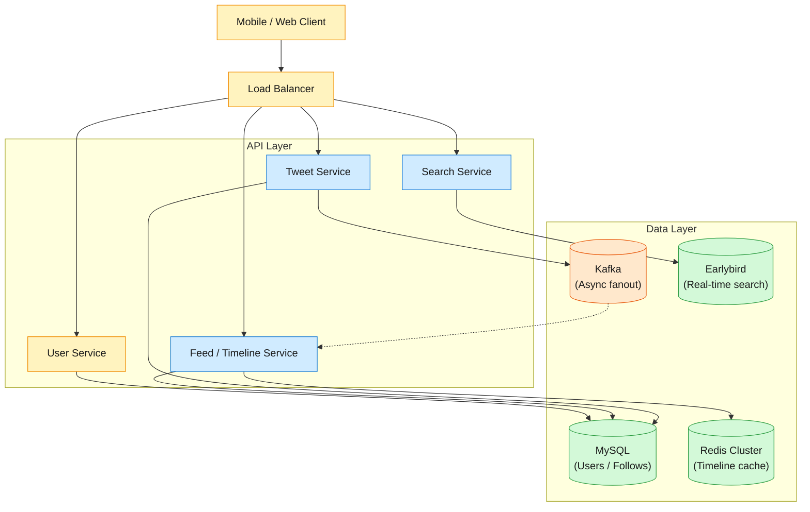

Design a real-time social platform supporting 330M MAU that lets users post tweets (text + media), build timelines of tweets from followed users, search across all public tweets in real time, and discover trending topics.

<!--more-->

## 1. Problem
Design a real-time social platform supporting 330M MAU that lets users post tweets (text + media), build timelines of tweets from followed users, search across all public tweets in real time, and discover trending topics. The system must handle Twitter's extreme read-write asymmetry (~50:1), the celebrity problem (a single user with 100M+ followers), and sub-second timeline delivery latency.

## 2. Requirements

**Functional**

- FR1: Post a tweet with text and optional media

- FR2: View a home timeline of tweets from followed users

- FR3: View a user's profile timeline

- FR4: Search tweets by keyword and hashtag

- FR5: Follow/unfollow other users

- FR6: Return trending topics

**Non-functional**

- NFR1: Timeline delivery P99 < 1s for 99% of users

- NFR2: Tweet write P99 < 200ms

- NFR3: 99.99% durability for accepted tweets

- NFR4: Read-heavy 50:1 — optimize for reads

*Out of scope: DMs, Spaces, X Premium subscriptions, Grok integration, Circles, monetization*

## 3. Back of the envelope
- **Write peak:** 600M tweets/day ÷ 86.4k s × 3 (morning spike) ≈ 21,000 writes/s → ~20K sustained TPS; the write path is throughput-bound but horizontally scalable
- **Read peak (timeline):** 330M MAU × 100 timeline views/day ÷ 86.4k s × 3 ≈ 1.15M reads/s → 1M+ timeline QPS is the real bottleneck; a celebrity tweet fanned out to 100M+ followers is the hardest sub-problem
- **Storage (5y):** 600M tweets/day × 1 KB × 365 × 5 ≈ 1.1 PB → text fits in hot storage; media pushes cold storage to dozens of PB

## 4. Entities

```

User {
  user_id:       uuid        PK
  username:      text        ← unique, max 15 chars
  display_name:  text
  follower_cnt:  integer     ← denormalized for profile display
  following_cnt: integer
  created_at:    timestamp
}

Tweet {
  tweet_id:      uuid        PK
  author_id:     uuid        FK → User.user_id
  text:          text        ← max 280 chars (originally)
  media_ids:     uuid[]?     ← references to Media table
  created_at:    timestamp
  is_deleted:    boolean     ← soft delete
}

Follow {
  follower_id:   uuid        FK → User.user_id
  followee_id:   uuid        FK → User.user_id
  created_at:    timestamp
  CK(follower_id, followee_id)
}

TimelineEntry {
  user_id:       uuid        PK, FK → User.user_id
  tweet_id:      uuid        PK, FK → Tweet.tweet_id
  author_id:     uuid        FK → User.user_id
  tweeted_at:    timestamp
  CK(user_id, tweeted_at)   ← sorted set key for pagination
}


```

### API
- `POST /tweets` — post a tweet, returns tweet_id
- `GET /timeline/home` — home timeline, paginated by cursor
- `GET /users/{id}/tweets` — user's profile timeline
- `GET /search?q=` — search tweets by keyword
- `POST /following` — follow a user
- `DELETE /following/{id}` — unfollow
- `GET /trends` — current trending topics

## 5. High-Level Design

### Overview



### FR1: Post a tweet
The client sends `POST /tweets` to the Tweet Service. It validates length and rate-limits, writes the Tweet row to MySQL, then publishes a `tweet_created` event to Kafka with `{author_id, tweet_id, created_at}`. Returns `201` with the tweet_id immediately — fan-out is async. The Kafka publish is synchronous from the service to avoid losing the fanout event on crash: the write is accepted only when both MySQL and Kafka succeed.

### FR2: View home timeline
The client sends `GET /timeline/home?cursor=X`. The Feed Service checks Redis: each user's timeline is a sorted set `timeline:{user_id}` with score = `tweeted_at`, value = `tweet_id`. Cache hit → return paginated results. Cache miss → fall back to MySQL query of TimelineEntry rows for the user's followees. For regular users (< 1k followees) we push tweets at write time; for celebrities with 10M+ followers we pull — the follower's timeline request merges celebrity tweets at read time.

### FR3: View profile timeline
The client sends `GET /users/{author_id}/tweets?cursor=X`. The Tweet Service queries MySQL tweets WHERE `author_id = :id` ORDER BY `created_at DESC`, paginated. Profile timelines are simple range reads on a secondary index — no fan-out needed. We cache the last N tweets per user in Redis to absorb repeated profile views.

### FR4: Search tweets
The client sends `GET /search?q=keyword&cursor=X`. The Search Service fans out the query to all Earlybird partitions. Each partition searches its in-memory inverted index — per-partition posting lists scored by TF-IDF, recency boost, and author reputation. Results are merged, ranked, and a cursor returned for pagination. Every tweet is indexed within seconds — real-time search, not batch.

### FR5: Follow/unfollow
The client sends `POST /following {followee_id}`. The User Service writes the Follow row to MySQL. If the followee is NOT a celebrity (< 1M followers), it triggers pre-population of the follower's timeline cache from Kafka. For a celebrity follow, we just update the Follow table; timeline merging happens at read time.

### FR6: Trending topics
Tweet Service emits hashtags to a Kafka `hashtag_events` topic. Trending Service consumes them and increments ZINCRBY on Redis sorted sets per time window (1h, 24h). `GET /trends` returns top-N from the active window. Velocity-based scoring: `rate = count_last_15min / count_prior_15min` × base_count, so a sudden spike outranks a steady baseline.

## 6. Deep dives

### DD1: Hybrid feed fan-out (push/pull)
**Problem:** Serving 1M+ timeline reads per second while a single tweet from a 100M+ follower account generates 100M timeline inserts. Pushing to every follower overwhelms the write path; pulling every read from a social graph scan overwhelms the read path.
**Approach 1: Pure push.** Every follower's timeline is pre-populated at write time. Reads are O(1) Redis ZREVRANGE — fast. But a Justin Bieber tweet fans out to 100M+ Redis writes; the POST takes minutes and the service DoSes itself. 95% of users have < 100 followers — the 0.001% with > 10M account for most write amplification.
**Approach 2: Pure pull.** No fan-out on write. Each timeline read scans the follow graph and merges recent tweets. The tweet POST is fast (single MySQL write). But a user following 1,000 accounts generates 1,000 range queries per refresh — the read path collapses.
**Approach 3: Hybrid push/pull (chosen).** A fan-out service classifies each user at follow time. ≤ 1M followers ("regular") → tweets are pushed to all followers' timelines at write time. > 1M followers ("celebrity") → tweets are NOT pushed; followers read the celebrity's tweets from a separate ZSET and merge client-side. Each timeline read fetches the personal timeline + N celebrity ZSETs (usually < 20) and merges chronologically.
💡 **Key insight:** The celebrity threshold is an operational lever. Twitter ran it at 1M for years and moved it adaptively. The 2023 Fanout Service retirement pushed more accounts toward pull as Redis clusters grew to 10K+ instances, making per-followee ZSETs cheap enough for mid-tier accounts.
**Edge cases:**
- **New follower:** one-time backfill of last 200 celebrity tweets into the user's merged timeline
- **Unfollow:** remove celebrity ZSET from the merge set on next read — lazy cleanup
- **Deactivated account:** skip the celebrity's ZSET with a lazy tombstone check

### DD2: Real-time search with Earlybird
**Problem:** Users expect a tweet to appear in search within seconds — not minutes. But building a real-time inverted index supporting 600M tweets/day at 20K writes/s and 10K+ queries/s on constrained hardware is the core tension.
**Approach 1: Batch indexing (MapReduce).** Tweets land in HDFS nightly, MapReduce builds an inverted index, replaces yesterday's. A 9 AM tweet doesn't appear until next morning — unacceptable for real-time.
**Approach 2: Elasticsearch.** Every tweet indexed at write time. But ES at 20K writes/s + 10K queries/s needs a large cluster (Twitter had ~600 ES nodes in 2020 for secondary use cases). Each index write adds 100ms+ to the write path from segment merges, refresh intervals, and replication.
**Approach 3: Earlybird — per-partition in-memory inverted index (chosen).** The corpus is partitioned across ~100 index nodes, each hosting ~2M tweets in memory. The index is a sparse forward index (tweet ID → terms + metadata) and an inverted index (term → sorted tweet IDs with skip pointers). A new tweet arrives via Kafka → the assigned partition appends the new ID to the posting list and updates the forward index in-place.
Scoring: `score(doc) = TF-IDF × recency_boost × author_reputation`. Recency uses logarithmic decay: `1 / (1 + log(1 + hours_since_tweet))`. Concurrency uses read-copy-update with a per-partition write lock — reads proceed on a snapshot while the index updates.
💡 **Key insight:** The real-time index isn't a batch pipeline — it's a streaming data structure treating every arriving tweet as a direct index mutation. The tweet_id serves as both storage key and sort dimension for posting lists, keeping the index append-friendly.
**Edge cases:**
- **Fan-out query:** A query fans out to all 100 partitions; each returns top-N. The Search Service merges up to 10,000 candidates and returns top 20 — milliseconds because each partition pre-sorts
- **Hot keyword:** A term appears in 1M tweets within an hour — posting lists stay sorted by ID with compressed blocks and skip pointers for fast OR queries
- **Delete:** A tombstone list is applied lazily before returning results; tweets stay in posting lists but are filtered from responses
- **Index corruption:** Rebuild from a Manhattan KV checkpoint + Kafka log replay (~5 minutes per partition)

## 7. References
1. [Raffi Krikorian — Timelines at Scale (QCon 2012)](https://www.infoq.com/presentations/Twitter-Timeline-Scalability/)
1. [Earlybird — Real-Time Search at Twitter (ICDE 2012)](https://ieeexplore.ieee.org/document/6228482)
1. [twitter/the-algorithm — Open-source recommendation algorithm (2023)](https://github.com/twitter/the-algorithm)
1. [xai-org/x-algorithm — X's open recommendation pipeline (2026)](https://github.com/xai-org/x-algorithm)
1. [HighScalability — Twitter Architecture 2020](https://highscalability.com/twitter-architecture-2020/)
1. [Twitter Engineering Blog — Fan-out Service Retirement (2023)](https://blog.twitter.com/engineering/en_us/topics/insights/2023/fanout-service-retirement)
