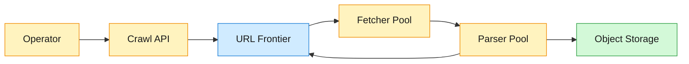
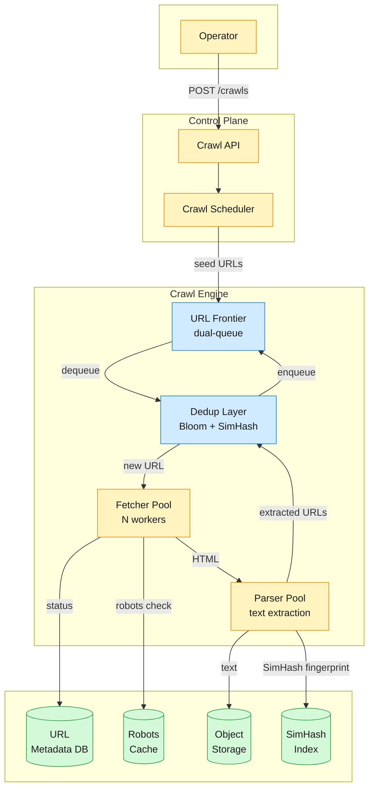

A web crawler that ingests ~10 billion web pages and extracts their text content to build an LLM training dataset. The crawl must complete in under 5 days, fetching pages from hundreds of millions of distinct hosts while respecting per-host rate limits and robots.txt.

<!--more-->

## 1. Problem
A web crawler that ingests ~10 billion web pages and extracts their text content to build an LLM training dataset. The crawl must complete in under 5 days, fetching pages from hundreds of millions of distinct hosts while respecting per-host rate limits and robots.txt. Pages that change frequently (news sites, social feeds) are recrawled more often; static pages are fetched once. The output is a deduplicated text corpus stored in object storage, ready for downstream tokenization and training.



## 2. Requirements

**Functional**

- FR1: Start a crawl from given seed URLs.

- FR2: Fetch HTML pages from discovered URLs.

- FR3: Extract text content and store it.

- FR4: Discover and enqueue new URLs from fetched pages.

**Non-functional**

- NFR1: Crawl 10B pages within 5 days.

- NFR2: Respect per-host rate limits and robots.txt.

- NFR3: Survive individual node failures without losing crawl progress.

- NFR4: Store no duplicate or near-duplicate content.

*Out of scope: full-text indexing, image/video crawling, authentication-gated content, real-time search over the corpus.*

## 3. Back of the envelope
- **Crawl throughput:** 10B pages ÷ (5 days × 86,400 s) ≈ 23,150 pages/s → the fetch pipeline must sustain ~23K req/s; single-machine DNS resolution alone cannot keep up.
- **Bandwidth:** 23,150 pages/s × 500 KB avg page ≈ 11.6 GB/s ≈ 93 Gbps → requires 10+ machines with 10 Gbps NICs; bandwidth, not CPU, is the binding constraint.
- **Storage:** 10B pages × 2 KB extracted text ≈ 20 TB → the text corpus is small; a single object store bucket absorbs it with room to spare.

## 4. Entities

```

CrawlJob {
  job_id:      uuid PK
  seed_urls:   text[]
  status:      enum           ← pending / running / paused / completed / failed
  created_at:  timestamp
}

Url {
  url_id:          uuid PK
  canonical_url:   string CK    ← normalized: lowercase host, sorted params, no fragment
  host:            string       ← partition key for sharding
  priority:        smallint     ← 1 (highest) to 10 (lowest)
  status:          enum         ← pending / in_flight / fetched / failed / skipped
  last_fetched_at: timestamp?
  content_hash:    string?      ← SimHash fingerprint after fetch
}

Page {
  page_id:      uuid PK
  url_id:       uuid FK
  text_content: text
  http_status:  smallint
  fetched_at:   timestamp
  content_hash: string          ← 64-bit SimHash fingerprint
}

RobotsCache {
  host:       string PK
  rules:      jsonb            ← parsed disallow / crawl-delay directives
  cached_at:  timestamp
  ttl:        integer          ← seconds until re-fetch
}


```

### API
- `POST /crawls` — submit a crawl job with seed URLs, returns `job_id`
- `GET /crawls/{job_id}` — get job status, pages fetched, failure count
- `POST /crawls/{job_id}/pause` — pause an active crawl
- `POST /crawls/{job_id}/resume` — resume a paused crawl
- `GET /crawls/{job_id}/failed` — list URLs that exceeded retry budget
- `GET /crawls/{job_id}/export` — download the text corpus as a compressed archive

## 5. High-Level Design



FR1: Start a crawl from given seed URLs
**Components:** Operator → Crawl API → Crawl Scheduler → URL Frontier.
**Flow:**
1. Operator `POST /crawls` with a list of seed URLs and optional config (max depth, crawl rate multiplier).
1. Crawl API validates the seed list, creates a `CrawlJob` row with `status=pending`, returns `job_id`.
1. Crawl Scheduler normalizes each seed URL (lowercase host, strip fragment, sort query params) and assigns an initial priority based on domain reputation and freshness deficit.
1. Scheduler inserts normalized URLs into the URL Frontier's front queues by priority bucket.
1. Scheduler sets the job to `status=running` and begins dequeuing.

**Design consideration:** seed URL quality determines crawl coverage. A poor seed list (e.g., 100 hand-picked domains) produces a shallow crawl biased toward those domains. A strong seed list includes high-PageRank URLs from a prior crawl plus sitemap entries from major hosts. The frontier's priority system ensures high-value seeds are fetched before discovered low-priority URLs, so the crawl achieves broad coverage early.
FR2: Fetch HTML pages from discovered URLs
**Components:** URL Frontier → Dedup Layer → Fetcher Pool → URL Metadata DB.
**Flow:**
1. A fetcher worker calls the frontier's dequeue operation, which returns the highest-priority URL whose host is currently below its rate limit.
1. The fetcher checks the robots.txt cache for the URL's host; if the path is disallowed or the cache is stale, it re-fetches `robots.txt` first.
1. The fetcher issues an HTTP GET with a reasonable timeout (30 s) and a byte limit (2 MB for HTML).
1. On success, raw HTML is passed to the parser pool. On failure (timeout, 5xx, connection error), the URL is re-enqueued with exponential backoff using its retry count.
1. After a configurable number of failed retries (typically 5), the URL is marked `failed` and sent to a dead-letter queue for operator inspection.

**Design consideration:** the fetcher pool is the throughput bottleneck. Each fetcher thread spends ~70% of its wall-clock time on DNS resolution and TCP handshakes (Mercator measured this in 1999; the ratio holds today for a wide crawl). A DNS cache shared across all fetcher workers on a node, with a TTL matching the DNS record, cuts resolution time by ~90% for repeat hosts. Multiple DNS providers in round-robin prevent any single resolver from becoming a throttle point.
FR3: Extract text content and store it
**Components:** Parser Pool → Object Storage → SimHash Index.
**Flow:**
1. A parser worker receives raw HTML from a fetcher, strips tags and scripts, and extracts visible text.
1. A 64-bit SimHash fingerprint is computed over the tokenized text using TF-IDF-weighted feature hashing.
1. The fingerprint is checked against the SimHash index using Block-Permuted Hamming Search (k=3 bits). If a near-duplicate is found, the page is discarded and the URL is marked `skipped`.
1. If the content is novel, the extracted text is written to object storage keyed by `job_id/content_hash` and the URL's metadata row is updated with `status=fetched` and the `content_hash`.

**Design consideration:** object storage writes are cheap and the text per page is small (~2 KB), so the parser writes each page individually rather than batching. This keeps the parser stateless — a parser crash mid-page loses only that one page, not a batch of thousands. The trade-off is more PUT requests (~23K/s), but object stores handle this easily with automatic sharding.

```json
// Page stored in object storage
{
  "url": "https://example.com/article/123",
  "fetched_at": "2026-07-01T10:30:00Z",
  "text": "The quick brown fox jumps over the lazy dog...",
  "content_hash": "a1b2c3d4e5f67890"
}


```

FR4: Discover and enqueue new URLs from fetched pages
**Components:** Parser Pool → Link Extractor → Dedup Layer → URL Frontier.
**Flow:**
1. The parser extracts all `<a href="...">` links from the fetched HTML.
1. Each extracted URL is canonicalized (lowercase host, strip fragment, sort query params, resolve relative paths).
1. The canonical URL passes through the dedup layer: first a Bloom filter check, then a secondary exact lookup in the URL Metadata DB for the ~1% of URLs that survive the Bloom filter.
1. URLs confirmed as new are assigned a priority (lower for deep links, higher for pages from high-authority domains) and enqueued into the URL Frontier's front queues.
1. URLs linking to hosts already at their politeness limit are deferred to the back queue for that host.

**Design consideration:** link extraction is the engine that drives crawl discovery. The priority assignment function is load-bearing — without it, the frontier degenerates into BFS and high-value pages are buried under deep link trees. The prioritizer scores each URL as `base_priority + freshness_bonus + domain_authority_bonus`, where `base_priority` decreases with depth from the nearest seed and `domain_authority_bonus` is a pre-computed score per host from a prior crawl's link graph.

## 6. Deep dives

### DD1: URL Frontier
**Problem.** The frontier must satisfy three constraints at once: (a) schedule URLs by priority so high-value pages are fetched first, (b) enforce per-host politeness so no single server is overwhelmed, and (c) deduplicate so no URL is fetched twice. A single data structure cannot satisfy both priority ordering and per-host rate limiting because priority and politeness are orthogonal dimensions — a high-priority URL from a slow server must be deferred, and a low-priority URL from a fast server should not starve.
**Approach 1: Single shared priority queue**
A single priority queue where each URL carries a `(priority, host, next_allowed_time)` tuple. The fetcher pops the highest-priority URL whose `next_allowed_time` has passed.

```javascript
dequeue():
    while True:
        url = heap.peek()
        if url.next_allowed_time <= now():
            heap.pop()
            return url
        sleep(min_time_to_wait)


```

**Challenges:** the heap must be scanned for the first eligible URL, which degenerates to O(N) when many hosts are rate-limited. Under heavy politeness (thousands of hosts in cooldown), fetcher threads spin scanning ineligible entries while eligible URLs sit deep in the heap. Throughput collapses.
**Approach 2: Mercator dual-queue frontier**
Two tiers of queues — front queues for priority, back queues for politeness — with a heap scheduler bridging them.

```javascript
┌───────────────────────────┐
│  Front Queues (priority)   │
│  [Q1: highest] ... [Qk]    │
└──────────┬────────────────┘
           │ biased random draw
           ▼
┌───────────────────────────┐
│  Back Queues (per-host)    │
│  [host_a] [host_b] ...     │
└──────────┬────────────────┘
           │ heap by next_allowed_time
           ▼
┌───────────────────────────┐
│     Fetcher Workers        │
└───────────────────────────┘

```

Front queues: k FIFO queues, one per priority level (k=10). A URL lands in the queue matching its priority score. The queue selector draws from front queues with probability proportional to priority — the highest-priority queue is sampled most often.
Back queues: n FIFO queues (n ≈ 3 × number of fetcher threads). Each back queue holds URLs from exactly one host. A mapping table `host → back_queue_id` routes every URL to the correct back queue, ensuring politeness: all URLs from the same host land in the same queue and are fetched by one thread at a time.
A min-heap of `(back_queue_id, next_allowed_time)` tuples schedules the fetchers. A fetcher pops the root of the heap, waits until `next_allowed_time`, and fetches one URL from that back queue.

```javascript
def dequeue():
    (q_id, next_time) = heap.pop_min()
    wait_until(next_time)

    url = back_queues[q_id].pop()
    fetch_time = fetch(url)
    politeness_delay = now() + 10 * fetch_time

    if back_queues[q_id].is_empty():
        # Refill from front queues
        while True:
            front_q = biased_random_front_queue()
            candidate = front_q.pop()
            if candidate is None:
                break
            host_q = host_map.get(candidate.host)
            if host_q is None:
                back_queues[q_id].push(candidate)
                host_map[candidate.host] = q_id
                break
            else:
                back_queues[host_q].push(candidate)

    heap.insert(q_id, politeness_delay)
    return url

```

**Challenges:** the dual-queue is a single-machine data structure. At 23K pages/s, the frontier's in-memory queues and heap become a bottleneck — one machine must coordinate all fetcher threads. At 10B pages, the URL backlog exceeds RAM; Mercator solves this with on-disk FIFO queues (600-URL in-memory buffers, bulk on disk), but disk I/O becomes the new limit.
**Approach 3: Kafka-partitioned distributed frontier**
Each crawler node owns a subset of hosts (determined by consistent hashing on hostname) and runs its own local dual-queue frontier. URLs are routed to the owning node via a Kafka topic partitioned by `host_hash`.

```javascript
URL Frontier Topic (256 partitions, keyed by host_hash)
       │
       │ Kafka consumer group
       ▼
┌──────────────┐  ┌──────────────┐  ┌──────────────┐
│ Crawler 1    │  │ Crawler 2    │  │ Crawler N    │
│ local f-q    │  │ local f-q    │  │ local f-q    │
│ per-host b-q │  │ per-host b-q │  │ per-host b-q │
│ local heap   │  │ local heap   │  │ local heap   │
└──────────────┘  └──────────────┘  └──────────────┘

```

Each crawler runs its own dual-queue frontier scoped to the hosts it owns. Kafka guarantees that all URLs from `cnn.com` land on the same partition and are consumed by the same crawler node. The politeness state (last fetch time, rate limit window) for `cnn.com` is local to that node — no distributed locking, no cross-node coordination.
When a crawler discovers a new URL, it publishes to the Kafka topic with `key=hash(host)`. Kafka routes it to the owning partition. If a crawler node fails, Kafka reassigns its partitions to surviving nodes; the new owner rebuilds its local frontier from the partition's retained messages.
**Decision:** Approach 3 (Kafka-partitioned distributed frontier) with each node running the dual-queue (Approach 2) locally. Kafka handles host-to-node assignment and failure recovery; the dual-queue handles intra-node priority and politeness. 256 partitions support up to 256 crawler nodes without re-partitioning.
**Rationale:** the dual-queue is the canonical solution to the priority/politeness tension, proven since the 1999 Mercator paper. Wrapping it in Kafka partitions eliminates the single-machine bottleneck while preserving the locality property — a host's politeness clock never crosses machine boundaries. At 256 partitions and ~23K pages/s, each partition handles ~90 pages/s, well within a single node's dual-queue capacity.
**Edge cases:**
- **Empty front queues:** if all front queues are empty, the heap returns no eligible back queue. The fetcher blocks until new URLs arrive via discovery or the operator adds seeds. A low-watermark alert notifies the operator.
- **Host migration on rebalance:** when a crawler node joins or leaves, Kafka reassigns partitions. The new owner replays the partition from the last committed offset, rebuilding its local back-queue state. URLs fetched by the previous owner but not yet acknowledged are re-delivered (at-least-once semantics); the dedup layer catches them.
- **Hot host (millions of URLs from one domain):** a back queue for a single large host can grow unboundedly. The BEAST-style budget cap limits any one host to ~10K pending URLs in the back queue; excess URLs are pushed to a low-frequency disk queue.

### DD2: URL Deduplication
**Problem.** With 10B+ URLs to crawl and each fetched page producing tens of new links, the system must answer "have I seen this URL before?" ~500K times per second. A hash set in memory at 60 bytes per URL needs ~600 GB — too large and too expensive. A database round-trip per check kills throughput at 23K fetches/s.
**Approach 1: In-memory hash set**
Store every seen URL's canonical form in a distributed hash set across crawler nodes. A lookup is O(1) and exact — no false positives.

```javascript
seen_urls = DistributedHashSet(partition_by=host_hash)

def is_new(url):
    return canonicalize(url) not in seen_urls

```

**Challenges:** at 10B URLs and ~60 bytes per entry (string + overhead), the hash set requires ~600 GB of RAM. Distributing it across 10 nodes still costs 60 GB per node — expensive but not impossible. The real problem is that the set must be rebuilt from scratch for each crawl (URLs from a prior crawl are stale), and rebuilding a 600 GB distributed data structure takes hours.
**Approach 2: Bloom filter — fast probabilistic check**
A Bloom filter at 10 bits per entry. For 10B URLs: 10 bits × 10B = 100 Gbits = 12.5 GB total. With k=7 hash functions, the false-positive rate is ~0.8%.

```javascript
def add(url, bloom_filter):
    for i in range(k):
        bit = hash_i(url) % m
        bloom_filter[bit] = 1

def is_new(url, bloom_filter):
    for i in range(k):
        if bloom_filter[hash_i(url) % m] == 0:
            return True   # definitely not seen
    return False          # probably seen (false positive ~0.8%)


```

The Bloom filter has zero false negatives — if it says "not seen," the URL is guaranteed new. A false positive (the filter says "seen" for a new URL) means ~1 in 120 genuinely new URLs is skipped. The URL will be rediscovered through a different link path on a different page and retried.
**Challenges:** the 0.8% false-positive rate means 80M genuinely new URLs are skipped across 10B checks. Not fatal — most are rediscovered — but the Bloom filter cannot be cleared or shrunk during a crawl. It grows monotonically.
**Approach 3: Two-tier check — Bloom filter + exact KV lookup**
A fast Bloom filter fronted by a persistent key-value store for exact confirmation.

```javascript
def is_new(url):
    canonical = canonicalize(url)
    if bloom_filter.probably_seen(canonical):
        # Secondary exact check
        result = url_db.get(canonical)
        return result is None
    else:
        # Definitely new — fast path (99% of checks)
        bloom_filter.add(canonical)
        return True

```

- Bloom filter (12.5 GB in Redis Cluster): handles ~99% of checks in <0.1 ms.
- URL Metadata DB (sharded by host_hash): handles the ~1% that pass the Bloom filter with an exact key lookup. Stores `(canonical_url, status, last_fetched_at, content_hash)`.
The Bloom filter sits in front — 99% of URL checks return "definitely new" and never touch the DB. The 1% that might be duplicates get an exact DB lookup. After confirming a URL is new, the canonical form is written to the DB and added to the Bloom filter.
**Decision:** Approach 3 (two-tier: Bloom filter + exact KV lookup). The Bloom filter absorbs the read volume; the KV store provides exactness for the small fraction that need it. The Bloom filter is rebuilt from the URL DB at crawl start (a one-time cost of ~10 minutes scanning 10B rows) rather than checkpointed, avoiding stale-state bugs.
**Rationale:** 12.5 GB fits comfortably in a single Redis Cluster shard. The two-tier design decouples read throughput (Bloom filter, O(1) with no network call when colocated) from correctness (DB, exact). At 500K checks/s with 99% hitting the Bloom filter fast path, only 5K checks/s reach the DB — easily handled by a sharded Postgres or Cassandra cluster.
**Edge cases:**
- **Bloom filter saturation:** as the filter fills past ~75%, the false-positive rate rises above 1%. A monitoring threshold triggers a rebuild from the current URL DB snapshot. The brief window of rebuilding (minutes) uses a secondary Bloom filter.
- **URL canonicalization inconsistency:** two URLs that differ only in trailing slash or `www.` prefix must map to the same canonical form. The canonicalizer applies a fixed rule set: lowercase scheme+host, remove default port, sort query params alphabetically, strip fragment, remove trailing slash, strip `www.` prefix. A regression test suite of known-collision pairs runs before each crawl.

### DD3: Content Deduplication
**Problem.** After URL dedup, two different URLs may serve identical or near-identical content — mirrors, CDN variants, scraped articles with different boilerplate, the same press release on 50 news sites. Studies of large web corpora show ~30% of fetched pages are near-duplicates of content already seen. Storing them wastes object storage and bloats the training corpus with redundant text, which degrades LLM output quality.
**Approach 1: Full-content hash (SHA-256)**
Compute a SHA-256 hash of the extracted text. If the hash matches an existing entry, discard the page.

```javascript
content_hash = sha256(extracted_text)
if content_hash in seen_hashes:
    skip()
else:
    store(text, content_hash)
    seen_hashes.add(content_hash)


```

**Challenges:** this catches exact duplicates (byte-for-byte identical content under different URLs) but misses near-duplicates — the same article with a different byline, timestamp, or sidebar ad. In a web corpus of 10B pages, exact duplicates are ~5% of content; the other ~25% are near-duplicates that SHA-256 misses. A full-content hash also requires the entire text to be in memory before hashing, preventing streaming.
**Approach 2: SimHash with Block-Permuted Hamming Search**
A 64-bit SimHash fingerprint captures the "essence" of a document. Near-duplicate documents produce fingerprints differing in only a few bits (Hamming distance ≤ k).

```javascript
def simhash(document):
    v = [0] * 64
    for (feature, weight) in extract_weighted_features(document):
        h = murmurhash64(feature)
        for i in range(64):
            if (h >> i) & 1:
                v[i] += weight
            else:
                v[i] -= weight

    fingerprint = 0
    for i in range(64):
        if v[i] > 0:
            fingerprint |= (1 << i)
    return fingerprint

```

The key property: two documents differing in a small fraction of their weighted features produce SimHash fingerprints with small Hamming distance. For web pages, k=3 bits is the validated threshold (Manku et al., WWW 2007, on an 8B-page corpus).
**Finding near-duplicates at scale:** a naive pairwise Hamming distance check across 10B fingerprints is impossible. Block-Permuted Hamming Search (BPHS) solves this:
1. Split the 64-bit fingerprint into 4 blocks of 16 bits.
1. Maintain 4 permuted index tables. In table i, fingerprints are sorted by block i as the prefix.
1. To query fingerprint F: for each block i, extract the 16-bit prefix, probe table i for all fingerprints sharing that prefix, and compute Hamming distance against only those candidates.
1. With k=3 and 4 blocks, at most 0 bits differ in the matching block — only exact block matches are candidates.

```javascript
def find_near_duplicates(fp, index, k=3):
    blocks = split_into_blocks(fp, 4)  # 4 blocks, 16 bits each
    candidates = set()
    for i in range(4):
        prefix = blocks[i]
        candidates.update(index[i].get(prefix))
    return [c for c in candidates if hamming_distance(fp, c.fp) <= k]

```

**Challenges:** the SimHash index requires ~4× the fingerprint storage (one copy per permutation). For 10B fingerprints at 8 bytes each: 4 × 80 GB = 320 GB RAM. This is large but manageable across a small cluster. The index must be updated incrementally as new pages arrive; each insert touches 4 permuted tables.
**Decision:** Approach 2 (SimHash + BPHS) for near-duplicate detection, combined with a fast exact-hash check (Approach 1) as a pre-filter. The SHA-256 check catches the ~5% of exact duplicates in microseconds; the remaining 95% pass through to SimHash, which catches the ~25% near-duplicate rate.
**Rationale:** the 64-bit SimHash fingerprint is compact enough to index billions of documents. The k=3 threshold was validated on a production-scale 8B-page corpus and achieves ~75% precision and ~75% recall for near-duplicate detection — good enough to cut the training corpus by ~25% with minimal false removals. The SHA-256 pre-filter is a cheap optimization that prevents the expensive BPHS lookup for exact duplicates.
**Edge cases:**
- **Short documents:** pages with <200 characters of text produce unstable SimHash fingerprints (few features → high variance). These pages skip SimHash and are stored unconditionally. The training pipeline's own dedup pass handles them later.
- **Language-dependent feature extraction:** TF-IDF weighting requires a tokenizer that handles the document's language. The parser runs language detection (CLD2-style) and selects the appropriate tokenizer. Pages in languages without a configured tokenizer fall back to character 4-gram features.
- **Incremental index growth:** the SimHash index grows with each new page. At ~50M new fingerprints per hour, the index must support concurrent reads (dedup checks) and writes (new insertions). A read-write lock per block-group (the 16-bit prefix shard) keeps contention low — writes to block group `0xABCD` block reads only for that group, not the whole index.

> [!TIP]
> **Why not MinHash for near-duplicate detection?** MinHash (used by shingling-based approaches) estimates Jaccard similarity rather than cosine similarity. For web pages where boilerplate (navigation, footer) dominates, Jaccard similarity inflates the duplicate signal — two pages with different content but identical navigation score as high-similarity. SimHash with TF-IDF weighting suppresses boilerplate terms because they appear in nearly every document and carry near-zero weight. The fingerprint captures the distinctive content, not the shared template.

### DD4: Adaptive Politeness
**Problem.** A fixed per-host delay (e.g., 5 seconds between requests) protects slow servers but wastes capacity on fast ones. A well-provisioned CDN-backed news site can handle 10+ req/s; a small WordPress blog on shared hosting might handle 0.2 req/s. The crawler's aggregate throughput is the sum of every host's effective rate — using a single conservative delay for all hosts leaves 80%+ of available capacity on the table.
**Approach 1: Fixed per-host delay**
A global configuration value — e.g., 5 seconds between successive requests to any host. Simple to implement and guaranteed polite.
**Pro:** trivially correct — no host ever receives more than 1 request per 5 seconds. No state beyond a `last_fetch_time` per host.
**Con:** a fast server that can handle 10 req/s gets 0.2 req/s — 50× underutilization. A slow server that times out at 2 seconds gets hit again after 5 seconds, potentially compounding the problem. Aggregate throughput is `N_hosts / delay`, not `sum(host_capacity)`.
**Approach 2: k× multiplier — delay proportional to last fetch time**
After each fetch, the next allowed time is set to `now + k × last_fetch_duration`. A fast server (50 ms response) gets a 500 ms delay (k=10). A slow server (3 s response) gets a 30 s delay.

```javascript
def fetch_and_update(url, host):
    start = now()
    response = http_get(url)
    fetch_duration = now() - start
    back_queues[host].next_allowed = now() + 10 * fetch_duration
    return response

```

**Pro:** automatically biases throughput toward responsive servers. No manual tuning per host. The crawler consumes a bounded fraction (~10%) of each server's capacity regardless of its speed. This is the "strong politeness guarantee" — the crawler cannot overwhelm any server because it self-throttles proportionally.
**Con:** the multiplier is static (k=10). A server that consistently responds in 10 ms gets 100 ms delay → 10 req/s — appropriate for a static file server but aggressive for a dynamic page server that happens to be fast. Server errors (500, 503) don't trigger immediate backoff; the delay is still based on the fetch duration, which may be short even when the server is failing.
**Approach 3: Closed-loop server health control**
The crawl rate per host is adjusted continuously based on observed signals: response time trend, error rate, and HTTP status codes. A 429 (Too Many Requests) or a spike in 500/503 responses triggers immediate rate reduction for the entire hostname, not just the URL.

```javascript
def adjust_rate(host, response):
    if response.status in (429, 503):
        host.rate_limit = max(host.rate_limit / 2, min_rate)
        host.cooldown_until = now() + 60
    elif response.status >= 500:
        host.error_streak += 1
        if host.error_streak >= 3:
            host.rate_limit = host.rate_limit * 0.5
    else:
        host.error_streak = 0
        # Gradually increase rate toward max — additive increase
        host.rate_limit = min(host.rate_limit * 1.1, max_rate)

    host.next_allowed = now() + (1.0 / host.rate_limit)


```

**Pro:** responds to actual server health rather than assuming a fixed relationship between response time and capacity. Prevents the crawler from hammering a degraded server while allowing it to ramp up on healthy ones. The multiplicative decrease on errors and additive increase on success is the same AIMD principle that governs TCP congestion control — well-understood and stable.
**Con:** requires per-host state with multiple fields (error streak, current rate, cooldown timer). State must survive crawler node restarts. The ramp-up after cooldown is slow (10% increase per successful fetch), so a server that recovered quickly is underutilized for minutes.
**Decision:** Approach 2 (k× multiplier) as the baseline politeness mechanism, with Approach 3's error-signal overrides layered on top. The k× multiplier handles the steady state — fast servers get proportionally more traffic. The error-signal overrides handle the transient state — a server returning 429 or a burst of 500s gets immediate rate reduction regardless of fetch duration.
**Rationale:** the k× multiplier is simple, stateless beyond `last_fetch_duration`, and provides the strong politeness guarantee: the crawler never consumes more than a fixed fraction of any server's resources. It has been the baseline of production crawlers since the 1999 Mercator paper. The error-signal overrides add ~3 fields of per-host state but close the gap where a fast-failing server would otherwise get fast retries. The combined approach requires no manual tuning per host and adapts automatically as server capacity changes.
**Edge cases:**
- **Redirects (301/302):** the fetch duration for a redirect is short (the server responds quickly with the redirect). The k× multiplier would assign a short delay, but the redirect target is a different host. The politeness clock applies to the original host, not the target — redirects don't consume the target server's capacity until the redirect is followed.
- **Robots.txt ****`Crawl-delay`**** directive:** when a host's robots.txt specifies an explicit `Crawl-delay: N`, that value overrides the k× multiplier. N is the minimum delay; the k× multiplier only applies if it would produce a longer delay. This preserves compliance with explicit site-owner preferences.
- **DNS failures:** a DNS resolution failure is not a server error — the host isn't being overloaded, it's unreachable. The URL is re-enqueued with a fixed 60 s backoff. The politeness clock for the host is not updated (no fetch occurred), so other URLs from the same host can proceed when DNS recovers.

## 7. Trade-offs

| Decision | Rejected alternative | Why |

|---|---|---|
| Dual-queue frontier (front for priority, back for politeness) | Single Kafka topic with per-host consumer-group assignment | Kafka's consumer-group rebalancing does not respect priority — all partitions are equal. The dual-queue front layer provides biased priority selection that Kafka alone cannot express. |
| Bloom filter + exact DB for URL dedup | In-memory hash set | 600 GB vs 12.5 GB. The 0.8% false-positive rate is acceptable because skipped URLs are rediscovered through alternate link paths. |
| SimHash (k=3) for content dedup | Full SHA-256 only | SHA-256 catches ~5% exact duplicates, SimHash catches an additional ~25% near-duplicates. The BPHS index costs ~320 GB RAM but reclaims ~2.5B pages of storage. |
| Kafka-hosted frontier with local dual-queue per node | Centralized dual-queue with RPC-based fetcher coordination | Centralized queue is a single-machine bottleneck at 23K pages/s. Kafka partitioning scales linearly with nodes and eliminates cross-node coordination for politeness. |
| k× multiplier politeness with error-signal overrides | Fixed 5 s per-host delay | Fixed delay wastes ~80% of fast-server capacity. The adaptive approach recovers that throughput while maintaining the strong politeness guarantee on slow servers. |
| Stateless parser (one write per page) | Batch parser (accumulate N pages before writing) | Stateless parsers survive crashes without batch loss. At 2 KB per page, the PUT overhead (~23K/s) is well within object store limits. |

## 8. References
1. Najork, M., & Heydon, A. (1999). ["Mercator: A Scalable, Extensible Web Crawler"](https://marc.najork.org/papers/src173.pdf). World Wide Web, 2(4), 219–229.
1. Olston, C., & Najork, M. (2010). ["Web Crawling"](http://i.stanford.edu/~olston/publications/crawling_survey.pdf). Foundations and Trends in Information Retrieval, 4(3), 175–246.
1. Manku, G. S., Jain, A., & Das Sarma, A. (2007). ["Detecting Near-Duplicates for Web Crawling"](https://static.googleusercontent.com/media/research.google.com/en//pubs/archive/33026.pdf). WWW 2007.
1. Lee, H.-T., Leonard, D., Wang, X., & Loguinov, D. (2008). ["IRLbot: Scaling to 6 Billion Pages and Beyond"](https://irl.cse.tamu.edu/people/hsin-tsang/papers/www2008.pdf). WWW 2008.
1. Boldi, P., Marino, A., Santini, M., & Vigna, S. (2014). ["BUbiNG: Massive Crawling for the Masses"](https://archives.iw3c2.org/www2014/proceedings/companion/p227.pdf). WWW 2014 Companion.
1. Peng, D., & Dabek, F. (2010). ["Large-scale Incremental Processing Using Distributed Transactions and Notifications"](https://research.google/pubs/large-scale-incremental-processing-using-distributed-transactions-and-notifications/). OSDI 2010.
1. Manning, C. D., Raghavan, P., & Schutze, H. (2008). ["Web crawling and indexes"](https://nlp.stanford.edu/IR-book/html/htmledition/the-url-frontier-1.html). Introduction to Information Retrieval, Ch. 20.

